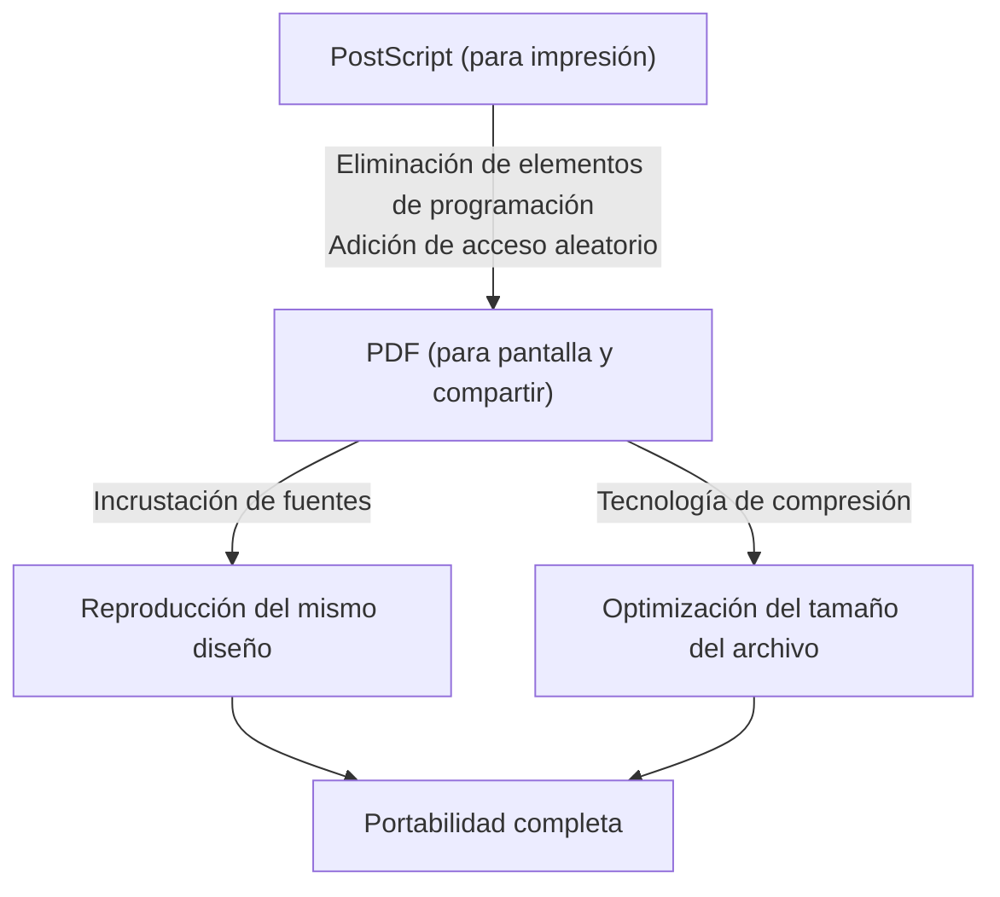

## Introducción: La necesidad del "papel" en el mundo digital

En los negocios y la vida cotidiana de hoy en día, no hay un solo día en el que no veamos un PDF (Portable Document Format). Contratos, manuales, facturas, artículos académicos e incluso menús de restaurantes; todo tipo de documentos se comparten como PDF. Sin embargo, en los albores de la informática, crear "un documento que se viera igual en cualquier terminal" era un sueño inalcanzable.

El entorno informático de los años 80 estaba mucho más fragmentado que en la actualidad. Windows, Macintosh, estaciones de trabajo UNIX y MS-DOS; varios sistemas operativos coexistían y cada uno tenía su propio formato de fuente, motor de renderizado y formato de archivo. Era habitual que, si la persona A creaba un documento con un diseño hermoso en una Mac, cuando la persona B lo abría en Windows, las fuentes fueran reemplazadas, el diseño se rompiera y las imágenes no se mostraran.

Fueron los fundadores de Adobe Systems (actualmente Adobe) quienes intentaron resolver este problema y crear "el papel en el mundo digital". En este artículo, profundizaremos en la historia y los antecedentes técnicos de cómo nació el PDF, cómo superó las barreras técnicas y cómo evolucionó hasta convertirse en un formato de documento estándar mundial con validez legal.

## La revolución de PostScript y el amanecer del DTP

Al hablar de la historia del PDF, es imposible evitar la existencia del lenguaje de descripción de páginas llamado "PostScript".

En 1982, John Warnock y Charles Geschke, quienes trabajaban en el Centro de Investigación de Palo Alto (PARC) de Xerox, estaban desarrollando un lenguaje de programación para impresiones de alta calidad independientemente del dispositivo. Sin embargo, como no había perspectivas de que esa tecnología se comercializara rápidamente dentro de Xerox, se independizaron y fundaron Adobe Systems. Y lo que completaron fue PostScript.

### El concepto de independencia del dispositivo

Las impresoras de aquella época recibían datos de texto y códigos de control simples enviados desde el ordenador, e imprimían utilizando fuentes de mapa de bits integradas como hardware dentro de la impresora. Por lo tanto, si cambiaba el modelo de la impresora, el resultado de la impresión también cambiaba, y era difícil imprimir figuras complejas o curvas suaves.

PostScript adoptó un enfoque completamente diferente. Describía la apariencia del documento como "datos vectoriales matemáticos". Elementos como texto, líneas rectas, curvas e imágenes se enviaban a la impresora como un conjunto de fórmulas matemáticas y comandos. La impresora contenía internamente una especie de pequeña computadora llamada "intérprete PostScript", que interpretaba (rasterizaba) el programa recibido en el acto y lo imprimía con la resolución más alta que poseía.

Como resultado, incluso los documentos creados con una resolución aproximada en la pantalla se imprimían con una calidad extremadamente hermosa en impresoras láser de alta resolución y prensas comerciales. En 1985, PostScript se integró en la "LaserWriter" de Apple, y la combinación de "Macintosh", "PageMaker" y "LaserWriter" dio origen a una nueva industria llamada Autoedición (Desktop Publishing o DTP).

## Camelot Project: La misma experiencia también en la pantalla

PostScript trajo una revolución a la industria de la impresión, pero tenía una debilidad. Esa debilidad era que, al ser "un lenguaje de programación muy complejo, era demasiado pesado para mostrarse rápidamente en una pantalla". Un archivo PostScript podía incluir bucles y ramas condicionales, y no se sabía cómo se vería la página final hasta que terminara de realizar los cálculos.

A principios de la década de 1990, con la popularización de Internet a la vuelta de la esquina, John Warnock escribió un breve artículo interno titulado "The Camelot Project" (El Proyecto Camelot).

> "Nuestro objetivo es asegurar que cualquier documento de cualquier plataforma pueda ser capturado digitalmente, transferido a cualquier computadora, visualizado en cualquier pantalla e impreso en cualquier impresora."

Lo que Warnock imaginaba era un formato de documento que pudiera compartirse conservando completamente el aspecto previsto por el creador, sin verse afectado en absoluto por las diferencias en el sistema operativo, la aplicación o incluso las fuentes instaladas localmente.

### El nacimiento del PDF

El PDF nació del Proyecto Camelot. Aunque el PDF se basaba en la tecnología PostScript, eliminó elementos como lenguaje de programación (como bucles y estados de variables) para lograr un renderizado rápido en pantalla y acceso aleatorio (la capacidad de saltar a cualquier página inmediatamente).

En su lugar, el PDF se estructuró como una colección de objetos de dibujo independientes por cada página. Esto hizo posible que, incluso para un documento de 1000 páginas, el sistema no necesitara calcular desde la primera página en orden, permitiendo mostrar instantáneamente la página 500.

En 1993, Adobe lanzó el software "Acrobat" para crear y ver archivos PDF. Inicialmente, la aplicación de visualización "Acrobat Reader" también era de pago (50 dólares), por lo que su adopción fue lenta. Sin embargo, Adobe pronto tomó la decisión estratégica de distribuir Reader de forma gratuita. Esta medida tuvo éxito y el PDF comenzó a popularizarse explosivamente.

## Estructura básica y avances técnicos del PDF

Para que el PDF funcionara como "papel electrónico", fueron necesarios varios avances técnicos importantes.

### 1. Incrustación de fuentes (Font Embedding)

Una de las tecnologías más importantes es la "incrustación de fuentes". En los archivos de los procesadores de texto tradicionales (por ejemplo, los primeros documentos de Word), solo se guardaba el "código del carácter" y el "nombre de la fuente (por ejemplo: MS Gothic)". Si la fuente no estaba instalada en la PC del espectador, el sistema operativo la sustituía por otra fuente, lo que cambiaba el ancho de los caracteres, desplazaba las posiciones de salto de línea y arruinaba el diseño.

El PDF tiene la función de empaquetar los datos de forma (contorno) de la fuente utilizada dentro del propio archivo. Esto permite mostrar el texto maravillosamente, exactamente como fue creado, incluso si esa fuente no existe en absoluto en el dispositivo del espectador. Además, para mantener el tamaño del archivo reducido, se desarrolló una tecnología llamada "incrustación de subconjunto", que extrae e incrusta únicamente los datos de los caracteres que se utilizan realmente en el documento.

### 2. Integración de gráficos vectoriales e imágenes rasterizadas

El PDF cuenta con un potente motor de dibujo de gráficos vectoriales heredado de PostScript. Como los logotipos de empresas y los gráficos se mantienen como datos vectoriales, los bordes nunca se pixelan (efecto de sierra) sin importar cuánto se amplíen. Al mismo tiempo, también puede incrustar de manera flexible imágenes rasterizadas como fotografías (datos de píxeles comprimidos en JPEG o ZIP).

### 3. Estructura interna del archivo (árbol y referencias cruzadas)

Si miras el contenido de un archivo PDF con un editor de texto, comienza con un encabezado como `%PDF-1.4`, seguido de muchos "objetos (diccionarios, matrices, secuencias, etc.)".
La gran ventaja del PDF es que tiene una "Tabla de referencias cruzadas (Cross-Reference Table)" al final del archivo. Esta tabla registra la posición (byte offset) de todos los objetos dentro del archivo.

Cuando un lector de PDF abre el archivo, primero lo lee desde el final y obtiene la tabla de referencias cruzadas. Por lo tanto, cuando se necesitan los datos de una página específica, puede referirse a la tabla y leer desde el disco exactamente los datos necesarios sin analizar todo el archivo. Esta es la razón por la que incluso los archivos PDF enormes funcionan a alta velocidad.

## Evolución como documento digital: Firmas electrónicas y seguridad

El PDF no solo sirve para "ver material impreso en una pantalla", sino que ha evolucionado para funcionar como el documento "original" en el entorno empresarial.

### Firmas electrónicas (Digital Signatures) y criptografía de clave pública

La mayor preocupación al digitalizar contratos y documentos oficiales es la "prueba de que no han sido alterados" y la "prueba de que fueron creados por el propio autor". El PDF incorporó a nivel de formato especificaciones de firma electrónica utilizando una Infraestructura de Clave Pública (PKI).

Al calcular el valor hash del documento, encriptarlo con la clave privada del firmante e incrustarlo en el PDF, se implementó un sistema por el cual la firma se invalida si posteriormente se modifica incluso un solo byte del contenido. Gracias a esto, el PDF adquirió un valor probatorio legal equivalente o superior al de estampar un sello en un papel.

### Seguridad y control de acceso

El PDF también implementa potentes funciones de cifrado (como AES-256). Además de una "contraseña de apertura" para abrir el documento, es posible asignar al propio archivo configuraciones de permisos detalladas (contraseña de permisos), como prohibir la impresión, la copia de texto o la extracción de páginas.

## El camino hacia el estándar mundial (ISO 32000)

Durante muchos años, el PDF fue un formato propietario de Adobe Systems. Sin embargo, Adobe publicó sus especificaciones de forma gratuita, permitiendo que cualquiera desarrollara software de creación o visualización de PDF. Esto generó un enorme ecosistema de terceros.

Finalmente, en 2008, Adobe renunció al control total del PDF y lo cedió a la Organización Internacional de Normalización (ISO). De este modo, el PDF se convirtió oficialmente en una norma internacional como "ISO 32000-1". Al convertirse en un formato abierto e independiente de cualquier empresa específica, consolidó su posición como el formato de archivo de documentos oficiales para gobiernos de todo el mundo.

Además, han surgido normas derivadas según el uso previsto:
- **PDF/A (Archive):** Para la preservación a largo plazo. Prohíbe fuentes externas y cifrado, garantizando que el archivo se pueda abrir de manera confiable incluso décadas después.
- **PDF/X (Exchange):** Para la industria de la impresión. Define estrictamente los perfiles de color (CMYK) para evitar problemas durante la impresión.
- **PDF/UA (Universal Accessibility):** Define la estructura lógica (etiquetas) del documento para que los lectores de pantalla para personas con discapacidad visual puedan leerlo correctamente.

## Conclusión

La visión que John Warnock soñó en el "Proyecto Camelot", donde "documentos con el aspecto deseado pueden ser compartidos en cualquier parte del mundo, con cualquier persona y en cualquier terminal", se ha convertido en una realidad absoluta en la sociedad moderna.

El PDF no es simplemente un "papel convertido en imagen". Es un "papel digital" altamente diseñado, que permite la búsqueda de texto, posee la belleza de los vectores, está protegido por tecnología criptográfica y cuenta con una estructura lógica. Se puede decir que la historia del PDF —que comenzó como un lenguaje de programación (PostScript), eliminó la complejidad para ganar portabilidad y finalmente alcanzó el estatus de estándar internacional para preservar el conocimiento de la humanidad— es una de las mayores historias de éxito en la historia del software informático.
