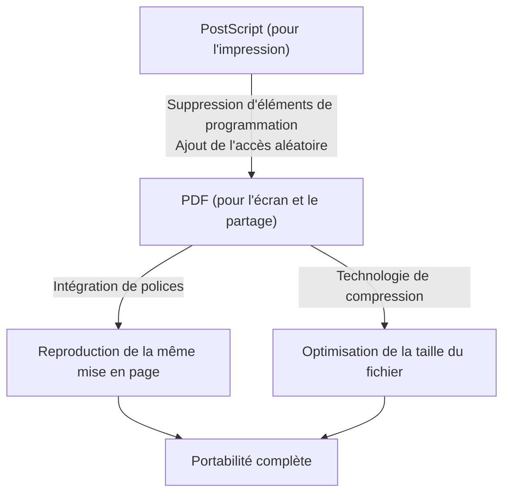

## Introduction : Le besoin de "papier" dans le monde numérique

Dans les affaires modernes et la vie quotidienne, il ne se passe pas un jour sans que l'on ne voie un PDF (Portable Document Format). Qu'il s'agisse de contrats, de manuels, de factures, d'articles universitaires ou même de menus de restaurants, toutes sortes de documents sont partagés sous forme de PDF. Cependant, aux débuts de l'informatique, créer un "document qui s'affiche de la même manière sur n'importe quel terminal" relevait du rêve.

L'environnement informatique des années 1980 était beaucoup plus fragmenté qu'aujourd'hui. Divers systèmes d'exploitation tels que Windows, Macintosh, les stations de travail UNIX et MS-DOS proliféraient, chacun possédant ses propres formats de polices, moteurs de rendu et formats de fichiers. Il était courant que si la personne A créait un document avec une belle mise en page sur Mac et que la personne B l'ouvrait sur Windows, les polices étaient remplacées, la mise en page s'effondrait et les images n'étaient pas affichées.

Ce sont les fondateurs d'Adobe Systems (aujourd'hui Adobe) qui ont tenté de résoudre ce problème et de créer le "papier du monde numérique". Dans cet article, nous plongerons dans l'histoire et le contexte technique de la naissance du PDF, de la façon dont il a surmonté les obstacles techniques et a évolué vers un format de document standard mondial avec une valeur juridique.

## La révolution PostScript et l'aube de la PAO

On ne peut parler de l'histoire du PDF sans mentionner "PostScript", un langage de description de page.

En 1982, John Warnock et Charles Geschke, qui travaillaient au Centre de recherche de Palo Alto (PARC) de Xerox, développaient un langage de programmation pour réaliser des impressions de haute qualité indépendamment des appareils. Cependant, comme il n'y avait aucune perspective de commercialisation immédiate de cette technologie chez Xerox, ils ont pris leur indépendance et ont fondé Adobe Systems. Et ce qu'ils ont achevé, c'est PostScript.

### Le concept d'indépendance vis-à-vis du périphérique

Les imprimantes de l'époque recevaient des données textuelles et des codes de contrôle simples de l'ordinateur, et imprimaient sur papier à l'aide de polices bitmap intégrées en tant que matériel à l'intérieur de l'imprimante. Par conséquent, si le modèle d'imprimante changeait, le résultat de l'impression changeait également, et il était difficile d'imprimer des figures complexes ou des courbes lisses.

PostScript a adopté une approche complètement différente. Il a décrit l'apparence du document sous forme de "données vectorielles mathématiques". Il envoyait des éléments tels que du texte, des lignes droites, des courbes et des images à l'imprimante en tant qu'ensemble de formules mathématiques et de commandes. L'imprimante intègre une sorte de petit ordinateur appelé "interpréteur PostScript", qui interprète (rastérise) le programme reçu sur place et l'imprime à la plus haute résolution qu'il possède.

De ce fait, même les documents créés avec une résolution grossière à l'écran pouvaient être imprimés magnifiquement sur des imprimantes laser haute résolution et des presses commerciales. En 1985, le "LaserWriter" d'Apple a été équipé de PostScript, et la combinaison de "Macintosh", "PageMaker" et "LaserWriter" a donné naissance à une nouvelle industrie appelée Desktop Publishing (PAO, ou DTP).

## The Camelot Project : La même expérience à l'écran

PostScript a révolutionné l'industrie de l'impression, mais il avait un point faible. Il s'agissait du fait que "parce que c'est un langage de programmation très complexe, il est trop lourd pour être affiché rapidement à l'écran". Les fichiers PostScript peuvent inclure des boucles et des branchements conditionnels, et vous ne savez pas à quoi ressemblera la page finale tant que les calculs ne sont pas terminés.

Au début des années 1990, alors que l'essor d'Internet était imminent, John Warnock a écrit un court document interne intitulé "The Camelot Project".

> "Notre objectif est de faire en sorte que n'importe quel document provenant de n'importe quelle plate-forme puisse être capturé sous forme numérique, transféré vers n'importe quel ordinateur, affiché sur n'importe quel écran et imprimé sur n'importe quelle imprimante."

Ce que Warnock envisageait était un format de document qui ne serait pas du tout affecté par les différences de système d'exploitation, d'application ou même de polices installées localement, et qui pourrait être partagé tout en conservant exactement l'apparence voulue par le créateur.

### La naissance du PDF

Le PDF est né du projet Camelot. Bien que le PDF soit basé sur la technologie PostScript, il a supprimé des éléments en tant que langage de programmation (tels que les boucles et l'état des variables) pour réaliser un rendu rapide à l'écran et un accès aléatoire (la possibilité de sauter immédiatement à n'importe quelle page).

Au lieu de cela, le PDF a été structuré comme une collection d'objets de dessin indépendants pour chaque page. En conséquence, même pour un document de 1000 pages, le système n'a pas à calculer dans l'ordre à partir de la première page, et il est devenu possible d'afficher la 500e page instantanément.

En 1993, Adobe a publié "Acrobat", un logiciel pour créer et visualiser des fichiers PDF. Au départ, l'"Acrobat Reader" pour la visualisation était également payant (50 dollars), ce qui a retardé son adoption. Cependant, Adobe a rapidement pris la décision stratégique de distribuer Reader gratuitement. Cela a porté ses fruits et le PDF a connu une diffusion explosive.

## Structure de base et percées techniques du PDF

Pour que le PDF fonctionne comme "papier électronique", plusieurs percées techniques importantes étaient nécessaires.

### 1. Intégration de polices (Font Embedding)

L'une des technologies les plus importantes est l'"intégration de polices". Dans les fichiers des logiciels de traitement de texte conventionnels (par exemple, les premiers documents Word), seul le "code de caractère" et le "nom de la police (par exemple : MS Gothic)" étaient enregistrés dans les données du document. Si la police n'était pas installée sur le PC du lecteur, le système d'exploitation la remplaçait par une autre police, modifiant ainsi la largeur des caractères, déplaçant la position des sauts de ligne et détruisant la mise en page.

Le PDF a la capacité de regrouper les données de forme de la police utilisée (les contours) directement dans le fichier. Ainsi, même si la police n'existe pas du tout sur le terminal du lecteur, de beaux caractères exactement tels qu'ils ont été créés peuvent être affichés. De plus, pour réduire la taille du fichier, une technologie appelée "intégration de sous-ensemble" a été développée, qui extrait et intègre uniquement les données des caractères réellement utilisés dans le document.

### 2. Intégration des graphiques vectoriels et des images matricielles

Le PDF dispose d'un puissant moteur de dessin de graphiques vectoriels hérité de PostScript. Comme il conserve les logos d'entreprise et les graphiques sous forme de données vectorielles, les bords ne se pixellisent jamais (effet d'escalier), quelle que soit l'échelle d'agrandissement. Dans le même temps, des images matricielles (données de pixels compressées en JPEG ou ZIP) telles que des photos peuvent également être intégrées de manière flexible.

### 3. Structure interne du fichier (Arborescence et références croisées)

Si vous regardez le contenu d'un fichier PDF avec un éditeur de texte, il commence par un en-tête tel que `%PDF-1.4` et est suivi de nombreux "objets (dictionnaires, tableaux, flux, etc.)".
Le grand avantage du PDF est qu'il possède une "Table de références croisées (Cross-Reference Table)" à la fin du fichier. Cette table enregistre la position de l'octet de décalage de tous les objets dans le fichier.

Lorsqu'un lecteur PDF ouvre un fichier, il le lit d'abord par la fin et récupère la table de références croisées. Par conséquent, lorsque les données d'une page spécifique sont nécessaires, les données requises peuvent être lues précisément depuis le disque en se référant à la table sans avoir à analyser l'intégralité du fichier. C'est la raison pour laquelle même les fichiers PDF énormes fonctionnent rapidement.

## Évolution en tant que document numérique : Signature électronique et sécurité

Au-delà du simple "affichage de documents imprimés à l'écran", le PDF a évolué pour fonctionner comme "original" dans le monde des affaires.

### Signatures électroniques (Digital Signatures) et cryptographie à clé publique

Lors de la numérisation de contrats et de documents officiels, la plus grande préoccupation est la "preuve de non-falsification" et la "preuve que la personne l'a créé". Le PDF intègre une spécification de signature électronique utilisant l'infrastructure à clé publique (PKI) au niveau du format.

En calculant la valeur de hachage du document, en la chiffrant avec la clé privée du signataire et en l'intégrant dans le PDF, il a mis en place un système où la signature devient invalide si le contenu est modifié ultérieurement d'un seul octet. Grâce à cela, le PDF a acquis une force de preuve légale équivalente, voire supérieure, à l'apposition d'un sceau sur du papier.

### Sécurité et contrôle d'accès

Le PDF implémente également de puissantes fonctions de cryptage (telles que AES-256). Il est possible d'attribuer au fichier lui-même non seulement un "mot de passe d'ouverture" pour ouvrir le document, mais également des paramètres de droits détaillés (mot de passe d'autorisation) tels que l'interdiction d'imprimer, l'interdiction de copier du texte et l'interdiction d'extraire des pages.

## La route vers la norme mondiale (ISO 32000)

Pendant de nombreuses années, le PDF était le format propriétaire d'Adobe Systems. Cependant, Adobe a publié ses spécifications gratuitement, permettant à quiconque de développer des logiciels de création et de visualisation de PDF. Cela a créé un énorme écosystème tiers.

Et en 2008, Adobe a abandonné le contrôle total du PDF et l'a transféré à l'Organisation internationale de normalisation (ISO). Grâce à cela, le PDF est devenu une norme internationale officielle sous le nom de "ISO 32000-1". En devenant un format ouvert non dépendant d'une entreprise spécifique, il a consolidé sa position de format de préservation des documents publics pour les gouvernements du monde entier.

De plus, des normes dérivées adaptées à des fins spécifiques ont également été créées.
- **PDF/A (Archive) :** Pour la conservation à long terme. Interdit les polices externes et le cryptage, garantissant qu'il pourra toujours être ouvert dans plusieurs décennies.
- **PDF/X (Exchange) :** Pour l'industrie de l'impression. Définit strictement le profil colorimétrique (CMJN) et prévient les problèmes lors de l'impression.
- **PDF/UA (Universal Accessibility) :** Définit la structure logique (balises) du document afin que les lecteurs d'écran pour les malvoyants puissent le lire correctement.

## Conclusion

La vision de John Warnock dans le "Camelot Project", "pouvoir partager le document exactement comme prévu, n'importe où dans le monde, avec n'importe qui et sur n'importe quel terminal", est devenue une réalité totale dans la société moderne.

Le PDF n'est pas qu'un simple "papier transformé en image". C'est un "papier numérique" de conception extrêmement sophistiquée qui permet la recherche de texte, possède la beauté du vectoriel, est protégé par des technologies de cryptographie et possède une structure logique. L'histoire du PDF, qui a commencé avec le langage de programmation PostScript, a éliminé la complexité pour gagner en portabilité et a finalement atteint le standard international de préservation des connaissances humaines, peut être considérée comme l'une des plus grandes réussites de l'histoire des logiciels informatiques.
