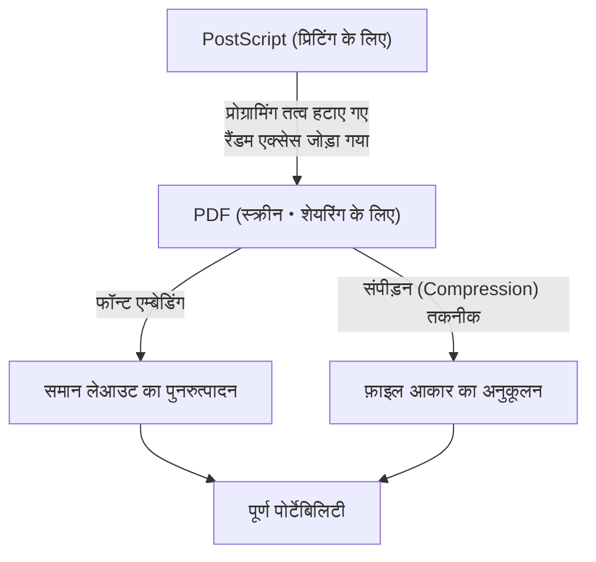

## परिचय: डिजिटल दुनिया में "कागज" की आवश्यकता

आधुनिक व्यापार और दैनिक जीवन में, शायद ही कोई ऐसा दिन गुजरता हो जब हम पीडीएफ (पोर्टेबल डॉक्यूमेंट फॉर्मेट - Portable Document Format) नहीं देखते हों। अनुबंध, मैनुअल, चालान, अकादमिक शोध पत्र, यहाँ तक कि रेस्तरां के मेनू तक, हर तरह का दस्तावेज पीडीएफ के रूप में साझा किया जाता है। हालांकि, कंप्यूटर के शुरुआती दिनों में, "एक ऐसा दस्तावेज बनाना जो किसी भी डिवाइस पर एक जैसा दिखे" एक सपने जैसा था।

1980 के दशक में कंप्यूटर वातावरण आज की तुलना में कहीं अधिक खंडित था। विंडोज (Windows), मैकिन्टोश (Macintosh), यूनिक्स (UNIX) वर्कस्टेशन और एमएस-डॉस (MS-DOS) जैसे विभिन्न ऑपरेटिंग सिस्टम मौजूद थे, और प्रत्येक का अपना फॉन्ट स्वरूप, रेंडरिंग इंजन और फ़ाइल स्वरूप था। यह एक आम बात थी कि अगर व्यक्ति A मैक पर सुंदर लेआउट के साथ कोई दस्तावेज बनाता, और व्यक्ति B उसे विंडोज पर खोलता, तो फॉन्ट बदल जाते, लेआउट बिगड़ जाता और चित्र दिखाई नहीं देते।

एडोब सिस्टम्स (अब एडोब) के संस्थापकों ने इस समस्या को हल करने और "डिजिटल दुनिया में कागज" बनाने का प्रयास किया। इस लेख में, हम गहराई से इस बात की जांच करेंगे कि पीडीएफ का जन्म कैसे हुआ, इसने तकनीकी बाधाओं को कैसे पार किया, और यह कानूनी वैधता के साथ विश्व-मानक दस्तावेज़ प्रारूप के रूप में कैसे विकसित हुआ, इसके इतिहास और तकनीकी पृष्ठभूमि को खंगालेंगे।

## पोस्टस्क्रिप्ट (PostScript) की क्रांति और डीटीपी (DTP) की शुरुआत

पीडीएफ के इतिहास पर चर्चा करते समय "पोस्टस्क्रिप्ट" नामक पेज विवरण भाषा (page description language) की उपस्थिति को नजरअंदाज नहीं किया जा सकता है।

1982 में, ज़ेरॉक्स (Xerox) के पालो ऑल्टो रिसर्च सेंटर (PARC) में काम करने वाले जॉन वार्नॉक और चार्ल्स गेश्के एक प्रोग्रामिंग भाषा विकसित कर रहे थे जो डिवाइस पर निर्भर हुए बिना उच्च गुणवत्ता वाली छपाई (printing) कर सके। हालांकि, क्योंकि यह उम्मीद नहीं थी कि इस तकनीक का ज़ेरॉक्स के भीतर तुरंत व्यावसायीकरण किया जाएगा, उन्होंने स्वतंत्र रूप से एडोब सिस्टम्स की स्थापना की। और उन्होंने पोस्टस्क्रिप्ट को पूरा किया।

### डिवाइस-स्वतंत्रता की अवधारणा

उस समय के प्रिंटर कंप्यूटर से भेजे गए टेक्स्ट डेटा और सरल नियंत्रण कोड प्राप्त करते थे, और प्रिंटर के अंदर हार्डवेयर के रूप में निर्मित बिटमैप फॉन्ट को कागज पर छापते थे। इसलिए, यदि प्रिंटर का मॉडल बदल जाता, तो मुद्रण परिणाम भी बदल जाता, और जटिल आकृतियों और चिकनी वक्रों (curves) को छापना मुश्किल हो जाता था।

पोस्टस्क्रिप्ट ने पूरी तरह से अलग दृष्टिकोण अपनाया। इसने दस्तावेज़ की उपस्थिति को "गणितीय वेक्टर डेटा" के रूप में वर्णित किया। पाठ, रेखाएँ, वक्र और चित्र जैसे तत्व सूत्रों और कमांड के एक सेट के रूप में प्रिंटर को भेजे जाते हैं। प्रिंटर में "पोस्टस्क्रिप्ट इंटरप्रेटर" नामक एक प्रकार का छोटा कंप्यूटर अंतर्निहित होता है, जो प्राप्त कार्यक्रम की मौके पर ही व्याख्या (रस्टराइज़ - rasterize) करता है और इसे अपने उच्चतम रिज़ॉल्यूशन पर प्रिंट करता है।

नतीजतन, यहां तक कि स्क्रीन पर खुरदरे रिज़ॉल्यूशन में बनाए गए दस्तावेज़ भी उच्च रिज़ॉल्यूशन वाले लेजर प्रिंटर और वाणिज्यिक प्रिंटिंग प्रेस पर बेहद खूबसूरती से आउटपुट किए जा सकते थे। 1985 में, Apple के "LaserWriter" में पोस्टस्क्रिप्ट को शामिल किया गया था, और "Macintosh", "PageMaker", और "LaserWriter" के संयोजन ने डेस्कटॉप पब्लिशिंग (DTP) नामक एक नया उद्योग बनाया।

## कैमेलॉट प्रोजेक्ट (Camelot Project): स्क्रीन पर भी वही अनुभव

पोस्टस्क्रिप्ट ने प्रिंटिंग उद्योग में क्रांति ला दी, लेकिन इसकी एक कमजोरी थी। वह यह थी कि "यह एक बहुत ही जटिल प्रोग्रामिंग भाषा है, इसलिए इसे स्क्रीन पर तेज़ी से प्रदर्शित करना बहुत भारी है।" पोस्टस्क्रिप्ट फाइलों में लूप और सशर्त शाखाएं (conditional branches) शामिल हो सकती हैं, और जब तक गणना पूरी नहीं हो जाती, तब तक आप नहीं जानते कि अंतिम पृष्ठ कैसा दिखेगा।

1990 के दशक की शुरुआत में, जैसे ही इंटरनेट व्यापक होने वाला था, जॉन वार्नॉक ने आंतरिक उपयोग के लिए "द कैमेलॉट प्रोजेक्ट" नामक एक छोटा पेपर लिखा।

> "हमारा लक्ष्य किसी भी दस्तावेज़ को किसी भी प्लेटफ़ॉर्म से डिजिटल रूप में कैप्चर करना, इसे किसी भी कंप्यूटर पर स्थानांतरित करने में सक्षम बनाना, इसे किसी भी स्क्रीन पर प्रदर्शित करना और इसे किसी भी प्रिंटर पर प्रिंट करने में सक्षम बनाना है।"

वार्नॉक ने एक ऐसे दस्तावेज़ प्रारूप की कल्पना की थी जो ओएस, एप्लिकेशन, या स्थानीय रूप से इंस्टॉल किए गए फॉन्ट में अंतर से पूरी तरह अप्रभावित हो, और जिसे निर्माता द्वारा इरादे के अनुसार बिल्कुल उसी रूप में साझा किया जा सके।

### पीडीएफ का जन्म

कैमेलॉट प्रोजेक्ट से ही पीडीएफ का जन्म हुआ। हालांकि पीडीएफ पोस्टस्क्रिप्ट तकनीक पर आधारित है, लेकिन इसने स्क्रीन पर तेजी से रेंडरिंग और रैंडम एक्सेस (तत्काल किसी भी पृष्ठ पर कूदने की क्षमता) प्राप्त करने के लिए प्रोग्रामिंग भाषा के रूप में अपने तत्वों (जैसे लूप और चर की स्थिति) को हटा दिया।

इसके बजाय, पीडीएफ को प्रत्येक पृष्ठ के लिए स्वतंत्र ड्राइंग ऑब्जेक्ट्स के संग्रह के रूप में संरचित किया गया था। इस प्रकार, भले ही यह 1000-पृष्ठ का दस्तावेज़ हो, सिस्टम को पहले पृष्ठ से क्रम में गणना करने की आवश्यकता नहीं है, और तुरंत 500वें पृष्ठ को प्रदर्शित करना संभव हो गया।

1993 में, एडोब ने पीडीएफ फाइलों को बनाने और देखने के लिए "Acrobat" नामक सॉफ्टवेयर जारी किया। प्रारंभ में, देखने के लिए "Acrobat Reader" का भी शुल्क ($50) लिया जाता था, इसलिए इसे अपनाने में देरी हुई। हालांकि, एडोब ने जल्द ही रीडर को मुफ्त में वितरित करने का रणनीतिक निर्णय लिया। यह सफल रहा और पीडीएफ का उपयोग विस्फोटक रूप से बढ़ने लगा।

## पीडीएफ की मूल संरचना और तकनीकी सफलताएं

पीडीएफ को "इलेक्ट्रॉनिक कागज" के रूप में काम करने के लिए, कई महत्वपूर्ण तकनीकी सफलताओं की आवश्यकता थी।

### 1. फॉन्ट एम्बेडिंग (Font Embedding)

सबसे महत्वपूर्ण तकनीकों में से एक "फॉन्ट एम्बेडिंग" है। पारंपरिक वर्ड प्रोसेसिंग सॉफ्टवेयर फाइलों (जैसे शुरुआती वर्ड दस्तावेजों) में, दस्तावेज़ डेटा में केवल "कैरेक्टर कोड" और "फॉन्ट का नाम (जैसे: MS Gothic)" सहेजा जाता था। यदि दर्शक के पीसी पर वह फॉन्ट इंस्टॉल नहीं है, तो ओएस किसी अन्य फॉन्ट को प्रतिस्थापित कर देगा, जिससे अक्षरों की चौड़ाई बदल जाएगी, लाइन ब्रेक की स्थिति खिसक जाएगी और लेआउट नष्ट हो जाएगा।

पीडीएफ में फ़ाइल के भीतर ही उपयोग किए जा रहे फॉन्ट के आकार डेटा (आउटलाइन) को पैकेज करने की सुविधा है। नतीजतन, भले ही दर्शक के डिवाइस पर फॉन्ट बिल्कुल मौजूद न हो, फिर भी यह उन सुंदर अक्षरों को प्रदर्शित कर सकता है जो बनाते समय बिल्कुल वैसे ही दिखते थे। इसके अलावा, फ़ाइल के आकार को कम रखने के लिए, "सबसेट एम्बेडिंग" नामक एक तकनीक भी विकसित की गई थी, जो केवल दस्तावेज़ में वास्तव में उपयोग किए जाने वाले वर्णों (characters) के डेटा को निकालती है और एम्बेड करती है।

### 2. वेक्टर ग्राफिक्स और रास्टर इमेज का एकीकरण

पीडीएफ में एक शक्तिशाली वेक्टर ग्राफिक्स ड्राइंग इंजन है जो पोस्टस्क्रिप्ट से विरासत में मिला है। चूंकि कॉर्पोरेट लोगो और ग्राफ़ वेक्टर डेटा के रूप में रखे जाते हैं, चाहे आप उन्हें कितना भी बड़ा कर लें, किनारे पिक्सेलयुक्त (jagged) नहीं होते हैं। उसी समय, रास्टर इमेज (JPEG या ZIP संपीड़ित पिक्सेल डेटा) जैसे फ़ोटो भी लचीले ढंग से एम्बेड किए जा सकते हैं।

### 3. फ़ाइल की आंतरिक संरचना (ट्री और क्रॉस-रेफरेंस)

यदि आप किसी पीडीएफ फाइल के अंदर टेक्स्ट एडिटर के साथ देखते हैं, तो यह `%PDF-1.4` जैसे हेडर से शुरू होती है, जिसके बाद कई "ऑब्जेक्ट" (डिक्शनरी, एरे, स्ट्रीम, आदि) आते हैं।
पीडीएफ के बारे में बड़ी बात यह है कि फ़ाइल के अंत में एक "क्रॉस-रेफरेंस टेबल (Cross-Reference Table)" होती है। यह तालिका फ़ाइल में मौजूद सभी ऑब्जेक्ट्स के बाइट ऑफसेट स्थिति को रिकॉर्ड करती है।

जब कोई पीडीएफ रीडर फ़ाइल खोलता है, तो वह सबसे पहले अंत से पढ़ता है और क्रॉस-रेफरेंस टेबल प्राप्त करता है। इसलिए, जब किसी विशिष्ट पृष्ठ के लिए डेटा की आवश्यकता होती है, तो यह पूरी फ़ाइल को पार्स किए बिना तालिका को संदर्भित करके डिस्क से आवश्यक डेटा को सटीक रूप से पढ़ सकता है। यही कारण है कि विशाल पीडीएफ फाइलें भी बहुत तेजी से काम करती हैं।

## डिजिटल दस्तावेज़ के रूप में विकास: इलेक्ट्रॉनिक हस्ताक्षर और सुरक्षा

पीडीएफ केवल "स्क्रीन पर मुद्रित सामग्री देखने" से आगे बढ़कर व्यावसायिक सेटिंग्स में "मूल" (original) के रूप में कार्य करने के लिए विकसित हुआ है।

### इलेक्ट्रॉनिक हस्ताक्षर (Digital Signatures) और पब्लिक की क्रिप्टोग्राफी (Public Key Cryptography)

अनुबंधों और सार्वजनिक दस्तावेजों को डिजिटाइज़ करते समय सबसे बड़ी चिंताएं "छेड़छाड़ न होने का प्रमाण" और "व्यक्ति द्वारा बनाए जाने का प्रमाण" हैं। पीडीएफ ने प्रारूप स्तर पर सार्वजनिक कुंजी अवसंरचना (PKI) का उपयोग करके एक इलेक्ट्रॉनिक हस्ताक्षर विनिर्देश को शामिल किया।

दस्तावेज़ के हैश मान की गणना करके, इसे हस्ताक्षरकर्ता की निजी कुंजी (private key) के साथ एन्क्रिप्ट करके और इसे पीडीएफ में एम्बेड करके, यदि बाद में सामग्री का 1 बाइट भी बदल दिया जाता है, तो हस्ताक्षर अमान्य हो जाएगा। इसने पीडीएफ को कागज पर मुहर लगाने के बराबर या उससे अधिक कानूनी साक्ष्य क्षमता दी है।

### सुरक्षा और एक्सेस कंट्रोल

पीडीएफ में मजबूत एन्क्रिप्शन सुविधाएं (जैसे AES-256) भी लागू की गई हैं। न केवल दस्तावेज़ खोलने के लिए एक "ओपन पासवर्ड", बल्कि विस्तृत अनुमति सेटिंग्स (अनुमति पासवर्ड) जैसे मुद्रण को रोकना, पाठ की प्रतिलिपि बनाना रोकना, और पृष्ठों को निकालना रोकना भी फ़ाइल में जोड़ा जा सकता है।

## विश्व मानक (ISO 32000) का मार्ग

कई वर्षों तक, पीडीएफ एडोब सिस्टम्स का एक मालिकाना (proprietary) प्रारूप था। हालांकि, एडोब ने विनिर्देशों (specifications) को मुफ्त में प्रकाशित किया, जिससे कोई भी पीडीएफ निर्माण और देखने वाले सॉफ्टवेयर को विकसित कर सके। इसने एक विशाल तीसरे पक्ष का पारिस्थितिकी तंत्र (ecosystem) बनाया।

और 2008 में, एडोब ने पीडीएफ का पूर्ण नियंत्रण छोड़ दिया और इसे अंतर्राष्ट्रीय मानकीकरण संगठन (ISO) को सौंप दिया। नतीजतन, पीडीएफ "ISO 32000-1" के रूप में एक आधिकारिक अंतरराष्ट्रीय मानक बन गया। एक खुला प्रारूप बनने के बाद जो किसी विशिष्ट कंपनी पर निर्भर नहीं है, इसने विभिन्न देशों की सरकारों के आधिकारिक दस्तावेज़ संरक्षण प्रारूप के रूप में अपनी स्थिति मजबूत की है।

इसके अलावा, विशिष्ट उपयोगों के अनुरूप व्युत्पन्न (derivative) मानक भी सामने आए हैं।
- **PDF/A (Archive):** दीर्घकालिक संरक्षण के लिए। बाहरी फॉन्ट और एन्क्रिप्शन निषिद्ध हैं, यह सुनिश्चित करते हुए कि इसे दशकों बाद भी मज़बूती से खोला जा सके।
- **PDF/X (Exchange):** मुद्रण उद्योग के लिए। प्रिंटिंग के दौरान समस्याओं को रोकने के लिए रंग प्रोफ़ाइल (CMYK) को कड़ाई से परिभाषित करता है।
- **PDF/UA (Universal Accessibility):** दस्तावेज़ की तार्किक संरचना (टैग) को परिभाषित करता है ताकि नेत्रहीनों के लिए स्क्रीन रीडर इसे सही ढंग से पढ़ सकें।

## निष्कर्ष

जॉन वार्नॉक ने "कैमेलॉट प्रोजेक्ट" में जिस दृष्टि का सपना देखा था - "दुनिया में कहीं भी, किसी के भी साथ, किसी भी डिवाइस पर इच्छित रूप में दस्तावेजों को साझा करने में सक्षम होना" - वह आधुनिक समाज में पूरी तरह से वास्तविकता बन गई है।

पीडीएफ सिर्फ "छवि वाला कागज" नहीं है। यह एक अत्यधिक इंजीनियर "डिजिटल कागज" है जहां टेक्स्ट खोजा जा सकता है, जिसमें वेक्टर की सुंदरता है, जो एन्क्रिप्शन द्वारा संरक्षित है, और जिसमें तार्किक संरचना है। पोस्टस्क्रिप्ट प्रोग्रामिंग भाषा से शुरू होकर, अपनी जटिलता को कम करके पोर्टेबिलिटी प्राप्त करना, और अंततः मानव ज्ञान को संरक्षित करने के लिए एक अंतरराष्ट्रीय मानक तक पहुंचना, पीडीएफ का इतिहास कंप्यूटर सॉफ्टवेयर के इतिहास में सबसे महान सफलता की कहानियों में से एक कहा जा सकता है।
