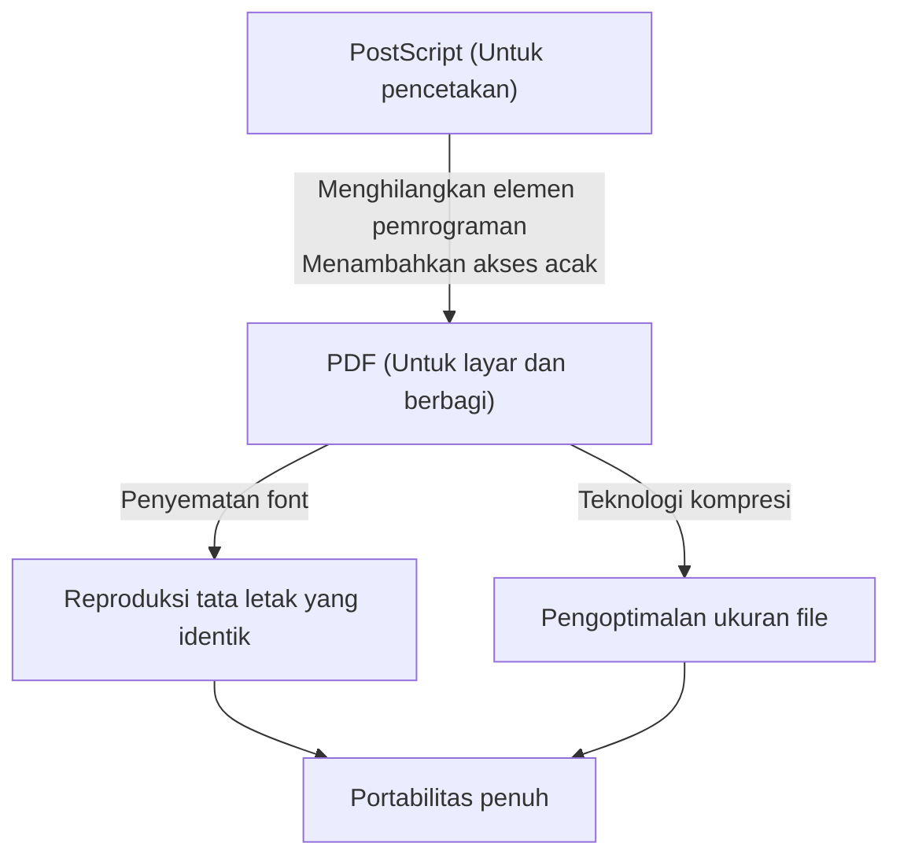

## Pengantar: Kebutuhan akan "Kertas" di Dunia Digital

Dalam bisnis dan kehidupan sehari-hari modern, tidak ada hari yang terlewat tanpa melihat PDF (Portable Document Format). Mulai dari kontrak, manual, faktur, makalah akademis, hingga menu restoran, semua jenis dokumen dibagikan sebagai PDF. Namun, pada masa awal komputasi, membuat "dokumen yang terlihat sama di perangkat apa pun" adalah sebuah mimpi belaka.

Lingkungan komputasi tahun 1980-an jauh lebih terfragmentasi daripada sekarang. Berbagai sistem operasi seperti Windows, Macintosh, workstation UNIX, dan MS-DOS bertebaran, masing-masing dengan format font, mesin rendering, dan format filenya sendiri. Sangat umum terjadi ketika A membuat dokumen dengan tata letak yang indah di Mac, lalu saat B membukanya di Windows, font berubah, tata letak berantakan, dan gambar tidak muncul.

Para pendiri Adobe Systems (sekarang Adobe) adalah orang-orang yang mencoba memecahkan masalah ini dan menciptakan "kertas di dunia digital". Artikel ini akan menggali lebih dalam sejarah dan latar belakang teknis tentang bagaimana PDF lahir, mengatasi hambatan teknis, dan berevolusi menjadi format dokumen standar dunia yang memiliki kekuatan hukum.

## Revolusi PostScript dan Fajar DTP

Saat membahas sejarah PDF, kita tidak dapat mengabaikan keberadaan "PostScript", sebuah bahasa deskripsi halaman.

Pada tahun 1982, John Warnock dan Charles Geschke, yang bekerja di Xerox Palo Alto Research Center (PARC), sedang mengembangkan bahasa pemrograman untuk pencetakan berkualitas tinggi tanpa bergantung pada perangkat. Namun, karena tidak ada prospek teknologi ini akan segera dikomersialkan di Xerox, mereka mandiri dan mendirikan Adobe Systems. Dan yang mereka selesaikan adalah PostScript.

### Konsep Independensi Perangkat

Printer pada saat itu menerima data teks dan kode kontrol sederhana yang dikirim dari komputer, lalu mencetak font bitmap yang terpasang di dalam printer sebagai perangkat keras. Karena itu, jika model printer berubah, hasil cetak pun berubah, dan sulit untuk mencetak bentuk yang rumit atau kurva yang halus.

PostScript mengambil pendekatan yang sama sekali berbeda. Dokumen dijelaskan sebagai "data vektor matematis". Elemen-elemen seperti teks, garis lurus, kurva, dan gambar dikirim ke printer sebagai kumpulan rumus dan perintah matematika. Printer memiliki komputer kecil yang disebut "interpreter PostScript", yang menafsirkan (merasterisasi) program yang diterima di tempat, dan mencetaknya pada resolusi tertinggi yang dimilikinya.

Sebagai hasilnya, dokumen yang dibuat dengan resolusi kasar di layar dapat dicetak dengan sangat indah pada printer laser resolusi tinggi dan mesin cetak komersial. Pada tahun 1985, PostScript disertakan dalam "LaserWriter" dari Apple, dan kombinasi "Macintosh", "PageMaker", dan "LaserWriter" melahirkan industri baru yang disebut Desktop Publishing (DTP).

## Proyek Camelot: Pengalaman yang Sama di Layar

Meskipun PostScript merevolusi industri percetakan, ada satu kelemahan. PostScript adalah "bahasa pemrograman yang sangat kompleks, sehingga terlalu berat untuk ditampilkan dengan cepat di layar." File PostScript dapat berisi proses pengulangan (loop) dan pencabangan kondisional, sehingga tampilan akhir halaman tidak diketahui sampai perhitungan selesai.

Pada awal 1990-an, menjelang meluasnya internet, John Warnock menulis makalah pendek internal yang berjudul "Proyek Camelot" (The Camelot Project).

> "Tujuan kami adalah untuk memungkinkan dokumen apa pun, dari platform apa pun, ditangkap dalam format digital, ditransfer ke komputer apa pun, ditampilkan di layar apa pun, dan dicetak pada printer apa pun."

Yang digambarkan Warnock adalah format dokumen yang sepenuhnya tidak terpengaruh oleh perbedaan OS, aplikasi, atau bahkan font yang diinstal secara lokal, dan dapat dibagikan dengan mempertahankan tampilan yang persis seperti yang dimaksudkan oleh pembuatnya.

### Lahirnya PDF

PDF lahir dari Proyek Camelot. Meskipun PDF didasarkan pada teknologi PostScript, PDF menghilangkan elemen-elemennya sebagai bahasa pemrograman (seperti loop dan status variabel) untuk mencapai rendering yang cepat di layar dan akses acak (kemampuan untuk melompat langsung ke halaman mana pun).

Sebagai gantinya, PDF disusun sebagai kumpulan objek gambar independen per halaman. Ini memungkinkan sistem untuk menampilkan halaman ke-500 secara instan tanpa perlu menghitung secara berurutan dari halaman 1, bahkan untuk dokumen setebal 1000 halaman.

Pada tahun 1993, Adobe merilis "Acrobat", perangkat lunak untuk membuat dan melihat file PDF. Pada awalnya, bahkan "Acrobat Reader" untuk melihat pun berbayar ($50), yang menunda penyebarannya. Namun, Adobe segera membuat keputusan strategis untuk mendistribusikan Reader secara gratis. Ini terbukti berhasil, dan PDF meledak dalam popularitas.

## Struktur Dasar PDF dan Terobosan Teknis

Agar PDF dapat berfungsi sebagai "kertas elektronik", beberapa terobosan teknis yang penting diperlukan.

### 1. Penyematan Font (Font Embedding)

Salah satu teknologi terpenting adalah "penyematan font". Dalam file perangkat lunak pengolah kata tradisional (misalnya, dokumen Word awal), hanya "kode karakter" dan "nama font (contoh: MS Gothic)" yang disimpan dalam data dokumen. Jika pembaca tidak memiliki font tersebut di PC-nya, OS akan menggantinya dengan font lain, sehingga lebar karakter berubah, posisi jeda baris bergeser, dan tata letak menjadi kacau.

PDF memiliki fitur untuk memaketkan data bentuk (outline) font yang digunakan itu sendiri ke dalam file. Hal ini memungkinkan teks yang indah ditampilkan persis seperti saat dibuat, bahkan jika font tersebut tidak ada di perangkat pembaca. Lebih lanjut, untuk menjaga ukuran file tetap kecil, sebuah teknologi yang disebut "penyematan subset" (subset embedding) dikembangkan, yang mengekstrak dan menyematkan hanya data untuk karakter yang benar-benar digunakan dalam dokumen.

### 2. Integrasi Grafik Vektor dan Gambar Raster

PDF memiliki mesin penggambaran grafik vektor yang kuat yang diwarisi dari PostScript. Karena mempertahankan logo perusahaan, grafik, dan lainnya sebagai data vektor, tepi gambar tidak akan pernah menjadi piksel (bergerigi) tidak peduli seberapa besar diperbesar. Pada saat yang sama, gambar raster seperti foto (data piksel JPEG atau yang dikompresi dengan ZIP) juga dapat disematkan secara fleksibel.

### 3. Struktur Internal File (Pohon dan Referensi Silang)

Jika Anda melihat isi file PDF dengan editor teks, file tersebut dimulai dengan header seperti `%PDF-1.4`, diikuti oleh banyak "objek" (kamus, array, stream, dll.).
Kelebihan PDF adalah ia memiliki "Tabel Referensi Silang" (Cross-Reference Table) di akhir file. Tabel ini mencatat posisi offset byte dari setiap objek dalam file.

Saat PDF reader membuka file, ia pertama-tama membaca dari akhir untuk mendapatkan Tabel Referensi Silang. Oleh karena itu, ketika data untuk halaman tertentu diperlukan, ia dapat merujuk ke tabel dan membaca data yang dibutuhkan dengan tepat dari disk, tanpa mengurai seluruh file. Inilah sebabnya mengapa bahkan file PDF yang sangat besar pun dapat bekerja dengan cepat.

## Evolusi sebagai Dokumen Digital: Tanda Tangan Elektronik dan Keamanan

Alih-alih sekadar "melihat materi cetak di layar", PDF berevolusi untuk berfungsi sebagai "dokumen asli" di lingkungan bisnis.

### Tanda Tangan Elektronik (Digital Signatures) dan Kriptografi Kunci Publik

Kekhawatiran terbesar saat mendigitalkan kontrak dan dokumen resmi adalah "bukti bahwa itu belum diubah" dan "bukti bahwa orang tersebut yang membuatnya". PDF memasukkan spesifikasi tanda tangan elektronik yang menggunakan Infrastruktur Kunci Publik (Public Key Infrastructure/PKI) di tingkat format.

Dengan menghitung nilai hash dari dokumen, mengenkripsinya dengan kunci privat penandatangan, dan menyematkannya ke dalam PDF, sistem ini memastikan bahwa tanda tangan tersebut akan menjadi tidak sah jika kontennya diubah bahkan hanya satu byte di kemudian hari. Ini telah memberi PDF nilai pembuktian hukum yang sama dengan, atau lebih besar dari, cap fisik di atas kertas.

### Keamanan dan Kontrol Akses

PDF juga mengimplementasikan fungsionalitas enkripsi yang kuat (seperti AES-256). Tidak hanya "sandi terbuka" (open password) untuk membuka dokumen, tetapi juga pengaturan izin yang terperinci (permission password) dapat diterapkan pada file itu sendiri, seperti melarang pencetakan, menyalin teks, dan mengekstrak halaman.

## Jalan Menuju Standar Global (ISO 32000)

Selama bertahun-tahun, PDF adalah format hak milik (proprietary) dari Adobe Systems. Namun, Adobe menerbitkan spesifikasi tersebut secara gratis, memungkinkan siapa saja untuk mengembangkan perangkat lunak pembuat dan pembaca PDF. Ini menciptakan ekosistem pihak ketiga yang masif.

Dan pada tahun 2008, Adobe melepaskan kendali penuh atas PDF dan menyerahkannya kepada Organisasi Internasional untuk Standardisasi (ISO). Sebagai hasilnya, PDF secara resmi menjadi standar internasional "ISO 32000-1". Dengan menjadi format terbuka yang tidak bergantung pada satu perusahaan tertentu, format ini mengukuhkan posisinya sebagai format pengarsipan dokumen resmi pemerintah di seluruh dunia.

Selain itu, standar turunan untuk tujuan tertentu juga telah dibuat:
- **PDF/A (Archive):** Untuk pelestarian jangka panjang. Melarang font dan enkripsi eksternal, memastikan file dapat dibuka dengan andal bahkan puluhan tahun kemudian.
- **PDF/X (Exchange):** Untuk industri percetakan. Mendefinisikan profil warna (CMYK) secara ketat untuk mencegah masalah selama pencetakan.
- **PDF/UA (Universal Accessibility):** Mendefinisikan struktur logis (tag) dokumen sehingga pembaca layar untuk tunanetra dapat membacanya dengan benar.

## Kesimpulan

Visi John Warnock dalam "Proyek Camelot"—"dapat berbagi dokumen persis seperti yang dimaksudkan, di mana pun di dunia, dengan siapa pun, dan di perangkat apa pun"—kini telah sepenuhnya menjadi kenyataan di masyarakat modern.

PDF bukan sekadar "kertas yang dijadikan gambar". Ini adalah "kertas digital" yang dirancang dengan sangat canggih yang teksnya dapat dicari, memiliki keindahan vektor, dilindungi oleh teknologi enkripsi, dan memiliki struktur logis. Sejarah PDF, mulai dari bahasa pemrograman PostScript, menghilangkan kompleksitas demi mendapatkan portabilitas, dan akhirnya mencapai standar internasional untuk melestarikan pengetahuan manusia, dapat dikatakan sebagai salah satu kisah sukses terbesar dalam sejarah perangkat lunak komputer.
