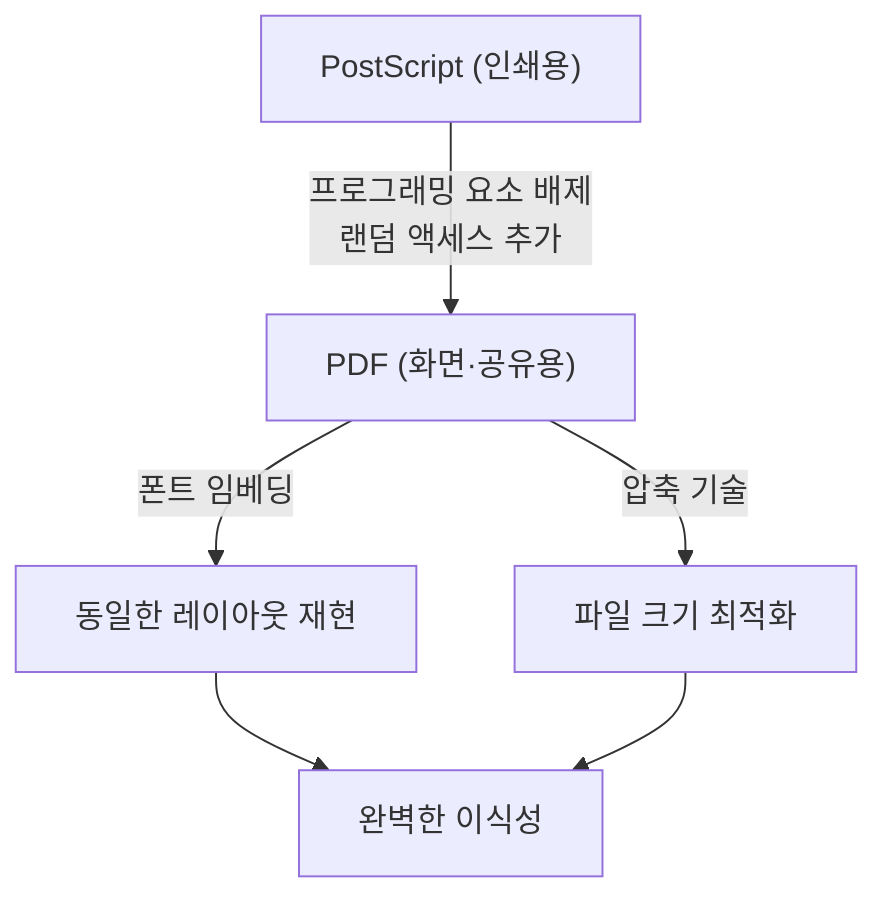

## 시작하며: 디지털 세계에서 '종이'의 필요성

현대 비즈니스와 일상생활에서 PDF(Portable Document Format)를 보지 않는 날은 없습니다. 계약서, 매뉴얼, 청구서, 학술 논문, 심지어 식당의 메뉴에 이르기까지 모든 문서가 PDF로 공유되고 있습니다. 하지만 컴퓨터의 여명기에는 '어떤 단말기에서든 똑같이 보이는 문서'를 만드는 것은 꿈같은 이야기였습니다.

1980년대의 컴퓨터 환경은 지금보다 훨씬 파편화되어 있었습니다. Windows, Macintosh, UNIX 워크스테이션, 그리고 MS-DOS 등 다양한 운영체제가 난립했고, 각각 고유한 폰트 형식, 렌더링 엔진, 파일 포맷을 가지고 있었습니다. A씨가 Mac에서 작성한 아름다운 레이아웃의 문서를 B씨가 Windows에서 열면 폰트가 바뀌고, 레이아웃이 무너지며, 이미지가 표시되지 않는 것이 일상이었습니다.

이 문제를 해결하고 '디지털 세계의 종이'를 만들고자 했던 사람들이 어도비 시스템즈(현 어도비)의 창립자들이었습니다. 본 기사에서는 PDF가 어떻게 탄생했고, 기술적인 장벽을 뛰어넘어 법적 효력을 갖춘 세계 표준 문서 포맷으로 진화했는지, 그 역사와 기술적 배경을 깊이 파헤쳐 봅니다.

## PostScript의 혁명과 DTP의 여명

PDF의 역사를 논할 때 빼놓을 수 없는 것이 바로 'PostScript(포스트스크립트)'라는 페이지 기술 언어의 존재입니다.

1982년, 제록스의 팔로알토 연구소(PARC)에서 일하던 존 워녹(John Warnock)과 찰스 게스케(Charles Geschke)는 기기에 의존하지 않고 고품질의 인쇄를 하기 위한 프로그래밍 언어를 개발하고 있었습니다. 하지만 제록스 사내에서 그 기술이 당장 제품화될 가능성이 없었기 때문에, 그들은 독립하여 어도비 시스템즈를 설립합니다. 그리고 완성시킨 것이 PostScript였습니다.

### 기기 독립성이라는 개념

당시의 프린터는 컴퓨터에서 보내오는 텍스트 데이터와 간단한 제어 코드를 받아, 프린터 내부에 하드웨어로 내장된 비트맵 폰트를 종이에 찍어내고 있었습니다. 그래서 프린터 기종이 바뀌면 인쇄 결과도 달라졌고, 복잡한 도형이나 부드러운 곡선을 인쇄하는 것은 어려웠습니다.

PostScript는 전혀 다른 접근 방식을 취했습니다. 문서의 형태를 '수학적인 벡터 데이터'로 기술한 것입니다. 텍스트, 직선, 곡선, 이미지 등의 요소를 수식과 명령어의 집합체로 프린터에 전송합니다. 프린터 측에는 'PostScript 인터프리터'라는 일종의 작은 컴퓨터가 내장되어 있어, 전달받은 프로그램을 그 자리에서 해석(래스터라이즈)하여 자신이 가진 최고의 해상도로 인쇄합니다.

이로 인해 화면상에서 거친 해상도로 만든 문서라도 고해상도 레이저 프린터나 상업용 인쇄기에서 매우 아름답게 출력될 수 있게 되었습니다. 1985년 Apple의 'LaserWriter'에 PostScript가 탑재되었고, 'Macintosh', 'PageMaker', 'LaserWriter'의 조합이 Desktop Publishing(DTP)이라는 새로운 산업을 탄생시켰습니다.

## Camelot Project: 화면에서도 똑같은 경험을

PostScript는 인쇄 업계에 혁명을 가져왔지만, 한 가지 약점이 있었습니다. 바로 '매우 복잡한 프로그래밍 언어이기 때문에 화면에 빠르게 표시하기에는 너무 무겁다'는 점이었습니다. PostScript 파일은 루프 처리나 조건 분기를 포함할 수 있어, 계산을 끝내기 전까지 최종 페이지가 어떻게 보일지 알 수 없습니다.

1990년대 초, 인터넷의 보급이 눈앞에 다가온 가운데, 존 워녹은 사내용으로 'The Camelot Project(카멜롯 프로젝트)'라는 제목의 짧은 논문을 썼습니다.

> "우리의 목표는 어떤 플랫폼에서든, 어떤 문서라도 디지털 형식으로 캡처하여 어떤 컴퓨터로든 전송할 수 있고, 어떤 화면에서든 표시할 수 있으며, 어떤 프린터에서든 인쇄할 수 있게 하는 것입니다."

워녹이 그렸던 것은 OS나 애플리케이션, 나아가 로컬에 설치된 폰트의 차이에 전혀 영향을 받지 않고, 작성자가 의도한 그대로의 모습을 완벽하게 유지한 채 공유할 수 있는 문서 포맷이었습니다.

### PDF의 탄생

Camelot Project에서 탄생한 것이 PDF입니다. PDF는 PostScript 기술을 기반으로 하면서도, 화면에서의 빠른 렌더링과 랜덤 액세스(원하는 페이지로 바로 이동할 수 있는 기능)를 구현하기 위해 프로그래밍 언어로서의 요소(루프나 변수 상태 등)를 덜어냈습니다.

대신, PDF는 페이지마다 독립적인 렌더링 객체의 집합으로 구조화되었습니다. 덕분에 1000페이지 분량의 문서라도 시스템이 1페이지부터 순서대로 계산할 필요 없이, 즉시 500페이지를 표시하는 것이 가능해졌습니다.

1993년, 어도비는 PDF 파일을 작성하고 열람하기 위한 소프트웨어 'Acrobat'을 출시했습니다. 처음에는 열람용인 'Acrobat Reader'도 유료(50달러)였기 때문에 보급이 더뎠습니다. 하지만 어도비는 곧 Reader를 무료로 배포한다는 전략적인 결정을 내립니다. 이것이 주효하여 PDF는 폭발적으로 보급되기 시작합니다.

## PDF의 기본 구조와 기술적 혁신

PDF가 '전자 종이'로서 기능하기 위해서는 몇 가지 중요한 기술적 혁신이 필요했습니다.

### 1. 폰트 임베딩 (Font Embedding)

가장 중요한 기술 중 하나가 '폰트 임베딩'입니다. 기존 워드 프로세서 파일(예: 초기 Word 문서)에서는 문서 데이터에 '문자 코드'와 '폰트 이름(예: 굴림)'만이 저장되어 있었습니다. 열람자의 PC에 해당 폰트가 설치되어 있지 않으면, OS는 다른 폰트로 대체하기 때문에 문자 폭이 변하고 줄바꿈 위치가 어긋나 레이아웃이 붕괴되어 버립니다.

PDF는 사용된 폰트의 형태 데이터(아웃라인) 자체를 파일 내에 패키징하는 기능을 가지고 있습니다. 이로 인해 열람자의 단말기에 해당 폰트가 전혀 없어도, 작성 시와 한 치의 오차도 없는 아름다운 문자를 표시할 수 있습니다. 나아가 파일 크기를 줄이기 위해, 문서 내에서 실제로 사용된 문자의 데이터만 추출하여 포함시키는 '서브셋 임베딩(Subset Embedding)'이라는 기술도 개발되었습니다.

### 2. 벡터 그래픽스와 래스터 이미지의 통합

PDF는 PostScript에서 물려받은 강력한 벡터 그래픽스 렌더링 엔진을 가지고 있습니다. 기업 로고나 그래프 등을 벡터 데이터로 유지하기 때문에, 아무리 확대해도 가장자리가 픽셀화(계단 현상)되지 않습니다. 동시에 사진과 같은 래스터 이미지(JPEG이나 ZIP으로 압축된 픽셀 데이터)도 유연하게 삽입할 수 있습니다.

### 3. 파일의 내부 구조 (트리와 상호 참조)

PDF 파일의 내부를 텍스트 에디터로 들여다보면 `%PDF-1.4`와 같은 헤더로 시작하여 다수의 '객체(딕셔너리, 배열, 스트림 등)'가 나열되어 있습니다.
PDF의 뛰어난 점은 파일의 끝에 '상호 참조 테이블(Cross-Reference Table)'을 가지고 있다는 것입니다. 이 테이블에는 파일 내 모든 객체의 바이트 오프셋 위치가 기록되어 있습니다.

PDF 리더는 파일을 열 때 먼저 끝에서부터 읽어 들여 상호 참조 테이블을 가져옵니다. 그렇기 때문에 특정 페이지의 데이터가 필요할 때 파일 전체를 분석하지 않고도, 테이블을 참조하여 정확하게 필요한 데이터를 디스크에서 읽어낼 수 있습니다. 이것이 거대한 PDF 파일이라도 빠르게 작동하는 이유입니다.

## 디지털 문서로서의 진화: 전자 서명과 보안

단순히 '인쇄물을 화면으로 보는' 것을 넘어, PDF는 비즈니스 현장에서 '원본'으로 기능하기 위한 진화를 이룩했습니다.

### 전자 서명 (Digital Signatures)과 공개키 암호

계약서나 공문서를 디지털화할 때 가장 큰 우려는 '위변조되지 않았다는 증명'과 '본인이 작성했다는 증명'입니다. PDF는 포맷 수준에서 공개키 암호 기반(PKI)을 활용한 전자 서명 사양을 도입했습니다.

문서의 해시값을 계산하고, 서명자의 개인키로 암호화하여 PDF 내에 삽입함으로써, 나중에 1바이트라도 내용이 변경되면 서명이 무효화되는 시스템을 구현했습니다. 이로 인해 PDF는 종이에 도장을 찍는 것과 동등하거나 그 이상의 법적 증거 능력을 갖추게 되었습니다.

### 보안과 접근 제어

PDF에는 강력한 암호화 기능(AES-256 등)도 구현되어 있습니다. 문서를 열기 위한 '오픈 패스워드'뿐만 아니라 인쇄 금지, 텍스트 복사 금지, 페이지 추출 금지 등 세밀한 권한 설정(퍼미션 패스워드)을 파일 자체에 부여할 수 있습니다.

## 세계 표준 (ISO 32000)으로의 길

오랜 기간 동안 PDF는 어도비 시스템즈의 독자적인 포맷(프로프라이어터리)이었습니다. 하지만 어도비는 그 사양을 무료로 공개하여 누구나 PDF 작성 소프트웨어나 열람 소프트웨어를 개발할 수 있도록 했습니다. 이것이 거대한 서드파티 생태계를 만들어냈습니다.

그리고 2008년, 어도비는 PDF에 대한 완전한 통제권을 내려놓고 국제표준화기구(ISO)에 양도했습니다. 이로써 PDF는 'ISO 32000-1'로서 정식 국제 표준 규격이 되었습니다. 특정 기업에 의존하지 않는 개방형 포맷이 됨으로써, 각국 정부의 공문서 보존 포맷으로서의 지위를 확고히 했습니다.

나아가 용도에 따른 파생 규격도 탄생하고 있습니다.
- **PDF/A (Archive):** 장기 보존용. 외부 폰트나 암호화를 금지하여, 수십 년 후에도 확실하게 열 수 있음을 보장합니다.
- **PDF/X (Exchange):** 인쇄 업계용. 색상 프로파일(CMYK)을 엄격하게 정의하여 인쇄 시의 문제를 방지합니다.
- **PDF/UA (Universal Accessibility):** 시각장애인용 스크린 리더가 올바르게 읽을 수 있도록 문서의 논리 구조(태그)를 정의합니다.

## 마치며

존 워녹이 'Camelot Project'에서 꿈꿨던 '전 세계 어디서든, 누구와든, 어떤 단말기에서든 의도한 그대로의 문서를 공유할 수 있다'는 비전은 현대 사회에서 완전히 현실이 되었습니다.

PDF는 단순한 '이미지화된 종이'가 아닙니다. 텍스트 검색이 가능하고, 벡터의 아름다움을 지녔으며, 암호 기술로 보호받고, 논리 구조를 갖춘 매우 고도로 설계된 '디지털 종이'입니다. PostScript라는 프로그래밍 언어에서 시작해 복잡함을 덜어내고 이식성을 획득했으며, 마침내 인류의 지식을 보존하는 국제 표준에 도달한 PDF의 역사는 컴퓨터 소프트웨어 역사상 가장 위대한 성공 이야기 중 하나라고 할 수 있을 것입니다.
