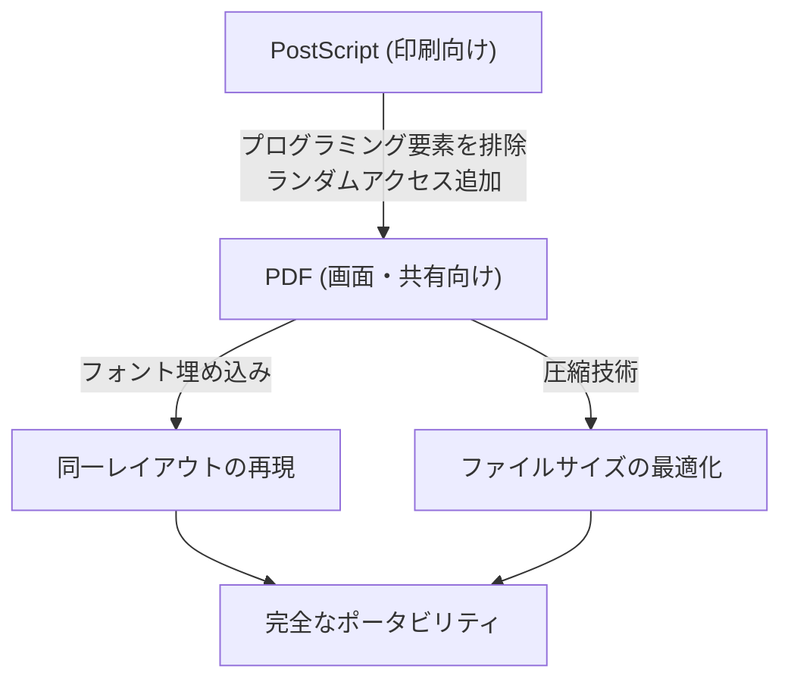

## はじめに：デジタル世界における「紙」の必要性

現代のビジネスや日常生活において、PDF（Portable Document Format）を目にしない日はありません。契約書、マニュアル、請求書、学術論文、さらには飲食店のメニューに至るまで、あらゆる文書がPDFとして共有されています。しかし、コンピュータの黎明期において、「どの端末でも同じように見える文書」を作ることは夢のような話でした。

1980年代のコンピュータ環境は、現在よりもはるかに断片化されていました。Windows、Macintosh、UNIXワークステーション、そしてMS-DOSなど、さまざまなオペレーティングシステムが乱立し、それぞれが独自のフォント形式、描画エンジン、ファイルフォーマットを持っていました。AさんがMacで作成した美しいレイアウトの文書を、BさんがWindowsで開くと、フォントは置き換わり、レイアウトは崩れ、画像は表示されないというのが日常茶飯事だったのです。

この問題を解決し、「デジタル世界における紙」を作り出そうとしたのが、アドビシステムズ（現アドビ）の創業者たちでした。本記事では、PDFがいかにして誕生し、技術的な壁を乗り越え、法的な効力を持つ世界標準の文書フォーマットへと進化したのか、その歴史と技術的背景を深く掘り下げていきます。

## PostScriptの革命とDTPの夜明け

PDFの歴史を語る上で避けて通れないのが、「PostScript（ポストスクリプト）」というページ記述言語の存在です。

1982年、ゼロックスのパロアルト研究所（PARC）で働いていたジョン・ワーノックとチャールズ・ゲシキは、デバイスに依存せずに高品質な印刷を行うためのプログラミング言語を開発していました。しかし、ゼロックス社内でその技術がすぐに製品化される見込みがなかったため、彼らは独立してアドビシステムズを設立します。そして完成させたのがPostScriptでした。

### デバイス非依存という概念

当時のプリンターは、コンピュータから送られてくるテキストデータと簡単な制御コードを受け取り、プリンター内部にハードウェアとして組み込まれたビットマップフォントを紙に打ち出していました。そのため、プリンターの機種が変われば印刷結果も変わり、複雑な図形や滑らかな曲線を印刷することは困難でした。

PostScriptは全く異なるアプローチをとりました。文書の見た目を「数学的なベクターデータ」として記述したのです。テキスト、直線、曲線、画像などの要素を、数式とコマンドの集合体としてプリンターに送信します。プリンター側には「PostScriptインタープリター」という一種の小さなコンピュータが内蔵されており、受け取ったプログラムをその場で解釈（ラスタライズ）して、自身の持つ最高の解像度で印刷します。

これにより、画面上の粗い解像度で作った文書でも、高解像度のレーザープリンターや商業印刷機で極めて美しく出力されるようになりました。1985年にAppleの「LaserWriter」にPostScriptが搭載され、「Macintosh」「PageMaker」「LaserWriter」の組み合わせがDesktop Publishing（DTP）という新しい産業を生み出しました。

## Camelot Project：画面上でも同じ体験を

PostScriptは印刷業界に革命をもたらしましたが、一つの弱点がありました。それは「非常に複雑なプログラミング言語であるため、画面上に高速に表示するには重すぎる」という点でした。PostScriptファイルはループ処理や条件分岐を含むことができ、計算を終えるまで最終的なページがどう見えるかわかりません。

1990年代初頭、インターネットの普及が目前に迫る中、ジョン・ワーノックは社内向けに「The Camelot Project（キャメロット・プロジェクト）」というタイトルの短い論文を書きました。

> 「私たちの目標は、どんなプラットフォームからでも、どんな文書でも、それをデジタル形式でキャプチャし、どんなコンピュータにも転送でき、どんな画面でも表示でき、どんなプリンターでも印刷できるようにすることです」

ワーノックが描いたのは、OSやアプリケーション、さらにはローカルにインストールされているフォントの違いに全く影響を受けず、作成者の意図した通りの見た目を完全に保持したまま共有できる文書フォーマットでした。

### PDFの誕生

Camelot Projectから生まれたのがPDFです。PDFはPostScriptの技術を基礎としながらも、画面での高速なレンダリングとランダムアクセス（任意のページにすぐジャンプできる機能）を実現するために、プログラミング言語としての要素（ループや変数の状態など）を削ぎ落としました。

代わりに、PDFはページごとの独立した描画オブジェクトの集合として構造化されました。これにより、1000ページの文書であっても、システムは1ページ目から順に計算する必要はなく、瞬時に500ページ目を表示することが可能になりました。

1993年、アドビはPDFファイルを作成・閲覧するためのソフトウェア「Acrobat」をリリースしました。当初は閲覧用の「Acrobat Reader」も有料（50ドル）であったため、普及は遅れました。しかし、アドビはすぐにReaderを無料配布するという戦略的な決定を下します。これが功を奏し、PDFは爆発的に普及していくことになります。

## PDFの基本構造と技術的ブレイクスルー

PDFが「電子の紙」として機能するためには、いくつかの重要な技術的ブレイクスルーが必要でした。

### 1. フォントの埋め込み（Font Embedding）

最も重要な技術の一つが「フォントの埋め込み」です。従来のワープロソフトのファイル（例えば初期のWord文書）では、文書データには「文字のコード」と「フォント名（例：MS ゴシック）」だけが保存されていました。閲覧者のPCにそのフォントがインストールされていない場合、OSは別のフォントで代用するため、文字幅が変わり、改行位置がズレてレイアウトが崩壊してしまいます。

PDFは、使用されているフォントの形状データ（アウトライン）そのものをファイル内にパッケージングする機能を持っています。これにより、閲覧者の端末にそのフォントが全く存在していなくても、作成時と寸分違わぬ美しい文字を表示することができます。さらに、ファイルサイズを抑えるために、文書内で実際に使用されている文字のデータだけを抽出して埋め込む「サブセット埋め込み」という技術も開発されました。

### 2. ベクターグラフィックスとラスタ画像の統合

PDFは、PostScript譲りの強力なベクターグラフィックス描画エンジンを持っています。企業ロゴやグラフなどをベクターデータとして保持するため、いくら拡大してもエッジがピクセル化（ジャギー）することがありません。同時に、写真などのラスタ画像（JPEGやZIP圧縮されたピクセルデータ）も柔軟に埋め込むことができます。

### 3. ファイルの内部構造（ツリーと相互参照）

PDFファイルの中身をテキストエディタで覗いてみると、`%PDF-1.4` のようなヘッダで始まり、多数の「オブジェクト（辞書、配列、ストリームなど）」が並んでいます。
PDFの優れている点は、ファイルの末尾に「相互参照テーブル（Cross-Reference Table）」を持っていることです。このテーブルには、ファイル内のすべてのオブジェクトのバイトオフセット位置が記録されています。

PDFリーダーはファイルを開く際、まず末尾から読み込み、相互参照テーブルを取得します。そのため、特定のページのデータが必要になったとき、ファイル全体を解析することなく、テーブルを参照してピンポイントで必要なデータをディスクから読み出すことができます。これが、巨大なPDFファイルでも高速に動作する理由です。

## デジタル文書としての進化：電子署名とセキュリティ

単に「印刷物を画面で見る」だけでなく、PDFはビジネスの現場で「原本」として機能するための進化を遂げました。

### 電子署名（Digital Signatures）と公開鍵暗号

契約書や公的文書をデジタル化する際の最大の懸念は、「改ざんされていないことの証明」と「本人が作成したことの証明」です。PDFはフォーマットレベルで公開鍵暗号基盤（PKI）を利用した電子署名仕様を組み込みました。

文書のハッシュ値を計算し、署名者の秘密鍵で暗号化してPDF内に埋め込むことで、後から1バイトでも内容が変更されれば署名が無効になる仕組みを実現しました。これにより、PDFは紙にハンコを押すのと同等、あるいはそれ以上の法的証拠能力を持つようになりました。

### セキュリティとアクセス制御

PDFには強力な暗号化機能（AES-256など）も実装されています。文書を開くための「オープンパスワード」だけでなく、印刷を禁止する、テキストのコピーを禁止する、ページの抽出を禁止するなど、きめ細やかな権限設定（パーミッションパスワード）をファイル自体に付与することができます。

## 世界標準（ISO 32000）への道

長年、PDFはアドビシステムズの独自フォーマット（プロプライエタリ）でした。しかし、アドビはその仕様を無料で公開し、誰でもPDF作成ソフトや閲覧ソフトを開発できるようにしていました。これがサードパーティの巨大なエコシステムを生み出しました。

そして2008年、アドビはPDFの完全なコントロールを手放し、国際標準化機構（ISO）に譲渡しました。これによりPDFは「ISO 32000-1」として正式な国際標準規格となりました。特定の企業に依存しないオープンなフォーマットとなったことで、各国政府の公文書保存フォーマットとしての地位を不動のものにしました。

さらに、用途に応じた派生規格も誕生しています。
- **PDF/A (Archive):** 長期保存向け。外部フォントや暗号化を禁止し、数十年後でも確実に開けることを保証する。
- **PDF/X (Exchange):** 印刷業界向け。カラープロファイル（CMYK）を厳密に定義し、印刷時のトラブルを防ぐ。
- **PDF/UA (Universal Accessibility):** 視覚障害者向けのスクリーンリーダーが正しく読み上げられるよう、文書の論理構造（タグ）を定義する。

## おわりに

ジョン・ワーノックが「Camelot Project」で夢見た「世界中どこでも、誰とでも、どんな端末でも、意図した通りの文書を共有できる」というビジョンは、現代社会において完全に現実のものとなりました。

PDFは単なる「画像化された紙」ではありません。テキストの検索が可能で、ベクターの美しさを持ち、暗号技術で守られ、論理構造を持つ、極めて高度に設計された「デジタルの紙」です。PostScriptというプログラミング言語から始まり、複雑さを削ぎ落としてポータビリティを獲得し、最終的に人類の知識を保存する国際標準へと到達したPDFの歴史は、コンピュータ・ソフトウェア史における最も偉大な成功物語の一つと言えるでしょう。
