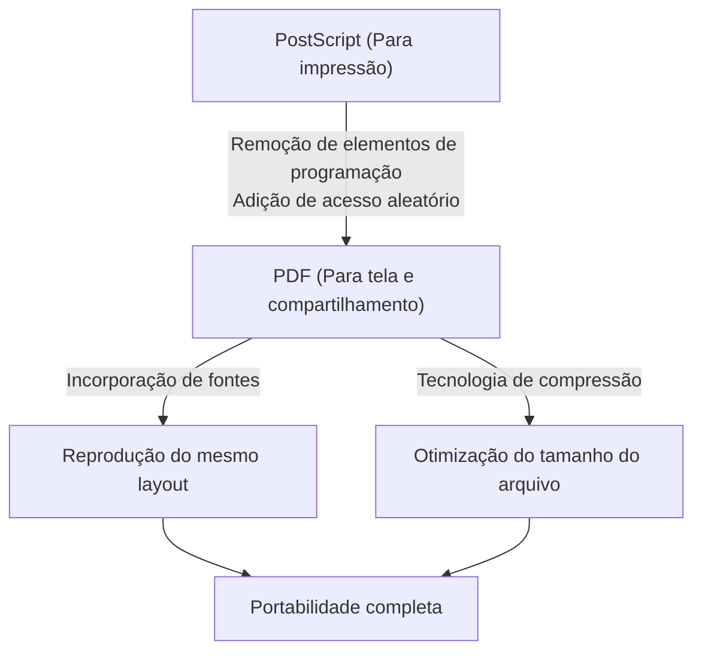

## Introdução: A necessidade de "papel" no mundo digital

Nos negócios e no dia a dia modernos, não há um dia em que não vejamos um PDF (Portable Document Format). Contratos, manuais, faturas, artigos acadêmicos e até mesmo menus de restaurantes - todos os tipos de documentos são compartilhados como PDF. No entanto, nos primórdios da computação, criar um documento que "parecesse o mesmo em qualquer dispositivo" era um sonho distante.

O ambiente de computação na década de 1980 era muito mais fragmentado do que hoje. Vários sistemas operacionais, como Windows, Macintosh, estações de trabalho UNIX e MS-DOS, coexistiam, cada um com seus próprios formatos de fonte, mecanismos de renderização e formatos de arquivo. Era comum que um documento lindamente formatado criado pela Pessoa A em um Mac perdesse a formatação, tivesse as fontes substituídas e as imagens não fossem exibidas quando aberto pela Pessoa B no Windows.

Foram os fundadores da Adobe Systems (agora Adobe) que tentaram resolver este problema e criar o "papel no mundo digital". Neste artigo, exploraremos a história e os antecedentes técnicos de como o PDF nasceu, superou barreiras técnicas e evoluiu para um formato de documento padrão mundial com validade legal.

## A Revolução do PostScript e o Alvorecer do DTP

Ao discutir a história do PDF, é impossível ignorar a existência de uma linguagem de descrição de página chamada "PostScript".

Em 1982, John Warnock e Charles Geschke, que trabalhavam no Centro de Pesquisa de Palo Alto (PARC) da Xerox, estavam desenvolvendo uma linguagem de programação para impressão de alta qualidade independente do dispositivo. No entanto, como não havia perspectiva de o produto ser comercializado na Xerox tão cedo, eles saíram para fundar a Adobe Systems. E o que eles completaram foi o PostScript.

### O conceito de independência de dispositivo

As impressoras da época recebiam dados de texto e códigos de controle simples do computador e imprimiam fontes bitmap que eram integradas ao hardware da impressora. Como resultado, os resultados de impressão variavam com as mudanças no modelo da impressora, dificultando a impressão de formas complexas e curvas suaves.

O PostScript adotou uma abordagem completamente diferente. Ele descreveu a aparência de um documento como "dados vetoriais matemáticos". Elementos como texto, linhas, curvas e imagens eram enviados à impressora como um conjunto de fórmulas matemáticas e comandos. A impressora tinha um pequeno computador embutido chamado "Interpretador PostScript", que interpretava (rasterizava) o programa recebido no local e o imprimia na sua resolução mais alta.

Como resultado, documentos criados em resolução bruta na tela podiam ser reproduzidos maravilhosamente em impressoras a laser de alta resolução ou impressoras comerciais. Em 1985, o PostScript foi integrado ao "LaserWriter" da Apple, e a combinação de "Macintosh", "PageMaker" e "LaserWriter" deu origem a uma nova indústria: a Editoração Eletrônica (DTP).

## Projeto Camelot: A mesma experiência na tela

O PostScript revolucionou a indústria de impressão, mas tinha uma fraqueza. Sendo uma "linguagem de programação muito complexa, era muito pesada para exibir rapidamente na tela". Arquivos PostScript podem conter loops e desvios condicionais, portanto, não é possível saber a aparência da página final até que os cálculos sejam concluídos.

No início da década de 1990, com a popularização da Internet no horizonte, John Warnock escreveu um pequeno artigo interno intitulado "The Camelot Project" (O Projeto Camelot).

> "Nosso objetivo é que, de qualquer plataforma, de qualquer documento, possamos capturá-lo em formato digital, transferi-lo para qualquer computador, exibi-lo em qualquer tela e imprimi-lo em qualquer impressora."

O que Warnock imaginou foi um formato de documento que não fosse afetado por diferenças no sistema operacional, aplicativos ou fontes instaladas localmente, permitindo o compartilhamento e mantendo perfeitamente a aparência pretendida pelo criador.

### O Nascimento do PDF

O PDF nasceu do Projeto Camelot. Embora construído sobre a base da tecnologia PostScript, o PDF descartou seus elementos como linguagem de programação (como loops e estados de variáveis) a fim de alcançar renderização em alta velocidade na tela e acesso aleatório (a capacidade de pular imediatamente para qualquer página).

Em vez disso, o PDF foi estruturado como uma coleção de objetos de desenho independentes para cada página. Isso possibilitou exibir instantaneamente a página 500 de um documento de 1000 páginas, sem que o sistema tivesse que calcular em ordem a partir da página 1.

Em 1993, a Adobe lançou o software "Acrobat" para criar e visualizar arquivos PDF. Inicialmente, o "Acrobat Reader" para visualização também era pago ($50), o que atrasou sua adoção. No entanto, a Adobe logo tomou a decisão estratégica de distribuir o Reader gratuitamente. Isso foi um sucesso, e o PDF rapidamente ganhou adoção explosiva.

## A estrutura básica e os avanços técnicos do PDF

Para que o PDF funcionasse como um "papel eletrônico", foram necessários vários avanços técnicos importantes.

### 1. Incorporação de fontes (Font Embedding)

Uma das tecnologias mais importantes é a "incorporação de fontes". Em arquivos de processadores de texto convencionais (como documentos iniciais do Word), os dados do documento salvavam apenas "códigos de caracteres" e o "nome da fonte (por exemplo: MS Gothic)". Se a fonte não estivesse instalada no PC do visualizador, o sistema operacional a substituiria por outra fonte, alterando as larguras dos caracteres, deslocando as quebras de linha e desmoronando o layout.

O PDF tem a capacidade de empacotar os próprios dados de forma (contorno) da fonte em uso no arquivo. Com isso, os caracteres podem ser exibidos perfeitamente com a mesma beleza de quando foram criados, mesmo que essa fonte não exista no dispositivo do visualizador. Além disso, para manter o tamanho do arquivo pequeno, foi desenvolvida a tecnologia de "incorporação de subconjunto", que extrai e incorpora apenas os dados dos caracteres que são realmente usados no documento.

### 2. Integração de gráficos vetoriais e imagens raster

O PDF possui um poderoso mecanismo de renderização de gráficos vetoriais, herdado do PostScript. Ele mantém logotipos de empresas, gráficos etc. como dados vetoriais, para que as bordas nunca fiquem pixelizadas (serrilhadas), não importa o quanto sejam ampliadas. Ao mesmo tempo, ele pode incorporar flexivelmente imagens raster (dados de pixels compactados em JPEG ou ZIP), como fotografias.

### 3. Estrutura interna do arquivo (Árvore e referência cruzada)

Ao olhar para o conteúdo de um arquivo PDF usando um editor de texto, você verá que ele começa com um cabeçalho como `%PDF-1.4` e tem muitos "objetos" (dicionários, matrizes, streams, etc.) alinhados.
O ponto forte do PDF é que ele possui uma "Tabela de Referência Cruzada (Cross-Reference Table)" no final do arquivo. Esta tabela registra o deslocamento de bytes de todos os objetos no arquivo.

Quando um leitor de PDF abre o arquivo, ele primeiro o lê a partir do final para obter a tabela de referência cruzada. Como resultado, quando os dados para uma página específica são necessários, os dados requeridos podem ser lidos no disco a partir de um local preciso fazendo referência à tabela, sem ter que analisar todo o arquivo. É por isso que até mesmo arquivos PDF enormes operam em alta velocidade.

## Evolução como um documento digital: Assinaturas eletrônicas e segurança

Em vez de apenas "ver materiais impressos em uma tela", o PDF evoluiu para atuar como o "documento original" em ambientes de negócios.

### Assinaturas digitais e criptografia de chave pública

A maior preocupação ao digitalizar contratos ou documentos oficiais é "a prova de que eles não foram adulterados" e "a prova de que a própria pessoa os criou". O PDF incorporou uma especificação de assinatura eletrônica baseada em Infraestrutura de Chaves Públicas (PKI) ao nível de formato.

Ao calcular o valor hash do documento, criptografando-o com a chave privada do signatário e incorporando-o ao PDF, ele realiza um sistema onde a assinatura se torna inválida se até mesmo um byte do conteúdo for modificado posteriormente. Isso deu ao PDF validade legal para atuar como evidência, equivalente ou até mesmo superior a carimbar um selo num papel.

### Segurança e controle de acesso

O PDF também implementa funcionalidades de criptografia fortes (como AES-256). Além de ter uma "senha de abertura" para abrir o documento, também é possível aplicar configurações finas de autorização (senha de permissão) ao próprio arquivo, como proibir a impressão, proibir a cópia de texto ou proibir a extração de páginas.

## O caminho para o padrão global (ISO 32000)

Por muitos anos, o PDF foi o formato proprietário da Adobe Systems. No entanto, a Adobe publicou gratuitamente sua especificação, permitindo que qualquer pessoa desenvolvesse software de criação e visualização de PDF. Isso deu origem a um enorme ecossistema de terceiros.

Então, em 2008, a Adobe abriu mão do controle total sobre o PDF, entregando-o à Organização Internacional de Normalização (ISO). Assim, o PDF tornou-se um padrão internacional oficial como "ISO 32000-1". Tornando-se um formato aberto não dependente de nenhuma empresa específica, ele garantiu firmemente a sua posição como formato para o armazenamento de documentos oficiais por governos de todo o mundo.

Além disso, padrões derivados adaptados a necessidades específicas foram estabelecidos:
- **PDF/A (Arquivo):** Para preservação a longo prazo. Proíbe fontes externas e criptografia e garante que possa ser aberto de forma confiável mesmo após décadas.
- **PDF/X (Troca):** Para a indústria de impressão. Define estritamente perfis de cores (CMYK) para evitar problemas na impressão.
- **PDF/UA (Acessibilidade Universal):** Define a estrutura lógica (tags) do documento para que leitores de tela para deficientes visuais possam lê-lo corretamente.

## Conclusão

A visão com a qual John Warnock sonhou em seu "Projeto Camelot" - que "um documento possa ser compartilhado em qualquer lugar do mundo, com qualquer pessoa, em qualquer dispositivo, preservando sua aparência pretendida" - tornou-se perfeitamente realidade na sociedade moderna.

O PDF não é apenas "papel transformado em imagem". É um "papel digital" altamente projetado que permite a pesquisa de texto, mantém a beleza dos vetores, é protegido por criptografia e possui uma estrutura lógica. Começando como uma linguagem de programação chamada PostScript, eliminando a sua complexidade para ganhar portabilidade, e, finalmente, alcançando o padrão internacional para a preservação do conhecimento humano - a história do PDF pode ser considerada uma das maiores histórias de sucesso na história do software de computador.
