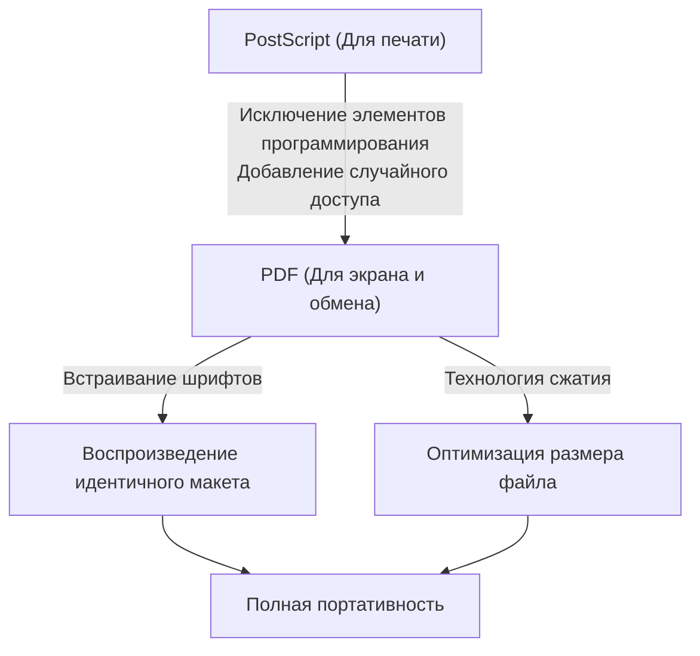

## Введение: Необходимость «бумаги» в цифровом мире

В современном бизнесе и повседневной жизни не проходит и дня, чтобы мы не столкнулись с PDF (Portable Document Format). Договоры, руководства, счета-фактуры, научные статьи и даже меню ресторанов — любые документы передаются в формате PDF. Однако на заре компьютерной эры создание документа, который «выглядел бы одинаково на любом устройстве», было сродни мечте.

В 1980-х годах компьютерная среда была гораздо более фрагментированной, чем сегодня. Существовало множество операционных систем, таких как Windows, Macintosh, рабочие станции UNIX и MS-DOS, и каждая из них имела собственные форматы шрифтов, движки отрисовки и форматы файлов. Обычным делом было то, что когда красиво сверстанный документ, созданный пользователем А на Mac, открывал пользователь Б на Windows, шрифты заменялись, верстка разрушалась, а изображения не отображались.

Основатели Adobe Systems (ныне Adobe) попытались решить эту проблему и создать «бумагу в цифровом мире». В этой статье мы подробно рассмотрим историю и технические предпосылки того, как появился формат PDF, как он преодолел технические барьеры и эволюционировал в мировой стандарт формата документов, имеющий юридическую силу.

## Революция PostScript и рассвет DTP

Говоря об истории PDF, невозможно обойти стороной язык описания страниц «PostScript».

В 1982 году Джон Уорнок и Чарльз Гешке, работавшие в исследовательском центре Xerox в Пало-Альто (PARC), разрабатывали язык программирования для высококачественной печати, не зависящей от устройства. Однако, поскольку не было перспектив быстрого внедрения этой технологии в коммерческие продукты внутри Xerox, они ушли и основали независимую компанию Adobe Systems. Результатом их работы стал PostScript.

### Концепция независимости от устройства

Принтеры того времени получали текстовые данные и простые управляющие коды от компьютера и печатали на бумаге растровые шрифты, аппаратно встроенные в принтер. Из-за этого при смене модели принтера результаты печати тоже менялись, а распечатать сложные формы или плавные кривые было трудно.

PostScript использовал совершенно другой подход. Внешний вид документа описывался как «математические векторные данные». Текст, прямые линии, кривые, изображения и другие элементы отправлялись на принтер в виде набора математических формул и команд. Принтер имел встроенный «интерпретатор PostScript», своего рода небольшой компьютер, который на лету интерпретировал (растеризовал) полученную программу и печатал ее с максимально возможным для себя разрешением.

В результате документы, созданные с низким разрешением на экране, выводились с потрясающей красотой на лазерных принтерах высокого разрешения или коммерческих печатных машинах. В 1985 году технология PostScript была внедрена в принтер Apple «LaserWriter», и сочетание «Macintosh», «PageMaker» и «LaserWriter» породило новую индустрию под названием Desktop Publishing (DTP, настольные издательские системы).

## Проект Camelot: Тот же опыт на экране

PostScript произвел революцию в полиграфической промышленности, но у него был один недостаток: он был «очень сложным языком программирования, слишком тяжелым для быстрого отображения на экране». Файлы PostScript могли содержать циклы и условные переходы, и до окончания вычислений было неизвестно, как будет выглядеть конечная страница.

В начале 1990-х годов, накануне широкого распространения Интернета, Джон Уорнок написал для внутреннего использования короткую статью под названием «Проект Camelot» (The Camelot Project).

> «Наша цель — позволить документам любого типа, созданным на любой платформе, быть захваченными в цифровом формате, переданными на любой компьютер, отображенными на любом экране и напечатанными на любом принтере»

То, что представлял себе Уорнок, было форматом документа, который не зависел от операционной системы, приложений или даже локально установленных шрифтов, и который можно было бы передавать, полностью сохраняя внешний вид, задуманный создателем.

### Рождение PDF

Формат PDF родился из проекта Camelot. Хотя PDF был основан на технологии PostScript, из него были исключены элементы языка программирования (такие как циклы и состояния переменных) для обеспечения быстрого рендеринга на экране и случайного доступа (возможности мгновенного перехода к любой странице).

Вместо этого PDF был структурирован как набор независимых объектов отрисовки для каждой страницы. Благодаря этому даже в документе на 1000 страниц системе не нужно вычислять все страницы по порядку начиная с первой, и она может мгновенно отобразить 500-ю страницу.

В 1993 году Adobe выпустила программное обеспечение «Acrobat» для создания и просмотра PDF-файлов. Поначалу даже программа для просмотра «Acrobat Reader» была платной (50 долларов), что замедлило распространение. Однако вскоре Adobe приняла стратегическое решение распространять Reader бесплатно. Этот шаг увенчался успехом, и PDF получил взрывное распространение.

## Базовая структура PDF и технические прорывы

Для того чтобы PDF работал как «электронная бумага», потребовалось несколько важных технических прорывов.

### 1. Встраивание шрифтов (Font Embedding)

Одной из важнейших технологий стало «встраивание шрифтов». В традиционных файлах текстовых редакторов (например, ранних документах Word) в данных документа сохранялись только «код символа» и «имя шрифта (например, MS Gothic)». Если этот шрифт не был установлен на ПК зрителя, ОС заменяла его другим шрифтом, в результате чего ширина символов менялась, позиции переноса строк смещались, и верстка разрушалась.

PDF имеет функцию упаковки данных о форме используемых шрифтов (контуров) прямо внутрь файла. Благодаря этому, даже если у зрителя вообще нет этого шрифта на устройстве, красивые символы могут отображаться в точности так же, как при создании. Кроме того, для уменьшения размера файла была разработана технология «встраивания подмножества» (subset embedding), при которой извлекаются и встраиваются только данные тех символов, которые фактически используются в документе.

### 2. Интеграция векторной графики и растровых изображений

PDF обладает мощным механизмом отрисовки векторной графики, унаследованным от PostScript. Поскольку корпоративные логотипы, графики и т. д. сохраняются в виде векторных данных, их края никогда не пикселизируются (не становятся зубчатыми) при любом увеличении. В то же время растровые изображения, такие как фотографии (пиксельные данные, сжатые с помощью JPEG или ZIP), также могут гибко встраиваться.

### 3. Внутренняя структура файла (Дерево и перекрестные ссылки)

Если вы заглянете внутрь PDF-файла с помощью текстового редактора, он начнется с заголовка вроде `%PDF-1.4`, за которым следует множество «объектов (словари, массивы, потоки и т. д.)».
Преимущество PDF заключается в том, что в конце файла имеется «Таблица перекрестных ссылок» (Cross-Reference Table). В этой таблице записаны байтовые смещения всех объектов в файле.

Когда программа для чтения PDF открывает файл, она сначала считывает его с конца и получает таблицу перекрестных ссылок. Поэтому, когда требуются данные определенной страницы, она может обратиться к таблице и извлечь нужные данные с диска, не анализируя весь файл. Именно поэтому даже огромные PDF-файлы работают быстро.

## Эволюция как цифрового документа: Электронные подписи и безопасность

PDF эволюционировал не просто для «просмотра печатных материалов на экране», но и для того, чтобы функционировать как «оригинал» в бизнес-среде.

### Электронные подписи (Digital Signatures) и криптография с открытым ключом

Самое большое опасение при оцифровке контрактов и официальных документов — это «доказательство того, что они не были подделаны» и «доказательство того, что их создал сам человек». В формат PDF на уровне спецификации встроена поддержка электронных подписей с использованием инфраструктуры открытых ключей (PKI).

Хэш-значение документа вычисляется, шифруется закрытым ключом подписанта и встраивается в PDF. Таким образом реализован механизм, при котором подпись становится недействительной, если впоследствии будет изменено хотя бы на 1 байт содержимого. В результате PDF получил юридическую силу, равную или даже превосходящую проставление печати на бумаге.

### Безопасность и контроль доступа

В PDF также реализованы мощные функции шифрования (например, AES-256). Помимо «пароля на открытие» (open password) для открытия документа, к самому файлу можно применять тонкие настройки прав доступа (пароль разрешений), такие как запрет печати, запрет копирования текста или запрет извлечения страниц.

## Путь к мировому стандарту (ISO 32000)

На протяжении многих лет PDF был проприетарным (закрытым) форматом Adobe Systems. Однако Adobe бесплатно опубликовала его спецификации, позволив любому желающему разрабатывать программное обеспечение для создания и просмотра PDF. Это породило огромную экосистему сторонних разработчиков.

И в 2008 году Adobe отказалась от полного контроля над PDF и передала его Международной организации по стандартизации (ISO). Благодаря этому PDF стал официальным международным стандартом «ISO 32000-1». Став открытым форматом, не зависящим от какой-либо конкретной компании, он укрепил свои позиции в качестве формата хранения официальных документов правительств различных стран.

Кроме того, были созданы производные стандарты для конкретных целей:
- **PDF/A (Archive):** Для долгосрочного хранения. Запрещает использование внешних шрифтов и шифрования, гарантируя возможность открытия документа даже спустя десятилетия.
- **PDF/X (Exchange):** Для полиграфической промышленности. Строго определяет цветовые профили (CMYK) для предотвращения проблем при печати.
- **PDF/UA (Universal Accessibility):** Определяет логическую структуру (теги) документа, чтобы программы чтения с экрана для людей с нарушениями зрения могли правильно его считывать.

## Заключение

Видение Джона Уорнока в проекте Camelot: «Возможность делиться документами в точности так, как они были задуманы, с кем угодно, где угодно и на любом устройстве», стало абсолютной реальностью в современном обществе.

PDF — это не просто «бумага в виде картинки». Это чрезвычайно сложно спроектированная «цифровая бумага», в которой возможен поиск текста, сохраняется красота векторов, имеется защита с помощью криптографических технологий и присутствует логическая структура. История PDF, начавшаяся с языка программирования PostScript, избавившаяся от излишней сложности для обеспечения портативности и в итоге достигшая статуса международного стандарта для сохранения человеческих знаний — пожалуй, одна из величайших историй успеха в истории компьютерного программного обеспечения.
