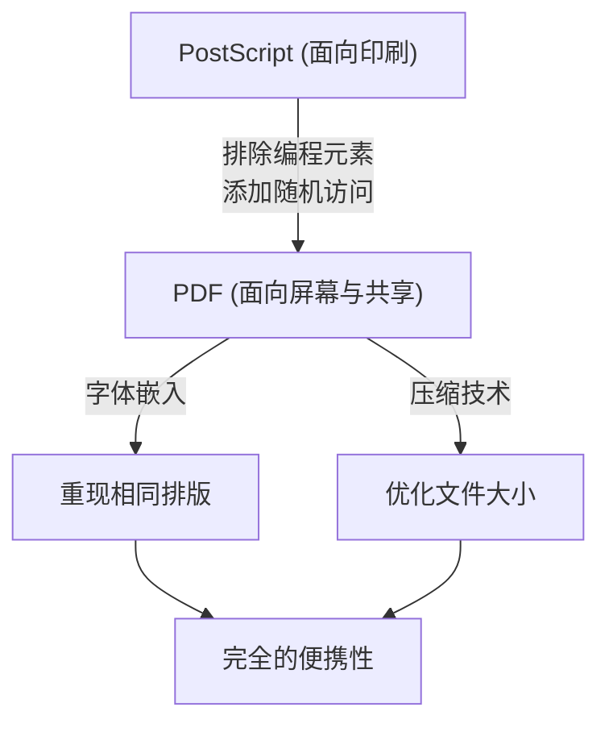

## 引言：数字世界中“纸张”的必要性

在现代的商业和日常生活中，几乎没有一天看不到PDF（Portable Document Format，便携式文档格式）。合同、手册、发票、学术论文，甚至餐厅的菜单，所有文档都以PDF的形式被共享。然而，在计算机的黎明期，制作“在任何终端上看起来都一样的文档”是一个梦幻般的故事。

1980年代的计算机环境比现在碎片化得多。Windows、Macintosh、UNIX工作站和MS-DOS等各种操作系统林立，各自拥有独有的字体格式、渲染引擎和文件格式。A先生在Mac上制作了排版优美的文档，B先生在Windows上打开时，字体被替换，排版崩溃，图片无法显示，这在当时是家常便饭。

试图解决这个问题，创造出“数字世界中的纸张”的，正是Adobe Systems（现Adobe）的创始人们。在本文中，我们将深入探讨PDF是如何诞生的，如何克服技术壁垒，演变为具有法律效力的世界标准文档格式，以及其历史和技术背景。

## PostScript的革命与DTP的曙光

在讲述PDF的历史时，不能避开的是一种名为“PostScript”的页面描述语言。

1982年，在施乐帕罗奥多研究中心（PARC）工作的约翰·沃诺克（John Warnock）和查尔斯·格施克（Charles Geschke），正在开发一种独立于设备、用于进行高质量打印的编程语言。然而，由于该技术在施乐内部没有立即实现产品化的希望，他们独立出来成立了Adobe Systems。随后完成的便是PostScript。

### 设备无关的概念

当时的打印机接收来自计算机的文本数据和简单的控制代码，并使用作为硬件内置在打印机内部的点阵字体打印在纸上。因此，如果打印机型号改变，打印结果也会改变，打印复杂的图形和平滑的曲线非常困难。

PostScript采取了完全不同的方法。它将文档的外观描述为“数学矢量数据”。文本、直线、曲线、图像等元素作为数学公式和命令的集合发送到打印机。打印机端内置了一种称为“PostScript解释器”的小型计算机，它在现场解释（光栅化）接收到的程序，并以其自身拥有的最高分辨率进行打印。

由此，即使是在屏幕上以低分辨率制作的文档，也能在具有高分辨率的激光打印机或商业印刷机上极其精美地输出。1985年，苹果公司的“LaserWriter”搭载了PostScript，“Macintosh”、“PageMaker”和“LaserWriter”的组合催生了桌面出版（Desktop Publishing，DTP）这个新产业。

## Camelot Project：在屏幕上获得相同的体验

虽然PostScript为印刷业带来了革命，但它有一个弱点。那就是“因为它是一种非常复杂的编程语言，为了在屏幕上快速显示，它太重了”。PostScript文件可以包含循环处理和条件分支，在完成计算之前无法知道最终页面的外观。

1990年代初，在互联网普及即将到来之际，约翰·沃诺克在公司内部写了一篇题为“The Camelot Project”的简短论文。

> “我们的目标是，能够从任何平台、捕获任何文档的数字格式，能够将其传输到任何计算机，在任何屏幕上显示，并在任何打印机上打印。”

沃诺克设想的是一种完全不受操作系统、应用程序甚至本地安装字体差异影响，能够完全保持创建者意图的外观并进行共享的文档格式。

### PDF的诞生

从Camelot Project中诞生了PDF。PDF以PostScript技术为基础，为了实现在屏幕上的高速渲染和随机访问（能够立即跳转到任意页面的功能），削减了作为编程语言的元素（循环和变量状态等）。

取而代之的是，PDF被结构化为每页独立的绘制对象的集合。由此，即使是1000页的文档，系统也不必从第一页按顺序计算，可以瞬间显示第500页。

1993年，Adobe发布了用于创建和查看PDF文件的软件“Acrobat”。起初，用于查看的“Acrobat Reader”也是收费的（50美元），因此普及缓慢。然而，Adobe很快做出了免费分发Reader的战略决策。这取得了成功，PDF开始爆炸性地普及。

## PDF的基本结构和技术突破

为了让PDF作为“电子纸”发挥作用，需要几个关键的技术突破。

### 1. 字体嵌入（Font Embedding）

最重要的技术之一是“字体嵌入”。在传统的文字处理软件文件（例如早期的Word文档）中，文档数据仅保存“字符代码”和“字体名称（如：MS Gothic）”。如果查看者的PC上没有安装该字体，操作系统将使用其他字体代替，导致字符宽度改变，换行位置错位，排版崩溃。

PDF具有将所使用字体的形状数据（轮廓）本身打包在文件内的功能。因此，即使查看者的终端上完全不存在该字体，也能显示与创建时分毫不差的精美文字。此外，为了控制文件大小，还开发了仅提取并嵌入文档中实际使用的字符数据的“子集嵌入”技术。

### 2. 矢量图形和光栅图像的集成

PDF拥有继承自PostScript的强大矢量图形渲染引擎。因为企业Logo和图表等作为矢量数据保存，所以无论放大多少倍，边缘都不会像素化（产生锯齿）。同时，照片等光栅图像（JPEG或ZIP压缩的像素数据）也可以灵活地嵌入。

### 3. 文件内部结构（树和交叉引用）

如果在文本编辑器中查看PDF文件的内容，它以类似于 `%PDF-1.4` 的文件头开始，排列着许多“对象（字典、数组、流等）”。
PDF的优点在于，它在文件末尾有一个“交叉引用表（Cross-Reference Table）”。该表记录了文件中所有对象的字节偏移位置。

当PDF阅读器打开文件时，它首先从末尾读取并获取交叉引用表。因此，当需要特定页面的数据时，系统无需解析整个文件，即可通过参考该表从磁盘中精准读取所需的数据。这就是为什么即使是巨大的PDF文件也能快速运行的原因。

## 作为数字文档的进化：电子签名和安全性

PDF不仅实现了“在屏幕上查看印刷品”，还演变为可以在商业现场作为“原件”发挥作用的格式。

### 电子签名（Digital Signatures）和公钥密码学

将合同或公文数字化的最大担忧是“证明未被篡改”和“证明由本人创建”。PDF在格式层面内置了使用公钥基础设施（PKI）的电子签名规范。

通过计算文档的哈希值，用签名者的私钥加密并嵌入到PDF中，实现了一旦事后有哪怕1个字节的内容被修改，签名就会失效的机制。由此，PDF获得了与在纸上盖章同等甚至更高的法律证据能力。

### 安全性和访问控制

PDF还实现了强大的加密功能（如AES-256）。不仅可以设置打开文档的“打开密码”，还可以赋予文件本身精细的权限设置（权限密码），例如禁止打印、禁止复制文本、禁止提取页面等。

## 走向世界标准（ISO 32000）之路

多年来，PDF一直是Adobe Systems的专有格式（Proprietary）。然而，Adobe免费公开了其规范，允许任何人开发PDF创建软件和阅读软件。这催生了庞大的第三方生态系统。

随后在2008年，Adobe放弃了对PDF的完全控制权，将其移交给国际标准化组织（ISO）。由此，PDF作为“ISO 32000-1”正式成为国际标准规范。由于它成为不依赖于特定公司的开放格式，巩固了其作为各国政府公文保存格式的地位。

此外，还诞生了根据用途衍生出的标准。
- **PDF/A (Archive):** 面向长期保存。禁止使用外部字体和加密，确保即使在几十年后也能可靠地打开。
- **PDF/X (Exchange):** 面向印刷业。严格定义颜色配置文件（CMYK），防止印刷时出现故障。
- **PDF/UA (Universal Accessibility):** 为了让面向视觉障碍者的屏幕阅读器能够正确朗读，定义了文档的逻辑结构（标签）。

## 结语

约翰·沃诺克在“Camelot Project”中梦想的“能够在世界上任何地方、与任何人、在任何终端上共享符合意图的文档”的愿景，在现代社会中已完全成为现实。

PDF不仅仅是“图像化的纸张”。它是可以搜索文本、拥有矢量之美、受密码技术保护、具有逻辑结构、设计极度复杂的“数字纸张”。从名为PostScript的编程语言开始，削减复杂性以获得便携性，最终成为保存人类知识的国际标准的PDF的历史，可以说是计算机软件史上最伟大的成功故事之一。
