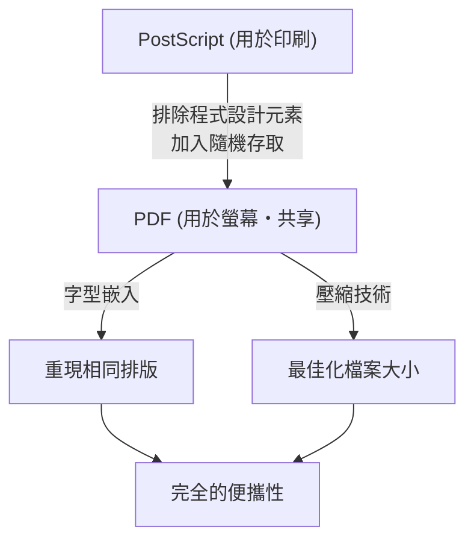

## 前言：數位世界對「紙」的需求

在現代商業與日常生活中，PDF（Portable Document Format，可攜式文件格式）幾乎無處不在。從合約、手冊、發票、學術論文，甚至到餐廳菜單，各種文件皆以 PDF 格式共享。然而，在電腦發展的初期，想要製作出「在任何裝置上看起來都一樣的文件」，簡直是天方夜譚。

1980 年代的電腦環境比現在破碎得多。Windows、Macintosh、UNIX 工作站以及 MS-DOS 等各種作業系統林立，各自擁有獨立的字型格式、繪圖引擎與檔案格式。A 在 Mac 上製作的精美排版文件，B 在 Windows 上開啟時，字型被替換、排版跑位、圖片無法顯示，這些都是家常便飯。

為了解決這個問題，並創造出「數位世界的紙」，Adobe Systems（現為 Adobe）的創辦人們挺身而出。本文將深入探討 PDF 的誕生過程，以及它如何克服技術障礙，演變成具備法律效力的世界標準文件格式，並剖析其歷史與技術背景。

## PostScript 的革命與 DTP 的黎明

談到 PDF 的歷史，絕對無法避開名為「PostScript」的頁面描述語言。

1982 年，任職於全錄（Xerox）帕羅奧多研究中心（PARC）的 John Warnock 和 Charles Geschke，正在開發一種不依賴裝置、能進行高品質列印的程式語言。然而，由於這項技術在全錄內部短期內沒有產品化的希望，兩人便獨立創辦了 Adobe Systems。隨後他們完成的，正是 PostScript。

### 獨立於裝置的概念

當時的印表機接收來自電腦的文字資料與簡單的控制碼，然後將內建於印表機硬體中的點陣字型列印在紙上。因此，只要印表機機型不同，列印結果就會改變，而且很難列印出複雜的圖形或平滑的曲線。

PostScript 採用了截然不同的方法。它將文件的外觀描述為「數學的向量資料」。文字、直線、曲線、圖片等元素，作為數學公式與指令的集合體傳送至印表機。印表機端內建了一種名為「PostScript 直譯器」的小型電腦，能即時解析（光柵化）接收到的程式，並以其支援的最高解析度進行列印。

因此，即使是在畫面上以粗糙解析度製作的文件，也能透過高解析度的雷射印表機或商業印刷機印出極為精美的成果。1985 年，Apple 的「LaserWriter」搭載了 PostScript，「Macintosh」、「PageMaker」與「LaserWriter」的組合催生了桌上出版（Desktop Publishing, DTP）這個新產業。

## Camelot Project：在畫面上也能有相同的體驗

雖然 PostScript 為印刷業帶來了革命，但它有一個弱點：「由於是非常複雜的程式語言，要在畫面上高速顯示會太過沉重」。PostScript 檔案可以包含迴圈處理與條件分支，在完成計算前，無從得知最終頁面的樣貌。

1990 年代初期，在網際網路即將普及之際，John Warnock 撰寫了一篇題為「The Camelot Project」的內部短文。

> 「我們的目標是，無論從哪個平台、哪種文件，都能以數位形式擷取，並傳輸到任何電腦、在任何螢幕上顯示、在任何印表機上列印。」

Warnock 描繪的，是一種完全不受 OS、應用程式，甚至是本機安裝字型差異影響，能夠完美保留創作者意圖外觀並進行共享的文件格式。

### PDF 的誕生

PDF 正是從 Camelot Project 中誕生的。PDF 雖以 PostScript 技術為基礎，但為了實現畫面上的高速渲染與隨機存取（能立即跳至任意頁面的功能），它去除了作為程式語言的元素（如迴圈與變數狀態等）。

取而代之的是，PDF 被結構化為每個頁面獨立的繪圖物件集合。因此，即使是 1000 頁的文件，系統也不必從第 1 頁開始依序計算，而是能瞬間顯示第 500 頁。

1993 年，Adobe 發布了用於建立與檢視 PDF 檔案的軟體「Acrobat」。起初，連檢視用的「Acrobat Reader」也是收費的（50 美元），因此普及進度緩慢。然而，Adobe 隨即做出了免費散布 Reader 的策略性決定。此舉大獲成功，PDF 隨後迎來了爆發性的普及。

## PDF 的基本結構與技術突破

要讓 PDF 發揮「電子紙張」的功能，必須要有幾個關鍵的技術突破。

### 1. 字型嵌入（Font Embedding）

最重要的技術之一就是「字型嵌入」。在傳統的文書處理軟體檔案中（例如早期的 Word 文件），文件資料僅儲存了「文字編碼」與「字型名稱（例如：MS Gothic）」。如果檢視者的電腦中沒有安裝該字型，OS 就會使用其他字型代替，導致文字寬度改變、換行位置偏移，進而使排版崩潰。

PDF 具備將所使用字型的形狀資料（外框）本身封裝進檔案內的功能。因此，即使檢視者的裝置中完全沒有該字型，也能顯示出與建立時分毫不差的優美文字。此外，為了控制檔案大小，還開發出了僅提取文件中實際使用的文字資料進行嵌入的「子集嵌入（Subset Embedding）」技術。

### 2. 向量圖形與點陣圖片的整合

PDF 擁有繼承自 PostScript 的強大向量圖形繪圖引擎。因為將企業標誌或圖表等作為向量資料保存，所以無論怎麼放大，邊緣都不會出現像素化（鋸齒）。同時，也能靈活地嵌入照片等點陣圖片（JPEG 或 ZIP 壓縮的像素資料）。

### 3. 檔案內部結構（樹狀與交互參照）

若用文字編輯器查看 PDF 檔案的內容，會發現它以類似 `%PDF-1.4` 的標頭開頭，接著排列了許多「物件（字典、陣列、串流等）」。
PDF 的優點在於其檔案末尾具有「交互參照表（Cross-Reference Table）」。這張表中記錄了檔案內所有物件的位元組偏移位置。

PDF 閱讀器在開啟檔案時，會先從末尾開始讀取，獲取交互參照表。因此，當需要特定頁面的資料時，不必解析整個檔案，只需參照該表即可精準地從磁碟中讀取所需的資料。這就是為什麼即使是巨大的 PDF 檔案也能高速運作的原因。

## 作為數位文件的演進：電子簽名與安全性

PDF 不僅僅是「在螢幕上看印刷品」，它還為了能在商業現場作為「正本」發揮作用而持續演進。

### 電子簽名（Digital Signatures）與公開金鑰密碼學

將合約或官方文件數位化時，最大的隱憂是「證明未被篡改」與「證明為本人製作」。PDF 在格式層級納入了利用公開金鑰基礎建設（PKI）的電子簽名規範。

透過計算文件的雜湊值，以簽名者的私鑰加密並嵌入 PDF 內，實現了日後只要內容被更改 1 位元組，簽名就會失效的機制。這使得 PDF 具備了與在紙本上蓋章同等，甚至更高的法律證據能力。

### 安全性與存取控制

PDF 也實作了強大的加密功能（如 AES-256）。不僅是開啟文件用的「開啟密碼」，還能為檔案本身賦予禁止列印、禁止複製文字、禁止提取頁面等鉅細靡遺的權限設定（權限密碼）。

## 邁向世界標準（ISO 32000）之路

長年以來，PDF 一直是 Adobe Systems 的專有格式（Proprietary）。然而，Adobe 免費公開了其規範，讓任何人都能開發 PDF 建立軟體與檢視軟體。這催生了龐大的第三方生態系統。

而在 2008 年，Adobe 放棄了對 PDF 的完全控制權，將其轉讓給國際標準化組織（ISO）。因此，PDF 以「ISO 32000-1」正式成為國際標準規格。由於成為不依賴特定企業的開放格式，它作為各國政府公文書保存格式的地位變得堅不可摧。

此外，也誕生了因應不同用途的衍生規格：
- **PDF/A (Archive):** 針對長期保存。禁止外部字型與加密，保證數十年後仍能確實開啟。
- **PDF/X (Exchange):** 針對印刷業。嚴格定義色彩描述檔（CMYK），防止印刷時的故障。
- **PDF/UA (Universal Accessibility):** 為了讓視障者使用的螢幕閱讀器能正確朗讀，定義了文件的邏輯結構（標籤）。

## 結語

John Warnock 在「Camelot Project」中夢想的「無論在世界何處、與任何人、在任何裝置上，都能共享如預期般的文件」之願景，在現代社會中已完全成為現實。

PDF 絕非單純的「圖片化的紙張」。它是可搜尋文字、具有向量美感、受加密技術保護、擁有邏輯結構，經過極度精密設計的「數位紙張」。從 PostScript 這種程式語言開始，透過削減複雜性獲得了便攜性，最終達到保存人類知識的國際標準，PDF 的歷史可以說是電腦軟體史上最偉大的成功故事之一。
