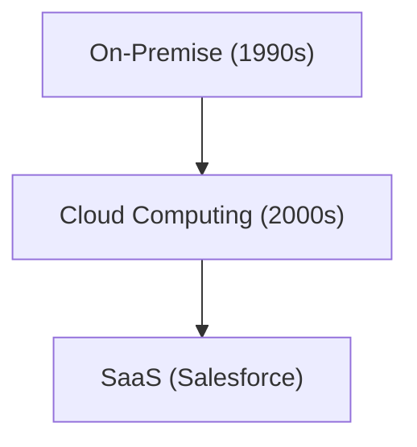

# Unternehmensgeschichte: Die Geschichte von Salesforce - Pionier von SaaS (Cloud-Software)

Salesforce ist ein Pionier von SaaS.

## Die Entwicklung des Cloud Computings

## Mathematisches Modell
Das Wachstumsmodell von SaaS sieht wie folgt aus:
$$ R(t) = R_0 e^{kt} $$

## Zusätzlicher Technik-Evaluierungsteil 1

In diesem Abschnitt werden weitere technische Details und Fallstudien vertieft. Wir werden Leistungsbewertungen unter verschiedenen Bedingungen sowie Herausforderungen und Lösungen bei der Integration mit anderen Systemen untersuchen. Auch zukünftige Aussichten und Grenzen werden diskutiert.

