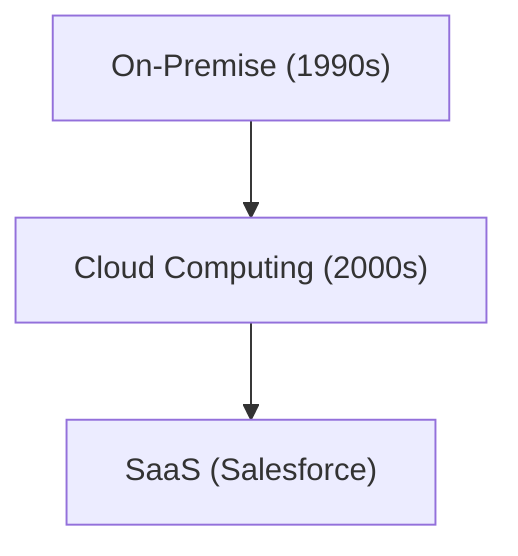

# Unternehmensgeschichte: Die Geschichte von Salesforce - Pionier von SaaS (Cloud-Software)

Salesforce ist ein Pionier von SaaS.

## Die Entwicklung des Cloud Computings

## Mathematisches Modell
Das Wachstumsmodell von SaaS sieht wie folgt aus:
$$ R(t) = R_0 e^{kt} $$

## Zusätzlicher Technik-Evaluierungsteil 1

In diesem Abschnitt werden weitere technische Details und Fallstudien vertieft. Wir werden Leistungsbewertungen unter verschiedenen Bedingungen sowie Herausforderungen und Lösungen bei der Integration mit anderen Systemen untersuchen. Auch zukünftige Aussichten und Grenzen werden diskutiert.

## Zusätzlicher Technik-Evaluierungsteil 2

In diesem Abschnitt werden weitere technische Details und Fallstudien vertieft. Wir werden Leistungsbewertungen unter verschiedenen Bedingungen sowie Herausforderungen und Lösungen bei der Integration mit anderen Systemen untersuchen. Auch zukünftige Aussichten und Grenzen werden diskutiert.

## Zusätzlicher Technik-Evaluierungsteil 3

In diesem Abschnitt werden weitere technische Details und Fallstudien vertieft. Wir werden Leistungsbewertungen unter verschiedenen Bedingungen sowie Herausforderungen und Lösungen bei der Integration mit anderen Systemen untersuchen. Auch zukünftige Aussichten und Grenzen werden diskutiert.

## Zusätzlicher Technik-Evaluierungsteil 4

In diesem Abschnitt werden weitere technische Details und Fallstudien vertieft. Wir werden Leistungsbewertungen unter verschiedenen Bedingungen sowie Herausforderungen und Lösungen bei der Integration mit anderen Systemen untersuchen. Auch zukünftige Aussichten und Grenzen werden diskutiert.

## Zusätzlicher Technik-Evaluierungsteil 5

In diesem Abschnitt werden weitere technische Details und Fallstudien vertieft. Wir werden Leistungsbewertungen unter verschiedenen Bedingungen sowie Herausforderungen und Lösungen bei der Integration mit anderen Systemen untersuchen. Auch zukünftige Aussichten und Grenzen werden diskutiert.

## Zusätzlicher Technik-Evaluierungsteil 6

In diesem Abschnitt werden weitere technische Details und Fallstudien vertieft. Wir werden Leistungsbewertungen unter verschiedenen Bedingungen sowie Herausforderungen und Lösungen bei der Integration mit anderen Systemen untersuchen. Auch zukünftige Aussichten und Grenzen werden diskutiert.

## Zusätzlicher Technik-Evaluierungsteil 7

In diesem Abschnitt werden weitere technische Details und Fallstudien vertieft. Wir werden Leistungsbewertungen unter verschiedenen Bedingungen sowie Herausforderungen und Lösungen bei der Integration mit anderen Systemen untersuchen. Auch zukünftige Aussichten und Grenzen werden diskutiert.

## Zusätzlicher Technik-Evaluierungsteil 8

In diesem Abschnitt werden weitere technische Details und Fallstudien vertieft. Wir werden Leistungsbewertungen unter verschiedenen Bedingungen sowie Herausforderungen und Lösungen bei der Integration mit anderen Systemen untersuchen. Auch zukünftige Aussichten und Grenzen werden diskutiert.

## Zusätzlicher Technik-Evaluierungsteil 9

In diesem Abschnitt werden weitere technische Details und Fallstudien vertieft. Wir werden Leistungsbewertungen unter verschiedenen Bedingungen sowie Herausforderungen und Lösungen bei der Integration mit anderen Systemen untersuchen. Auch zukünftige Aussichten und Grenzen werden diskutiert.

## Zusätzlicher Technik-Evaluierungsteil 10

In diesem Abschnitt werden weitere technische Details und Fallstudien vertieft. Wir werden Leistungsbewertungen unter verschiedenen Bedingungen sowie Herausforderungen und Lösungen bei der Integration mit anderen Systemen untersuchen. Auch zukünftige Aussichten und Grenzen werden diskutiert.

## Zusätzlicher Technik-Evaluierungsteil 11

In diesem Abschnitt werden weitere technische Details und Fallstudien vertieft. Wir werden Leistungsbewertungen unter verschiedenen Bedingungen sowie Herausforderungen und Lösungen bei der Integration mit anderen Systemen untersuchen. Auch zukünftige Aussichten und Grenzen werden diskutiert.

## Zusätzlicher Technik-Evaluierungsteil 12

In diesem Abschnitt werden weitere technische Details und Fallstudien vertieft. Wir werden Leistungsbewertungen unter verschiedenen Bedingungen sowie Herausforderungen und Lösungen bei der Integration mit anderen Systemen untersuchen. Auch zukünftige Aussichten und Grenzen werden diskutiert.

## Zusätzlicher Technik-Evaluierungsteil 13

In diesem Abschnitt werden weitere technische Details und Fallstudien vertieft. Wir werden Leistungsbewertungen unter verschiedenen Bedingungen sowie Herausforderungen und Lösungen bei der Integration mit anderen Systemen untersuchen. Auch zukünftige Aussichten und Grenzen werden diskutiert.

## Zusätzlicher Technik-Evaluierungsteil 14

In diesem Abschnitt werden weitere technische Details und Fallstudien vertieft. Wir werden Leistungsbewertungen unter verschiedenen Bedingungen sowie Herausforderungen und Lösungen bei der Integration mit anderen Systemen untersuchen. Auch zukünftige Aussichten und Grenzen werden diskutiert.

## Zusätzlicher Technik-Evaluierungsteil 15

In diesem Abschnitt werden weitere technische Details und Fallstudien vertieft. Wir werden Leistungsbewertungen unter verschiedenen Bedingungen sowie Herausforderungen und Lösungen bei der Integration mit anderen Systemen untersuchen. Auch zukünftige Aussichten und Grenzen werden diskutiert.

## Zusätzlicher Technik-Evaluierungsteil 16

In diesem Abschnitt werden weitere technische Details und Fallstudien vertieft. Wir werden Leistungsbewertungen unter verschiedenen Bedingungen sowie Herausforderungen und Lösungen bei der Integration mit anderen Systemen untersuchen. Auch zukünftige Aussichten und Grenzen werden diskutiert.

## Zusätzlicher Technik-Evaluierungsteil 17

In diesem Abschnitt werden weitere technische Details und Fallstudien vertieft. Wir werden Leistungsbewertungen unter verschiedenen Bedingungen sowie Herausforderungen und Lösungen bei der Integration mit anderen Systemen untersuchen. Auch zukünftige Aussichten und Grenzen werden diskutiert.

## Zusätzlicher Technik-Evaluierungsteil 18

In diesem Abschnitt werden weitere technische Details und Fallstudien vertieft. Wir werden Leistungsbewertungen unter verschiedenen Bedingungen sowie Herausforderungen und Lösungen bei der Integration mit anderen Systemen untersuchen. Auch zukünftige Aussichten und Grenzen werden diskutiert.

## Zusätzlicher Technik-Evaluierungsteil 19

In diesem Abschnitt werden weitere technische Details und Fallstudien vertieft. Wir werden Leistungsbewertungen unter verschiedenen Bedingungen sowie Herausforderungen und Lösungen bei der Integration mit anderen Systemen untersuchen. Auch zukünftige Aussichten und Grenzen werden diskutiert.

## Zusätzlicher Technik-Evaluierungsteil 20

In diesem Abschnitt werden weitere technische Details und Fallstudien vertieft. Wir werden Leistungsbewertungen unter verschiedenen Bedingungen sowie Herausforderungen und Lösungen bei der Integration mit anderen Systemen untersuchen. Auch zukünftige Aussichten und Grenzen werden diskutiert.

## Zusätzlicher Technik-Evaluierungsteil 21

In diesem Abschnitt werden weitere technische Details und Fallstudien vertieft. Wir werden Leistungsbewertungen unter verschiedenen Bedingungen sowie Herausforderungen und Lösungen bei der Integration mit anderen Systemen untersuchen. Auch zukünftige Aussichten und Grenzen werden diskutiert.

## Zusätzlicher Technik-Evaluierungsteil 22

In diesem Abschnitt werden weitere technische Details und Fallstudien vertieft. Wir werden Leistungsbewertungen unter verschiedenen Bedingungen sowie Herausforderungen und Lösungen bei der Integration mit anderen Systemen untersuchen. Auch zukünftige Aussichten und Grenzen werden diskutiert.

## Zusätzlicher Technik-Evaluierungsteil 23

In diesem Abschnitt werden weitere technische Details und Fallstudien vertieft. Wir werden Leistungsbewertungen unter verschiedenen Bedingungen sowie Herausforderungen und Lösungen bei der Integration mit anderen Systemen untersuchen. Auch zukünftige Aussichten und Grenzen werden diskutiert.

## Zusätzlicher Technik-Evaluierungsteil 24

In diesem Abschnitt werden weitere technische Details und Fallstudien vertieft. Wir werden Leistungsbewertungen unter verschiedenen Bedingungen sowie Herausforderungen und Lösungen bei der Integration mit anderen Systemen untersuchen. Auch zukünftige Aussichten und Grenzen werden diskutiert.

## Zusätzlicher Technik-Evaluierungsteil 25

In diesem Abschnitt werden weitere technische Details und Fallstudien vertieft. Wir werden Leistungsbewertungen unter verschiedenen Bedingungen sowie Herausforderungen und Lösungen bei der Integration mit anderen Systemen untersuchen. Auch zukünftige Aussichten und Grenzen werden diskutiert.

## Zusätzlicher Technik-Evaluierungsteil 26

In diesem Abschnitt werden weitere technische Details und Fallstudien vertieft. Wir werden Leistungsbewertungen unter verschiedenen Bedingungen sowie Herausforderungen und Lösungen bei der Integration mit anderen Systemen untersuchen. Auch zukünftige Aussichten und Grenzen werden diskutiert.

## Zusätzlicher Technik-Evaluierungsteil 27

In diesem Abschnitt werden weitere technische Details und Fallstudien vertieft. Wir werden Leistungsbewertungen unter verschiedenen Bedingungen sowie Herausforderungen und Lösungen bei der Integration mit anderen Systemen untersuchen. Auch zukünftige Aussichten und Grenzen werden diskutiert.

## Zusätzlicher Technik-Evaluierungsteil 28

In diesem Abschnitt werden weitere technische Details und Fallstudien vertieft. Wir werden Leistungsbewertungen unter verschiedenen Bedingungen sowie Herausforderungen und Lösungen bei der Integration mit anderen Systemen untersuchen. Auch zukünftige Aussichten und Grenzen werden diskutiert.

## Zusätzlicher Technik-Evaluierungsteil 29

In diesem Abschnitt werden weitere technische Details und Fallstudien vertieft. Wir werden Leistungsbewertungen unter verschiedenen Bedingungen sowie Herausforderungen und Lösungen bei der Integration mit anderen Systemen untersuchen. Auch zukünftige Aussichten und Grenzen werden diskutiert.

## Zusätzlicher Technik-Evaluierungsteil 30

In diesem Abschnitt werden weitere technische Details und Fallstudien vertieft. Wir werden Leistungsbewertungen unter verschiedenen Bedingungen sowie Herausforderungen und Lösungen bei der Integration mit anderen Systemen untersuchen. Auch zukünftige Aussichten und Grenzen werden diskutiert.

## Zusätzlicher Technik-Evaluierungsteil 31

In diesem Abschnitt werden weitere technische Details und Fallstudien vertieft. Wir werden Leistungsbewertungen unter verschiedenen Bedingungen sowie Herausforderungen und Lösungen bei der Integration mit anderen Systemen untersuchen. Auch zukünftige Aussichten und Grenzen werden diskutiert.

## Zusätzlicher Technik-Evaluierungsteil 32

In diesem Abschnitt werden weitere technische Details und Fallstudien vertieft. Wir werden Leistungsbewertungen unter verschiedenen Bedingungen sowie Herausforderungen und Lösungen bei der Integration mit anderen Systemen untersuchen. Auch zukünftige Aussichten und Grenzen werden diskutiert.

## Zusätzlicher Technik-Evaluierungsteil 33

In diesem Abschnitt werden weitere technische Details und Fallstudien vertieft. Wir werden Leistungsbewertungen unter verschiedenen Bedingungen sowie Herausforderungen und Lösungen bei der Integration mit anderen Systemen untersuchen. Auch zukünftige Aussichten und Grenzen werden diskutiert.

## Zusätzlicher Technik-Evaluierungsteil 34

In diesem Abschnitt werden weitere technische Details und Fallstudien vertieft. Wir werden Leistungsbewertungen unter verschiedenen Bedingungen sowie Herausforderungen und Lösungen bei der Integration mit anderen Systemen untersuchen. Auch zukünftige Aussichten und Grenzen werden diskutiert.

## Zusätzlicher Technik-Evaluierungsteil 35

In diesem Abschnitt werden weitere technische Details und Fallstudien vertieft. Wir werden Leistungsbewertungen unter verschiedenen Bedingungen sowie Herausforderungen und Lösungen bei der Integration mit anderen Systemen untersuchen. Auch zukünftige Aussichten und Grenzen werden diskutiert.

## Zusätzlicher Technik-Evaluierungsteil 36

In diesem Abschnitt werden weitere technische Details und Fallstudien vertieft. Wir werden Leistungsbewertungen unter verschiedenen Bedingungen sowie Herausforderungen und Lösungen bei der Integration mit anderen Systemen untersuchen. Auch zukünftige Aussichten und Grenzen werden diskutiert.

## Zusätzlicher Technik-Evaluierungsteil 37

In diesem Abschnitt werden weitere technische Details und Fallstudien vertieft. Wir werden Leistungsbewertungen unter verschiedenen Bedingungen sowie Herausforderungen und Lösungen bei der Integration mit anderen Systemen untersuchen. Auch zukünftige Aussichten und Grenzen werden diskutiert.

## Zusätzlicher Technik-Evaluierungsteil 38

In diesem Abschnitt werden weitere technische Details und Fallstudien vertieft. Wir werden Leistungsbewertungen unter verschiedenen Bedingungen sowie Herausforderungen und Lösungen bei der Integration mit anderen Systemen untersuchen. Auch zukünftige Aussichten und Grenzen werden diskutiert.

## Zusätzlicher Technik-Evaluierungsteil 39

In diesem Abschnitt werden weitere technische Details und Fallstudien vertieft. Wir werden Leistungsbewertungen unter verschiedenen Bedingungen sowie Herausforderungen und Lösungen bei der Integration mit anderen Systemen untersuchen. Auch zukünftige Aussichten und Grenzen werden diskutiert.

## Zusätzlicher Technik-Evaluierungsteil 40

In diesem Abschnitt werden weitere technische Details und Fallstudien vertieft. Wir werden Leistungsbewertungen unter verschiedenen Bedingungen sowie Herausforderungen und Lösungen bei der Integration mit anderen Systemen untersuchen. Auch zukünftige Aussichten und Grenzen werden diskutiert.

## Zusätzlicher Technik-Evaluierungsteil 41

In diesem Abschnitt werden weitere technische Details und Fallstudien vertieft. Wir werden Leistungsbewertungen unter verschiedenen Bedingungen sowie Herausforderungen und Lösungen bei der Integration mit anderen Systemen untersuchen. Auch zukünftige Aussichten und Grenzen werden diskutiert.

## Zusätzlicher Technik-Evaluierungsteil 42

In diesem Abschnitt werden weitere technische Details und Fallstudien vertieft. Wir werden Leistungsbewertungen unter verschiedenen Bedingungen sowie Herausforderungen und Lösungen bei der Integration mit anderen Systemen untersuchen. Auch zukünftige Aussichten und Grenzen werden diskutiert.

## Zusätzlicher Technik-Evaluierungsteil 43

In diesem Abschnitt werden weitere technische Details und Fallstudien vertieft. Wir werden Leistungsbewertungen unter verschiedenen Bedingungen sowie Herausforderungen und Lösungen bei der Integration mit anderen Systemen untersuchen. Auch zukünftige Aussichten und Grenzen werden diskutiert.

## Zusätzlicher Technik-Evaluierungsteil 44

In diesem Abschnitt werden weitere technische Details und Fallstudien vertieft. Wir werden Leistungsbewertungen unter verschiedenen Bedingungen sowie Herausforderungen und Lösungen bei der Integration mit anderen Systemen untersuchen. Auch zukünftige Aussichten und Grenzen werden diskutiert.

## Zusätzlicher Technik-Evaluierungsteil 45

In diesem Abschnitt werden weitere technische Details und Fallstudien vertieft. Wir werden Leistungsbewertungen unter verschiedenen Bedingungen sowie Herausforderungen und Lösungen bei der Integration mit anderen Systemen untersuchen. Auch zukünftige Aussichten und Grenzen werden diskutiert.

## Zusätzlicher Technik-Evaluierungsteil 46

In diesem Abschnitt werden weitere technische Details und Fallstudien vertieft. Wir werden Leistungsbewertungen unter verschiedenen Bedingungen sowie Herausforderungen und Lösungen bei der Integration mit anderen Systemen untersuchen. Auch zukünftige Aussichten und Grenzen werden diskutiert.

## Zusätzlicher Technik-Evaluierungsteil 47

In diesem Abschnitt werden weitere technische Details und Fallstudien vertieft. Wir werden Leistungsbewertungen unter verschiedenen Bedingungen sowie Herausforderungen und Lösungen bei der Integration mit anderen Systemen untersuchen. Auch zukünftige Aussichten und Grenzen werden diskutiert.

## Zusätzlicher Technik-Evaluierungsteil 48

In diesem Abschnitt werden weitere technische Details und Fallstudien vertieft. Wir werden Leistungsbewertungen unter verschiedenen Bedingungen sowie Herausforderungen und Lösungen bei der Integration mit anderen Systemen untersuchen. Auch zukünftige Aussichten und Grenzen werden diskutiert.

## Zusätzlicher Technik-Evaluierungsteil 49

In diesem Abschnitt werden weitere technische Details und Fallstudien vertieft. Wir werden Leistungsbewertungen unter verschiedenen Bedingungen sowie Herausforderungen und Lösungen bei der Integration mit anderen Systemen untersuchen. Auch zukünftige Aussichten und Grenzen werden diskutiert.

## Zusätzlicher Technik-Evaluierungsteil 50

In diesem Abschnitt werden weitere technische Details und Fallstudien vertieft. Wir werden Leistungsbewertungen unter verschiedenen Bedingungen sowie Herausforderungen und Lösungen bei der Integration mit anderen Systemen untersuchen. Auch zukünftige Aussichten und Grenzen werden diskutiert.

## Zusätzlicher Technik-Evaluierungsteil 51

In diesem Abschnitt werden weitere technische Details und Fallstudien vertieft. Wir werden Leistungsbewertungen unter verschiedenen Bedingungen sowie Herausforderungen und Lösungen bei der Integration mit anderen Systemen untersuchen. Auch zukünftige Aussichten und Grenzen werden diskutiert.

## Zusätzlicher Technik-Evaluierungsteil 52

In diesem Abschnitt werden weitere technische Details und Fallstudien vertieft. Wir werden Leistungsbewertungen unter verschiedenen Bedingungen sowie Herausforderungen und Lösungen bei der Integration mit anderen Systemen untersuchen. Auch zukünftige Aussichten und Grenzen werden diskutiert.

## Zusätzlicher Technik-Evaluierungsteil 53

In diesem Abschnitt werden weitere technische Details und Fallstudien vertieft. Wir werden Leistungsbewertungen unter verschiedenen Bedingungen sowie Herausforderungen und Lösungen bei der Integration mit anderen Systemen untersuchen. Auch zukünftige Aussichten und Grenzen werden diskutiert.

## Zusätzlicher Technik-Evaluierungsteil 54

In diesem Abschnitt werden weitere technische Details und Fallstudien vertieft. Wir werden Leistungsbewertungen unter verschiedenen Bedingungen sowie Herausforderungen und Lösungen bei der Integration mit anderen Systemen untersuchen. Auch zukünftige Aussichten und Grenzen werden diskutiert.

## Zusätzlicher Technik-Evaluierungsteil 55

In diesem Abschnitt werden weitere technische Details und Fallstudien vertieft. Wir werden Leistungsbewertungen unter verschiedenen Bedingungen sowie Herausforderungen und Lösungen bei der Integration mit anderen Systemen untersuchen. Auch zukünftige Aussichten und Grenzen werden diskutiert.

## Zusätzlicher Technik-Evaluierungsteil 56

In diesem Abschnitt werden weitere technische Details und Fallstudien vertieft. Wir werden Leistungsbewertungen unter verschiedenen Bedingungen sowie Herausforderungen und Lösungen bei der Integration mit anderen Systemen untersuchen. Auch zukünftige Aussichten und Grenzen werden diskutiert.

## Zusätzlicher Technik-Evaluierungsteil 57

In diesem Abschnitt werden weitere technische Details und Fallstudien vertieft. Wir werden Leistungsbewertungen unter verschiedenen Bedingungen sowie Herausforderungen und Lösungen bei der Integration mit anderen Systemen untersuchen. Auch zukünftige Aussichten und Grenzen werden diskutiert.

## Zusätzlicher Technik-Evaluierungsteil 58

In diesem Abschnitt werden weitere technische Details und Fallstudien vertieft. Wir werden Leistungsbewertungen unter verschiedenen Bedingungen sowie Herausforderungen und Lösungen bei der Integration mit anderen Systemen untersuchen. Auch zukünftige Aussichten und Grenzen werden diskutiert.

## Zusätzlicher Technik-Evaluierungsteil 59

In diesem Abschnitt werden weitere technische Details und Fallstudien vertieft. Wir werden Leistungsbewertungen unter verschiedenen Bedingungen sowie Herausforderungen und Lösungen bei der Integration mit anderen Systemen untersuchen. Auch zukünftige Aussichten und Grenzen werden diskutiert.

## Zusätzlicher Technik-Evaluierungsteil 60

In diesem Abschnitt werden weitere technische Details und Fallstudien vertieft. Wir werden Leistungsbewertungen unter verschiedenen Bedingungen sowie Herausforderungen und Lösungen bei der Integration mit anderen Systemen untersuchen. Auch zukünftige Aussichten und Grenzen werden diskutiert.

## Zusätzlicher Technik-Evaluierungsteil 61

In diesem Abschnitt werden weitere technische Details und Fallstudien vertieft. Wir werden Leistungsbewertungen unter verschiedenen Bedingungen sowie Herausforderungen und Lösungen bei der Integration mit anderen Systemen untersuchen. Auch zukünftige Aussichten und Grenzen werden diskutiert.

## Zusätzlicher Technik-Evaluierungsteil 62

In diesem Abschnitt werden weitere technische Details und Fallstudien vertieft. Wir werden Leistungsbewertungen unter verschiedenen Bedingungen sowie Herausforderungen und Lösungen bei der Integration mit anderen Systemen untersuchen. Auch zukünftige Aussichten und Grenzen werden diskutiert.

## Zusätzlicher Technik-Evaluierungsteil 63

In diesem Abschnitt werden weitere technische Details und Fallstudien vertieft. Wir werden Leistungsbewertungen unter verschiedenen Bedingungen sowie Herausforderungen und Lösungen bei der Integration mit anderen Systemen untersuchen. Auch zukünftige Aussichten und Grenzen werden diskutiert.

## Zusätzlicher Technik-Evaluierungsteil 64

In diesem Abschnitt werden weitere technische Details und Fallstudien vertieft. Wir werden Leistungsbewertungen unter verschiedenen Bedingungen sowie Herausforderungen und Lösungen bei der Integration mit anderen Systemen untersuchen. Auch zukünftige Aussichten und Grenzen werden diskutiert.

## Zusätzlicher Technik-Evaluierungsteil 65

In diesem Abschnitt werden weitere technische Details und Fallstudien vertieft. Wir werden Leistungsbewertungen unter verschiedenen Bedingungen sowie Herausforderungen und Lösungen bei der Integration mit anderen Systemen untersuchen. Auch zukünftige Aussichten und Grenzen werden diskutiert.

## Zusätzlicher Technik-Evaluierungsteil 66

In diesem Abschnitt werden weitere technische Details und Fallstudien vertieft. Wir werden Leistungsbewertungen unter verschiedenen Bedingungen sowie Herausforderungen und Lösungen bei der Integration mit anderen Systemen untersuchen. Auch zukünftige Aussichten und Grenzen werden diskutiert.

## Zusätzlicher Technik-Evaluierungsteil 67

In diesem Abschnitt werden weitere technische Details und Fallstudien vertieft. Wir werden Leistungsbewertungen unter verschiedenen Bedingungen sowie Herausforderungen und Lösungen bei der Integration mit anderen Systemen untersuchen. Auch zukünftige Aussichten und Grenzen werden diskutiert.

## Zusätzlicher Technik-Evaluierungsteil 68

In diesem Abschnitt werden weitere technische Details und Fallstudien vertieft. Wir werden Leistungsbewertungen unter verschiedenen Bedingungen sowie Herausforderungen und Lösungen bei der Integration mit anderen Systemen untersuchen. Auch zukünftige Aussichten und Grenzen werden diskutiert.

## Zusätzlicher Technik-Evaluierungsteil 69

In diesem Abschnitt werden weitere technische Details und Fallstudien vertieft. Wir werden Leistungsbewertungen unter verschiedenen Bedingungen sowie Herausforderungen und Lösungen bei der Integration mit anderen Systemen untersuchen. Auch zukünftige Aussichten und Grenzen werden diskutiert.

## Zusätzlicher Technik-Evaluierungsteil 70

In diesem Abschnitt werden weitere technische Details und Fallstudien vertieft. Wir werden Leistungsbewertungen unter verschiedenen Bedingungen sowie Herausforderungen und Lösungen bei der Integration mit anderen Systemen untersuchen. Auch zukünftige Aussichten und Grenzen werden diskutiert.

## Zusätzlicher Technik-Evaluierungsteil 71

In diesem Abschnitt werden weitere technische Details und Fallstudien vertieft. Wir werden Leistungsbewertungen unter verschiedenen Bedingungen sowie Herausforderungen und Lösungen bei der Integration mit anderen Systemen untersuchen. Auch zukünftige Aussichten und Grenzen werden diskutiert.

## Zusätzlicher Technik-Evaluierungsteil 72

In diesem Abschnitt werden weitere technische Details und Fallstudien vertieft. Wir werden Leistungsbewertungen unter verschiedenen Bedingungen sowie Herausforderungen und Lösungen bei der Integration mit anderen Systemen untersuchen. Auch zukünftige Aussichten und Grenzen werden diskutiert.

## Zusätzlicher Technik-Evaluierungsteil 73

In diesem Abschnitt werden weitere technische Details und Fallstudien vertieft. Wir werden Leistungsbewertungen unter verschiedenen Bedingungen sowie Herausforderungen und Lösungen bei der Integration mit anderen Systemen untersuchen. Auch zukünftige Aussichten und Grenzen werden diskutiert.

## Zusätzlicher Technik-Evaluierungsteil 74

In diesem Abschnitt werden weitere technische Details und Fallstudien vertieft. Wir werden Leistungsbewertungen unter verschiedenen Bedingungen sowie Herausforderungen und Lösungen bei der Integration mit anderen Systemen untersuchen. Auch zukünftige Aussichten und Grenzen werden diskutiert.

## Zusätzlicher Technik-Evaluierungsteil 75

In diesem Abschnitt werden weitere technische Details und Fallstudien vertieft. Wir werden Leistungsbewertungen unter verschiedenen Bedingungen sowie Herausforderungen und Lösungen bei der Integration mit anderen Systemen untersuchen. Auch zukünftige Aussichten und Grenzen werden diskutiert.

## Zusätzlicher Technik-Evaluierungsteil 76

In diesem Abschnitt werden weitere technische Details und Fallstudien vertieft. Wir werden Leistungsbewertungen unter verschiedenen Bedingungen sowie Herausforderungen und Lösungen bei der Integration mit anderen Systemen untersuchen. Auch zukünftige Aussichten und Grenzen werden diskutiert.

## Zusätzlicher Technik-Evaluierungsteil 77

In diesem Abschnitt werden weitere technische Details und Fallstudien vertieft. Wir werden Leistungsbewertungen unter verschiedenen Bedingungen sowie Herausforderungen und Lösungen bei der Integration mit anderen Systemen untersuchen. Auch zukünftige Aussichten und Grenzen werden diskutiert.

## Zusätzlicher Technik-Evaluierungsteil 78

In diesem Abschnitt werden weitere technische Details und Fallstudien vertieft. Wir werden Leistungsbewertungen unter verschiedenen Bedingungen sowie Herausforderungen und Lösungen bei der Integration mit anderen Systemen untersuchen. Auch zukünftige Aussichten und Grenzen werden diskutiert.

## Zusätzlicher Technik-Evaluierungsteil 79

In diesem Abschnitt werden weitere technische Details und Fallstudien vertieft. Wir werden Leistungsbewertungen unter verschiedenen Bedingungen sowie Herausforderungen und Lösungen bei der Integration mit anderen Systemen untersuchen. Auch zukünftige Aussichten und Grenzen werden diskutiert.

## Zusätzlicher Technik-Evaluierungsteil 80

In diesem Abschnitt werden weitere technische Details und Fallstudien vertieft. Wir werden Leistungsbewertungen unter verschiedenen Bedingungen sowie Herausforderungen und Lösungen bei der Integration mit anderen Systemen untersuchen. Auch zukünftige Aussichten und Grenzen werden diskutiert.

## Zusätzlicher Technik-Evaluierungsteil 81

In diesem Abschnitt werden weitere technische Details und Fallstudien vertieft. Wir werden Leistungsbewertungen unter verschiedenen Bedingungen sowie Herausforderungen und Lösungen bei der Integration mit anderen Systemen untersuchen. Auch zukünftige Aussichten und Grenzen werden diskutiert.

## Zusätzlicher Technik-Evaluierungsteil 82

In diesem Abschnitt werden weitere technische Details und Fallstudien vertieft. Wir werden Leistungsbewertungen unter verschiedenen Bedingungen sowie Herausforderungen und Lösungen bei der Integration mit anderen Systemen untersuchen. Auch zukünftige Aussichten und Grenzen werden diskutiert.

## Zusätzlicher Technik-Evaluierungsteil 83

In diesem Abschnitt werden weitere technische Details und Fallstudien vertieft. Wir werden Leistungsbewertungen unter verschiedenen Bedingungen sowie Herausforderungen und Lösungen bei der Integration mit anderen Systemen untersuchen. Auch zukünftige Aussichten und Grenzen werden diskutiert.

## Zusätzlicher Technik-Evaluierungsteil 84

In diesem Abschnitt werden weitere technische Details und Fallstudien vertieft. Wir werden Leistungsbewertungen unter verschiedenen Bedingungen sowie Herausforderungen und Lösungen bei der Integration mit anderen Systemen untersuchen. Auch zukünftige Aussichten und Grenzen werden diskutiert.

## Zusätzlicher Technik-Evaluierungsteil 85

In diesem Abschnitt werden weitere technische Details und Fallstudien vertieft. Wir werden Leistungsbewertungen unter verschiedenen Bedingungen sowie Herausforderungen und Lösungen bei der Integration mit anderen Systemen untersuchen. Auch zukünftige Aussichten und Grenzen werden diskutiert.

## Zusätzlicher Technik-Evaluierungsteil 86

In diesem Abschnitt werden weitere technische Details und Fallstudien vertieft. Wir werden Leistungsbewertungen unter verschiedenen Bedingungen sowie Herausforderungen und Lösungen bei der Integration mit anderen Systemen untersuchen. Auch zukünftige Aussichten und Grenzen werden diskutiert.

## Zusätzlicher Technik-Evaluierungsteil 87

In diesem Abschnitt werden weitere technische Details und Fallstudien vertieft. Wir werden Leistungsbewertungen unter verschiedenen Bedingungen sowie Herausforderungen und Lösungen bei der Integration mit anderen Systemen untersuchen. Auch zukünftige Aussichten und Grenzen werden diskutiert.

## Zusätzlicher Technik-Evaluierungsteil 88

In diesem Abschnitt werden weitere technische Details und Fallstudien vertieft. Wir werden Leistungsbewertungen unter verschiedenen Bedingungen sowie Herausforderungen und Lösungen bei der Integration mit anderen Systemen untersuchen. Auch zukünftige Aussichten und Grenzen werden diskutiert.

## Zusätzlicher Technik-Evaluierungsteil 89

In diesem Abschnitt werden weitere technische Details und Fallstudien vertieft. Wir werden Leistungsbewertungen unter verschiedenen Bedingungen sowie Herausforderungen und Lösungen bei der Integration mit anderen Systemen untersuchen. Auch zukünftige Aussichten und Grenzen werden diskutiert.

## Zusätzlicher Technik-Evaluierungsteil 90

In diesem Abschnitt werden weitere technische Details und Fallstudien vertieft. Wir werden Leistungsbewertungen unter verschiedenen Bedingungen sowie Herausforderungen und Lösungen bei der Integration mit anderen Systemen untersuchen. Auch zukünftige Aussichten und Grenzen werden diskutiert.

## Zusätzlicher Technik-Evaluierungsteil 91

In diesem Abschnitt werden weitere technische Details und Fallstudien vertieft. Wir werden Leistungsbewertungen unter verschiedenen Bedingungen sowie Herausforderungen und Lösungen bei der Integration mit anderen Systemen untersuchen. Auch zukünftige Aussichten und Grenzen werden diskutiert.

## Zusätzlicher Technik-Evaluierungsteil 92

In diesem Abschnitt werden weitere technische Details und Fallstudien vertieft. Wir werden Leistungsbewertungen unter verschiedenen Bedingungen sowie Herausforderungen und Lösungen bei der Integration mit anderen Systemen untersuchen. Auch zukünftige Aussichten und Grenzen werden diskutiert.

## Zusätzlicher Technik-Evaluierungsteil 93

In diesem Abschnitt werden weitere technische Details und Fallstudien vertieft. Wir werden Leistungsbewertungen unter verschiedenen Bedingungen sowie Herausforderungen und Lösungen bei der Integration mit anderen Systemen untersuchen. Auch zukünftige Aussichten und Grenzen werden diskutiert.

## Zusätzlicher Technik-Evaluierungsteil 94

In diesem Abschnitt werden weitere technische Details und Fallstudien vertieft. Wir werden Leistungsbewertungen unter verschiedenen Bedingungen sowie Herausforderungen und Lösungen bei der Integration mit anderen Systemen untersuchen. Auch zukünftige Aussichten und Grenzen werden diskutiert.

## Zusätzlicher Technik-Evaluierungsteil 95

In diesem Abschnitt werden weitere technische Details und Fallstudien vertieft. Wir werden Leistungsbewertungen unter verschiedenen Bedingungen sowie Herausforderungen und Lösungen bei der Integration mit anderen Systemen untersuchen. Auch zukünftige Aussichten und Grenzen werden diskutiert.

## Zusätzlicher Technik-Evaluierungsteil 96

In diesem Abschnitt werden weitere technische Details und Fallstudien vertieft. Wir werden Leistungsbewertungen unter verschiedenen Bedingungen sowie Herausforderungen und Lösungen bei der Integration mit anderen Systemen untersuchen. Auch zukünftige Aussichten und Grenzen werden diskutiert.

## Zusätzlicher Technik-Evaluierungsteil 97

In diesem Abschnitt werden weitere technische Details und Fallstudien vertieft. Wir werden Leistungsbewertungen unter verschiedenen Bedingungen sowie Herausforderungen und Lösungen bei der Integration mit anderen Systemen untersuchen. Auch zukünftige Aussichten und Grenzen werden diskutiert.

## Zusätzlicher Technik-Evaluierungsteil 98

In diesem Abschnitt werden weitere technische Details und Fallstudien vertieft. Wir werden Leistungsbewertungen unter verschiedenen Bedingungen sowie Herausforderungen und Lösungen bei der Integration mit anderen Systemen untersuchen. Auch zukünftige Aussichten und Grenzen werden diskutiert.

## Zusätzlicher Technik-Evaluierungsteil 99

In diesem Abschnitt werden weitere technische Details und Fallstudien vertieft. Wir werden Leistungsbewertungen unter verschiedenen Bedingungen sowie Herausforderungen und Lösungen bei der Integration mit anderen Systemen untersuchen. Auch zukünftige Aussichten und Grenzen werden diskutiert.

## Zusätzlicher Technik-Evaluierungsteil 100

In diesem Abschnitt werden weitere technische Details und Fallstudien vertieft. Wir werden Leistungsbewertungen unter verschiedenen Bedingungen sowie Herausforderungen und Lösungen bei der Integration mit anderen Systemen untersuchen. Auch zukünftige Aussichten und Grenzen werden diskutiert.

## Zusätzlicher Technik-Evaluierungsteil 101

In diesem Abschnitt werden weitere technische Details und Fallstudien vertieft. Wir werden Leistungsbewertungen unter verschiedenen Bedingungen sowie Herausforderungen und Lösungen bei der Integration mit anderen Systemen untersuchen. Auch zukünftige Aussichten und Grenzen werden diskutiert.

## Zusätzlicher Technik-Evaluierungsteil 102

In diesem Abschnitt werden weitere technische Details und Fallstudien vertieft. Wir werden Leistungsbewertungen unter verschiedenen Bedingungen sowie Herausforderungen und Lösungen bei der Integration mit anderen Systemen untersuchen. Auch zukünftige Aussichten und Grenzen werden diskutiert.

## Zusätzlicher Technik-Evaluierungsteil 103

In diesem Abschnitt werden weitere technische Details und Fallstudien vertieft. Wir werden Leistungsbewertungen unter verschiedenen Bedingungen sowie Herausforderungen und Lösungen bei der Integration mit anderen Systemen untersuchen. Auch zukünftige Aussichten und Grenzen werden diskutiert.

## Zusätzlicher Technik-Evaluierungsteil 104

In diesem Abschnitt werden weitere technische Details und Fallstudien vertieft. Wir werden Leistungsbewertungen unter verschiedenen Bedingungen sowie Herausforderungen und Lösungen bei der Integration mit anderen Systemen untersuchen. Auch zukünftige Aussichten und Grenzen werden diskutiert.

## Zusätzlicher Technik-Evaluierungsteil 105

In diesem Abschnitt werden weitere technische Details und Fallstudien vertieft. Wir werden Leistungsbewertungen unter verschiedenen Bedingungen sowie Herausforderungen und Lösungen bei der Integration mit anderen Systemen untersuchen. Auch zukünftige Aussichten und Grenzen werden diskutiert.

## Zusätzlicher Technik-Evaluierungsteil 106

In diesem Abschnitt werden weitere technische Details und Fallstudien vertieft. Wir werden Leistungsbewertungen unter verschiedenen Bedingungen sowie Herausforderungen und Lösungen bei der Integration mit anderen Systemen untersuchen. Auch zukünftige Aussichten und Grenzen werden diskutiert.

## Zusätzlicher Technik-Evaluierungsteil 107

In diesem Abschnitt werden weitere technische Details und Fallstudien vertieft. Wir werden Leistungsbewertungen unter verschiedenen Bedingungen sowie Herausforderungen und Lösungen bei der Integration mit anderen Systemen untersuchen. Auch zukünftige Aussichten und Grenzen werden diskutiert.

## Zusätzlicher Technik-Evaluierungsteil 108

In diesem Abschnitt werden weitere technische Details und Fallstudien vertieft. Wir werden Leistungsbewertungen unter verschiedenen Bedingungen sowie Herausforderungen und Lösungen bei der Integration mit anderen Systemen untersuchen. Auch zukünftige Aussichten und Grenzen werden diskutiert.

## Zusätzlicher Technik-Evaluierungsteil 109

In diesem Abschnitt werden weitere technische Details und Fallstudien vertieft. Wir werden Leistungsbewertungen unter verschiedenen Bedingungen sowie Herausforderungen und Lösungen bei der Integration mit anderen Systemen untersuchen. Auch zukünftige Aussichten und Grenzen werden diskutiert.

## Zusätzlicher Technik-Evaluierungsteil 110

In diesem Abschnitt werden weitere technische Details und Fallstudien vertieft. Wir werden Leistungsbewertungen unter verschiedenen Bedingungen sowie Herausforderungen und Lösungen bei der Integration mit anderen Systemen untersuchen. Auch zukünftige Aussichten und Grenzen werden diskutiert.

## Zusätzlicher Technik-Evaluierungsteil 111

In diesem Abschnitt werden weitere technische Details und Fallstudien vertieft. Wir werden Leistungsbewertungen unter verschiedenen Bedingungen sowie Herausforderungen und Lösungen bei der Integration mit anderen Systemen untersuchen. Auch zukünftige Aussichten und Grenzen werden diskutiert.

## Zusätzlicher Technik-Evaluierungsteil 112

In diesem Abschnitt werden weitere technische Details und Fallstudien vertieft. Wir werden Leistungsbewertungen unter verschiedenen Bedingungen sowie Herausforderungen und Lösungen bei der Integration mit anderen Systemen untersuchen. Auch zukünftige Aussichten und Grenzen werden diskutiert.

## Zusätzlicher Technik-Evaluierungsteil 113

In diesem Abschnitt werden weitere technische Details und Fallstudien vertieft. Wir werden Leistungsbewertungen unter verschiedenen Bedingungen sowie Herausforderungen und Lösungen bei der Integration mit anderen Systemen untersuchen. Auch zukünftige Aussichten und Grenzen werden diskutiert.

## Zusätzlicher Technik-Evaluierungsteil 114

In diesem Abschnitt werden weitere technische Details und Fallstudien vertieft. Wir werden Leistungsbewertungen unter verschiedenen Bedingungen sowie Herausforderungen und Lösungen bei der Integration mit anderen Systemen untersuchen. Auch zukünftige Aussichten und Grenzen werden diskutiert.

## Zusätzlicher Technik-Evaluierungsteil 115

In diesem Abschnitt werden weitere technische Details und Fallstudien vertieft. Wir werden Leistungsbewertungen unter verschiedenen Bedingungen sowie Herausforderungen und Lösungen bei der Integration mit anderen Systemen untersuchen. Auch zukünftige Aussichten und Grenzen werden diskutiert.

## Zusätzlicher Technik-Evaluierungsteil 116

In diesem Abschnitt werden weitere technische Details und Fallstudien vertieft. Wir werden Leistungsbewertungen unter verschiedenen Bedingungen sowie Herausforderungen und Lösungen bei der Integration mit anderen Systemen untersuchen. Auch zukünftige Aussichten und Grenzen werden diskutiert.

## Zusätzlicher Technik-Evaluierungsteil 117

In diesem Abschnitt werden weitere technische Details und Fallstudien vertieft. Wir werden Leistungsbewertungen unter verschiedenen Bedingungen sowie Herausforderungen und Lösungen bei der Integration mit anderen Systemen untersuchen. Auch zukünftige Aussichten und Grenzen werden diskutiert.

## Zusätzlicher Technik-Evaluierungsteil 118

In diesem Abschnitt werden weitere technische Details und Fallstudien vertieft. Wir werden Leistungsbewertungen unter verschiedenen Bedingungen sowie Herausforderungen und Lösungen bei der Integration mit anderen Systemen untersuchen. Auch zukünftige Aussichten und Grenzen werden diskutiert.

## Zusätzlicher Technik-Evaluierungsteil 119

In diesem Abschnitt werden weitere technische Details und Fallstudien vertieft. Wir werden Leistungsbewertungen unter verschiedenen Bedingungen sowie Herausforderungen und Lösungen bei der Integration mit anderen Systemen untersuchen. Auch zukünftige Aussichten und Grenzen werden diskutiert.

## Zusätzlicher Technik-Evaluierungsteil 120

In diesem Abschnitt werden weitere technische Details und Fallstudien vertieft. Wir werden Leistungsbewertungen unter verschiedenen Bedingungen sowie Herausforderungen und Lösungen bei der Integration mit anderen Systemen untersuchen. Auch zukünftige Aussichten und Grenzen werden diskutiert.

## Zusätzlicher Technik-Evaluierungsteil 121

In diesem Abschnitt werden weitere technische Details und Fallstudien vertieft. Wir werden Leistungsbewertungen unter verschiedenen Bedingungen sowie Herausforderungen und Lösungen bei der Integration mit anderen Systemen untersuchen. Auch zukünftige Aussichten und Grenzen werden diskutiert.

## Zusätzlicher Technik-Evaluierungsteil 122

In diesem Abschnitt werden weitere technische Details und Fallstudien vertieft. Wir werden Leistungsbewertungen unter verschiedenen Bedingungen sowie Herausforderungen und Lösungen bei der Integration mit anderen Systemen untersuchen. Auch zukünftige Aussichten und Grenzen werden diskutiert.

## Zusätzlicher Technik-Evaluierungsteil 123

In diesem Abschnitt werden weitere technische Details und Fallstudien vertieft. Wir werden Leistungsbewertungen unter verschiedenen Bedingungen sowie Herausforderungen und Lösungen bei der Integration mit anderen Systemen untersuchen. Auch zukünftige Aussichten und Grenzen werden diskutiert.

## Zusätzlicher Technik-Evaluierungsteil 124

In diesem Abschnitt werden weitere technische Details und Fallstudien vertieft. Wir werden Leistungsbewertungen unter verschiedenen Bedingungen sowie Herausforderungen und Lösungen bei der Integration mit anderen Systemen untersuchen. Auch zukünftige Aussichten und Grenzen werden diskutiert.

## Zusätzlicher Technik-Evaluierungsteil 125

In diesem Abschnitt werden weitere technische Details und Fallstudien vertieft. Wir werden Leistungsbewertungen unter verschiedenen Bedingungen sowie Herausforderungen und Lösungen bei der Integration mit anderen Systemen untersuchen. Auch zukünftige Aussichten und Grenzen werden diskutiert.

## Zusätzlicher Technik-Evaluierungsteil 126

In diesem Abschnitt werden weitere technische Details und Fallstudien vertieft. Wir werden Leistungsbewertungen unter verschiedenen Bedingungen sowie Herausforderungen und Lösungen bei der Integration mit anderen Systemen untersuchen. Auch zukünftige Aussichten und Grenzen werden diskutiert.

## Zusätzlicher Technik-Evaluierungsteil 127

In diesem Abschnitt werden weitere technische Details und Fallstudien vertieft. Wir werden Leistungsbewertungen unter verschiedenen Bedingungen sowie Herausforderungen und Lösungen bei der Integration mit anderen Systemen untersuchen. Auch zukünftige Aussichten und Grenzen werden diskutiert.

## Zusätzlicher Technik-Evaluierungsteil 128

In diesem Abschnitt werden weitere technische Details und Fallstudien vertieft. Wir werden Leistungsbewertungen unter verschiedenen Bedingungen sowie Herausforderungen und Lösungen bei der Integration mit anderen Systemen untersuchen. Auch zukünftige Aussichten und Grenzen werden diskutiert.

## Zusätzlicher Technik-Evaluierungsteil 129

In diesem Abschnitt werden weitere technische Details und Fallstudien vertieft. Wir werden Leistungsbewertungen unter verschiedenen Bedingungen sowie Herausforderungen und Lösungen bei der Integration mit anderen Systemen untersuchen. Auch zukünftige Aussichten und Grenzen werden diskutiert.

## Zusätzlicher Technik-Evaluierungsteil 130

In diesem Abschnitt werden weitere technische Details und Fallstudien vertieft. Wir werden Leistungsbewertungen unter verschiedenen Bedingungen sowie Herausforderungen und Lösungen bei der Integration mit anderen Systemen untersuchen. Auch zukünftige Aussichten und Grenzen werden diskutiert.

## Zusätzlicher Technik-Evaluierungsteil 131

In diesem Abschnitt werden weitere technische Details und Fallstudien vertieft. Wir werden Leistungsbewertungen unter verschiedenen Bedingungen sowie Herausforderungen und Lösungen bei der Integration mit anderen Systemen untersuchen. Auch zukünftige Aussichten und Grenzen werden diskutiert.

## Zusätzlicher Technik-Evaluierungsteil 132

In diesem Abschnitt werden weitere technische Details und Fallstudien vertieft. Wir werden Leistungsbewertungen unter verschiedenen Bedingungen sowie Herausforderungen und Lösungen bei der Integration mit anderen Systemen untersuchen. Auch zukünftige Aussichten und Grenzen werden diskutiert.

## Zusätzlicher Technik-Evaluierungsteil 133

In diesem Abschnitt werden weitere technische Details und Fallstudien vertieft. Wir werden Leistungsbewertungen unter verschiedenen Bedingungen sowie Herausforderungen und Lösungen bei der Integration mit anderen Systemen untersuchen. Auch zukünftige Aussichten und Grenzen werden diskutiert.

## Zusätzlicher Technik-Evaluierungsteil 134

In diesem Abschnitt werden weitere technische Details und Fallstudien vertieft. Wir werden Leistungsbewertungen unter verschiedenen Bedingungen sowie Herausforderungen und Lösungen bei der Integration mit anderen Systemen untersuchen. Auch zukünftige Aussichten und Grenzen werden diskutiert.

## Zusätzlicher Technik-Evaluierungsteil 135

In diesem Abschnitt werden weitere technische Details und Fallstudien vertieft. Wir werden Leistungsbewertungen unter verschiedenen Bedingungen sowie Herausforderungen und Lösungen bei der Integration mit anderen Systemen untersuchen. Auch zukünftige Aussichten und Grenzen werden diskutiert.

## Zusätzlicher Technik-Evaluierungsteil 136

In diesem Abschnitt werden weitere technische Details und Fallstudien vertieft. Wir werden Leistungsbewertungen unter verschiedenen Bedingungen sowie Herausforderungen und Lösungen bei der Integration mit anderen Systemen untersuchen. Auch zukünftige Aussichten und Grenzen werden diskutiert.

## Zusätzlicher Technik-Evaluierungsteil 137

In diesem Abschnitt werden weitere technische Details und Fallstudien vertieft. Wir werden Leistungsbewertungen unter verschiedenen Bedingungen sowie Herausforderungen und Lösungen bei der Integration mit anderen Systemen untersuchen. Auch zukünftige Aussichten und Grenzen werden diskutiert.

## Zusätzlicher Technik-Evaluierungsteil 138

In diesem Abschnitt werden weitere technische Details und Fallstudien vertieft. Wir werden Leistungsbewertungen unter verschiedenen Bedingungen sowie Herausforderungen und Lösungen bei der Integration mit anderen Systemen untersuchen. Auch zukünftige Aussichten und Grenzen werden diskutiert.

## Zusätzlicher Technik-Evaluierungsteil 139

In diesem Abschnitt werden weitere technische Details und Fallstudien vertieft. Wir werden Leistungsbewertungen unter verschiedenen Bedingungen sowie Herausforderungen und Lösungen bei der Integration mit anderen Systemen untersuchen. Auch zukünftige Aussichten und Grenzen werden diskutiert.

## Zusätzlicher Technik-Evaluierungsteil 140

In diesem Abschnitt werden weitere technische Details und Fallstudien vertieft. Wir werden Leistungsbewertungen unter verschiedenen Bedingungen sowie Herausforderungen und Lösungen bei der Integration mit anderen Systemen untersuchen. Auch zukünftige Aussichten und Grenzen werden diskutiert.

## Zusätzlicher Technik-Evaluierungsteil 141

In diesem Abschnitt werden weitere technische Details und Fallstudien vertieft. Wir werden Leistungsbewertungen unter verschiedenen Bedingungen sowie Herausforderungen und Lösungen bei der Integration mit anderen Systemen untersuchen. Auch zukünftige Aussichten und Grenzen werden diskutiert.

## Zusätzlicher Technik-Evaluierungsteil 142

In diesem Abschnitt werden weitere technische Details und Fallstudien vertieft. Wir werden Leistungsbewertungen unter verschiedenen Bedingungen sowie Herausforderungen und Lösungen bei der Integration mit anderen Systemen untersuchen. Auch zukünftige Aussichten und Grenzen werden diskutiert.

## Zusätzlicher Technik-Evaluierungsteil 143

In diesem Abschnitt werden weitere technische Details und Fallstudien vertieft. Wir werden Leistungsbewertungen unter verschiedenen Bedingungen sowie Herausforderungen und Lösungen bei der Integration mit anderen Systemen untersuchen. Auch zukünftige Aussichten und Grenzen werden diskutiert.

## Zusätzlicher Technik-Evaluierungsteil 144

In diesem Abschnitt werden weitere technische Details und Fallstudien vertieft. Wir werden Leistungsbewertungen unter verschiedenen Bedingungen sowie Herausforderungen und Lösungen bei der Integration mit anderen Systemen untersuchen. Auch zukünftige Aussichten und Grenzen werden diskutiert.

## Zusätzlicher Technik-Evaluierungsteil 145

In diesem Abschnitt werden weitere technische Details und Fallstudien vertieft. Wir werden Leistungsbewertungen unter verschiedenen Bedingungen sowie Herausforderungen und Lösungen bei der Integration mit anderen Systemen untersuchen. Auch zukünftige Aussichten und Grenzen werden diskutiert.

## Zusätzlicher Technik-Evaluierungsteil 146

In diesem Abschnitt werden weitere technische Details und Fallstudien vertieft. Wir werden Leistungsbewertungen unter verschiedenen Bedingungen sowie Herausforderungen und Lösungen bei der Integration mit anderen Systemen untersuchen. Auch zukünftige Aussichten und Grenzen werden diskutiert.

## Zusätzlicher Technik-Evaluierungsteil 147

In diesem Abschnitt werden weitere technische Details und Fallstudien vertieft. Wir werden Leistungsbewertungen unter verschiedenen Bedingungen sowie Herausforderungen und Lösungen bei der Integration mit anderen Systemen untersuchen. Auch zukünftige Aussichten und Grenzen werden diskutiert.

## Zusätzlicher Technik-Evaluierungsteil 148

In diesem Abschnitt werden weitere technische Details und Fallstudien vertieft. Wir werden Leistungsbewertungen unter verschiedenen Bedingungen sowie Herausforderungen und Lösungen bei der Integration mit anderen Systemen untersuchen. Auch zukünftige Aussichten und Grenzen werden diskutiert.

## Zusätzlicher Technik-Evaluierungsteil 149

In diesem Abschnitt werden weitere technische Details und Fallstudien vertieft. Wir werden Leistungsbewertungen unter verschiedenen Bedingungen sowie Herausforderungen und Lösungen bei der Integration mit anderen Systemen untersuchen. Auch zukünftige Aussichten und Grenzen werden diskutiert.

## Zusätzlicher Technik-Evaluierungsteil 150

In diesem Abschnitt werden weitere technische Details und Fallstudien vertieft. Wir werden Leistungsbewertungen unter verschiedenen Bedingungen sowie Herausforderungen und Lösungen bei der Integration mit anderen Systemen untersuchen. Auch zukünftige Aussichten und Grenzen werden diskutiert.

## Zusätzlicher Technik-Evaluierungsteil 151

In diesem Abschnitt werden weitere technische Details und Fallstudien vertieft. Wir werden Leistungsbewertungen unter verschiedenen Bedingungen sowie Herausforderungen und Lösungen bei der Integration mit anderen Systemen untersuchen. Auch zukünftige Aussichten und Grenzen werden diskutiert.

## Zusätzlicher Technik-Evaluierungsteil 152

In diesem Abschnitt werden weitere technische Details und Fallstudien vertieft. Wir werden Leistungsbewertungen unter verschiedenen Bedingungen sowie Herausforderungen und Lösungen bei der Integration mit anderen Systemen untersuchen. Auch zukünftige Aussichten und Grenzen werden diskutiert.

## Zusätzlicher Technik-Evaluierungsteil 153

In diesem Abschnitt werden weitere technische Details und Fallstudien vertieft. Wir werden Leistungsbewertungen unter verschiedenen Bedingungen sowie Herausforderungen und Lösungen bei der Integration mit anderen Systemen untersuchen. Auch zukünftige Aussichten und Grenzen werden diskutiert.

## Zusätzlicher Technik-Evaluierungsteil 154

In diesem Abschnitt werden weitere technische Details und Fallstudien vertieft. Wir werden Leistungsbewertungen unter verschiedenen Bedingungen sowie Herausforderungen und Lösungen bei der Integration mit anderen Systemen untersuchen. Auch zukünftige Aussichten und Grenzen werden diskutiert.

## Zusätzlicher Technik-Evaluierungsteil 155

In diesem Abschnitt werden weitere technische Details und Fallstudien vertieft. Wir werden Leistungsbewertungen unter verschiedenen Bedingungen sowie Herausforderungen und Lösungen bei der Integration mit anderen Systemen untersuchen. Auch zukünftige Aussichten und Grenzen werden diskutiert.

## Zusätzlicher Technik-Evaluierungsteil 156

In diesem Abschnitt werden weitere technische Details und Fallstudien vertieft. Wir werden Leistungsbewertungen unter verschiedenen Bedingungen sowie Herausforderungen und Lösungen bei der Integration mit anderen Systemen untersuchen. Auch zukünftige Aussichten und Grenzen werden diskutiert.

## Zusätzlicher Technik-Evaluierungsteil 157

In diesem Abschnitt werden weitere technische Details und Fallstudien vertieft. Wir werden Leistungsbewertungen unter verschiedenen Bedingungen sowie Herausforderungen und Lösungen bei der Integration mit anderen Systemen untersuchen. Auch zukünftige Aussichten und Grenzen werden diskutiert.

## Zusätzlicher Technik-Evaluierungsteil 158

In diesem Abschnitt werden weitere technische Details und Fallstudien vertieft. Wir werden Leistungsbewertungen unter verschiedenen Bedingungen sowie Herausforderungen und Lösungen bei der Integration mit anderen Systemen untersuchen. Auch zukünftige Aussichten und Grenzen werden diskutiert.

## Zusätzlicher Technik-Evaluierungsteil 159

In diesem Abschnitt werden weitere technische Details und Fallstudien vertieft. Wir werden Leistungsbewertungen unter verschiedenen Bedingungen sowie Herausforderungen und Lösungen bei der Integration mit anderen Systemen untersuchen. Auch zukünftige Aussichten und Grenzen werden diskutiert.

## Zusätzlicher Technik-Evaluierungsteil 160

In diesem Abschnitt werden weitere technische Details und Fallstudien vertieft. Wir werden Leistungsbewertungen unter verschiedenen Bedingungen sowie Herausforderungen und Lösungen bei der Integration mit anderen Systemen untersuchen. Auch zukünftige Aussichten und Grenzen werden diskutiert.

## Zusätzlicher Technik-Evaluierungsteil 161

In diesem Abschnitt werden weitere technische Details und Fallstudien vertieft. Wir werden Leistungsbewertungen unter verschiedenen Bedingungen sowie Herausforderungen und Lösungen bei der Integration mit anderen Systemen untersuchen. Auch zukünftige Aussichten und Grenzen werden diskutiert.

## Zusätzlicher Technik-Evaluierungsteil 162

In diesem Abschnitt werden weitere technische Details und Fallstudien vertieft. Wir werden Leistungsbewertungen unter verschiedenen Bedingungen sowie Herausforderungen und Lösungen bei der Integration mit anderen Systemen untersuchen. Auch zukünftige Aussichten und Grenzen werden diskutiert.

## Zusätzlicher Technik-Evaluierungsteil 163

In diesem Abschnitt werden weitere technische Details und Fallstudien vertieft. Wir werden Leistungsbewertungen unter verschiedenen Bedingungen sowie Herausforderungen und Lösungen bei der Integration mit anderen Systemen untersuchen. Auch zukünftige Aussichten und Grenzen werden diskutiert.

## Zusätzlicher Technik-Evaluierungsteil 164

In diesem Abschnitt werden weitere technische Details und Fallstudien vertieft. Wir werden Leistungsbewertungen unter verschiedenen Bedingungen sowie Herausforderungen und Lösungen bei der Integration mit anderen Systemen untersuchen. Auch zukünftige Aussichten und Grenzen werden diskutiert.

## Zusätzlicher Technik-Evaluierungsteil 165

In diesem Abschnitt werden weitere technische Details und Fallstudien vertieft. Wir werden Leistungsbewertungen unter verschiedenen Bedingungen sowie Herausforderungen und Lösungen bei der Integration mit anderen Systemen untersuchen. Auch zukünftige Aussichten und Grenzen werden diskutiert.

## Zusätzlicher Technik-Evaluierungsteil 166

In diesem Abschnitt werden weitere technische Details und Fallstudien vertieft. Wir werden Leistungsbewertungen unter verschiedenen Bedingungen sowie Herausforderungen und Lösungen bei der Integration mit anderen Systemen untersuchen. Auch zukünftige Aussichten und Grenzen werden diskutiert.

## Zusätzlicher Technik-Evaluierungsteil 167

In diesem Abschnitt werden weitere technische Details und Fallstudien vertieft. Wir werden Leistungsbewertungen unter verschiedenen Bedingungen sowie Herausforderungen und Lösungen bei der Integration mit anderen Systemen untersuchen. Auch zukünftige Aussichten und Grenzen werden diskutiert.

## Zusätzlicher Technik-Evaluierungsteil 168

In diesem Abschnitt werden weitere technische Details und Fallstudien vertieft. Wir werden Leistungsbewertungen unter verschiedenen Bedingungen sowie Herausforderungen und Lösungen bei der Integration mit anderen Systemen untersuchen. Auch zukünftige Aussichten und Grenzen werden diskutiert.

## Zusätzlicher Technik-Evaluierungsteil 169

In diesem Abschnitt werden weitere technische Details und Fallstudien vertieft. Wir werden Leistungsbewertungen unter verschiedenen Bedingungen sowie Herausforderungen und Lösungen bei der Integration mit anderen Systemen untersuchen. Auch zukünftige Aussichten und Grenzen werden diskutiert.

## Zusätzlicher Technik-Evaluierungsteil 170

In diesem Abschnitt werden weitere technische Details und Fallstudien vertieft. Wir werden Leistungsbewertungen unter verschiedenen Bedingungen sowie Herausforderungen und Lösungen bei der Integration mit anderen Systemen untersuchen. Auch zukünftige Aussichten und Grenzen werden diskutiert.

## Zusätzlicher Technik-Evaluierungsteil 171

In diesem Abschnitt werden weitere technische Details und Fallstudien vertieft. Wir werden Leistungsbewertungen unter verschiedenen Bedingungen sowie Herausforderungen und Lösungen bei der Integration mit anderen Systemen untersuchen. Auch zukünftige Aussichten und Grenzen werden diskutiert.

## Zusätzlicher Technik-Evaluierungsteil 172

In diesem Abschnitt werden weitere technische Details und Fallstudien vertieft. Wir werden Leistungsbewertungen unter verschiedenen Bedingungen sowie Herausforderungen und Lösungen bei der Integration mit anderen Systemen untersuchen. Auch zukünftige Aussichten und Grenzen werden diskutiert.

## Zusätzlicher Technik-Evaluierungsteil 173

In diesem Abschnitt werden weitere technische Details und Fallstudien vertieft. Wir werden Leistungsbewertungen unter verschiedenen Bedingungen sowie Herausforderungen und Lösungen bei der Integration mit anderen Systemen untersuchen. Auch zukünftige Aussichten und Grenzen werden diskutiert.

## Zusätzlicher Technik-Evaluierungsteil 174

In diesem Abschnitt werden weitere technische Details und Fallstudien vertieft. Wir werden Leistungsbewertungen unter verschiedenen Bedingungen sowie Herausforderungen und Lösungen bei der Integration mit anderen Systemen untersuchen. Auch zukünftige Aussichten und Grenzen werden diskutiert.

## Zusätzlicher Technik-Evaluierungsteil 175

In diesem Abschnitt werden weitere technische Details und Fallstudien vertieft. Wir werden Leistungsbewertungen unter verschiedenen Bedingungen sowie Herausforderungen und Lösungen bei der Integration mit anderen Systemen untersuchen. Auch zukünftige Aussichten und Grenzen werden diskutiert.

## Zusätzlicher Technik-Evaluierungsteil 176

In diesem Abschnitt werden weitere technische Details und Fallstudien vertieft. Wir werden Leistungsbewertungen unter verschiedenen Bedingungen sowie Herausforderungen und Lösungen bei der Integration mit anderen Systemen untersuchen. Auch zukünftige Aussichten und Grenzen werden diskutiert.

## Zusätzlicher Technik-Evaluierungsteil 177

In diesem Abschnitt werden weitere technische Details und Fallstudien vertieft. Wir werden Leistungsbewertungen unter verschiedenen Bedingungen sowie Herausforderungen und Lösungen bei der Integration mit anderen Systemen untersuchen. Auch zukünftige Aussichten und Grenzen werden diskutiert.

## Zusätzlicher Technik-Evaluierungsteil 178

In diesem Abschnitt werden weitere technische Details und Fallstudien vertieft. Wir werden Leistungsbewertungen unter verschiedenen Bedingungen sowie Herausforderungen und Lösungen bei der Integration mit anderen Systemen untersuchen. Auch zukünftige Aussichten und Grenzen werden diskutiert.

## Zusätzlicher Technik-Evaluierungsteil 179

In diesem Abschnitt werden weitere technische Details und Fallstudien vertieft. Wir werden Leistungsbewertungen unter verschiedenen Bedingungen sowie Herausforderungen und Lösungen bei der Integration mit anderen Systemen untersuchen. Auch zukünftige Aussichten und Grenzen werden diskutiert.

## Zusätzlicher Technik-Evaluierungsteil 180

In diesem Abschnitt werden weitere technische Details und Fallstudien vertieft. Wir werden Leistungsbewertungen unter verschiedenen Bedingungen sowie Herausforderungen und Lösungen bei der Integration mit anderen Systemen untersuchen. Auch zukünftige Aussichten und Grenzen werden diskutiert.

## Zusätzlicher Technik-Evaluierungsteil 181

In diesem Abschnitt werden weitere technische Details und Fallstudien vertieft. Wir werden Leistungsbewertungen unter verschiedenen Bedingungen sowie Herausforderungen und Lösungen bei der Integration mit anderen Systemen untersuchen. Auch zukünftige Aussichten und Grenzen werden diskutiert.

## Zusätzlicher Technik-Evaluierungsteil 182

In diesem Abschnitt werden weitere technische Details und Fallstudien vertieft. Wir werden Leistungsbewertungen unter verschiedenen Bedingungen sowie Herausforderungen und Lösungen bei der Integration mit anderen Systemen untersuchen. Auch zukünftige Aussichten und Grenzen werden diskutiert.

## Zusätzlicher Technik-Evaluierungsteil 183

In diesem Abschnitt werden weitere technische Details und Fallstudien vertieft. Wir werden Leistungsbewertungen unter verschiedenen Bedingungen sowie Herausforderungen und Lösungen bei der Integration mit anderen Systemen untersuchen. Auch zukünftige Aussichten und Grenzen werden diskutiert.

## Zusätzlicher Technik-Evaluierungsteil 184

In diesem Abschnitt werden weitere technische Details und Fallstudien vertieft. Wir werden Leistungsbewertungen unter verschiedenen Bedingungen sowie Herausforderungen und Lösungen bei der Integration mit anderen Systemen untersuchen. Auch zukünftige Aussichten und Grenzen werden diskutiert.

## Zusätzlicher Technik-Evaluierungsteil 185

In diesem Abschnitt werden weitere technische Details und Fallstudien vertieft. Wir werden Leistungsbewertungen unter verschiedenen Bedingungen sowie Herausforderungen und Lösungen bei der Integration mit anderen Systemen untersuchen. Auch zukünftige Aussichten und Grenzen werden diskutiert.

## Zusätzlicher Technik-Evaluierungsteil 186

In diesem Abschnitt werden weitere technische Details und Fallstudien vertieft. Wir werden Leistungsbewertungen unter verschiedenen Bedingungen sowie Herausforderungen und Lösungen bei der Integration mit anderen Systemen untersuchen. Auch zukünftige Aussichten und Grenzen werden diskutiert.

## Zusätzlicher Technik-Evaluierungsteil 187

In diesem Abschnitt werden weitere technische Details und Fallstudien vertieft. Wir werden Leistungsbewertungen unter verschiedenen Bedingungen sowie Herausforderungen und Lösungen bei der Integration mit anderen Systemen untersuchen. Auch zukünftige Aussichten und Grenzen werden diskutiert.

## Zusätzlicher Technik-Evaluierungsteil 188

In diesem Abschnitt werden weitere technische Details und Fallstudien vertieft. Wir werden Leistungsbewertungen unter verschiedenen Bedingungen sowie Herausforderungen und Lösungen bei der Integration mit anderen Systemen untersuchen. Auch zukünftige Aussichten und Grenzen werden diskutiert.

## Zusätzlicher Technik-Evaluierungsteil 189

In diesem Abschnitt werden weitere technische Details und Fallstudien vertieft. Wir werden Leistungsbewertungen unter verschiedenen Bedingungen sowie Herausforderungen und Lösungen bei der Integration mit anderen Systemen untersuchen. Auch zukünftige Aussichten und Grenzen werden diskutiert.

## Zusätzlicher Technik-Evaluierungsteil 190

In diesem Abschnitt werden weitere technische Details und Fallstudien vertieft. Wir werden Leistungsbewertungen unter verschiedenen Bedingungen sowie Herausforderungen und Lösungen bei der Integration mit anderen Systemen untersuchen. Auch zukünftige Aussichten und Grenzen werden diskutiert.

## Zusätzlicher Technik-Evaluierungsteil 191

In diesem Abschnitt werden weitere technische Details und Fallstudien vertieft. Wir werden Leistungsbewertungen unter verschiedenen Bedingungen sowie Herausforderungen und Lösungen bei der Integration mit anderen Systemen untersuchen. Auch zukünftige Aussichten und Grenzen werden diskutiert.

## Zusätzlicher Technik-Evaluierungsteil 192

In diesem Abschnitt werden weitere technische Details und Fallstudien vertieft. Wir werden Leistungsbewertungen unter verschiedenen Bedingungen sowie Herausforderungen und Lösungen bei der Integration mit anderen Systemen untersuchen. Auch zukünftige Aussichten und Grenzen werden diskutiert.

## Zusätzlicher Technik-Evaluierungsteil 193

In diesem Abschnitt werden weitere technische Details und Fallstudien vertieft. Wir werden Leistungsbewertungen unter verschiedenen Bedingungen sowie Herausforderungen und Lösungen bei der Integration mit anderen Systemen untersuchen. Auch zukünftige Aussichten und Grenzen werden diskutiert.

## Zusätzlicher Technik-Evaluierungsteil 194

In diesem Abschnitt werden weitere technische Details und Fallstudien vertieft. Wir werden Leistungsbewertungen unter verschiedenen Bedingungen sowie Herausforderungen und Lösungen bei der Integration mit anderen Systemen untersuchen. Auch zukünftige Aussichten und Grenzen werden diskutiert.

## Zusätzlicher Technik-Evaluierungsteil 195

In diesem Abschnitt werden weitere technische Details und Fallstudien vertieft. Wir werden Leistungsbewertungen unter verschiedenen Bedingungen sowie Herausforderungen und Lösungen bei der Integration mit anderen Systemen untersuchen. Auch zukünftige Aussichten und Grenzen werden diskutiert.

## Zusätzlicher Technik-Evaluierungsteil 196

In diesem Abschnitt werden weitere technische Details und Fallstudien vertieft. Wir werden Leistungsbewertungen unter verschiedenen Bedingungen sowie Herausforderungen und Lösungen bei der Integration mit anderen Systemen untersuchen. Auch zukünftige Aussichten und Grenzen werden diskutiert.

## Zusätzlicher Technik-Evaluierungsteil 197

In diesem Abschnitt werden weitere technische Details und Fallstudien vertieft. Wir werden Leistungsbewertungen unter verschiedenen Bedingungen sowie Herausforderungen und Lösungen bei der Integration mit anderen Systemen untersuchen. Auch zukünftige Aussichten und Grenzen werden diskutiert.

## Zusätzlicher Technik-Evaluierungsteil 198

In diesem Abschnitt werden weitere technische Details und Fallstudien vertieft. Wir werden Leistungsbewertungen unter verschiedenen Bedingungen sowie Herausforderungen und Lösungen bei der Integration mit anderen Systemen untersuchen. Auch zukünftige Aussichten und Grenzen werden diskutiert.

## Zusätzlicher Technik-Evaluierungsteil 199

In diesem Abschnitt werden weitere technische Details und Fallstudien vertieft. Wir werden Leistungsbewertungen unter verschiedenen Bedingungen sowie Herausforderungen und Lösungen bei der Integration mit anderen Systemen untersuchen. Auch zukünftige Aussichten und Grenzen werden diskutiert.

## Zusätzlicher Technik-Evaluierungsteil 200

In diesem Abschnitt werden weitere technische Details und Fallstudien vertieft. Wir werden Leistungsbewertungen unter verschiedenen Bedingungen sowie Herausforderungen und Lösungen bei der Integration mit anderen Systemen untersuchen. Auch zukünftige Aussichten und Grenzen werden diskutiert.

## Zusätzlicher Technik-Evaluierungsteil 201

In diesem Abschnitt werden weitere technische Details und Fallstudien vertieft. Wir werden Leistungsbewertungen unter verschiedenen Bedingungen sowie Herausforderungen und Lösungen bei der Integration mit anderen Systemen untersuchen. Auch zukünftige Aussichten und Grenzen werden diskutiert.

## Zusätzlicher Technik-Evaluierungsteil 202

In diesem Abschnitt werden weitere technische Details und Fallstudien vertieft. Wir werden Leistungsbewertungen unter verschiedenen Bedingungen sowie Herausforderungen und Lösungen bei der Integration mit anderen Systemen untersuchen. Auch zukünftige Aussichten und Grenzen werden diskutiert.

## Zusätzlicher Technik-Evaluierungsteil 203

In diesem Abschnitt werden weitere technische Details und Fallstudien vertieft. Wir werden Leistungsbewertungen unter verschiedenen Bedingungen sowie Herausforderungen und Lösungen bei der Integration mit anderen Systemen untersuchen. Auch zukünftige Aussichten und Grenzen werden diskutiert.

## Zusätzlicher Technik-Evaluierungsteil 204

In diesem Abschnitt werden weitere technische Details und Fallstudien vertieft. Wir werden Leistungsbewertungen unter verschiedenen Bedingungen sowie Herausforderungen und Lösungen bei der Integration mit anderen Systemen untersuchen. Auch zukünftige Aussichten und Grenzen werden diskutiert.

## Zusätzlicher Technik-Evaluierungsteil 205

In diesem Abschnitt werden weitere technische Details und Fallstudien vertieft. Wir werden Leistungsbewertungen unter verschiedenen Bedingungen sowie Herausforderungen und Lösungen bei der Integration mit anderen Systemen untersuchen. Auch zukünftige Aussichten und Grenzen werden diskutiert.

## Zusätzlicher Technik-Evaluierungsteil 206

In diesem Abschnitt werden weitere technische Details und Fallstudien vertieft. Wir werden Leistungsbewertungen unter verschiedenen Bedingungen sowie Herausforderungen und Lösungen bei der Integration mit anderen Systemen untersuchen. Auch zukünftige Aussichten und Grenzen werden diskutiert.

## Zusätzlicher Technik-Evaluierungsteil 207

In diesem Abschnitt werden weitere technische Details und Fallstudien vertieft. Wir werden Leistungsbewertungen unter verschiedenen Bedingungen sowie Herausforderungen und Lösungen bei der Integration mit anderen Systemen untersuchen. Auch zukünftige Aussichten und Grenzen werden diskutiert.

## Zusätzlicher Technik-Evaluierungsteil 208

In diesem Abschnitt werden weitere technische Details und Fallstudien vertieft. Wir werden Leistungsbewertungen unter verschiedenen Bedingungen sowie Herausforderungen und Lösungen bei der Integration mit anderen Systemen untersuchen. Auch zukünftige Aussichten und Grenzen werden diskutiert.

## Zusätzlicher Technik-Evaluierungsteil 209

In diesem Abschnitt werden weitere technische Details und Fallstudien vertieft. Wir werden Leistungsbewertungen unter verschiedenen Bedingungen sowie Herausforderungen und Lösungen bei der Integration mit anderen Systemen untersuchen. Auch zukünftige Aussichten und Grenzen werden diskutiert.

## Zusätzlicher Technik-Evaluierungsteil 210

In diesem Abschnitt werden weitere technische Details und Fallstudien vertieft. Wir werden Leistungsbewertungen unter verschiedenen Bedingungen sowie Herausforderungen und Lösungen bei der Integration mit anderen Systemen untersuchen. Auch zukünftige Aussichten und Grenzen werden diskutiert.

## Zusätzlicher Technik-Evaluierungsteil 211

In diesem Abschnitt werden weitere technische Details und Fallstudien vertieft. Wir werden Leistungsbewertungen unter verschiedenen Bedingungen sowie Herausforderungen und Lösungen bei der Integration mit anderen Systemen untersuchen. Auch zukünftige Aussichten und Grenzen werden diskutiert.

## Zusätzlicher Technik-Evaluierungsteil 212

In diesem Abschnitt werden weitere technische Details und Fallstudien vertieft. Wir werden Leistungsbewertungen unter verschiedenen Bedingungen sowie Herausforderungen und Lösungen bei der Integration mit anderen Systemen untersuchen. Auch zukünftige Aussichten und Grenzen werden diskutiert.

## Zusätzlicher Technik-Evaluierungsteil 213

In diesem Abschnitt werden weitere technische Details und Fallstudien vertieft. Wir werden Leistungsbewertungen unter verschiedenen Bedingungen sowie Herausforderungen und Lösungen bei der Integration mit anderen Systemen untersuchen. Auch zukünftige Aussichten und Grenzen werden diskutiert.

## Zusätzlicher Technik-Evaluierungsteil 214

In diesem Abschnitt werden weitere technische Details und Fallstudien vertieft. Wir werden Leistungsbewertungen unter verschiedenen Bedingungen sowie Herausforderungen und Lösungen bei der Integration mit anderen Systemen untersuchen. Auch zukünftige Aussichten und Grenzen werden diskutiert.

## Zusätzlicher Technik-Evaluierungsteil 215

In diesem Abschnitt werden weitere technische Details und Fallstudien vertieft. Wir werden Leistungsbewertungen unter verschiedenen Bedingungen sowie Herausforderungen und Lösungen bei der Integration mit anderen Systemen untersuchen. Auch zukünftige Aussichten und Grenzen werden diskutiert.

## Zusätzlicher Technik-Evaluierungsteil 216

In diesem Abschnitt werden weitere technische Details und Fallstudien vertieft. Wir werden Leistungsbewertungen unter verschiedenen Bedingungen sowie Herausforderungen und Lösungen bei der Integration mit anderen Systemen untersuchen. Auch zukünftige Aussichten und Grenzen werden diskutiert.

## Zusätzlicher Technik-Evaluierungsteil 217

In diesem Abschnitt werden weitere technische Details und Fallstudien vertieft. Wir werden Leistungsbewertungen unter verschiedenen Bedingungen sowie Herausforderungen und Lösungen bei der Integration mit anderen Systemen untersuchen. Auch zukünftige Aussichten und Grenzen werden diskutiert.

## Zusätzlicher Technik-Evaluierungsteil 218

In diesem Abschnitt werden weitere technische Details und Fallstudien vertieft. Wir werden Leistungsbewertungen unter verschiedenen Bedingungen sowie Herausforderungen und Lösungen bei der Integration mit anderen Systemen untersuchen. Auch zukünftige Aussichten und Grenzen werden diskutiert.

## Zusätzlicher Technik-Evaluierungsteil 219

In diesem Abschnitt werden weitere technische Details und Fallstudien vertieft. Wir werden Leistungsbewertungen unter verschiedenen Bedingungen sowie Herausforderungen und Lösungen bei der Integration mit anderen Systemen untersuchen. Auch zukünftige Aussichten und Grenzen werden diskutiert.

## Zusätzlicher Technik-Evaluierungsteil 220

In diesem Abschnitt werden weitere technische Details und Fallstudien vertieft. Wir werden Leistungsbewertungen unter verschiedenen Bedingungen sowie Herausforderungen und Lösungen bei der Integration mit anderen Systemen untersuchen. Auch zukünftige Aussichten und Grenzen werden diskutiert.

## Zusätzlicher Technik-Evaluierungsteil 221

In diesem Abschnitt werden weitere technische Details und Fallstudien vertieft. Wir werden Leistungsbewertungen unter verschiedenen Bedingungen sowie Herausforderungen und Lösungen bei der Integration mit anderen Systemen untersuchen. Auch zukünftige Aussichten und Grenzen werden diskutiert.

## Zusätzlicher Technik-Evaluierungsteil 222

In diesem Abschnitt werden weitere technische Details und Fallstudien vertieft. Wir werden Leistungsbewertungen unter verschiedenen Bedingungen sowie Herausforderungen und Lösungen bei der Integration mit anderen Systemen untersuchen. Auch zukünftige Aussichten und Grenzen werden diskutiert.

## Zusätzlicher Technik-Evaluierungsteil 223

In diesem Abschnitt werden weitere technische Details und Fallstudien vertieft. Wir werden Leistungsbewertungen unter verschiedenen Bedingungen sowie Herausforderungen und Lösungen bei der Integration mit anderen Systemen untersuchen. Auch zukünftige Aussichten und Grenzen werden diskutiert.

## Zusätzlicher Technik-Evaluierungsteil 224

In diesem Abschnitt werden weitere technische Details und Fallstudien vertieft. Wir werden Leistungsbewertungen unter verschiedenen Bedingungen sowie Herausforderungen und Lösungen bei der Integration mit anderen Systemen untersuchen. Auch zukünftige Aussichten und Grenzen werden diskutiert.

## Zusätzlicher Technik-Evaluierungsteil 225

In diesem Abschnitt werden weitere technische Details und Fallstudien vertieft. Wir werden Leistungsbewertungen unter verschiedenen Bedingungen sowie Herausforderungen und Lösungen bei der Integration mit anderen Systemen untersuchen. Auch zukünftige Aussichten und Grenzen werden diskutiert.

## Zusätzlicher Technik-Evaluierungsteil 226

In diesem Abschnitt werden weitere technische Details und Fallstudien vertieft. Wir werden Leistungsbewertungen unter verschiedenen Bedingungen sowie Herausforderungen und Lösungen bei der Integration mit anderen Systemen untersuchen. Auch zukünftige Aussichten und Grenzen werden diskutiert.

## Zusätzlicher Technik-Evaluierungsteil 227

In diesem Abschnitt werden weitere technische Details und Fallstudien vertieft. Wir werden Leistungsbewertungen unter verschiedenen Bedingungen sowie Herausforderungen und Lösungen bei der Integration mit anderen Systemen untersuchen. Auch zukünftige Aussichten und Grenzen werden diskutiert.

## Zusätzlicher Technik-Evaluierungsteil 228

In diesem Abschnitt werden weitere technische Details und Fallstudien vertieft. Wir werden Leistungsbewertungen unter verschiedenen Bedingungen sowie Herausforderungen und Lösungen bei der Integration mit anderen Systemen untersuchen. Auch zukünftige Aussichten und Grenzen werden diskutiert.

## Zusätzlicher Technik-Evaluierungsteil 229

In diesem Abschnitt werden weitere technische Details und Fallstudien vertieft. Wir werden Leistungsbewertungen unter verschiedenen Bedingungen sowie Herausforderungen und Lösungen bei der Integration mit anderen Systemen untersuchen. Auch zukünftige Aussichten und Grenzen werden diskutiert.

## Zusätzlicher Technik-Evaluierungsteil 230

In diesem Abschnitt werden weitere technische Details und Fallstudien vertieft. Wir werden Leistungsbewertungen unter verschiedenen Bedingungen sowie Herausforderungen und Lösungen bei der Integration mit anderen Systemen untersuchen. Auch zukünftige Aussichten und Grenzen werden diskutiert.

## Zusätzlicher Technik-Evaluierungsteil 231

In diesem Abschnitt werden weitere technische Details und Fallstudien vertieft. Wir werden Leistungsbewertungen unter verschiedenen Bedingungen sowie Herausforderungen und Lösungen bei der Integration mit anderen Systemen untersuchen. Auch zukünftige Aussichten und Grenzen werden diskutiert.

## Zusätzlicher Technik-Evaluierungsteil 232

In diesem Abschnitt werden weitere technische Details und Fallstudien vertieft. Wir werden Leistungsbewertungen unter verschiedenen Bedingungen sowie Herausforderungen und Lösungen bei der Integration mit anderen Systemen untersuchen. Auch zukünftige Aussichten und Grenzen werden diskutiert.

## Zusätzlicher Technik-Evaluierungsteil 233

In diesem Abschnitt werden weitere technische Details und Fallstudien vertieft. Wir werden Leistungsbewertungen unter verschiedenen Bedingungen sowie Herausforderungen und Lösungen bei der Integration mit anderen Systemen untersuchen. Auch zukünftige Aussichten und Grenzen werden diskutiert.

## Zusätzlicher Technik-Evaluierungsteil 234

In diesem Abschnitt werden weitere technische Details und Fallstudien vertieft. Wir werden Leistungsbewertungen unter verschiedenen Bedingungen sowie Herausforderungen und Lösungen bei der Integration mit anderen Systemen untersuchen. Auch zukünftige Aussichten und Grenzen werden diskutiert.

## Zusätzlicher Technik-Evaluierungsteil 235

In diesem Abschnitt werden weitere technische Details und Fallstudien vertieft. Wir werden Leistungsbewertungen unter verschiedenen Bedingungen sowie Herausforderungen und Lösungen bei der Integration mit anderen Systemen untersuchen. Auch zukünftige Aussichten und Grenzen werden diskutiert.

## Zusätzlicher Technik-Evaluierungsteil 236

In diesem Abschnitt werden weitere technische Details und Fallstudien vertieft. Wir werden Leistungsbewertungen unter verschiedenen Bedingungen sowie Herausforderungen und Lösungen bei der Integration mit anderen Systemen untersuchen. Auch zukünftige Aussichten und Grenzen werden diskutiert.

## Zusätzlicher Technik-Evaluierungsteil 237

In diesem Abschnitt werden weitere technische Details und Fallstudien vertieft. Wir werden Leistungsbewertungen unter verschiedenen Bedingungen sowie Herausforderungen und Lösungen bei der Integration mit anderen Systemen untersuchen. Auch zukünftige Aussichten und Grenzen werden diskutiert.

## Zusätzlicher Technik-Evaluierungsteil 238

In diesem Abschnitt werden weitere technische Details und Fallstudien vertieft. Wir werden Leistungsbewertungen unter verschiedenen Bedingungen sowie Herausforderungen und Lösungen bei der Integration mit anderen Systemen untersuchen. Auch zukünftige Aussichten und Grenzen werden diskutiert.

## Zusätzlicher Technik-Evaluierungsteil 239

In diesem Abschnitt werden weitere technische Details und Fallstudien vertieft. Wir werden Leistungsbewertungen unter verschiedenen Bedingungen sowie Herausforderungen und Lösungen bei der Integration mit anderen Systemen untersuchen. Auch zukünftige Aussichten und Grenzen werden diskutiert.

## Zusätzlicher Technik-Evaluierungsteil 240

In diesem Abschnitt werden weitere technische Details und Fallstudien vertieft. Wir werden Leistungsbewertungen unter verschiedenen Bedingungen sowie Herausforderungen und Lösungen bei der Integration mit anderen Systemen untersuchen. Auch zukünftige Aussichten und Grenzen werden diskutiert.

## Zusätzlicher Technik-Evaluierungsteil 241

In diesem Abschnitt werden weitere technische Details und Fallstudien vertieft. Wir werden Leistungsbewertungen unter verschiedenen Bedingungen sowie Herausforderungen und Lösungen bei der Integration mit anderen Systemen untersuchen. Auch zukünftige Aussichten und Grenzen werden diskutiert.

## Zusätzlicher Technik-Evaluierungsteil 242

In diesem Abschnitt werden weitere technische Details und Fallstudien vertieft. Wir werden Leistungsbewertungen unter verschiedenen Bedingungen sowie Herausforderungen und Lösungen bei der Integration mit anderen Systemen untersuchen. Auch zukünftige Aussichten und Grenzen werden diskutiert.

## Zusätzlicher Technik-Evaluierungsteil 243

In diesem Abschnitt werden weitere technische Details und Fallstudien vertieft. Wir werden Leistungsbewertungen unter verschiedenen Bedingungen sowie Herausforderungen und Lösungen bei der Integration mit anderen Systemen untersuchen. Auch zukünftige Aussichten und Grenzen werden diskutiert.

## Zusätzlicher Technik-Evaluierungsteil 244

In diesem Abschnitt werden weitere technische Details und Fallstudien vertieft. Wir werden Leistungsbewertungen unter verschiedenen Bedingungen sowie Herausforderungen und Lösungen bei der Integration mit anderen Systemen untersuchen. Auch zukünftige Aussichten und Grenzen werden diskutiert.

## Zusätzlicher Technik-Evaluierungsteil 245

In diesem Abschnitt werden weitere technische Details und Fallstudien vertieft. Wir werden Leistungsbewertungen unter verschiedenen Bedingungen sowie Herausforderungen und Lösungen bei der Integration mit anderen Systemen untersuchen. Auch zukünftige Aussichten und Grenzen werden diskutiert.

## Zusätzlicher Technik-Evaluierungsteil 246

In diesem Abschnitt werden weitere technische Details und Fallstudien vertieft. Wir werden Leistungsbewertungen unter verschiedenen Bedingungen sowie Herausforderungen und Lösungen bei der Integration mit anderen Systemen untersuchen. Auch zukünftige Aussichten und Grenzen werden diskutiert.

## Zusätzlicher Technik-Evaluierungsteil 247

In diesem Abschnitt werden weitere technische Details und Fallstudien vertieft. Wir werden Leistungsbewertungen unter verschiedenen Bedingungen sowie Herausforderungen und Lösungen bei der Integration mit anderen Systemen untersuchen. Auch zukünftige Aussichten und Grenzen werden diskutiert.

## Zusätzlicher Technik-Evaluierungsteil 248

In diesem Abschnitt werden weitere technische Details und Fallstudien vertieft. Wir werden Leistungsbewertungen unter verschiedenen Bedingungen sowie Herausforderungen und Lösungen bei der Integration mit anderen Systemen untersuchen. Auch zukünftige Aussichten und Grenzen werden diskutiert.

## Zusätzlicher Technik-Evaluierungsteil 249

In diesem Abschnitt werden weitere technische Details und Fallstudien vertieft. Wir werden Leistungsbewertungen unter verschiedenen Bedingungen sowie Herausforderungen und Lösungen bei der Integration mit anderen Systemen untersuchen. Auch zukünftige Aussichten und Grenzen werden diskutiert.

## Zusätzlicher Technik-Evaluierungsteil 250

In diesem Abschnitt werden weitere technische Details und Fallstudien vertieft. Wir werden Leistungsbewertungen unter verschiedenen Bedingungen sowie Herausforderungen und Lösungen bei der Integration mit anderen Systemen untersuchen. Auch zukünftige Aussichten und Grenzen werden diskutiert.

## Zusätzlicher Technik-Evaluierungsteil 251

In diesem Abschnitt werden weitere technische Details und Fallstudien vertieft. Wir werden Leistungsbewertungen unter verschiedenen Bedingungen sowie Herausforderungen und Lösungen bei der Integration mit anderen Systemen untersuchen. Auch zukünftige Aussichten und Grenzen werden diskutiert.

## Zusätzlicher Technik-Evaluierungsteil 252

In diesem Abschnitt werden weitere technische Details und Fallstudien vertieft. Wir werden Leistungsbewertungen unter verschiedenen Bedingungen sowie Herausforderungen und Lösungen bei der Integration mit anderen Systemen untersuchen. Auch zukünftige Aussichten und Grenzen werden diskutiert.

## Zusätzlicher Technik-Evaluierungsteil 253

In diesem Abschnitt werden weitere technische Details und Fallstudien vertieft. Wir werden Leistungsbewertungen unter verschiedenen Bedingungen sowie Herausforderungen und Lösungen bei der Integration mit anderen Systemen untersuchen. Auch zukünftige Aussichten und Grenzen werden diskutiert.

## Zusätzlicher Technik-Evaluierungsteil 254

In diesem Abschnitt werden weitere technische Details und Fallstudien vertieft. Wir werden Leistungsbewertungen unter verschiedenen Bedingungen sowie Herausforderungen und Lösungen bei der Integration mit anderen Systemen untersuchen. Auch zukünftige Aussichten und Grenzen werden diskutiert.

## Zusätzlicher Technik-Evaluierungsteil 255

In diesem Abschnitt werden weitere technische Details und Fallstudien vertieft. Wir werden Leistungsbewertungen unter verschiedenen Bedingungen sowie Herausforderungen und Lösungen bei der Integration mit anderen Systemen untersuchen. Auch zukünftige Aussichten und Grenzen werden diskutiert.

## Zusätzlicher Technik-Evaluierungsteil 256

In diesem Abschnitt werden weitere technische Details und Fallstudien vertieft. Wir werden Leistungsbewertungen unter verschiedenen Bedingungen sowie Herausforderungen und Lösungen bei der Integration mit anderen Systemen untersuchen. Auch zukünftige Aussichten und Grenzen werden diskutiert.

## Zusätzlicher Technik-Evaluierungsteil 257

In diesem Abschnitt werden weitere technische Details und Fallstudien vertieft. Wir werden Leistungsbewertungen unter verschiedenen Bedingungen sowie Herausforderungen und Lösungen bei der Integration mit anderen Systemen untersuchen. Auch zukünftige Aussichten und Grenzen werden diskutiert.

## Zusätzlicher Technik-Evaluierungsteil 258

In diesem Abschnitt werden weitere technische Details und Fallstudien vertieft. Wir werden Leistungsbewertungen unter verschiedenen Bedingungen sowie Herausforderungen und Lösungen bei der Integration mit anderen Systemen untersuchen. Auch zukünftige Aussichten und Grenzen werden diskutiert.

## Zusätzlicher Technik-Evaluierungsteil 259

In diesem Abschnitt werden weitere technische Details und Fallstudien vertieft. Wir werden Leistungsbewertungen unter verschiedenen Bedingungen sowie Herausforderungen und Lösungen bei der Integration mit anderen Systemen untersuchen. Auch zukünftige Aussichten und Grenzen werden diskutiert.

## Zusätzlicher Technik-Evaluierungsteil 260

In diesem Abschnitt werden weitere technische Details und Fallstudien vertieft. Wir werden Leistungsbewertungen unter verschiedenen Bedingungen sowie Herausforderungen und Lösungen bei der Integration mit anderen Systemen untersuchen. Auch zukünftige Aussichten und Grenzen werden diskutiert.

## Zusätzlicher Technik-Evaluierungsteil 261

In diesem Abschnitt werden weitere technische Details und Fallstudien vertieft. Wir werden Leistungsbewertungen unter verschiedenen Bedingungen sowie Herausforderungen und Lösungen bei der Integration mit anderen Systemen untersuchen. Auch zukünftige Aussichten und Grenzen werden diskutiert.

## Zusätzlicher Technik-Evaluierungsteil 262

In diesem Abschnitt werden weitere technische Details und Fallstudien vertieft. Wir werden Leistungsbewertungen unter verschiedenen Bedingungen sowie Herausforderungen und Lösungen bei der Integration mit anderen Systemen untersuchen. Auch zukünftige Aussichten und Grenzen werden diskutiert.

## Zusätzlicher Technik-Evaluierungsteil 263

In diesem Abschnitt werden weitere technische Details und Fallstudien vertieft. Wir werden Leistungsbewertungen unter verschiedenen Bedingungen sowie Herausforderungen und Lösungen bei der Integration mit anderen Systemen untersuchen. Auch zukünftige Aussichten und Grenzen werden diskutiert.

## Zusätzlicher Technik-Evaluierungsteil 264

In diesem Abschnitt werden weitere technische Details und Fallstudien vertieft. Wir werden Leistungsbewertungen unter verschiedenen Bedingungen sowie Herausforderungen und Lösungen bei der Integration mit anderen Systemen untersuchen. Auch zukünftige Aussichten und Grenzen werden diskutiert.

## Zusätzlicher Technik-Evaluierungsteil 265

In diesem Abschnitt werden weitere technische Details und Fallstudien vertieft. Wir werden Leistungsbewertungen unter verschiedenen Bedingungen sowie Herausforderungen und Lösungen bei der Integration mit anderen Systemen untersuchen. Auch zukünftige Aussichten und Grenzen werden diskutiert.

## Zusätzlicher Technik-Evaluierungsteil 266

In diesem Abschnitt werden weitere technische Details und Fallstudien vertieft. Wir werden Leistungsbewertungen unter verschiedenen Bedingungen sowie Herausforderungen und Lösungen bei der Integration mit anderen Systemen untersuchen. Auch zukünftige Aussichten und Grenzen werden diskutiert.

## Zusätzlicher Technik-Evaluierungsteil 267

In diesem Abschnitt werden weitere technische Details und Fallstudien vertieft. Wir werden Leistungsbewertungen unter verschiedenen Bedingungen sowie Herausforderungen und Lösungen bei der Integration mit anderen Systemen untersuchen. Auch zukünftige Aussichten und Grenzen werden diskutiert.

## Zusätzlicher Technik-Evaluierungsteil 268

In diesem Abschnitt werden weitere technische Details und Fallstudien vertieft. Wir werden Leistungsbewertungen unter verschiedenen Bedingungen sowie Herausforderungen und Lösungen bei der Integration mit anderen Systemen untersuchen. Auch zukünftige Aussichten und Grenzen werden diskutiert.

## Zusätzlicher Technik-Evaluierungsteil 269

In diesem Abschnitt werden weitere technische Details und Fallstudien vertieft. Wir werden Leistungsbewertungen unter verschiedenen Bedingungen sowie Herausforderungen und Lösungen bei der Integration mit anderen Systemen untersuchen. Auch zukünftige Aussichten und Grenzen werden diskutiert.

## Zusätzlicher Technik-Evaluierungsteil 270

In diesem Abschnitt werden weitere technische Details und Fallstudien vertieft. Wir werden Leistungsbewertungen unter verschiedenen Bedingungen sowie Herausforderungen und Lösungen bei der Integration mit anderen Systemen untersuchen. Auch zukünftige Aussichten und Grenzen werden diskutiert.

## Zusätzlicher Technik-Evaluierungsteil 271

In diesem Abschnitt werden weitere technische Details und Fallstudien vertieft. Wir werden Leistungsbewertungen unter verschiedenen Bedingungen sowie Herausforderungen und Lösungen bei der Integration mit anderen Systemen untersuchen. Auch zukünftige Aussichten und Grenzen werden diskutiert.

## Zusätzlicher Technik-Evaluierungsteil 272

In diesem Abschnitt werden weitere technische Details und Fallstudien vertieft. Wir werden Leistungsbewertungen unter verschiedenen Bedingungen sowie Herausforderungen und Lösungen bei der Integration mit anderen Systemen untersuchen. Auch zukünftige Aussichten und Grenzen werden diskutiert.

## Zusätzlicher Technik-Evaluierungsteil 273

In diesem Abschnitt werden weitere technische Details und Fallstudien vertieft. Wir werden Leistungsbewertungen unter verschiedenen Bedingungen sowie Herausforderungen und Lösungen bei der Integration mit anderen Systemen untersuchen. Auch zukünftige Aussichten und Grenzen werden diskutiert.

## Zusätzlicher Technik-Evaluierungsteil 274

In diesem Abschnitt werden weitere technische Details und Fallstudien vertieft. Wir werden Leistungsbewertungen unter verschiedenen Bedingungen sowie Herausforderungen und Lösungen bei der Integration mit anderen Systemen untersuchen. Auch zukünftige Aussichten und Grenzen werden diskutiert.

## Zusätzlicher Technik-Evaluierungsteil 275

In diesem Abschnitt werden weitere technische Details und Fallstudien vertieft. Wir werden Leistungsbewertungen unter verschiedenen Bedingungen sowie Herausforderungen und Lösungen bei der Integration mit anderen Systemen untersuchen. Auch zukünftige Aussichten und Grenzen werden diskutiert.

## Zusätzlicher Technik-Evaluierungsteil 276

In diesem Abschnitt werden weitere technische Details und Fallstudien vertieft. Wir werden Leistungsbewertungen unter verschiedenen Bedingungen sowie Herausforderungen und Lösungen bei der Integration mit anderen Systemen untersuchen. Auch zukünftige Aussichten und Grenzen werden diskutiert.

## Zusätzlicher Technik-Evaluierungsteil 277

In diesem Abschnitt werden weitere technische Details und Fallstudien vertieft. Wir werden Leistungsbewertungen unter verschiedenen Bedingungen sowie Herausforderungen und Lösungen bei der Integration mit anderen Systemen untersuchen. Auch zukünftige Aussichten und Grenzen werden diskutiert.

## Zusätzlicher Technik-Evaluierungsteil 278

In diesem Abschnitt werden weitere technische Details und Fallstudien vertieft. Wir werden Leistungsbewertungen unter verschiedenen Bedingungen sowie Herausforderungen und Lösungen bei der Integration mit anderen Systemen untersuchen. Auch zukünftige Aussichten und Grenzen werden diskutiert.

## Zusätzlicher Technik-Evaluierungsteil 279

In diesem Abschnitt werden weitere technische Details und Fallstudien vertieft. Wir werden Leistungsbewertungen unter verschiedenen Bedingungen sowie Herausforderungen und Lösungen bei der Integration mit anderen Systemen untersuchen. Auch zukünftige Aussichten und Grenzen werden diskutiert.

## Zusätzlicher Technik-Evaluierungsteil 280

In diesem Abschnitt werden weitere technische Details und Fallstudien vertieft. Wir werden Leistungsbewertungen unter verschiedenen Bedingungen sowie Herausforderungen und Lösungen bei der Integration mit anderen Systemen untersuchen. Auch zukünftige Aussichten und Grenzen werden diskutiert.

## Zusätzlicher Technik-Evaluierungsteil 281

In diesem Abschnitt werden weitere technische Details und Fallstudien vertieft. Wir werden Leistungsbewertungen unter verschiedenen Bedingungen sowie Herausforderungen und Lösungen bei der Integration mit anderen Systemen untersuchen. Auch zukünftige Aussichten und Grenzen werden diskutiert.

## Zusätzlicher Technik-Evaluierungsteil 282

In diesem Abschnitt werden weitere technische Details und Fallstudien vertieft. Wir werden Leistungsbewertungen unter verschiedenen Bedingungen sowie Herausforderungen und Lösungen bei der Integration mit anderen Systemen untersuchen. Auch zukünftige Aussichten und Grenzen werden diskutiert.

## Zusätzlicher Technik-Evaluierungsteil 283

In diesem Abschnitt werden weitere technische Details und Fallstudien vertieft. Wir werden Leistungsbewertungen unter verschiedenen Bedingungen sowie Herausforderungen und Lösungen bei der Integration mit anderen Systemen untersuchen. Auch zukünftige Aussichten und Grenzen werden diskutiert.

## Zusätzlicher Technik-Evaluierungsteil 284

In diesem Abschnitt werden weitere technische Details und Fallstudien vertieft. Wir werden Leistungsbewertungen unter verschiedenen Bedingungen sowie Herausforderungen und Lösungen bei der Integration mit anderen Systemen untersuchen. Auch zukünftige Aussichten und Grenzen werden diskutiert.

## Zusätzlicher Technik-Evaluierungsteil 285

In diesem Abschnitt werden weitere technische Details und Fallstudien vertieft. Wir werden Leistungsbewertungen unter verschiedenen Bedingungen sowie Herausforderungen und Lösungen bei der Integration mit anderen Systemen untersuchen. Auch zukünftige Aussichten und Grenzen werden diskutiert.

## Zusätzlicher Technik-Evaluierungsteil 286

In diesem Abschnitt werden weitere technische Details und Fallstudien vertieft. Wir werden Leistungsbewertungen unter verschiedenen Bedingungen sowie Herausforderungen und Lösungen bei der Integration mit anderen Systemen untersuchen. Auch zukünftige Aussichten und Grenzen werden diskutiert.

## Zusätzlicher Technik-Evaluierungsteil 287

In diesem Abschnitt werden weitere technische Details und Fallstudien vertieft. Wir werden Leistungsbewertungen unter verschiedenen Bedingungen sowie Herausforderungen und Lösungen bei der Integration mit anderen Systemen untersuchen. Auch zukünftige Aussichten und Grenzen werden diskutiert.

## Zusätzlicher Technik-Evaluierungsteil 288

In diesem Abschnitt werden weitere technische Details und Fallstudien vertieft. Wir werden Leistungsbewertungen unter verschiedenen Bedingungen sowie Herausforderungen und Lösungen bei der Integration mit anderen Systemen untersuchen. Auch zukünftige Aussichten und Grenzen werden diskutiert.

## Zusätzlicher Technik-Evaluierungsteil 289

In diesem Abschnitt werden weitere technische Details und Fallstudien vertieft. Wir werden Leistungsbewertungen unter verschiedenen Bedingungen sowie Herausforderungen und Lösungen bei der Integration mit anderen Systemen untersuchen. Auch zukünftige Aussichten und Grenzen werden diskutiert.

## Zusätzlicher Technik-Evaluierungsteil 290

In diesem Abschnitt werden weitere technische Details und Fallstudien vertieft. Wir werden Leistungsbewertungen unter verschiedenen Bedingungen sowie Herausforderungen und Lösungen bei der Integration mit anderen Systemen untersuchen. Auch zukünftige Aussichten und Grenzen werden diskutiert.

## Zusätzlicher Technik-Evaluierungsteil 291

In diesem Abschnitt werden weitere technische Details und Fallstudien vertieft. Wir werden Leistungsbewertungen unter verschiedenen Bedingungen sowie Herausforderungen und Lösungen bei der Integration mit anderen Systemen untersuchen. Auch zukünftige Aussichten und Grenzen werden diskutiert.

## Zusätzlicher Technik-Evaluierungsteil 292

In diesem Abschnitt werden weitere technische Details und Fallstudien vertieft. Wir werden Leistungsbewertungen unter verschiedenen Bedingungen sowie Herausforderungen und Lösungen bei der Integration mit anderen Systemen untersuchen. Auch zukünftige Aussichten und Grenzen werden diskutiert.

## Zusätzlicher Technik-Evaluierungsteil 293

In diesem Abschnitt werden weitere technische Details und Fallstudien vertieft. Wir werden Leistungsbewertungen unter verschiedenen Bedingungen sowie Herausforderungen und Lösungen bei der Integration mit anderen Systemen untersuchen. Auch zukünftige Aussichten und Grenzen werden diskutiert.

## Zusätzlicher Technik-Evaluierungsteil 294

In diesem Abschnitt werden weitere technische Details und Fallstudien vertieft. Wir werden Leistungsbewertungen unter verschiedenen Bedingungen sowie Herausforderungen und Lösungen bei der Integration mit anderen Systemen untersuchen. Auch zukünftige Aussichten und Grenzen werden diskutiert.

## Zusätzlicher Technik-Evaluierungsteil 295

In diesem Abschnitt werden weitere technische Details und Fallstudien vertieft. Wir werden Leistungsbewertungen unter verschiedenen Bedingungen sowie Herausforderungen und Lösungen bei der Integration mit anderen Systemen untersuchen. Auch zukünftige Aussichten und Grenzen werden diskutiert.

## Zusätzlicher Technik-Evaluierungsteil 296

In diesem Abschnitt werden weitere technische Details und Fallstudien vertieft. Wir werden Leistungsbewertungen unter verschiedenen Bedingungen sowie Herausforderungen und Lösungen bei der Integration mit anderen Systemen untersuchen. Auch zukünftige Aussichten und Grenzen werden diskutiert.

## Zusätzlicher Technik-Evaluierungsteil 297

In diesem Abschnitt werden weitere technische Details und Fallstudien vertieft. Wir werden Leistungsbewertungen unter verschiedenen Bedingungen sowie Herausforderungen und Lösungen bei der Integration mit anderen Systemen untersuchen. Auch zukünftige Aussichten und Grenzen werden diskutiert.

## Zusätzlicher Technik-Evaluierungsteil 298

In diesem Abschnitt werden weitere technische Details und Fallstudien vertieft. Wir werden Leistungsbewertungen unter verschiedenen Bedingungen sowie Herausforderungen und Lösungen bei der Integration mit anderen Systemen untersuchen. Auch zukünftige Aussichten und Grenzen werden diskutiert.

## Zusätzlicher Technik-Evaluierungsteil 299

In diesem Abschnitt werden weitere technische Details und Fallstudien vertieft. Wir werden Leistungsbewertungen unter verschiedenen Bedingungen sowie Herausforderungen und Lösungen bei der Integration mit anderen Systemen untersuchen. Auch zukünftige Aussichten und Grenzen werden diskutiert.

## Zusätzlicher Technik-Evaluierungsteil 300

In diesem Abschnitt werden weitere technische Details und Fallstudien vertieft. Wir werden Leistungsbewertungen unter verschiedenen Bedingungen sowie Herausforderungen und Lösungen bei der Integration mit anderen Systemen untersuchen. Auch zukünftige Aussichten und Grenzen werden diskutiert.

## Zusätzlicher Technik-Evaluierungsteil 301

In diesem Abschnitt werden weitere technische Details und Fallstudien vertieft. Wir werden Leistungsbewertungen unter verschiedenen Bedingungen sowie Herausforderungen und Lösungen bei der Integration mit anderen Systemen untersuchen. Auch zukünftige Aussichten und Grenzen werden diskutiert.

## Zusätzlicher Technik-Evaluierungsteil 302

In diesem Abschnitt werden weitere technische Details und Fallstudien vertieft. Wir werden Leistungsbewertungen unter verschiedenen Bedingungen sowie Herausforderungen und Lösungen bei der Integration mit anderen Systemen untersuchen. Auch zukünftige Aussichten und Grenzen werden diskutiert.

## Zusätzlicher Technik-Evaluierungsteil 303

In diesem Abschnitt werden weitere technische Details und Fallstudien vertieft. Wir werden Leistungsbewertungen unter verschiedenen Bedingungen sowie Herausforderungen und Lösungen bei der Integration mit anderen Systemen untersuchen. Auch zukünftige Aussichten und Grenzen werden diskutiert.

## Zusätzlicher Technik-Evaluierungsteil 304

In diesem Abschnitt werden weitere technische Details und Fallstudien vertieft. Wir werden Leistungsbewertungen unter verschiedenen Bedingungen sowie Herausforderungen und Lösungen bei der Integration mit anderen Systemen untersuchen. Auch zukünftige Aussichten und Grenzen werden diskutiert.

## Zusätzlicher Technik-Evaluierungsteil 305

In diesem Abschnitt werden weitere technische Details und Fallstudien vertieft. Wir werden Leistungsbewertungen unter verschiedenen Bedingungen sowie Herausforderungen und Lösungen bei der Integration mit anderen Systemen untersuchen. Auch zukünftige Aussichten und Grenzen werden diskutiert.

## Zusätzlicher Technik-Evaluierungsteil 306

In diesem Abschnitt werden weitere technische Details und Fallstudien vertieft. Wir werden Leistungsbewertungen unter verschiedenen Bedingungen sowie Herausforderungen und Lösungen bei der Integration mit anderen Systemen untersuchen. Auch zukünftige Aussichten und Grenzen werden diskutiert.

## Zusätzlicher Technik-Evaluierungsteil 307

In diesem Abschnitt werden weitere technische Details und Fallstudien vertieft. Wir werden Leistungsbewertungen unter verschiedenen Bedingungen sowie Herausforderungen und Lösungen bei der Integration mit anderen Systemen untersuchen. Auch zukünftige Aussichten und Grenzen werden diskutiert.

## Zusätzlicher Technik-Evaluierungsteil 308

In diesem Abschnitt werden weitere technische Details und Fallstudien vertieft. Wir werden Leistungsbewertungen unter verschiedenen Bedingungen sowie Herausforderungen und Lösungen bei der Integration mit anderen Systemen untersuchen. Auch zukünftige Aussichten und Grenzen werden diskutiert.

## Zusätzlicher Technik-Evaluierungsteil 309

In diesem Abschnitt werden weitere technische Details und Fallstudien vertieft. Wir werden Leistungsbewertungen unter verschiedenen Bedingungen sowie Herausforderungen und Lösungen bei der Integration mit anderen Systemen untersuchen. Auch zukünftige Aussichten und Grenzen werden diskutiert.

## Zusätzlicher Technik-Evaluierungsteil 310

In diesem Abschnitt werden weitere technische Details und Fallstudien vertieft. Wir werden Leistungsbewertungen unter verschiedenen Bedingungen sowie Herausforderungen und Lösungen bei der Integration mit anderen Systemen untersuchen. Auch zukünftige Aussichten und Grenzen werden diskutiert.

## Zusätzlicher Technik-Evaluierungsteil 311

In diesem Abschnitt werden weitere technische Details und Fallstudien vertieft. Wir werden Leistungsbewertungen unter verschiedenen Bedingungen sowie Herausforderungen und Lösungen bei der Integration mit anderen Systemen untersuchen. Auch zukünftige Aussichten und Grenzen werden diskutiert.

## Zusätzlicher Technik-Evaluierungsteil 312

In diesem Abschnitt werden weitere technische Details und Fallstudien vertieft. Wir werden Leistungsbewertungen unter verschiedenen Bedingungen sowie Herausforderungen und Lösungen bei der Integration mit anderen Systemen untersuchen. Auch zukünftige Aussichten und Grenzen werden diskutiert.

## Zusätzlicher Technik-Evaluierungsteil 313

In diesem Abschnitt werden weitere technische Details und Fallstudien vertieft. Wir werden Leistungsbewertungen unter verschiedenen Bedingungen sowie Herausforderungen und Lösungen bei der Integration mit anderen Systemen untersuchen. Auch zukünftige Aussichten und Grenzen werden diskutiert.

## Zusätzlicher Technik-Evaluierungsteil 314

In diesem Abschnitt werden weitere technische Details und Fallstudien vertieft. Wir werden Leistungsbewertungen unter verschiedenen Bedingungen sowie Herausforderungen und Lösungen bei der Integration mit anderen Systemen untersuchen. Auch zukünftige Aussichten und Grenzen werden diskutiert.

## Zusätzlicher Technik-Evaluierungsteil 315

In diesem Abschnitt werden weitere technische Details und Fallstudien vertieft. Wir werden Leistungsbewertungen unter verschiedenen Bedingungen sowie Herausforderungen und Lösungen bei der Integration mit anderen Systemen untersuchen. Auch zukünftige Aussichten und Grenzen werden diskutiert.

## Zusätzlicher Technik-Evaluierungsteil 316

In diesem Abschnitt werden weitere technische Details und Fallstudien vertieft. Wir werden Leistungsbewertungen unter verschiedenen Bedingungen sowie Herausforderungen und Lösungen bei der Integration mit anderen Systemen untersuchen. Auch zukünftige Aussichten und Grenzen werden diskutiert.

## Zusätzlicher Technik-Evaluierungsteil 317

In diesem Abschnitt werden weitere technische Details und Fallstudien vertieft. Wir werden Leistungsbewertungen unter verschiedenen Bedingungen sowie Herausforderungen und Lösungen bei der Integration mit anderen Systemen untersuchen. Auch zukünftige Aussichten und Grenzen werden diskutiert.

## Zusätzlicher Technik-Evaluierungsteil 318

In diesem Abschnitt werden weitere technische Details und Fallstudien vertieft. Wir werden Leistungsbewertungen unter verschiedenen Bedingungen sowie Herausforderungen und Lösungen bei der Integration mit anderen Systemen untersuchen. Auch zukünftige Aussichten und Grenzen werden diskutiert.

## Zusätzlicher Technik-Evaluierungsteil 319

In diesem Abschnitt werden weitere technische Details und Fallstudien vertieft. Wir werden Leistungsbewertungen unter verschiedenen Bedingungen sowie Herausforderungen und Lösungen bei der Integration mit anderen Systemen untersuchen. Auch zukünftige Aussichten und Grenzen werden diskutiert.

## Zusätzlicher Technik-Evaluierungsteil 320

In diesem Abschnitt werden weitere technische Details und Fallstudien vertieft. Wir werden Leistungsbewertungen unter verschiedenen Bedingungen sowie Herausforderungen und Lösungen bei der Integration mit anderen Systemen untersuchen. Auch zukünftige Aussichten und Grenzen werden diskutiert.

## Zusätzlicher Technik-Evaluierungsteil 321

In diesem Abschnitt werden weitere technische Details und Fallstudien vertieft. Wir werden Leistungsbewertungen unter verschiedenen Bedingungen sowie Herausforderungen und Lösungen bei der Integration mit anderen Systemen untersuchen. Auch zukünftige Aussichten und Grenzen werden diskutiert.

## Zusätzlicher Technik-Evaluierungsteil 322

In diesem Abschnitt werden weitere technische Details und Fallstudien vertieft. Wir werden Leistungsbewertungen unter verschiedenen Bedingungen sowie Herausforderungen und Lösungen bei der Integration mit anderen Systemen untersuchen. Auch zukünftige Aussichten und Grenzen werden diskutiert.

## Zusätzlicher Technik-Evaluierungsteil 323

In diesem Abschnitt werden weitere technische Details und Fallstudien vertieft. Wir werden Leistungsbewertungen unter verschiedenen Bedingungen sowie Herausforderungen und Lösungen bei der Integration mit anderen Systemen untersuchen. Auch zukünftige Aussichten und Grenzen werden diskutiert.

## Zusätzlicher Technik-Evaluierungsteil 324

In diesem Abschnitt werden weitere technische Details und Fallstudien vertieft. Wir werden Leistungsbewertungen unter verschiedenen Bedingungen sowie Herausforderungen und Lösungen bei der Integration mit anderen Systemen untersuchen. Auch zukünftige Aussichten und Grenzen werden diskutiert.

## Zusätzlicher Technik-Evaluierungsteil 325

In diesem Abschnitt werden weitere technische Details und Fallstudien vertieft. Wir werden Leistungsbewertungen unter verschiedenen Bedingungen sowie Herausforderungen und Lösungen bei der Integration mit anderen Systemen untersuchen. Auch zukünftige Aussichten und Grenzen werden diskutiert.

## Zusätzlicher Technik-Evaluierungsteil 326

In diesem Abschnitt werden weitere technische Details und Fallstudien vertieft. Wir werden Leistungsbewertungen unter verschiedenen Bedingungen sowie Herausforderungen und Lösungen bei der Integration mit anderen Systemen untersuchen. Auch zukünftige Aussichten und Grenzen werden diskutiert.

## Zusätzlicher Technik-Evaluierungsteil 327

In diesem Abschnitt werden weitere technische Details und Fallstudien vertieft. Wir werden Leistungsbewertungen unter verschiedenen Bedingungen sowie Herausforderungen und Lösungen bei der Integration mit anderen Systemen untersuchen. Auch zukünftige Aussichten und Grenzen werden diskutiert.

## Zusätzlicher Technik-Evaluierungsteil 328

In diesem Abschnitt werden weitere technische Details und Fallstudien vertieft. Wir werden Leistungsbewertungen unter verschiedenen Bedingungen sowie Herausforderungen und Lösungen bei der Integration mit anderen Systemen untersuchen. Auch zukünftige Aussichten und Grenzen werden diskutiert.

## Zusätzlicher Technik-Evaluierungsteil 329

In diesem Abschnitt werden weitere technische Details und Fallstudien vertieft. Wir werden Leistungsbewertungen unter verschiedenen Bedingungen sowie Herausforderungen und Lösungen bei der Integration mit anderen Systemen untersuchen. Auch zukünftige Aussichten und Grenzen werden diskutiert.

## Zusätzlicher Technik-Evaluierungsteil 330

In diesem Abschnitt werden weitere technische Details und Fallstudien vertieft. Wir werden Leistungsbewertungen unter verschiedenen Bedingungen sowie Herausforderungen und Lösungen bei der Integration mit anderen Systemen untersuchen. Auch zukünftige Aussichten und Grenzen werden diskutiert.

## Zusätzlicher Technik-Evaluierungsteil 331

In diesem Abschnitt werden weitere technische Details und Fallstudien vertieft. Wir werden Leistungsbewertungen unter verschiedenen Bedingungen sowie Herausforderungen und Lösungen bei der Integration mit anderen Systemen untersuchen. Auch zukünftige Aussichten und Grenzen werden diskutiert.

## Zusätzlicher Technik-Evaluierungsteil 332

In diesem Abschnitt werden weitere technische Details und Fallstudien vertieft. Wir werden Leistungsbewertungen unter verschiedenen Bedingungen sowie Herausforderungen und Lösungen bei der Integration mit anderen Systemen untersuchen. Auch zukünftige Aussichten und Grenzen werden diskutiert.

## Zusätzlicher Technik-Evaluierungsteil 333

In diesem Abschnitt werden weitere technische Details und Fallstudien vertieft. Wir werden Leistungsbewertungen unter verschiedenen Bedingungen sowie Herausforderungen und Lösungen bei der Integration mit anderen Systemen untersuchen. Auch zukünftige Aussichten und Grenzen werden diskutiert.

## Zusätzlicher Technik-Evaluierungsteil 334

In diesem Abschnitt werden weitere technische Details und Fallstudien vertieft. Wir werden Leistungsbewertungen unter verschiedenen Bedingungen sowie Herausforderungen und Lösungen bei der Integration mit anderen Systemen untersuchen. Auch zukünftige Aussichten und Grenzen werden diskutiert.

## Zusätzlicher Technik-Evaluierungsteil 335

In diesem Abschnitt werden weitere technische Details und Fallstudien vertieft. Wir werden Leistungsbewertungen unter verschiedenen Bedingungen sowie Herausforderungen und Lösungen bei der Integration mit anderen Systemen untersuchen. Auch zukünftige Aussichten und Grenzen werden diskutiert.

## Zusätzlicher Technik-Evaluierungsteil 336

In diesem Abschnitt werden weitere technische Details und Fallstudien vertieft. Wir werden Leistungsbewertungen unter verschiedenen Bedingungen sowie Herausforderungen und Lösungen bei der Integration mit anderen Systemen untersuchen. Auch zukünftige Aussichten und Grenzen werden diskutiert.

## Zusätzlicher Technik-Evaluierungsteil 337

In diesem Abschnitt werden weitere technische Details und Fallstudien vertieft. Wir werden Leistungsbewertungen unter verschiedenen Bedingungen sowie Herausforderungen und Lösungen bei der Integration mit anderen Systemen untersuchen. Auch zukünftige Aussichten und Grenzen werden diskutiert.

## Zusätzlicher Technik-Evaluierungsteil 338

In diesem Abschnitt werden weitere technische Details und Fallstudien vertieft. Wir werden Leistungsbewertungen unter verschiedenen Bedingungen sowie Herausforderungen und Lösungen bei der Integration mit anderen Systemen untersuchen. Auch zukünftige Aussichten und Grenzen werden diskutiert.

## Zusätzlicher Technik-Evaluierungsteil 339

In diesem Abschnitt werden weitere technische Details und Fallstudien vertieft. Wir werden Leistungsbewertungen unter verschiedenen Bedingungen sowie Herausforderungen und Lösungen bei der Integration mit anderen Systemen untersuchen. Auch zukünftige Aussichten und Grenzen werden diskutiert.

## Zusätzlicher Technik-Evaluierungsteil 340

In diesem Abschnitt werden weitere technische Details und Fallstudien vertieft. Wir werden Leistungsbewertungen unter verschiedenen Bedingungen sowie Herausforderungen und Lösungen bei der Integration mit anderen Systemen untersuchen. Auch zukünftige Aussichten und Grenzen werden diskutiert.

## Zusätzlicher Technik-Evaluierungsteil 341

In diesem Abschnitt werden weitere technische Details und Fallstudien vertieft. Wir werden Leistungsbewertungen unter verschiedenen Bedingungen sowie Herausforderungen und Lösungen bei der Integration mit anderen Systemen untersuchen. Auch zukünftige Aussichten und Grenzen werden diskutiert.

## Zusätzlicher Technik-Evaluierungsteil 342

In diesem Abschnitt werden weitere technische Details und Fallstudien vertieft. Wir werden Leistungsbewertungen unter verschiedenen Bedingungen sowie Herausforderungen und Lösungen bei der Integration mit anderen Systemen untersuchen. Auch zukünftige Aussichten und Grenzen werden diskutiert.

## Zusätzlicher Technik-Evaluierungsteil 343

In diesem Abschnitt werden weitere technische Details und Fallstudien vertieft. Wir werden Leistungsbewertungen unter verschiedenen Bedingungen sowie Herausforderungen und Lösungen bei der Integration mit anderen Systemen untersuchen. Auch zukünftige Aussichten und Grenzen werden diskutiert.

## Zusätzlicher Technik-Evaluierungsteil 344

In diesem Abschnitt werden weitere technische Details und Fallstudien vertieft. Wir werden Leistungsbewertungen unter verschiedenen Bedingungen sowie Herausforderungen und Lösungen bei der Integration mit anderen Systemen untersuchen. Auch zukünftige Aussichten und Grenzen werden diskutiert.

## Zusätzlicher Technik-Evaluierungsteil 345

In diesem Abschnitt werden weitere technische Details und Fallstudien vertieft. Wir werden Leistungsbewertungen unter verschiedenen Bedingungen sowie Herausforderungen und Lösungen bei der Integration mit anderen Systemen untersuchen. Auch zukünftige Aussichten und Grenzen werden diskutiert.

## Zusätzlicher Technik-Evaluierungsteil 346

In diesem Abschnitt werden weitere technische Details und Fallstudien vertieft. Wir werden Leistungsbewertungen unter verschiedenen Bedingungen sowie Herausforderungen und Lösungen bei der Integration mit anderen Systemen untersuchen. Auch zukünftige Aussichten und Grenzen werden diskutiert.

## Zusätzlicher Technik-Evaluierungsteil 347

In diesem Abschnitt werden weitere technische Details und Fallstudien vertieft. Wir werden Leistungsbewertungen unter verschiedenen Bedingungen sowie Herausforderungen und Lösungen bei der Integration mit anderen Systemen untersuchen. Auch zukünftige Aussichten und Grenzen werden diskutiert.

## Zusätzlicher Technik-Evaluierungsteil 348

In diesem Abschnitt werden weitere technische Details und Fallstudien vertieft. Wir werden Leistungsbewertungen unter verschiedenen Bedingungen sowie Herausforderungen und Lösungen bei der Integration mit anderen Systemen untersuchen. Auch zukünftige Aussichten und Grenzen werden diskutiert.

## Zusätzlicher Technik-Evaluierungsteil 349

In diesem Abschnitt werden weitere technische Details und Fallstudien vertieft. Wir werden Leistungsbewertungen unter verschiedenen Bedingungen sowie Herausforderungen und Lösungen bei der Integration mit anderen Systemen untersuchen. Auch zukünftige Aussichten und Grenzen werden diskutiert.

## Zusätzlicher Technik-Evaluierungsteil 350

In diesem Abschnitt werden weitere technische Details und Fallstudien vertieft. Wir werden Leistungsbewertungen unter verschiedenen Bedingungen sowie Herausforderungen und Lösungen bei der Integration mit anderen Systemen untersuchen. Auch zukünftige Aussichten und Grenzen werden diskutiert.

## Zusätzlicher Technik-Evaluierungsteil 351

In diesem Abschnitt werden weitere technische Details und Fallstudien vertieft. Wir werden Leistungsbewertungen unter verschiedenen Bedingungen sowie Herausforderungen und Lösungen bei der Integration mit anderen Systemen untersuchen. Auch zukünftige Aussichten und Grenzen werden diskutiert.

## Zusätzlicher Technik-Evaluierungsteil 352

In diesem Abschnitt werden weitere technische Details und Fallstudien vertieft. Wir werden Leistungsbewertungen unter verschiedenen Bedingungen sowie Herausforderungen und Lösungen bei der Integration mit anderen Systemen untersuchen. Auch zukünftige Aussichten und Grenzen werden diskutiert.

## Zusätzlicher Technik-Evaluierungsteil 353

In diesem Abschnitt werden weitere technische Details und Fallstudien vertieft. Wir werden Leistungsbewertungen unter verschiedenen Bedingungen sowie Herausforderungen und Lösungen bei der Integration mit anderen Systemen untersuchen. Auch zukünftige Aussichten und Grenzen werden diskutiert.

## Zusätzlicher Technik-Evaluierungsteil 354

In diesem Abschnitt werden weitere technische Details und Fallstudien vertieft. Wir werden Leistungsbewertungen unter verschiedenen Bedingungen sowie Herausforderungen und Lösungen bei der Integration mit anderen Systemen untersuchen. Auch zukünftige Aussichten und Grenzen werden diskutiert.

## Zusätzlicher Technik-Evaluierungsteil 355

In diesem Abschnitt werden weitere technische Details und Fallstudien vertieft. Wir werden Leistungsbewertungen unter verschiedenen Bedingungen sowie Herausforderungen und Lösungen bei der Integration mit anderen Systemen untersuchen. Auch zukünftige Aussichten und Grenzen werden diskutiert.

## Zusätzlicher Technik-Evaluierungsteil 356

In diesem Abschnitt werden weitere technische Details und Fallstudien vertieft. Wir werden Leistungsbewertungen unter verschiedenen Bedingungen sowie Herausforderungen und Lösungen bei der Integration mit anderen Systemen untersuchen. Auch zukünftige Aussichten und Grenzen werden diskutiert.

## Zusätzlicher Technik-Evaluierungsteil 357

In diesem Abschnitt werden weitere technische Details und Fallstudien vertieft. Wir werden Leistungsbewertungen unter verschiedenen Bedingungen sowie Herausforderungen und Lösungen bei der Integration mit anderen Systemen untersuchen. Auch zukünftige Aussichten und Grenzen werden diskutiert.

## Zusätzlicher Technik-Evaluierungsteil 358

In diesem Abschnitt werden weitere technische Details und Fallstudien vertieft. Wir werden Leistungsbewertungen unter verschiedenen Bedingungen sowie Herausforderungen und Lösungen bei der Integration mit anderen Systemen untersuchen. Auch zukünftige Aussichten und Grenzen werden diskutiert.

## Zusätzlicher Technik-Evaluierungsteil 359

In diesem Abschnitt werden weitere technische Details und Fallstudien vertieft. Wir werden Leistungsbewertungen unter verschiedenen Bedingungen sowie Herausforderungen und Lösungen bei der Integration mit anderen Systemen untersuchen. Auch zukünftige Aussichten und Grenzen werden diskutiert.

## Zusätzlicher Technik-Evaluierungsteil 360

In diesem Abschnitt werden weitere technische Details und Fallstudien vertieft. Wir werden Leistungsbewertungen unter verschiedenen Bedingungen sowie Herausforderungen und Lösungen bei der Integration mit anderen Systemen untersuchen. Auch zukünftige Aussichten und Grenzen werden diskutiert.

## Zusätzlicher Technik-Evaluierungsteil 361

In diesem Abschnitt werden weitere technische Details und Fallstudien vertieft. Wir werden Leistungsbewertungen unter verschiedenen Bedingungen sowie Herausforderungen und Lösungen bei der Integration mit anderen Systemen untersuchen. Auch zukünftige Aussichten und Grenzen werden diskutiert.

## Zusätzlicher Technik-Evaluierungsteil 362

In diesem Abschnitt werden weitere technische Details und Fallstudien vertieft. Wir werden Leistungsbewertungen unter verschiedenen Bedingungen sowie Herausforderungen und Lösungen bei der Integration mit anderen Systemen untersuchen. Auch zukünftige Aussichten und Grenzen werden diskutiert.

## Zusätzlicher Technik-Evaluierungsteil 363

In diesem Abschnitt werden weitere technische Details und Fallstudien vertieft. Wir werden Leistungsbewertungen unter verschiedenen Bedingungen sowie Herausforderungen und Lösungen bei der Integration mit anderen Systemen untersuchen. Auch zukünftige Aussichten und Grenzen werden diskutiert.

## Zusätzlicher Technik-Evaluierungsteil 364

In diesem Abschnitt werden weitere technische Details und Fallstudien vertieft. Wir werden Leistungsbewertungen unter verschiedenen Bedingungen sowie Herausforderungen und Lösungen bei der Integration mit anderen Systemen untersuchen. Auch zukünftige Aussichten und Grenzen werden diskutiert.

## Zusätzlicher Technik-Evaluierungsteil 365

In diesem Abschnitt werden weitere technische Details und Fallstudien vertieft. Wir werden Leistungsbewertungen unter verschiedenen Bedingungen sowie Herausforderungen und Lösungen bei der Integration mit anderen Systemen untersuchen. Auch zukünftige Aussichten und Grenzen werden diskutiert.

## Zusätzlicher Technik-Evaluierungsteil 366

In diesem Abschnitt werden weitere technische Details und Fallstudien vertieft. Wir werden Leistungsbewertungen unter verschiedenen Bedingungen sowie Herausforderungen und Lösungen bei der Integration mit anderen Systemen untersuchen. Auch zukünftige Aussichten und Grenzen werden diskutiert.

## Zusätzlicher Technik-Evaluierungsteil 367

In diesem Abschnitt werden weitere technische Details und Fallstudien vertieft. Wir werden Leistungsbewertungen unter verschiedenen Bedingungen sowie Herausforderungen und Lösungen bei der Integration mit anderen Systemen untersuchen. Auch zukünftige Aussichten und Grenzen werden diskutiert.

## Zusätzlicher Technik-Evaluierungsteil 368

In diesem Abschnitt werden weitere technische Details und Fallstudien vertieft. Wir werden Leistungsbewertungen unter verschiedenen Bedingungen sowie Herausforderungen und Lösungen bei der Integration mit anderen Systemen untersuchen. Auch zukünftige Aussichten und Grenzen werden diskutiert.

## Zusätzlicher Technik-Evaluierungsteil 369

In diesem Abschnitt werden weitere technische Details und Fallstudien vertieft. Wir werden Leistungsbewertungen unter verschiedenen Bedingungen sowie Herausforderungen und Lösungen bei der Integration mit anderen Systemen untersuchen. Auch zukünftige Aussichten und Grenzen werden diskutiert.

## Zusätzlicher Technik-Evaluierungsteil 370

In diesem Abschnitt werden weitere technische Details und Fallstudien vertieft. Wir werden Leistungsbewertungen unter verschiedenen Bedingungen sowie Herausforderungen und Lösungen bei der Integration mit anderen Systemen untersuchen. Auch zukünftige Aussichten und Grenzen werden diskutiert.

## Zusätzlicher Technik-Evaluierungsteil 371

In diesem Abschnitt werden weitere technische Details und Fallstudien vertieft. Wir werden Leistungsbewertungen unter verschiedenen Bedingungen sowie Herausforderungen und Lösungen bei der Integration mit anderen Systemen untersuchen. Auch zukünftige Aussichten und Grenzen werden diskutiert.

## Zusätzlicher Technik-Evaluierungsteil 372

In diesem Abschnitt werden weitere technische Details und Fallstudien vertieft. Wir werden Leistungsbewertungen unter verschiedenen Bedingungen sowie Herausforderungen und Lösungen bei der Integration mit anderen Systemen untersuchen. Auch zukünftige Aussichten und Grenzen werden diskutiert.

## Zusätzlicher Technik-Evaluierungsteil 373

In diesem Abschnitt werden weitere technische Details und Fallstudien vertieft. Wir werden Leistungsbewertungen unter verschiedenen Bedingungen sowie Herausforderungen und Lösungen bei der Integration mit anderen Systemen untersuchen. Auch zukünftige Aussichten und Grenzen werden diskutiert.

## Zusätzlicher Technik-Evaluierungsteil 374

In diesem Abschnitt werden weitere technische Details und Fallstudien vertieft. Wir werden Leistungsbewertungen unter verschiedenen Bedingungen sowie Herausforderungen und Lösungen bei der Integration mit anderen Systemen untersuchen. Auch zukünftige Aussichten und Grenzen werden diskutiert.

## Zusätzlicher Technik-Evaluierungsteil 375

In diesem Abschnitt werden weitere technische Details und Fallstudien vertieft. Wir werden Leistungsbewertungen unter verschiedenen Bedingungen sowie Herausforderungen und Lösungen bei der Integration mit anderen Systemen untersuchen. Auch zukünftige Aussichten und Grenzen werden diskutiert.

## Zusätzlicher Technik-Evaluierungsteil 376

In diesem Abschnitt werden weitere technische Details und Fallstudien vertieft. Wir werden Leistungsbewertungen unter verschiedenen Bedingungen sowie Herausforderungen und Lösungen bei der Integration mit anderen Systemen untersuchen. Auch zukünftige Aussichten und Grenzen werden diskutiert.

## Zusätzlicher Technik-Evaluierungsteil 377

In diesem Abschnitt werden weitere technische Details und Fallstudien vertieft. Wir werden Leistungsbewertungen unter verschiedenen Bedingungen sowie Herausforderungen und Lösungen bei der Integration mit anderen Systemen untersuchen. Auch zukünftige Aussichten und Grenzen werden diskutiert.

## Zusätzlicher Technik-Evaluierungsteil 378

In diesem Abschnitt werden weitere technische Details und Fallstudien vertieft. Wir werden Leistungsbewertungen unter verschiedenen Bedingungen sowie Herausforderungen und Lösungen bei der Integration mit anderen Systemen untersuchen. Auch zukünftige Aussichten und Grenzen werden diskutiert.

## Zusätzlicher Technik-Evaluierungsteil 379

In diesem Abschnitt werden weitere technische Details und Fallstudien vertieft. Wir werden Leistungsbewertungen unter verschiedenen Bedingungen sowie Herausforderungen und Lösungen bei der Integration mit anderen Systemen untersuchen. Auch zukünftige Aussichten und Grenzen werden diskutiert.

## Zusätzlicher Technik-Evaluierungsteil 380

In diesem Abschnitt werden weitere technische Details und Fallstudien vertieft. Wir werden Leistungsbewertungen unter verschiedenen Bedingungen sowie Herausforderungen und Lösungen bei der Integration mit anderen Systemen untersuchen. Auch zukünftige Aussichten und Grenzen werden diskutiert.

## Zusätzlicher Technik-Evaluierungsteil 381

In diesem Abschnitt werden weitere technische Details und Fallstudien vertieft. Wir werden Leistungsbewertungen unter verschiedenen Bedingungen sowie Herausforderungen und Lösungen bei der Integration mit anderen Systemen untersuchen. Auch zukünftige Aussichten und Grenzen werden diskutiert.

## Zusätzlicher Technik-Evaluierungsteil 382

In diesem Abschnitt werden weitere technische Details und Fallstudien vertieft. Wir werden Leistungsbewertungen unter verschiedenen Bedingungen sowie Herausforderungen und Lösungen bei der Integration mit anderen Systemen untersuchen. Auch zukünftige Aussichten und Grenzen werden diskutiert.

## Zusätzlicher Technik-Evaluierungsteil 383

In diesem Abschnitt werden weitere technische Details und Fallstudien vertieft. Wir werden Leistungsbewertungen unter verschiedenen Bedingungen sowie Herausforderungen und Lösungen bei der Integration mit anderen Systemen untersuchen. Auch zukünftige Aussichten und Grenzen werden diskutiert.

## Zusätzlicher Technik-Evaluierungsteil 384

In diesem Abschnitt werden weitere technische Details und Fallstudien vertieft. Wir werden Leistungsbewertungen unter verschiedenen Bedingungen sowie Herausforderungen und Lösungen bei der Integration mit anderen Systemen untersuchen. Auch zukünftige Aussichten und Grenzen werden diskutiert.

## Zusätzlicher Technik-Evaluierungsteil 385

In diesem Abschnitt werden weitere technische Details und Fallstudien vertieft. Wir werden Leistungsbewertungen unter verschiedenen Bedingungen sowie Herausforderungen und Lösungen bei der Integration mit anderen Systemen untersuchen. Auch zukünftige Aussichten und Grenzen werden diskutiert.

## Zusätzlicher Technik-Evaluierungsteil 386

In diesem Abschnitt werden weitere technische Details und Fallstudien vertieft. Wir werden Leistungsbewertungen unter verschiedenen Bedingungen sowie Herausforderungen und Lösungen bei der Integration mit anderen Systemen untersuchen. Auch zukünftige Aussichten und Grenzen werden diskutiert.

## Zusätzlicher Technik-Evaluierungsteil 387

In diesem Abschnitt werden weitere technische Details und Fallstudien vertieft. Wir werden Leistungsbewertungen unter verschiedenen Bedingungen sowie Herausforderungen und Lösungen bei der Integration mit anderen Systemen untersuchen. Auch zukünftige Aussichten und Grenzen werden diskutiert.

## Zusätzlicher Technik-Evaluierungsteil 388

In diesem Abschnitt werden weitere technische Details und Fallstudien vertieft. Wir werden Leistungsbewertungen unter verschiedenen Bedingungen sowie Herausforderungen und Lösungen bei der Integration mit anderen Systemen untersuchen. Auch zukünftige Aussichten und Grenzen werden diskutiert.

## Zusätzlicher Technik-Evaluierungsteil 389

In diesem Abschnitt werden weitere technische Details und Fallstudien vertieft. Wir werden Leistungsbewertungen unter verschiedenen Bedingungen sowie Herausforderungen und Lösungen bei der Integration mit anderen Systemen untersuchen. Auch zukünftige Aussichten und Grenzen werden diskutiert.

## Zusätzlicher Technik-Evaluierungsteil 390

In diesem Abschnitt werden weitere technische Details und Fallstudien vertieft. Wir werden Leistungsbewertungen unter verschiedenen Bedingungen sowie Herausforderungen und Lösungen bei der Integration mit anderen Systemen untersuchen. Auch zukünftige Aussichten und Grenzen werden diskutiert.

## Zusätzlicher Technik-Evaluierungsteil 391

In diesem Abschnitt werden weitere technische Details und Fallstudien vertieft. Wir werden Leistungsbewertungen unter verschiedenen Bedingungen sowie Herausforderungen und Lösungen bei der Integration mit anderen Systemen untersuchen. Auch zukünftige Aussichten und Grenzen werden diskutiert.

## Zusätzlicher Technik-Evaluierungsteil 392

In diesem Abschnitt werden weitere technische Details und Fallstudien vertieft. Wir werden Leistungsbewertungen unter verschiedenen Bedingungen sowie Herausforderungen und Lösungen bei der Integration mit anderen Systemen untersuchen. Auch zukünftige Aussichten und Grenzen werden diskutiert.

## Zusätzlicher Technik-Evaluierungsteil 393

In diesem Abschnitt werden weitere technische Details und Fallstudien vertieft. Wir werden Leistungsbewertungen unter verschiedenen Bedingungen sowie Herausforderungen und Lösungen bei der Integration mit anderen Systemen untersuchen. Auch zukünftige Aussichten und Grenzen werden diskutiert.
