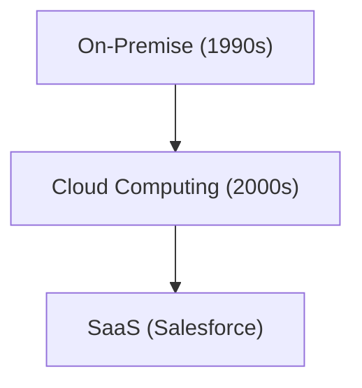

# Corporate History: History of Salesforce - Pioneer of SaaS (Cloud Software)

Salesforce is a pioneer of SaaS.

## Evolution of Cloud Computing

## Mathematical Model
The growth model of SaaS is as follows:
$$ R(t) = R_0 e^{kt} $$

