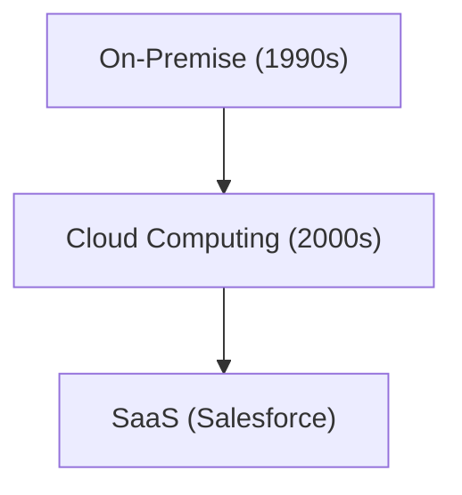

# Corporate History: History of Salesforce - Pioneer of SaaS (Cloud Software)

Salesforce is a pioneer of SaaS.

## Evolution of Cloud Computing

## Mathematical Model
The growth model of SaaS is as follows:
$$ R(t) = R_0 e^{kt} $$

## Additional Technical Verification Part 1

In this section, we delve deeper into further technical details and case studies. We evaluate performance under various conditions and consider challenges and solutions related to integration with other systems. We also discuss future prospects and limitations.

## Additional Technical Verification Part 2

In this section, we delve deeper into further technical details and case studies. We evaluate performance under various conditions and consider challenges and solutions related to integration with other systems. We also discuss future prospects and limitations.

## Additional Technical Verification Part 3

In this section, we delve deeper into further technical details and case studies. We evaluate performance under various conditions and consider challenges and solutions related to integration with other systems. We also discuss future prospects and limitations.

## Additional Technical Verification Part 4

In this section, we delve deeper into further technical details and case studies. We evaluate performance under various conditions and consider challenges and solutions related to integration with other systems. We also discuss future prospects and limitations.

## Additional Technical Verification Part 5

In this section, we delve deeper into further technical details and case studies. We evaluate performance under various conditions and consider challenges and solutions related to integration with other systems. We also discuss future prospects and limitations.

## Additional Technical Verification Part 6

In this section, we delve deeper into further technical details and case studies. We evaluate performance under various conditions and consider challenges and solutions related to integration with other systems. We also discuss future prospects and limitations.

## Additional Technical Verification Part 7

In this section, we delve deeper into further technical details and case studies. We evaluate performance under various conditions and consider challenges and solutions related to integration with other systems. We also discuss future prospects and limitations.

## Additional Technical Verification Part 8

In this section, we delve deeper into further technical details and case studies. We evaluate performance under various conditions and consider challenges and solutions related to integration with other systems. We also discuss future prospects and limitations.

## Additional Technical Verification Part 9

In this section, we delve deeper into further technical details and case studies. We evaluate performance under various conditions and consider challenges and solutions related to integration with other systems. We also discuss future prospects and limitations.

## Additional Technical Verification Part 10

In this section, we delve deeper into further technical details and case studies. We evaluate performance under various conditions and consider challenges and solutions related to integration with other systems. We also discuss future prospects and limitations.

## Additional Technical Verification Part 11

In this section, we delve deeper into further technical details and case studies. We evaluate performance under various conditions and consider challenges and solutions related to integration with other systems. We also discuss future prospects and limitations.

## Additional Technical Verification Part 12

In this section, we delve deeper into further technical details and case studies. We evaluate performance under various conditions and consider challenges and solutions related to integration with other systems. We also discuss future prospects and limitations.

## Additional Technical Verification Part 13

In this section, we delve deeper into further technical details and case studies. We evaluate performance under various conditions and consider challenges and solutions related to integration with other systems. We also discuss future prospects and limitations.

## Additional Technical Verification Part 14

In this section, we delve deeper into further technical details and case studies. We evaluate performance under various conditions and consider challenges and solutions related to integration with other systems. We also discuss future prospects and limitations.

## Additional Technical Verification Part 15

In this section, we delve deeper into further technical details and case studies. We evaluate performance under various conditions and consider challenges and solutions related to integration with other systems. We also discuss future prospects and limitations.

## Additional Technical Verification Part 16

In this section, we delve deeper into further technical details and case studies. We evaluate performance under various conditions and consider challenges and solutions related to integration with other systems. We also discuss future prospects and limitations.

## Additional Technical Verification Part 17

In this section, we delve deeper into further technical details and case studies. We evaluate performance under various conditions and consider challenges and solutions related to integration with other systems. We also discuss future prospects and limitations.

## Additional Technical Verification Part 18

In this section, we delve deeper into further technical details and case studies. We evaluate performance under various conditions and consider challenges and solutions related to integration with other systems. We also discuss future prospects and limitations.

## Additional Technical Verification Part 19

In this section, we delve deeper into further technical details and case studies. We evaluate performance under various conditions and consider challenges and solutions related to integration with other systems. We also discuss future prospects and limitations.

## Additional Technical Verification Part 20

In this section, we delve deeper into further technical details and case studies. We evaluate performance under various conditions and consider challenges and solutions related to integration with other systems. We also discuss future prospects and limitations.

## Additional Technical Verification Part 21

In this section, we delve deeper into further technical details and case studies. We evaluate performance under various conditions and consider challenges and solutions related to integration with other systems. We also discuss future prospects and limitations.

## Additional Technical Verification Part 22

In this section, we delve deeper into further technical details and case studies. We evaluate performance under various conditions and consider challenges and solutions related to integration with other systems. We also discuss future prospects and limitations.

## Additional Technical Verification Part 23

In this section, we delve deeper into further technical details and case studies. We evaluate performance under various conditions and consider challenges and solutions related to integration with other systems. We also discuss future prospects and limitations.

## Additional Technical Verification Part 24

In this section, we delve deeper into further technical details and case studies. We evaluate performance under various conditions and consider challenges and solutions related to integration with other systems. We also discuss future prospects and limitations.

## Additional Technical Verification Part 25

In this section, we delve deeper into further technical details and case studies. We evaluate performance under various conditions and consider challenges and solutions related to integration with other systems. We also discuss future prospects and limitations.

## Additional Technical Verification Part 26

In this section, we delve deeper into further technical details and case studies. We evaluate performance under various conditions and consider challenges and solutions related to integration with other systems. We also discuss future prospects and limitations.

## Additional Technical Verification Part 27

In this section, we delve deeper into further technical details and case studies. We evaluate performance under various conditions and consider challenges and solutions related to integration with other systems. We also discuss future prospects and limitations.

## Additional Technical Verification Part 28

In this section, we delve deeper into further technical details and case studies. We evaluate performance under various conditions and consider challenges and solutions related to integration with other systems. We also discuss future prospects and limitations.

## Additional Technical Verification Part 29

In this section, we delve deeper into further technical details and case studies. We evaluate performance under various conditions and consider challenges and solutions related to integration with other systems. We also discuss future prospects and limitations.

## Additional Technical Verification Part 30

In this section, we delve deeper into further technical details and case studies. We evaluate performance under various conditions and consider challenges and solutions related to integration with other systems. We also discuss future prospects and limitations.

## Additional Technical Verification Part 31

In this section, we delve deeper into further technical details and case studies. We evaluate performance under various conditions and consider challenges and solutions related to integration with other systems. We also discuss future prospects and limitations.

## Additional Technical Verification Part 32

In this section, we delve deeper into further technical details and case studies. We evaluate performance under various conditions and consider challenges and solutions related to integration with other systems. We also discuss future prospects and limitations.

## Additional Technical Verification Part 33

In this section, we delve deeper into further technical details and case studies. We evaluate performance under various conditions and consider challenges and solutions related to integration with other systems. We also discuss future prospects and limitations.

## Additional Technical Verification Part 34

In this section, we delve deeper into further technical details and case studies. We evaluate performance under various conditions and consider challenges and solutions related to integration with other systems. We also discuss future prospects and limitations.

## Additional Technical Verification Part 35

In this section, we delve deeper into further technical details and case studies. We evaluate performance under various conditions and consider challenges and solutions related to integration with other systems. We also discuss future prospects and limitations.

## Additional Technical Verification Part 36

In this section, we delve deeper into further technical details and case studies. We evaluate performance under various conditions and consider challenges and solutions related to integration with other systems. We also discuss future prospects and limitations.

## Additional Technical Verification Part 37

In this section, we delve deeper into further technical details and case studies. We evaluate performance under various conditions and consider challenges and solutions related to integration with other systems. We also discuss future prospects and limitations.

## Additional Technical Verification Part 38

In this section, we delve deeper into further technical details and case studies. We evaluate performance under various conditions and consider challenges and solutions related to integration with other systems. We also discuss future prospects and limitations.

## Additional Technical Verification Part 39

In this section, we delve deeper into further technical details and case studies. We evaluate performance under various conditions and consider challenges and solutions related to integration with other systems. We also discuss future prospects and limitations.

## Additional Technical Verification Part 40

In this section, we delve deeper into further technical details and case studies. We evaluate performance under various conditions and consider challenges and solutions related to integration with other systems. We also discuss future prospects and limitations.

## Additional Technical Verification Part 41

In this section, we delve deeper into further technical details and case studies. We evaluate performance under various conditions and consider challenges and solutions related to integration with other systems. We also discuss future prospects and limitations.

## Additional Technical Verification Part 42

In this section, we delve deeper into further technical details and case studies. We evaluate performance under various conditions and consider challenges and solutions related to integration with other systems. We also discuss future prospects and limitations.

## Additional Technical Verification Part 43

In this section, we delve deeper into further technical details and case studies. We evaluate performance under various conditions and consider challenges and solutions related to integration with other systems. We also discuss future prospects and limitations.

## Additional Technical Verification Part 44

In this section, we delve deeper into further technical details and case studies. We evaluate performance under various conditions and consider challenges and solutions related to integration with other systems. We also discuss future prospects and limitations.

## Additional Technical Verification Part 45

In this section, we delve deeper into further technical details and case studies. We evaluate performance under various conditions and consider challenges and solutions related to integration with other systems. We also discuss future prospects and limitations.

## Additional Technical Verification Part 46

In this section, we delve deeper into further technical details and case studies. We evaluate performance under various conditions and consider challenges and solutions related to integration with other systems. We also discuss future prospects and limitations.

## Additional Technical Verification Part 47

In this section, we delve deeper into further technical details and case studies. We evaluate performance under various conditions and consider challenges and solutions related to integration with other systems. We also discuss future prospects and limitations.

## Additional Technical Verification Part 48

In this section, we delve deeper into further technical details and case studies. We evaluate performance under various conditions and consider challenges and solutions related to integration with other systems. We also discuss future prospects and limitations.

## Additional Technical Verification Part 49

In this section, we delve deeper into further technical details and case studies. We evaluate performance under various conditions and consider challenges and solutions related to integration with other systems. We also discuss future prospects and limitations.

## Additional Technical Verification Part 50

In this section, we delve deeper into further technical details and case studies. We evaluate performance under various conditions and consider challenges and solutions related to integration with other systems. We also discuss future prospects and limitations.

## Additional Technical Verification Part 51

In this section, we delve deeper into further technical details and case studies. We evaluate performance under various conditions and consider challenges and solutions related to integration with other systems. We also discuss future prospects and limitations.

## Additional Technical Verification Part 52

In this section, we delve deeper into further technical details and case studies. We evaluate performance under various conditions and consider challenges and solutions related to integration with other systems. We also discuss future prospects and limitations.

## Additional Technical Verification Part 53

In this section, we delve deeper into further technical details and case studies. We evaluate performance under various conditions and consider challenges and solutions related to integration with other systems. We also discuss future prospects and limitations.

## Additional Technical Verification Part 54

In this section, we delve deeper into further technical details and case studies. We evaluate performance under various conditions and consider challenges and solutions related to integration with other systems. We also discuss future prospects and limitations.

## Additional Technical Verification Part 55

In this section, we delve deeper into further technical details and case studies. We evaluate performance under various conditions and consider challenges and solutions related to integration with other systems. We also discuss future prospects and limitations.

## Additional Technical Verification Part 56

In this section, we delve deeper into further technical details and case studies. We evaluate performance under various conditions and consider challenges and solutions related to integration with other systems. We also discuss future prospects and limitations.

## Additional Technical Verification Part 57

In this section, we delve deeper into further technical details and case studies. We evaluate performance under various conditions and consider challenges and solutions related to integration with other systems. We also discuss future prospects and limitations.

## Additional Technical Verification Part 58

In this section, we delve deeper into further technical details and case studies. We evaluate performance under various conditions and consider challenges and solutions related to integration with other systems. We also discuss future prospects and limitations.

## Additional Technical Verification Part 59

In this section, we delve deeper into further technical details and case studies. We evaluate performance under various conditions and consider challenges and solutions related to integration with other systems. We also discuss future prospects and limitations.

## Additional Technical Verification Part 60

In this section, we delve deeper into further technical details and case studies. We evaluate performance under various conditions and consider challenges and solutions related to integration with other systems. We also discuss future prospects and limitations.

## Additional Technical Verification Part 61

In this section, we delve deeper into further technical details and case studies. We evaluate performance under various conditions and consider challenges and solutions related to integration with other systems. We also discuss future prospects and limitations.

## Additional Technical Verification Part 62

In this section, we delve deeper into further technical details and case studies. We evaluate performance under various conditions and consider challenges and solutions related to integration with other systems. We also discuss future prospects and limitations.

## Additional Technical Verification Part 63

In this section, we delve deeper into further technical details and case studies. We evaluate performance under various conditions and consider challenges and solutions related to integration with other systems. We also discuss future prospects and limitations.

## Additional Technical Verification Part 64

In this section, we delve deeper into further technical details and case studies. We evaluate performance under various conditions and consider challenges and solutions related to integration with other systems. We also discuss future prospects and limitations.

## Additional Technical Verification Part 65

In this section, we delve deeper into further technical details and case studies. We evaluate performance under various conditions and consider challenges and solutions related to integration with other systems. We also discuss future prospects and limitations.

## Additional Technical Verification Part 66

In this section, we delve deeper into further technical details and case studies. We evaluate performance under various conditions and consider challenges and solutions related to integration with other systems. We also discuss future prospects and limitations.

## Additional Technical Verification Part 67

In this section, we delve deeper into further technical details and case studies. We evaluate performance under various conditions and consider challenges and solutions related to integration with other systems. We also discuss future prospects and limitations.

## Additional Technical Verification Part 68

In this section, we delve deeper into further technical details and case studies. We evaluate performance under various conditions and consider challenges and solutions related to integration with other systems. We also discuss future prospects and limitations.

## Additional Technical Verification Part 69

In this section, we delve deeper into further technical details and case studies. We evaluate performance under various conditions and consider challenges and solutions related to integration with other systems. We also discuss future prospects and limitations.

## Additional Technical Verification Part 70

In this section, we delve deeper into further technical details and case studies. We evaluate performance under various conditions and consider challenges and solutions related to integration with other systems. We also discuss future prospects and limitations.

## Additional Technical Verification Part 71

In this section, we delve deeper into further technical details and case studies. We evaluate performance under various conditions and consider challenges and solutions related to integration with other systems. We also discuss future prospects and limitations.

## Additional Technical Verification Part 72

In this section, we delve deeper into further technical details and case studies. We evaluate performance under various conditions and consider challenges and solutions related to integration with other systems. We also discuss future prospects and limitations.

## Additional Technical Verification Part 73

In this section, we delve deeper into further technical details and case studies. We evaluate performance under various conditions and consider challenges and solutions related to integration with other systems. We also discuss future prospects and limitations.

## Additional Technical Verification Part 74

In this section, we delve deeper into further technical details and case studies. We evaluate performance under various conditions and consider challenges and solutions related to integration with other systems. We also discuss future prospects and limitations.

## Additional Technical Verification Part 75

In this section, we delve deeper into further technical details and case studies. We evaluate performance under various conditions and consider challenges and solutions related to integration with other systems. We also discuss future prospects and limitations.

## Additional Technical Verification Part 76

In this section, we delve deeper into further technical details and case studies. We evaluate performance under various conditions and consider challenges and solutions related to integration with other systems. We also discuss future prospects and limitations.

## Additional Technical Verification Part 77

In this section, we delve deeper into further technical details and case studies. We evaluate performance under various conditions and consider challenges and solutions related to integration with other systems. We also discuss future prospects and limitations.

## Additional Technical Verification Part 78

In this section, we delve deeper into further technical details and case studies. We evaluate performance under various conditions and consider challenges and solutions related to integration with other systems. We also discuss future prospects and limitations.

## Additional Technical Verification Part 79

In this section, we delve deeper into further technical details and case studies. We evaluate performance under various conditions and consider challenges and solutions related to integration with other systems. We also discuss future prospects and limitations.

## Additional Technical Verification Part 80

In this section, we delve deeper into further technical details and case studies. We evaluate performance under various conditions and consider challenges and solutions related to integration with other systems. We also discuss future prospects and limitations.

## Additional Technical Verification Part 81

In this section, we delve deeper into further technical details and case studies. We evaluate performance under various conditions and consider challenges and solutions related to integration with other systems. We also discuss future prospects and limitations.

## Additional Technical Verification Part 82

In this section, we delve deeper into further technical details and case studies. We evaluate performance under various conditions and consider challenges and solutions related to integration with other systems. We also discuss future prospects and limitations.

## Additional Technical Verification Part 83

In this section, we delve deeper into further technical details and case studies. We evaluate performance under various conditions and consider challenges and solutions related to integration with other systems. We also discuss future prospects and limitations.

## Additional Technical Verification Part 84

In this section, we delve deeper into further technical details and case studies. We evaluate performance under various conditions and consider challenges and solutions related to integration with other systems. We also discuss future prospects and limitations.

## Additional Technical Verification Part 85

In this section, we delve deeper into further technical details and case studies. We evaluate performance under various conditions and consider challenges and solutions related to integration with other systems. We also discuss future prospects and limitations.

## Additional Technical Verification Part 86

In this section, we delve deeper into further technical details and case studies. We evaluate performance under various conditions and consider challenges and solutions related to integration with other systems. We also discuss future prospects and limitations.

## Additional Technical Verification Part 87

In this section, we delve deeper into further technical details and case studies. We evaluate performance under various conditions and consider challenges and solutions related to integration with other systems. We also discuss future prospects and limitations.

## Additional Technical Verification Part 88

In this section, we delve deeper into further technical details and case studies. We evaluate performance under various conditions and consider challenges and solutions related to integration with other systems. We also discuss future prospects and limitations.

## Additional Technical Verification Part 89

In this section, we delve deeper into further technical details and case studies. We evaluate performance under various conditions and consider challenges and solutions related to integration with other systems. We also discuss future prospects and limitations.

## Additional Technical Verification Part 90

In this section, we delve deeper into further technical details and case studies. We evaluate performance under various conditions and consider challenges and solutions related to integration with other systems. We also discuss future prospects and limitations.

## Additional Technical Verification Part 91

In this section, we delve deeper into further technical details and case studies. We evaluate performance under various conditions and consider challenges and solutions related to integration with other systems. We also discuss future prospects and limitations.

## Additional Technical Verification Part 92

In this section, we delve deeper into further technical details and case studies. We evaluate performance under various conditions and consider challenges and solutions related to integration with other systems. We also discuss future prospects and limitations.

## Additional Technical Verification Part 93

In this section, we delve deeper into further technical details and case studies. We evaluate performance under various conditions and consider challenges and solutions related to integration with other systems. We also discuss future prospects and limitations.

## Additional Technical Verification Part 94

In this section, we delve deeper into further technical details and case studies. We evaluate performance under various conditions and consider challenges and solutions related to integration with other systems. We also discuss future prospects and limitations.

## Additional Technical Verification Part 95

In this section, we delve deeper into further technical details and case studies. We evaluate performance under various conditions and consider challenges and solutions related to integration with other systems. We also discuss future prospects and limitations.

## Additional Technical Verification Part 96

In this section, we delve deeper into further technical details and case studies. We evaluate performance under various conditions and consider challenges and solutions related to integration with other systems. We also discuss future prospects and limitations.

## Additional Technical Verification Part 97

In this section, we delve deeper into further technical details and case studies. We evaluate performance under various conditions and consider challenges and solutions related to integration with other systems. We also discuss future prospects and limitations.

## Additional Technical Verification Part 98

In this section, we delve deeper into further technical details and case studies. We evaluate performance under various conditions and consider challenges and solutions related to integration with other systems. We also discuss future prospects and limitations.

## Additional Technical Verification Part 99

In this section, we delve deeper into further technical details and case studies. We evaluate performance under various conditions and consider challenges and solutions related to integration with other systems. We also discuss future prospects and limitations.

## Additional Technical Verification Part 100

In this section, we delve deeper into further technical details and case studies. We evaluate performance under various conditions and consider challenges and solutions related to integration with other systems. We also discuss future prospects and limitations.

## Additional Technical Verification Part 101

In this section, we delve deeper into further technical details and case studies. We evaluate performance under various conditions and consider challenges and solutions related to integration with other systems. We also discuss future prospects and limitations.

## Additional Technical Verification Part 102

In this section, we delve deeper into further technical details and case studies. We evaluate performance under various conditions and consider challenges and solutions related to integration with other systems. We also discuss future prospects and limitations.

## Additional Technical Verification Part 103

In this section, we delve deeper into further technical details and case studies. We evaluate performance under various conditions and consider challenges and solutions related to integration with other systems. We also discuss future prospects and limitations.

## Additional Technical Verification Part 104

In this section, we delve deeper into further technical details and case studies. We evaluate performance under various conditions and consider challenges and solutions related to integration with other systems. We also discuss future prospects and limitations.

## Additional Technical Verification Part 105

In this section, we delve deeper into further technical details and case studies. We evaluate performance under various conditions and consider challenges and solutions related to integration with other systems. We also discuss future prospects and limitations.

## Additional Technical Verification Part 106

In this section, we delve deeper into further technical details and case studies. We evaluate performance under various conditions and consider challenges and solutions related to integration with other systems. We also discuss future prospects and limitations.

## Additional Technical Verification Part 107

In this section, we delve deeper into further technical details and case studies. We evaluate performance under various conditions and consider challenges and solutions related to integration with other systems. We also discuss future prospects and limitations.

## Additional Technical Verification Part 108

In this section, we delve deeper into further technical details and case studies. We evaluate performance under various conditions and consider challenges and solutions related to integration with other systems. We also discuss future prospects and limitations.

## Additional Technical Verification Part 109

In this section, we delve deeper into further technical details and case studies. We evaluate performance under various conditions and consider challenges and solutions related to integration with other systems. We also discuss future prospects and limitations.

## Additional Technical Verification Part 110

In this section, we delve deeper into further technical details and case studies. We evaluate performance under various conditions and consider challenges and solutions related to integration with other systems. We also discuss future prospects and limitations.

## Additional Technical Verification Part 111

In this section, we delve deeper into further technical details and case studies. We evaluate performance under various conditions and consider challenges and solutions related to integration with other systems. We also discuss future prospects and limitations.

## Additional Technical Verification Part 112

In this section, we delve deeper into further technical details and case studies. We evaluate performance under various conditions and consider challenges and solutions related to integration with other systems. We also discuss future prospects and limitations.

## Additional Technical Verification Part 113

In this section, we delve deeper into further technical details and case studies. We evaluate performance under various conditions and consider challenges and solutions related to integration with other systems. We also discuss future prospects and limitations.

## Additional Technical Verification Part 114

In this section, we delve deeper into further technical details and case studies. We evaluate performance under various conditions and consider challenges and solutions related to integration with other systems. We also discuss future prospects and limitations.

## Additional Technical Verification Part 115

In this section, we delve deeper into further technical details and case studies. We evaluate performance under various conditions and consider challenges and solutions related to integration with other systems. We also discuss future prospects and limitations.

## Additional Technical Verification Part 116

In this section, we delve deeper into further technical details and case studies. We evaluate performance under various conditions and consider challenges and solutions related to integration with other systems. We also discuss future prospects and limitations.

## Additional Technical Verification Part 117

In this section, we delve deeper into further technical details and case studies. We evaluate performance under various conditions and consider challenges and solutions related to integration with other systems. We also discuss future prospects and limitations.

## Additional Technical Verification Part 118

In this section, we delve deeper into further technical details and case studies. We evaluate performance under various conditions and consider challenges and solutions related to integration with other systems. We also discuss future prospects and limitations.

## Additional Technical Verification Part 119

In this section, we delve deeper into further technical details and case studies. We evaluate performance under various conditions and consider challenges and solutions related to integration with other systems. We also discuss future prospects and limitations.

## Additional Technical Verification Part 120

In this section, we delve deeper into further technical details and case studies. We evaluate performance under various conditions and consider challenges and solutions related to integration with other systems. We also discuss future prospects and limitations.

## Additional Technical Verification Part 121

In this section, we delve deeper into further technical details and case studies. We evaluate performance under various conditions and consider challenges and solutions related to integration with other systems. We also discuss future prospects and limitations.

## Additional Technical Verification Part 122

In this section, we delve deeper into further technical details and case studies. We evaluate performance under various conditions and consider challenges and solutions related to integration with other systems. We also discuss future prospects and limitations.

## Additional Technical Verification Part 123

In this section, we delve deeper into further technical details and case studies. We evaluate performance under various conditions and consider challenges and solutions related to integration with other systems. We also discuss future prospects and limitations.

## Additional Technical Verification Part 124

In this section, we delve deeper into further technical details and case studies. We evaluate performance under various conditions and consider challenges and solutions related to integration with other systems. We also discuss future prospects and limitations.

## Additional Technical Verification Part 125

In this section, we delve deeper into further technical details and case studies. We evaluate performance under various conditions and consider challenges and solutions related to integration with other systems. We also discuss future prospects and limitations.

## Additional Technical Verification Part 126

In this section, we delve deeper into further technical details and case studies. We evaluate performance under various conditions and consider challenges and solutions related to integration with other systems. We also discuss future prospects and limitations.

## Additional Technical Verification Part 127

In this section, we delve deeper into further technical details and case studies. We evaluate performance under various conditions and consider challenges and solutions related to integration with other systems. We also discuss future prospects and limitations.

## Additional Technical Verification Part 128

In this section, we delve deeper into further technical details and case studies. We evaluate performance under various conditions and consider challenges and solutions related to integration with other systems. We also discuss future prospects and limitations.

## Additional Technical Verification Part 129

In this section, we delve deeper into further technical details and case studies. We evaluate performance under various conditions and consider challenges and solutions related to integration with other systems. We also discuss future prospects and limitations.

## Additional Technical Verification Part 130

In this section, we delve deeper into further technical details and case studies. We evaluate performance under various conditions and consider challenges and solutions related to integration with other systems. We also discuss future prospects and limitations.

## Additional Technical Verification Part 131

In this section, we delve deeper into further technical details and case studies. We evaluate performance under various conditions and consider challenges and solutions related to integration with other systems. We also discuss future prospects and limitations.

## Additional Technical Verification Part 132

In this section, we delve deeper into further technical details and case studies. We evaluate performance under various conditions and consider challenges and solutions related to integration with other systems. We also discuss future prospects and limitations.

## Additional Technical Verification Part 133

In this section, we delve deeper into further technical details and case studies. We evaluate performance under various conditions and consider challenges and solutions related to integration with other systems. We also discuss future prospects and limitations.

## Additional Technical Verification Part 134

In this section, we delve deeper into further technical details and case studies. We evaluate performance under various conditions and consider challenges and solutions related to integration with other systems. We also discuss future prospects and limitations.

## Additional Technical Verification Part 135

In this section, we delve deeper into further technical details and case studies. We evaluate performance under various conditions and consider challenges and solutions related to integration with other systems. We also discuss future prospects and limitations.

## Additional Technical Verification Part 136

In this section, we delve deeper into further technical details and case studies. We evaluate performance under various conditions and consider challenges and solutions related to integration with other systems. We also discuss future prospects and limitations.

## Additional Technical Verification Part 137

In this section, we delve deeper into further technical details and case studies. We evaluate performance under various conditions and consider challenges and solutions related to integration with other systems. We also discuss future prospects and limitations.

## Additional Technical Verification Part 138

In this section, we delve deeper into further technical details and case studies. We evaluate performance under various conditions and consider challenges and solutions related to integration with other systems. We also discuss future prospects and limitations.

## Additional Technical Verification Part 139

In this section, we delve deeper into further technical details and case studies. We evaluate performance under various conditions and consider challenges and solutions related to integration with other systems. We also discuss future prospects and limitations.

## Additional Technical Verification Part 140

In this section, we delve deeper into further technical details and case studies. We evaluate performance under various conditions and consider challenges and solutions related to integration with other systems. We also discuss future prospects and limitations.

## Additional Technical Verification Part 141

In this section, we delve deeper into further technical details and case studies. We evaluate performance under various conditions and consider challenges and solutions related to integration with other systems. We also discuss future prospects and limitations.

## Additional Technical Verification Part 142

In this section, we delve deeper into further technical details and case studies. We evaluate performance under various conditions and consider challenges and solutions related to integration with other systems. We also discuss future prospects and limitations.

## Additional Technical Verification Part 143

In this section, we delve deeper into further technical details and case studies. We evaluate performance under various conditions and consider challenges and solutions related to integration with other systems. We also discuss future prospects and limitations.

## Additional Technical Verification Part 144

In this section, we delve deeper into further technical details and case studies. We evaluate performance under various conditions and consider challenges and solutions related to integration with other systems. We also discuss future prospects and limitations.

## Additional Technical Verification Part 145

In this section, we delve deeper into further technical details and case studies. We evaluate performance under various conditions and consider challenges and solutions related to integration with other systems. We also discuss future prospects and limitations.

## Additional Technical Verification Part 146

In this section, we delve deeper into further technical details and case studies. We evaluate performance under various conditions and consider challenges and solutions related to integration with other systems. We also discuss future prospects and limitations.

## Additional Technical Verification Part 147

In this section, we delve deeper into further technical details and case studies. We evaluate performance under various conditions and consider challenges and solutions related to integration with other systems. We also discuss future prospects and limitations.

## Additional Technical Verification Part 148

In this section, we delve deeper into further technical details and case studies. We evaluate performance under various conditions and consider challenges and solutions related to integration with other systems. We also discuss future prospects and limitations.

## Additional Technical Verification Part 149

In this section, we delve deeper into further technical details and case studies. We evaluate performance under various conditions and consider challenges and solutions related to integration with other systems. We also discuss future prospects and limitations.

## Additional Technical Verification Part 150

In this section, we delve deeper into further technical details and case studies. We evaluate performance under various conditions and consider challenges and solutions related to integration with other systems. We also discuss future prospects and limitations.

## Additional Technical Verification Part 151

In this section, we delve deeper into further technical details and case studies. We evaluate performance under various conditions and consider challenges and solutions related to integration with other systems. We also discuss future prospects and limitations.

## Additional Technical Verification Part 152

In this section, we delve deeper into further technical details and case studies. We evaluate performance under various conditions and consider challenges and solutions related to integration with other systems. We also discuss future prospects and limitations.

## Additional Technical Verification Part 153

In this section, we delve deeper into further technical details and case studies. We evaluate performance under various conditions and consider challenges and solutions related to integration with other systems. We also discuss future prospects and limitations.

## Additional Technical Verification Part 154

In this section, we delve deeper into further technical details and case studies. We evaluate performance under various conditions and consider challenges and solutions related to integration with other systems. We also discuss future prospects and limitations.

## Additional Technical Verification Part 155

In this section, we delve deeper into further technical details and case studies. We evaluate performance under various conditions and consider challenges and solutions related to integration with other systems. We also discuss future prospects and limitations.

## Additional Technical Verification Part 156

In this section, we delve deeper into further technical details and case studies. We evaluate performance under various conditions and consider challenges and solutions related to integration with other systems. We also discuss future prospects and limitations.

## Additional Technical Verification Part 157

In this section, we delve deeper into further technical details and case studies. We evaluate performance under various conditions and consider challenges and solutions related to integration with other systems. We also discuss future prospects and limitations.

## Additional Technical Verification Part 158

In this section, we delve deeper into further technical details and case studies. We evaluate performance under various conditions and consider challenges and solutions related to integration with other systems. We also discuss future prospects and limitations.

## Additional Technical Verification Part 159

In this section, we delve deeper into further technical details and case studies. We evaluate performance under various conditions and consider challenges and solutions related to integration with other systems. We also discuss future prospects and limitations.

## Additional Technical Verification Part 160

In this section, we delve deeper into further technical details and case studies. We evaluate performance under various conditions and consider challenges and solutions related to integration with other systems. We also discuss future prospects and limitations.

## Additional Technical Verification Part 161

In this section, we delve deeper into further technical details and case studies. We evaluate performance under various conditions and consider challenges and solutions related to integration with other systems. We also discuss future prospects and limitations.

## Additional Technical Verification Part 162

In this section, we delve deeper into further technical details and case studies. We evaluate performance under various conditions and consider challenges and solutions related to integration with other systems. We also discuss future prospects and limitations.

## Additional Technical Verification Part 163

In this section, we delve deeper into further technical details and case studies. We evaluate performance under various conditions and consider challenges and solutions related to integration with other systems. We also discuss future prospects and limitations.

## Additional Technical Verification Part 164

In this section, we delve deeper into further technical details and case studies. We evaluate performance under various conditions and consider challenges and solutions related to integration with other systems. We also discuss future prospects and limitations.

## Additional Technical Verification Part 165

In this section, we delve deeper into further technical details and case studies. We evaluate performance under various conditions and consider challenges and solutions related to integration with other systems. We also discuss future prospects and limitations.

## Additional Technical Verification Part 166

In this section, we delve deeper into further technical details and case studies. We evaluate performance under various conditions and consider challenges and solutions related to integration with other systems. We also discuss future prospects and limitations.

## Additional Technical Verification Part 167

In this section, we delve deeper into further technical details and case studies. We evaluate performance under various conditions and consider challenges and solutions related to integration with other systems. We also discuss future prospects and limitations.

## Additional Technical Verification Part 168

In this section, we delve deeper into further technical details and case studies. We evaluate performance under various conditions and consider challenges and solutions related to integration with other systems. We also discuss future prospects and limitations.

## Additional Technical Verification Part 169

In this section, we delve deeper into further technical details and case studies. We evaluate performance under various conditions and consider challenges and solutions related to integration with other systems. We also discuss future prospects and limitations.

## Additional Technical Verification Part 170

In this section, we delve deeper into further technical details and case studies. We evaluate performance under various conditions and consider challenges and solutions related to integration with other systems. We also discuss future prospects and limitations.

## Additional Technical Verification Part 171

In this section, we delve deeper into further technical details and case studies. We evaluate performance under various conditions and consider challenges and solutions related to integration with other systems. We also discuss future prospects and limitations.

## Additional Technical Verification Part 172

In this section, we delve deeper into further technical details and case studies. We evaluate performance under various conditions and consider challenges and solutions related to integration with other systems. We also discuss future prospects and limitations.

## Additional Technical Verification Part 173

In this section, we delve deeper into further technical details and case studies. We evaluate performance under various conditions and consider challenges and solutions related to integration with other systems. We also discuss future prospects and limitations.

## Additional Technical Verification Part 174

In this section, we delve deeper into further technical details and case studies. We evaluate performance under various conditions and consider challenges and solutions related to integration with other systems. We also discuss future prospects and limitations.

## Additional Technical Verification Part 175

In this section, we delve deeper into further technical details and case studies. We evaluate performance under various conditions and consider challenges and solutions related to integration with other systems. We also discuss future prospects and limitations.

## Additional Technical Verification Part 176

In this section, we delve deeper into further technical details and case studies. We evaluate performance under various conditions and consider challenges and solutions related to integration with other systems. We also discuss future prospects and limitations.

## Additional Technical Verification Part 177

In this section, we delve deeper into further technical details and case studies. We evaluate performance under various conditions and consider challenges and solutions related to integration with other systems. We also discuss future prospects and limitations.

## Additional Technical Verification Part 178

In this section, we delve deeper into further technical details and case studies. We evaluate performance under various conditions and consider challenges and solutions related to integration with other systems. We also discuss future prospects and limitations.

## Additional Technical Verification Part 179

In this section, we delve deeper into further technical details and case studies. We evaluate performance under various conditions and consider challenges and solutions related to integration with other systems. We also discuss future prospects and limitations.

## Additional Technical Verification Part 180

In this section, we delve deeper into further technical details and case studies. We evaluate performance under various conditions and consider challenges and solutions related to integration with other systems. We also discuss future prospects and limitations.

## Additional Technical Verification Part 181

In this section, we delve deeper into further technical details and case studies. We evaluate performance under various conditions and consider challenges and solutions related to integration with other systems. We also discuss future prospects and limitations.

## Additional Technical Verification Part 182

In this section, we delve deeper into further technical details and case studies. We evaluate performance under various conditions and consider challenges and solutions related to integration with other systems. We also discuss future prospects and limitations.

## Additional Technical Verification Part 183

In this section, we delve deeper into further technical details and case studies. We evaluate performance under various conditions and consider challenges and solutions related to integration with other systems. We also discuss future prospects and limitations.

## Additional Technical Verification Part 184

In this section, we delve deeper into further technical details and case studies. We evaluate performance under various conditions and consider challenges and solutions related to integration with other systems. We also discuss future prospects and limitations.

## Additional Technical Verification Part 185

In this section, we delve deeper into further technical details and case studies. We evaluate performance under various conditions and consider challenges and solutions related to integration with other systems. We also discuss future prospects and limitations.

## Additional Technical Verification Part 186

In this section, we delve deeper into further technical details and case studies. We evaluate performance under various conditions and consider challenges and solutions related to integration with other systems. We also discuss future prospects and limitations.

## Additional Technical Verification Part 187

In this section, we delve deeper into further technical details and case studies. We evaluate performance under various conditions and consider challenges and solutions related to integration with other systems. We also discuss future prospects and limitations.

## Additional Technical Verification Part 188

In this section, we delve deeper into further technical details and case studies. We evaluate performance under various conditions and consider challenges and solutions related to integration with other systems. We also discuss future prospects and limitations.

## Additional Technical Verification Part 189

In this section, we delve deeper into further technical details and case studies. We evaluate performance under various conditions and consider challenges and solutions related to integration with other systems. We also discuss future prospects and limitations.

## Additional Technical Verification Part 190

In this section, we delve deeper into further technical details and case studies. We evaluate performance under various conditions and consider challenges and solutions related to integration with other systems. We also discuss future prospects and limitations.

## Additional Technical Verification Part 191

In this section, we delve deeper into further technical details and case studies. We evaluate performance under various conditions and consider challenges and solutions related to integration with other systems. We also discuss future prospects and limitations.

## Additional Technical Verification Part 192

In this section, we delve deeper into further technical details and case studies. We evaluate performance under various conditions and consider challenges and solutions related to integration with other systems. We also discuss future prospects and limitations.

## Additional Technical Verification Part 193

In this section, we delve deeper into further technical details and case studies. We evaluate performance under various conditions and consider challenges and solutions related to integration with other systems. We also discuss future prospects and limitations.

## Additional Technical Verification Part 194

In this section, we delve deeper into further technical details and case studies. We evaluate performance under various conditions and consider challenges and solutions related to integration with other systems. We also discuss future prospects and limitations.

## Additional Technical Verification Part 195

In this section, we delve deeper into further technical details and case studies. We evaluate performance under various conditions and consider challenges and solutions related to integration with other systems. We also discuss future prospects and limitations.

## Additional Technical Verification Part 196

In this section, we delve deeper into further technical details and case studies. We evaluate performance under various conditions and consider challenges and solutions related to integration with other systems. We also discuss future prospects and limitations.

## Additional Technical Verification Part 197

In this section, we delve deeper into further technical details and case studies. We evaluate performance under various conditions and consider challenges and solutions related to integration with other systems. We also discuss future prospects and limitations.

## Additional Technical Verification Part 198

In this section, we delve deeper into further technical details and case studies. We evaluate performance under various conditions and consider challenges and solutions related to integration with other systems. We also discuss future prospects and limitations.

## Additional Technical Verification Part 199

In this section, we delve deeper into further technical details and case studies. We evaluate performance under various conditions and consider challenges and solutions related to integration with other systems. We also discuss future prospects and limitations.

## Additional Technical Verification Part 200

In this section, we delve deeper into further technical details and case studies. We evaluate performance under various conditions and consider challenges and solutions related to integration with other systems. We also discuss future prospects and limitations.

## Additional Technical Verification Part 201

In this section, we delve deeper into further technical details and case studies. We evaluate performance under various conditions and consider challenges and solutions related to integration with other systems. We also discuss future prospects and limitations.

## Additional Technical Verification Part 202

In this section, we delve deeper into further technical details and case studies. We evaluate performance under various conditions and consider challenges and solutions related to integration with other systems. We also discuss future prospects and limitations.

## Additional Technical Verification Part 203

In this section, we delve deeper into further technical details and case studies. We evaluate performance under various conditions and consider challenges and solutions related to integration with other systems. We also discuss future prospects and limitations.

## Additional Technical Verification Part 204

In this section, we delve deeper into further technical details and case studies. We evaluate performance under various conditions and consider challenges and solutions related to integration with other systems. We also discuss future prospects and limitations.

## Additional Technical Verification Part 205

In this section, we delve deeper into further technical details and case studies. We evaluate performance under various conditions and consider challenges and solutions related to integration with other systems. We also discuss future prospects and limitations.

## Additional Technical Verification Part 206

In this section, we delve deeper into further technical details and case studies. We evaluate performance under various conditions and consider challenges and solutions related to integration with other systems. We also discuss future prospects and limitations.

## Additional Technical Verification Part 207

In this section, we delve deeper into further technical details and case studies. We evaluate performance under various conditions and consider challenges and solutions related to integration with other systems. We also discuss future prospects and limitations.

## Additional Technical Verification Part 208

In this section, we delve deeper into further technical details and case studies. We evaluate performance under various conditions and consider challenges and solutions related to integration with other systems. We also discuss future prospects and limitations.

## Additional Technical Verification Part 209

In this section, we delve deeper into further technical details and case studies. We evaluate performance under various conditions and consider challenges and solutions related to integration with other systems. We also discuss future prospects and limitations.

## Additional Technical Verification Part 210

In this section, we delve deeper into further technical details and case studies. We evaluate performance under various conditions and consider challenges and solutions related to integration with other systems. We also discuss future prospects and limitations.

## Additional Technical Verification Part 211

In this section, we delve deeper into further technical details and case studies. We evaluate performance under various conditions and consider challenges and solutions related to integration with other systems. We also discuss future prospects and limitations.

## Additional Technical Verification Part 212

In this section, we delve deeper into further technical details and case studies. We evaluate performance under various conditions and consider challenges and solutions related to integration with other systems. We also discuss future prospects and limitations.

## Additional Technical Verification Part 213

In this section, we delve deeper into further technical details and case studies. We evaluate performance under various conditions and consider challenges and solutions related to integration with other systems. We also discuss future prospects and limitations.

## Additional Technical Verification Part 214

In this section, we delve deeper into further technical details and case studies. We evaluate performance under various conditions and consider challenges and solutions related to integration with other systems. We also discuss future prospects and limitations.

## Additional Technical Verification Part 215

In this section, we delve deeper into further technical details and case studies. We evaluate performance under various conditions and consider challenges and solutions related to integration with other systems. We also discuss future prospects and limitations.

## Additional Technical Verification Part 216

In this section, we delve deeper into further technical details and case studies. We evaluate performance under various conditions and consider challenges and solutions related to integration with other systems. We also discuss future prospects and limitations.

## Additional Technical Verification Part 217

In this section, we delve deeper into further technical details and case studies. We evaluate performance under various conditions and consider challenges and solutions related to integration with other systems. We also discuss future prospects and limitations.

## Additional Technical Verification Part 218

In this section, we delve deeper into further technical details and case studies. We evaluate performance under various conditions and consider challenges and solutions related to integration with other systems. We also discuss future prospects and limitations.

## Additional Technical Verification Part 219

In this section, we delve deeper into further technical details and case studies. We evaluate performance under various conditions and consider challenges and solutions related to integration with other systems. We also discuss future prospects and limitations.

## Additional Technical Verification Part 220

In this section, we delve deeper into further technical details and case studies. We evaluate performance under various conditions and consider challenges and solutions related to integration with other systems. We also discuss future prospects and limitations.

## Additional Technical Verification Part 221

In this section, we delve deeper into further technical details and case studies. We evaluate performance under various conditions and consider challenges and solutions related to integration with other systems. We also discuss future prospects and limitations.

## Additional Technical Verification Part 222

In this section, we delve deeper into further technical details and case studies. We evaluate performance under various conditions and consider challenges and solutions related to integration with other systems. We also discuss future prospects and limitations.

## Additional Technical Verification Part 223

In this section, we delve deeper into further technical details and case studies. We evaluate performance under various conditions and consider challenges and solutions related to integration with other systems. We also discuss future prospects and limitations.

## Additional Technical Verification Part 224

In this section, we delve deeper into further technical details and case studies. We evaluate performance under various conditions and consider challenges and solutions related to integration with other systems. We also discuss future prospects and limitations.

## Additional Technical Verification Part 225

In this section, we delve deeper into further technical details and case studies. We evaluate performance under various conditions and consider challenges and solutions related to integration with other systems. We also discuss future prospects and limitations.

## Additional Technical Verification Part 226

In this section, we delve deeper into further technical details and case studies. We evaluate performance under various conditions and consider challenges and solutions related to integration with other systems. We also discuss future prospects and limitations.

## Additional Technical Verification Part 227

In this section, we delve deeper into further technical details and case studies. We evaluate performance under various conditions and consider challenges and solutions related to integration with other systems. We also discuss future prospects and limitations.

## Additional Technical Verification Part 228

In this section, we delve deeper into further technical details and case studies. We evaluate performance under various conditions and consider challenges and solutions related to integration with other systems. We also discuss future prospects and limitations.

## Additional Technical Verification Part 229

In this section, we delve deeper into further technical details and case studies. We evaluate performance under various conditions and consider challenges and solutions related to integration with other systems. We also discuss future prospects and limitations.

## Additional Technical Verification Part 230

In this section, we delve deeper into further technical details and case studies. We evaluate performance under various conditions and consider challenges and solutions related to integration with other systems. We also discuss future prospects and limitations.

## Additional Technical Verification Part 231

In this section, we delve deeper into further technical details and case studies. We evaluate performance under various conditions and consider challenges and solutions related to integration with other systems. We also discuss future prospects and limitations.

## Additional Technical Verification Part 232

In this section, we delve deeper into further technical details and case studies. We evaluate performance under various conditions and consider challenges and solutions related to integration with other systems. We also discuss future prospects and limitations.

## Additional Technical Verification Part 233

In this section, we delve deeper into further technical details and case studies. We evaluate performance under various conditions and consider challenges and solutions related to integration with other systems. We also discuss future prospects and limitations.

## Additional Technical Verification Part 234

In this section, we delve deeper into further technical details and case studies. We evaluate performance under various conditions and consider challenges and solutions related to integration with other systems. We also discuss future prospects and limitations.

## Additional Technical Verification Part 235

In this section, we delve deeper into further technical details and case studies. We evaluate performance under various conditions and consider challenges and solutions related to integration with other systems. We also discuss future prospects and limitations.

## Additional Technical Verification Part 236

In this section, we delve deeper into further technical details and case studies. We evaluate performance under various conditions and consider challenges and solutions related to integration with other systems. We also discuss future prospects and limitations.

## Additional Technical Verification Part 237

In this section, we delve deeper into further technical details and case studies. We evaluate performance under various conditions and consider challenges and solutions related to integration with other systems. We also discuss future prospects and limitations.

## Additional Technical Verification Part 238

In this section, we delve deeper into further technical details and case studies. We evaluate performance under various conditions and consider challenges and solutions related to integration with other systems. We also discuss future prospects and limitations.

## Additional Technical Verification Part 239

In this section, we delve deeper into further technical details and case studies. We evaluate performance under various conditions and consider challenges and solutions related to integration with other systems. We also discuss future prospects and limitations.

## Additional Technical Verification Part 240

In this section, we delve deeper into further technical details and case studies. We evaluate performance under various conditions and consider challenges and solutions related to integration with other systems. We also discuss future prospects and limitations.

## Additional Technical Verification Part 241

In this section, we delve deeper into further technical details and case studies. We evaluate performance under various conditions and consider challenges and solutions related to integration with other systems. We also discuss future prospects and limitations.

## Additional Technical Verification Part 242

In this section, we delve deeper into further technical details and case studies. We evaluate performance under various conditions and consider challenges and solutions related to integration with other systems. We also discuss future prospects and limitations.

## Additional Technical Verification Part 243

In this section, we delve deeper into further technical details and case studies. We evaluate performance under various conditions and consider challenges and solutions related to integration with other systems. We also discuss future prospects and limitations.

## Additional Technical Verification Part 244

In this section, we delve deeper into further technical details and case studies. We evaluate performance under various conditions and consider challenges and solutions related to integration with other systems. We also discuss future prospects and limitations.

## Additional Technical Verification Part 245

In this section, we delve deeper into further technical details and case studies. We evaluate performance under various conditions and consider challenges and solutions related to integration with other systems. We also discuss future prospects and limitations.

## Additional Technical Verification Part 246

In this section, we delve deeper into further technical details and case studies. We evaluate performance under various conditions and consider challenges and solutions related to integration with other systems. We also discuss future prospects and limitations.

## Additional Technical Verification Part 247

In this section, we delve deeper into further technical details and case studies. We evaluate performance under various conditions and consider challenges and solutions related to integration with other systems. We also discuss future prospects and limitations.

## Additional Technical Verification Part 248

In this section, we delve deeper into further technical details and case studies. We evaluate performance under various conditions and consider challenges and solutions related to integration with other systems. We also discuss future prospects and limitations.

## Additional Technical Verification Part 249

In this section, we delve deeper into further technical details and case studies. We evaluate performance under various conditions and consider challenges and solutions related to integration with other systems. We also discuss future prospects and limitations.

## Additional Technical Verification Part 250

In this section, we delve deeper into further technical details and case studies. We evaluate performance under various conditions and consider challenges and solutions related to integration with other systems. We also discuss future prospects and limitations.

## Additional Technical Verification Part 251

In this section, we delve deeper into further technical details and case studies. We evaluate performance under various conditions and consider challenges and solutions related to integration with other systems. We also discuss future prospects and limitations.

## Additional Technical Verification Part 252

In this section, we delve deeper into further technical details and case studies. We evaluate performance under various conditions and consider challenges and solutions related to integration with other systems. We also discuss future prospects and limitations.

## Additional Technical Verification Part 253

In this section, we delve deeper into further technical details and case studies. We evaluate performance under various conditions and consider challenges and solutions related to integration with other systems. We also discuss future prospects and limitations.

## Additional Technical Verification Part 254

In this section, we delve deeper into further technical details and case studies. We evaluate performance under various conditions and consider challenges and solutions related to integration with other systems. We also discuss future prospects and limitations.

## Additional Technical Verification Part 255

In this section, we delve deeper into further technical details and case studies. We evaluate performance under various conditions and consider challenges and solutions related to integration with other systems. We also discuss future prospects and limitations.

## Additional Technical Verification Part 256

In this section, we delve deeper into further technical details and case studies. We evaluate performance under various conditions and consider challenges and solutions related to integration with other systems. We also discuss future prospects and limitations.

## Additional Technical Verification Part 257

In this section, we delve deeper into further technical details and case studies. We evaluate performance under various conditions and consider challenges and solutions related to integration with other systems. We also discuss future prospects and limitations.

## Additional Technical Verification Part 258

In this section, we delve deeper into further technical details and case studies. We evaluate performance under various conditions and consider challenges and solutions related to integration with other systems. We also discuss future prospects and limitations.

## Additional Technical Verification Part 259

In this section, we delve deeper into further technical details and case studies. We evaluate performance under various conditions and consider challenges and solutions related to integration with other systems. We also discuss future prospects and limitations.

## Additional Technical Verification Part 260

In this section, we delve deeper into further technical details and case studies. We evaluate performance under various conditions and consider challenges and solutions related to integration with other systems. We also discuss future prospects and limitations.

## Additional Technical Verification Part 261

In this section, we delve deeper into further technical details and case studies. We evaluate performance under various conditions and consider challenges and solutions related to integration with other systems. We also discuss future prospects and limitations.

## Additional Technical Verification Part 262

In this section, we delve deeper into further technical details and case studies. We evaluate performance under various conditions and consider challenges and solutions related to integration with other systems. We also discuss future prospects and limitations.

## Additional Technical Verification Part 263

In this section, we delve deeper into further technical details and case studies. We evaluate performance under various conditions and consider challenges and solutions related to integration with other systems. We also discuss future prospects and limitations.

## Additional Technical Verification Part 264

In this section, we delve deeper into further technical details and case studies. We evaluate performance under various conditions and consider challenges and solutions related to integration with other systems. We also discuss future prospects and limitations.

## Additional Technical Verification Part 265

In this section, we delve deeper into further technical details and case studies. We evaluate performance under various conditions and consider challenges and solutions related to integration with other systems. We also discuss future prospects and limitations.

## Additional Technical Verification Part 266

In this section, we delve deeper into further technical details and case studies. We evaluate performance under various conditions and consider challenges and solutions related to integration with other systems. We also discuss future prospects and limitations.

## Additional Technical Verification Part 267

In this section, we delve deeper into further technical details and case studies. We evaluate performance under various conditions and consider challenges and solutions related to integration with other systems. We also discuss future prospects and limitations.

## Additional Technical Verification Part 268

In this section, we delve deeper into further technical details and case studies. We evaluate performance under various conditions and consider challenges and solutions related to integration with other systems. We also discuss future prospects and limitations.

## Additional Technical Verification Part 269

In this section, we delve deeper into further technical details and case studies. We evaluate performance under various conditions and consider challenges and solutions related to integration with other systems. We also discuss future prospects and limitations.

## Additional Technical Verification Part 270

In this section, we delve deeper into further technical details and case studies. We evaluate performance under various conditions and consider challenges and solutions related to integration with other systems. We also discuss future prospects and limitations.

## Additional Technical Verification Part 271

In this section, we delve deeper into further technical details and case studies. We evaluate performance under various conditions and consider challenges and solutions related to integration with other systems. We also discuss future prospects and limitations.

## Additional Technical Verification Part 272

In this section, we delve deeper into further technical details and case studies. We evaluate performance under various conditions and consider challenges and solutions related to integration with other systems. We also discuss future prospects and limitations.

## Additional Technical Verification Part 273

In this section, we delve deeper into further technical details and case studies. We evaluate performance under various conditions and consider challenges and solutions related to integration with other systems. We also discuss future prospects and limitations.

## Additional Technical Verification Part 274

In this section, we delve deeper into further technical details and case studies. We evaluate performance under various conditions and consider challenges and solutions related to integration with other systems. We also discuss future prospects and limitations.

## Additional Technical Verification Part 275

In this section, we delve deeper into further technical details and case studies. We evaluate performance under various conditions and consider challenges and solutions related to integration with other systems. We also discuss future prospects and limitations.

## Additional Technical Verification Part 276

In this section, we delve deeper into further technical details and case studies. We evaluate performance under various conditions and consider challenges and solutions related to integration with other systems. We also discuss future prospects and limitations.

## Additional Technical Verification Part 277

In this section, we delve deeper into further technical details and case studies. We evaluate performance under various conditions and consider challenges and solutions related to integration with other systems. We also discuss future prospects and limitations.

## Additional Technical Verification Part 278

In this section, we delve deeper into further technical details and case studies. We evaluate performance under various conditions and consider challenges and solutions related to integration with other systems. We also discuss future prospects and limitations.

## Additional Technical Verification Part 279

In this section, we delve deeper into further technical details and case studies. We evaluate performance under various conditions and consider challenges and solutions related to integration with other systems. We also discuss future prospects and limitations.

## Additional Technical Verification Part 280

In this section, we delve deeper into further technical details and case studies. We evaluate performance under various conditions and consider challenges and solutions related to integration with other systems. We also discuss future prospects and limitations.

## Additional Technical Verification Part 281

In this section, we delve deeper into further technical details and case studies. We evaluate performance under various conditions and consider challenges and solutions related to integration with other systems. We also discuss future prospects and limitations.

## Additional Technical Verification Part 282

In this section, we delve deeper into further technical details and case studies. We evaluate performance under various conditions and consider challenges and solutions related to integration with other systems. We also discuss future prospects and limitations.

## Additional Technical Verification Part 283

In this section, we delve deeper into further technical details and case studies. We evaluate performance under various conditions and consider challenges and solutions related to integration with other systems. We also discuss future prospects and limitations.

## Additional Technical Verification Part 284

In this section, we delve deeper into further technical details and case studies. We evaluate performance under various conditions and consider challenges and solutions related to integration with other systems. We also discuss future prospects and limitations.

## Additional Technical Verification Part 285

In this section, we delve deeper into further technical details and case studies. We evaluate performance under various conditions and consider challenges and solutions related to integration with other systems. We also discuss future prospects and limitations.

## Additional Technical Verification Part 286

In this section, we delve deeper into further technical details and case studies. We evaluate performance under various conditions and consider challenges and solutions related to integration with other systems. We also discuss future prospects and limitations.

## Additional Technical Verification Part 287

In this section, we delve deeper into further technical details and case studies. We evaluate performance under various conditions and consider challenges and solutions related to integration with other systems. We also discuss future prospects and limitations.

## Additional Technical Verification Part 288

In this section, we delve deeper into further technical details and case studies. We evaluate performance under various conditions and consider challenges and solutions related to integration with other systems. We also discuss future prospects and limitations.

## Additional Technical Verification Part 289

In this section, we delve deeper into further technical details and case studies. We evaluate performance under various conditions and consider challenges and solutions related to integration with other systems. We also discuss future prospects and limitations.

## Additional Technical Verification Part 290

In this section, we delve deeper into further technical details and case studies. We evaluate performance under various conditions and consider challenges and solutions related to integration with other systems. We also discuss future prospects and limitations.

## Additional Technical Verification Part 291

In this section, we delve deeper into further technical details and case studies. We evaluate performance under various conditions and consider challenges and solutions related to integration with other systems. We also discuss future prospects and limitations.

## Additional Technical Verification Part 292

In this section, we delve deeper into further technical details and case studies. We evaluate performance under various conditions and consider challenges and solutions related to integration with other systems. We also discuss future prospects and limitations.

## Additional Technical Verification Part 293

In this section, we delve deeper into further technical details and case studies. We evaluate performance under various conditions and consider challenges and solutions related to integration with other systems. We also discuss future prospects and limitations.

## Additional Technical Verification Part 294

In this section, we delve deeper into further technical details and case studies. We evaluate performance under various conditions and consider challenges and solutions related to integration with other systems. We also discuss future prospects and limitations.

## Additional Technical Verification Part 295

In this section, we delve deeper into further technical details and case studies. We evaluate performance under various conditions and consider challenges and solutions related to integration with other systems. We also discuss future prospects and limitations.

## Additional Technical Verification Part 296

In this section, we delve deeper into further technical details and case studies. We evaluate performance under various conditions and consider challenges and solutions related to integration with other systems. We also discuss future prospects and limitations.

## Additional Technical Verification Part 297

In this section, we delve deeper into further technical details and case studies. We evaluate performance under various conditions and consider challenges and solutions related to integration with other systems. We also discuss future prospects and limitations.

## Additional Technical Verification Part 298

In this section, we delve deeper into further technical details and case studies. We evaluate performance under various conditions and consider challenges and solutions related to integration with other systems. We also discuss future prospects and limitations.

## Additional Technical Verification Part 299

In this section, we delve deeper into further technical details and case studies. We evaluate performance under various conditions and consider challenges and solutions related to integration with other systems. We also discuss future prospects and limitations.

## Additional Technical Verification Part 300

In this section, we delve deeper into further technical details and case studies. We evaluate performance under various conditions and consider challenges and solutions related to integration with other systems. We also discuss future prospects and limitations.

## Additional Technical Verification Part 301

In this section, we delve deeper into further technical details and case studies. We evaluate performance under various conditions and consider challenges and solutions related to integration with other systems. We also discuss future prospects and limitations.

## Additional Technical Verification Part 302

In this section, we delve deeper into further technical details and case studies. We evaluate performance under various conditions and consider challenges and solutions related to integration with other systems. We also discuss future prospects and limitations.

## Additional Technical Verification Part 303

In this section, we delve deeper into further technical details and case studies. We evaluate performance under various conditions and consider challenges and solutions related to integration with other systems. We also discuss future prospects and limitations.

## Additional Technical Verification Part 304

In this section, we delve deeper into further technical details and case studies. We evaluate performance under various conditions and consider challenges and solutions related to integration with other systems. We also discuss future prospects and limitations.

## Additional Technical Verification Part 305

In this section, we delve deeper into further technical details and case studies. We evaluate performance under various conditions and consider challenges and solutions related to integration with other systems. We also discuss future prospects and limitations.

## Additional Technical Verification Part 306

In this section, we delve deeper into further technical details and case studies. We evaluate performance under various conditions and consider challenges and solutions related to integration with other systems. We also discuss future prospects and limitations.

## Additional Technical Verification Part 307

In this section, we delve deeper into further technical details and case studies. We evaluate performance under various conditions and consider challenges and solutions related to integration with other systems. We also discuss future prospects and limitations.

## Additional Technical Verification Part 308

In this section, we delve deeper into further technical details and case studies. We evaluate performance under various conditions and consider challenges and solutions related to integration with other systems. We also discuss future prospects and limitations.

## Additional Technical Verification Part 309

In this section, we delve deeper into further technical details and case studies. We evaluate performance under various conditions and consider challenges and solutions related to integration with other systems. We also discuss future prospects and limitations.

## Additional Technical Verification Part 310

In this section, we delve deeper into further technical details and case studies. We evaluate performance under various conditions and consider challenges and solutions related to integration with other systems. We also discuss future prospects and limitations.

## Additional Technical Verification Part 311

In this section, we delve deeper into further technical details and case studies. We evaluate performance under various conditions and consider challenges and solutions related to integration with other systems. We also discuss future prospects and limitations.

## Additional Technical Verification Part 312

In this section, we delve deeper into further technical details and case studies. We evaluate performance under various conditions and consider challenges and solutions related to integration with other systems. We also discuss future prospects and limitations.

## Additional Technical Verification Part 313

In this section, we delve deeper into further technical details and case studies. We evaluate performance under various conditions and consider challenges and solutions related to integration with other systems. We also discuss future prospects and limitations.

## Additional Technical Verification Part 314

In this section, we delve deeper into further technical details and case studies. We evaluate performance under various conditions and consider challenges and solutions related to integration with other systems. We also discuss future prospects and limitations.

## Additional Technical Verification Part 315

In this section, we delve deeper into further technical details and case studies. We evaluate performance under various conditions and consider challenges and solutions related to integration with other systems. We also discuss future prospects and limitations.

## Additional Technical Verification Part 316

In this section, we delve deeper into further technical details and case studies. We evaluate performance under various conditions and consider challenges and solutions related to integration with other systems. We also discuss future prospects and limitations.

## Additional Technical Verification Part 317

In this section, we delve deeper into further technical details and case studies. We evaluate performance under various conditions and consider challenges and solutions related to integration with other systems. We also discuss future prospects and limitations.

## Additional Technical Verification Part 318

In this section, we delve deeper into further technical details and case studies. We evaluate performance under various conditions and consider challenges and solutions related to integration with other systems. We also discuss future prospects and limitations.

## Additional Technical Verification Part 319

In this section, we delve deeper into further technical details and case studies. We evaluate performance under various conditions and consider challenges and solutions related to integration with other systems. We also discuss future prospects and limitations.

## Additional Technical Verification Part 320

In this section, we delve deeper into further technical details and case studies. We evaluate performance under various conditions and consider challenges and solutions related to integration with other systems. We also discuss future prospects and limitations.

## Additional Technical Verification Part 321

In this section, we delve deeper into further technical details and case studies. We evaluate performance under various conditions and consider challenges and solutions related to integration with other systems. We also discuss future prospects and limitations.

## Additional Technical Verification Part 322

In this section, we delve deeper into further technical details and case studies. We evaluate performance under various conditions and consider challenges and solutions related to integration with other systems. We also discuss future prospects and limitations.

## Additional Technical Verification Part 323

In this section, we delve deeper into further technical details and case studies. We evaluate performance under various conditions and consider challenges and solutions related to integration with other systems. We also discuss future prospects and limitations.

## Additional Technical Verification Part 324

In this section, we delve deeper into further technical details and case studies. We evaluate performance under various conditions and consider challenges and solutions related to integration with other systems. We also discuss future prospects and limitations.

## Additional Technical Verification Part 325

In this section, we delve deeper into further technical details and case studies. We evaluate performance under various conditions and consider challenges and solutions related to integration with other systems. We also discuss future prospects and limitations.

## Additional Technical Verification Part 326

In this section, we delve deeper into further technical details and case studies. We evaluate performance under various conditions and consider challenges and solutions related to integration with other systems. We also discuss future prospects and limitations.

## Additional Technical Verification Part 327

In this section, we delve deeper into further technical details and case studies. We evaluate performance under various conditions and consider challenges and solutions related to integration with other systems. We also discuss future prospects and limitations.

## Additional Technical Verification Part 328

In this section, we delve deeper into further technical details and case studies. We evaluate performance under various conditions and consider challenges and solutions related to integration with other systems. We also discuss future prospects and limitations.

## Additional Technical Verification Part 329

In this section, we delve deeper into further technical details and case studies. We evaluate performance under various conditions and consider challenges and solutions related to integration with other systems. We also discuss future prospects and limitations.

## Additional Technical Verification Part 330

In this section, we delve deeper into further technical details and case studies. We evaluate performance under various conditions and consider challenges and solutions related to integration with other systems. We also discuss future prospects and limitations.

## Additional Technical Verification Part 331

In this section, we delve deeper into further technical details and case studies. We evaluate performance under various conditions and consider challenges and solutions related to integration with other systems. We also discuss future prospects and limitations.

## Additional Technical Verification Part 332

In this section, we delve deeper into further technical details and case studies. We evaluate performance under various conditions and consider challenges and solutions related to integration with other systems. We also discuss future prospects and limitations.

## Additional Technical Verification Part 333

In this section, we delve deeper into further technical details and case studies. We evaluate performance under various conditions and consider challenges and solutions related to integration with other systems. We also discuss future prospects and limitations.

## Additional Technical Verification Part 334

In this section, we delve deeper into further technical details and case studies. We evaluate performance under various conditions and consider challenges and solutions related to integration with other systems. We also discuss future prospects and limitations.

## Additional Technical Verification Part 335

In this section, we delve deeper into further technical details and case studies. We evaluate performance under various conditions and consider challenges and solutions related to integration with other systems. We also discuss future prospects and limitations.

## Additional Technical Verification Part 336

In this section, we delve deeper into further technical details and case studies. We evaluate performance under various conditions and consider challenges and solutions related to integration with other systems. We also discuss future prospects and limitations.

## Additional Technical Verification Part 337

In this section, we delve deeper into further technical details and case studies. We evaluate performance under various conditions and consider challenges and solutions related to integration with other systems. We also discuss future prospects and limitations.

## Additional Technical Verification Part 338

In this section, we delve deeper into further technical details and case studies. We evaluate performance under various conditions and consider challenges and solutions related to integration with other systems. We also discuss future prospects and limitations.

## Additional Technical Verification Part 339

In this section, we delve deeper into further technical details and case studies. We evaluate performance under various conditions and consider challenges and solutions related to integration with other systems. We also discuss future prospects and limitations.

## Additional Technical Verification Part 340

In this section, we delve deeper into further technical details and case studies. We evaluate performance under various conditions and consider challenges and solutions related to integration with other systems. We also discuss future prospects and limitations.

## Additional Technical Verification Part 341

In this section, we delve deeper into further technical details and case studies. We evaluate performance under various conditions and consider challenges and solutions related to integration with other systems. We also discuss future prospects and limitations.

## Additional Technical Verification Part 342

In this section, we delve deeper into further technical details and case studies. We evaluate performance under various conditions and consider challenges and solutions related to integration with other systems. We also discuss future prospects and limitations.

## Additional Technical Verification Part 343

In this section, we delve deeper into further technical details and case studies. We evaluate performance under various conditions and consider challenges and solutions related to integration with other systems. We also discuss future prospects and limitations.

## Additional Technical Verification Part 344

In this section, we delve deeper into further technical details and case studies. We evaluate performance under various conditions and consider challenges and solutions related to integration with other systems. We also discuss future prospects and limitations.

## Additional Technical Verification Part 345

In this section, we delve deeper into further technical details and case studies. We evaluate performance under various conditions and consider challenges and solutions related to integration with other systems. We also discuss future prospects and limitations.

## Additional Technical Verification Part 346

In this section, we delve deeper into further technical details and case studies. We evaluate performance under various conditions and consider challenges and solutions related to integration with other systems. We also discuss future prospects and limitations.

## Additional Technical Verification Part 347

In this section, we delve deeper into further technical details and case studies. We evaluate performance under various conditions and consider challenges and solutions related to integration with other systems. We also discuss future prospects and limitations.

## Additional Technical Verification Part 348

In this section, we delve deeper into further technical details and case studies. We evaluate performance under various conditions and consider challenges and solutions related to integration with other systems. We also discuss future prospects and limitations.

## Additional Technical Verification Part 349

In this section, we delve deeper into further technical details and case studies. We evaluate performance under various conditions and consider challenges and solutions related to integration with other systems. We also discuss future prospects and limitations.

## Additional Technical Verification Part 350

In this section, we delve deeper into further technical details and case studies. We evaluate performance under various conditions and consider challenges and solutions related to integration with other systems. We also discuss future prospects and limitations.

## Additional Technical Verification Part 351

In this section, we delve deeper into further technical details and case studies. We evaluate performance under various conditions and consider challenges and solutions related to integration with other systems. We also discuss future prospects and limitations.

## Additional Technical Verification Part 352

In this section, we delve deeper into further technical details and case studies. We evaluate performance under various conditions and consider challenges and solutions related to integration with other systems. We also discuss future prospects and limitations.

## Additional Technical Verification Part 353

In this section, we delve deeper into further technical details and case studies. We evaluate performance under various conditions and consider challenges and solutions related to integration with other systems. We also discuss future prospects and limitations.

## Additional Technical Verification Part 354

In this section, we delve deeper into further technical details and case studies. We evaluate performance under various conditions and consider challenges and solutions related to integration with other systems. We also discuss future prospects and limitations.

## Additional Technical Verification Part 355

In this section, we delve deeper into further technical details and case studies. We evaluate performance under various conditions and consider challenges and solutions related to integration with other systems. We also discuss future prospects and limitations.

## Additional Technical Verification Part 356

In this section, we delve deeper into further technical details and case studies. We evaluate performance under various conditions and consider challenges and solutions related to integration with other systems. We also discuss future prospects and limitations.

## Additional Technical Verification Part 357

In this section, we delve deeper into further technical details and case studies. We evaluate performance under various conditions and consider challenges and solutions related to integration with other systems. We also discuss future prospects and limitations.

## Additional Technical Verification Part 358

In this section, we delve deeper into further technical details and case studies. We evaluate performance under various conditions and consider challenges and solutions related to integration with other systems. We also discuss future prospects and limitations.

## Additional Technical Verification Part 359

In this section, we delve deeper into further technical details and case studies. We evaluate performance under various conditions and consider challenges and solutions related to integration with other systems. We also discuss future prospects and limitations.

## Additional Technical Verification Part 360

In this section, we delve deeper into further technical details and case studies. We evaluate performance under various conditions and consider challenges and solutions related to integration with other systems. We also discuss future prospects and limitations.

## Additional Technical Verification Part 361

In this section, we delve deeper into further technical details and case studies. We evaluate performance under various conditions and consider challenges and solutions related to integration with other systems. We also discuss future prospects and limitations.

## Additional Technical Verification Part 362

In this section, we delve deeper into further technical details and case studies. We evaluate performance under various conditions and consider challenges and solutions related to integration with other systems. We also discuss future prospects and limitations.

## Additional Technical Verification Part 363

In this section, we delve deeper into further technical details and case studies. We evaluate performance under various conditions and consider challenges and solutions related to integration with other systems. We also discuss future prospects and limitations.

## Additional Technical Verification Part 364

In this section, we delve deeper into further technical details and case studies. We evaluate performance under various conditions and consider challenges and solutions related to integration with other systems. We also discuss future prospects and limitations.

## Additional Technical Verification Part 365

In this section, we delve deeper into further technical details and case studies. We evaluate performance under various conditions and consider challenges and solutions related to integration with other systems. We also discuss future prospects and limitations.

## Additional Technical Verification Part 366

In this section, we delve deeper into further technical details and case studies. We evaluate performance under various conditions and consider challenges and solutions related to integration with other systems. We also discuss future prospects and limitations.

## Additional Technical Verification Part 367

In this section, we delve deeper into further technical details and case studies. We evaluate performance under various conditions and consider challenges and solutions related to integration with other systems. We also discuss future prospects and limitations.

## Additional Technical Verification Part 368

In this section, we delve deeper into further technical details and case studies. We evaluate performance under various conditions and consider challenges and solutions related to integration with other systems. We also discuss future prospects and limitations.

## Additional Technical Verification Part 369

In this section, we delve deeper into further technical details and case studies. We evaluate performance under various conditions and consider challenges and solutions related to integration with other systems. We also discuss future prospects and limitations.

## Additional Technical Verification Part 370

In this section, we delve deeper into further technical details and case studies. We evaluate performance under various conditions and consider challenges and solutions related to integration with other systems. We also discuss future prospects and limitations.

## Additional Technical Verification Part 371

In this section, we delve deeper into further technical details and case studies. We evaluate performance under various conditions and consider challenges and solutions related to integration with other systems. We also discuss future prospects and limitations.

## Additional Technical Verification Part 372

In this section, we delve deeper into further technical details and case studies. We evaluate performance under various conditions and consider challenges and solutions related to integration with other systems. We also discuss future prospects and limitations.

## Additional Technical Verification Part 373

In this section, we delve deeper into further technical details and case studies. We evaluate performance under various conditions and consider challenges and solutions related to integration with other systems. We also discuss future prospects and limitations.

## Additional Technical Verification Part 374

In this section, we delve deeper into further technical details and case studies. We evaluate performance under various conditions and consider challenges and solutions related to integration with other systems. We also discuss future prospects and limitations.

## Additional Technical Verification Part 375

In this section, we delve deeper into further technical details and case studies. We evaluate performance under various conditions and consider challenges and solutions related to integration with other systems. We also discuss future prospects and limitations.

## Additional Technical Verification Part 376

In this section, we delve deeper into further technical details and case studies. We evaluate performance under various conditions and consider challenges and solutions related to integration with other systems. We also discuss future prospects and limitations.

## Additional Technical Verification Part 377

In this section, we delve deeper into further technical details and case studies. We evaluate performance under various conditions and consider challenges and solutions related to integration with other systems. We also discuss future prospects and limitations.

## Additional Technical Verification Part 378

In this section, we delve deeper into further technical details and case studies. We evaluate performance under various conditions and consider challenges and solutions related to integration with other systems. We also discuss future prospects and limitations.

## Additional Technical Verification Part 379

In this section, we delve deeper into further technical details and case studies. We evaluate performance under various conditions and consider challenges and solutions related to integration with other systems. We also discuss future prospects and limitations.

## Additional Technical Verification Part 380

In this section, we delve deeper into further technical details and case studies. We evaluate performance under various conditions and consider challenges and solutions related to integration with other systems. We also discuss future prospects and limitations.

## Additional Technical Verification Part 381

In this section, we delve deeper into further technical details and case studies. We evaluate performance under various conditions and consider challenges and solutions related to integration with other systems. We also discuss future prospects and limitations.

## Additional Technical Verification Part 382

In this section, we delve deeper into further technical details and case studies. We evaluate performance under various conditions and consider challenges and solutions related to integration with other systems. We also discuss future prospects and limitations.

## Additional Technical Verification Part 383

In this section, we delve deeper into further technical details and case studies. We evaluate performance under various conditions and consider challenges and solutions related to integration with other systems. We also discuss future prospects and limitations.

## Additional Technical Verification Part 384

In this section, we delve deeper into further technical details and case studies. We evaluate performance under various conditions and consider challenges and solutions related to integration with other systems. We also discuss future prospects and limitations.

## Additional Technical Verification Part 385

In this section, we delve deeper into further technical details and case studies. We evaluate performance under various conditions and consider challenges and solutions related to integration with other systems. We also discuss future prospects and limitations.

## Additional Technical Verification Part 386

In this section, we delve deeper into further technical details and case studies. We evaluate performance under various conditions and consider challenges and solutions related to integration with other systems. We also discuss future prospects and limitations.

## Additional Technical Verification Part 387

In this section, we delve deeper into further technical details and case studies. We evaluate performance under various conditions and consider challenges and solutions related to integration with other systems. We also discuss future prospects and limitations.

## Additional Technical Verification Part 388

In this section, we delve deeper into further technical details and case studies. We evaluate performance under various conditions and consider challenges and solutions related to integration with other systems. We also discuss future prospects and limitations.

## Additional Technical Verification Part 389

In this section, we delve deeper into further technical details and case studies. We evaluate performance under various conditions and consider challenges and solutions related to integration with other systems. We also discuss future prospects and limitations.

## Additional Technical Verification Part 390

In this section, we delve deeper into further technical details and case studies. We evaluate performance under various conditions and consider challenges and solutions related to integration with other systems. We also discuss future prospects and limitations.

## Additional Technical Verification Part 391

In this section, we delve deeper into further technical details and case studies. We evaluate performance under various conditions and consider challenges and solutions related to integration with other systems. We also discuss future prospects and limitations.

## Additional Technical Verification Part 392

In this section, we delve deeper into further technical details and case studies. We evaluate performance under various conditions and consider challenges and solutions related to integration with other systems. We also discuss future prospects and limitations.

## Additional Technical Verification Part 393

In this section, we delve deeper into further technical details and case studies. We evaluate performance under various conditions and consider challenges and solutions related to integration with other systems. We also discuss future prospects and limitations.

