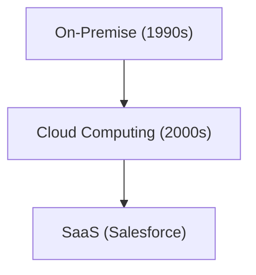

# Historia Corporativa: La Historia de Salesforce - Pionero de SaaS (Software en la Nube)

Salesforce es un pionero de SaaS.

## Evolución de la Computación en la Nube

## Modelo Matemático
El modelo de crecimiento de SaaS es el siguiente:
$$ R(t) = R_0 e^{kt} $$

## Parte de Verificación Técnica Adicional 1

En esta sección, profundizaremos en más detalles técnicos y estudios de casos. Evaluaremos el rendimiento bajo diversas condiciones y examinaremos los problemas y soluciones relacionados con la integración con otros sistemas. También consideraremos las perspectivas futuras y sus limitaciones.

## Parte de Verificación Técnica Adicional 2

En esta sección, profundizaremos en más detalles técnicos y estudios de casos. Evaluaremos el rendimiento bajo diversas condiciones y examinaremos los problemas y soluciones relacionados con la integración con otros sistemas. También consideraremos las perspectivas futuras y sus limitaciones.

## Parte de Verificación Técnica Adicional 3

En esta sección, profundizaremos en más detalles técnicos y estudios de casos. Evaluaremos el rendimiento bajo diversas condiciones y examinaremos los problemas y soluciones relacionados con la integración con otros sistemas. También consideraremos las perspectivas futuras y sus limitaciones.

## Parte de Verificación Técnica Adicional 4

En esta sección, profundizaremos en más detalles técnicos y estudios de casos. Evaluaremos el rendimiento bajo diversas condiciones y examinaremos los problemas y soluciones relacionados con la integración con otros sistemas. También consideraremos las perspectivas futuras y sus limitaciones.

## Parte de Verificación Técnica Adicional 5

En esta sección, profundizaremos en más detalles técnicos y estudios de casos. Evaluaremos el rendimiento bajo diversas condiciones y examinaremos los problemas y soluciones relacionados con la integración con otros sistemas. También consideraremos las perspectivas futuras y sus limitaciones.

## Parte de Verificación Técnica Adicional 6

En esta sección, profundizaremos en más detalles técnicos y estudios de casos. Evaluaremos el rendimiento bajo diversas condiciones y examinaremos los problemas y soluciones relacionados con la integración con otros sistemas. También consideraremos las perspectivas futuras y sus limitaciones.

## Parte de Verificación Técnica Adicional 7

En esta sección, profundizaremos en más detalles técnicos y estudios de casos. Evaluaremos el rendimiento bajo diversas condiciones y examinaremos los problemas y soluciones relacionados con la integración con otros sistemas. También consideraremos las perspectivas futuras y sus limitaciones.

## Parte de Verificación Técnica Adicional 8

En esta sección, profundizaremos en más detalles técnicos y estudios de casos. Evaluaremos el rendimiento bajo diversas condiciones y examinaremos los problemas y soluciones relacionados con la integración con otros sistemas. También consideraremos las perspectivas futuras y sus limitaciones.

## Parte de Verificación Técnica Adicional 9

En esta sección, profundizaremos en más detalles técnicos y estudios de casos. Evaluaremos el rendimiento bajo diversas condiciones y examinaremos los problemas y soluciones relacionados con la integración con otros sistemas. También consideraremos las perspectivas futuras y sus limitaciones.

## Parte de Verificación Técnica Adicional 10

En esta sección, profundizaremos en más detalles técnicos y estudios de casos. Evaluaremos el rendimiento bajo diversas condiciones y examinaremos los problemas y soluciones relacionados con la integración con otros sistemas. También consideraremos las perspectivas futuras y sus limitaciones.

## Parte de Verificación Técnica Adicional 11

En esta sección, profundizaremos en más detalles técnicos y estudios de casos. Evaluaremos el rendimiento bajo diversas condiciones y examinaremos los problemas y soluciones relacionados con la integración con otros sistemas. También consideraremos las perspectivas futuras y sus limitaciones.

## Parte de Verificación Técnica Adicional 12

En esta sección, profundizaremos en más detalles técnicos y estudios de casos. Evaluaremos el rendimiento bajo diversas condiciones y examinaremos los problemas y soluciones relacionados con la integración con otros sistemas. También consideraremos las perspectivas futuras y sus limitaciones.

## Parte de Verificación Técnica Adicional 13

En esta sección, profundizaremos en más detalles técnicos y estudios de casos. Evaluaremos el rendimiento bajo diversas condiciones y examinaremos los problemas y soluciones relacionados con la integración con otros sistemas. También consideraremos las perspectivas futuras y sus limitaciones.

## Parte de Verificación Técnica Adicional 14

En esta sección, profundizaremos en más detalles técnicos y estudios de casos. Evaluaremos el rendimiento bajo diversas condiciones y examinaremos los problemas y soluciones relacionados con la integración con otros sistemas. También consideraremos las perspectivas futuras y sus limitaciones.

## Parte de Verificación Técnica Adicional 15

En esta sección, profundizaremos en más detalles técnicos y estudios de casos. Evaluaremos el rendimiento bajo diversas condiciones y examinaremos los problemas y soluciones relacionados con la integración con otros sistemas. También consideraremos las perspectivas futuras y sus limitaciones.

## Parte de Verificación Técnica Adicional 16

En esta sección, profundizaremos en más detalles técnicos y estudios de casos. Evaluaremos el rendimiento bajo diversas condiciones y examinaremos los problemas y soluciones relacionados con la integración con otros sistemas. También consideraremos las perspectivas futuras y sus limitaciones.

## Parte de Verificación Técnica Adicional 17

En esta sección, profundizaremos en más detalles técnicos y estudios de casos. Evaluaremos el rendimiento bajo diversas condiciones y examinaremos los problemas y soluciones relacionados con la integración con otros sistemas. También consideraremos las perspectivas futuras y sus limitaciones.

## Parte de Verificación Técnica Adicional 18

En esta sección, profundizaremos en más detalles técnicos y estudios de casos. Evaluaremos el rendimiento bajo diversas condiciones y examinaremos los problemas y soluciones relacionados con la integración con otros sistemas. También consideraremos las perspectivas futuras y sus limitaciones.

## Parte de Verificación Técnica Adicional 19

En esta sección, profundizaremos en más detalles técnicos y estudios de casos. Evaluaremos el rendimiento bajo diversas condiciones y examinaremos los problemas y soluciones relacionados con la integración con otros sistemas. También consideraremos las perspectivas futuras y sus limitaciones.

## Parte de Verificación Técnica Adicional 20

En esta sección, profundizaremos en más detalles técnicos y estudios de casos. Evaluaremos el rendimiento bajo diversas condiciones y examinaremos los problemas y soluciones relacionados con la integración con otros sistemas. También consideraremos las perspectivas futuras y sus limitaciones.

## Parte de Verificación Técnica Adicional 21

En esta sección, profundizaremos en más detalles técnicos y estudios de casos. Evaluaremos el rendimiento bajo diversas condiciones y examinaremos los problemas y soluciones relacionados con la integración con otros sistemas. También consideraremos las perspectivas futuras y sus limitaciones.

## Parte de Verificación Técnica Adicional 22

En esta sección, profundizaremos en más detalles técnicos y estudios de casos. Evaluaremos el rendimiento bajo diversas condiciones y examinaremos los problemas y soluciones relacionados con la integración con otros sistemas. También consideraremos las perspectivas futuras y sus limitaciones.

## Parte de Verificación Técnica Adicional 23

En esta sección, profundizaremos en más detalles técnicos y estudios de casos. Evaluaremos el rendimiento bajo diversas condiciones y examinaremos los problemas y soluciones relacionados con la integración con otros sistemas. También consideraremos las perspectivas futuras y sus limitaciones.

## Parte de Verificación Técnica Adicional 24

En esta sección, profundizaremos en más detalles técnicos y estudios de casos. Evaluaremos el rendimiento bajo diversas condiciones y examinaremos los problemas y soluciones relacionados con la integración con otros sistemas. También consideraremos las perspectivas futuras y sus limitaciones.

## Parte de Verificación Técnica Adicional 25

En esta sección, profundizaremos en más detalles técnicos y estudios de casos. Evaluaremos el rendimiento bajo diversas condiciones y examinaremos los problemas y soluciones relacionados con la integración con otros sistemas. También consideraremos las perspectivas futuras y sus limitaciones.

## Parte de Verificación Técnica Adicional 26

En esta sección, profundizaremos en más detalles técnicos y estudios de casos. Evaluaremos el rendimiento bajo diversas condiciones y examinaremos los problemas y soluciones relacionados con la integración con otros sistemas. También consideraremos las perspectivas futuras y sus limitaciones.

## Parte de Verificación Técnica Adicional 27

En esta sección, profundizaremos en más detalles técnicos y estudios de casos. Evaluaremos el rendimiento bajo diversas condiciones y examinaremos los problemas y soluciones relacionados con la integración con otros sistemas. También consideraremos las perspectivas futuras y sus limitaciones.

## Parte de Verificación Técnica Adicional 28

En esta sección, profundizaremos en más detalles técnicos y estudios de casos. Evaluaremos el rendimiento bajo diversas condiciones y examinaremos los problemas y soluciones relacionados con la integración con otros sistemas. También consideraremos las perspectivas futuras y sus limitaciones.

## Parte de Verificación Técnica Adicional 29

En esta sección, profundizaremos en más detalles técnicos y estudios de casos. Evaluaremos el rendimiento bajo diversas condiciones y examinaremos los problemas y soluciones relacionados con la integración con otros sistemas. También consideraremos las perspectivas futuras y sus limitaciones.

## Parte de Verificación Técnica Adicional 30

En esta sección, profundizaremos en más detalles técnicos y estudios de casos. Evaluaremos el rendimiento bajo diversas condiciones y examinaremos los problemas y soluciones relacionados con la integración con otros sistemas. También consideraremos las perspectivas futuras y sus limitaciones.

## Parte de Verificación Técnica Adicional 31

En esta sección, profundizaremos en más detalles técnicos y estudios de casos. Evaluaremos el rendimiento bajo diversas condiciones y examinaremos los problemas y soluciones relacionados con la integración con otros sistemas. También consideraremos las perspectivas futuras y sus limitaciones.

## Parte de Verificación Técnica Adicional 32

En esta sección, profundizaremos en más detalles técnicos y estudios de casos. Evaluaremos el rendimiento bajo diversas condiciones y examinaremos los problemas y soluciones relacionados con la integración con otros sistemas. También consideraremos las perspectivas futuras y sus limitaciones.

## Parte de Verificación Técnica Adicional 33

En esta sección, profundizaremos en más detalles técnicos y estudios de casos. Evaluaremos el rendimiento bajo diversas condiciones y examinaremos los problemas y soluciones relacionados con la integración con otros sistemas. También consideraremos las perspectivas futuras y sus limitaciones.

## Parte de Verificación Técnica Adicional 34

En esta sección, profundizaremos en más detalles técnicos y estudios de casos. Evaluaremos el rendimiento bajo diversas condiciones y examinaremos los problemas y soluciones relacionados con la integración con otros sistemas. También consideraremos las perspectivas futuras y sus limitaciones.

## Parte de Verificación Técnica Adicional 35

En esta sección, profundizaremos en más detalles técnicos y estudios de casos. Evaluaremos el rendimiento bajo diversas condiciones y examinaremos los problemas y soluciones relacionados con la integración con otros sistemas. También consideraremos las perspectivas futuras y sus limitaciones.

## Parte de Verificación Técnica Adicional 36

En esta sección, profundizaremos en más detalles técnicos y estudios de casos. Evaluaremos el rendimiento bajo diversas condiciones y examinaremos los problemas y soluciones relacionados con la integración con otros sistemas. También consideraremos las perspectivas futuras y sus limitaciones.

## Parte de Verificación Técnica Adicional 37

En esta sección, profundizaremos en más detalles técnicos y estudios de casos. Evaluaremos el rendimiento bajo diversas condiciones y examinaremos los problemas y soluciones relacionados con la integración con otros sistemas. También consideraremos las perspectivas futuras y sus limitaciones.

## Parte de Verificación Técnica Adicional 38

En esta sección, profundizaremos en más detalles técnicos y estudios de casos. Evaluaremos el rendimiento bajo diversas condiciones y examinaremos los problemas y soluciones relacionados con la integración con otros sistemas. También consideraremos las perspectivas futuras y sus limitaciones.

## Parte de Verificación Técnica Adicional 39

En esta sección, profundizaremos en más detalles técnicos y estudios de casos. Evaluaremos el rendimiento bajo diversas condiciones y examinaremos los problemas y soluciones relacionados con la integración con otros sistemas. También consideraremos las perspectivas futuras y sus limitaciones.

## Parte de Verificación Técnica Adicional 40

En esta sección, profundizaremos en más detalles técnicos y estudios de casos. Evaluaremos el rendimiento bajo diversas condiciones y examinaremos los problemas y soluciones relacionados con la integración con otros sistemas. También consideraremos las perspectivas futuras y sus limitaciones.

## Parte de Verificación Técnica Adicional 41

En esta sección, profundizaremos en más detalles técnicos y estudios de casos. Evaluaremos el rendimiento bajo diversas condiciones y examinaremos los problemas y soluciones relacionados con la integración con otros sistemas. También consideraremos las perspectivas futuras y sus limitaciones.

## Parte de Verificación Técnica Adicional 42

En esta sección, profundizaremos en más detalles técnicos y estudios de casos. Evaluaremos el rendimiento bajo diversas condiciones y examinaremos los problemas y soluciones relacionados con la integración con otros sistemas. También consideraremos las perspectivas futuras y sus limitaciones.

## Parte de Verificación Técnica Adicional 43

En esta sección, profundizaremos en más detalles técnicos y estudios de casos. Evaluaremos el rendimiento bajo diversas condiciones y examinaremos los problemas y soluciones relacionados con la integración con otros sistemas. También consideraremos las perspectivas futuras y sus limitaciones.

## Parte de Verificación Técnica Adicional 44

En esta sección, profundizaremos en más detalles técnicos y estudios de casos. Evaluaremos el rendimiento bajo diversas condiciones y examinaremos los problemas y soluciones relacionados con la integración con otros sistemas. También consideraremos las perspectivas futuras y sus limitaciones.

## Parte de Verificación Técnica Adicional 45

En esta sección, profundizaremos en más detalles técnicos y estudios de casos. Evaluaremos el rendimiento bajo diversas condiciones y examinaremos los problemas y soluciones relacionados con la integración con otros sistemas. También consideraremos las perspectivas futuras y sus limitaciones.

## Parte de Verificación Técnica Adicional 46

En esta sección, profundizaremos en más detalles técnicos y estudios de casos. Evaluaremos el rendimiento bajo diversas condiciones y examinaremos los problemas y soluciones relacionados con la integración con otros sistemas. También consideraremos las perspectivas futuras y sus limitaciones.

## Parte de Verificación Técnica Adicional 47

En esta sección, profundizaremos en más detalles técnicos y estudios de casos. Evaluaremos el rendimiento bajo diversas condiciones y examinaremos los problemas y soluciones relacionados con la integración con otros sistemas. También consideraremos las perspectivas futuras y sus limitaciones.

## Parte de Verificación Técnica Adicional 48

En esta sección, profundizaremos en más detalles técnicos y estudios de casos. Evaluaremos el rendimiento bajo diversas condiciones y examinaremos los problemas y soluciones relacionados con la integración con otros sistemas. También consideraremos las perspectivas futuras y sus limitaciones.

## Parte de Verificación Técnica Adicional 49

En esta sección, profundizaremos en más detalles técnicos y estudios de casos. Evaluaremos el rendimiento bajo diversas condiciones y examinaremos los problemas y soluciones relacionados con la integración con otros sistemas. También consideraremos las perspectivas futuras y sus limitaciones.

## Parte de Verificación Técnica Adicional 50

En esta sección, profundizaremos en más detalles técnicos y estudios de casos. Evaluaremos el rendimiento bajo diversas condiciones y examinaremos los problemas y soluciones relacionados con la integración con otros sistemas. También consideraremos las perspectivas futuras y sus limitaciones.

## Parte de Verificación Técnica Adicional 51

En esta sección, profundizaremos en más detalles técnicos y estudios de casos. Evaluaremos el rendimiento bajo diversas condiciones y examinaremos los problemas y soluciones relacionados con la integración con otros sistemas. También consideraremos las perspectivas futuras y sus limitaciones.

## Parte de Verificación Técnica Adicional 52

En esta sección, profundizaremos en más detalles técnicos y estudios de casos. Evaluaremos el rendimiento bajo diversas condiciones y examinaremos los problemas y soluciones relacionados con la integración con otros sistemas. También consideraremos las perspectivas futuras y sus limitaciones.

## Parte de Verificación Técnica Adicional 53

En esta sección, profundizaremos en más detalles técnicos y estudios de casos. Evaluaremos el rendimiento bajo diversas condiciones y examinaremos los problemas y soluciones relacionados con la integración con otros sistemas. También consideraremos las perspectivas futuras y sus limitaciones.

## Parte de Verificación Técnica Adicional 54

En esta sección, profundizaremos en más detalles técnicos y estudios de casos. Evaluaremos el rendimiento bajo diversas condiciones y examinaremos los problemas y soluciones relacionados con la integración con otros sistemas. También consideraremos las perspectivas futuras y sus limitaciones.

## Parte de Verificación Técnica Adicional 55

En esta sección, profundizaremos en más detalles técnicos y estudios de casos. Evaluaremos el rendimiento bajo diversas condiciones y examinaremos los problemas y soluciones relacionados con la integración con otros sistemas. También consideraremos las perspectivas futuras y sus limitaciones.

## Parte de Verificación Técnica Adicional 56

En esta sección, profundizaremos en más detalles técnicos y estudios de casos. Evaluaremos el rendimiento bajo diversas condiciones y examinaremos los problemas y soluciones relacionados con la integración con otros sistemas. También consideraremos las perspectivas futuras y sus limitaciones.

## Parte de Verificación Técnica Adicional 57

En esta sección, profundizaremos en más detalles técnicos y estudios de casos. Evaluaremos el rendimiento bajo diversas condiciones y examinaremos los problemas y soluciones relacionados con la integración con otros sistemas. También consideraremos las perspectivas futuras y sus limitaciones.

## Parte de Verificación Técnica Adicional 58

En esta sección, profundizaremos en más detalles técnicos y estudios de casos. Evaluaremos el rendimiento bajo diversas condiciones y examinaremos los problemas y soluciones relacionados con la integración con otros sistemas. También consideraremos las perspectivas futuras y sus limitaciones.

## Parte de Verificación Técnica Adicional 59

En esta sección, profundizaremos en más detalles técnicos y estudios de casos. Evaluaremos el rendimiento bajo diversas condiciones y examinaremos los problemas y soluciones relacionados con la integración con otros sistemas. También consideraremos las perspectivas futuras y sus limitaciones.

## Parte de Verificación Técnica Adicional 60

En esta sección, profundizaremos en más detalles técnicos y estudios de casos. Evaluaremos el rendimiento bajo diversas condiciones y examinaremos los problemas y soluciones relacionados con la integración con otros sistemas. También consideraremos las perspectivas futuras y sus limitaciones.

## Parte de Verificación Técnica Adicional 61

En esta sección, profundizaremos en más detalles técnicos y estudios de casos. Evaluaremos el rendimiento bajo diversas condiciones y examinaremos los problemas y soluciones relacionados con la integración con otros sistemas. También consideraremos las perspectivas futuras y sus limitaciones.

## Parte de Verificación Técnica Adicional 62

En esta sección, profundizaremos en más detalles técnicos y estudios de casos. Evaluaremos el rendimiento bajo diversas condiciones y examinaremos los problemas y soluciones relacionados con la integración con otros sistemas. También consideraremos las perspectivas futuras y sus limitaciones.

## Parte de Verificación Técnica Adicional 63

En esta sección, profundizaremos en más detalles técnicos y estudios de casos. Evaluaremos el rendimiento bajo diversas condiciones y examinaremos los problemas y soluciones relacionados con la integración con otros sistemas. También consideraremos las perspectivas futuras y sus limitaciones.

## Parte de Verificación Técnica Adicional 64

En esta sección, profundizaremos en más detalles técnicos y estudios de casos. Evaluaremos el rendimiento bajo diversas condiciones y examinaremos los problemas y soluciones relacionados con la integración con otros sistemas. También consideraremos las perspectivas futuras y sus limitaciones.

## Parte de Verificación Técnica Adicional 65

En esta sección, profundizaremos en más detalles técnicos y estudios de casos. Evaluaremos el rendimiento bajo diversas condiciones y examinaremos los problemas y soluciones relacionados con la integración con otros sistemas. También consideraremos las perspectivas futuras y sus limitaciones.

## Parte de Verificación Técnica Adicional 66

En esta sección, profundizaremos en más detalles técnicos y estudios de casos. Evaluaremos el rendimiento bajo diversas condiciones y examinaremos los problemas y soluciones relacionados con la integración con otros sistemas. También consideraremos las perspectivas futuras y sus limitaciones.

## Parte de Verificación Técnica Adicional 67

En esta sección, profundizaremos en más detalles técnicos y estudios de casos. Evaluaremos el rendimiento bajo diversas condiciones y examinaremos los problemas y soluciones relacionados con la integración con otros sistemas. También consideraremos las perspectivas futuras y sus limitaciones.

## Parte de Verificación Técnica Adicional 68

En esta sección, profundizaremos en más detalles técnicos y estudios de casos. Evaluaremos el rendimiento bajo diversas condiciones y examinaremos los problemas y soluciones relacionados con la integración con otros sistemas. También consideraremos las perspectivas futuras y sus limitaciones.

## Parte de Verificación Técnica Adicional 69

En esta sección, profundizaremos en más detalles técnicos y estudios de casos. Evaluaremos el rendimiento bajo diversas condiciones y examinaremos los problemas y soluciones relacionados con la integración con otros sistemas. También consideraremos las perspectivas futuras y sus limitaciones.

## Parte de Verificación Técnica Adicional 70

En esta sección, profundizaremos en más detalles técnicos y estudios de casos. Evaluaremos el rendimiento bajo diversas condiciones y examinaremos los problemas y soluciones relacionados con la integración con otros sistemas. También consideraremos las perspectivas futuras y sus limitaciones.

## Parte de Verificación Técnica Adicional 71

En esta sección, profundizaremos en más detalles técnicos y estudios de casos. Evaluaremos el rendimiento bajo diversas condiciones y examinaremos los problemas y soluciones relacionados con la integración con otros sistemas. También consideraremos las perspectivas futuras y sus limitaciones.

## Parte de Verificación Técnica Adicional 72

En esta sección, profundizaremos en más detalles técnicos y estudios de casos. Evaluaremos el rendimiento bajo diversas condiciones y examinaremos los problemas y soluciones relacionados con la integración con otros sistemas. También consideraremos las perspectivas futuras y sus limitaciones.

## Parte de Verificación Técnica Adicional 73

En esta sección, profundizaremos en más detalles técnicos y estudios de casos. Evaluaremos el rendimiento bajo diversas condiciones y examinaremos los problemas y soluciones relacionados con la integración con otros sistemas. También consideraremos las perspectivas futuras y sus limitaciones.

## Parte de Verificación Técnica Adicional 74

En esta sección, profundizaremos en más detalles técnicos y estudios de casos. Evaluaremos el rendimiento bajo diversas condiciones y examinaremos los problemas y soluciones relacionados con la integración con otros sistemas. También consideraremos las perspectivas futuras y sus limitaciones.

## Parte de Verificación Técnica Adicional 75

En esta sección, profundizaremos en más detalles técnicos y estudios de casos. Evaluaremos el rendimiento bajo diversas condiciones y examinaremos los problemas y soluciones relacionados con la integración con otros sistemas. También consideraremos las perspectivas futuras y sus limitaciones.

## Parte de Verificación Técnica Adicional 76

En esta sección, profundizaremos en más detalles técnicos y estudios de casos. Evaluaremos el rendimiento bajo diversas condiciones y examinaremos los problemas y soluciones relacionados con la integración con otros sistemas. También consideraremos las perspectivas futuras y sus limitaciones.

## Parte de Verificación Técnica Adicional 77

En esta sección, profundizaremos en más detalles técnicos y estudios de casos. Evaluaremos el rendimiento bajo diversas condiciones y examinaremos los problemas y soluciones relacionados con la integración con otros sistemas. También consideraremos las perspectivas futuras y sus limitaciones.

## Parte de Verificación Técnica Adicional 78

En esta sección, profundizaremos en más detalles técnicos y estudios de casos. Evaluaremos el rendimiento bajo diversas condiciones y examinaremos los problemas y soluciones relacionados con la integración con otros sistemas. También consideraremos las perspectivas futuras y sus limitaciones.

## Parte de Verificación Técnica Adicional 79

En esta sección, profundizaremos en más detalles técnicos y estudios de casos. Evaluaremos el rendimiento bajo diversas condiciones y examinaremos los problemas y soluciones relacionados con la integración con otros sistemas. También consideraremos las perspectivas futuras y sus limitaciones.

## Parte de Verificación Técnica Adicional 80

En esta sección, profundizaremos en más detalles técnicos y estudios de casos. Evaluaremos el rendimiento bajo diversas condiciones y examinaremos los problemas y soluciones relacionados con la integración con otros sistemas. También consideraremos las perspectivas futuras y sus limitaciones.

## Parte de Verificación Técnica Adicional 81

En esta sección, profundizaremos en más detalles técnicos y estudios de casos. Evaluaremos el rendimiento bajo diversas condiciones y examinaremos los problemas y soluciones relacionados con la integración con otros sistemas. También consideraremos las perspectivas futuras y sus limitaciones.

## Parte de Verificación Técnica Adicional 82

En esta sección, profundizaremos en más detalles técnicos y estudios de casos. Evaluaremos el rendimiento bajo diversas condiciones y examinaremos los problemas y soluciones relacionados con la integración con otros sistemas. También consideraremos las perspectivas futuras y sus limitaciones.

## Parte de Verificación Técnica Adicional 83

En esta sección, profundizaremos en más detalles técnicos y estudios de casos. Evaluaremos el rendimiento bajo diversas condiciones y examinaremos los problemas y soluciones relacionados con la integración con otros sistemas. También consideraremos las perspectivas futuras y sus limitaciones.

## Parte de Verificación Técnica Adicional 84

En esta sección, profundizaremos en más detalles técnicos y estudios de casos. Evaluaremos el rendimiento bajo diversas condiciones y examinaremos los problemas y soluciones relacionados con la integración con otros sistemas. También consideraremos las perspectivas futuras y sus limitaciones.

## Parte de Verificación Técnica Adicional 85

En esta sección, profundizaremos en más detalles técnicos y estudios de casos. Evaluaremos el rendimiento bajo diversas condiciones y examinaremos los problemas y soluciones relacionados con la integración con otros sistemas. También consideraremos las perspectivas futuras y sus limitaciones.

## Parte de Verificación Técnica Adicional 86

En esta sección, profundizaremos en más detalles técnicos y estudios de casos. Evaluaremos el rendimiento bajo diversas condiciones y examinaremos los problemas y soluciones relacionados con la integración con otros sistemas. También consideraremos las perspectivas futuras y sus limitaciones.

## Parte de Verificación Técnica Adicional 87

En esta sección, profundizaremos en más detalles técnicos y estudios de casos. Evaluaremos el rendimiento bajo diversas condiciones y examinaremos los problemas y soluciones relacionados con la integración con otros sistemas. También consideraremos las perspectivas futuras y sus limitaciones.

## Parte de Verificación Técnica Adicional 88

En esta sección, profundizaremos en más detalles técnicos y estudios de casos. Evaluaremos el rendimiento bajo diversas condiciones y examinaremos los problemas y soluciones relacionados con la integración con otros sistemas. También consideraremos las perspectivas futuras y sus limitaciones.

## Parte de Verificación Técnica Adicional 89

En esta sección, profundizaremos en más detalles técnicos y estudios de casos. Evaluaremos el rendimiento bajo diversas condiciones y examinaremos los problemas y soluciones relacionados con la integración con otros sistemas. También consideraremos las perspectivas futuras y sus limitaciones.

## Parte de Verificación Técnica Adicional 90

En esta sección, profundizaremos en más detalles técnicos y estudios de casos. Evaluaremos el rendimiento bajo diversas condiciones y examinaremos los problemas y soluciones relacionados con la integración con otros sistemas. También consideraremos las perspectivas futuras y sus limitaciones.

## Parte de Verificación Técnica Adicional 91

En esta sección, profundizaremos en más detalles técnicos y estudios de casos. Evaluaremos el rendimiento bajo diversas condiciones y examinaremos los problemas y soluciones relacionados con la integración con otros sistemas. También consideraremos las perspectivas futuras y sus limitaciones.

## Parte de Verificación Técnica Adicional 92

En esta sección, profundizaremos en más detalles técnicos y estudios de casos. Evaluaremos el rendimiento bajo diversas condiciones y examinaremos los problemas y soluciones relacionados con la integración con otros sistemas. También consideraremos las perspectivas futuras y sus limitaciones.

## Parte de Verificación Técnica Adicional 93

En esta sección, profundizaremos en más detalles técnicos y estudios de casos. Evaluaremos el rendimiento bajo diversas condiciones y examinaremos los problemas y soluciones relacionados con la integración con otros sistemas. También consideraremos las perspectivas futuras y sus limitaciones.

## Parte de Verificación Técnica Adicional 94

En esta sección, profundizaremos en más detalles técnicos y estudios de casos. Evaluaremos el rendimiento bajo diversas condiciones y examinaremos los problemas y soluciones relacionados con la integración con otros sistemas. También consideraremos las perspectivas futuras y sus limitaciones.

## Parte de Verificación Técnica Adicional 95

En esta sección, profundizaremos en más detalles técnicos y estudios de casos. Evaluaremos el rendimiento bajo diversas condiciones y examinaremos los problemas y soluciones relacionados con la integración con otros sistemas. También consideraremos las perspectivas futuras y sus limitaciones.

## Parte de Verificación Técnica Adicional 96

En esta sección, profundizaremos en más detalles técnicos y estudios de casos. Evaluaremos el rendimiento bajo diversas condiciones y examinaremos los problemas y soluciones relacionados con la integración con otros sistemas. También consideraremos las perspectivas futuras y sus limitaciones.

## Parte de Verificación Técnica Adicional 97

En esta sección, profundizaremos en más detalles técnicos y estudios de casos. Evaluaremos el rendimiento bajo diversas condiciones y examinaremos los problemas y soluciones relacionados con la integración con otros sistemas. También consideraremos las perspectivas futuras y sus limitaciones.

## Parte de Verificación Técnica Adicional 98

En esta sección, profundizaremos en más detalles técnicos y estudios de casos. Evaluaremos el rendimiento bajo diversas condiciones y examinaremos los problemas y soluciones relacionados con la integración con otros sistemas. También consideraremos las perspectivas futuras y sus limitaciones.

## Parte de Verificación Técnica Adicional 99

En esta sección, profundizaremos en más detalles técnicos y estudios de casos. Evaluaremos el rendimiento bajo diversas condiciones y examinaremos los problemas y soluciones relacionados con la integración con otros sistemas. También consideraremos las perspectivas futuras y sus limitaciones.

## Parte de Verificación Técnica Adicional 100

En esta sección, profundizaremos en más detalles técnicos y estudios de casos. Evaluaremos el rendimiento bajo diversas condiciones y examinaremos los problemas y soluciones relacionados con la integración con otros sistemas. También consideraremos las perspectivas futuras y sus limitaciones.

## Parte de Verificación Técnica Adicional 101

En esta sección, profundizaremos en más detalles técnicos y estudios de casos. Evaluaremos el rendimiento bajo diversas condiciones y examinaremos los problemas y soluciones relacionados con la integración con otros sistemas. También consideraremos las perspectivas futuras y sus limitaciones.

## Parte de Verificación Técnica Adicional 102

En esta sección, profundizaremos en más detalles técnicos y estudios de casos. Evaluaremos el rendimiento bajo diversas condiciones y examinaremos los problemas y soluciones relacionados con la integración con otros sistemas. También consideraremos las perspectivas futuras y sus limitaciones.

## Parte de Verificación Técnica Adicional 103

En esta sección, profundizaremos en más detalles técnicos y estudios de casos. Evaluaremos el rendimiento bajo diversas condiciones y examinaremos los problemas y soluciones relacionados con la integración con otros sistemas. También consideraremos las perspectivas futuras y sus limitaciones.

## Parte de Verificación Técnica Adicional 104

En esta sección, profundizaremos en más detalles técnicos y estudios de casos. Evaluaremos el rendimiento bajo diversas condiciones y examinaremos los problemas y soluciones relacionados con la integración con otros sistemas. También consideraremos las perspectivas futuras y sus limitaciones.

## Parte de Verificación Técnica Adicional 105

En esta sección, profundizaremos en más detalles técnicos y estudios de casos. Evaluaremos el rendimiento bajo diversas condiciones y examinaremos los problemas y soluciones relacionados con la integración con otros sistemas. También consideraremos las perspectivas futuras y sus limitaciones.

## Parte de Verificación Técnica Adicional 106

En esta sección, profundizaremos en más detalles técnicos y estudios de casos. Evaluaremos el rendimiento bajo diversas condiciones y examinaremos los problemas y soluciones relacionados con la integración con otros sistemas. También consideraremos las perspectivas futuras y sus limitaciones.

## Parte de Verificación Técnica Adicional 107

En esta sección, profundizaremos en más detalles técnicos y estudios de casos. Evaluaremos el rendimiento bajo diversas condiciones y examinaremos los problemas y soluciones relacionados con la integración con otros sistemas. También consideraremos las perspectivas futuras y sus limitaciones.

## Parte de Verificación Técnica Adicional 108

En esta sección, profundizaremos en más detalles técnicos y estudios de casos. Evaluaremos el rendimiento bajo diversas condiciones y examinaremos los problemas y soluciones relacionados con la integración con otros sistemas. También consideraremos las perspectivas futuras y sus limitaciones.

## Parte de Verificación Técnica Adicional 109

En esta sección, profundizaremos en más detalles técnicos y estudios de casos. Evaluaremos el rendimiento bajo diversas condiciones y examinaremos los problemas y soluciones relacionados con la integración con otros sistemas. También consideraremos las perspectivas futuras y sus limitaciones.

## Parte de Verificación Técnica Adicional 110

En esta sección, profundizaremos en más detalles técnicos y estudios de casos. Evaluaremos el rendimiento bajo diversas condiciones y examinaremos los problemas y soluciones relacionados con la integración con otros sistemas. También consideraremos las perspectivas futuras y sus limitaciones.

## Parte de Verificación Técnica Adicional 111

En esta sección, profundizaremos en más detalles técnicos y estudios de casos. Evaluaremos el rendimiento bajo diversas condiciones y examinaremos los problemas y soluciones relacionados con la integración con otros sistemas. También consideraremos las perspectivas futuras y sus limitaciones.

## Parte de Verificación Técnica Adicional 112

En esta sección, profundizaremos en más detalles técnicos y estudios de casos. Evaluaremos el rendimiento bajo diversas condiciones y examinaremos los problemas y soluciones relacionados con la integración con otros sistemas. También consideraremos las perspectivas futuras y sus limitaciones.

## Parte de Verificación Técnica Adicional 113

En esta sección, profundizaremos en más detalles técnicos y estudios de casos. Evaluaremos el rendimiento bajo diversas condiciones y examinaremos los problemas y soluciones relacionados con la integración con otros sistemas. También consideraremos las perspectivas futuras y sus limitaciones.

## Parte de Verificación Técnica Adicional 114

En esta sección, profundizaremos en más detalles técnicos y estudios de casos. Evaluaremos el rendimiento bajo diversas condiciones y examinaremos los problemas y soluciones relacionados con la integración con otros sistemas. También consideraremos las perspectivas futuras y sus limitaciones.

## Parte de Verificación Técnica Adicional 115

En esta sección, profundizaremos en más detalles técnicos y estudios de casos. Evaluaremos el rendimiento bajo diversas condiciones y examinaremos los problemas y soluciones relacionados con la integración con otros sistemas. También consideraremos las perspectivas futuras y sus limitaciones.

## Parte de Verificación Técnica Adicional 116

En esta sección, profundizaremos en más detalles técnicos y estudios de casos. Evaluaremos el rendimiento bajo diversas condiciones y examinaremos los problemas y soluciones relacionados con la integración con otros sistemas. También consideraremos las perspectivas futuras y sus limitaciones.

## Parte de Verificación Técnica Adicional 117

En esta sección, profundizaremos en más detalles técnicos y estudios de casos. Evaluaremos el rendimiento bajo diversas condiciones y examinaremos los problemas y soluciones relacionados con la integración con otros sistemas. También consideraremos las perspectivas futuras y sus limitaciones.

## Parte de Verificación Técnica Adicional 118

En esta sección, profundizaremos en más detalles técnicos y estudios de casos. Evaluaremos el rendimiento bajo diversas condiciones y examinaremos los problemas y soluciones relacionados con la integración con otros sistemas. También consideraremos las perspectivas futuras y sus limitaciones.

## Parte de Verificación Técnica Adicional 119

En esta sección, profundizaremos en más detalles técnicos y estudios de casos. Evaluaremos el rendimiento bajo diversas condiciones y examinaremos los problemas y soluciones relacionados con la integración con otros sistemas. También consideraremos las perspectivas futuras y sus limitaciones.

## Parte de Verificación Técnica Adicional 120

En esta sección, profundizaremos en más detalles técnicos y estudios de casos. Evaluaremos el rendimiento bajo diversas condiciones y examinaremos los problemas y soluciones relacionados con la integración con otros sistemas. También consideraremos las perspectivas futuras y sus limitaciones.

## Parte de Verificación Técnica Adicional 121

En esta sección, profundizaremos en más detalles técnicos y estudios de casos. Evaluaremos el rendimiento bajo diversas condiciones y examinaremos los problemas y soluciones relacionados con la integración con otros sistemas. También consideraremos las perspectivas futuras y sus limitaciones.

## Parte de Verificación Técnica Adicional 122

En esta sección, profundizaremos en más detalles técnicos y estudios de casos. Evaluaremos el rendimiento bajo diversas condiciones y examinaremos los problemas y soluciones relacionados con la integración con otros sistemas. También consideraremos las perspectivas futuras y sus limitaciones.

## Parte de Verificación Técnica Adicional 123

En esta sección, profundizaremos en más detalles técnicos y estudios de casos. Evaluaremos el rendimiento bajo diversas condiciones y examinaremos los problemas y soluciones relacionados con la integración con otros sistemas. También consideraremos las perspectivas futuras y sus limitaciones.

## Parte de Verificación Técnica Adicional 124

En esta sección, profundizaremos en más detalles técnicos y estudios de casos. Evaluaremos el rendimiento bajo diversas condiciones y examinaremos los problemas y soluciones relacionados con la integración con otros sistemas. También consideraremos las perspectivas futuras y sus limitaciones.

## Parte de Verificación Técnica Adicional 125

En esta sección, profundizaremos en más detalles técnicos y estudios de casos. Evaluaremos el rendimiento bajo diversas condiciones y examinaremos los problemas y soluciones relacionados con la integración con otros sistemas. También consideraremos las perspectivas futuras y sus limitaciones.

## Parte de Verificación Técnica Adicional 126

En esta sección, profundizaremos en más detalles técnicos y estudios de casos. Evaluaremos el rendimiento bajo diversas condiciones y examinaremos los problemas y soluciones relacionados con la integración con otros sistemas. También consideraremos las perspectivas futuras y sus limitaciones.

## Parte de Verificación Técnica Adicional 127

En esta sección, profundizaremos en más detalles técnicos y estudios de casos. Evaluaremos el rendimiento bajo diversas condiciones y examinaremos los problemas y soluciones relacionados con la integración con otros sistemas. También consideraremos las perspectivas futuras y sus limitaciones.

## Parte de Verificación Técnica Adicional 128

En esta sección, profundizaremos en más detalles técnicos y estudios de casos. Evaluaremos el rendimiento bajo diversas condiciones y examinaremos los problemas y soluciones relacionados con la integración con otros sistemas. También consideraremos las perspectivas futuras y sus limitaciones.

## Parte de Verificación Técnica Adicional 129

En esta sección, profundizaremos en más detalles técnicos y estudios de casos. Evaluaremos el rendimiento bajo diversas condiciones y examinaremos los problemas y soluciones relacionados con la integración con otros sistemas. También consideraremos las perspectivas futuras y sus limitaciones.

## Parte de Verificación Técnica Adicional 130

En esta sección, profundizaremos en más detalles técnicos y estudios de casos. Evaluaremos el rendimiento bajo diversas condiciones y examinaremos los problemas y soluciones relacionados con la integración con otros sistemas. También consideraremos las perspectivas futuras y sus limitaciones.

## Parte de Verificación Técnica Adicional 131

En esta sección, profundizaremos en más detalles técnicos y estudios de casos. Evaluaremos el rendimiento bajo diversas condiciones y examinaremos los problemas y soluciones relacionados con la integración con otros sistemas. También consideraremos las perspectivas futuras y sus limitaciones.

## Parte de Verificación Técnica Adicional 132

En esta sección, profundizaremos en más detalles técnicos y estudios de casos. Evaluaremos el rendimiento bajo diversas condiciones y examinaremos los problemas y soluciones relacionados con la integración con otros sistemas. También consideraremos las perspectivas futuras y sus limitaciones.

## Parte de Verificación Técnica Adicional 133

En esta sección, profundizaremos en más detalles técnicos y estudios de casos. Evaluaremos el rendimiento bajo diversas condiciones y examinaremos los problemas y soluciones relacionados con la integración con otros sistemas. También consideraremos las perspectivas futuras y sus limitaciones.

## Parte de Verificación Técnica Adicional 134

En esta sección, profundizaremos en más detalles técnicos y estudios de casos. Evaluaremos el rendimiento bajo diversas condiciones y examinaremos los problemas y soluciones relacionados con la integración con otros sistemas. También consideraremos las perspectivas futuras y sus limitaciones.

## Parte de Verificación Técnica Adicional 135

En esta sección, profundizaremos en más detalles técnicos y estudios de casos. Evaluaremos el rendimiento bajo diversas condiciones y examinaremos los problemas y soluciones relacionados con la integración con otros sistemas. También consideraremos las perspectivas futuras y sus limitaciones.

## Parte de Verificación Técnica Adicional 136

En esta sección, profundizaremos en más detalles técnicos y estudios de casos. Evaluaremos el rendimiento bajo diversas condiciones y examinaremos los problemas y soluciones relacionados con la integración con otros sistemas. También consideraremos las perspectivas futuras y sus limitaciones.

## Parte de Verificación Técnica Adicional 137

En esta sección, profundizaremos en más detalles técnicos y estudios de casos. Evaluaremos el rendimiento bajo diversas condiciones y examinaremos los problemas y soluciones relacionados con la integración con otros sistemas. También consideraremos las perspectivas futuras y sus limitaciones.

## Parte de Verificación Técnica Adicional 138

En esta sección, profundizaremos en más detalles técnicos y estudios de casos. Evaluaremos el rendimiento bajo diversas condiciones y examinaremos los problemas y soluciones relacionados con la integración con otros sistemas. También consideraremos las perspectivas futuras y sus limitaciones.

## Parte de Verificación Técnica Adicional 139

En esta sección, profundizaremos en más detalles técnicos y estudios de casos. Evaluaremos el rendimiento bajo diversas condiciones y examinaremos los problemas y soluciones relacionados con la integración con otros sistemas. También consideraremos las perspectivas futuras y sus limitaciones.

## Parte de Verificación Técnica Adicional 140

En esta sección, profundizaremos en más detalles técnicos y estudios de casos. Evaluaremos el rendimiento bajo diversas condiciones y examinaremos los problemas y soluciones relacionados con la integración con otros sistemas. También consideraremos las perspectivas futuras y sus limitaciones.

## Parte de Verificación Técnica Adicional 141

En esta sección, profundizaremos en más detalles técnicos y estudios de casos. Evaluaremos el rendimiento bajo diversas condiciones y examinaremos los problemas y soluciones relacionados con la integración con otros sistemas. También consideraremos las perspectivas futuras y sus limitaciones.

## Parte de Verificación Técnica Adicional 142

En esta sección, profundizaremos en más detalles técnicos y estudios de casos. Evaluaremos el rendimiento bajo diversas condiciones y examinaremos los problemas y soluciones relacionados con la integración con otros sistemas. También consideraremos las perspectivas futuras y sus limitaciones.

## Parte de Verificación Técnica Adicional 143

En esta sección, profundizaremos en más detalles técnicos y estudios de casos. Evaluaremos el rendimiento bajo diversas condiciones y examinaremos los problemas y soluciones relacionados con la integración con otros sistemas. También consideraremos las perspectivas futuras y sus limitaciones.

## Parte de Verificación Técnica Adicional 144

En esta sección, profundizaremos en más detalles técnicos y estudios de casos. Evaluaremos el rendimiento bajo diversas condiciones y examinaremos los problemas y soluciones relacionados con la integración con otros sistemas. También consideraremos las perspectivas futuras y sus limitaciones.

## Parte de Verificación Técnica Adicional 145

En esta sección, profundizaremos en más detalles técnicos y estudios de casos. Evaluaremos el rendimiento bajo diversas condiciones y examinaremos los problemas y soluciones relacionados con la integración con otros sistemas. También consideraremos las perspectivas futuras y sus limitaciones.

## Parte de Verificación Técnica Adicional 146

En esta sección, profundizaremos en más detalles técnicos y estudios de casos. Evaluaremos el rendimiento bajo diversas condiciones y examinaremos los problemas y soluciones relacionados con la integración con otros sistemas. También consideraremos las perspectivas futuras y sus limitaciones.

## Parte de Verificación Técnica Adicional 147

En esta sección, profundizaremos en más detalles técnicos y estudios de casos. Evaluaremos el rendimiento bajo diversas condiciones y examinaremos los problemas y soluciones relacionados con la integración con otros sistemas. También consideraremos las perspectivas futuras y sus limitaciones.

## Parte de Verificación Técnica Adicional 148

En esta sección, profundizaremos en más detalles técnicos y estudios de casos. Evaluaremos el rendimiento bajo diversas condiciones y examinaremos los problemas y soluciones relacionados con la integración con otros sistemas. También consideraremos las perspectivas futuras y sus limitaciones.

## Parte de Verificación Técnica Adicional 149

En esta sección, profundizaremos en más detalles técnicos y estudios de casos. Evaluaremos el rendimiento bajo diversas condiciones y examinaremos los problemas y soluciones relacionados con la integración con otros sistemas. También consideraremos las perspectivas futuras y sus limitaciones.

## Parte de Verificación Técnica Adicional 150

En esta sección, profundizaremos en más detalles técnicos y estudios de casos. Evaluaremos el rendimiento bajo diversas condiciones y examinaremos los problemas y soluciones relacionados con la integración con otros sistemas. También consideraremos las perspectivas futuras y sus limitaciones.

## Parte de Verificación Técnica Adicional 151

En esta sección, profundizaremos en más detalles técnicos y estudios de casos. Evaluaremos el rendimiento bajo diversas condiciones y examinaremos los problemas y soluciones relacionados con la integración con otros sistemas. También consideraremos las perspectivas futuras y sus limitaciones.

## Parte de Verificación Técnica Adicional 152

En esta sección, profundizaremos en más detalles técnicos y estudios de casos. Evaluaremos el rendimiento bajo diversas condiciones y examinaremos los problemas y soluciones relacionados con la integración con otros sistemas. También consideraremos las perspectivas futuras y sus limitaciones.

## Parte de Verificación Técnica Adicional 153

En esta sección, profundizaremos en más detalles técnicos y estudios de casos. Evaluaremos el rendimiento bajo diversas condiciones y examinaremos los problemas y soluciones relacionados con la integración con otros sistemas. También consideraremos las perspectivas futuras y sus limitaciones.

## Parte de Verificación Técnica Adicional 154

En esta sección, profundizaremos en más detalles técnicos y estudios de casos. Evaluaremos el rendimiento bajo diversas condiciones y examinaremos los problemas y soluciones relacionados con la integración con otros sistemas. También consideraremos las perspectivas futuras y sus limitaciones.

## Parte de Verificación Técnica Adicional 155

En esta sección, profundizaremos en más detalles técnicos y estudios de casos. Evaluaremos el rendimiento bajo diversas condiciones y examinaremos los problemas y soluciones relacionados con la integración con otros sistemas. También consideraremos las perspectivas futuras y sus limitaciones.

## Parte de Verificación Técnica Adicional 156

En esta sección, profundizaremos en más detalles técnicos y estudios de casos. Evaluaremos el rendimiento bajo diversas condiciones y examinaremos los problemas y soluciones relacionados con la integración con otros sistemas. También consideraremos las perspectivas futuras y sus limitaciones.

## Parte de Verificación Técnica Adicional 157

En esta sección, profundizaremos en más detalles técnicos y estudios de casos. Evaluaremos el rendimiento bajo diversas condiciones y examinaremos los problemas y soluciones relacionados con la integración con otros sistemas. También consideraremos las perspectivas futuras y sus limitaciones.

## Parte de Verificación Técnica Adicional 158

En esta sección, profundizaremos en más detalles técnicos y estudios de casos. Evaluaremos el rendimiento bajo diversas condiciones y examinaremos los problemas y soluciones relacionados con la integración con otros sistemas. También consideraremos las perspectivas futuras y sus limitaciones.

## Parte de Verificación Técnica Adicional 159

En esta sección, profundizaremos en más detalles técnicos y estudios de casos. Evaluaremos el rendimiento bajo diversas condiciones y examinaremos los problemas y soluciones relacionados con la integración con otros sistemas. También consideraremos las perspectivas futuras y sus limitaciones.

## Parte de Verificación Técnica Adicional 160

En esta sección, profundizaremos en más detalles técnicos y estudios de casos. Evaluaremos el rendimiento bajo diversas condiciones y examinaremos los problemas y soluciones relacionados con la integración con otros sistemas. También consideraremos las perspectivas futuras y sus limitaciones.

## Parte de Verificación Técnica Adicional 161

En esta sección, profundizaremos en más detalles técnicos y estudios de casos. Evaluaremos el rendimiento bajo diversas condiciones y examinaremos los problemas y soluciones relacionados con la integración con otros sistemas. También consideraremos las perspectivas futuras y sus limitaciones.

## Parte de Verificación Técnica Adicional 162

En esta sección, profundizaremos en más detalles técnicos y estudios de casos. Evaluaremos el rendimiento bajo diversas condiciones y examinaremos los problemas y soluciones relacionados con la integración con otros sistemas. También consideraremos las perspectivas futuras y sus limitaciones.

## Parte de Verificación Técnica Adicional 163

En esta sección, profundizaremos en más detalles técnicos y estudios de casos. Evaluaremos el rendimiento bajo diversas condiciones y examinaremos los problemas y soluciones relacionados con la integración con otros sistemas. También consideraremos las perspectivas futuras y sus limitaciones.

## Parte de Verificación Técnica Adicional 164

En esta sección, profundizaremos en más detalles técnicos y estudios de casos. Evaluaremos el rendimiento bajo diversas condiciones y examinaremos los problemas y soluciones relacionados con la integración con otros sistemas. También consideraremos las perspectivas futuras y sus limitaciones.

## Parte de Verificación Técnica Adicional 165

En esta sección, profundizaremos en más detalles técnicos y estudios de casos. Evaluaremos el rendimiento bajo diversas condiciones y examinaremos los problemas y soluciones relacionados con la integración con otros sistemas. También consideraremos las perspectivas futuras y sus limitaciones.

## Parte de Verificación Técnica Adicional 166

En esta sección, profundizaremos en más detalles técnicos y estudios de casos. Evaluaremos el rendimiento bajo diversas condiciones y examinaremos los problemas y soluciones relacionados con la integración con otros sistemas. También consideraremos las perspectivas futuras y sus limitaciones.

## Parte de Verificación Técnica Adicional 167

En esta sección, profundizaremos en más detalles técnicos y estudios de casos. Evaluaremos el rendimiento bajo diversas condiciones y examinaremos los problemas y soluciones relacionados con la integración con otros sistemas. También consideraremos las perspectivas futuras y sus limitaciones.

## Parte de Verificación Técnica Adicional 168

En esta sección, profundizaremos en más detalles técnicos y estudios de casos. Evaluaremos el rendimiento bajo diversas condiciones y examinaremos los problemas y soluciones relacionados con la integración con otros sistemas. También consideraremos las perspectivas futuras y sus limitaciones.

## Parte de Verificación Técnica Adicional 169

En esta sección, profundizaremos en más detalles técnicos y estudios de casos. Evaluaremos el rendimiento bajo diversas condiciones y examinaremos los problemas y soluciones relacionados con la integración con otros sistemas. También consideraremos las perspectivas futuras y sus limitaciones.

## Parte de Verificación Técnica Adicional 170

En esta sección, profundizaremos en más detalles técnicos y estudios de casos. Evaluaremos el rendimiento bajo diversas condiciones y examinaremos los problemas y soluciones relacionados con la integración con otros sistemas. También consideraremos las perspectivas futuras y sus limitaciones.

## Parte de Verificación Técnica Adicional 171

En esta sección, profundizaremos en más detalles técnicos y estudios de casos. Evaluaremos el rendimiento bajo diversas condiciones y examinaremos los problemas y soluciones relacionados con la integración con otros sistemas. También consideraremos las perspectivas futuras y sus limitaciones.

## Parte de Verificación Técnica Adicional 172

En esta sección, profundizaremos en más detalles técnicos y estudios de casos. Evaluaremos el rendimiento bajo diversas condiciones y examinaremos los problemas y soluciones relacionados con la integración con otros sistemas. También consideraremos las perspectivas futuras y sus limitaciones.

## Parte de Verificación Técnica Adicional 173

En esta sección, profundizaremos en más detalles técnicos y estudios de casos. Evaluaremos el rendimiento bajo diversas condiciones y examinaremos los problemas y soluciones relacionados con la integración con otros sistemas. También consideraremos las perspectivas futuras y sus limitaciones.

## Parte de Verificación Técnica Adicional 174

En esta sección, profundizaremos en más detalles técnicos y estudios de casos. Evaluaremos el rendimiento bajo diversas condiciones y examinaremos los problemas y soluciones relacionados con la integración con otros sistemas. También consideraremos las perspectivas futuras y sus limitaciones.

## Parte de Verificación Técnica Adicional 175

En esta sección, profundizaremos en más detalles técnicos y estudios de casos. Evaluaremos el rendimiento bajo diversas condiciones y examinaremos los problemas y soluciones relacionados con la integración con otros sistemas. También consideraremos las perspectivas futuras y sus limitaciones.

## Parte de Verificación Técnica Adicional 176

En esta sección, profundizaremos en más detalles técnicos y estudios de casos. Evaluaremos el rendimiento bajo diversas condiciones y examinaremos los problemas y soluciones relacionados con la integración con otros sistemas. También consideraremos las perspectivas futuras y sus limitaciones.

## Parte de Verificación Técnica Adicional 177

En esta sección, profundizaremos en más detalles técnicos y estudios de casos. Evaluaremos el rendimiento bajo diversas condiciones y examinaremos los problemas y soluciones relacionados con la integración con otros sistemas. También consideraremos las perspectivas futuras y sus limitaciones.

## Parte de Verificación Técnica Adicional 178

En esta sección, profundizaremos en más detalles técnicos y estudios de casos. Evaluaremos el rendimiento bajo diversas condiciones y examinaremos los problemas y soluciones relacionados con la integración con otros sistemas. También consideraremos las perspectivas futuras y sus limitaciones.

## Parte de Verificación Técnica Adicional 179

En esta sección, profundizaremos en más detalles técnicos y estudios de casos. Evaluaremos el rendimiento bajo diversas condiciones y examinaremos los problemas y soluciones relacionados con la integración con otros sistemas. También consideraremos las perspectivas futuras y sus limitaciones.

## Parte de Verificación Técnica Adicional 180

En esta sección, profundizaremos en más detalles técnicos y estudios de casos. Evaluaremos el rendimiento bajo diversas condiciones y examinaremos los problemas y soluciones relacionados con la integración con otros sistemas. También consideraremos las perspectivas futuras y sus limitaciones.

## Parte de Verificación Técnica Adicional 181

En esta sección, profundizaremos en más detalles técnicos y estudios de casos. Evaluaremos el rendimiento bajo diversas condiciones y examinaremos los problemas y soluciones relacionados con la integración con otros sistemas. También consideraremos las perspectivas futuras y sus limitaciones.

## Parte de Verificación Técnica Adicional 182

En esta sección, profundizaremos en más detalles técnicos y estudios de casos. Evaluaremos el rendimiento bajo diversas condiciones y examinaremos los problemas y soluciones relacionados con la integración con otros sistemas. También consideraremos las perspectivas futuras y sus limitaciones.

## Parte de Verificación Técnica Adicional 183

En esta sección, profundizaremos en más detalles técnicos y estudios de casos. Evaluaremos el rendimiento bajo diversas condiciones y examinaremos los problemas y soluciones relacionados con la integración con otros sistemas. También consideraremos las perspectivas futuras y sus limitaciones.

## Parte de Verificación Técnica Adicional 184

En esta sección, profundizaremos en más detalles técnicos y estudios de casos. Evaluaremos el rendimiento bajo diversas condiciones y examinaremos los problemas y soluciones relacionados con la integración con otros sistemas. También consideraremos las perspectivas futuras y sus limitaciones.

## Parte de Verificación Técnica Adicional 185

En esta sección, profundizaremos en más detalles técnicos y estudios de casos. Evaluaremos el rendimiento bajo diversas condiciones y examinaremos los problemas y soluciones relacionados con la integración con otros sistemas. También consideraremos las perspectivas futuras y sus limitaciones.

## Parte de Verificación Técnica Adicional 186

En esta sección, profundizaremos en más detalles técnicos y estudios de casos. Evaluaremos el rendimiento bajo diversas condiciones y examinaremos los problemas y soluciones relacionados con la integración con otros sistemas. También consideraremos las perspectivas futuras y sus limitaciones.

## Parte de Verificación Técnica Adicional 187

En esta sección, profundizaremos en más detalles técnicos y estudios de casos. Evaluaremos el rendimiento bajo diversas condiciones y examinaremos los problemas y soluciones relacionados con la integración con otros sistemas. También consideraremos las perspectivas futuras y sus limitaciones.

## Parte de Verificación Técnica Adicional 188

En esta sección, profundizaremos en más detalles técnicos y estudios de casos. Evaluaremos el rendimiento bajo diversas condiciones y examinaremos los problemas y soluciones relacionados con la integración con otros sistemas. También consideraremos las perspectivas futuras y sus limitaciones.

## Parte de Verificación Técnica Adicional 189

En esta sección, profundizaremos en más detalles técnicos y estudios de casos. Evaluaremos el rendimiento bajo diversas condiciones y examinaremos los problemas y soluciones relacionados con la integración con otros sistemas. También consideraremos las perspectivas futuras y sus limitaciones.

## Parte de Verificación Técnica Adicional 190

En esta sección, profundizaremos en más detalles técnicos y estudios de casos. Evaluaremos el rendimiento bajo diversas condiciones y examinaremos los problemas y soluciones relacionados con la integración con otros sistemas. También consideraremos las perspectivas futuras y sus limitaciones.

## Parte de Verificación Técnica Adicional 191

En esta sección, profundizaremos en más detalles técnicos y estudios de casos. Evaluaremos el rendimiento bajo diversas condiciones y examinaremos los problemas y soluciones relacionados con la integración con otros sistemas. También consideraremos las perspectivas futuras y sus limitaciones.

## Parte de Verificación Técnica Adicional 192

En esta sección, profundizaremos en más detalles técnicos y estudios de casos. Evaluaremos el rendimiento bajo diversas condiciones y examinaremos los problemas y soluciones relacionados con la integración con otros sistemas. También consideraremos las perspectivas futuras y sus limitaciones.

## Parte de Verificación Técnica Adicional 193

En esta sección, profundizaremos en más detalles técnicos y estudios de casos. Evaluaremos el rendimiento bajo diversas condiciones y examinaremos los problemas y soluciones relacionados con la integración con otros sistemas. También consideraremos las perspectivas futuras y sus limitaciones.

## Parte de Verificación Técnica Adicional 194

En esta sección, profundizaremos en más detalles técnicos y estudios de casos. Evaluaremos el rendimiento bajo diversas condiciones y examinaremos los problemas y soluciones relacionados con la integración con otros sistemas. También consideraremos las perspectivas futuras y sus limitaciones.

## Parte de Verificación Técnica Adicional 195

En esta sección, profundizaremos en más detalles técnicos y estudios de casos. Evaluaremos el rendimiento bajo diversas condiciones y examinaremos los problemas y soluciones relacionados con la integración con otros sistemas. También consideraremos las perspectivas futuras y sus limitaciones.

## Parte de Verificación Técnica Adicional 196

En esta sección, profundizaremos en más detalles técnicos y estudios de casos. Evaluaremos el rendimiento bajo diversas condiciones y examinaremos los problemas y soluciones relacionados con la integración con otros sistemas. También consideraremos las perspectivas futuras y sus limitaciones.

## Parte de Verificación Técnica Adicional 197

En esta sección, profundizaremos en más detalles técnicos y estudios de casos. Evaluaremos el rendimiento bajo diversas condiciones y examinaremos los problemas y soluciones relacionados con la integración con otros sistemas. También consideraremos las perspectivas futuras y sus limitaciones.

## Parte de Verificación Técnica Adicional 198

En esta sección, profundizaremos en más detalles técnicos y estudios de casos. Evaluaremos el rendimiento bajo diversas condiciones y examinaremos los problemas y soluciones relacionados con la integración con otros sistemas. También consideraremos las perspectivas futuras y sus limitaciones.

## Parte de Verificación Técnica Adicional 199

En esta sección, profundizaremos en más detalles técnicos y estudios de casos. Evaluaremos el rendimiento bajo diversas condiciones y examinaremos los problemas y soluciones relacionados con la integración con otros sistemas. También consideraremos las perspectivas futuras y sus limitaciones.

## Parte de Verificación Técnica Adicional 200

En esta sección, profundizaremos en más detalles técnicos y estudios de casos. Evaluaremos el rendimiento bajo diversas condiciones y examinaremos los problemas y soluciones relacionados con la integración con otros sistemas. También consideraremos las perspectivas futuras y sus limitaciones.

## Parte de Verificación Técnica Adicional 201

En esta sección, profundizaremos en más detalles técnicos y estudios de casos. Evaluaremos el rendimiento bajo diversas condiciones y examinaremos los problemas y soluciones relacionados con la integración con otros sistemas. También consideraremos las perspectivas futuras y sus limitaciones.

## Parte de Verificación Técnica Adicional 202

En esta sección, profundizaremos en más detalles técnicos y estudios de casos. Evaluaremos el rendimiento bajo diversas condiciones y examinaremos los problemas y soluciones relacionados con la integración con otros sistemas. También consideraremos las perspectivas futuras y sus limitaciones.

## Parte de Verificación Técnica Adicional 203

En esta sección, profundizaremos en más detalles técnicos y estudios de casos. Evaluaremos el rendimiento bajo diversas condiciones y examinaremos los problemas y soluciones relacionados con la integración con otros sistemas. También consideraremos las perspectivas futuras y sus limitaciones.

## Parte de Verificación Técnica Adicional 204

En esta sección, profundizaremos en más detalles técnicos y estudios de casos. Evaluaremos el rendimiento bajo diversas condiciones y examinaremos los problemas y soluciones relacionados con la integración con otros sistemas. También consideraremos las perspectivas futuras y sus limitaciones.

## Parte de Verificación Técnica Adicional 205

En esta sección, profundizaremos en más detalles técnicos y estudios de casos. Evaluaremos el rendimiento bajo diversas condiciones y examinaremos los problemas y soluciones relacionados con la integración con otros sistemas. También consideraremos las perspectivas futuras y sus limitaciones.

## Parte de Verificación Técnica Adicional 206

En esta sección, profundizaremos en más detalles técnicos y estudios de casos. Evaluaremos el rendimiento bajo diversas condiciones y examinaremos los problemas y soluciones relacionados con la integración con otros sistemas. También consideraremos las perspectivas futuras y sus limitaciones.

## Parte de Verificación Técnica Adicional 207

En esta sección, profundizaremos en más detalles técnicos y estudios de casos. Evaluaremos el rendimiento bajo diversas condiciones y examinaremos los problemas y soluciones relacionados con la integración con otros sistemas. También consideraremos las perspectivas futuras y sus limitaciones.

## Parte de Verificación Técnica Adicional 208

En esta sección, profundizaremos en más detalles técnicos y estudios de casos. Evaluaremos el rendimiento bajo diversas condiciones y examinaremos los problemas y soluciones relacionados con la integración con otros sistemas. También consideraremos las perspectivas futuras y sus limitaciones.

## Parte de Verificación Técnica Adicional 209

En esta sección, profundizaremos en más detalles técnicos y estudios de casos. Evaluaremos el rendimiento bajo diversas condiciones y examinaremos los problemas y soluciones relacionados con la integración con otros sistemas. También consideraremos las perspectivas futuras y sus limitaciones.

## Parte de Verificación Técnica Adicional 210

En esta sección, profundizaremos en más detalles técnicos y estudios de casos. Evaluaremos el rendimiento bajo diversas condiciones y examinaremos los problemas y soluciones relacionados con la integración con otros sistemas. También consideraremos las perspectivas futuras y sus limitaciones.

## Parte de Verificación Técnica Adicional 211

En esta sección, profundizaremos en más detalles técnicos y estudios de casos. Evaluaremos el rendimiento bajo diversas condiciones y examinaremos los problemas y soluciones relacionados con la integración con otros sistemas. También consideraremos las perspectivas futuras y sus limitaciones.

## Parte de Verificación Técnica Adicional 212

En esta sección, profundizaremos en más detalles técnicos y estudios de casos. Evaluaremos el rendimiento bajo diversas condiciones y examinaremos los problemas y soluciones relacionados con la integración con otros sistemas. También consideraremos las perspectivas futuras y sus limitaciones.

## Parte de Verificación Técnica Adicional 213

En esta sección, profundizaremos en más detalles técnicos y estudios de casos. Evaluaremos el rendimiento bajo diversas condiciones y examinaremos los problemas y soluciones relacionados con la integración con otros sistemas. También consideraremos las perspectivas futuras y sus limitaciones.

## Parte de Verificación Técnica Adicional 214

En esta sección, profundizaremos en más detalles técnicos y estudios de casos. Evaluaremos el rendimiento bajo diversas condiciones y examinaremos los problemas y soluciones relacionados con la integración con otros sistemas. También consideraremos las perspectivas futuras y sus limitaciones.

## Parte de Verificación Técnica Adicional 215

En esta sección, profundizaremos en más detalles técnicos y estudios de casos. Evaluaremos el rendimiento bajo diversas condiciones y examinaremos los problemas y soluciones relacionados con la integración con otros sistemas. También consideraremos las perspectivas futuras y sus limitaciones.

## Parte de Verificación Técnica Adicional 216

En esta sección, profundizaremos en más detalles técnicos y estudios de casos. Evaluaremos el rendimiento bajo diversas condiciones y examinaremos los problemas y soluciones relacionados con la integración con otros sistemas. También consideraremos las perspectivas futuras y sus limitaciones.

## Parte de Verificación Técnica Adicional 217

En esta sección, profundizaremos en más detalles técnicos y estudios de casos. Evaluaremos el rendimiento bajo diversas condiciones y examinaremos los problemas y soluciones relacionados con la integración con otros sistemas. También consideraremos las perspectivas futuras y sus limitaciones.

## Parte de Verificación Técnica Adicional 218

En esta sección, profundizaremos en más detalles técnicos y estudios de casos. Evaluaremos el rendimiento bajo diversas condiciones y examinaremos los problemas y soluciones relacionados con la integración con otros sistemas. También consideraremos las perspectivas futuras y sus limitaciones.

## Parte de Verificación Técnica Adicional 219

En esta sección, profundizaremos en más detalles técnicos y estudios de casos. Evaluaremos el rendimiento bajo diversas condiciones y examinaremos los problemas y soluciones relacionados con la integración con otros sistemas. También consideraremos las perspectivas futuras y sus limitaciones.

## Parte de Verificación Técnica Adicional 220

En esta sección, profundizaremos en más detalles técnicos y estudios de casos. Evaluaremos el rendimiento bajo diversas condiciones y examinaremos los problemas y soluciones relacionados con la integración con otros sistemas. También consideraremos las perspectivas futuras y sus limitaciones.

## Parte de Verificación Técnica Adicional 221

En esta sección, profundizaremos en más detalles técnicos y estudios de casos. Evaluaremos el rendimiento bajo diversas condiciones y examinaremos los problemas y soluciones relacionados con la integración con otros sistemas. También consideraremos las perspectivas futuras y sus limitaciones.

## Parte de Verificación Técnica Adicional 222

En esta sección, profundizaremos en más detalles técnicos y estudios de casos. Evaluaremos el rendimiento bajo diversas condiciones y examinaremos los problemas y soluciones relacionados con la integración con otros sistemas. También consideraremos las perspectivas futuras y sus limitaciones.

## Parte de Verificación Técnica Adicional 223

En esta sección, profundizaremos en más detalles técnicos y estudios de casos. Evaluaremos el rendimiento bajo diversas condiciones y examinaremos los problemas y soluciones relacionados con la integración con otros sistemas. También consideraremos las perspectivas futuras y sus limitaciones.

## Parte de Verificación Técnica Adicional 224

En esta sección, profundizaremos en más detalles técnicos y estudios de casos. Evaluaremos el rendimiento bajo diversas condiciones y examinaremos los problemas y soluciones relacionados con la integración con otros sistemas. También consideraremos las perspectivas futuras y sus limitaciones.

## Parte de Verificación Técnica Adicional 225

En esta sección, profundizaremos en más detalles técnicos y estudios de casos. Evaluaremos el rendimiento bajo diversas condiciones y examinaremos los problemas y soluciones relacionados con la integración con otros sistemas. También consideraremos las perspectivas futuras y sus limitaciones.

## Parte de Verificación Técnica Adicional 226

En esta sección, profundizaremos en más detalles técnicos y estudios de casos. Evaluaremos el rendimiento bajo diversas condiciones y examinaremos los problemas y soluciones relacionados con la integración con otros sistemas. También consideraremos las perspectivas futuras y sus limitaciones.

## Parte de Verificación Técnica Adicional 227

En esta sección, profundizaremos en más detalles técnicos y estudios de casos. Evaluaremos el rendimiento bajo diversas condiciones y examinaremos los problemas y soluciones relacionados con la integración con otros sistemas. También consideraremos las perspectivas futuras y sus limitaciones.

## Parte de Verificación Técnica Adicional 228

En esta sección, profundizaremos en más detalles técnicos y estudios de casos. Evaluaremos el rendimiento bajo diversas condiciones y examinaremos los problemas y soluciones relacionados con la integración con otros sistemas. También consideraremos las perspectivas futuras y sus limitaciones.

## Parte de Verificación Técnica Adicional 229

En esta sección, profundizaremos en más detalles técnicos y estudios de casos. Evaluaremos el rendimiento bajo diversas condiciones y examinaremos los problemas y soluciones relacionados con la integración con otros sistemas. También consideraremos las perspectivas futuras y sus limitaciones.

## Parte de Verificación Técnica Adicional 230

En esta sección, profundizaremos en más detalles técnicos y estudios de casos. Evaluaremos el rendimiento bajo diversas condiciones y examinaremos los problemas y soluciones relacionados con la integración con otros sistemas. También consideraremos las perspectivas futuras y sus limitaciones.

## Parte de Verificación Técnica Adicional 231

En esta sección, profundizaremos en más detalles técnicos y estudios de casos. Evaluaremos el rendimiento bajo diversas condiciones y examinaremos los problemas y soluciones relacionados con la integración con otros sistemas. También consideraremos las perspectivas futuras y sus limitaciones.

## Parte de Verificación Técnica Adicional 232

En esta sección, profundizaremos en más detalles técnicos y estudios de casos. Evaluaremos el rendimiento bajo diversas condiciones y examinaremos los problemas y soluciones relacionados con la integración con otros sistemas. También consideraremos las perspectivas futuras y sus limitaciones.

## Parte de Verificación Técnica Adicional 233

En esta sección, profundizaremos en más detalles técnicos y estudios de casos. Evaluaremos el rendimiento bajo diversas condiciones y examinaremos los problemas y soluciones relacionados con la integración con otros sistemas. También consideraremos las perspectivas futuras y sus limitaciones.

## Parte de Verificación Técnica Adicional 234

En esta sección, profundizaremos en más detalles técnicos y estudios de casos. Evaluaremos el rendimiento bajo diversas condiciones y examinaremos los problemas y soluciones relacionados con la integración con otros sistemas. También consideraremos las perspectivas futuras y sus limitaciones.

## Parte de Verificación Técnica Adicional 235

En esta sección, profundizaremos en más detalles técnicos y estudios de casos. Evaluaremos el rendimiento bajo diversas condiciones y examinaremos los problemas y soluciones relacionados con la integración con otros sistemas. También consideraremos las perspectivas futuras y sus limitaciones.

## Parte de Verificación Técnica Adicional 236

En esta sección, profundizaremos en más detalles técnicos y estudios de casos. Evaluaremos el rendimiento bajo diversas condiciones y examinaremos los problemas y soluciones relacionados con la integración con otros sistemas. También consideraremos las perspectivas futuras y sus limitaciones.

## Parte de Verificación Técnica Adicional 237

En esta sección, profundizaremos en más detalles técnicos y estudios de casos. Evaluaremos el rendimiento bajo diversas condiciones y examinaremos los problemas y soluciones relacionados con la integración con otros sistemas. También consideraremos las perspectivas futuras y sus limitaciones.

## Parte de Verificación Técnica Adicional 238

En esta sección, profundizaremos en más detalles técnicos y estudios de casos. Evaluaremos el rendimiento bajo diversas condiciones y examinaremos los problemas y soluciones relacionados con la integración con otros sistemas. También consideraremos las perspectivas futuras y sus limitaciones.

## Parte de Verificación Técnica Adicional 239

En esta sección, profundizaremos en más detalles técnicos y estudios de casos. Evaluaremos el rendimiento bajo diversas condiciones y examinaremos los problemas y soluciones relacionados con la integración con otros sistemas. También consideraremos las perspectivas futuras y sus limitaciones.

## Parte de Verificación Técnica Adicional 240

En esta sección, profundizaremos en más detalles técnicos y estudios de casos. Evaluaremos el rendimiento bajo diversas condiciones y examinaremos los problemas y soluciones relacionados con la integración con otros sistemas. También consideraremos las perspectivas futuras y sus limitaciones.

## Parte de Verificación Técnica Adicional 241

En esta sección, profundizaremos en más detalles técnicos y estudios de casos. Evaluaremos el rendimiento bajo diversas condiciones y examinaremos los problemas y soluciones relacionados con la integración con otros sistemas. También consideraremos las perspectivas futuras y sus limitaciones.

## Parte de Verificación Técnica Adicional 242

En esta sección, profundizaremos en más detalles técnicos y estudios de casos. Evaluaremos el rendimiento bajo diversas condiciones y examinaremos los problemas y soluciones relacionados con la integración con otros sistemas. También consideraremos las perspectivas futuras y sus limitaciones.

## Parte de Verificación Técnica Adicional 243

En esta sección, profundizaremos en más detalles técnicos y estudios de casos. Evaluaremos el rendimiento bajo diversas condiciones y examinaremos los problemas y soluciones relacionados con la integración con otros sistemas. También consideraremos las perspectivas futuras y sus limitaciones.

## Parte de Verificación Técnica Adicional 244

En esta sección, profundizaremos en más detalles técnicos y estudios de casos. Evaluaremos el rendimiento bajo diversas condiciones y examinaremos los problemas y soluciones relacionados con la integración con otros sistemas. También consideraremos las perspectivas futuras y sus limitaciones.

## Parte de Verificación Técnica Adicional 245

En esta sección, profundizaremos en más detalles técnicos y estudios de casos. Evaluaremos el rendimiento bajo diversas condiciones y examinaremos los problemas y soluciones relacionados con la integración con otros sistemas. También consideraremos las perspectivas futuras y sus limitaciones.

## Parte de Verificación Técnica Adicional 246

En esta sección, profundizaremos en más detalles técnicos y estudios de casos. Evaluaremos el rendimiento bajo diversas condiciones y examinaremos los problemas y soluciones relacionados con la integración con otros sistemas. También consideraremos las perspectivas futuras y sus limitaciones.

## Parte de Verificación Técnica Adicional 247

En esta sección, profundizaremos en más detalles técnicos y estudios de casos. Evaluaremos el rendimiento bajo diversas condiciones y examinaremos los problemas y soluciones relacionados con la integración con otros sistemas. También consideraremos las perspectivas futuras y sus limitaciones.

## Parte de Verificación Técnica Adicional 248

En esta sección, profundizaremos en más detalles técnicos y estudios de casos. Evaluaremos el rendimiento bajo diversas condiciones y examinaremos los problemas y soluciones relacionados con la integración con otros sistemas. También consideraremos las perspectivas futuras y sus limitaciones.

## Parte de Verificación Técnica Adicional 249

En esta sección, profundizaremos en más detalles técnicos y estudios de casos. Evaluaremos el rendimiento bajo diversas condiciones y examinaremos los problemas y soluciones relacionados con la integración con otros sistemas. También consideraremos las perspectivas futuras y sus limitaciones.

## Parte de Verificación Técnica Adicional 250

En esta sección, profundizaremos en más detalles técnicos y estudios de casos. Evaluaremos el rendimiento bajo diversas condiciones y examinaremos los problemas y soluciones relacionados con la integración con otros sistemas. También consideraremos las perspectivas futuras y sus limitaciones.

## Parte de Verificación Técnica Adicional 251

En esta sección, profundizaremos en más detalles técnicos y estudios de casos. Evaluaremos el rendimiento bajo diversas condiciones y examinaremos los problemas y soluciones relacionados con la integración con otros sistemas. También consideraremos las perspectivas futuras y sus limitaciones.

## Parte de Verificación Técnica Adicional 252

En esta sección, profundizaremos en más detalles técnicos y estudios de casos. Evaluaremos el rendimiento bajo diversas condiciones y examinaremos los problemas y soluciones relacionados con la integración con otros sistemas. También consideraremos las perspectivas futuras y sus limitaciones.

## Parte de Verificación Técnica Adicional 253

En esta sección, profundizaremos en más detalles técnicos y estudios de casos. Evaluaremos el rendimiento bajo diversas condiciones y examinaremos los problemas y soluciones relacionados con la integración con otros sistemas. También consideraremos las perspectivas futuras y sus limitaciones.

## Parte de Verificación Técnica Adicional 254

En esta sección, profundizaremos en más detalles técnicos y estudios de casos. Evaluaremos el rendimiento bajo diversas condiciones y examinaremos los problemas y soluciones relacionados con la integración con otros sistemas. También consideraremos las perspectivas futuras y sus limitaciones.

## Parte de Verificación Técnica Adicional 255

En esta sección, profundizaremos en más detalles técnicos y estudios de casos. Evaluaremos el rendimiento bajo diversas condiciones y examinaremos los problemas y soluciones relacionados con la integración con otros sistemas. También consideraremos las perspectivas futuras y sus limitaciones.

## Parte de Verificación Técnica Adicional 256

En esta sección, profundizaremos en más detalles técnicos y estudios de casos. Evaluaremos el rendimiento bajo diversas condiciones y examinaremos los problemas y soluciones relacionados con la integración con otros sistemas. También consideraremos las perspectivas futuras y sus limitaciones.

## Parte de Verificación Técnica Adicional 257

En esta sección, profundizaremos en más detalles técnicos y estudios de casos. Evaluaremos el rendimiento bajo diversas condiciones y examinaremos los problemas y soluciones relacionados con la integración con otros sistemas. También consideraremos las perspectivas futuras y sus limitaciones.

## Parte de Verificación Técnica Adicional 258

En esta sección, profundizaremos en más detalles técnicos y estudios de casos. Evaluaremos el rendimiento bajo diversas condiciones y examinaremos los problemas y soluciones relacionados con la integración con otros sistemas. También consideraremos las perspectivas futuras y sus limitaciones.

## Parte de Verificación Técnica Adicional 259

En esta sección, profundizaremos en más detalles técnicos y estudios de casos. Evaluaremos el rendimiento bajo diversas condiciones y examinaremos los problemas y soluciones relacionados con la integración con otros sistemas. También consideraremos las perspectivas futuras y sus limitaciones.

## Parte de Verificación Técnica Adicional 260

En esta sección, profundizaremos en más detalles técnicos y estudios de casos. Evaluaremos el rendimiento bajo diversas condiciones y examinaremos los problemas y soluciones relacionados con la integración con otros sistemas. También consideraremos las perspectivas futuras y sus limitaciones.

## Parte de Verificación Técnica Adicional 261

En esta sección, profundizaremos en más detalles técnicos y estudios de casos. Evaluaremos el rendimiento bajo diversas condiciones y examinaremos los problemas y soluciones relacionados con la integración con otros sistemas. También consideraremos las perspectivas futuras y sus limitaciones.

## Parte de Verificación Técnica Adicional 262

En esta sección, profundizaremos en más detalles técnicos y estudios de casos. Evaluaremos el rendimiento bajo diversas condiciones y examinaremos los problemas y soluciones relacionados con la integración con otros sistemas. También consideraremos las perspectivas futuras y sus limitaciones.

## Parte de Verificación Técnica Adicional 263

En esta sección, profundizaremos en más detalles técnicos y estudios de casos. Evaluaremos el rendimiento bajo diversas condiciones y examinaremos los problemas y soluciones relacionados con la integración con otros sistemas. También consideraremos las perspectivas futuras y sus limitaciones.

## Parte de Verificación Técnica Adicional 264

En esta sección, profundizaremos en más detalles técnicos y estudios de casos. Evaluaremos el rendimiento bajo diversas condiciones y examinaremos los problemas y soluciones relacionados con la integración con otros sistemas. También consideraremos las perspectivas futuras y sus limitaciones.

## Parte de Verificación Técnica Adicional 265

En esta sección, profundizaremos en más detalles técnicos y estudios de casos. Evaluaremos el rendimiento bajo diversas condiciones y examinaremos los problemas y soluciones relacionados con la integración con otros sistemas. También consideraremos las perspectivas futuras y sus limitaciones.

## Parte de Verificación Técnica Adicional 266

En esta sección, profundizaremos en más detalles técnicos y estudios de casos. Evaluaremos el rendimiento bajo diversas condiciones y examinaremos los problemas y soluciones relacionados con la integración con otros sistemas. También consideraremos las perspectivas futuras y sus limitaciones.

## Parte de Verificación Técnica Adicional 267

En esta sección, profundizaremos en más detalles técnicos y estudios de casos. Evaluaremos el rendimiento bajo diversas condiciones y examinaremos los problemas y soluciones relacionados con la integración con otros sistemas. También consideraremos las perspectivas futuras y sus limitaciones.

## Parte de Verificación Técnica Adicional 268

En esta sección, profundizaremos en más detalles técnicos y estudios de casos. Evaluaremos el rendimiento bajo diversas condiciones y examinaremos los problemas y soluciones relacionados con la integración con otros sistemas. También consideraremos las perspectivas futuras y sus limitaciones.

## Parte de Verificación Técnica Adicional 269

En esta sección, profundizaremos en más detalles técnicos y estudios de casos. Evaluaremos el rendimiento bajo diversas condiciones y examinaremos los problemas y soluciones relacionados con la integración con otros sistemas. También consideraremos las perspectivas futuras y sus limitaciones.

## Parte de Verificación Técnica Adicional 270

En esta sección, profundizaremos en más detalles técnicos y estudios de casos. Evaluaremos el rendimiento bajo diversas condiciones y examinaremos los problemas y soluciones relacionados con la integración con otros sistemas. También consideraremos las perspectivas futuras y sus limitaciones.

## Parte de Verificación Técnica Adicional 271

En esta sección, profundizaremos en más detalles técnicos y estudios de casos. Evaluaremos el rendimiento bajo diversas condiciones y examinaremos los problemas y soluciones relacionados con la integración con otros sistemas. También consideraremos las perspectivas futuras y sus limitaciones.

## Parte de Verificación Técnica Adicional 272

En esta sección, profundizaremos en más detalles técnicos y estudios de casos. Evaluaremos el rendimiento bajo diversas condiciones y examinaremos los problemas y soluciones relacionados con la integración con otros sistemas. También consideraremos las perspectivas futuras y sus limitaciones.

## Parte de Verificación Técnica Adicional 273

En esta sección, profundizaremos en más detalles técnicos y estudios de casos. Evaluaremos el rendimiento bajo diversas condiciones y examinaremos los problemas y soluciones relacionados con la integración con otros sistemas. También consideraremos las perspectivas futuras y sus limitaciones.

## Parte de Verificación Técnica Adicional 274

En esta sección, profundizaremos en más detalles técnicos y estudios de casos. Evaluaremos el rendimiento bajo diversas condiciones y examinaremos los problemas y soluciones relacionados con la integración con otros sistemas. También consideraremos las perspectivas futuras y sus limitaciones.

## Parte de Verificación Técnica Adicional 275

En esta sección, profundizaremos en más detalles técnicos y estudios de casos. Evaluaremos el rendimiento bajo diversas condiciones y examinaremos los problemas y soluciones relacionados con la integración con otros sistemas. También consideraremos las perspectivas futuras y sus limitaciones.

## Parte de Verificación Técnica Adicional 276

En esta sección, profundizaremos en más detalles técnicos y estudios de casos. Evaluaremos el rendimiento bajo diversas condiciones y examinaremos los problemas y soluciones relacionados con la integración con otros sistemas. También consideraremos las perspectivas futuras y sus limitaciones.

## Parte de Verificación Técnica Adicional 277

En esta sección, profundizaremos en más detalles técnicos y estudios de casos. Evaluaremos el rendimiento bajo diversas condiciones y examinaremos los problemas y soluciones relacionados con la integración con otros sistemas. También consideraremos las perspectivas futuras y sus limitaciones.

## Parte de Verificación Técnica Adicional 278

En esta sección, profundizaremos en más detalles técnicos y estudios de casos. Evaluaremos el rendimiento bajo diversas condiciones y examinaremos los problemas y soluciones relacionados con la integración con otros sistemas. También consideraremos las perspectivas futuras y sus limitaciones.

## Parte de Verificación Técnica Adicional 279

En esta sección, profundizaremos en más detalles técnicos y estudios de casos. Evaluaremos el rendimiento bajo diversas condiciones y examinaremos los problemas y soluciones relacionados con la integración con otros sistemas. También consideraremos las perspectivas futuras y sus limitaciones.

## Parte de Verificación Técnica Adicional 280

En esta sección, profundizaremos en más detalles técnicos y estudios de casos. Evaluaremos el rendimiento bajo diversas condiciones y examinaremos los problemas y soluciones relacionados con la integración con otros sistemas. También consideraremos las perspectivas futuras y sus limitaciones.

## Parte de Verificación Técnica Adicional 281

En esta sección, profundizaremos en más detalles técnicos y estudios de casos. Evaluaremos el rendimiento bajo diversas condiciones y examinaremos los problemas y soluciones relacionados con la integración con otros sistemas. También consideraremos las perspectivas futuras y sus limitaciones.

## Parte de Verificación Técnica Adicional 282

En esta sección, profundizaremos en más detalles técnicos y estudios de casos. Evaluaremos el rendimiento bajo diversas condiciones y examinaremos los problemas y soluciones relacionados con la integración con otros sistemas. También consideraremos las perspectivas futuras y sus limitaciones.

## Parte de Verificación Técnica Adicional 283

En esta sección, profundizaremos en más detalles técnicos y estudios de casos. Evaluaremos el rendimiento bajo diversas condiciones y examinaremos los problemas y soluciones relacionados con la integración con otros sistemas. También consideraremos las perspectivas futuras y sus limitaciones.

## Parte de Verificación Técnica Adicional 284

En esta sección, profundizaremos en más detalles técnicos y estudios de casos. Evaluaremos el rendimiento bajo diversas condiciones y examinaremos los problemas y soluciones relacionados con la integración con otros sistemas. También consideraremos las perspectivas futuras y sus limitaciones.

## Parte de Verificación Técnica Adicional 285

En esta sección, profundizaremos en más detalles técnicos y estudios de casos. Evaluaremos el rendimiento bajo diversas condiciones y examinaremos los problemas y soluciones relacionados con la integración con otros sistemas. También consideraremos las perspectivas futuras y sus limitaciones.

## Parte de Verificación Técnica Adicional 286

En esta sección, profundizaremos en más detalles técnicos y estudios de casos. Evaluaremos el rendimiento bajo diversas condiciones y examinaremos los problemas y soluciones relacionados con la integración con otros sistemas. También consideraremos las perspectivas futuras y sus limitaciones.

## Parte de Verificación Técnica Adicional 287

En esta sección, profundizaremos en más detalles técnicos y estudios de casos. Evaluaremos el rendimiento bajo diversas condiciones y examinaremos los problemas y soluciones relacionados con la integración con otros sistemas. También consideraremos las perspectivas futuras y sus limitaciones.

## Parte de Verificación Técnica Adicional 288

En esta sección, profundizaremos en más detalles técnicos y estudios de casos. Evaluaremos el rendimiento bajo diversas condiciones y examinaremos los problemas y soluciones relacionados con la integración con otros sistemas. También consideraremos las perspectivas futuras y sus limitaciones.

## Parte de Verificación Técnica Adicional 289

En esta sección, profundizaremos en más detalles técnicos y estudios de casos. Evaluaremos el rendimiento bajo diversas condiciones y examinaremos los problemas y soluciones relacionados con la integración con otros sistemas. También consideraremos las perspectivas futuras y sus limitaciones.

## Parte de Verificación Técnica Adicional 290

En esta sección, profundizaremos en más detalles técnicos y estudios de casos. Evaluaremos el rendimiento bajo diversas condiciones y examinaremos los problemas y soluciones relacionados con la integración con otros sistemas. También consideraremos las perspectivas futuras y sus limitaciones.

## Parte de Verificación Técnica Adicional 291

En esta sección, profundizaremos en más detalles técnicos y estudios de casos. Evaluaremos el rendimiento bajo diversas condiciones y examinaremos los problemas y soluciones relacionados con la integración con otros sistemas. También consideraremos las perspectivas futuras y sus limitaciones.

## Parte de Verificación Técnica Adicional 292

En esta sección, profundizaremos en más detalles técnicos y estudios de casos. Evaluaremos el rendimiento bajo diversas condiciones y examinaremos los problemas y soluciones relacionados con la integración con otros sistemas. También consideraremos las perspectivas futuras y sus limitaciones.

## Parte de Verificación Técnica Adicional 293

En esta sección, profundizaremos en más detalles técnicos y estudios de casos. Evaluaremos el rendimiento bajo diversas condiciones y examinaremos los problemas y soluciones relacionados con la integración con otros sistemas. También consideraremos las perspectivas futuras y sus limitaciones.

## Parte de Verificación Técnica Adicional 294

En esta sección, profundizaremos en más detalles técnicos y estudios de casos. Evaluaremos el rendimiento bajo diversas condiciones y examinaremos los problemas y soluciones relacionados con la integración con otros sistemas. También consideraremos las perspectivas futuras y sus limitaciones.

## Parte de Verificación Técnica Adicional 295

En esta sección, profundizaremos en más detalles técnicos y estudios de casos. Evaluaremos el rendimiento bajo diversas condiciones y examinaremos los problemas y soluciones relacionados con la integración con otros sistemas. También consideraremos las perspectivas futuras y sus limitaciones.

## Parte de Verificación Técnica Adicional 296

En esta sección, profundizaremos en más detalles técnicos y estudios de casos. Evaluaremos el rendimiento bajo diversas condiciones y examinaremos los problemas y soluciones relacionados con la integración con otros sistemas. También consideraremos las perspectivas futuras y sus limitaciones.

## Parte de Verificación Técnica Adicional 297

En esta sección, profundizaremos en más detalles técnicos y estudios de casos. Evaluaremos el rendimiento bajo diversas condiciones y examinaremos los problemas y soluciones relacionados con la integración con otros sistemas. También consideraremos las perspectivas futuras y sus limitaciones.

## Parte de Verificación Técnica Adicional 298

En esta sección, profundizaremos en más detalles técnicos y estudios de casos. Evaluaremos el rendimiento bajo diversas condiciones y examinaremos los problemas y soluciones relacionados con la integración con otros sistemas. También consideraremos las perspectivas futuras y sus limitaciones.

## Parte de Verificación Técnica Adicional 299

En esta sección, profundizaremos en más detalles técnicos y estudios de casos. Evaluaremos el rendimiento bajo diversas condiciones y examinaremos los problemas y soluciones relacionados con la integración con otros sistemas. También consideraremos las perspectivas futuras y sus limitaciones.

## Parte de Verificación Técnica Adicional 300

En esta sección, profundizaremos en más detalles técnicos y estudios de casos. Evaluaremos el rendimiento bajo diversas condiciones y examinaremos los problemas y soluciones relacionados con la integración con otros sistemas. También consideraremos las perspectivas futuras y sus limitaciones.

## Parte de Verificación Técnica Adicional 301

En esta sección, profundizaremos en más detalles técnicos y estudios de casos. Evaluaremos el rendimiento bajo diversas condiciones y examinaremos los problemas y soluciones relacionados con la integración con otros sistemas. También consideraremos las perspectivas futuras y sus limitaciones.

## Parte de Verificación Técnica Adicional 302

En esta sección, profundizaremos en más detalles técnicos y estudios de casos. Evaluaremos el rendimiento bajo diversas condiciones y examinaremos los problemas y soluciones relacionados con la integración con otros sistemas. También consideraremos las perspectivas futuras y sus limitaciones.

## Parte de Verificación Técnica Adicional 303

En esta sección, profundizaremos en más detalles técnicos y estudios de casos. Evaluaremos el rendimiento bajo diversas condiciones y examinaremos los problemas y soluciones relacionados con la integración con otros sistemas. También consideraremos las perspectivas futuras y sus limitaciones.

## Parte de Verificación Técnica Adicional 304

En esta sección, profundizaremos en más detalles técnicos y estudios de casos. Evaluaremos el rendimiento bajo diversas condiciones y examinaremos los problemas y soluciones relacionados con la integración con otros sistemas. También consideraremos las perspectivas futuras y sus limitaciones.

## Parte de Verificación Técnica Adicional 305

En esta sección, profundizaremos en más detalles técnicos y estudios de casos. Evaluaremos el rendimiento bajo diversas condiciones y examinaremos los problemas y soluciones relacionados con la integración con otros sistemas. También consideraremos las perspectivas futuras y sus limitaciones.

## Parte de Verificación Técnica Adicional 306

En esta sección, profundizaremos en más detalles técnicos y estudios de casos. Evaluaremos el rendimiento bajo diversas condiciones y examinaremos los problemas y soluciones relacionados con la integración con otros sistemas. También consideraremos las perspectivas futuras y sus limitaciones.

## Parte de Verificación Técnica Adicional 307

En esta sección, profundizaremos en más detalles técnicos y estudios de casos. Evaluaremos el rendimiento bajo diversas condiciones y examinaremos los problemas y soluciones relacionados con la integración con otros sistemas. También consideraremos las perspectivas futuras y sus limitaciones.

## Parte de Verificación Técnica Adicional 308

En esta sección, profundizaremos en más detalles técnicos y estudios de casos. Evaluaremos el rendimiento bajo diversas condiciones y examinaremos los problemas y soluciones relacionados con la integración con otros sistemas. También consideraremos las perspectivas futuras y sus limitaciones.

## Parte de Verificación Técnica Adicional 309

En esta sección, profundizaremos en más detalles técnicos y estudios de casos. Evaluaremos el rendimiento bajo diversas condiciones y examinaremos los problemas y soluciones relacionados con la integración con otros sistemas. También consideraremos las perspectivas futuras y sus limitaciones.

## Parte de Verificación Técnica Adicional 310

En esta sección, profundizaremos en más detalles técnicos y estudios de casos. Evaluaremos el rendimiento bajo diversas condiciones y examinaremos los problemas y soluciones relacionados con la integración con otros sistemas. También consideraremos las perspectivas futuras y sus limitaciones.

## Parte de Verificación Técnica Adicional 311

En esta sección, profundizaremos en más detalles técnicos y estudios de casos. Evaluaremos el rendimiento bajo diversas condiciones y examinaremos los problemas y soluciones relacionados con la integración con otros sistemas. También consideraremos las perspectivas futuras y sus limitaciones.

## Parte de Verificación Técnica Adicional 312

En esta sección, profundizaremos en más detalles técnicos y estudios de casos. Evaluaremos el rendimiento bajo diversas condiciones y examinaremos los problemas y soluciones relacionados con la integración con otros sistemas. También consideraremos las perspectivas futuras y sus limitaciones.

## Parte de Verificación Técnica Adicional 313

En esta sección, profundizaremos en más detalles técnicos y estudios de casos. Evaluaremos el rendimiento bajo diversas condiciones y examinaremos los problemas y soluciones relacionados con la integración con otros sistemas. También consideraremos las perspectivas futuras y sus limitaciones.

## Parte de Verificación Técnica Adicional 314

En esta sección, profundizaremos en más detalles técnicos y estudios de casos. Evaluaremos el rendimiento bajo diversas condiciones y examinaremos los problemas y soluciones relacionados con la integración con otros sistemas. También consideraremos las perspectivas futuras y sus limitaciones.

## Parte de Verificación Técnica Adicional 315

En esta sección, profundizaremos en más detalles técnicos y estudios de casos. Evaluaremos el rendimiento bajo diversas condiciones y examinaremos los problemas y soluciones relacionados con la integración con otros sistemas. También consideraremos las perspectivas futuras y sus limitaciones.

## Parte de Verificación Técnica Adicional 316

En esta sección, profundizaremos en más detalles técnicos y estudios de casos. Evaluaremos el rendimiento bajo diversas condiciones y examinaremos los problemas y soluciones relacionados con la integración con otros sistemas. También consideraremos las perspectivas futuras y sus limitaciones.

## Parte de Verificación Técnica Adicional 317

En esta sección, profundizaremos en más detalles técnicos y estudios de casos. Evaluaremos el rendimiento bajo diversas condiciones y examinaremos los problemas y soluciones relacionados con la integración con otros sistemas. También consideraremos las perspectivas futuras y sus limitaciones.

## Parte de Verificación Técnica Adicional 318

En esta sección, profundizaremos en más detalles técnicos y estudios de casos. Evaluaremos el rendimiento bajo diversas condiciones y examinaremos los problemas y soluciones relacionados con la integración con otros sistemas. También consideraremos las perspectivas futuras y sus limitaciones.

## Parte de Verificación Técnica Adicional 319

En esta sección, profundizaremos en más detalles técnicos y estudios de casos. Evaluaremos el rendimiento bajo diversas condiciones y examinaremos los problemas y soluciones relacionados con la integración con otros sistemas. También consideraremos las perspectivas futuras y sus limitaciones.

## Parte de Verificación Técnica Adicional 320

En esta sección, profundizaremos en más detalles técnicos y estudios de casos. Evaluaremos el rendimiento bajo diversas condiciones y examinaremos los problemas y soluciones relacionados con la integración con otros sistemas. También consideraremos las perspectivas futuras y sus limitaciones.

## Parte de Verificación Técnica Adicional 321

En esta sección, profundizaremos en más detalles técnicos y estudios de casos. Evaluaremos el rendimiento bajo diversas condiciones y examinaremos los problemas y soluciones relacionados con la integración con otros sistemas. También consideraremos las perspectivas futuras y sus limitaciones.

## Parte de Verificación Técnica Adicional 322

En esta sección, profundizaremos en más detalles técnicos y estudios de casos. Evaluaremos el rendimiento bajo diversas condiciones y examinaremos los problemas y soluciones relacionados con la integración con otros sistemas. También consideraremos las perspectivas futuras y sus limitaciones.

## Parte de Verificación Técnica Adicional 323

En esta sección, profundizaremos en más detalles técnicos y estudios de casos. Evaluaremos el rendimiento bajo diversas condiciones y examinaremos los problemas y soluciones relacionados con la integración con otros sistemas. También consideraremos las perspectivas futuras y sus limitaciones.

## Parte de Verificación Técnica Adicional 324

En esta sección, profundizaremos en más detalles técnicos y estudios de casos. Evaluaremos el rendimiento bajo diversas condiciones y examinaremos los problemas y soluciones relacionados con la integración con otros sistemas. También consideraremos las perspectivas futuras y sus limitaciones.

## Parte de Verificación Técnica Adicional 325

En esta sección, profundizaremos en más detalles técnicos y estudios de casos. Evaluaremos el rendimiento bajo diversas condiciones y examinaremos los problemas y soluciones relacionados con la integración con otros sistemas. También consideraremos las perspectivas futuras y sus limitaciones.

## Parte de Verificación Técnica Adicional 326

En esta sección, profundizaremos en más detalles técnicos y estudios de casos. Evaluaremos el rendimiento bajo diversas condiciones y examinaremos los problemas y soluciones relacionados con la integración con otros sistemas. También consideraremos las perspectivas futuras y sus limitaciones.

## Parte de Verificación Técnica Adicional 327

En esta sección, profundizaremos en más detalles técnicos y estudios de casos. Evaluaremos el rendimiento bajo diversas condiciones y examinaremos los problemas y soluciones relacionados con la integración con otros sistemas. También consideraremos las perspectivas futuras y sus limitaciones.

## Parte de Verificación Técnica Adicional 328

En esta sección, profundizaremos en más detalles técnicos y estudios de casos. Evaluaremos el rendimiento bajo diversas condiciones y examinaremos los problemas y soluciones relacionados con la integración con otros sistemas. También consideraremos las perspectivas futuras y sus limitaciones.

## Parte de Verificación Técnica Adicional 329

En esta sección, profundizaremos en más detalles técnicos y estudios de casos. Evaluaremos el rendimiento bajo diversas condiciones y examinaremos los problemas y soluciones relacionados con la integración con otros sistemas. También consideraremos las perspectivas futuras y sus limitaciones.

## Parte de Verificación Técnica Adicional 330

En esta sección, profundizaremos en más detalles técnicos y estudios de casos. Evaluaremos el rendimiento bajo diversas condiciones y examinaremos los problemas y soluciones relacionados con la integración con otros sistemas. También consideraremos las perspectivas futuras y sus limitaciones.

## Parte de Verificación Técnica Adicional 331

En esta sección, profundizaremos en más detalles técnicos y estudios de casos. Evaluaremos el rendimiento bajo diversas condiciones y examinaremos los problemas y soluciones relacionados con la integración con otros sistemas. También consideraremos las perspectivas futuras y sus limitaciones.

## Parte de Verificación Técnica Adicional 332

En esta sección, profundizaremos en más detalles técnicos y estudios de casos. Evaluaremos el rendimiento bajo diversas condiciones y examinaremos los problemas y soluciones relacionados con la integración con otros sistemas. También consideraremos las perspectivas futuras y sus limitaciones.

## Parte de Verificación Técnica Adicional 333

En esta sección, profundizaremos en más detalles técnicos y estudios de casos. Evaluaremos el rendimiento bajo diversas condiciones y examinaremos los problemas y soluciones relacionados con la integración con otros sistemas. También consideraremos las perspectivas futuras y sus limitaciones.

## Parte de Verificación Técnica Adicional 334

En esta sección, profundizaremos en más detalles técnicos y estudios de casos. Evaluaremos el rendimiento bajo diversas condiciones y examinaremos los problemas y soluciones relacionados con la integración con otros sistemas. También consideraremos las perspectivas futuras y sus limitaciones.

## Parte de Verificación Técnica Adicional 335

En esta sección, profundizaremos en más detalles técnicos y estudios de casos. Evaluaremos el rendimiento bajo diversas condiciones y examinaremos los problemas y soluciones relacionados con la integración con otros sistemas. También consideraremos las perspectivas futuras y sus limitaciones.

## Parte de Verificación Técnica Adicional 336

En esta sección, profundizaremos en más detalles técnicos y estudios de casos. Evaluaremos el rendimiento bajo diversas condiciones y examinaremos los problemas y soluciones relacionados con la integración con otros sistemas. También consideraremos las perspectivas futuras y sus limitaciones.

## Parte de Verificación Técnica Adicional 337

En esta sección, profundizaremos en más detalles técnicos y estudios de casos. Evaluaremos el rendimiento bajo diversas condiciones y examinaremos los problemas y soluciones relacionados con la integración con otros sistemas. También consideraremos las perspectivas futuras y sus limitaciones.

## Parte de Verificación Técnica Adicional 338

En esta sección, profundizaremos en más detalles técnicos y estudios de casos. Evaluaremos el rendimiento bajo diversas condiciones y examinaremos los problemas y soluciones relacionados con la integración con otros sistemas. También consideraremos las perspectivas futuras y sus limitaciones.

## Parte de Verificación Técnica Adicional 339

En esta sección, profundizaremos en más detalles técnicos y estudios de casos. Evaluaremos el rendimiento bajo diversas condiciones y examinaremos los problemas y soluciones relacionados con la integración con otros sistemas. También consideraremos las perspectivas futuras y sus limitaciones.

## Parte de Verificación Técnica Adicional 340

En esta sección, profundizaremos en más detalles técnicos y estudios de casos. Evaluaremos el rendimiento bajo diversas condiciones y examinaremos los problemas y soluciones relacionados con la integración con otros sistemas. También consideraremos las perspectivas futuras y sus limitaciones.

## Parte de Verificación Técnica Adicional 341

En esta sección, profundizaremos en más detalles técnicos y estudios de casos. Evaluaremos el rendimiento bajo diversas condiciones y examinaremos los problemas y soluciones relacionados con la integración con otros sistemas. También consideraremos las perspectivas futuras y sus limitaciones.

## Parte de Verificación Técnica Adicional 342

En esta sección, profundizaremos en más detalles técnicos y estudios de casos. Evaluaremos el rendimiento bajo diversas condiciones y examinaremos los problemas y soluciones relacionados con la integración con otros sistemas. También consideraremos las perspectivas futuras y sus limitaciones.

## Parte de Verificación Técnica Adicional 343

En esta sección, profundizaremos en más detalles técnicos y estudios de casos. Evaluaremos el rendimiento bajo diversas condiciones y examinaremos los problemas y soluciones relacionados con la integración con otros sistemas. También consideraremos las perspectivas futuras y sus limitaciones.

## Parte de Verificación Técnica Adicional 344

En esta sección, profundizaremos en más detalles técnicos y estudios de casos. Evaluaremos el rendimiento bajo diversas condiciones y examinaremos los problemas y soluciones relacionados con la integración con otros sistemas. También consideraremos las perspectivas futuras y sus limitaciones.

## Parte de Verificación Técnica Adicional 345

En esta sección, profundizaremos en más detalles técnicos y estudios de casos. Evaluaremos el rendimiento bajo diversas condiciones y examinaremos los problemas y soluciones relacionados con la integración con otros sistemas. También consideraremos las perspectivas futuras y sus limitaciones.

## Parte de Verificación Técnica Adicional 346

En esta sección, profundizaremos en más detalles técnicos y estudios de casos. Evaluaremos el rendimiento bajo diversas condiciones y examinaremos los problemas y soluciones relacionados con la integración con otros sistemas. También consideraremos las perspectivas futuras y sus limitaciones.

## Parte de Verificación Técnica Adicional 347

En esta sección, profundizaremos en más detalles técnicos y estudios de casos. Evaluaremos el rendimiento bajo diversas condiciones y examinaremos los problemas y soluciones relacionados con la integración con otros sistemas. También consideraremos las perspectivas futuras y sus limitaciones.

## Parte de Verificación Técnica Adicional 348

En esta sección, profundizaremos en más detalles técnicos y estudios de casos. Evaluaremos el rendimiento bajo diversas condiciones y examinaremos los problemas y soluciones relacionados con la integración con otros sistemas. También consideraremos las perspectivas futuras y sus limitaciones.

## Parte de Verificación Técnica Adicional 349

En esta sección, profundizaremos en más detalles técnicos y estudios de casos. Evaluaremos el rendimiento bajo diversas condiciones y examinaremos los problemas y soluciones relacionados con la integración con otros sistemas. También consideraremos las perspectivas futuras y sus limitaciones.

## Parte de Verificación Técnica Adicional 350

En esta sección, profundizaremos en más detalles técnicos y estudios de casos. Evaluaremos el rendimiento bajo diversas condiciones y examinaremos los problemas y soluciones relacionados con la integración con otros sistemas. También consideraremos las perspectivas futuras y sus limitaciones.

## Parte de Verificación Técnica Adicional 351

En esta sección, profundizaremos en más detalles técnicos y estudios de casos. Evaluaremos el rendimiento bajo diversas condiciones y examinaremos los problemas y soluciones relacionados con la integración con otros sistemas. También consideraremos las perspectivas futuras y sus limitaciones.

## Parte de Verificación Técnica Adicional 352

En esta sección, profundizaremos en más detalles técnicos y estudios de casos. Evaluaremos el rendimiento bajo diversas condiciones y examinaremos los problemas y soluciones relacionados con la integración con otros sistemas. También consideraremos las perspectivas futuras y sus limitaciones.

## Parte de Verificación Técnica Adicional 353

En esta sección, profundizaremos en más detalles técnicos y estudios de casos. Evaluaremos el rendimiento bajo diversas condiciones y examinaremos los problemas y soluciones relacionados con la integración con otros sistemas. También consideraremos las perspectivas futuras y sus limitaciones.

## Parte de Verificación Técnica Adicional 354

En esta sección, profundizaremos en más detalles técnicos y estudios de casos. Evaluaremos el rendimiento bajo diversas condiciones y examinaremos los problemas y soluciones relacionados con la integración con otros sistemas. También consideraremos las perspectivas futuras y sus limitaciones.

## Parte de Verificación Técnica Adicional 355

En esta sección, profundizaremos en más detalles técnicos y estudios de casos. Evaluaremos el rendimiento bajo diversas condiciones y examinaremos los problemas y soluciones relacionados con la integración con otros sistemas. También consideraremos las perspectivas futuras y sus limitaciones.

## Parte de Verificación Técnica Adicional 356

En esta sección, profundizaremos en más detalles técnicos y estudios de casos. Evaluaremos el rendimiento bajo diversas condiciones y examinaremos los problemas y soluciones relacionados con la integración con otros sistemas. También consideraremos las perspectivas futuras y sus limitaciones.

## Parte de Verificación Técnica Adicional 357

En esta sección, profundizaremos en más detalles técnicos y estudios de casos. Evaluaremos el rendimiento bajo diversas condiciones y examinaremos los problemas y soluciones relacionados con la integración con otros sistemas. También consideraremos las perspectivas futuras y sus limitaciones.

## Parte de Verificación Técnica Adicional 358

En esta sección, profundizaremos en más detalles técnicos y estudios de casos. Evaluaremos el rendimiento bajo diversas condiciones y examinaremos los problemas y soluciones relacionados con la integración con otros sistemas. También consideraremos las perspectivas futuras y sus limitaciones.

## Parte de Verificación Técnica Adicional 359

En esta sección, profundizaremos en más detalles técnicos y estudios de casos. Evaluaremos el rendimiento bajo diversas condiciones y examinaremos los problemas y soluciones relacionados con la integración con otros sistemas. También consideraremos las perspectivas futuras y sus limitaciones.

## Parte de Verificación Técnica Adicional 360

En esta sección, profundizaremos en más detalles técnicos y estudios de casos. Evaluaremos el rendimiento bajo diversas condiciones y examinaremos los problemas y soluciones relacionados con la integración con otros sistemas. También consideraremos las perspectivas futuras y sus limitaciones.

## Parte de Verificación Técnica Adicional 361

En esta sección, profundizaremos en más detalles técnicos y estudios de casos. Evaluaremos el rendimiento bajo diversas condiciones y examinaremos los problemas y soluciones relacionados con la integración con otros sistemas. También consideraremos las perspectivas futuras y sus limitaciones.

## Parte de Verificación Técnica Adicional 362

En esta sección, profundizaremos en más detalles técnicos y estudios de casos. Evaluaremos el rendimiento bajo diversas condiciones y examinaremos los problemas y soluciones relacionados con la integración con otros sistemas. También consideraremos las perspectivas futuras y sus limitaciones.

## Parte de Verificación Técnica Adicional 363

En esta sección, profundizaremos en más detalles técnicos y estudios de casos. Evaluaremos el rendimiento bajo diversas condiciones y examinaremos los problemas y soluciones relacionados con la integración con otros sistemas. También consideraremos las perspectivas futuras y sus limitaciones.

## Parte de Verificación Técnica Adicional 364

En esta sección, profundizaremos en más detalles técnicos y estudios de casos. Evaluaremos el rendimiento bajo diversas condiciones y examinaremos los problemas y soluciones relacionados con la integración con otros sistemas. También consideraremos las perspectivas futuras y sus limitaciones.

## Parte de Verificación Técnica Adicional 365

En esta sección, profundizaremos en más detalles técnicos y estudios de casos. Evaluaremos el rendimiento bajo diversas condiciones y examinaremos los problemas y soluciones relacionados con la integración con otros sistemas. También consideraremos las perspectivas futuras y sus limitaciones.

## Parte de Verificación Técnica Adicional 366

En esta sección, profundizaremos en más detalles técnicos y estudios de casos. Evaluaremos el rendimiento bajo diversas condiciones y examinaremos los problemas y soluciones relacionados con la integración con otros sistemas. También consideraremos las perspectivas futuras y sus limitaciones.

## Parte de Verificación Técnica Adicional 367

En esta sección, profundizaremos en más detalles técnicos y estudios de casos. Evaluaremos el rendimiento bajo diversas condiciones y examinaremos los problemas y soluciones relacionados con la integración con otros sistemas. También consideraremos las perspectivas futuras y sus limitaciones.

## Parte de Verificación Técnica Adicional 368

En esta sección, profundizaremos en más detalles técnicos y estudios de casos. Evaluaremos el rendimiento bajo diversas condiciones y examinaremos los problemas y soluciones relacionados con la integración con otros sistemas. También consideraremos las perspectivas futuras y sus limitaciones.

## Parte de Verificación Técnica Adicional 369

En esta sección, profundizaremos en más detalles técnicos y estudios de casos. Evaluaremos el rendimiento bajo diversas condiciones y examinaremos los problemas y soluciones relacionados con la integración con otros sistemas. También consideraremos las perspectivas futuras y sus limitaciones.

## Parte de Verificación Técnica Adicional 370

En esta sección, profundizaremos en más detalles técnicos y estudios de casos. Evaluaremos el rendimiento bajo diversas condiciones y examinaremos los problemas y soluciones relacionados con la integración con otros sistemas. También consideraremos las perspectivas futuras y sus limitaciones.

## Parte de Verificación Técnica Adicional 371

En esta sección, profundizaremos en más detalles técnicos y estudios de casos. Evaluaremos el rendimiento bajo diversas condiciones y examinaremos los problemas y soluciones relacionados con la integración con otros sistemas. También consideraremos las perspectivas futuras y sus limitaciones.

## Parte de Verificación Técnica Adicional 372

En esta sección, profundizaremos en más detalles técnicos y estudios de casos. Evaluaremos el rendimiento bajo diversas condiciones y examinaremos los problemas y soluciones relacionados con la integración con otros sistemas. También consideraremos las perspectivas futuras y sus limitaciones.

## Parte de Verificación Técnica Adicional 373

En esta sección, profundizaremos en más detalles técnicos y estudios de casos. Evaluaremos el rendimiento bajo diversas condiciones y examinaremos los problemas y soluciones relacionados con la integración con otros sistemas. También consideraremos las perspectivas futuras y sus limitaciones.

## Parte de Verificación Técnica Adicional 374

En esta sección, profundizaremos en más detalles técnicos y estudios de casos. Evaluaremos el rendimiento bajo diversas condiciones y examinaremos los problemas y soluciones relacionados con la integración con otros sistemas. También consideraremos las perspectivas futuras y sus limitaciones.

## Parte de Verificación Técnica Adicional 375

En esta sección, profundizaremos en más detalles técnicos y estudios de casos. Evaluaremos el rendimiento bajo diversas condiciones y examinaremos los problemas y soluciones relacionados con la integración con otros sistemas. También consideraremos las perspectivas futuras y sus limitaciones.

## Parte de Verificación Técnica Adicional 376

En esta sección, profundizaremos en más detalles técnicos y estudios de casos. Evaluaremos el rendimiento bajo diversas condiciones y examinaremos los problemas y soluciones relacionados con la integración con otros sistemas. También consideraremos las perspectivas futuras y sus limitaciones.

## Parte de Verificación Técnica Adicional 377

En esta sección, profundizaremos en más detalles técnicos y estudios de casos. Evaluaremos el rendimiento bajo diversas condiciones y examinaremos los problemas y soluciones relacionados con la integración con otros sistemas. También consideraremos las perspectivas futuras y sus limitaciones.

## Parte de Verificación Técnica Adicional 378

En esta sección, profundizaremos en más detalles técnicos y estudios de casos. Evaluaremos el rendimiento bajo diversas condiciones y examinaremos los problemas y soluciones relacionados con la integración con otros sistemas. También consideraremos las perspectivas futuras y sus limitaciones.

## Parte de Verificación Técnica Adicional 379

En esta sección, profundizaremos en más detalles técnicos y estudios de casos. Evaluaremos el rendimiento bajo diversas condiciones y examinaremos los problemas y soluciones relacionados con la integración con otros sistemas. También consideraremos las perspectivas futuras y sus limitaciones.

## Parte de Verificación Técnica Adicional 380

En esta sección, profundizaremos en más detalles técnicos y estudios de casos. Evaluaremos el rendimiento bajo diversas condiciones y examinaremos los problemas y soluciones relacionados con la integración con otros sistemas. También consideraremos las perspectivas futuras y sus limitaciones.

## Parte de Verificación Técnica Adicional 381

En esta sección, profundizaremos en más detalles técnicos y estudios de casos. Evaluaremos el rendimiento bajo diversas condiciones y examinaremos los problemas y soluciones relacionados con la integración con otros sistemas. También consideraremos las perspectivas futuras y sus limitaciones.

## Parte de Verificación Técnica Adicional 382

En esta sección, profundizaremos en más detalles técnicos y estudios de casos. Evaluaremos el rendimiento bajo diversas condiciones y examinaremos los problemas y soluciones relacionados con la integración con otros sistemas. También consideraremos las perspectivas futuras y sus limitaciones.

## Parte de Verificación Técnica Adicional 383

En esta sección, profundizaremos en más detalles técnicos y estudios de casos. Evaluaremos el rendimiento bajo diversas condiciones y examinaremos los problemas y soluciones relacionados con la integración con otros sistemas. También consideraremos las perspectivas futuras y sus limitaciones.

## Parte de Verificación Técnica Adicional 384

En esta sección, profundizaremos en más detalles técnicos y estudios de casos. Evaluaremos el rendimiento bajo diversas condiciones y examinaremos los problemas y soluciones relacionados con la integración con otros sistemas. También consideraremos las perspectivas futuras y sus limitaciones.

## Parte de Verificación Técnica Adicional 385

En esta sección, profundizaremos en más detalles técnicos y estudios de casos. Evaluaremos el rendimiento bajo diversas condiciones y examinaremos los problemas y soluciones relacionados con la integración con otros sistemas. También consideraremos las perspectivas futuras y sus limitaciones.

## Parte de Verificación Técnica Adicional 386

En esta sección, profundizaremos en más detalles técnicos y estudios de casos. Evaluaremos el rendimiento bajo diversas condiciones y examinaremos los problemas y soluciones relacionados con la integración con otros sistemas. También consideraremos las perspectivas futuras y sus limitaciones.

## Parte de Verificación Técnica Adicional 387

En esta sección, profundizaremos en más detalles técnicos y estudios de casos. Evaluaremos el rendimiento bajo diversas condiciones y examinaremos los problemas y soluciones relacionados con la integración con otros sistemas. También consideraremos las perspectivas futuras y sus limitaciones.

## Parte de Verificación Técnica Adicional 388

En esta sección, profundizaremos en más detalles técnicos y estudios de casos. Evaluaremos el rendimiento bajo diversas condiciones y examinaremos los problemas y soluciones relacionados con la integración con otros sistemas. También consideraremos las perspectivas futuras y sus limitaciones.

## Parte de Verificación Técnica Adicional 389

En esta sección, profundizaremos en más detalles técnicos y estudios de casos. Evaluaremos el rendimiento bajo diversas condiciones y examinaremos los problemas y soluciones relacionados con la integración con otros sistemas. También consideraremos las perspectivas futuras y sus limitaciones.

## Parte de Verificación Técnica Adicional 390

En esta sección, profundizaremos en más detalles técnicos y estudios de casos. Evaluaremos el rendimiento bajo diversas condiciones y examinaremos los problemas y soluciones relacionados con la integración con otros sistemas. También consideraremos las perspectivas futuras y sus limitaciones.

## Parte de Verificación Técnica Adicional 391

En esta sección, profundizaremos en más detalles técnicos y estudios de casos. Evaluaremos el rendimiento bajo diversas condiciones y examinaremos los problemas y soluciones relacionados con la integración con otros sistemas. También consideraremos las perspectivas futuras y sus limitaciones.

## Parte de Verificación Técnica Adicional 392

En esta sección, profundizaremos en más detalles técnicos y estudios de casos. Evaluaremos el rendimiento bajo diversas condiciones y examinaremos los problemas y soluciones relacionados con la integración con otros sistemas. También consideraremos las perspectivas futuras y sus limitaciones.

## Parte de Verificación Técnica Adicional 393

En esta sección, profundizaremos en más detalles técnicos y estudios de casos. Evaluaremos el rendimiento bajo diversas condiciones y examinaremos los problemas y soluciones relacionados con la integración con otros sistemas. También consideraremos las perspectivas futuras y sus limitaciones.

