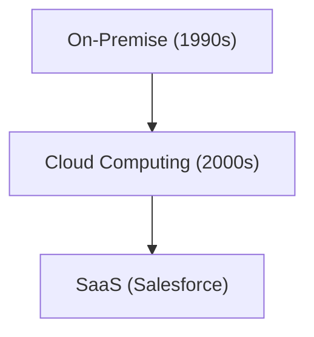

# Historia Corporativa: La Historia de Salesforce - Pionero de SaaS (Software en la Nube)

Salesforce es un pionero de SaaS.

## Evolución de la Computación en la Nube

## Modelo Matemático
El modelo de crecimiento de SaaS es el siguiente:
$$ R(t) = R_0 e^{kt} $$

## Parte de Verificación Técnica Adicional 1

En esta sección, profundizaremos en más detalles técnicos y estudios de casos. Evaluaremos el rendimiento bajo diversas condiciones y examinaremos los problemas y soluciones relacionados con la integración con otros sistemas. También consideraremos las perspectivas futuras y sus limitaciones.

