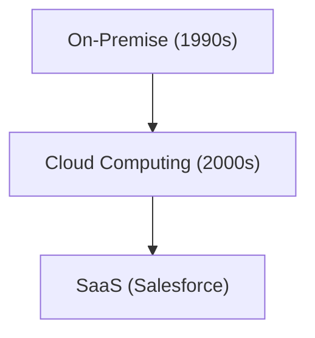

# Sejarah Perusahaan: Sejarah Salesforce - Pelopor SaaS (Perangkat Lunak Cloud)

Salesforce adalah pelopor SaaS.

## Evolusi Komputasi Cloud

## Model Matematika
Model pertumbuhan SaaS adalah sebagai berikut:
$$ R(t) = R_0 e^{kt} $$

## Bagian Verifikasi Teknologi Tambahan 1

Di bagian ini, kami mempelajari lebih dalam tentang detail teknis lebih lanjut dan studi kasus. Kami mengevaluasi performa dalam berbagai kondisi, serta mengkaji tantangan dan solusi terkait integrasi dengan sistem lain. Kami juga membahas prospek dan keterbatasan di masa depan.

