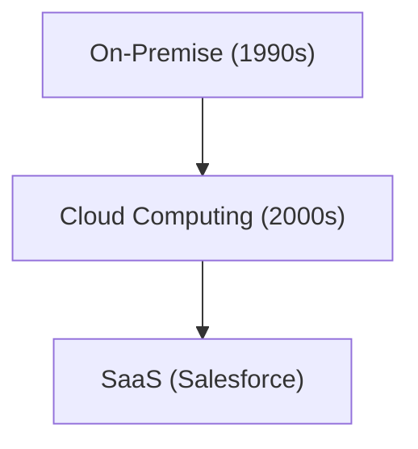

# 기업사: Salesforce의 역사 - SaaS(클라우드 소프트웨어)의 개척자

Salesforce는 SaaS의 개척자입니다.

## 클라우드 컴퓨팅의 진화

## 수학 모델
SaaS의 성장 모델은 다음과 같습니다：
$$ R(t) = R_0 e^{kt} $$

## 추가 기술 검증 파트 1

이 섹션에서는 더 깊은 기술적 세부 사항과 케이스 스터디에 대해 깊이 파고듭니다. 다양한 조건에서의 성능 평가 및 다른 시스템과의 통합과 관련된 과제 및 해결책을 검토합니다. 향후 전망과 한계에 대해서도 고찰합니다.

