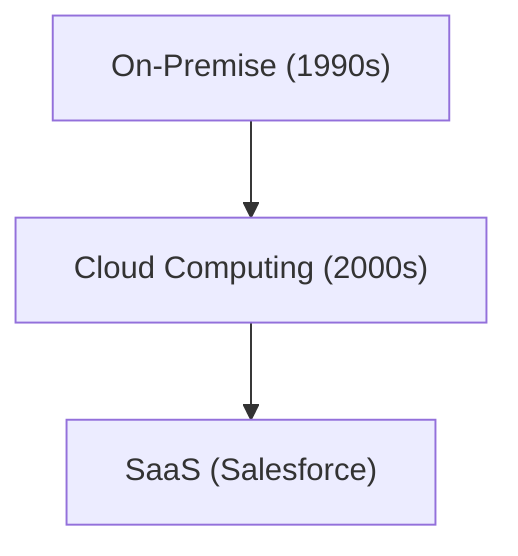

# 기업사: Salesforce의 역사 - SaaS(클라우드 소프트웨어)의 개척자

Salesforce는 SaaS의 개척자입니다.

## 클라우드 컴퓨팅의 진화

## 수학 모델
SaaS의 성장 모델은 다음과 같습니다：
$$ R(t) = R_0 e^{kt} $$

## 추가 기술 검증 파트 1

이 섹션에서는 더 깊은 기술적 세부 사항과 케이스 스터디에 대해 깊이 파고듭니다. 다양한 조건에서의 성능 평가 및 다른 시스템과의 통합과 관련된 과제 및 해결책을 검토합니다. 향후 전망과 한계에 대해서도 고찰합니다.

## 추가 기술 검증 파트 2

이 섹션에서는 더 깊은 기술적 세부 사항과 케이스 스터디에 대해 깊이 파고듭니다. 다양한 조건에서의 성능 평가 및 다른 시스템과의 통합과 관련된 과제 및 해결책을 검토합니다. 향후 전망과 한계에 대해서도 고찰합니다.

## 추가 기술 검증 파트 3

이 섹션에서는 더 깊은 기술적 세부 사항과 케이스 스터디에 대해 깊이 파고듭니다. 다양한 조건에서의 성능 평가 및 다른 시스템과의 통합과 관련된 과제 및 해결책을 검토합니다. 향후 전망과 한계에 대해서도 고찰합니다.

## 추가 기술 검증 파트 4

이 섹션에서는 더 깊은 기술적 세부 사항과 케이스 스터디에 대해 깊이 파고듭니다. 다양한 조건에서의 성능 평가 및 다른 시스템과의 통합과 관련된 과제 및 해결책을 검토합니다. 향후 전망과 한계에 대해서도 고찰합니다.

## 추가 기술 검증 파트 5

이 섹션에서는 더 깊은 기술적 세부 사항과 케이스 스터디에 대해 깊이 파고듭니다. 다양한 조건에서의 성능 평가 및 다른 시스템과의 통합과 관련된 과제 및 해결책을 검토합니다. 향후 전망과 한계에 대해서도 고찰합니다.

## 추가 기술 검증 파트 6

이 섹션에서는 더 깊은 기술적 세부 사항과 케이스 스터디에 대해 깊이 파고듭니다. 다양한 조건에서의 성능 평가 및 다른 시스템과의 통합과 관련된 과제 및 해결책을 검토합니다. 향후 전망과 한계에 대해서도 고찰합니다.

## 추가 기술 검증 파트 7

이 섹션에서는 더 깊은 기술적 세부 사항과 케이스 스터디에 대해 깊이 파고듭니다. 다양한 조건에서의 성능 평가 및 다른 시스템과의 통합과 관련된 과제 및 해결책을 검토합니다. 향후 전망과 한계에 대해서도 고찰합니다.

## 추가 기술 검증 파트 8

이 섹션에서는 더 깊은 기술적 세부 사항과 케이스 스터디에 대해 깊이 파고듭니다. 다양한 조건에서의 성능 평가 및 다른 시스템과의 통합과 관련된 과제 및 해결책을 검토합니다. 향후 전망과 한계에 대해서도 고찰합니다.

## 추가 기술 검증 파트 9

이 섹션에서는 더 깊은 기술적 세부 사항과 케이스 스터디에 대해 깊이 파고듭니다. 다양한 조건에서의 성능 평가 및 다른 시스템과의 통합과 관련된 과제 및 해결책을 검토합니다. 향후 전망과 한계에 대해서도 고찰합니다.

## 추가 기술 검증 파트 10

이 섹션에서는 더 깊은 기술적 세부 사항과 케이스 스터디에 대해 깊이 파고듭니다. 다양한 조건에서의 성능 평가 및 다른 시스템과의 통합과 관련된 과제 및 해결책을 검토합니다. 향후 전망과 한계에 대해서도 고찰합니다.

## 추가 기술 검증 파트 11

이 섹션에서는 더 깊은 기술적 세부 사항과 케이스 스터디에 대해 깊이 파고듭니다. 다양한 조건에서의 성능 평가 및 다른 시스템과의 통합과 관련된 과제 및 해결책을 검토합니다. 향후 전망과 한계에 대해서도 고찰합니다.

## 추가 기술 검증 파트 12

이 섹션에서는 더 깊은 기술적 세부 사항과 케이스 스터디에 대해 깊이 파고듭니다. 다양한 조건에서의 성능 평가 및 다른 시스템과의 통합과 관련된 과제 및 해결책을 검토합니다. 향후 전망과 한계에 대해서도 고찰합니다.

## 추가 기술 검증 파트 13

이 섹션에서는 더 깊은 기술적 세부 사항과 케이스 스터디에 대해 깊이 파고듭니다. 다양한 조건에서의 성능 평가 및 다른 시스템과의 통합과 관련된 과제 및 해결책을 검토합니다. 향후 전망과 한계에 대해서도 고찰합니다.

## 추가 기술 검증 파트 14

이 섹션에서는 더 깊은 기술적 세부 사항과 케이스 스터디에 대해 깊이 파고듭니다. 다양한 조건에서의 성능 평가 및 다른 시스템과의 통합과 관련된 과제 및 해결책을 검토합니다. 향후 전망과 한계에 대해서도 고찰합니다.

## 추가 기술 검증 파트 15

이 섹션에서는 더 깊은 기술적 세부 사항과 케이스 스터디에 대해 깊이 파고듭니다. 다양한 조건에서의 성능 평가 및 다른 시스템과의 통합과 관련된 과제 및 해결책을 검토합니다. 향후 전망과 한계에 대해서도 고찰합니다.

## 추가 기술 검증 파트 16

이 섹션에서는 더 깊은 기술적 세부 사항과 케이스 스터디에 대해 깊이 파고듭니다. 다양한 조건에서의 성능 평가 및 다른 시스템과의 통합과 관련된 과제 및 해결책을 검토합니다. 향후 전망과 한계에 대해서도 고찰합니다.

## 추가 기술 검증 파트 17

이 섹션에서는 더 깊은 기술적 세부 사항과 케이스 스터디에 대해 깊이 파고듭니다. 다양한 조건에서의 성능 평가 및 다른 시스템과의 통합과 관련된 과제 및 해결책을 검토합니다. 향후 전망과 한계에 대해서도 고찰합니다.

## 추가 기술 검증 파트 18

이 섹션에서는 더 깊은 기술적 세부 사항과 케이스 스터디에 대해 깊이 파고듭니다. 다양한 조건에서의 성능 평가 및 다른 시스템과의 통합과 관련된 과제 및 해결책을 검토합니다. 향후 전망과 한계에 대해서도 고찰합니다.

## 추가 기술 검증 파트 19

이 섹션에서는 더 깊은 기술적 세부 사항과 케이스 스터디에 대해 깊이 파고듭니다. 다양한 조건에서의 성능 평가 및 다른 시스템과의 통합과 관련된 과제 및 해결책을 검토합니다. 향후 전망과 한계에 대해서도 고찰합니다.

## 추가 기술 검증 파트 20

이 섹션에서는 더 깊은 기술적 세부 사항과 케이스 스터디에 대해 깊이 파고듭니다. 다양한 조건에서의 성능 평가 및 다른 시스템과의 통합과 관련된 과제 및 해결책을 검토합니다. 향후 전망과 한계에 대해서도 고찰합니다.

## 추가 기술 검증 파트 21

이 섹션에서는 더 깊은 기술적 세부 사항과 케이스 스터디에 대해 깊이 파고듭니다. 다양한 조건에서의 성능 평가 및 다른 시스템과의 통합과 관련된 과제 및 해결책을 검토합니다. 향후 전망과 한계에 대해서도 고찰합니다.

## 추가 기술 검증 파트 22

이 섹션에서는 더 깊은 기술적 세부 사항과 케이스 스터디에 대해 깊이 파고듭니다. 다양한 조건에서의 성능 평가 및 다른 시스템과의 통합과 관련된 과제 및 해결책을 검토합니다. 향후 전망과 한계에 대해서도 고찰합니다.

## 추가 기술 검증 파트 23

이 섹션에서는 더 깊은 기술적 세부 사항과 케이스 스터디에 대해 깊이 파고듭니다. 다양한 조건에서의 성능 평가 및 다른 시스템과의 통합과 관련된 과제 및 해결책을 검토합니다. 향후 전망과 한계에 대해서도 고찰합니다.

## 추가 기술 검증 파트 24

이 섹션에서는 더 깊은 기술적 세부 사항과 케이스 스터디에 대해 깊이 파고듭니다. 다양한 조건에서의 성능 평가 및 다른 시스템과의 통합과 관련된 과제 및 해결책을 검토합니다. 향후 전망과 한계에 대해서도 고찰합니다.

## 추가 기술 검증 파트 25

이 섹션에서는 더 깊은 기술적 세부 사항과 케이스 스터디에 대해 깊이 파고듭니다. 다양한 조건에서의 성능 평가 및 다른 시스템과의 통합과 관련된 과제 및 해결책을 검토합니다. 향후 전망과 한계에 대해서도 고찰합니다.

## 추가 기술 검증 파트 26

이 섹션에서는 더 깊은 기술적 세부 사항과 케이스 스터디에 대해 깊이 파고듭니다. 다양한 조건에서의 성능 평가 및 다른 시스템과의 통합과 관련된 과제 및 해결책을 검토합니다. 향후 전망과 한계에 대해서도 고찰합니다.

## 추가 기술 검증 파트 27

이 섹션에서는 더 깊은 기술적 세부 사항과 케이스 스터디에 대해 깊이 파고듭니다. 다양한 조건에서의 성능 평가 및 다른 시스템과의 통합과 관련된 과제 및 해결책을 검토합니다. 향후 전망과 한계에 대해서도 고찰합니다.

## 추가 기술 검증 파트 28

이 섹션에서는 더 깊은 기술적 세부 사항과 케이스 스터디에 대해 깊이 파고듭니다. 다양한 조건에서의 성능 평가 및 다른 시스템과의 통합과 관련된 과제 및 해결책을 검토합니다. 향후 전망과 한계에 대해서도 고찰합니다.

## 추가 기술 검증 파트 29

이 섹션에서는 더 깊은 기술적 세부 사항과 케이스 스터디에 대해 깊이 파고듭니다. 다양한 조건에서의 성능 평가 및 다른 시스템과의 통합과 관련된 과제 및 해결책을 검토합니다. 향후 전망과 한계에 대해서도 고찰합니다.

## 추가 기술 검증 파트 30

이 섹션에서는 더 깊은 기술적 세부 사항과 케이스 스터디에 대해 깊이 파고듭니다. 다양한 조건에서의 성능 평가 및 다른 시스템과의 통합과 관련된 과제 및 해결책을 검토합니다. 향후 전망과 한계에 대해서도 고찰합니다.

## 추가 기술 검증 파트 31

이 섹션에서는 더 깊은 기술적 세부 사항과 케이스 스터디에 대해 깊이 파고듭니다. 다양한 조건에서의 성능 평가 및 다른 시스템과의 통합과 관련된 과제 및 해결책을 검토합니다. 향후 전망과 한계에 대해서도 고찰합니다.

## 추가 기술 검증 파트 32

이 섹션에서는 더 깊은 기술적 세부 사항과 케이스 스터디에 대해 깊이 파고듭니다. 다양한 조건에서의 성능 평가 및 다른 시스템과의 통합과 관련된 과제 및 해결책을 검토합니다. 향후 전망과 한계에 대해서도 고찰합니다.

## 추가 기술 검증 파트 33

이 섹션에서는 더 깊은 기술적 세부 사항과 케이스 스터디에 대해 깊이 파고듭니다. 다양한 조건에서의 성능 평가 및 다른 시스템과의 통합과 관련된 과제 및 해결책을 검토합니다. 향후 전망과 한계에 대해서도 고찰합니다.

## 추가 기술 검증 파트 34

이 섹션에서는 더 깊은 기술적 세부 사항과 케이스 스터디에 대해 깊이 파고듭니다. 다양한 조건에서의 성능 평가 및 다른 시스템과의 통합과 관련된 과제 및 해결책을 검토합니다. 향후 전망과 한계에 대해서도 고찰합니다.

## 추가 기술 검증 파트 35

이 섹션에서는 더 깊은 기술적 세부 사항과 케이스 스터디에 대해 깊이 파고듭니다. 다양한 조건에서의 성능 평가 및 다른 시스템과의 통합과 관련된 과제 및 해결책을 검토합니다. 향후 전망과 한계에 대해서도 고찰합니다.

## 추가 기술 검증 파트 36

이 섹션에서는 더 깊은 기술적 세부 사항과 케이스 스터디에 대해 깊이 파고듭니다. 다양한 조건에서의 성능 평가 및 다른 시스템과의 통합과 관련된 과제 및 해결책을 검토합니다. 향후 전망과 한계에 대해서도 고찰합니다.

## 추가 기술 검증 파트 37

이 섹션에서는 더 깊은 기술적 세부 사항과 케이스 스터디에 대해 깊이 파고듭니다. 다양한 조건에서의 성능 평가 및 다른 시스템과의 통합과 관련된 과제 및 해결책을 검토합니다. 향후 전망과 한계에 대해서도 고찰합니다.

## 추가 기술 검증 파트 38

이 섹션에서는 더 깊은 기술적 세부 사항과 케이스 스터디에 대해 깊이 파고듭니다. 다양한 조건에서의 성능 평가 및 다른 시스템과의 통합과 관련된 과제 및 해결책을 검토합니다. 향후 전망과 한계에 대해서도 고찰합니다.

## 추가 기술 검증 파트 39

이 섹션에서는 더 깊은 기술적 세부 사항과 케이스 스터디에 대해 깊이 파고듭니다. 다양한 조건에서의 성능 평가 및 다른 시스템과의 통합과 관련된 과제 및 해결책을 검토합니다. 향후 전망과 한계에 대해서도 고찰합니다.

## 추가 기술 검증 파트 40

이 섹션에서는 더 깊은 기술적 세부 사항과 케이스 스터디에 대해 깊이 파고듭니다. 다양한 조건에서의 성능 평가 및 다른 시스템과의 통합과 관련된 과제 및 해결책을 검토합니다. 향후 전망과 한계에 대해서도 고찰합니다.

## 추가 기술 검증 파트 41

이 섹션에서는 더 깊은 기술적 세부 사항과 케이스 스터디에 대해 깊이 파고듭니다. 다양한 조건에서의 성능 평가 및 다른 시스템과의 통합과 관련된 과제 및 해결책을 검토합니다. 향후 전망과 한계에 대해서도 고찰합니다.

## 추가 기술 검증 파트 42

이 섹션에서는 더 깊은 기술적 세부 사항과 케이스 스터디에 대해 깊이 파고듭니다. 다양한 조건에서의 성능 평가 및 다른 시스템과의 통합과 관련된 과제 및 해결책을 검토합니다. 향후 전망과 한계에 대해서도 고찰합니다.

## 추가 기술 검증 파트 43

이 섹션에서는 더 깊은 기술적 세부 사항과 케이스 스터디에 대해 깊이 파고듭니다. 다양한 조건에서의 성능 평가 및 다른 시스템과의 통합과 관련된 과제 및 해결책을 검토합니다. 향후 전망과 한계에 대해서도 고찰합니다.

## 추가 기술 검증 파트 44

이 섹션에서는 더 깊은 기술적 세부 사항과 케이스 스터디에 대해 깊이 파고듭니다. 다양한 조건에서의 성능 평가 및 다른 시스템과의 통합과 관련된 과제 및 해결책을 검토합니다. 향후 전망과 한계에 대해서도 고찰합니다.

## 추가 기술 검증 파트 45

이 섹션에서는 더 깊은 기술적 세부 사항과 케이스 스터디에 대해 깊이 파고듭니다. 다양한 조건에서의 성능 평가 및 다른 시스템과의 통합과 관련된 과제 및 해결책을 검토합니다. 향후 전망과 한계에 대해서도 고찰합니다.

## 추가 기술 검증 파트 46

이 섹션에서는 더 깊은 기술적 세부 사항과 케이스 스터디에 대해 깊이 파고듭니다. 다양한 조건에서의 성능 평가 및 다른 시스템과의 통합과 관련된 과제 및 해결책을 검토합니다. 향후 전망과 한계에 대해서도 고찰합니다.

## 추가 기술 검증 파트 47

이 섹션에서는 더 깊은 기술적 세부 사항과 케이스 스터디에 대해 깊이 파고듭니다. 다양한 조건에서의 성능 평가 및 다른 시스템과의 통합과 관련된 과제 및 해결책을 검토합니다. 향후 전망과 한계에 대해서도 고찰합니다.

## 추가 기술 검증 파트 48

이 섹션에서는 더 깊은 기술적 세부 사항과 케이스 스터디에 대해 깊이 파고듭니다. 다양한 조건에서의 성능 평가 및 다른 시스템과의 통합과 관련된 과제 및 해결책을 검토합니다. 향후 전망과 한계에 대해서도 고찰합니다.

## 추가 기술 검증 파트 49

이 섹션에서는 더 깊은 기술적 세부 사항과 케이스 스터디에 대해 깊이 파고듭니다. 다양한 조건에서의 성능 평가 및 다른 시스템과의 통합과 관련된 과제 및 해결책을 검토합니다. 향후 전망과 한계에 대해서도 고찰합니다.

## 추가 기술 검증 파트 50

이 섹션에서는 더 깊은 기술적 세부 사항과 케이스 스터디에 대해 깊이 파고듭니다. 다양한 조건에서의 성능 평가 및 다른 시스템과의 통합과 관련된 과제 및 해결책을 검토합니다. 향후 전망과 한계에 대해서도 고찰합니다.

## 추가 기술 검증 파트 51

이 섹션에서는 더 깊은 기술적 세부 사항과 케이스 스터디에 대해 깊이 파고듭니다. 다양한 조건에서의 성능 평가 및 다른 시스템과의 통합과 관련된 과제 및 해결책을 검토합니다. 향후 전망과 한계에 대해서도 고찰합니다.

## 추가 기술 검증 파트 52

이 섹션에서는 더 깊은 기술적 세부 사항과 케이스 스터디에 대해 깊이 파고듭니다. 다양한 조건에서의 성능 평가 및 다른 시스템과의 통합과 관련된 과제 및 해결책을 검토합니다. 향후 전망과 한계에 대해서도 고찰합니다.

## 추가 기술 검증 파트 53

이 섹션에서는 더 깊은 기술적 세부 사항과 케이스 스터디에 대해 깊이 파고듭니다. 다양한 조건에서의 성능 평가 및 다른 시스템과의 통합과 관련된 과제 및 해결책을 검토합니다. 향후 전망과 한계에 대해서도 고찰합니다.

## 추가 기술 검증 파트 54

이 섹션에서는 더 깊은 기술적 세부 사항과 케이스 스터디에 대해 깊이 파고듭니다. 다양한 조건에서의 성능 평가 및 다른 시스템과의 통합과 관련된 과제 및 해결책을 검토합니다. 향후 전망과 한계에 대해서도 고찰합니다.

## 추가 기술 검증 파트 55

이 섹션에서는 더 깊은 기술적 세부 사항과 케이스 스터디에 대해 깊이 파고듭니다. 다양한 조건에서의 성능 평가 및 다른 시스템과의 통합과 관련된 과제 및 해결책을 검토합니다. 향후 전망과 한계에 대해서도 고찰합니다.

## 추가 기술 검증 파트 56

이 섹션에서는 더 깊은 기술적 세부 사항과 케이스 스터디에 대해 깊이 파고듭니다. 다양한 조건에서의 성능 평가 및 다른 시스템과의 통합과 관련된 과제 및 해결책을 검토합니다. 향후 전망과 한계에 대해서도 고찰합니다.

## 추가 기술 검증 파트 57

이 섹션에서는 더 깊은 기술적 세부 사항과 케이스 스터디에 대해 깊이 파고듭니다. 다양한 조건에서의 성능 평가 및 다른 시스템과의 통합과 관련된 과제 및 해결책을 검토합니다. 향후 전망과 한계에 대해서도 고찰합니다.

## 추가 기술 검증 파트 58

이 섹션에서는 더 깊은 기술적 세부 사항과 케이스 스터디에 대해 깊이 파고듭니다. 다양한 조건에서의 성능 평가 및 다른 시스템과의 통합과 관련된 과제 및 해결책을 검토합니다. 향후 전망과 한계에 대해서도 고찰합니다.

## 추가 기술 검증 파트 59

이 섹션에서는 더 깊은 기술적 세부 사항과 케이스 스터디에 대해 깊이 파고듭니다. 다양한 조건에서의 성능 평가 및 다른 시스템과의 통합과 관련된 과제 및 해결책을 검토합니다. 향후 전망과 한계에 대해서도 고찰합니다.

## 추가 기술 검증 파트 60

이 섹션에서는 더 깊은 기술적 세부 사항과 케이스 스터디에 대해 깊이 파고듭니다. 다양한 조건에서의 성능 평가 및 다른 시스템과의 통합과 관련된 과제 및 해결책을 검토합니다. 향후 전망과 한계에 대해서도 고찰합니다.

## 추가 기술 검증 파트 61

이 섹션에서는 더 깊은 기술적 세부 사항과 케이스 스터디에 대해 깊이 파고듭니다. 다양한 조건에서의 성능 평가 및 다른 시스템과의 통합과 관련된 과제 및 해결책을 검토합니다. 향후 전망과 한계에 대해서도 고찰합니다.

## 추가 기술 검증 파트 62

이 섹션에서는 더 깊은 기술적 세부 사항과 케이스 스터디에 대해 깊이 파고듭니다. 다양한 조건에서의 성능 평가 및 다른 시스템과의 통합과 관련된 과제 및 해결책을 검토합니다. 향후 전망과 한계에 대해서도 고찰합니다.

## 추가 기술 검증 파트 63

이 섹션에서는 더 깊은 기술적 세부 사항과 케이스 스터디에 대해 깊이 파고듭니다. 다양한 조건에서의 성능 평가 및 다른 시스템과의 통합과 관련된 과제 및 해결책을 검토합니다. 향후 전망과 한계에 대해서도 고찰합니다.

## 추가 기술 검증 파트 64

이 섹션에서는 더 깊은 기술적 세부 사항과 케이스 스터디에 대해 깊이 파고듭니다. 다양한 조건에서의 성능 평가 및 다른 시스템과의 통합과 관련된 과제 및 해결책을 검토합니다. 향후 전망과 한계에 대해서도 고찰합니다.

## 추가 기술 검증 파트 65

이 섹션에서는 더 깊은 기술적 세부 사항과 케이스 스터디에 대해 깊이 파고듭니다. 다양한 조건에서의 성능 평가 및 다른 시스템과의 통합과 관련된 과제 및 해결책을 검토합니다. 향후 전망과 한계에 대해서도 고찰합니다.

## 추가 기술 검증 파트 66

이 섹션에서는 더 깊은 기술적 세부 사항과 케이스 스터디에 대해 깊이 파고듭니다. 다양한 조건에서의 성능 평가 및 다른 시스템과의 통합과 관련된 과제 및 해결책을 검토합니다. 향후 전망과 한계에 대해서도 고찰합니다.

## 추가 기술 검증 파트 67

이 섹션에서는 더 깊은 기술적 세부 사항과 케이스 스터디에 대해 깊이 파고듭니다. 다양한 조건에서의 성능 평가 및 다른 시스템과의 통합과 관련된 과제 및 해결책을 검토합니다. 향후 전망과 한계에 대해서도 고찰합니다.

## 추가 기술 검증 파트 68

이 섹션에서는 더 깊은 기술적 세부 사항과 케이스 스터디에 대해 깊이 파고듭니다. 다양한 조건에서의 성능 평가 및 다른 시스템과의 통합과 관련된 과제 및 해결책을 검토합니다. 향후 전망과 한계에 대해서도 고찰합니다.

## 추가 기술 검증 파트 69

이 섹션에서는 더 깊은 기술적 세부 사항과 케이스 스터디에 대해 깊이 파고듭니다. 다양한 조건에서의 성능 평가 및 다른 시스템과의 통합과 관련된 과제 및 해결책을 검토합니다. 향후 전망과 한계에 대해서도 고찰합니다.

## 추가 기술 검증 파트 70

이 섹션에서는 더 깊은 기술적 세부 사항과 케이스 스터디에 대해 깊이 파고듭니다. 다양한 조건에서의 성능 평가 및 다른 시스템과의 통합과 관련된 과제 및 해결책을 검토합니다. 향후 전망과 한계에 대해서도 고찰합니다.

## 추가 기술 검증 파트 71

이 섹션에서는 더 깊은 기술적 세부 사항과 케이스 스터디에 대해 깊이 파고듭니다. 다양한 조건에서의 성능 평가 및 다른 시스템과의 통합과 관련된 과제 및 해결책을 검토합니다. 향후 전망과 한계에 대해서도 고찰합니다.

## 추가 기술 검증 파트 72

이 섹션에서는 더 깊은 기술적 세부 사항과 케이스 스터디에 대해 깊이 파고듭니다. 다양한 조건에서의 성능 평가 및 다른 시스템과의 통합과 관련된 과제 및 해결책을 검토합니다. 향후 전망과 한계에 대해서도 고찰합니다.

## 추가 기술 검증 파트 73

이 섹션에서는 더 깊은 기술적 세부 사항과 케이스 스터디에 대해 깊이 파고듭니다. 다양한 조건에서의 성능 평가 및 다른 시스템과의 통합과 관련된 과제 및 해결책을 검토합니다. 향후 전망과 한계에 대해서도 고찰합니다.

## 추가 기술 검증 파트 74

이 섹션에서는 더 깊은 기술적 세부 사항과 케이스 스터디에 대해 깊이 파고듭니다. 다양한 조건에서의 성능 평가 및 다른 시스템과의 통합과 관련된 과제 및 해결책을 검토합니다. 향후 전망과 한계에 대해서도 고찰합니다.

## 추가 기술 검증 파트 75

이 섹션에서는 더 깊은 기술적 세부 사항과 케이스 스터디에 대해 깊이 파고듭니다. 다양한 조건에서의 성능 평가 및 다른 시스템과의 통합과 관련된 과제 및 해결책을 검토합니다. 향후 전망과 한계에 대해서도 고찰합니다.

## 추가 기술 검증 파트 76

이 섹션에서는 더 깊은 기술적 세부 사항과 케이스 스터디에 대해 깊이 파고듭니다. 다양한 조건에서의 성능 평가 및 다른 시스템과의 통합과 관련된 과제 및 해결책을 검토합니다. 향후 전망과 한계에 대해서도 고찰합니다.

## 추가 기술 검증 파트 77

이 섹션에서는 더 깊은 기술적 세부 사항과 케이스 스터디에 대해 깊이 파고듭니다. 다양한 조건에서의 성능 평가 및 다른 시스템과의 통합과 관련된 과제 및 해결책을 검토합니다. 향후 전망과 한계에 대해서도 고찰합니다.

## 추가 기술 검증 파트 78

이 섹션에서는 더 깊은 기술적 세부 사항과 케이스 스터디에 대해 깊이 파고듭니다. 다양한 조건에서의 성능 평가 및 다른 시스템과의 통합과 관련된 과제 및 해결책을 검토합니다. 향후 전망과 한계에 대해서도 고찰합니다.

## 추가 기술 검증 파트 79

이 섹션에서는 더 깊은 기술적 세부 사항과 케이스 스터디에 대해 깊이 파고듭니다. 다양한 조건에서의 성능 평가 및 다른 시스템과의 통합과 관련된 과제 및 해결책을 검토합니다. 향후 전망과 한계에 대해서도 고찰합니다.

## 추가 기술 검증 파트 80

이 섹션에서는 더 깊은 기술적 세부 사항과 케이스 스터디에 대해 깊이 파고듭니다. 다양한 조건에서의 성능 평가 및 다른 시스템과의 통합과 관련된 과제 및 해결책을 검토합니다. 향후 전망과 한계에 대해서도 고찰합니다.

## 추가 기술 검증 파트 81

이 섹션에서는 더 깊은 기술적 세부 사항과 케이스 스터디에 대해 깊이 파고듭니다. 다양한 조건에서의 성능 평가 및 다른 시스템과의 통합과 관련된 과제 및 해결책을 검토합니다. 향후 전망과 한계에 대해서도 고찰합니다.

## 추가 기술 검증 파트 82

이 섹션에서는 더 깊은 기술적 세부 사항과 케이스 스터디에 대해 깊이 파고듭니다. 다양한 조건에서의 성능 평가 및 다른 시스템과의 통합과 관련된 과제 및 해결책을 검토합니다. 향후 전망과 한계에 대해서도 고찰합니다.

## 추가 기술 검증 파트 83

이 섹션에서는 더 깊은 기술적 세부 사항과 케이스 스터디에 대해 깊이 파고듭니다. 다양한 조건에서의 성능 평가 및 다른 시스템과의 통합과 관련된 과제 및 해결책을 검토합니다. 향후 전망과 한계에 대해서도 고찰합니다.

## 추가 기술 검증 파트 84

이 섹션에서는 더 깊은 기술적 세부 사항과 케이스 스터디에 대해 깊이 파고듭니다. 다양한 조건에서의 성능 평가 및 다른 시스템과의 통합과 관련된 과제 및 해결책을 검토합니다. 향후 전망과 한계에 대해서도 고찰합니다.

## 추가 기술 검증 파트 85

이 섹션에서는 더 깊은 기술적 세부 사항과 케이스 스터디에 대해 깊이 파고듭니다. 다양한 조건에서의 성능 평가 및 다른 시스템과의 통합과 관련된 과제 및 해결책을 검토합니다. 향후 전망과 한계에 대해서도 고찰합니다.

## 추가 기술 검증 파트 86

이 섹션에서는 더 깊은 기술적 세부 사항과 케이스 스터디에 대해 깊이 파고듭니다. 다양한 조건에서의 성능 평가 및 다른 시스템과의 통합과 관련된 과제 및 해결책을 검토합니다. 향후 전망과 한계에 대해서도 고찰합니다.

## 추가 기술 검증 파트 87

이 섹션에서는 더 깊은 기술적 세부 사항과 케이스 스터디에 대해 깊이 파고듭니다. 다양한 조건에서의 성능 평가 및 다른 시스템과의 통합과 관련된 과제 및 해결책을 검토합니다. 향후 전망과 한계에 대해서도 고찰합니다.

## 추가 기술 검증 파트 88

이 섹션에서는 더 깊은 기술적 세부 사항과 케이스 스터디에 대해 깊이 파고듭니다. 다양한 조건에서의 성능 평가 및 다른 시스템과의 통합과 관련된 과제 및 해결책을 검토합니다. 향후 전망과 한계에 대해서도 고찰합니다.

## 추가 기술 검증 파트 89

이 섹션에서는 더 깊은 기술적 세부 사항과 케이스 스터디에 대해 깊이 파고듭니다. 다양한 조건에서의 성능 평가 및 다른 시스템과의 통합과 관련된 과제 및 해결책을 검토합니다. 향후 전망과 한계에 대해서도 고찰합니다.

## 추가 기술 검증 파트 90

이 섹션에서는 더 깊은 기술적 세부 사항과 케이스 스터디에 대해 깊이 파고듭니다. 다양한 조건에서의 성능 평가 및 다른 시스템과의 통합과 관련된 과제 및 해결책을 검토합니다. 향후 전망과 한계에 대해서도 고찰합니다.

## 추가 기술 검증 파트 91

이 섹션에서는 더 깊은 기술적 세부 사항과 케이스 스터디에 대해 깊이 파고듭니다. 다양한 조건에서의 성능 평가 및 다른 시스템과의 통합과 관련된 과제 및 해결책을 검토합니다. 향후 전망과 한계에 대해서도 고찰합니다.

## 추가 기술 검증 파트 92

이 섹션에서는 더 깊은 기술적 세부 사항과 케이스 스터디에 대해 깊이 파고듭니다. 다양한 조건에서의 성능 평가 및 다른 시스템과의 통합과 관련된 과제 및 해결책을 검토합니다. 향후 전망과 한계에 대해서도 고찰합니다.

## 추가 기술 검증 파트 93

이 섹션에서는 더 깊은 기술적 세부 사항과 케이스 스터디에 대해 깊이 파고듭니다. 다양한 조건에서의 성능 평가 및 다른 시스템과의 통합과 관련된 과제 및 해결책을 검토합니다. 향후 전망과 한계에 대해서도 고찰합니다.

## 추가 기술 검증 파트 94

이 섹션에서는 더 깊은 기술적 세부 사항과 케이스 스터디에 대해 깊이 파고듭니다. 다양한 조건에서의 성능 평가 및 다른 시스템과의 통합과 관련된 과제 및 해결책을 검토합니다. 향후 전망과 한계에 대해서도 고찰합니다.

## 추가 기술 검증 파트 95

이 섹션에서는 더 깊은 기술적 세부 사항과 케이스 스터디에 대해 깊이 파고듭니다. 다양한 조건에서의 성능 평가 및 다른 시스템과의 통합과 관련된 과제 및 해결책을 검토합니다. 향후 전망과 한계에 대해서도 고찰합니다.

## 추가 기술 검증 파트 96

이 섹션에서는 더 깊은 기술적 세부 사항과 케이스 스터디에 대해 깊이 파고듭니다. 다양한 조건에서의 성능 평가 및 다른 시스템과의 통합과 관련된 과제 및 해결책을 검토합니다. 향후 전망과 한계에 대해서도 고찰합니다.

## 추가 기술 검증 파트 97

이 섹션에서는 더 깊은 기술적 세부 사항과 케이스 스터디에 대해 깊이 파고듭니다. 다양한 조건에서의 성능 평가 및 다른 시스템과의 통합과 관련된 과제 및 해결책을 검토합니다. 향후 전망과 한계에 대해서도 고찰합니다.

## 추가 기술 검증 파트 98

이 섹션에서는 더 깊은 기술적 세부 사항과 케이스 스터디에 대해 깊이 파고듭니다. 다양한 조건에서의 성능 평가 및 다른 시스템과의 통합과 관련된 과제 및 해결책을 검토합니다. 향후 전망과 한계에 대해서도 고찰합니다.

## 추가 기술 검증 파트 99

이 섹션에서는 더 깊은 기술적 세부 사항과 케이스 스터디에 대해 깊이 파고듭니다. 다양한 조건에서의 성능 평가 및 다른 시스템과의 통합과 관련된 과제 및 해결책을 검토합니다. 향후 전망과 한계에 대해서도 고찰합니다.

## 추가 기술 검증 파트 100

이 섹션에서는 더 깊은 기술적 세부 사항과 케이스 스터디에 대해 깊이 파고듭니다. 다양한 조건에서의 성능 평가 및 다른 시스템과의 통합과 관련된 과제 및 해결책을 검토합니다. 향후 전망과 한계에 대해서도 고찰합니다.

## 추가 기술 검증 파트 101

이 섹션에서는 더 깊은 기술적 세부 사항과 케이스 스터디에 대해 깊이 파고듭니다. 다양한 조건에서의 성능 평가 및 다른 시스템과의 통합과 관련된 과제 및 해결책을 검토합니다. 향후 전망과 한계에 대해서도 고찰합니다.

## 추가 기술 검증 파트 102

이 섹션에서는 더 깊은 기술적 세부 사항과 케이스 스터디에 대해 깊이 파고듭니다. 다양한 조건에서의 성능 평가 및 다른 시스템과의 통합과 관련된 과제 및 해결책을 검토합니다. 향후 전망과 한계에 대해서도 고찰합니다.

## 추가 기술 검증 파트 103

이 섹션에서는 더 깊은 기술적 세부 사항과 케이스 스터디에 대해 깊이 파고듭니다. 다양한 조건에서의 성능 평가 및 다른 시스템과의 통합과 관련된 과제 및 해결책을 검토합니다. 향후 전망과 한계에 대해서도 고찰합니다.

## 추가 기술 검증 파트 104

이 섹션에서는 더 깊은 기술적 세부 사항과 케이스 스터디에 대해 깊이 파고듭니다. 다양한 조건에서의 성능 평가 및 다른 시스템과의 통합과 관련된 과제 및 해결책을 검토합니다. 향후 전망과 한계에 대해서도 고찰합니다.

## 추가 기술 검증 파트 105

이 섹션에서는 더 깊은 기술적 세부 사항과 케이스 스터디에 대해 깊이 파고듭니다. 다양한 조건에서의 성능 평가 및 다른 시스템과의 통합과 관련된 과제 및 해결책을 검토합니다. 향후 전망과 한계에 대해서도 고찰합니다.

## 추가 기술 검증 파트 106

이 섹션에서는 더 깊은 기술적 세부 사항과 케이스 스터디에 대해 깊이 파고듭니다. 다양한 조건에서의 성능 평가 및 다른 시스템과의 통합과 관련된 과제 및 해결책을 검토합니다. 향후 전망과 한계에 대해서도 고찰합니다.

## 추가 기술 검증 파트 107

이 섹션에서는 더 깊은 기술적 세부 사항과 케이스 스터디에 대해 깊이 파고듭니다. 다양한 조건에서의 성능 평가 및 다른 시스템과의 통합과 관련된 과제 및 해결책을 검토합니다. 향후 전망과 한계에 대해서도 고찰합니다.

## 추가 기술 검증 파트 108

이 섹션에서는 더 깊은 기술적 세부 사항과 케이스 스터디에 대해 깊이 파고듭니다. 다양한 조건에서의 성능 평가 및 다른 시스템과의 통합과 관련된 과제 및 해결책을 검토합니다. 향후 전망과 한계에 대해서도 고찰합니다.

## 추가 기술 검증 파트 109

이 섹션에서는 더 깊은 기술적 세부 사항과 케이스 스터디에 대해 깊이 파고듭니다. 다양한 조건에서의 성능 평가 및 다른 시스템과의 통합과 관련된 과제 및 해결책을 검토합니다. 향후 전망과 한계에 대해서도 고찰합니다.

## 추가 기술 검증 파트 110

이 섹션에서는 더 깊은 기술적 세부 사항과 케이스 스터디에 대해 깊이 파고듭니다. 다양한 조건에서의 성능 평가 및 다른 시스템과의 통합과 관련된 과제 및 해결책을 검토합니다. 향후 전망과 한계에 대해서도 고찰합니다.

## 추가 기술 검증 파트 111

이 섹션에서는 더 깊은 기술적 세부 사항과 케이스 스터디에 대해 깊이 파고듭니다. 다양한 조건에서의 성능 평가 및 다른 시스템과의 통합과 관련된 과제 및 해결책을 검토합니다. 향후 전망과 한계에 대해서도 고찰합니다.

## 추가 기술 검증 파트 112

이 섹션에서는 더 깊은 기술적 세부 사항과 케이스 스터디에 대해 깊이 파고듭니다. 다양한 조건에서의 성능 평가 및 다른 시스템과의 통합과 관련된 과제 및 해결책을 검토합니다. 향후 전망과 한계에 대해서도 고찰합니다.

## 추가 기술 검증 파트 113

이 섹션에서는 더 깊은 기술적 세부 사항과 케이스 스터디에 대해 깊이 파고듭니다. 다양한 조건에서의 성능 평가 및 다른 시스템과의 통합과 관련된 과제 및 해결책을 검토합니다. 향후 전망과 한계에 대해서도 고찰합니다.

## 추가 기술 검증 파트 114

이 섹션에서는 더 깊은 기술적 세부 사항과 케이스 스터디에 대해 깊이 파고듭니다. 다양한 조건에서의 성능 평가 및 다른 시스템과의 통합과 관련된 과제 및 해결책을 검토합니다. 향후 전망과 한계에 대해서도 고찰합니다.

## 추가 기술 검증 파트 115

이 섹션에서는 더 깊은 기술적 세부 사항과 케이스 스터디에 대해 깊이 파고듭니다. 다양한 조건에서의 성능 평가 및 다른 시스템과의 통합과 관련된 과제 및 해결책을 검토합니다. 향후 전망과 한계에 대해서도 고찰합니다.

## 추가 기술 검증 파트 116

이 섹션에서는 더 깊은 기술적 세부 사항과 케이스 스터디에 대해 깊이 파고듭니다. 다양한 조건에서의 성능 평가 및 다른 시스템과의 통합과 관련된 과제 및 해결책을 검토합니다. 향후 전망과 한계에 대해서도 고찰합니다.

## 추가 기술 검증 파트 117

이 섹션에서는 더 깊은 기술적 세부 사항과 케이스 스터디에 대해 깊이 파고듭니다. 다양한 조건에서의 성능 평가 및 다른 시스템과의 통합과 관련된 과제 및 해결책을 검토합니다. 향후 전망과 한계에 대해서도 고찰합니다.

## 추가 기술 검증 파트 118

이 섹션에서는 더 깊은 기술적 세부 사항과 케이스 스터디에 대해 깊이 파고듭니다. 다양한 조건에서의 성능 평가 및 다른 시스템과의 통합과 관련된 과제 및 해결책을 검토합니다. 향후 전망과 한계에 대해서도 고찰합니다.

## 추가 기술 검증 파트 119

이 섹션에서는 더 깊은 기술적 세부 사항과 케이스 스터디에 대해 깊이 파고듭니다. 다양한 조건에서의 성능 평가 및 다른 시스템과의 통합과 관련된 과제 및 해결책을 검토합니다. 향후 전망과 한계에 대해서도 고찰합니다.

## 추가 기술 검증 파트 120

이 섹션에서는 더 깊은 기술적 세부 사항과 케이스 스터디에 대해 깊이 파고듭니다. 다양한 조건에서의 성능 평가 및 다른 시스템과의 통합과 관련된 과제 및 해결책을 검토합니다. 향후 전망과 한계에 대해서도 고찰합니다.

## 추가 기술 검증 파트 121

이 섹션에서는 더 깊은 기술적 세부 사항과 케이스 스터디에 대해 깊이 파고듭니다. 다양한 조건에서의 성능 평가 및 다른 시스템과의 통합과 관련된 과제 및 해결책을 검토합니다. 향후 전망과 한계에 대해서도 고찰합니다.

## 추가 기술 검증 파트 122

이 섹션에서는 더 깊은 기술적 세부 사항과 케이스 스터디에 대해 깊이 파고듭니다. 다양한 조건에서의 성능 평가 및 다른 시스템과의 통합과 관련된 과제 및 해결책을 검토합니다. 향후 전망과 한계에 대해서도 고찰합니다.

## 추가 기술 검증 파트 123

이 섹션에서는 더 깊은 기술적 세부 사항과 케이스 스터디에 대해 깊이 파고듭니다. 다양한 조건에서의 성능 평가 및 다른 시스템과의 통합과 관련된 과제 및 해결책을 검토합니다. 향후 전망과 한계에 대해서도 고찰합니다.

## 추가 기술 검증 파트 124

이 섹션에서는 더 깊은 기술적 세부 사항과 케이스 스터디에 대해 깊이 파고듭니다. 다양한 조건에서의 성능 평가 및 다른 시스템과의 통합과 관련된 과제 및 해결책을 검토합니다. 향후 전망과 한계에 대해서도 고찰합니다.

## 추가 기술 검증 파트 125

이 섹션에서는 더 깊은 기술적 세부 사항과 케이스 스터디에 대해 깊이 파고듭니다. 다양한 조건에서의 성능 평가 및 다른 시스템과의 통합과 관련된 과제 및 해결책을 검토합니다. 향후 전망과 한계에 대해서도 고찰합니다.

## 추가 기술 검증 파트 126

이 섹션에서는 더 깊은 기술적 세부 사항과 케이스 스터디에 대해 깊이 파고듭니다. 다양한 조건에서의 성능 평가 및 다른 시스템과의 통합과 관련된 과제 및 해결책을 검토합니다. 향후 전망과 한계에 대해서도 고찰합니다.

## 추가 기술 검증 파트 127

이 섹션에서는 더 깊은 기술적 세부 사항과 케이스 스터디에 대해 깊이 파고듭니다. 다양한 조건에서의 성능 평가 및 다른 시스템과의 통합과 관련된 과제 및 해결책을 검토합니다. 향후 전망과 한계에 대해서도 고찰합니다.

## 추가 기술 검증 파트 128

이 섹션에서는 더 깊은 기술적 세부 사항과 케이스 스터디에 대해 깊이 파고듭니다. 다양한 조건에서의 성능 평가 및 다른 시스템과의 통합과 관련된 과제 및 해결책을 검토합니다. 향후 전망과 한계에 대해서도 고찰합니다.

## 추가 기술 검증 파트 129

이 섹션에서는 더 깊은 기술적 세부 사항과 케이스 스터디에 대해 깊이 파고듭니다. 다양한 조건에서의 성능 평가 및 다른 시스템과의 통합과 관련된 과제 및 해결책을 검토합니다. 향후 전망과 한계에 대해서도 고찰합니다.

## 추가 기술 검증 파트 130

이 섹션에서는 더 깊은 기술적 세부 사항과 케이스 스터디에 대해 깊이 파고듭니다. 다양한 조건에서의 성능 평가 및 다른 시스템과의 통합과 관련된 과제 및 해결책을 검토합니다. 향후 전망과 한계에 대해서도 고찰합니다.

## 추가 기술 검증 파트 131

이 섹션에서는 더 깊은 기술적 세부 사항과 케이스 스터디에 대해 깊이 파고듭니다. 다양한 조건에서의 성능 평가 및 다른 시스템과의 통합과 관련된 과제 및 해결책을 검토합니다. 향후 전망과 한계에 대해서도 고찰합니다.

## 추가 기술 검증 파트 132

이 섹션에서는 더 깊은 기술적 세부 사항과 케이스 스터디에 대해 깊이 파고듭니다. 다양한 조건에서의 성능 평가 및 다른 시스템과의 통합과 관련된 과제 및 해결책을 검토합니다. 향후 전망과 한계에 대해서도 고찰합니다.

## 추가 기술 검증 파트 133

이 섹션에서는 더 깊은 기술적 세부 사항과 케이스 스터디에 대해 깊이 파고듭니다. 다양한 조건에서의 성능 평가 및 다른 시스템과의 통합과 관련된 과제 및 해결책을 검토합니다. 향후 전망과 한계에 대해서도 고찰합니다.

## 추가 기술 검증 파트 134

이 섹션에서는 더 깊은 기술적 세부 사항과 케이스 스터디에 대해 깊이 파고듭니다. 다양한 조건에서의 성능 평가 및 다른 시스템과의 통합과 관련된 과제 및 해결책을 검토합니다. 향후 전망과 한계에 대해서도 고찰합니다.

## 추가 기술 검증 파트 135

이 섹션에서는 더 깊은 기술적 세부 사항과 케이스 스터디에 대해 깊이 파고듭니다. 다양한 조건에서의 성능 평가 및 다른 시스템과의 통합과 관련된 과제 및 해결책을 검토합니다. 향후 전망과 한계에 대해서도 고찰합니다.

## 추가 기술 검증 파트 136

이 섹션에서는 더 깊은 기술적 세부 사항과 케이스 스터디에 대해 깊이 파고듭니다. 다양한 조건에서의 성능 평가 및 다른 시스템과의 통합과 관련된 과제 및 해결책을 검토합니다. 향후 전망과 한계에 대해서도 고찰합니다.

## 추가 기술 검증 파트 137

이 섹션에서는 더 깊은 기술적 세부 사항과 케이스 스터디에 대해 깊이 파고듭니다. 다양한 조건에서의 성능 평가 및 다른 시스템과의 통합과 관련된 과제 및 해결책을 검토합니다. 향후 전망과 한계에 대해서도 고찰합니다.

## 추가 기술 검증 파트 138

이 섹션에서는 더 깊은 기술적 세부 사항과 케이스 스터디에 대해 깊이 파고듭니다. 다양한 조건에서의 성능 평가 및 다른 시스템과의 통합과 관련된 과제 및 해결책을 검토합니다. 향후 전망과 한계에 대해서도 고찰합니다.

## 추가 기술 검증 파트 139

이 섹션에서는 더 깊은 기술적 세부 사항과 케이스 스터디에 대해 깊이 파고듭니다. 다양한 조건에서의 성능 평가 및 다른 시스템과의 통합과 관련된 과제 및 해결책을 검토합니다. 향후 전망과 한계에 대해서도 고찰합니다.

## 추가 기술 검증 파트 140

이 섹션에서는 더 깊은 기술적 세부 사항과 케이스 스터디에 대해 깊이 파고듭니다. 다양한 조건에서의 성능 평가 및 다른 시스템과의 통합과 관련된 과제 및 해결책을 검토합니다. 향후 전망과 한계에 대해서도 고찰합니다.

## 추가 기술 검증 파트 141

이 섹션에서는 더 깊은 기술적 세부 사항과 케이스 스터디에 대해 깊이 파고듭니다. 다양한 조건에서의 성능 평가 및 다른 시스템과의 통합과 관련된 과제 및 해결책을 검토합니다. 향후 전망과 한계에 대해서도 고찰합니다.

## 추가 기술 검증 파트 142

이 섹션에서는 더 깊은 기술적 세부 사항과 케이스 스터디에 대해 깊이 파고듭니다. 다양한 조건에서의 성능 평가 및 다른 시스템과의 통합과 관련된 과제 및 해결책을 검토합니다. 향후 전망과 한계에 대해서도 고찰합니다.

## 추가 기술 검증 파트 143

이 섹션에서는 더 깊은 기술적 세부 사항과 케이스 스터디에 대해 깊이 파고듭니다. 다양한 조건에서의 성능 평가 및 다른 시스템과의 통합과 관련된 과제 및 해결책을 검토합니다. 향후 전망과 한계에 대해서도 고찰합니다.

## 추가 기술 검증 파트 144

이 섹션에서는 더 깊은 기술적 세부 사항과 케이스 스터디에 대해 깊이 파고듭니다. 다양한 조건에서의 성능 평가 및 다른 시스템과의 통합과 관련된 과제 및 해결책을 검토합니다. 향후 전망과 한계에 대해서도 고찰합니다.

## 추가 기술 검증 파트 145

이 섹션에서는 더 깊은 기술적 세부 사항과 케이스 스터디에 대해 깊이 파고듭니다. 다양한 조건에서의 성능 평가 및 다른 시스템과의 통합과 관련된 과제 및 해결책을 검토합니다. 향후 전망과 한계에 대해서도 고찰합니다.

## 추가 기술 검증 파트 146

이 섹션에서는 더 깊은 기술적 세부 사항과 케이스 스터디에 대해 깊이 파고듭니다. 다양한 조건에서의 성능 평가 및 다른 시스템과의 통합과 관련된 과제 및 해결책을 검토합니다. 향후 전망과 한계에 대해서도 고찰합니다.

## 추가 기술 검증 파트 147

이 섹션에서는 더 깊은 기술적 세부 사항과 케이스 스터디에 대해 깊이 파고듭니다. 다양한 조건에서의 성능 평가 및 다른 시스템과의 통합과 관련된 과제 및 해결책을 검토합니다. 향후 전망과 한계에 대해서도 고찰합니다.

## 추가 기술 검증 파트 148

이 섹션에서는 더 깊은 기술적 세부 사항과 케이스 스터디에 대해 깊이 파고듭니다. 다양한 조건에서의 성능 평가 및 다른 시스템과의 통합과 관련된 과제 및 해결책을 검토합니다. 향후 전망과 한계에 대해서도 고찰합니다.

## 추가 기술 검증 파트 149

이 섹션에서는 더 깊은 기술적 세부 사항과 케이스 스터디에 대해 깊이 파고듭니다. 다양한 조건에서의 성능 평가 및 다른 시스템과의 통합과 관련된 과제 및 해결책을 검토합니다. 향후 전망과 한계에 대해서도 고찰합니다.

## 추가 기술 검증 파트 150

이 섹션에서는 더 깊은 기술적 세부 사항과 케이스 스터디에 대해 깊이 파고듭니다. 다양한 조건에서의 성능 평가 및 다른 시스템과의 통합과 관련된 과제 및 해결책을 검토합니다. 향후 전망과 한계에 대해서도 고찰합니다.

## 추가 기술 검증 파트 151

이 섹션에서는 더 깊은 기술적 세부 사항과 케이스 스터디에 대해 깊이 파고듭니다. 다양한 조건에서의 성능 평가 및 다른 시스템과의 통합과 관련된 과제 및 해결책을 검토합니다. 향후 전망과 한계에 대해서도 고찰합니다.

## 추가 기술 검증 파트 152

이 섹션에서는 더 깊은 기술적 세부 사항과 케이스 스터디에 대해 깊이 파고듭니다. 다양한 조건에서의 성능 평가 및 다른 시스템과의 통합과 관련된 과제 및 해결책을 검토합니다. 향후 전망과 한계에 대해서도 고찰합니다.

## 추가 기술 검증 파트 153

이 섹션에서는 더 깊은 기술적 세부 사항과 케이스 스터디에 대해 깊이 파고듭니다. 다양한 조건에서의 성능 평가 및 다른 시스템과의 통합과 관련된 과제 및 해결책을 검토합니다. 향후 전망과 한계에 대해서도 고찰합니다.

## 추가 기술 검증 파트 154

이 섹션에서는 더 깊은 기술적 세부 사항과 케이스 스터디에 대해 깊이 파고듭니다. 다양한 조건에서의 성능 평가 및 다른 시스템과의 통합과 관련된 과제 및 해결책을 검토합니다. 향후 전망과 한계에 대해서도 고찰합니다.

## 추가 기술 검증 파트 155

이 섹션에서는 더 깊은 기술적 세부 사항과 케이스 스터디에 대해 깊이 파고듭니다. 다양한 조건에서의 성능 평가 및 다른 시스템과의 통합과 관련된 과제 및 해결책을 검토합니다. 향후 전망과 한계에 대해서도 고찰합니다.

## 추가 기술 검증 파트 156

이 섹션에서는 더 깊은 기술적 세부 사항과 케이스 스터디에 대해 깊이 파고듭니다. 다양한 조건에서의 성능 평가 및 다른 시스템과의 통합과 관련된 과제 및 해결책을 검토합니다. 향후 전망과 한계에 대해서도 고찰합니다.

## 추가 기술 검증 파트 157

이 섹션에서는 더 깊은 기술적 세부 사항과 케이스 스터디에 대해 깊이 파고듭니다. 다양한 조건에서의 성능 평가 및 다른 시스템과의 통합과 관련된 과제 및 해결책을 검토합니다. 향후 전망과 한계에 대해서도 고찰합니다.

## 추가 기술 검증 파트 158

이 섹션에서는 더 깊은 기술적 세부 사항과 케이스 스터디에 대해 깊이 파고듭니다. 다양한 조건에서의 성능 평가 및 다른 시스템과의 통합과 관련된 과제 및 해결책을 검토합니다. 향후 전망과 한계에 대해서도 고찰합니다.

## 추가 기술 검증 파트 159

이 섹션에서는 더 깊은 기술적 세부 사항과 케이스 스터디에 대해 깊이 파고듭니다. 다양한 조건에서의 성능 평가 및 다른 시스템과의 통합과 관련된 과제 및 해결책을 검토합니다. 향후 전망과 한계에 대해서도 고찰합니다.

## 추가 기술 검증 파트 160

이 섹션에서는 더 깊은 기술적 세부 사항과 케이스 스터디에 대해 깊이 파고듭니다. 다양한 조건에서의 성능 평가 및 다른 시스템과의 통합과 관련된 과제 및 해결책을 검토합니다. 향후 전망과 한계에 대해서도 고찰합니다.

## 추가 기술 검증 파트 161

이 섹션에서는 더 깊은 기술적 세부 사항과 케이스 스터디에 대해 깊이 파고듭니다. 다양한 조건에서의 성능 평가 및 다른 시스템과의 통합과 관련된 과제 및 해결책을 검토합니다. 향후 전망과 한계에 대해서도 고찰합니다.

## 추가 기술 검증 파트 162

이 섹션에서는 더 깊은 기술적 세부 사항과 케이스 스터디에 대해 깊이 파고듭니다. 다양한 조건에서의 성능 평가 및 다른 시스템과의 통합과 관련된 과제 및 해결책을 검토합니다. 향후 전망과 한계에 대해서도 고찰합니다.

## 추가 기술 검증 파트 163

이 섹션에서는 더 깊은 기술적 세부 사항과 케이스 스터디에 대해 깊이 파고듭니다. 다양한 조건에서의 성능 평가 및 다른 시스템과의 통합과 관련된 과제 및 해결책을 검토합니다. 향후 전망과 한계에 대해서도 고찰합니다.

## 추가 기술 검증 파트 164

이 섹션에서는 더 깊은 기술적 세부 사항과 케이스 스터디에 대해 깊이 파고듭니다. 다양한 조건에서의 성능 평가 및 다른 시스템과의 통합과 관련된 과제 및 해결책을 검토합니다. 향후 전망과 한계에 대해서도 고찰합니다.

## 추가 기술 검증 파트 165

이 섹션에서는 더 깊은 기술적 세부 사항과 케이스 스터디에 대해 깊이 파고듭니다. 다양한 조건에서의 성능 평가 및 다른 시스템과의 통합과 관련된 과제 및 해결책을 검토합니다. 향후 전망과 한계에 대해서도 고찰합니다.

## 추가 기술 검증 파트 166

이 섹션에서는 더 깊은 기술적 세부 사항과 케이스 스터디에 대해 깊이 파고듭니다. 다양한 조건에서의 성능 평가 및 다른 시스템과의 통합과 관련된 과제 및 해결책을 검토합니다. 향후 전망과 한계에 대해서도 고찰합니다.

## 추가 기술 검증 파트 167

이 섹션에서는 더 깊은 기술적 세부 사항과 케이스 스터디에 대해 깊이 파고듭니다. 다양한 조건에서의 성능 평가 및 다른 시스템과의 통합과 관련된 과제 및 해결책을 검토합니다. 향후 전망과 한계에 대해서도 고찰합니다.

## 추가 기술 검증 파트 168

이 섹션에서는 더 깊은 기술적 세부 사항과 케이스 스터디에 대해 깊이 파고듭니다. 다양한 조건에서의 성능 평가 및 다른 시스템과의 통합과 관련된 과제 및 해결책을 검토합니다. 향후 전망과 한계에 대해서도 고찰합니다.

## 추가 기술 검증 파트 169

이 섹션에서는 더 깊은 기술적 세부 사항과 케이스 스터디에 대해 깊이 파고듭니다. 다양한 조건에서의 성능 평가 및 다른 시스템과의 통합과 관련된 과제 및 해결책을 검토합니다. 향후 전망과 한계에 대해서도 고찰합니다.

## 추가 기술 검증 파트 170

이 섹션에서는 더 깊은 기술적 세부 사항과 케이스 스터디에 대해 깊이 파고듭니다. 다양한 조건에서의 성능 평가 및 다른 시스템과의 통합과 관련된 과제 및 해결책을 검토합니다. 향후 전망과 한계에 대해서도 고찰합니다.

## 추가 기술 검증 파트 171

이 섹션에서는 더 깊은 기술적 세부 사항과 케이스 스터디에 대해 깊이 파고듭니다. 다양한 조건에서의 성능 평가 및 다른 시스템과의 통합과 관련된 과제 및 해결책을 검토합니다. 향후 전망과 한계에 대해서도 고찰합니다.

## 추가 기술 검증 파트 172

이 섹션에서는 더 깊은 기술적 세부 사항과 케이스 스터디에 대해 깊이 파고듭니다. 다양한 조건에서의 성능 평가 및 다른 시스템과의 통합과 관련된 과제 및 해결책을 검토합니다. 향후 전망과 한계에 대해서도 고찰합니다.

## 추가 기술 검증 파트 173

이 섹션에서는 더 깊은 기술적 세부 사항과 케이스 스터디에 대해 깊이 파고듭니다. 다양한 조건에서의 성능 평가 및 다른 시스템과의 통합과 관련된 과제 및 해결책을 검토합니다. 향후 전망과 한계에 대해서도 고찰합니다.

## 추가 기술 검증 파트 174

이 섹션에서는 더 깊은 기술적 세부 사항과 케이스 스터디에 대해 깊이 파고듭니다. 다양한 조건에서의 성능 평가 및 다른 시스템과의 통합과 관련된 과제 및 해결책을 검토합니다. 향후 전망과 한계에 대해서도 고찰합니다.

## 추가 기술 검증 파트 175

이 섹션에서는 더 깊은 기술적 세부 사항과 케이스 스터디에 대해 깊이 파고듭니다. 다양한 조건에서의 성능 평가 및 다른 시스템과의 통합과 관련된 과제 및 해결책을 검토합니다. 향후 전망과 한계에 대해서도 고찰합니다.

## 추가 기술 검증 파트 176

이 섹션에서는 더 깊은 기술적 세부 사항과 케이스 스터디에 대해 깊이 파고듭니다. 다양한 조건에서의 성능 평가 및 다른 시스템과의 통합과 관련된 과제 및 해결책을 검토합니다. 향후 전망과 한계에 대해서도 고찰합니다.

## 추가 기술 검증 파트 177

이 섹션에서는 더 깊은 기술적 세부 사항과 케이스 스터디에 대해 깊이 파고듭니다. 다양한 조건에서의 성능 평가 및 다른 시스템과의 통합과 관련된 과제 및 해결책을 검토합니다. 향후 전망과 한계에 대해서도 고찰합니다.

## 추가 기술 검증 파트 178

이 섹션에서는 더 깊은 기술적 세부 사항과 케이스 스터디에 대해 깊이 파고듭니다. 다양한 조건에서의 성능 평가 및 다른 시스템과의 통합과 관련된 과제 및 해결책을 검토합니다. 향후 전망과 한계에 대해서도 고찰합니다.

## 추가 기술 검증 파트 179

이 섹션에서는 더 깊은 기술적 세부 사항과 케이스 스터디에 대해 깊이 파고듭니다. 다양한 조건에서의 성능 평가 및 다른 시스템과의 통합과 관련된 과제 및 해결책을 검토합니다. 향후 전망과 한계에 대해서도 고찰합니다.

## 추가 기술 검증 파트 180

이 섹션에서는 더 깊은 기술적 세부 사항과 케이스 스터디에 대해 깊이 파고듭니다. 다양한 조건에서의 성능 평가 및 다른 시스템과의 통합과 관련된 과제 및 해결책을 검토합니다. 향후 전망과 한계에 대해서도 고찰합니다.

## 추가 기술 검증 파트 181

이 섹션에서는 더 깊은 기술적 세부 사항과 케이스 스터디에 대해 깊이 파고듭니다. 다양한 조건에서의 성능 평가 및 다른 시스템과의 통합과 관련된 과제 및 해결책을 검토합니다. 향후 전망과 한계에 대해서도 고찰합니다.

## 추가 기술 검증 파트 182

이 섹션에서는 더 깊은 기술적 세부 사항과 케이스 스터디에 대해 깊이 파고듭니다. 다양한 조건에서의 성능 평가 및 다른 시스템과의 통합과 관련된 과제 및 해결책을 검토합니다. 향후 전망과 한계에 대해서도 고찰합니다.

## 추가 기술 검증 파트 183

이 섹션에서는 더 깊은 기술적 세부 사항과 케이스 스터디에 대해 깊이 파고듭니다. 다양한 조건에서의 성능 평가 및 다른 시스템과의 통합과 관련된 과제 및 해결책을 검토합니다. 향후 전망과 한계에 대해서도 고찰합니다.

## 추가 기술 검증 파트 184

이 섹션에서는 더 깊은 기술적 세부 사항과 케이스 스터디에 대해 깊이 파고듭니다. 다양한 조건에서의 성능 평가 및 다른 시스템과의 통합과 관련된 과제 및 해결책을 검토합니다. 향후 전망과 한계에 대해서도 고찰합니다.

## 추가 기술 검증 파트 185

이 섹션에서는 더 깊은 기술적 세부 사항과 케이스 스터디에 대해 깊이 파고듭니다. 다양한 조건에서의 성능 평가 및 다른 시스템과의 통합과 관련된 과제 및 해결책을 검토합니다. 향후 전망과 한계에 대해서도 고찰합니다.

## 추가 기술 검증 파트 186

이 섹션에서는 더 깊은 기술적 세부 사항과 케이스 스터디에 대해 깊이 파고듭니다. 다양한 조건에서의 성능 평가 및 다른 시스템과의 통합과 관련된 과제 및 해결책을 검토합니다. 향후 전망과 한계에 대해서도 고찰합니다.

## 추가 기술 검증 파트 187

이 섹션에서는 더 깊은 기술적 세부 사항과 케이스 스터디에 대해 깊이 파고듭니다. 다양한 조건에서의 성능 평가 및 다른 시스템과의 통합과 관련된 과제 및 해결책을 검토합니다. 향후 전망과 한계에 대해서도 고찰합니다.

## 추가 기술 검증 파트 188

이 섹션에서는 더 깊은 기술적 세부 사항과 케이스 스터디에 대해 깊이 파고듭니다. 다양한 조건에서의 성능 평가 및 다른 시스템과의 통합과 관련된 과제 및 해결책을 검토합니다. 향후 전망과 한계에 대해서도 고찰합니다.

## 추가 기술 검증 파트 189

이 섹션에서는 더 깊은 기술적 세부 사항과 케이스 스터디에 대해 깊이 파고듭니다. 다양한 조건에서의 성능 평가 및 다른 시스템과의 통합과 관련된 과제 및 해결책을 검토합니다. 향후 전망과 한계에 대해서도 고찰합니다.

## 추가 기술 검증 파트 190

이 섹션에서는 더 깊은 기술적 세부 사항과 케이스 스터디에 대해 깊이 파고듭니다. 다양한 조건에서의 성능 평가 및 다른 시스템과의 통합과 관련된 과제 및 해결책을 검토합니다. 향후 전망과 한계에 대해서도 고찰합니다.

## 추가 기술 검증 파트 191

이 섹션에서는 더 깊은 기술적 세부 사항과 케이스 스터디에 대해 깊이 파고듭니다. 다양한 조건에서의 성능 평가 및 다른 시스템과의 통합과 관련된 과제 및 해결책을 검토합니다. 향후 전망과 한계에 대해서도 고찰합니다.

## 추가 기술 검증 파트 192

이 섹션에서는 더 깊은 기술적 세부 사항과 케이스 스터디에 대해 깊이 파고듭니다. 다양한 조건에서의 성능 평가 및 다른 시스템과의 통합과 관련된 과제 및 해결책을 검토합니다. 향후 전망과 한계에 대해서도 고찰합니다.

## 추가 기술 검증 파트 193

이 섹션에서는 더 깊은 기술적 세부 사항과 케이스 스터디에 대해 깊이 파고듭니다. 다양한 조건에서의 성능 평가 및 다른 시스템과의 통합과 관련된 과제 및 해결책을 검토합니다. 향후 전망과 한계에 대해서도 고찰합니다.

## 추가 기술 검증 파트 194

이 섹션에서는 더 깊은 기술적 세부 사항과 케이스 스터디에 대해 깊이 파고듭니다. 다양한 조건에서의 성능 평가 및 다른 시스템과의 통합과 관련된 과제 및 해결책을 검토합니다. 향후 전망과 한계에 대해서도 고찰합니다.

## 추가 기술 검증 파트 195

이 섹션에서는 더 깊은 기술적 세부 사항과 케이스 스터디에 대해 깊이 파고듭니다. 다양한 조건에서의 성능 평가 및 다른 시스템과의 통합과 관련된 과제 및 해결책을 검토합니다. 향후 전망과 한계에 대해서도 고찰합니다.

## 추가 기술 검증 파트 196

이 섹션에서는 더 깊은 기술적 세부 사항과 케이스 스터디에 대해 깊이 파고듭니다. 다양한 조건에서의 성능 평가 및 다른 시스템과의 통합과 관련된 과제 및 해결책을 검토합니다. 향후 전망과 한계에 대해서도 고찰합니다.

## 추가 기술 검증 파트 197

이 섹션에서는 더 깊은 기술적 세부 사항과 케이스 스터디에 대해 깊이 파고듭니다. 다양한 조건에서의 성능 평가 및 다른 시스템과의 통합과 관련된 과제 및 해결책을 검토합니다. 향후 전망과 한계에 대해서도 고찰합니다.

## 추가 기술 검증 파트 198

이 섹션에서는 더 깊은 기술적 세부 사항과 케이스 스터디에 대해 깊이 파고듭니다. 다양한 조건에서의 성능 평가 및 다른 시스템과의 통합과 관련된 과제 및 해결책을 검토합니다. 향후 전망과 한계에 대해서도 고찰합니다.

## 추가 기술 검증 파트 199

이 섹션에서는 더 깊은 기술적 세부 사항과 케이스 스터디에 대해 깊이 파고듭니다. 다양한 조건에서의 성능 평가 및 다른 시스템과의 통합과 관련된 과제 및 해결책을 검토합니다. 향후 전망과 한계에 대해서도 고찰합니다.

## 추가 기술 검증 파트 200

이 섹션에서는 더 깊은 기술적 세부 사항과 케이스 스터디에 대해 깊이 파고듭니다. 다양한 조건에서의 성능 평가 및 다른 시스템과의 통합과 관련된 과제 및 해결책을 검토합니다. 향후 전망과 한계에 대해서도 고찰합니다.

## 추가 기술 검증 파트 201

이 섹션에서는 더 깊은 기술적 세부 사항과 케이스 스터디에 대해 깊이 파고듭니다. 다양한 조건에서의 성능 평가 및 다른 시스템과의 통합과 관련된 과제 및 해결책을 검토합니다. 향후 전망과 한계에 대해서도 고찰합니다.

## 추가 기술 검증 파트 202

이 섹션에서는 더 깊은 기술적 세부 사항과 케이스 스터디에 대해 깊이 파고듭니다. 다양한 조건에서의 성능 평가 및 다른 시스템과의 통합과 관련된 과제 및 해결책을 검토합니다. 향후 전망과 한계에 대해서도 고찰합니다.

## 추가 기술 검증 파트 203

이 섹션에서는 더 깊은 기술적 세부 사항과 케이스 스터디에 대해 깊이 파고듭니다. 다양한 조건에서의 성능 평가 및 다른 시스템과의 통합과 관련된 과제 및 해결책을 검토합니다. 향후 전망과 한계에 대해서도 고찰합니다.

## 추가 기술 검증 파트 204

이 섹션에서는 더 깊은 기술적 세부 사항과 케이스 스터디에 대해 깊이 파고듭니다. 다양한 조건에서의 성능 평가 및 다른 시스템과의 통합과 관련된 과제 및 해결책을 검토합니다. 향후 전망과 한계에 대해서도 고찰합니다.

## 추가 기술 검증 파트 205

이 섹션에서는 더 깊은 기술적 세부 사항과 케이스 스터디에 대해 깊이 파고듭니다. 다양한 조건에서의 성능 평가 및 다른 시스템과의 통합과 관련된 과제 및 해결책을 검토합니다. 향후 전망과 한계에 대해서도 고찰합니다.

## 추가 기술 검증 파트 206

이 섹션에서는 더 깊은 기술적 세부 사항과 케이스 스터디에 대해 깊이 파고듭니다. 다양한 조건에서의 성능 평가 및 다른 시스템과의 통합과 관련된 과제 및 해결책을 검토합니다. 향후 전망과 한계에 대해서도 고찰합니다.

## 추가 기술 검증 파트 207

이 섹션에서는 더 깊은 기술적 세부 사항과 케이스 스터디에 대해 깊이 파고듭니다. 다양한 조건에서의 성능 평가 및 다른 시스템과의 통합과 관련된 과제 및 해결책을 검토합니다. 향후 전망과 한계에 대해서도 고찰합니다.

## 추가 기술 검증 파트 208

이 섹션에서는 더 깊은 기술적 세부 사항과 케이스 스터디에 대해 깊이 파고듭니다. 다양한 조건에서의 성능 평가 및 다른 시스템과의 통합과 관련된 과제 및 해결책을 검토합니다. 향후 전망과 한계에 대해서도 고찰합니다.

## 추가 기술 검증 파트 209

이 섹션에서는 더 깊은 기술적 세부 사항과 케이스 스터디에 대해 깊이 파고듭니다. 다양한 조건에서의 성능 평가 및 다른 시스템과의 통합과 관련된 과제 및 해결책을 검토합니다. 향후 전망과 한계에 대해서도 고찰합니다.

## 추가 기술 검증 파트 210

이 섹션에서는 더 깊은 기술적 세부 사항과 케이스 스터디에 대해 깊이 파고듭니다. 다양한 조건에서의 성능 평가 및 다른 시스템과의 통합과 관련된 과제 및 해결책을 검토합니다. 향후 전망과 한계에 대해서도 고찰합니다.

## 추가 기술 검증 파트 211

이 섹션에서는 더 깊은 기술적 세부 사항과 케이스 스터디에 대해 깊이 파고듭니다. 다양한 조건에서의 성능 평가 및 다른 시스템과의 통합과 관련된 과제 및 해결책을 검토합니다. 향후 전망과 한계에 대해서도 고찰합니다.

## 추가 기술 검증 파트 212

이 섹션에서는 더 깊은 기술적 세부 사항과 케이스 스터디에 대해 깊이 파고듭니다. 다양한 조건에서의 성능 평가 및 다른 시스템과의 통합과 관련된 과제 및 해결책을 검토합니다. 향후 전망과 한계에 대해서도 고찰합니다.

## 추가 기술 검증 파트 213

이 섹션에서는 더 깊은 기술적 세부 사항과 케이스 스터디에 대해 깊이 파고듭니다. 다양한 조건에서의 성능 평가 및 다른 시스템과의 통합과 관련된 과제 및 해결책을 검토합니다. 향후 전망과 한계에 대해서도 고찰합니다.

## 추가 기술 검증 파트 214

이 섹션에서는 더 깊은 기술적 세부 사항과 케이스 스터디에 대해 깊이 파고듭니다. 다양한 조건에서의 성능 평가 및 다른 시스템과의 통합과 관련된 과제 및 해결책을 검토합니다. 향후 전망과 한계에 대해서도 고찰합니다.

## 추가 기술 검증 파트 215

이 섹션에서는 더 깊은 기술적 세부 사항과 케이스 스터디에 대해 깊이 파고듭니다. 다양한 조건에서의 성능 평가 및 다른 시스템과의 통합과 관련된 과제 및 해결책을 검토합니다. 향후 전망과 한계에 대해서도 고찰합니다.

## 추가 기술 검증 파트 216

이 섹션에서는 더 깊은 기술적 세부 사항과 케이스 스터디에 대해 깊이 파고듭니다. 다양한 조건에서의 성능 평가 및 다른 시스템과의 통합과 관련된 과제 및 해결책을 검토합니다. 향후 전망과 한계에 대해서도 고찰합니다.

## 추가 기술 검증 파트 217

이 섹션에서는 더 깊은 기술적 세부 사항과 케이스 스터디에 대해 깊이 파고듭니다. 다양한 조건에서의 성능 평가 및 다른 시스템과의 통합과 관련된 과제 및 해결책을 검토합니다. 향후 전망과 한계에 대해서도 고찰합니다.

## 추가 기술 검증 파트 218

이 섹션에서는 더 깊은 기술적 세부 사항과 케이스 스터디에 대해 깊이 파고듭니다. 다양한 조건에서의 성능 평가 및 다른 시스템과의 통합과 관련된 과제 및 해결책을 검토합니다. 향후 전망과 한계에 대해서도 고찰합니다.

## 추가 기술 검증 파트 219

이 섹션에서는 더 깊은 기술적 세부 사항과 케이스 스터디에 대해 깊이 파고듭니다. 다양한 조건에서의 성능 평가 및 다른 시스템과의 통합과 관련된 과제 및 해결책을 검토합니다. 향후 전망과 한계에 대해서도 고찰합니다.

## 추가 기술 검증 파트 220

이 섹션에서는 더 깊은 기술적 세부 사항과 케이스 스터디에 대해 깊이 파고듭니다. 다양한 조건에서의 성능 평가 및 다른 시스템과의 통합과 관련된 과제 및 해결책을 검토합니다. 향후 전망과 한계에 대해서도 고찰합니다.

## 추가 기술 검증 파트 221

이 섹션에서는 더 깊은 기술적 세부 사항과 케이스 스터디에 대해 깊이 파고듭니다. 다양한 조건에서의 성능 평가 및 다른 시스템과의 통합과 관련된 과제 및 해결책을 검토합니다. 향후 전망과 한계에 대해서도 고찰합니다.

## 추가 기술 검증 파트 222

이 섹션에서는 더 깊은 기술적 세부 사항과 케이스 스터디에 대해 깊이 파고듭니다. 다양한 조건에서의 성능 평가 및 다른 시스템과의 통합과 관련된 과제 및 해결책을 검토합니다. 향후 전망과 한계에 대해서도 고찰합니다.

## 추가 기술 검증 파트 223

이 섹션에서는 더 깊은 기술적 세부 사항과 케이스 스터디에 대해 깊이 파고듭니다. 다양한 조건에서의 성능 평가 및 다른 시스템과의 통합과 관련된 과제 및 해결책을 검토합니다. 향후 전망과 한계에 대해서도 고찰합니다.

## 추가 기술 검증 파트 224

이 섹션에서는 더 깊은 기술적 세부 사항과 케이스 스터디에 대해 깊이 파고듭니다. 다양한 조건에서의 성능 평가 및 다른 시스템과의 통합과 관련된 과제 및 해결책을 검토합니다. 향후 전망과 한계에 대해서도 고찰합니다.

## 추가 기술 검증 파트 225

이 섹션에서는 더 깊은 기술적 세부 사항과 케이스 스터디에 대해 깊이 파고듭니다. 다양한 조건에서의 성능 평가 및 다른 시스템과의 통합과 관련된 과제 및 해결책을 검토합니다. 향후 전망과 한계에 대해서도 고찰합니다.

## 추가 기술 검증 파트 226

이 섹션에서는 더 깊은 기술적 세부 사항과 케이스 스터디에 대해 깊이 파고듭니다. 다양한 조건에서의 성능 평가 및 다른 시스템과의 통합과 관련된 과제 및 해결책을 검토합니다. 향후 전망과 한계에 대해서도 고찰합니다.

## 추가 기술 검증 파트 227

이 섹션에서는 더 깊은 기술적 세부 사항과 케이스 스터디에 대해 깊이 파고듭니다. 다양한 조건에서의 성능 평가 및 다른 시스템과의 통합과 관련된 과제 및 해결책을 검토합니다. 향후 전망과 한계에 대해서도 고찰합니다.

## 추가 기술 검증 파트 228

이 섹션에서는 더 깊은 기술적 세부 사항과 케이스 스터디에 대해 깊이 파고듭니다. 다양한 조건에서의 성능 평가 및 다른 시스템과의 통합과 관련된 과제 및 해결책을 검토합니다. 향후 전망과 한계에 대해서도 고찰합니다.

## 추가 기술 검증 파트 229

이 섹션에서는 더 깊은 기술적 세부 사항과 케이스 스터디에 대해 깊이 파고듭니다. 다양한 조건에서의 성능 평가 및 다른 시스템과의 통합과 관련된 과제 및 해결책을 검토합니다. 향후 전망과 한계에 대해서도 고찰합니다.

## 추가 기술 검증 파트 230

이 섹션에서는 더 깊은 기술적 세부 사항과 케이스 스터디에 대해 깊이 파고듭니다. 다양한 조건에서의 성능 평가 및 다른 시스템과의 통합과 관련된 과제 및 해결책을 검토합니다. 향후 전망과 한계에 대해서도 고찰합니다.

## 추가 기술 검증 파트 231

이 섹션에서는 더 깊은 기술적 세부 사항과 케이스 스터디에 대해 깊이 파고듭니다. 다양한 조건에서의 성능 평가 및 다른 시스템과의 통합과 관련된 과제 및 해결책을 검토합니다. 향후 전망과 한계에 대해서도 고찰합니다.

## 추가 기술 검증 파트 232

이 섹션에서는 더 깊은 기술적 세부 사항과 케이스 스터디에 대해 깊이 파고듭니다. 다양한 조건에서의 성능 평가 및 다른 시스템과의 통합과 관련된 과제 및 해결책을 검토합니다. 향후 전망과 한계에 대해서도 고찰합니다.

## 추가 기술 검증 파트 233

이 섹션에서는 더 깊은 기술적 세부 사항과 케이스 스터디에 대해 깊이 파고듭니다. 다양한 조건에서의 성능 평가 및 다른 시스템과의 통합과 관련된 과제 및 해결책을 검토합니다. 향후 전망과 한계에 대해서도 고찰합니다.

## 추가 기술 검증 파트 234

이 섹션에서는 더 깊은 기술적 세부 사항과 케이스 스터디에 대해 깊이 파고듭니다. 다양한 조건에서의 성능 평가 및 다른 시스템과의 통합과 관련된 과제 및 해결책을 검토합니다. 향후 전망과 한계에 대해서도 고찰합니다.

## 추가 기술 검증 파트 235

이 섹션에서는 더 깊은 기술적 세부 사항과 케이스 스터디에 대해 깊이 파고듭니다. 다양한 조건에서의 성능 평가 및 다른 시스템과의 통합과 관련된 과제 및 해결책을 검토합니다. 향후 전망과 한계에 대해서도 고찰합니다.

## 추가 기술 검증 파트 236

이 섹션에서는 더 깊은 기술적 세부 사항과 케이스 스터디에 대해 깊이 파고듭니다. 다양한 조건에서의 성능 평가 및 다른 시스템과의 통합과 관련된 과제 및 해결책을 검토합니다. 향후 전망과 한계에 대해서도 고찰합니다.

## 추가 기술 검증 파트 237

이 섹션에서는 더 깊은 기술적 세부 사항과 케이스 스터디에 대해 깊이 파고듭니다. 다양한 조건에서의 성능 평가 및 다른 시스템과의 통합과 관련된 과제 및 해결책을 검토합니다. 향후 전망과 한계에 대해서도 고찰합니다.

## 추가 기술 검증 파트 238

이 섹션에서는 더 깊은 기술적 세부 사항과 케이스 스터디에 대해 깊이 파고듭니다. 다양한 조건에서의 성능 평가 및 다른 시스템과의 통합과 관련된 과제 및 해결책을 검토합니다. 향후 전망과 한계에 대해서도 고찰합니다.

## 추가 기술 검증 파트 239

이 섹션에서는 더 깊은 기술적 세부 사항과 케이스 스터디에 대해 깊이 파고듭니다. 다양한 조건에서의 성능 평가 및 다른 시스템과의 통합과 관련된 과제 및 해결책을 검토합니다. 향후 전망과 한계에 대해서도 고찰합니다.

## 추가 기술 검증 파트 240

이 섹션에서는 더 깊은 기술적 세부 사항과 케이스 스터디에 대해 깊이 파고듭니다. 다양한 조건에서의 성능 평가 및 다른 시스템과의 통합과 관련된 과제 및 해결책을 검토합니다. 향후 전망과 한계에 대해서도 고찰합니다.

## 추가 기술 검증 파트 241

이 섹션에서는 더 깊은 기술적 세부 사항과 케이스 스터디에 대해 깊이 파고듭니다. 다양한 조건에서의 성능 평가 및 다른 시스템과의 통합과 관련된 과제 및 해결책을 검토합니다. 향후 전망과 한계에 대해서도 고찰합니다.

## 추가 기술 검증 파트 242

이 섹션에서는 더 깊은 기술적 세부 사항과 케이스 스터디에 대해 깊이 파고듭니다. 다양한 조건에서의 성능 평가 및 다른 시스템과의 통합과 관련된 과제 및 해결책을 검토합니다. 향후 전망과 한계에 대해서도 고찰합니다.

## 추가 기술 검증 파트 243

이 섹션에서는 더 깊은 기술적 세부 사항과 케이스 스터디에 대해 깊이 파고듭니다. 다양한 조건에서의 성능 평가 및 다른 시스템과의 통합과 관련된 과제 및 해결책을 검토합니다. 향후 전망과 한계에 대해서도 고찰합니다.

## 추가 기술 검증 파트 244

이 섹션에서는 더 깊은 기술적 세부 사항과 케이스 스터디에 대해 깊이 파고듭니다. 다양한 조건에서의 성능 평가 및 다른 시스템과의 통합과 관련된 과제 및 해결책을 검토합니다. 향후 전망과 한계에 대해서도 고찰합니다.

## 추가 기술 검증 파트 245

이 섹션에서는 더 깊은 기술적 세부 사항과 케이스 스터디에 대해 깊이 파고듭니다. 다양한 조건에서의 성능 평가 및 다른 시스템과의 통합과 관련된 과제 및 해결책을 검토합니다. 향후 전망과 한계에 대해서도 고찰합니다.

## 추가 기술 검증 파트 246

이 섹션에서는 더 깊은 기술적 세부 사항과 케이스 스터디에 대해 깊이 파고듭니다. 다양한 조건에서의 성능 평가 및 다른 시스템과의 통합과 관련된 과제 및 해결책을 검토합니다. 향후 전망과 한계에 대해서도 고찰합니다.

## 추가 기술 검증 파트 247

이 섹션에서는 더 깊은 기술적 세부 사항과 케이스 스터디에 대해 깊이 파고듭니다. 다양한 조건에서의 성능 평가 및 다른 시스템과의 통합과 관련된 과제 및 해결책을 검토합니다. 향후 전망과 한계에 대해서도 고찰합니다.

## 추가 기술 검증 파트 248

이 섹션에서는 더 깊은 기술적 세부 사항과 케이스 스터디에 대해 깊이 파고듭니다. 다양한 조건에서의 성능 평가 및 다른 시스템과의 통합과 관련된 과제 및 해결책을 검토합니다. 향후 전망과 한계에 대해서도 고찰합니다.

## 추가 기술 검증 파트 249

이 섹션에서는 더 깊은 기술적 세부 사항과 케이스 스터디에 대해 깊이 파고듭니다. 다양한 조건에서의 성능 평가 및 다른 시스템과의 통합과 관련된 과제 및 해결책을 검토합니다. 향후 전망과 한계에 대해서도 고찰합니다.

## 추가 기술 검증 파트 250

이 섹션에서는 더 깊은 기술적 세부 사항과 케이스 스터디에 대해 깊이 파고듭니다. 다양한 조건에서의 성능 평가 및 다른 시스템과의 통합과 관련된 과제 및 해결책을 검토합니다. 향후 전망과 한계에 대해서도 고찰합니다.

## 추가 기술 검증 파트 251

이 섹션에서는 더 깊은 기술적 세부 사항과 케이스 스터디에 대해 깊이 파고듭니다. 다양한 조건에서의 성능 평가 및 다른 시스템과의 통합과 관련된 과제 및 해결책을 검토합니다. 향후 전망과 한계에 대해서도 고찰합니다.

## 추가 기술 검증 파트 252

이 섹션에서는 더 깊은 기술적 세부 사항과 케이스 스터디에 대해 깊이 파고듭니다. 다양한 조건에서의 성능 평가 및 다른 시스템과의 통합과 관련된 과제 및 해결책을 검토합니다. 향후 전망과 한계에 대해서도 고찰합니다.

## 추가 기술 검증 파트 253

이 섹션에서는 더 깊은 기술적 세부 사항과 케이스 스터디에 대해 깊이 파고듭니다. 다양한 조건에서의 성능 평가 및 다른 시스템과의 통합과 관련된 과제 및 해결책을 검토합니다. 향후 전망과 한계에 대해서도 고찰합니다.

## 추가 기술 검증 파트 254

이 섹션에서는 더 깊은 기술적 세부 사항과 케이스 스터디에 대해 깊이 파고듭니다. 다양한 조건에서의 성능 평가 및 다른 시스템과의 통합과 관련된 과제 및 해결책을 검토합니다. 향후 전망과 한계에 대해서도 고찰합니다.

## 추가 기술 검증 파트 255

이 섹션에서는 더 깊은 기술적 세부 사항과 케이스 스터디에 대해 깊이 파고듭니다. 다양한 조건에서의 성능 평가 및 다른 시스템과의 통합과 관련된 과제 및 해결책을 검토합니다. 향후 전망과 한계에 대해서도 고찰합니다.

## 추가 기술 검증 파트 256

이 섹션에서는 더 깊은 기술적 세부 사항과 케이스 스터디에 대해 깊이 파고듭니다. 다양한 조건에서의 성능 평가 및 다른 시스템과의 통합과 관련된 과제 및 해결책을 검토합니다. 향후 전망과 한계에 대해서도 고찰합니다.

## 추가 기술 검증 파트 257

이 섹션에서는 더 깊은 기술적 세부 사항과 케이스 스터디에 대해 깊이 파고듭니다. 다양한 조건에서의 성능 평가 및 다른 시스템과의 통합과 관련된 과제 및 해결책을 검토합니다. 향후 전망과 한계에 대해서도 고찰합니다.

## 추가 기술 검증 파트 258

이 섹션에서는 더 깊은 기술적 세부 사항과 케이스 스터디에 대해 깊이 파고듭니다. 다양한 조건에서의 성능 평가 및 다른 시스템과의 통합과 관련된 과제 및 해결책을 검토합니다. 향후 전망과 한계에 대해서도 고찰합니다.

## 추가 기술 검증 파트 259

이 섹션에서는 더 깊은 기술적 세부 사항과 케이스 스터디에 대해 깊이 파고듭니다. 다양한 조건에서의 성능 평가 및 다른 시스템과의 통합과 관련된 과제 및 해결책을 검토합니다. 향후 전망과 한계에 대해서도 고찰합니다.

## 추가 기술 검증 파트 260

이 섹션에서는 더 깊은 기술적 세부 사항과 케이스 스터디에 대해 깊이 파고듭니다. 다양한 조건에서의 성능 평가 및 다른 시스템과의 통합과 관련된 과제 및 해결책을 검토합니다. 향후 전망과 한계에 대해서도 고찰합니다.

## 추가 기술 검증 파트 261

이 섹션에서는 더 깊은 기술적 세부 사항과 케이스 스터디에 대해 깊이 파고듭니다. 다양한 조건에서의 성능 평가 및 다른 시스템과의 통합과 관련된 과제 및 해결책을 검토합니다. 향후 전망과 한계에 대해서도 고찰합니다.

## 추가 기술 검증 파트 262

이 섹션에서는 더 깊은 기술적 세부 사항과 케이스 스터디에 대해 깊이 파고듭니다. 다양한 조건에서의 성능 평가 및 다른 시스템과의 통합과 관련된 과제 및 해결책을 검토합니다. 향후 전망과 한계에 대해서도 고찰합니다.

## 추가 기술 검증 파트 263

이 섹션에서는 더 깊은 기술적 세부 사항과 케이스 스터디에 대해 깊이 파고듭니다. 다양한 조건에서의 성능 평가 및 다른 시스템과의 통합과 관련된 과제 및 해결책을 검토합니다. 향후 전망과 한계에 대해서도 고찰합니다.

## 추가 기술 검증 파트 264

이 섹션에서는 더 깊은 기술적 세부 사항과 케이스 스터디에 대해 깊이 파고듭니다. 다양한 조건에서의 성능 평가 및 다른 시스템과의 통합과 관련된 과제 및 해결책을 검토합니다. 향후 전망과 한계에 대해서도 고찰합니다.

## 추가 기술 검증 파트 265

이 섹션에서는 더 깊은 기술적 세부 사항과 케이스 스터디에 대해 깊이 파고듭니다. 다양한 조건에서의 성능 평가 및 다른 시스템과의 통합과 관련된 과제 및 해결책을 검토합니다. 향후 전망과 한계에 대해서도 고찰합니다.

## 추가 기술 검증 파트 266

이 섹션에서는 더 깊은 기술적 세부 사항과 케이스 스터디에 대해 깊이 파고듭니다. 다양한 조건에서의 성능 평가 및 다른 시스템과의 통합과 관련된 과제 및 해결책을 검토합니다. 향후 전망과 한계에 대해서도 고찰합니다.

## 추가 기술 검증 파트 267

이 섹션에서는 더 깊은 기술적 세부 사항과 케이스 스터디에 대해 깊이 파고듭니다. 다양한 조건에서의 성능 평가 및 다른 시스템과의 통합과 관련된 과제 및 해결책을 검토합니다. 향후 전망과 한계에 대해서도 고찰합니다.

## 추가 기술 검증 파트 268

이 섹션에서는 더 깊은 기술적 세부 사항과 케이스 스터디에 대해 깊이 파고듭니다. 다양한 조건에서의 성능 평가 및 다른 시스템과의 통합과 관련된 과제 및 해결책을 검토합니다. 향후 전망과 한계에 대해서도 고찰합니다.

## 추가 기술 검증 파트 269

이 섹션에서는 더 깊은 기술적 세부 사항과 케이스 스터디에 대해 깊이 파고듭니다. 다양한 조건에서의 성능 평가 및 다른 시스템과의 통합과 관련된 과제 및 해결책을 검토합니다. 향후 전망과 한계에 대해서도 고찰합니다.

## 추가 기술 검증 파트 270

이 섹션에서는 더 깊은 기술적 세부 사항과 케이스 스터디에 대해 깊이 파고듭니다. 다양한 조건에서의 성능 평가 및 다른 시스템과의 통합과 관련된 과제 및 해결책을 검토합니다. 향후 전망과 한계에 대해서도 고찰합니다.

## 추가 기술 검증 파트 271

이 섹션에서는 더 깊은 기술적 세부 사항과 케이스 스터디에 대해 깊이 파고듭니다. 다양한 조건에서의 성능 평가 및 다른 시스템과의 통합과 관련된 과제 및 해결책을 검토합니다. 향후 전망과 한계에 대해서도 고찰합니다.

## 추가 기술 검증 파트 272

이 섹션에서는 더 깊은 기술적 세부 사항과 케이스 스터디에 대해 깊이 파고듭니다. 다양한 조건에서의 성능 평가 및 다른 시스템과의 통합과 관련된 과제 및 해결책을 검토합니다. 향후 전망과 한계에 대해서도 고찰합니다.

## 추가 기술 검증 파트 273

이 섹션에서는 더 깊은 기술적 세부 사항과 케이스 스터디에 대해 깊이 파고듭니다. 다양한 조건에서의 성능 평가 및 다른 시스템과의 통합과 관련된 과제 및 해결책을 검토합니다. 향후 전망과 한계에 대해서도 고찰합니다.

## 추가 기술 검증 파트 274

이 섹션에서는 더 깊은 기술적 세부 사항과 케이스 스터디에 대해 깊이 파고듭니다. 다양한 조건에서의 성능 평가 및 다른 시스템과의 통합과 관련된 과제 및 해결책을 검토합니다. 향후 전망과 한계에 대해서도 고찰합니다.

## 추가 기술 검증 파트 275

이 섹션에서는 더 깊은 기술적 세부 사항과 케이스 스터디에 대해 깊이 파고듭니다. 다양한 조건에서의 성능 평가 및 다른 시스템과의 통합과 관련된 과제 및 해결책을 검토합니다. 향후 전망과 한계에 대해서도 고찰합니다.

## 추가 기술 검증 파트 276

이 섹션에서는 더 깊은 기술적 세부 사항과 케이스 스터디에 대해 깊이 파고듭니다. 다양한 조건에서의 성능 평가 및 다른 시스템과의 통합과 관련된 과제 및 해결책을 검토합니다. 향후 전망과 한계에 대해서도 고찰합니다.

## 추가 기술 검증 파트 277

이 섹션에서는 더 깊은 기술적 세부 사항과 케이스 스터디에 대해 깊이 파고듭니다. 다양한 조건에서의 성능 평가 및 다른 시스템과의 통합과 관련된 과제 및 해결책을 검토합니다. 향후 전망과 한계에 대해서도 고찰합니다.

## 추가 기술 검증 파트 278

이 섹션에서는 더 깊은 기술적 세부 사항과 케이스 스터디에 대해 깊이 파고듭니다. 다양한 조건에서의 성능 평가 및 다른 시스템과의 통합과 관련된 과제 및 해결책을 검토합니다. 향후 전망과 한계에 대해서도 고찰합니다.

## 추가 기술 검증 파트 279

이 섹션에서는 더 깊은 기술적 세부 사항과 케이스 스터디에 대해 깊이 파고듭니다. 다양한 조건에서의 성능 평가 및 다른 시스템과의 통합과 관련된 과제 및 해결책을 검토합니다. 향후 전망과 한계에 대해서도 고찰합니다.

## 추가 기술 검증 파트 280

이 섹션에서는 더 깊은 기술적 세부 사항과 케이스 스터디에 대해 깊이 파고듭니다. 다양한 조건에서의 성능 평가 및 다른 시스템과의 통합과 관련된 과제 및 해결책을 검토합니다. 향후 전망과 한계에 대해서도 고찰합니다.

## 추가 기술 검증 파트 281

이 섹션에서는 더 깊은 기술적 세부 사항과 케이스 스터디에 대해 깊이 파고듭니다. 다양한 조건에서의 성능 평가 및 다른 시스템과의 통합과 관련된 과제 및 해결책을 검토합니다. 향후 전망과 한계에 대해서도 고찰합니다.

## 추가 기술 검증 파트 282

이 섹션에서는 더 깊은 기술적 세부 사항과 케이스 스터디에 대해 깊이 파고듭니다. 다양한 조건에서의 성능 평가 및 다른 시스템과의 통합과 관련된 과제 및 해결책을 검토합니다. 향후 전망과 한계에 대해서도 고찰합니다.

## 추가 기술 검증 파트 283

이 섹션에서는 더 깊은 기술적 세부 사항과 케이스 스터디에 대해 깊이 파고듭니다. 다양한 조건에서의 성능 평가 및 다른 시스템과의 통합과 관련된 과제 및 해결책을 검토합니다. 향후 전망과 한계에 대해서도 고찰합니다.

## 추가 기술 검증 파트 284

이 섹션에서는 더 깊은 기술적 세부 사항과 케이스 스터디에 대해 깊이 파고듭니다. 다양한 조건에서의 성능 평가 및 다른 시스템과의 통합과 관련된 과제 및 해결책을 검토합니다. 향후 전망과 한계에 대해서도 고찰합니다.

## 추가 기술 검증 파트 285

이 섹션에서는 더 깊은 기술적 세부 사항과 케이스 스터디에 대해 깊이 파고듭니다. 다양한 조건에서의 성능 평가 및 다른 시스템과의 통합과 관련된 과제 및 해결책을 검토합니다. 향후 전망과 한계에 대해서도 고찰합니다.

## 추가 기술 검증 파트 286

이 섹션에서는 더 깊은 기술적 세부 사항과 케이스 스터디에 대해 깊이 파고듭니다. 다양한 조건에서의 성능 평가 및 다른 시스템과의 통합과 관련된 과제 및 해결책을 검토합니다. 향후 전망과 한계에 대해서도 고찰합니다.

## 추가 기술 검증 파트 287

이 섹션에서는 더 깊은 기술적 세부 사항과 케이스 스터디에 대해 깊이 파고듭니다. 다양한 조건에서의 성능 평가 및 다른 시스템과의 통합과 관련된 과제 및 해결책을 검토합니다. 향후 전망과 한계에 대해서도 고찰합니다.

## 추가 기술 검증 파트 288

이 섹션에서는 더 깊은 기술적 세부 사항과 케이스 스터디에 대해 깊이 파고듭니다. 다양한 조건에서의 성능 평가 및 다른 시스템과의 통합과 관련된 과제 및 해결책을 검토합니다. 향후 전망과 한계에 대해서도 고찰합니다.

## 추가 기술 검증 파트 289

이 섹션에서는 더 깊은 기술적 세부 사항과 케이스 스터디에 대해 깊이 파고듭니다. 다양한 조건에서의 성능 평가 및 다른 시스템과의 통합과 관련된 과제 및 해결책을 검토합니다. 향후 전망과 한계에 대해서도 고찰합니다.

## 추가 기술 검증 파트 290

이 섹션에서는 더 깊은 기술적 세부 사항과 케이스 스터디에 대해 깊이 파고듭니다. 다양한 조건에서의 성능 평가 및 다른 시스템과의 통합과 관련된 과제 및 해결책을 검토합니다. 향후 전망과 한계에 대해서도 고찰합니다.

## 추가 기술 검증 파트 291

이 섹션에서는 더 깊은 기술적 세부 사항과 케이스 스터디에 대해 깊이 파고듭니다. 다양한 조건에서의 성능 평가 및 다른 시스템과의 통합과 관련된 과제 및 해결책을 검토합니다. 향후 전망과 한계에 대해서도 고찰합니다.

## 추가 기술 검증 파트 292

이 섹션에서는 더 깊은 기술적 세부 사항과 케이스 스터디에 대해 깊이 파고듭니다. 다양한 조건에서의 성능 평가 및 다른 시스템과의 통합과 관련된 과제 및 해결책을 검토합니다. 향후 전망과 한계에 대해서도 고찰합니다.

## 추가 기술 검증 파트 293

이 섹션에서는 더 깊은 기술적 세부 사항과 케이스 스터디에 대해 깊이 파고듭니다. 다양한 조건에서의 성능 평가 및 다른 시스템과의 통합과 관련된 과제 및 해결책을 검토합니다. 향후 전망과 한계에 대해서도 고찰합니다.

## 추가 기술 검증 파트 294

이 섹션에서는 더 깊은 기술적 세부 사항과 케이스 스터디에 대해 깊이 파고듭니다. 다양한 조건에서의 성능 평가 및 다른 시스템과의 통합과 관련된 과제 및 해결책을 검토합니다. 향후 전망과 한계에 대해서도 고찰합니다.

## 추가 기술 검증 파트 295

이 섹션에서는 더 깊은 기술적 세부 사항과 케이스 스터디에 대해 깊이 파고듭니다. 다양한 조건에서의 성능 평가 및 다른 시스템과의 통합과 관련된 과제 및 해결책을 검토합니다. 향후 전망과 한계에 대해서도 고찰합니다.

## 추가 기술 검증 파트 296

이 섹션에서는 더 깊은 기술적 세부 사항과 케이스 스터디에 대해 깊이 파고듭니다. 다양한 조건에서의 성능 평가 및 다른 시스템과의 통합과 관련된 과제 및 해결책을 검토합니다. 향후 전망과 한계에 대해서도 고찰합니다.

## 추가 기술 검증 파트 297

이 섹션에서는 더 깊은 기술적 세부 사항과 케이스 스터디에 대해 깊이 파고듭니다. 다양한 조건에서의 성능 평가 및 다른 시스템과의 통합과 관련된 과제 및 해결책을 검토합니다. 향후 전망과 한계에 대해서도 고찰합니다.

## 추가 기술 검증 파트 298

이 섹션에서는 더 깊은 기술적 세부 사항과 케이스 스터디에 대해 깊이 파고듭니다. 다양한 조건에서의 성능 평가 및 다른 시스템과의 통합과 관련된 과제 및 해결책을 검토합니다. 향후 전망과 한계에 대해서도 고찰합니다.

## 추가 기술 검증 파트 299

이 섹션에서는 더 깊은 기술적 세부 사항과 케이스 스터디에 대해 깊이 파고듭니다. 다양한 조건에서의 성능 평가 및 다른 시스템과의 통합과 관련된 과제 및 해결책을 검토합니다. 향후 전망과 한계에 대해서도 고찰합니다.

## 추가 기술 검증 파트 300

이 섹션에서는 더 깊은 기술적 세부 사항과 케이스 스터디에 대해 깊이 파고듭니다. 다양한 조건에서의 성능 평가 및 다른 시스템과의 통합과 관련된 과제 및 해결책을 검토합니다. 향후 전망과 한계에 대해서도 고찰합니다.

## 추가 기술 검증 파트 301

이 섹션에서는 더 깊은 기술적 세부 사항과 케이스 스터디에 대해 깊이 파고듭니다. 다양한 조건에서의 성능 평가 및 다른 시스템과의 통합과 관련된 과제 및 해결책을 검토합니다. 향후 전망과 한계에 대해서도 고찰합니다.

## 추가 기술 검증 파트 302

이 섹션에서는 더 깊은 기술적 세부 사항과 케이스 스터디에 대해 깊이 파고듭니다. 다양한 조건에서의 성능 평가 및 다른 시스템과의 통합과 관련된 과제 및 해결책을 검토합니다. 향후 전망과 한계에 대해서도 고찰합니다.

## 추가 기술 검증 파트 303

이 섹션에서는 더 깊은 기술적 세부 사항과 케이스 스터디에 대해 깊이 파고듭니다. 다양한 조건에서의 성능 평가 및 다른 시스템과의 통합과 관련된 과제 및 해결책을 검토합니다. 향후 전망과 한계에 대해서도 고찰합니다.

## 추가 기술 검증 파트 304

이 섹션에서는 더 깊은 기술적 세부 사항과 케이스 스터디에 대해 깊이 파고듭니다. 다양한 조건에서의 성능 평가 및 다른 시스템과의 통합과 관련된 과제 및 해결책을 검토합니다. 향후 전망과 한계에 대해서도 고찰합니다.

## 추가 기술 검증 파트 305

이 섹션에서는 더 깊은 기술적 세부 사항과 케이스 스터디에 대해 깊이 파고듭니다. 다양한 조건에서의 성능 평가 및 다른 시스템과의 통합과 관련된 과제 및 해결책을 검토합니다. 향후 전망과 한계에 대해서도 고찰합니다.

## 추가 기술 검증 파트 306

이 섹션에서는 더 깊은 기술적 세부 사항과 케이스 스터디에 대해 깊이 파고듭니다. 다양한 조건에서의 성능 평가 및 다른 시스템과의 통합과 관련된 과제 및 해결책을 검토합니다. 향후 전망과 한계에 대해서도 고찰합니다.

## 추가 기술 검증 파트 307

이 섹션에서는 더 깊은 기술적 세부 사항과 케이스 스터디에 대해 깊이 파고듭니다. 다양한 조건에서의 성능 평가 및 다른 시스템과의 통합과 관련된 과제 및 해결책을 검토합니다. 향후 전망과 한계에 대해서도 고찰합니다.

## 추가 기술 검증 파트 308

이 섹션에서는 더 깊은 기술적 세부 사항과 케이스 스터디에 대해 깊이 파고듭니다. 다양한 조건에서의 성능 평가 및 다른 시스템과의 통합과 관련된 과제 및 해결책을 검토합니다. 향후 전망과 한계에 대해서도 고찰합니다.

## 추가 기술 검증 파트 309

이 섹션에서는 더 깊은 기술적 세부 사항과 케이스 스터디에 대해 깊이 파고듭니다. 다양한 조건에서의 성능 평가 및 다른 시스템과의 통합과 관련된 과제 및 해결책을 검토합니다. 향후 전망과 한계에 대해서도 고찰합니다.

## 추가 기술 검증 파트 310

이 섹션에서는 더 깊은 기술적 세부 사항과 케이스 스터디에 대해 깊이 파고듭니다. 다양한 조건에서의 성능 평가 및 다른 시스템과의 통합과 관련된 과제 및 해결책을 검토합니다. 향후 전망과 한계에 대해서도 고찰합니다.

## 추가 기술 검증 파트 311

이 섹션에서는 더 깊은 기술적 세부 사항과 케이스 스터디에 대해 깊이 파고듭니다. 다양한 조건에서의 성능 평가 및 다른 시스템과의 통합과 관련된 과제 및 해결책을 검토합니다. 향후 전망과 한계에 대해서도 고찰합니다.

## 추가 기술 검증 파트 312

이 섹션에서는 더 깊은 기술적 세부 사항과 케이스 스터디에 대해 깊이 파고듭니다. 다양한 조건에서의 성능 평가 및 다른 시스템과의 통합과 관련된 과제 및 해결책을 검토합니다. 향후 전망과 한계에 대해서도 고찰합니다.

## 추가 기술 검증 파트 313

이 섹션에서는 더 깊은 기술적 세부 사항과 케이스 스터디에 대해 깊이 파고듭니다. 다양한 조건에서의 성능 평가 및 다른 시스템과의 통합과 관련된 과제 및 해결책을 검토합니다. 향후 전망과 한계에 대해서도 고찰합니다.

## 추가 기술 검증 파트 314

이 섹션에서는 더 깊은 기술적 세부 사항과 케이스 스터디에 대해 깊이 파고듭니다. 다양한 조건에서의 성능 평가 및 다른 시스템과의 통합과 관련된 과제 및 해결책을 검토합니다. 향후 전망과 한계에 대해서도 고찰합니다.

## 추가 기술 검증 파트 315

이 섹션에서는 더 깊은 기술적 세부 사항과 케이스 스터디에 대해 깊이 파고듭니다. 다양한 조건에서의 성능 평가 및 다른 시스템과의 통합과 관련된 과제 및 해결책을 검토합니다. 향후 전망과 한계에 대해서도 고찰합니다.

## 추가 기술 검증 파트 316

이 섹션에서는 더 깊은 기술적 세부 사항과 케이스 스터디에 대해 깊이 파고듭니다. 다양한 조건에서의 성능 평가 및 다른 시스템과의 통합과 관련된 과제 및 해결책을 검토합니다. 향후 전망과 한계에 대해서도 고찰합니다.

## 추가 기술 검증 파트 317

이 섹션에서는 더 깊은 기술적 세부 사항과 케이스 스터디에 대해 깊이 파고듭니다. 다양한 조건에서의 성능 평가 및 다른 시스템과의 통합과 관련된 과제 및 해결책을 검토합니다. 향후 전망과 한계에 대해서도 고찰합니다.

## 추가 기술 검증 파트 318

이 섹션에서는 더 깊은 기술적 세부 사항과 케이스 스터디에 대해 깊이 파고듭니다. 다양한 조건에서의 성능 평가 및 다른 시스템과의 통합과 관련된 과제 및 해결책을 검토합니다. 향후 전망과 한계에 대해서도 고찰합니다.

## 추가 기술 검증 파트 319

이 섹션에서는 더 깊은 기술적 세부 사항과 케이스 스터디에 대해 깊이 파고듭니다. 다양한 조건에서의 성능 평가 및 다른 시스템과의 통합과 관련된 과제 및 해결책을 검토합니다. 향후 전망과 한계에 대해서도 고찰합니다.

## 추가 기술 검증 파트 320

이 섹션에서는 더 깊은 기술적 세부 사항과 케이스 스터디에 대해 깊이 파고듭니다. 다양한 조건에서의 성능 평가 및 다른 시스템과의 통합과 관련된 과제 및 해결책을 검토합니다. 향후 전망과 한계에 대해서도 고찰합니다.

## 추가 기술 검증 파트 321

이 섹션에서는 더 깊은 기술적 세부 사항과 케이스 스터디에 대해 깊이 파고듭니다. 다양한 조건에서의 성능 평가 및 다른 시스템과의 통합과 관련된 과제 및 해결책을 검토합니다. 향후 전망과 한계에 대해서도 고찰합니다.

## 추가 기술 검증 파트 322

이 섹션에서는 더 깊은 기술적 세부 사항과 케이스 스터디에 대해 깊이 파고듭니다. 다양한 조건에서의 성능 평가 및 다른 시스템과의 통합과 관련된 과제 및 해결책을 검토합니다. 향후 전망과 한계에 대해서도 고찰합니다.

## 추가 기술 검증 파트 323

이 섹션에서는 더 깊은 기술적 세부 사항과 케이스 스터디에 대해 깊이 파고듭니다. 다양한 조건에서의 성능 평가 및 다른 시스템과의 통합과 관련된 과제 및 해결책을 검토합니다. 향후 전망과 한계에 대해서도 고찰합니다.

## 추가 기술 검증 파트 324

이 섹션에서는 더 깊은 기술적 세부 사항과 케이스 스터디에 대해 깊이 파고듭니다. 다양한 조건에서의 성능 평가 및 다른 시스템과의 통합과 관련된 과제 및 해결책을 검토합니다. 향후 전망과 한계에 대해서도 고찰합니다.

## 추가 기술 검증 파트 325

이 섹션에서는 더 깊은 기술적 세부 사항과 케이스 스터디에 대해 깊이 파고듭니다. 다양한 조건에서의 성능 평가 및 다른 시스템과의 통합과 관련된 과제 및 해결책을 검토합니다. 향후 전망과 한계에 대해서도 고찰합니다.

## 추가 기술 검증 파트 326

이 섹션에서는 더 깊은 기술적 세부 사항과 케이스 스터디에 대해 깊이 파고듭니다. 다양한 조건에서의 성능 평가 및 다른 시스템과의 통합과 관련된 과제 및 해결책을 검토합니다. 향후 전망과 한계에 대해서도 고찰합니다.

## 추가 기술 검증 파트 327

이 섹션에서는 더 깊은 기술적 세부 사항과 케이스 스터디에 대해 깊이 파고듭니다. 다양한 조건에서의 성능 평가 및 다른 시스템과의 통합과 관련된 과제 및 해결책을 검토합니다. 향후 전망과 한계에 대해서도 고찰합니다.

## 추가 기술 검증 파트 328

이 섹션에서는 더 깊은 기술적 세부 사항과 케이스 스터디에 대해 깊이 파고듭니다. 다양한 조건에서의 성능 평가 및 다른 시스템과의 통합과 관련된 과제 및 해결책을 검토합니다. 향후 전망과 한계에 대해서도 고찰합니다.

## 추가 기술 검증 파트 329

이 섹션에서는 더 깊은 기술적 세부 사항과 케이스 스터디에 대해 깊이 파고듭니다. 다양한 조건에서의 성능 평가 및 다른 시스템과의 통합과 관련된 과제 및 해결책을 검토합니다. 향후 전망과 한계에 대해서도 고찰합니다.

## 추가 기술 검증 파트 330

이 섹션에서는 더 깊은 기술적 세부 사항과 케이스 스터디에 대해 깊이 파고듭니다. 다양한 조건에서의 성능 평가 및 다른 시스템과의 통합과 관련된 과제 및 해결책을 검토합니다. 향후 전망과 한계에 대해서도 고찰합니다.

## 추가 기술 검증 파트 331

이 섹션에서는 더 깊은 기술적 세부 사항과 케이스 스터디에 대해 깊이 파고듭니다. 다양한 조건에서의 성능 평가 및 다른 시스템과의 통합과 관련된 과제 및 해결책을 검토합니다. 향후 전망과 한계에 대해서도 고찰합니다.

## 추가 기술 검증 파트 332

이 섹션에서는 더 깊은 기술적 세부 사항과 케이스 스터디에 대해 깊이 파고듭니다. 다양한 조건에서의 성능 평가 및 다른 시스템과의 통합과 관련된 과제 및 해결책을 검토합니다. 향후 전망과 한계에 대해서도 고찰합니다.

## 추가 기술 검증 파트 333

이 섹션에서는 더 깊은 기술적 세부 사항과 케이스 스터디에 대해 깊이 파고듭니다. 다양한 조건에서의 성능 평가 및 다른 시스템과의 통합과 관련된 과제 및 해결책을 검토합니다. 향후 전망과 한계에 대해서도 고찰합니다.

## 추가 기술 검증 파트 334

이 섹션에서는 더 깊은 기술적 세부 사항과 케이스 스터디에 대해 깊이 파고듭니다. 다양한 조건에서의 성능 평가 및 다른 시스템과의 통합과 관련된 과제 및 해결책을 검토합니다. 향후 전망과 한계에 대해서도 고찰합니다.

## 추가 기술 검증 파트 335

이 섹션에서는 더 깊은 기술적 세부 사항과 케이스 스터디에 대해 깊이 파고듭니다. 다양한 조건에서의 성능 평가 및 다른 시스템과의 통합과 관련된 과제 및 해결책을 검토합니다. 향후 전망과 한계에 대해서도 고찰합니다.

## 추가 기술 검증 파트 336

이 섹션에서는 더 깊은 기술적 세부 사항과 케이스 스터디에 대해 깊이 파고듭니다. 다양한 조건에서의 성능 평가 및 다른 시스템과의 통합과 관련된 과제 및 해결책을 검토합니다. 향후 전망과 한계에 대해서도 고찰합니다.

## 추가 기술 검증 파트 337

이 섹션에서는 더 깊은 기술적 세부 사항과 케이스 스터디에 대해 깊이 파고듭니다. 다양한 조건에서의 성능 평가 및 다른 시스템과의 통합과 관련된 과제 및 해결책을 검토합니다. 향후 전망과 한계에 대해서도 고찰합니다.

## 추가 기술 검증 파트 338

이 섹션에서는 더 깊은 기술적 세부 사항과 케이스 스터디에 대해 깊이 파고듭니다. 다양한 조건에서의 성능 평가 및 다른 시스템과의 통합과 관련된 과제 및 해결책을 검토합니다. 향후 전망과 한계에 대해서도 고찰합니다.

## 추가 기술 검증 파트 339

이 섹션에서는 더 깊은 기술적 세부 사항과 케이스 스터디에 대해 깊이 파고듭니다. 다양한 조건에서의 성능 평가 및 다른 시스템과의 통합과 관련된 과제 및 해결책을 검토합니다. 향후 전망과 한계에 대해서도 고찰합니다.

## 추가 기술 검증 파트 340

이 섹션에서는 더 깊은 기술적 세부 사항과 케이스 스터디에 대해 깊이 파고듭니다. 다양한 조건에서의 성능 평가 및 다른 시스템과의 통합과 관련된 과제 및 해결책을 검토합니다. 향후 전망과 한계에 대해서도 고찰합니다.

## 추가 기술 검증 파트 341

이 섹션에서는 더 깊은 기술적 세부 사항과 케이스 스터디에 대해 깊이 파고듭니다. 다양한 조건에서의 성능 평가 및 다른 시스템과의 통합과 관련된 과제 및 해결책을 검토합니다. 향후 전망과 한계에 대해서도 고찰합니다.

## 추가 기술 검증 파트 342

이 섹션에서는 더 깊은 기술적 세부 사항과 케이스 스터디에 대해 깊이 파고듭니다. 다양한 조건에서의 성능 평가 및 다른 시스템과의 통합과 관련된 과제 및 해결책을 검토합니다. 향후 전망과 한계에 대해서도 고찰합니다.

## 추가 기술 검증 파트 343

이 섹션에서는 더 깊은 기술적 세부 사항과 케이스 스터디에 대해 깊이 파고듭니다. 다양한 조건에서의 성능 평가 및 다른 시스템과의 통합과 관련된 과제 및 해결책을 검토합니다. 향후 전망과 한계에 대해서도 고찰합니다.

## 추가 기술 검증 파트 344

이 섹션에서는 더 깊은 기술적 세부 사항과 케이스 스터디에 대해 깊이 파고듭니다. 다양한 조건에서의 성능 평가 및 다른 시스템과의 통합과 관련된 과제 및 해결책을 검토합니다. 향후 전망과 한계에 대해서도 고찰합니다.

## 추가 기술 검증 파트 345

이 섹션에서는 더 깊은 기술적 세부 사항과 케이스 스터디에 대해 깊이 파고듭니다. 다양한 조건에서의 성능 평가 및 다른 시스템과의 통합과 관련된 과제 및 해결책을 검토합니다. 향후 전망과 한계에 대해서도 고찰합니다.

## 추가 기술 검증 파트 346

이 섹션에서는 더 깊은 기술적 세부 사항과 케이스 스터디에 대해 깊이 파고듭니다. 다양한 조건에서의 성능 평가 및 다른 시스템과의 통합과 관련된 과제 및 해결책을 검토합니다. 향후 전망과 한계에 대해서도 고찰합니다.

## 추가 기술 검증 파트 347

이 섹션에서는 더 깊은 기술적 세부 사항과 케이스 스터디에 대해 깊이 파고듭니다. 다양한 조건에서의 성능 평가 및 다른 시스템과의 통합과 관련된 과제 및 해결책을 검토합니다. 향후 전망과 한계에 대해서도 고찰합니다.

## 추가 기술 검증 파트 348

이 섹션에서는 더 깊은 기술적 세부 사항과 케이스 스터디에 대해 깊이 파고듭니다. 다양한 조건에서의 성능 평가 및 다른 시스템과의 통합과 관련된 과제 및 해결책을 검토합니다. 향후 전망과 한계에 대해서도 고찰합니다.

## 추가 기술 검증 파트 349

이 섹션에서는 더 깊은 기술적 세부 사항과 케이스 스터디에 대해 깊이 파고듭니다. 다양한 조건에서의 성능 평가 및 다른 시스템과의 통합과 관련된 과제 및 해결책을 검토합니다. 향후 전망과 한계에 대해서도 고찰합니다.

## 추가 기술 검증 파트 350

이 섹션에서는 더 깊은 기술적 세부 사항과 케이스 스터디에 대해 깊이 파고듭니다. 다양한 조건에서의 성능 평가 및 다른 시스템과의 통합과 관련된 과제 및 해결책을 검토합니다. 향후 전망과 한계에 대해서도 고찰합니다.

## 추가 기술 검증 파트 351

이 섹션에서는 더 깊은 기술적 세부 사항과 케이스 스터디에 대해 깊이 파고듭니다. 다양한 조건에서의 성능 평가 및 다른 시스템과의 통합과 관련된 과제 및 해결책을 검토합니다. 향후 전망과 한계에 대해서도 고찰합니다.

## 추가 기술 검증 파트 352

이 섹션에서는 더 깊은 기술적 세부 사항과 케이스 스터디에 대해 깊이 파고듭니다. 다양한 조건에서의 성능 평가 및 다른 시스템과의 통합과 관련된 과제 및 해결책을 검토합니다. 향후 전망과 한계에 대해서도 고찰합니다.

## 추가 기술 검증 파트 353

이 섹션에서는 더 깊은 기술적 세부 사항과 케이스 스터디에 대해 깊이 파고듭니다. 다양한 조건에서의 성능 평가 및 다른 시스템과의 통합과 관련된 과제 및 해결책을 검토합니다. 향후 전망과 한계에 대해서도 고찰합니다.

## 추가 기술 검증 파트 354

이 섹션에서는 더 깊은 기술적 세부 사항과 케이스 스터디에 대해 깊이 파고듭니다. 다양한 조건에서의 성능 평가 및 다른 시스템과의 통합과 관련된 과제 및 해결책을 검토합니다. 향후 전망과 한계에 대해서도 고찰합니다.

## 추가 기술 검증 파트 355

이 섹션에서는 더 깊은 기술적 세부 사항과 케이스 스터디에 대해 깊이 파고듭니다. 다양한 조건에서의 성능 평가 및 다른 시스템과의 통합과 관련된 과제 및 해결책을 검토합니다. 향후 전망과 한계에 대해서도 고찰합니다.

## 추가 기술 검증 파트 356

이 섹션에서는 더 깊은 기술적 세부 사항과 케이스 스터디에 대해 깊이 파고듭니다. 다양한 조건에서의 성능 평가 및 다른 시스템과의 통합과 관련된 과제 및 해결책을 검토합니다. 향후 전망과 한계에 대해서도 고찰합니다.

## 추가 기술 검증 파트 357

이 섹션에서는 더 깊은 기술적 세부 사항과 케이스 스터디에 대해 깊이 파고듭니다. 다양한 조건에서의 성능 평가 및 다른 시스템과의 통합과 관련된 과제 및 해결책을 검토합니다. 향후 전망과 한계에 대해서도 고찰합니다.

## 추가 기술 검증 파트 358

이 섹션에서는 더 깊은 기술적 세부 사항과 케이스 스터디에 대해 깊이 파고듭니다. 다양한 조건에서의 성능 평가 및 다른 시스템과의 통합과 관련된 과제 및 해결책을 검토합니다. 향후 전망과 한계에 대해서도 고찰합니다.

## 추가 기술 검증 파트 359

이 섹션에서는 더 깊은 기술적 세부 사항과 케이스 스터디에 대해 깊이 파고듭니다. 다양한 조건에서의 성능 평가 및 다른 시스템과의 통합과 관련된 과제 및 해결책을 검토합니다. 향후 전망과 한계에 대해서도 고찰합니다.

## 추가 기술 검증 파트 360

이 섹션에서는 더 깊은 기술적 세부 사항과 케이스 스터디에 대해 깊이 파고듭니다. 다양한 조건에서의 성능 평가 및 다른 시스템과의 통합과 관련된 과제 및 해결책을 검토합니다. 향후 전망과 한계에 대해서도 고찰합니다.

## 추가 기술 검증 파트 361

이 섹션에서는 더 깊은 기술적 세부 사항과 케이스 스터디에 대해 깊이 파고듭니다. 다양한 조건에서의 성능 평가 및 다른 시스템과의 통합과 관련된 과제 및 해결책을 검토합니다. 향후 전망과 한계에 대해서도 고찰합니다.

## 추가 기술 검증 파트 362

이 섹션에서는 더 깊은 기술적 세부 사항과 케이스 스터디에 대해 깊이 파고듭니다. 다양한 조건에서의 성능 평가 및 다른 시스템과의 통합과 관련된 과제 및 해결책을 검토합니다. 향후 전망과 한계에 대해서도 고찰합니다.

## 추가 기술 검증 파트 363

이 섹션에서는 더 깊은 기술적 세부 사항과 케이스 스터디에 대해 깊이 파고듭니다. 다양한 조건에서의 성능 평가 및 다른 시스템과의 통합과 관련된 과제 및 해결책을 검토합니다. 향후 전망과 한계에 대해서도 고찰합니다.

## 추가 기술 검증 파트 364

이 섹션에서는 더 깊은 기술적 세부 사항과 케이스 스터디에 대해 깊이 파고듭니다. 다양한 조건에서의 성능 평가 및 다른 시스템과의 통합과 관련된 과제 및 해결책을 검토합니다. 향후 전망과 한계에 대해서도 고찰합니다.

## 추가 기술 검증 파트 365

이 섹션에서는 더 깊은 기술적 세부 사항과 케이스 스터디에 대해 깊이 파고듭니다. 다양한 조건에서의 성능 평가 및 다른 시스템과의 통합과 관련된 과제 및 해결책을 검토합니다. 향후 전망과 한계에 대해서도 고찰합니다.

## 추가 기술 검증 파트 366

이 섹션에서는 더 깊은 기술적 세부 사항과 케이스 스터디에 대해 깊이 파고듭니다. 다양한 조건에서의 성능 평가 및 다른 시스템과의 통합과 관련된 과제 및 해결책을 검토합니다. 향후 전망과 한계에 대해서도 고찰합니다.

## 추가 기술 검증 파트 367

이 섹션에서는 더 깊은 기술적 세부 사항과 케이스 스터디에 대해 깊이 파고듭니다. 다양한 조건에서의 성능 평가 및 다른 시스템과의 통합과 관련된 과제 및 해결책을 검토합니다. 향후 전망과 한계에 대해서도 고찰합니다.

## 추가 기술 검증 파트 368

이 섹션에서는 더 깊은 기술적 세부 사항과 케이스 스터디에 대해 깊이 파고듭니다. 다양한 조건에서의 성능 평가 및 다른 시스템과의 통합과 관련된 과제 및 해결책을 검토합니다. 향후 전망과 한계에 대해서도 고찰합니다.

## 추가 기술 검증 파트 369

이 섹션에서는 더 깊은 기술적 세부 사항과 케이스 스터디에 대해 깊이 파고듭니다. 다양한 조건에서의 성능 평가 및 다른 시스템과의 통합과 관련된 과제 및 해결책을 검토합니다. 향후 전망과 한계에 대해서도 고찰합니다.

## 추가 기술 검증 파트 370

이 섹션에서는 더 깊은 기술적 세부 사항과 케이스 스터디에 대해 깊이 파고듭니다. 다양한 조건에서의 성능 평가 및 다른 시스템과의 통합과 관련된 과제 및 해결책을 검토합니다. 향후 전망과 한계에 대해서도 고찰합니다.

## 추가 기술 검증 파트 371

이 섹션에서는 더 깊은 기술적 세부 사항과 케이스 스터디에 대해 깊이 파고듭니다. 다양한 조건에서의 성능 평가 및 다른 시스템과의 통합과 관련된 과제 및 해결책을 검토합니다. 향후 전망과 한계에 대해서도 고찰합니다.

## 추가 기술 검증 파트 372

이 섹션에서는 더 깊은 기술적 세부 사항과 케이스 스터디에 대해 깊이 파고듭니다. 다양한 조건에서의 성능 평가 및 다른 시스템과의 통합과 관련된 과제 및 해결책을 검토합니다. 향후 전망과 한계에 대해서도 고찰합니다.

## 추가 기술 검증 파트 373

이 섹션에서는 더 깊은 기술적 세부 사항과 케이스 스터디에 대해 깊이 파고듭니다. 다양한 조건에서의 성능 평가 및 다른 시스템과의 통합과 관련된 과제 및 해결책을 검토합니다. 향후 전망과 한계에 대해서도 고찰합니다.

## 추가 기술 검증 파트 374

이 섹션에서는 더 깊은 기술적 세부 사항과 케이스 스터디에 대해 깊이 파고듭니다. 다양한 조건에서의 성능 평가 및 다른 시스템과의 통합과 관련된 과제 및 해결책을 검토합니다. 향후 전망과 한계에 대해서도 고찰합니다.

## 추가 기술 검증 파트 375

이 섹션에서는 더 깊은 기술적 세부 사항과 케이스 스터디에 대해 깊이 파고듭니다. 다양한 조건에서의 성능 평가 및 다른 시스템과의 통합과 관련된 과제 및 해결책을 검토합니다. 향후 전망과 한계에 대해서도 고찰합니다.

## 추가 기술 검증 파트 376

이 섹션에서는 더 깊은 기술적 세부 사항과 케이스 스터디에 대해 깊이 파고듭니다. 다양한 조건에서의 성능 평가 및 다른 시스템과의 통합과 관련된 과제 및 해결책을 검토합니다. 향후 전망과 한계에 대해서도 고찰합니다.

## 추가 기술 검증 파트 377

이 섹션에서는 더 깊은 기술적 세부 사항과 케이스 스터디에 대해 깊이 파고듭니다. 다양한 조건에서의 성능 평가 및 다른 시스템과의 통합과 관련된 과제 및 해결책을 검토합니다. 향후 전망과 한계에 대해서도 고찰합니다.

## 추가 기술 검증 파트 378

이 섹션에서는 더 깊은 기술적 세부 사항과 케이스 스터디에 대해 깊이 파고듭니다. 다양한 조건에서의 성능 평가 및 다른 시스템과의 통합과 관련된 과제 및 해결책을 검토합니다. 향후 전망과 한계에 대해서도 고찰합니다.

## 추가 기술 검증 파트 379

이 섹션에서는 더 깊은 기술적 세부 사항과 케이스 스터디에 대해 깊이 파고듭니다. 다양한 조건에서의 성능 평가 및 다른 시스템과의 통합과 관련된 과제 및 해결책을 검토합니다. 향후 전망과 한계에 대해서도 고찰합니다.

## 추가 기술 검증 파트 380

이 섹션에서는 더 깊은 기술적 세부 사항과 케이스 스터디에 대해 깊이 파고듭니다. 다양한 조건에서의 성능 평가 및 다른 시스템과의 통합과 관련된 과제 및 해결책을 검토합니다. 향후 전망과 한계에 대해서도 고찰합니다.

## 추가 기술 검증 파트 381

이 섹션에서는 더 깊은 기술적 세부 사항과 케이스 스터디에 대해 깊이 파고듭니다. 다양한 조건에서의 성능 평가 및 다른 시스템과의 통합과 관련된 과제 및 해결책을 검토합니다. 향후 전망과 한계에 대해서도 고찰합니다.

## 추가 기술 검증 파트 382

이 섹션에서는 더 깊은 기술적 세부 사항과 케이스 스터디에 대해 깊이 파고듭니다. 다양한 조건에서의 성능 평가 및 다른 시스템과의 통합과 관련된 과제 및 해결책을 검토합니다. 향후 전망과 한계에 대해서도 고찰합니다.

## 추가 기술 검증 파트 383

이 섹션에서는 더 깊은 기술적 세부 사항과 케이스 스터디에 대해 깊이 파고듭니다. 다양한 조건에서의 성능 평가 및 다른 시스템과의 통합과 관련된 과제 및 해결책을 검토합니다. 향후 전망과 한계에 대해서도 고찰합니다.

## 추가 기술 검증 파트 384

이 섹션에서는 더 깊은 기술적 세부 사항과 케이스 스터디에 대해 깊이 파고듭니다. 다양한 조건에서의 성능 평가 및 다른 시스템과의 통합과 관련된 과제 및 해결책을 검토합니다. 향후 전망과 한계에 대해서도 고찰합니다.

## 추가 기술 검증 파트 385

이 섹션에서는 더 깊은 기술적 세부 사항과 케이스 스터디에 대해 깊이 파고듭니다. 다양한 조건에서의 성능 평가 및 다른 시스템과의 통합과 관련된 과제 및 해결책을 검토합니다. 향후 전망과 한계에 대해서도 고찰합니다.

## 추가 기술 검증 파트 386

이 섹션에서는 더 깊은 기술적 세부 사항과 케이스 스터디에 대해 깊이 파고듭니다. 다양한 조건에서의 성능 평가 및 다른 시스템과의 통합과 관련된 과제 및 해결책을 검토합니다. 향후 전망과 한계에 대해서도 고찰합니다.

## 추가 기술 검증 파트 387

이 섹션에서는 더 깊은 기술적 세부 사항과 케이스 스터디에 대해 깊이 파고듭니다. 다양한 조건에서의 성능 평가 및 다른 시스템과의 통합과 관련된 과제 및 해결책을 검토합니다. 향후 전망과 한계에 대해서도 고찰합니다.

## 추가 기술 검증 파트 388

이 섹션에서는 더 깊은 기술적 세부 사항과 케이스 스터디에 대해 깊이 파고듭니다. 다양한 조건에서의 성능 평가 및 다른 시스템과의 통합과 관련된 과제 및 해결책을 검토합니다. 향후 전망과 한계에 대해서도 고찰합니다.

## 추가 기술 검증 파트 389

이 섹션에서는 더 깊은 기술적 세부 사항과 케이스 스터디에 대해 깊이 파고듭니다. 다양한 조건에서의 성능 평가 및 다른 시스템과의 통합과 관련된 과제 및 해결책을 검토합니다. 향후 전망과 한계에 대해서도 고찰합니다.

## 추가 기술 검증 파트 390

이 섹션에서는 더 깊은 기술적 세부 사항과 케이스 스터디에 대해 깊이 파고듭니다. 다양한 조건에서의 성능 평가 및 다른 시스템과의 통합과 관련된 과제 및 해결책을 검토합니다. 향후 전망과 한계에 대해서도 고찰합니다.

## 추가 기술 검증 파트 391

이 섹션에서는 더 깊은 기술적 세부 사항과 케이스 스터디에 대해 깊이 파고듭니다. 다양한 조건에서의 성능 평가 및 다른 시스템과의 통합과 관련된 과제 및 해결책을 검토합니다. 향후 전망과 한계에 대해서도 고찰합니다.

## 추가 기술 검증 파트 392

이 섹션에서는 더 깊은 기술적 세부 사항과 케이스 스터디에 대해 깊이 파고듭니다. 다양한 조건에서의 성능 평가 및 다른 시스템과의 통합과 관련된 과제 및 해결책을 검토합니다. 향후 전망과 한계에 대해서도 고찰합니다.

## 추가 기술 검증 파트 393

이 섹션에서는 더 깊은 기술적 세부 사항과 케이스 스터디에 대해 깊이 파고듭니다. 다양한 조건에서의 성능 평가 및 다른 시스템과의 통합과 관련된 과제 및 해결책을 검토합니다. 향후 전망과 한계에 대해서도 고찰합니다.

