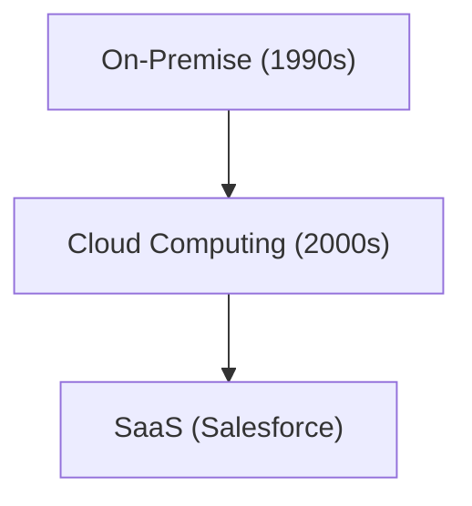

# 기업사: Salesforce의 역사 - SaaS(클라우드 소프트웨어)의 개척자

[Salesforce](/ko/p/salesforce%E3%81%AEsoql%E3%82%92%E5%88%A9%E7%94%A8%E3%81%97%E3%81%A6%E6%97%A5%E5%88%A5%E3%81%AE%E3%83%AC%E3%82%B3%E3%83%BC%E3%83%89%E4%BD%9C%E6%88%90%E6%95%B0%E3%82%92%E5%8F%96%E5%BE%97%E3%81%99%E3%82%8B%E6%96%B9%E6%B3%95/)는 SaaS의 개척자입니다.

## 클라우드 컴퓨팅의 진화

## 수학 모델
SaaS의 성장 모델은 다음과 같습니다：
$$ R(t) = R_0 e^{kt} $$

## 추가 기술 검증 파트 1

이 섹션에서는 더 깊은 기술적 세부 사항과 케이스 스터디에 대해 깊이 파고듭니다. 다양한 조건에서의 성능 평가 및 다른 시스템과의 통합과 관련된 과제 및 해결책을 검토합니다. 향후 전망과 한계에 대해서도 고찰합니다.

