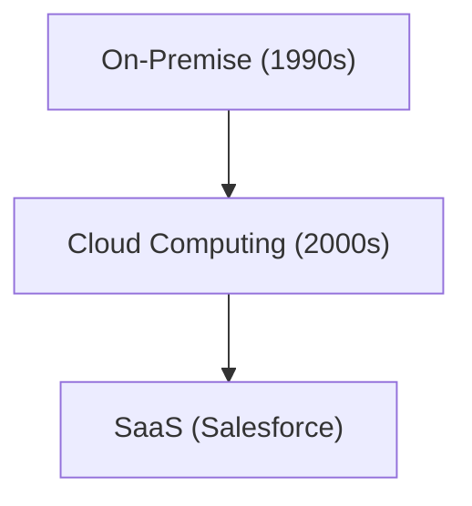

# História da Empresa: A História da Salesforce - Pioneira em SaaS (Software na Nuvem)

A Salesforce é a pioneira do SaaS.

## Evolução da Computação na Nuvem

## Modelo Matemático
O modelo de crescimento do SaaS é o seguinte:
$$ R(t) = R_0 e^{kt} $$

## Verificação Técnica Adicional Parte 1

Nesta seção, nos aprofundaremos em mais detalhes técnicos e estudos de caso. Avaliaremos o desempenho em várias condições e discutiremos os desafios e as soluções para a integração com outros sistemas. Também examinaremos as perspectivas futuras e as limitações.

