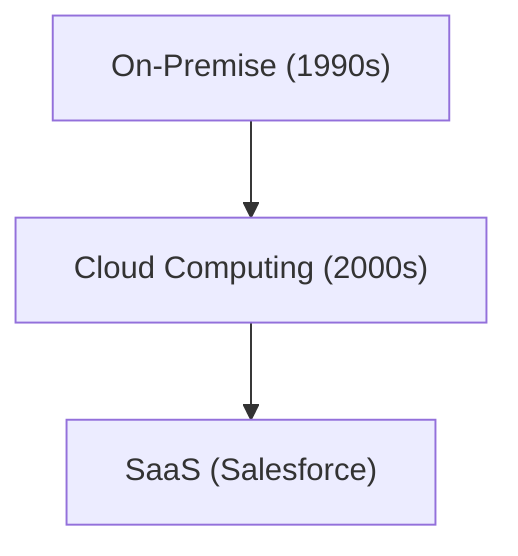

# История компании: История Salesforce - пионер SaaS (облачного программного обеспечения)

[Salesforce](/ru/p/salesforce%D0%B4%D1%80%D0%B5%D0%B1%D0%B5%D0%B7%D0%B3-%D0%BA%D0%BE%D0%BD%D1%82%D0%B0%D0%BA%D1%82%D0%BE%D0%B2%E5%85%A8%E6%B6%88%E3%81%97%D0%BA%D0%BE%D0%BC%D0%B0%D0%BD%D0%B4%D0%B0/) является пионером в области SaaS.

## Эволюция облачных вычислений

## Математическая модель
Модель роста SaaS выглядит следующим образом:
$$ R(t) = R_0 e^{kt} $$

## Дополнительная техническая проверка, часть 1

В этом разделе мы углубимся в дальнейшие технические детали и тематические исследования. Мы оценим производительность в различных условиях и рассмотрим проблемы и решения, связанные с интеграцией с другими системами. Мы также обсудим будущие перспективы и ограничения.

