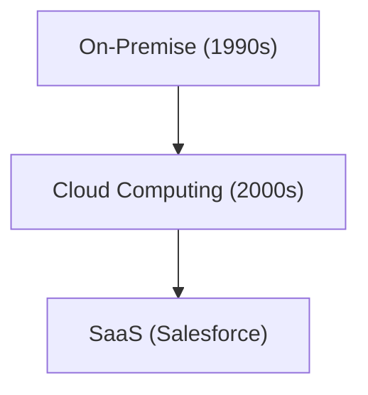

# История компании: История Salesforce - пионер SaaS (облачного программного обеспечения)

Salesforce является пионером в области SaaS.

## Эволюция облачных вычислений

## Математическая модель
Модель роста SaaS выглядит следующим образом:
$$ R(t) = R_0 e^{kt} $$

## Дополнительная техническая проверка, часть 1

В этом разделе мы углубимся в дальнейшие технические детали и тематические исследования. Мы оценим производительность в различных условиях и рассмотрим проблемы и решения, связанные с интеграцией с другими системами. Мы также обсудим будущие перспективы и ограничения.

