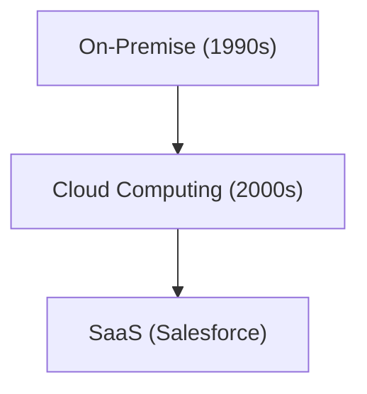

# 企业史：Salesforce的历史 - SaaS（云软件）的先驱

Salesforce是SaaS的先驱。

## 云计算的演进

## 数学模型
SaaS的增长模型如下：
$$ R(t) = R_0 e^{kt} $$

## 附加技术验证部分 1

本节将深入探讨进一步的技术细节和案例研究。我们将评估各种条件下的性能，探讨与其他系统集成时的挑战和解决方案，并考虑未来的前景和局限性。

