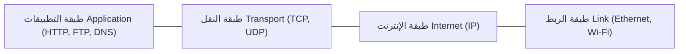

## 1. المقدمة: البنية التحتية الخفية للعالم المتصل

في كل مرة نفتح فيها متصفح الويب، أو نشاهد مقاطع الفيديو عالية الدقة عبر البث المباشر، أو نرسل رسائل فورية، أو ننفذ معاملات مالية دولية، فإننا نعتمد على حزمة بروتوكولات الاتصال العالمية: **TCP/IP (بروتوكول التحكم في النقل / بروتوكول الإنترنت)**. لم يُبتكر TCP/IP من قبل شركة تقنية واحدة محتكرة، ولم يُفرض بمرسوم حكومي، بل هو نتاج نصف قرن من الأبحاث اللامركزية والهندسة المبتكرة والتعاون المفتوح بين العلماء في جميع أنحاء العالم.

يتناول هذا المقال التاريخ الشامل لبروتوكول TCP/IP: من جذوره إبان الحرب الباردة وظهور تقنية تبديل الحزم وشبكة ARPANET، مروراً بالتصميم المعماري لفينتون سيرف وروبرت كان، وصولاً إلى دمجه في نظام BSD Unix والتحول نحو IPv6.

## 2. ولادة تقنية تبديل الحزم وانطلاق ARPANET

في ستينيات القرن العشرين، كانت الاتصالات العالمية تعتمد على **تبديل الدارات (Circuit Switching)**، وهو المبدأ الأساسي لشبكات الهاتف التقليدية. في هذا النظام، يتم حجز خط اتصال مادي أو منطقي مخصص بين الطرفين طوال مدة المكالمة. وكان هذا الأسلوب يعاني من عيوب جسيمة: إذا تضررت محطة مركزية أو انقطع الخط، انقطع الاتصال كلياً؛ بالإضافة إلى هدر السعة أثناء فترات الصمت.

في ذروة الحرب الباردة، احتاجت وزارة الدفاع الأمريكية إلى شبكة اتصالات قادرة على الصمود حتى في حال تعرضها لهجوم نووي دون أن تنهار الشبكة بالكامل. وبشكل مستقل، وضع ثلاثة علماء بارزين نظرية **تبديل الحزم (Packet Switching)**:
- **بول باران** في مؤسسة RAND، الذي اقترح شبكة موزعة من العقد غير المأهولة قادرة على توجيه الرسائل ديناميكياً.
- **دونالد ديفيز** في المختبر الفيزيائي الوطني البريطاني (NPL)، الذي صاغ مصطلح *"حزمة"* وأنشأ أولى الشبكات التجريبية.
- **ليونارد كلاينروك** في معهد MIT، الذي وضع الأسس الرياضية لنظرية طوابير الانتظار لشبكات البيانات.

في تبديل الحزم، يتم تقسيم البيانات إلى كتل صغيرة موحدة تسمى **حزم (Packets)**. تحمل كل حزمة عنواني المصدر والوجهة وتتحرك باستقلالية عبر أجهزة التوجيه (الراوترات). وعند الوصول إلى الوجهة، يُعاد ترتيب الحزم لإعادة بناء البيانات الأصلية. وإذا تعطل مسار ما، تقوم أجهزة التوجيه تلقائياً بإعادة توجيه الحزم اللاحقة عبر مسارات بديلة.

لاختبار هذا المفهوم، أطلقت وكالة ARPA مشروع **ARPANET**. وفي 29 أكتوبر 1969، تم إرسال أول رسالة بين جامعة كاليفورنيا في لوس أنجلوس (UCLA) ومعهد ستانفورد للأبحاث (SRI). ورغم تعطل النظام بعد كتابة حرفي "LO" (أثناء محاولة كتابة "LOGIN")، إلا أن تلك اللحظة دشنت عصر شبكات الحاسوب. واعتمدت شبكة ARPANET في بدايتها على بروتوكول **NCP (برنامج التحكم في الشبكة)**.

## 3. تصميم بروتوكول TCP/IP: نحو بنية شبكية مفتوحة

أثبتت ARPANET نجاح تبديل الحزم، لكن سرعان ما ظهرت شبكات جديدة ومتباينة: شبكات الراديو بالحزم (PRNET) للوحدات المتحركة وشبكات الأقمار الصناعية (SATNET) عبر المحيط الأطلسي.

وكان بروتوكول NCP مصمماً حصرياً للبنية المتجانسة لشبكة ARPANET، وعاجزاً عن الربط بين شبكات ذات وسائط وتقنيات مختلفة تماماً (Internetworking).

وهنا برز دور **فينتون (فينت) سيرف** و**روبرت (بوب) كان**. وفي مايو 1974، نشرا ورقتهما التاريخية *"A Protocol for Packet Network Intercommunication"*، واضعين فيها الأسس المعمارية لبروتوكول **TCP (برنامج التحكم في النقل)**.

قامت رؤيتهما على فلسفة **الشبكات ذات البنية المفتوحة (Open-Architecture Networking)**:
1. **استقلالية الشبكات الفرعية**: تحتفظ كل شبكة بتقنياتها الداخلية دون الحاجة لتعديلها للاتصال بالشبكة العالمية.
2. **التسليم بأقصى جهد (Best-Effort)**: لا تقدم الشبكة ضمانات مطلقة للتسليم؛ وتتولى الأجهزة الطرفية (Edge Hosts) فحص الأخطاء وإعادة الإرسال.
3. **أجهزة توجيه عديمة الحالة (Stateless Gateways)**: تبقى أجهزة التوجيه بسيطة وسريعة ولا تحتفظ ببيانات عن حالات الاتصالات الفردية.
4. **اللامركزية الإدارية**: عدم وجود سلطة مركزية تتحكم في مسار البيانات العالمي.

### الفصل التاريخي: تقسيم TCP و IP (عام 1978)

في البداية، دمج البروتوكول وظائف التوجيه والوثوقية في ترويسة واحدة. لكن التجارب اللاحقة مع نقل الصوت في الوقت الحقيقي أظهرت أن فرض إعادة الإرسال الصارمة لكل حزمة مفقودة يتسبب في تأخير زمني غير مقبول.

وفي عام 1978، اتخذ سيرف وكان وجون بوستل قراراً معمارياً حاسماً بفصل البروتوكول إلى طبقتين:
- **IP (بروتوكول الإنترنت)**: يعمل في طبقة الشبكة، ويتولى العنونة وتوجيه الحزم بأقصى جهد ودون اتصال بين الشبكات المختلفة.
- **TCP (بروتوكول التحكم في النقل)**: يعمل في طبقة النقل، ويضمن تسليم البيانات بالترتيب الصحيح والتحكم في التدفق وإعادة الإرسال الموثوق.

كما تم تقديم بروتوكول **UDP (بروتوكول حزم بيانات المستخدم)** كبروتوكول خفيف غير متصل، وهو الأساس لخدمات DNS والبث الصوتي والمرئي والألعاب عبر الإنترنت.

## 4. "يوم العلم" والاندماج الحاسم مع نظام BSD Unix

مع مطلع الثمانينيات، استقرت حزمة البروتوكولات بصيغة IPv4. وفي **1 يناير 1983**، نفذت ARPANET ما عُرف بـ **"Flag Day" (يوم العلم)**: حيث أُجبرت كافة الأجهزة المتصلة على إيقاف بروتوكول NCP نهائياً والانتقال الكامل إلى TCP/IP. ويُعد هذا التاريخ يوم الميلاد الرسمي لشبكة الإنترنت.

ولكن لضمان الانتشار الواسع، كان لا بد من توفير دعم برمجي مجاني. فقامت DARPA بتمويل مجموعة CSRG في جامعة كاليفورنيا في بيركلي لدمج TCP/IP مباشرة في نظام التشغيل **BSD Unix**.

وأصدر الفريق بقيادة **بيل جوي** (أحد مؤسسي Sun Microsystems لاحقاً) في خريف 1983 إصدار **4.2BSD**، والذي تضمن ابتكارين رئيسيين:
- حزمة TCP/IP مدمجة بكفاءة عالية داخل نواة نظام التشغيل.
- واجهة **مآخذ التوصيل (Sockets API)** الشهيرة (`socket()`, `bind()`, `connect()`, `listen()`, `accept()`).

أتاحت واجهة المقابس للمبرمجين كتابة تطبيقات الشبكة بنفس سهولة قراءة وكتابة الملفات العادية. ومكن هذا الجامعات والمراكز البحثية من بناء شبكات TCP/IP باستخدام حواسيب عادية ودون الحاجة لمعدات احتكارية باهظة، مما حسم المنافسة لصالح TCP/IP وتفوقه على نموذج OSI المعقد.

## 5. الأسس التقنية والنماذج الرياضية لتوجيه البيانات

تكمن قوة TCP/IP في نموذج الطبقات الأربع (التطبيقات، النقل، الإنترنت، الربط). وبفضل هذا التجريد، تعمل التطبيقات مثل HTTP و SSH بسلاسة تامة بصرف النظر عن الوسيط الفيزيائي، سواء كان أليافاً ضوئية أو أقماراً صناعية أو شبكات 5G.

ومن الناحية الرياضية، فإن مسألة تحسين توجيه البيانات لتقليل زمن التأخير الإجمالي للشبكة تُصاغ كمسألة استمثال رياضي:

$$ \min \sum_{e \in E} f_e(x_e) $$

حيث:
- $E$ هي مجموعة كافة مسارات الاتصال (الحواف) في الشبكة.
- $x_e$ يمثل حجم تدفق البيانات المار عبر المسار $e$.
- $f_e(x_e)$ هي دالة تكلفة محدبة تصف زمن التأخير الناتج عن التحميل $x_e$.

وتعتمد بروتوكولات التوجيه الداخلي مثل OSPF (باستخدام خوارزمية ديكسترا) والخارجي مثل BGP على هذه النماذج الرياضية الموزعة لإعادة حساب المسارات المثلى ذاتياً في أجزاء من الثانية عند حدوث أي عطل.

## 6. التجارة، وثورة الويب، ومستقبل IPv6

في أواخر ثمانينيات القرن الماضي، أنشأت المؤسسة الوطنية للعلوم في الولايات المتحدة شبكة **NSFNET**، وهي شبكة عمود فقري فائقة السرعة قائمة على TCP/IP ربطت مراكز الحواسيب العملاقة، وحلت محل ARPANET وفتحت المجال أمام الاستخدام التجاري.

وفي الفترة بين 1989 و 1991، اخترع **تيم بيرنرز لي** الشبكة العنكبوتية العالمية (World Wide Web) في سيرن. وبالاعتماد على بنية TCP/IP الراسخة، تحول الإنترنت من شبكة أكاديمية إلى المحرك الأول للتجارة والثقافة العالمية.

### أزمة نفاد العناوين وأفق IPv6

استخدم بروتوكول IPv4 الأصلي عناوين بطول 32 بت، مما أتاح نحو 4.3 مليار ($2^{32} \approx 4.29 \times 10^9$) عنوان فريد. ومع انتشار الهواتف الذكية وأجهزة إنترنت الأشياء (IoT)، نفدت عناوين IPv4 بحلول عام 2010.

وجاء الحل الجذري عبر **IPv6**، الذي يستخدم عناوين بطول 128 بت:

$$ 2^{128} \approx 3.4 \times 10^{38} \text{ عنوان} $$

وهو رقم فلكي يتيح تخصيص مليارات العناوين لكل مليمتر مربع من سطح الأرض. كما يعزز IPv6 كفاءة معالجة الحزم ويدمج معايير الأمان IPsec بشكل أصيل.

## 7. الخاتمة: الإرث الدائم للبنية المفتوحة

من تجربة دفاعية في زمن الحرب الباردة إلى شبكة تربط الإنسانية جمعاء، يمثل بروتوكول TCP/IP أعظم إنجاز هندسي وتعاوني في العصر الحديث.

إن سر بقائه ونجاحه يكمن في بساطة قلب الشبكة وذكاء أطرافها. الرؤية التي خطها فينت سيرف وبوب كان قبل خمسين عاماً لا تزال تنبض بالحياة، مفسحة المجال أمام ابتكارات رقمية لا حصر لها.
