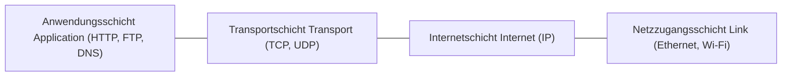

## 1. Einleitung: Die unsichtbare Architektur der vernetzten Welt

Jedes Mal, wenn wir eine Webseite aufrufen, hochauflösende Videos streamen oder Echtzeitnachrichten versenden, vertrauen wir auf ein universelles Regelwerk der digitalen Kommunikation: die Protokollsuite **TCP/IP (Transmission Control Protocol / Internet Protocol)**. TCP/IP entstand weder durch den Alleingang eines IT-Konzerns noch durch staatliche Verordnung. Es ist das Resultat jahrzehntelanger dezentraler Forschung und offener Zusammenarbeit globaler Computeringenieure.

Dieser Artikel analysiert die umfassende Geschichte von TCP/IP: von den Wurzeln der Paketvermittlung im Kalten Krieg und der Entstehung des ARPANET über den visionären Architekturentwurf von Vinton Cerf und Robert Kahn bis hin zur wegweisenden Integration in BSD Unix und dem Übergang zu IPv6.

## 2. Die Entstehung der Paketvermittlung und das ARPANET

In den 1960er Jahren dominierte die **Leitungsvermittlung (Circuit Switching)** die globale Telekommunikation. Bei diesem Prinzip wird für die gesamte Dauer eines Gesprächs eine feste physische Verbindung zwischen zwei Teilnehmern reserviert. Dieses Konzept war extrem störanfällig: Wurde ein Vermittlungsknoten zerstört, brach die Kommunikation komplett ab. Zudem blieben die Leitungen während Sprechpausen ungenutzt.

Auf dem Höhepunkt des Kalten Krieges suchte das US-Verteidigungsministerium nach einem dezentralen Netzwerk, das selbst im Falle nuklearer Angriffe funktionsfähig bleiben konnte. Unabhängig voneinander entwickelten drei renommierte Wissenschaftler das Konzept der **Paketvermittlung (Packet Switching)**:
- **Paul Baran** bei der RAND Corporation konzipierte verteilte Netzwerkknoten mit dynamischer Weiterleitung.
- **Donald Davies** am National Physical Laboratory (NPL) in Großbritannien prägte den Begriff *"Paket"* und baute erste lokale Testnetze.
- **Leonard Kleinrock** am MIT formulierte die mathematischen Grundlagen der Warteschlangentheorie für Datennetze.

Bei der Paketvermittlung werden Daten in standardisierte Einheiten namens **Pakete** zerlegt. Jedes Paket enthält Absender- und Empfängeradresse und wird von Routern autonom weitergeleitet. Am Zielort werden die Pakete anhand ihrer Sequenznummern wieder zur Originalnachricht zusammengesetzt. Fällt eine Verbindung aus, leiten die Router die nachfolgenden Pakete automatisch über alternative Pfade um.

Zur Erprobung startete die Advanced Research Projects Agency (ARPA) das Projekt **ARPANET**. Am 29. Oktober 1969 gelang die erste Datenübertragung zwischen der UCLA und dem Stanford Research Institute (SRI). Obwohl das System nach Eingabe der Buchstaben "LO" (beim Versuch "LOGIN" einzugeben) abstürzte, markierte dieser Moment den Beginn des vernetzten Zeitalters. Frühe ARPANET-Knoten kommunizierten über das Protokoll **NCP (Network Control Program)**.

## 3. Der Entwurf von TCP/IP: Das Prinzip offener Netzwerkarchitekturen

ARPANET bewies die Tragfähigkeit der Paketvermittlung, doch Mitte der 1970er Jahre entstanden völlig neuartige Netze: mobile Paketfunknetze (PRNET) und transatlantische Satellitennetze (SATNET).

Das ursprüngliche NCP-Protokoll war fest auf die homogene Kabelinfrastruktur des ARPANET zugeschnitten und konnte heterogene Netzwerke mit unterschiedlichen Übertragungsmedien nicht miteinander verbinden (Internetworking).

Hier traten **Vinton Cerf** und **Robert (Bob) Kahn** auf den Plan. Im Mai 1974 veröffentlichten sie ihre historische Arbeit *"A Protocol for Packet Network Intercommunication"*, in der sie das **TCP (Transmission Control Program)** vorstellten.

Ihre Philosophie basierte auf vier Grundsätzen der **Open-Architecture-Vernetzung**:
1. **Netzwerkautonomie**: Jedes Teilnetzwerk behält seine eigene interne Technologie und Topologie unverändert bei.
2. **Best-Effort-Prinzip**: Das Kernnetzwerk garantiert keine fehlerfreie Zustellung; Verlustüberwachung und Wiederholung erfolgen End-to-End durch die beteiligten Endgeräte.
3. **Zustandslose Router (Stateless Gateways)**: Vermittlungsknoten bleiben einfach und speichern keine internen Verbindungszustände.
4. **Keine zentrale Instanz**: Es gibt keine übergeordnete Kontrollstelle, die den globalen Datenverkehr zentral steuert.

### Die Trennung von TCP und IP (1978)

Anfänglich waren Flusskontrolle, Zuverlässigkeit und Paket-Routing in einem einzigen Protokollkopf vereint. Erste Experimente mit Sprachübertragungen zeigten jedoch, dass die zwingende Wiederholung verlorener Pakete untragbare Verzögerungen (Latenzen) für Echtzeitanwendungen verursachte.

1978 trafen Cerf, Kahn und Jon Postel die richtungsweisende Entscheidung, das Protokoll in zwei Schichten aufzuteilen:
- **IP (Internet Protocol)**: Zuständig für Adressierung und ungesicherte Best-Effort-Paketweiterleitung zwischen Teilnetzen.
- **TCP (Transmission Control Protocol)**: Zuständig für Ende-zu-Ende-Flusssteuerung, Segmentierung und garantierte, geordnete Datenübertragung.

Gleichzeitig wurde das **UDP (User Datagram Protocol)** als leichtgewichtige, verbindungslose Alternative eingeführt – die Grundlage moderner DNS-, Sprach- und Streamingdienste.

## 4. Der "Flag Day" und die Integration in BSD Unix

Anfang der 1980er Jahre wurde TCP/IP im Rahmen von IPv4 standardisiert. Am **1. Januar 1983** vollzog das ARPANET den sogenannten **"Flag Day"**: Alle angeschlossenen Systeme mussten das alte NCP zwingend deaktivieren und auf TCP/IP umstellen. Dieses Datum gilt als die offizielle Geburtsstunde des modernen Internets.

Für den weltweiten Durchbruch sorgte jedoch die Integration in **BSD Unix** an der University of California, Berkeley, finanziert durch die DARPA.

Das Entwicklerteam um **Bill Joy** (späterer Mitgründer von Sun Microsystems) veröffentlichte im Herbst 1983 die Version **4.2BSD**, die zwei Durchbrüche lieferte:
- Einen hochoptimierten, nativen TCP/IP-Netzwerkstack direkt im Betriebssystemkern.
- Die legendäre **Sockets-API** (`socket()`, `bind()`, `connect()`, `listen()`, `accept()`).

Dank der Sockets-API wurde Netzwerkprogrammierung für Softwareentwickler so unkompliziert wie gewöhnliche Dateizugriffe. Universitäten und Unternehmen konnten preisgünstige Computer mit 4.2BSD direkt in das Netzwerk einbinden, was dem TCP/IP-Standard den entscheidenden Sieg über das schwerfällige OSI-Schichtenmodell der ISO sicherte.

## 5. Technische Prinzipien und mathematische Verkehrsmodelle

Die Eleganz von TCP/IP basiert auf seinem Vier-Schichten-Modell (Anwendung, Transport, Internet, Netzzugang). Diese Abstraktion trennt Anwendungsdienste wie HTTP oder SSH vollständig von den Eigenheiten der physikalischen Trägermedien wie Glasfaser, Wi-Fi oder 5G.

Auf mathematischer Ebene lässt sich die globale Optimierung des Datenverkehrs zur Minimierung der mittleren Netzwerklatenz als folgendes Optimierungsproblem formulieren:

$$ \min \sum_{e \in E} f_e(x_e) $$

Wobei:
- $E$ die Menge aller Kommunikationsverbindungen (Kanten) im Netzwerk darstellt.
- $x_e$ das Datenvolumen auf der Verbindung $e$ bezeichnet.
- $f_e(x_e)$ eine konvexe Kostenfunktion ist, welche die Verzögerungszeit in Abhängigkeit von der Last $x_e$ beschreibt.

Protokolle wie OSPF (auf Basis des Dijkstra-Algorithmus) und BGP (Border Gateway Protocol) nutzen verteilte Heuristiken, um im laufenden Betrieb autonom optimale Routen zu berechnen und Netzwerkausfälle in Millisekunden auszugleichen.

## 6. Kommerzialisierung, das World Wide Web und IPv6

Ende der 1980er Jahre baute die National Science Foundation mit **NSFNET** ein schnelles TCP/IP-Backbone auf, das ARPANET ablöste und das Netz für zivile und kommerzielle Zwecke öffnete.

Zwischen 1989 und 1991 erfand **Tim Berners-Lee** am CERN das World Wide Web. Gestützt auf das robuste TCP/IP-Fundament entwickelte sich das Internet explosionsartig von einem akademischen Forschungswerkzeug zum globalen Motor von Wirtschaft und Gesellschaft.

### Adressknappheit und der Durchbruch von IPv6

Das ursprüngliche IPv4 bot mit 32-Bit-Adressen etwa 4,3 Milliarden ($2^{32} \approx 4,29 \times 10^9$) eindeutige Adressen. In den 2010er Jahren waren diese Adressen infolge des weltweiten Smartphone- und IoT-Booms vollständig vergeben.

Die nachhaltige Lösung ist **IPv6** mit 128-Bit-Adressen:

$$ 2^{128} \approx 3,4 \times 10^{38} \text{ Adressen} $$

Diese gigantische Zahl reicht aus, um jedem Quadratmillimeter der Erdoberfläche Milliarden eigener IP-Adressen zuzuweisen. Zudem optimiert IPv6 die Paketverarbeitung und integriert Sicherheitsstandards wie IPsec direkt im Protokoll.

## 7. Fazit: Das Vermächtnis einer offenen Architektur

Was als sicherheitspolitisches Projekt im Kalten Krieg begann, wurde zu einer der bemerkenswertesten Ingenieurleistungen der Menschheit.

Die Stärke von TCP/IP liegt in seiner Philosophie: maximale Einfachheit im Kernnetz und Dezentralisierung der Intelligenz an die Peripherie. Die visionäre Idee von Cerf und Kahn verbindet heute Milliarden von Menschen in einem offenen, universellen Kommunikationsraum.
