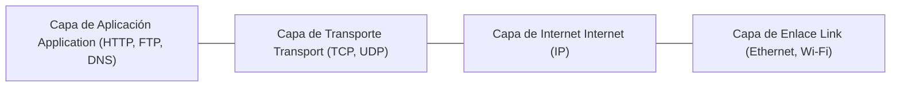

## 1. Introducción: La Arquitectura Invisible del Mundo Conectado

Cada vez que abrimos un navegador web, vemos transmisiones de video en alta definición, operamos en los mercados financieros globales o enviamos un mensaje instantáneo, dependemos de una suite universal de reglas de comunicación: **TCP/IP (Transmission Control Protocol / Internet Protocol)**. TCP/IP no fue inventado por un monopolio tecnológico ni decretado por un mandato gubernamental autoritario. Es el resultado de medio siglo de investigación descentralizada, ingeniería visionaria y colaboración abierta entre científicos de todo el planeta.

Este artículo presenta un análisis histórico y técnico exhaustivo de TCP/IP: desde sus orígenes en plena Guerra Fría con la conmutación de paquetes y el nacimiento de ARPANET, hasta el diseño magistral de Vinton Cerf y Robert Kahn, la histórica integración en BSD Unix y la transición hacia IPv6.

## 2. El Nacimiento de la Conmutación de Paquetes y ARPANET

En la década de 1960, las telecomunicaciones globales estaban dominadas por la **conmutación de circuitos (Circuit Switching)**, el modelo fundamental de las redes telefónicas. En este sistema, se establece un canal de comunicación físico o lógico exclusivo entre dos partes durante toda la llamada. Este esquema presentaba graves vulnerabilidades: si una central telefónica era destruida o una línea se cortaba, la comunicación se interrumpía por completo; además, el canal permanecía desaprovechado durante los silencios de la conversación.

En el punto más álgido de la Guerra Fría, el Departamento de Defensa de los Estados Unidos necesitaba una red de comunicaciones capaz de sobrevivir a un ataque nuclear masivo sin que toda la infraestructura colapsara. De forma independiente, tres brillantes investigadores concibieron una alternativa revolucionaria: la **conmutación de paquetes (Packet Switching)**:
- **Paul Baran** en la RAND Corporation diseñó una red distribuida de nodos no tripulados capaces de redirigir mensajes de forma dinámica.
- **Donald Davies** en el National Physical Laboratory (NPL) del Reino Unido acuñó el término *"paquete"* y construyó las primeras redes de prueba locales.
- **Leonard Kleinrock** en el MIT formuló la base matemática de la teoría de colas aplicada a redes de datos.

En la conmutación de paquetes, cualquier flujo de información se fragmenta en pequeños bloques estandarizados llamados **paquetes**. Cada paquete lleva adheridas las direcciones de origen y destino y viaja de forma autónoma por la red a través de enrutadores (routers). Al llegar a su destino, los paquetes se reordenan según sus números de secuencia para reconstruir el mensaje original. Si un enlace intermedio falla, los routers desvían automáticamente los paquetes restantes por rutas alternativas.

Para validar esta teoría en la práctica, la Agencia de Proyectos de Investigación Avanzada (ARPA, más tarde DARPA) financió el proyecto **ARPANET**. El 29 de octubre de 1969 se transmitió el primer mensaje entre computadoras ubicadas en UCLA y el Stanford Research Institute (SRI). Aunque el sistema se cayó tras teclear apenas las letras "LO" al intentar escribir "LOGIN", aquel instante marcó el nacimiento de las redes de datos modernas. Inicialmente, ARPANET utilizó el protocolo **NCP (Network Control Program)** para gestionar las comunicaciones.

## 3. El Diseño de TCP/IP: Hacia una Red Abierta e Interconectada

ARPANET demostró el éxito indiscutible de la conmutación de paquetes, pero pronto surgieron nuevas exigencias técnicas. A mediados de la década de 1970 proliferaron redes experimentales completamente heterogéneas: redes de radio por paquetes (PRNET) para comunicaciones móviles y enlaces transatlánticos por satélite (SATNET).

El protocolo NCP había sido concebido exclusivamente para los cables homogéneos y de alta fiabilidad de ARPANET, por lo que era incapaz de comunicar redes con características físicas y lógicas dispares (Internetworking).

En este momento decisivo intervinieron **Vinton Cerf** y **Robert (Bob) Kahn**. En mayo de 1974 publicaron un artículo histórico titulado *"A Protocol for Packet Network Intercommunication"*, en el que sentaron las bases del **TCP (Transmission Control Program)**.

Su propuesta se fundamentaba en la filosofía de **Red de Arquitectura Abierta (Open-Architecture Networking)**:
1. **Autonomía de las redes**: Cada red interna puede conservar su tecnología, formato y topología sin verse obligada a modificarse para conectarse a la red global.
2. **Entrega de Mejor Esfuerzo (Best-Effort)**: La red no garantiza una entrega infalible; la detección de pérdidas y la retransmisión de datos son gestionadas de extremo a extremo por los hosts periféricos.
3. **Pasarelas (Routers) Sin Estado**: Los enrutadores intermedios son simples y rápidos; no almacenan información de estado sobre conexiones individuales activas.
4. **Descentralización Total**: No existe una autoridad central que controle o autorice el flujo de datos global.

### La Gran División: Separación entre TCP e IP (1978)

Originalmente, TCP agrupaba en una única cabecera monolítica tanto el control de flujo y la entrega confiable como el enrutamiento de paquetes. Sin embargo, los primeros ensayos de transmisión de voz en tiempo real revelaron que imponer un control estricto de retransmisión provocaba retrasos (latencias) inaceptables.

En 1978, Cerf, Kahn, Jon Postel y sus colaboradores tomaron la sabia decisión arquitectónica de dividir el protocolo en dos capas independientes:
- **IP (Internet Protocol)**: Opera en la capa de red; se encarga del direccionamiento y del enrutamiento de paquetes sin conexión y de mejor esfuerzo entre redes dispares.
- **TCP (Transmission Control Protocol)**: Opera en la capa de transporte; garantiza la entrega ordenada y confiable, controlando el flujo y gestionando retransmisiones automáticas.

Al mismo tiempo se creó **UDP (User Datagram Protocol)**, un protocolo ligero y sin conexión pensado para aplicaciones en tiempo real como VoIP, transmisiones de audio y consultas DNS, completando así el núcleo del modelo TCP/IP.

## 4. El "Flag Day" y la Integración Clave en BSD Unix

A principios de los años 80, la suite TCP/IP se consolidó en la especificación IPv4. El **1 de enero de 1983**, ARPANET vivió su célebre **"Flag Day" (Día de la Bandera)**: todos los nodos conectados a la red fueron obligados a apagar definitivamente el viejo protocolo NCP y migrar a TCP/IP. Esa fecha marca el nacimiento formal y operativo de Internet.

Sin embargo, para que TCP/IP conquistara el mundo civil y académico, hacía falta software accesible. DARPA financió al Computer Systems Research Group (CSRG) de la Universidad de California en Berkeley para incorporar TCP/IP directamente en **BSD Unix**.

El equipo liderado por **Bill Joy** (quien luego cofundaría Sun Microsystems) lanzó en otoño de 1983 la versión **4.2BSD**, que introdujo:
- Una pila TCP/IP nativa y altamente optimizada en el propio núcleo del sistema operativo.
- La revolucionaria **API de Sockets** (`socket()`, `bind()`, `connect()`, `listen()`, `accept()`).

La API de Sockets permitió que la programación en red fuera tan intuitiva como la lectura y escritura de archivos tradicionales en Unix. De pronto, cualquier universidad, laboratorio de investigación o empresa podía conectar sus ordenadores a TCP/IP sin necesidad de comprar costoso hardware propietario. Esta integración gratuita y nativa en el sistema operativo consolidó la victoria definitiva de TCP/IP sobre el complejo y burocrático modelo OSI de la ISO.

## 5. Fundamentos Técnicos y Modelos Matemáticos de Enrutamiento

La fortaleza imperecedera de TCP/IP reside en su elegante arquitectura de cuatro capas (Aplicación, Transporte, Internet y Enlace). Gracias a esta abstracción, aplicaciones como HTTP, SSH o correo electrónico funcionan con absoluta transparencia, sin importar si los datos viajan por fibra óptica, enlaces satelitales o redes 5G.

Bajo esta estructura existe un riguroso soporte matemático. El problema de enrutar el tráfico minimizando la latencia total en una red a gran escala suele formularse como el siguiente problema de optimización:

$$ \min \sum_{e \in E} f_e(x_e) $$

Donde:
- $E$ es el conjunto de todos los enlaces de comunicación (aristas) en la topología de la red.
- $x_e$ representa el volumen de tráfico que atraviesa el enlace $e$.
- $f_e(x_e)$ es una función de coste convexa que describe el retardo total (retardo de cola y propagación) en el enlace $e$ bajo la carga $x_e$.

Protocolos de pasarela interior como OSPF (basado en el algoritmo de caminos mínimos de Dijkstra) y protocolos de exterior como BGP (Border Gateway Protocol) aplican algoritmos distribuidos que calculan de manera autónoma las mejores rutas en milisegundos, recalculando desvíos ante cualquier congestión o caída de línea.

## 6. Comercialización Masiva, la Web y el Desafío de IPv6

A finales de los años 80, la National Science Foundation de EE. UU. desplegó **NSFNET**, una red dorsal de alta velocidad basada en TCP/IP que conectaba centros de supercomputación. NSFNET sustituyó a ARPANET y abrió las puertas a la interconexión con redes comerciales.

Entre 1989 y 1991, **Tim Berners-Lee** inventó la World Wide Web en el CERN. Al ejecutarse sobre la sólida infraestructura de TCP/IP, la Web convirtió una red de investigación militar y académica en la mayor plataforma global de comercio, información e intercambio humano de la historia.

### La Saturación de Direcciones y el Horizonte de IPv6

El protocolo IPv4 original utilizaba un espacio de direcciones de 32 bits, lo que ofrecía un límite teórico de aproximadamente 4.300 millones ($2^{32} \approx 4,29 \times 10^9$) de direcciones únicas. En 1981 esto parecía inagotable, pero el auge de los smartphones, la nube y los dispositivos IoT agotó el registro central de direcciones IPv4 en la década de 2010.

Aunque técnicas intermedias como NAT y CIDR alargaron la vida útil de IPv4, la solución definitiva es **IPv6**. Con direcciones de 128 bits, IPv6 proporciona:

$$ 2^{128} \approx 3,4 \times 10^{38} \text{ direcciones} $$

Una cifra astronómica capaz de asignar billones de direcciones IP a cada milímetro cuadrado de la superficie terrestre. Además de resolver la escasez, IPv6 simplifica la cabecera de los paquetes, agiliza el procesamiento en los routers e integra de forma nativa la seguridad IPsec.

## 7. Conclusión: El Legado de la Arquitectura Abierta

Lo que comenzó como una iniciativa estratégica durante la Guerra Fría se convirtió en el artefacto de ingeniería más influyente y resistente creado por el ser humano.

El secreto del triunfo de TCP/IP radica en su filosofía de "inteligencia en los extremos y simplicidad en el núcleo". La visión que concibieron Vint Cerf y Bob Kahn hace más de cincuenta años no solo interconectó ordenadores, sino que unió a la sociedad global en una red de comunicación universal y abierta.
