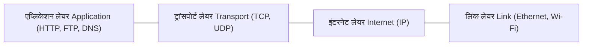

## 1. प्रस्तावना: जुड़ी हुई दुनिया की अदृश्य संरचना

जब भी हम वेब ब्राउज़र खोलते हैं, वीडियो स्ट्रीम करते हैं, वित्तीय लेनदेन करते हैं या संदेश भेजते हैं, तो हम संचार नियमों के एक सार्वभौमिक सेट पर निर्भर होते हैं: **TCP/IP (ट्रांसमिशन कंट्रोल प्रोटोकॉल / इंटरनेट प्रोटोकॉल)**। TCP/IP किसी एक आईटी कंपनी की निजी संपत्ति नहीं है और न ही यह किसी सरकारी फरमान से बना है। यह आधी सदी से अधिक समय तक दुनिया भर के वैज्ञानिकों द्वारा किए गए शोध और सहयोग का उत्कृष्ट परिणाम है।

इस लेख में हम TCP/IP के इतिहास का गहराई से विश्लेषण करेंगे: शीत युद्ध में पैकेट स्विचिंग के जन्म और ARPANET से लेकर विंटन सेर्फ़ और रॉबर्ट कान के दूरदर्शी डिजाइन, BSD यूनिक्स में इसके एकीकरण और IPv6 के भविष्य तक।

## 2. पैकेट स्विचिंग का जन्म और ARPANET की शुरुआत

1960 के दशक में वैश्विक दूरसंचार पर **सर्किट स्विचिंग (Circuit Switching)** का दबदबा था, जो पारंपरिक टेलीफोन प्रणाली का आधार था। इस प्रणाली में संचार करने वाले दोनों पक्षों के बीच पूरी बातचीत के दौरान एक विशेष समर्पित लाइन आरक्षित रहती थी। इसमें बड़ी कमियाँ थीं: यदि कोई स्विचिंग स्टेशन नष्ट हो जाता या तार कट जाता, तो संचार पूरी तरह ठप हो जाता था।

शीत युद्ध के चरम पर अमेरिकी रक्षा विभाग को एक ऐसे नेटवर्क की आवश्यकता थी जो परमाणु हमले के बाद भी काम करता रहे। इसी दौरान तीन वैज्ञानिकों ने स्वतंत्र रूप से **पैकेट स्विचिंग (Packet Switching)** का सिद्धांत विकसित किया:
- RAND कॉर्पोरेशन के **पॉल बारन (Paul Baran)** ने संदेशों को छोटे टुकड़ों में बांटकर भेजने की अवधारणा पेश की।
- ब्रिटेन की नेशनल फिजिकल लेबोरेटरी (NPL) के **डोनाल्ड डेविस (Donald Davies)** ने *"पैकेट"* शब्द दिया और शुरुआती नेटवर्क बनाए।
- MIT के **लियोनार्ड क्लेनरोक (Leonard Kleinrock)** ने कतार सिद्धांत (Queueing Theory) के गणितीय आधार तैयार किए।

पैकेट स्विचिंग में डेटा को छोटे ब्लॉकों में विभाजित किया जाता है जिन्हें **पैकेट** कहा जाता है। प्रत्येक पैकेट में भेजने वाले और पाने वाले का पता दर्ज होता है। नेटवर्क के राउटर्स इन पैकेटों को स्वतंत्र रूप से आगे बढ़ाते हैं। गंतव्य पर पहुंचकर पैकेट अपने क्रम संख्या के आधार पर पुनः जुड़ जाते हैं। यदि कोई लाइन कट जाती है, तो राउटर्स स्वचालित रूप से पैकेटों को वैकल्पिक रास्तों से भेज देते हैं।

इस सिद्धांत के परीक्षण के लिए अमेरिकी रक्षा विभाग की एजेंसी ARPA ने **ARPANET** परियोजना शुरू की। 29 अक्टूबर 1969 को UCLA और स्टैनफोर्ड रिसर्च इंस्टीट्यूट (SRI) के बीच पहला संदेश भेजा गया। "LOGIN" टाइप करते समय सिस्टम केवल "LO" भेजकर क्रैश हो गया, लेकिन यह कंप्यूटर नेटवर्क के जन्म का ऐतिहासिक क्षण था। शुरुआती ARPANET में **NCP (नेटवर्क कंट्रोल प्रोग्राम)** प्रोटोकॉल का उपयोग किया गया था।

## 3. TCP/IP का डिजाइन: एक खुले नेटवर्क की अवधारणा

ARPANET की सफलता के बाद 1970 के दशक में नए प्रकार के नेटवर्क सामने आए: मोबाइल वाहनों के लिए रेडियो पैकेट नेटवर्क (PRNET) और उपग्रह पैकेट नेटवर्क (SATNET)। 

पुराना NCP प्रोटोकॉल केवल ARPANET के आंतरिक तारों के लिए बना था और वह विभिन्न तकनीकों वाले अलग-अलग नेटवर्कों को आपस में नहीं जोड़ सकता था।

यहाँ **विंटन (विंट) सेर्फ़** और **रॉबर्ट (बॉब) कान** ने कदम रखा। मई 1974 में उन्होंने ऐतिहासिक शोधपत्र प्रकाशित किया: *"A Protocol for Packet Network Intercommunication"*, जिसमें उन्होंने **TCP (ट्रांसमिशन कंट्रोल प्रोग्राम)** का खाका पेश किया।

उनकी अवधारणा **ओपन-आर्किटेक्चर नेटवर्किंग** पर आधारित थी:
1. **नेटवर्क की स्वायत्तता**: प्रत्येक नेटवर्क अपनी आंतरिक तकनीक में बदलाव किए बिना मुख्य नेटवर्क से जुड़ सकता है।
2. **बेस्ट-एफ़र्ट डिलीवरी**: मुख्य नेटवर्क डेटा पहुँचने की कोई पूर्ण गारंटी नहीं देता; खोए हुए डेटा की पुनः प्राप्ति अंतिम छोर वाले कंप्यूटरों द्वारा की जाती है।
3. **स्टेटलेस गेटवे (राउटर्स)**: राउटर्स सरल और तेज़ रहते हैं, वे किसी सक्रिय कनेक्शन की स्थिति का रिकॉर्ड नहीं रखते।
4. **केंद्रीकृत नियंत्रण का अभाव**: नेटवर्क का कोई एकल मालिक या नियंत्रक नहीं होता।

### TCP और IP का विभाजन (1978)

शुरुआत में डेटा की विश्वसनीयता और पैकेट रूटिंग दोनों को एक ही TCP हेडर में रखा गया था। लेकिन जब वास्तविक समय में ऑडियो और वीडियो भेजने के प्रयोग हुए, तो पता चला कि हर खोए हुए पैकेट को दोबारा भेजने से अवांछित देरी (Latency) होती है।

1978 में सेर्फ़, कान और जॉन पोस्टेल ने इसे दो स्वतंत्र स्तरों में विभाजित किया:
- **IP (इंटरनेट प्रोटोकॉल)**: नेटवर्क लेयर पर काम करता है और पैकेटों को पता देकर विभिन्न नेटवर्कों के बीच रास्ता दिखाता है।
- **TCP (ट्रांसमिशन कंट्रोल प्रोटोकॉल)**: ट्रांसपोर्ट लेयर पर काम करता है और डेटा को क्रम में रखने, प्रवाह नियंत्रित करने और विश्वसनीय डिलीवरी सुनिश्चित करने का काम करता है।

इसी समय **UDP (यूज़र डेटाग्राम प्रोटोकॉल)** भी पेश किया गया, जो तेज़ और बिना कनेक्शन वाले संचार के लिए आवश्यक था (जैसे DNS और लाइव स्ट्रीमिंग)।

## 4. "फ्लैग डे" और BSD यूनिक्स में एकीकरण

1980 के दशक की शुरुआत में TCP/IP को IPv4 के रूप में अंतिम रूप दिया गया। **1 जनवरी 1983** को ARPANET ने ऐतिहासिक **"फ्लैग डे (Flag Day)"** मनाया: नेटवर्क से जुड़े सभी कंप्यूटरों के लिए NCP को हमेशा के लिए बंद करके TCP/IP अपनाना अनिवार्य कर दिया गया। इसी दिन को आधुनिक इंटरनेट का आधिकारिक जन्मदिन माना जाता है।

लेकिन इसे दुनिया भर में लोकप्रिय बनाने के लिए सॉफ्टवेयर की आवश्यकता थी। DARPA ने यूनिवर्सिटी ऑफ कैलिफोर्निया, बर्कले की टीम को फंड दिया ताकि वे TCP/IP को **BSD यूनिक्स** ऑपरेटिंग सिस्टम में जोड़ सकें।

**बिल जॉय** (जिन्होंने बाद में सन माइक्रोसिस्टम्स की सह-स्थापना की) के नेतृत्व वाली टीम ने 1983 में **4.2BSD** जारी किया, जिसमें दो बड़ी सफलताएँ थीं:
- ऑपरेटिंग सिस्टम के कर्नल में सीधे शामिल उच्च प्रदर्शन वाला TCP/IP स्टैक।
- क्रांतिकारी **सॉकेट्स एपीआई (Sockets API)** (`socket()`, `bind()`, `connect()`, `listen()`, `accept()`)।

सॉकेट्स एपीआई ने नेटवर्क प्रोग्रामिंग को उतना ही आसान बना दिया जितना यूनिक्स में फ़ाइल पढ़ना और लिखना। इसके बाद विश्वविद्यालयों और कंपनियों के लिए साधारण कंप्यूटरों पर TCP/IP नेटवर्क चलाना बेहद आसान हो गया।

## 5. तकनीकी सिद्धांत और ट्रैफ़िक रूटिंग का गणितीय मॉडल

TCP/IP की सफलता का रहस्य इसका 4-लेयर मॉडल है। चाहे डेटा ऑप्टिकल फाइबर से जाए, वाई-फाई से या 5G नेटवर्क से, एप्लिकेशन लेयर के प्रोटोकॉल (HTTP, SSH) बिना किसी बदलाव के काम करते हैं।

नेटवर्क में देरी को कम करते हुए डेटा भेजने की समस्या को गणितीय रूप से अनुकूलन (Optimization) समस्या के रूप में लिखा जाता है:

$$ \min \sum_{e \in E} f_e(x_e) $$

यहाँ:
- $E$ नेटवर्क के सभी लिंक्स (edges) का समूह है।
- $x_e$ लिंक $e$ से गुजरने वाला डेटा ट्रैफ़िक है।
- $f_e(x_e)$ एक उत्तल लागत फलन (Convex cost function) है जो लोड $x_e$ के आधार पर होने वाली देरी को दर्शाता है।

OSPF (डिजक्स्ट्रा एल्गोरिदम पर आधारित) और BGP जैसे रूटिंग प्रोटोकॉल इसी गणितीय मॉडल पर काम करते हैं और किसी भी खराबी पर मिलीसेकंड में नए रास्ते खोज लेते हैं।

## 6. व्यावसायिक विस्तार, वेब क्रांति और IPv6

1980 के दशक के उत्तरार्ध में अमेरिकी राष्ट्रीय विज्ञान फाउंडेशन (NSF) ने **NSFNET** बैकबोन तैयार किया, जिसने ARPANET की जगह ली और इंटरनेट को वाणिज्यिक उपयोग के लिए खोल दिया।

1989 से 1991 के बीच **टिम बर्नर्स-ली** ने CERN में वर्ल्ड वाइड वेब (WWW) का आविष्कार किया। TCP/IP के मजबूत आधार पर वेब के आने से इंटरनेट आम जनता के जीवन का अभिन्न अंग बन गया।

### एड्रेस की कमी और IPv6 का युग

IPv4 में 32-बिट एड्रेस होते थे, जिससे लगभग 4.3 अरब ($2^{32} \approx 4.29 \times 10^9$) विशिष्ट पते मिलते थे। स्मार्टफोन और इंटरनेट ऑफ थिंग्स (IoT) के विस्फोट से ये पते 2010 के दशक में समाप्त हो गए।

इसका स्थायी समाधान **IPv6** है, जिसमें 128-बिट एड्रेस होते हैं:

$$ 2^{128} \approx 3.4 \times 10^{38} \text{ पते} $$

यह संख्या इतनी विशाल है कि पृथ्वी की सतह के प्रत्येक मिलीमीटर को खरबों अद्वितीय आईपी पते दिए जा सकते हैं। साथ ही यह सुरक्षा (IPsec) और गति में भी बेहतर है।

## 7. निष्कर्ष: खुली संरचना की महान विरासत

शीत युद्ध के सैन्य शोध से शुरू होकर पूरी मानवता को जोड़ने वाले नेटवर्क के रूप में विकसित होना TCP/IP की एक अभूतपूर्व उपलब्धि है।

इसकी सबसे बड़ी ताकत इसकी सरलता और खुलापन है। विंट सेर्फ़ और बॉब कान द्वारा पांच दशक पहले देखा गया सपना आज साकार हो चुका है और पूरी दुनिया को एक धागे में पिरोए हुए है।
