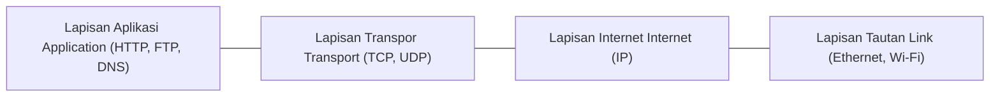

## 1. Pendahuluan: Arsitektur Tak Terlihat dari Dunia yang Terhubung

Setiap kali kita membuka browser web, menonton video streaming resolusi tinggi, bertransaksi di bursa efek internasional, atau mengirim pesan instan, kita bergantung pada serangkaian aturan komunikasi universal: **TCP/IP (Transmission Control Protocol / Internet Protocol)**. TCP/IP tidak diciptakan oleh satu perusahaan teknologi raksasa secara tertutup, bukan pula lahir dari dekret tunggal pemerintah mana pun. Protokol ini merupakan hasil dari dedikasi penelitian terdesentralisasi, visi rekayasa perangkat lunak, dan kolaborasi terbuka para ilmuwan di seluruh dunia selama lebih dari setengah abad.

Artikel ini mengulas sejarah komprehensif TCP/IP: dari akar era Perang Dingin dengan konsep packet switching dan kelahiran ARPANET, rancangan revolusioner Vinton Cerf dan Robert Kahn, integrasi legendaris ke dalam BSD Unix, hingga transisi menuju era IPv6.

## 2. Kelahiran Packet Switching dan Fajar ARPANET

Pada tahun 1960-an, telekomunikasi dunia didominasi oleh **circuit switching**—mekanisme dasar jaringan telepon konvensional. Dalam model ini, jalur komunikasi fisik atau logis khusus dialokasikan secara eksklusif untuk kedua pihak selama panggilan berlangsung. Sistem ini memiliki kelemahan mendasar: bila stasiun relai perantara hancur atau kabel terputus, komunikasi terhenti total; selain itu, saluran terbuang sia-sia saat tidak ada percakapan.

Di tengah ketegangan Perang Dingin, Departemen Pertahanan Amerika Serikat membutuhkan jaringan komunikasi tangguh yang dapat tetap beroperasi meskipun sebagian wilayah mengalami kehancuran parah akibat serangan militer. Secara independen, tiga ilmuwan merumuskan konsep alternatif yang revolusioner: **packet switching (penukaran paket)**:
- **Paul Baran** di RAND Corporation merancang jaringan terdistribusi tanpa simpul pusat yang mampu mengarahkan pesan secara dinamis.
- **Donald Davies** di National Physical Laboratory (NPL) Inggris menciptakan istilah *"packet"* dan membangun jaringan uji coba lokal pertama.
- **Leonard Kleinrock** di MIT meletakkan landasan matematika teori antrean untuk jaringan komunikasi data.

Dalam packet switching, seluruh aliran data dipecah menjadi unit-unit kecil yang terstandarisasi, disebut **paket**. Setiap paket dibekali alamat asal dan tujuan lalu dikirim secara independen melewati router-router di jaringan. Di tempat tujuan, paket-paket tersebut disusun kembali ke urutan semula. Jika salah satu jalur terputus, router secara otomatis mengalihkan paket-paket berikutnya melalui jalur alternatif.

Guna mewujudkan teori ini, badan riset militer ARPA (kelak bernama DARPA) meluncurkan proyek **ARPANET**. Pada 29 Oktober 1969, pesan pertama antar-komputer berhasil dikirimkan antara Universitas California, Los Angeles (UCLA) dan Stanford Research Institute (SRI). Meskipun sistem sempat macet setelah hanya mengetik huruf "LO" (dari kata "LOGIN"), peristiwa bersejarah itu menandai kelahiran jaringan komputer modern. ARPANET generasi awal menggunakan protokol **NCP (Network Control Program)**.

## 3. Merancang TCP/IP: Filosofi Arsitektur Jaringan Terbuka

Keberhasilan ARPANET membuktikan efektivitas packet switching, tetapi tantangan baru segera bermunculan. Memasuki pertengahan 1970-an, lahirlah aneka jaringan baru dengan medium fisik berbeda: jaringan radio paket (PRNET) untuk kendaraan bergerak serta jaringan paket satelit (SATNET) lintas Samudra Atlantik.

Protokol NCP dirancang khusus untuk kabel seragam ARPANET yang minim gangguan, sehingga tidak mampu menghubungkan jaringan-jaringan yang memiliki arsitektur dan media fisik yang beraneka ragam (Internetworking).

Pada masa krusial ini, tampillah **Vinton Cerf** dan **Robert (Bob) Kahn**. Pada Mei 1974, mereka menerbitkan makalah bersejarah *"A Protocol for Packet Network Intercommunication"*, yang menguraikan konsep **TCP (Transmission Control Program)**.

Prinsip rancangan mereka berpijak pada **Jaringan Arsitektur Terbuka (Open-Architecture Networking)**:
1. **Otonomi Jaringan**: Setiap sub-jaringan bebas mempertahankan teknologi dan topologinya sendiri tanpa harus diubah untuk terhubung ke jaringan global.
2. **Pengiriman Best-Effort (Usaha Terbaik)**: Inti jaringan tidak memberikan jaminan mutlak; penanganan kesalahan dan pengiriman ulang data ditangani sepenuhnya oleh komputer di ujung jaringan (Edge Hosts).
3. **Gateway / Router Tanpa Status (Stateless)**: Router perantara dibuat sesederhana dan secepat mungkin tanpa perlu menyimpan memori mengenai status sesi koneksi aktif.
4. **Desentralisasi Pengendalian**: Tidak ada satu pun otoritas pusat yang mengatur seluruh alur lalu lintas data dunia.

### Pemisahan Bersejarah: Membagi TCP dan IP (1978)

Pada mulanya, fungsi keandalan data dan perutean paket disatukan dalam satu header TCP yang monolitik. Namun, pengujian suara secara real-time menunjukkan bahwa kewajiban verifikasi urutan dan transmisi ulang justru memicu latensi (keterlambatan) yang tidak dapat ditoleransi oleh komunikasi suara.

Pada tahun 1978, Cerf, Kahn, dan Jon Postel mengambil langkah visioner dengan memecah protokol tersebut menjadi dua lapisan independen:
- **IP (Internet Protocol)**: Beroperasi di lapisan jaringan, mengurus pengalamatan dan perutean paket secara best-effort tanpa koneksi di antara jaringan-jaringan heterogen.
- **TCP (Transmission Control Protocol)**: Beroperasi di lapisan transpor, menjamin integritas data, pengurutan paket, kendali aliran, dan transmisi ulang yang andal.

Secara bersamaan, diperkenalkan pula **UDP (User Datagram Protocol)** sebagai protokol ringan tanpa koneksi yang sangat efisien untuk DNS, komunikasi audio/video real-time, dan gaming.

## 4. "Flag Day" dan Integrasi Menentukan ke dalam BSD Unix

Menjelang dekade 1980-an, rangkaian protokol TCP/IP telah matang dalam spesifikasi IPv4. Pada **1 Januari 1983**, ARPANET memberlakukan peristiwa penting yang dikenal sebagai **"Flag Day"**: seluruh komputer yang terhubung diwajibkan mematikan protokol lama NCP dan beralih permanen ke TCP/IP. Hari ini diakui secara resmi sebagai hari lahirnya Internet modern.

Namun, agar protokol ini menyebar ke seluruh dunia secara luas, diperlukan implementasi perangkat lunak yang mudah diakses. DARPA mendanai tim Computer Systems Research Group (CSRG) di Universitas California, Berkeley, untuk menanamkan TCP/IP langsung ke dalam sistem operasi **BSD Unix**.

Tim yang dipimpin oleh **Bill Joy** (yang kelak mendirikan Sun Microsystems) merilis **4.2BSD** pada musim gugur 1983 dengan membawa dua terobosan utama:
- Tumpukan protokol TCP/IP bawaan yang terintegrasi langsung di dalam kernel sistem operasi.
- **Sockets API** yang legendaris (`socket()`, `bind()`, `connect()`, `listen()`, `accept()`).

Sockets API memungkinkan pemrogram menulis aplikasi jaringan semudah membaca dan menulis berkas standar di Unix. Universitas, laboratorium penelitian, dan kalangan industri kini dapat menghubungkan komputer mereka ke jaringan TCP/IP dengan biaya terjangkau tanpa perlu membeli perangkat keras khusus yang mahal. Langkah ini memastikan kemenangan telak TCP/IP atas model OSI buatan ISO yang lamban dan birokratis.

## 5. Fondasi Teknis dan Model Matematika Perutean Data

Keunggulan abadi TCP/IP bersumber dari model abstraksi 4 lapisannya (Aplikasi, Transpor, Internet, dan Tautan). Berkat pemisahan tugas ini, aplikasi seperti HTTP, SSH, atau email dapat berkomunikasi secara konsisten, baik sinyal dikirimkan melalui kabel serat optik bawah laut, pemancar Wi-Fi, maupun satelit orbit rendah.

Secara matematis, masalah pengaturan perutean paket untuk meminimalkan keterlambatan (latensi) rata-rata di seluruh jaringan dirumuskan sebagai persoalan optimasi:

$$ \min \sum_{e \in E} f_e(x_e) $$

Di mana:
- $E$ adalah himpunan seluruh tautan komunikasi (edge) dalam topologi jaringan.
- $x_e$ merupakan volume lalu lintas data yang melintasi tautan $e$.
- $f_e(x_e)$ adalah fungsi biaya cembung yang menggambarkan penundaan total pada tautan $e$ berdasarkan beban lalu lintas $x_e$.

Protokol perutean internal seperti OSPF (menggunakan algoritma jalur terpendek Dijkstra) dan perutean eksternal seperti BGP (Border Gateway Protocol) bekerja berdasarkan perhitungan matematis terdistribusi ini, sehingga router dapat secara mandiri mencari jalan memutar terbaik saat terjadi gangguan saluran.

## 6. Komersialisasi, Ledakan Web, dan Masa Depan IPv6

Pada akhir 1980-an, National Science Foundation mendirikan **NSFNET**, jaringan tulang punggung TCP/IP berkecepatan tinggi yang menghubungkan pusat-pusat superkomputer. NSFNET mengambil alih peran ARPANET dan membuka akses jaringan bagi sektor komersial.

Antara tahun 1989 hingga 1991, **Tim Berners-Lee** menemukan World Wide Web di CERN. Berjalan di atas pondasi kokoh TCP/IP, Web mengubah jaringan penelitian tertutup menjadi ruang interaksi ekonomi, budaya, dan sosial terbesar bagi umat manusia.

### Krisis Kehabisan Alamat dan Era IPv6

Protokol IPv4 menggunakan ruang alamat 32-bit yang hanya menyediakan sekitar 4,3 miliar ($2^{32} \approx 4,29 \times 10^9$) alamat unik. Ledakan ponsel pintar dan perangkat IoT pada dekade 2010-an menyebabkan alamat IPv4 resmi habis teralokasikan.

Jawaban tuntas bagi keterbatasan ini adalah **IPv6**, yang menggunakan ruang alamat 128-bit:

$$ 2^{128} \approx 3,4 \times 10^{38} \text{ alamat} $$

Jumlah fantastis ini sanggup membagikan miliaran alamat IP untuk setiap milimeter persegi di permukaan bumi. Selain kapasitas alamat yang tak terbatas, IPv6 juga menyederhanakan pemrosesan header paket di router dan menyertakan enkripsi keamanan IPsec secara bawaan.

## 7. Kesimpulan: Warisan Abadi Arsitektur Terbuka

Bermula dari eksperimen pertahanan militer di era Perang Dingin, TCP/IP telah menjelma menjadi karya rekayasa paling tangguh dan berpengaruh dalam sejarah peradaban manusia.

Keberhasilannya bertumpu pada filosofi inti: kesederhanaan pada inti jaringan dan kecerdasan pada perangkat pengguna. Visi Vint Cerf dan Bob Kahn lima dekade silam telah menjadi kenyataan, menghubungkan miliaran manusia dalam satu ruang komunikasi terbuka dan tanpa batas.
