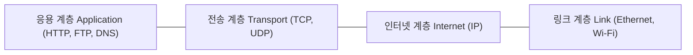

## 1. 서론: 세상을 연결하는 보이지 않는 인프라

우리가 매일 자연스럽게 사용하는 웹 브라우징, 동영상 스트리밍, 스마트폰 메신저, 글로벌 금융 거래에 이르기까지 디지털 문명의 모든 접점 뒤에는 통신 규칙의 집대성인 **TCP/IP(전송 제어 프로토콜 / 인터넷 프로토콜)** 가 자리 잡고 있습니다. TCP/IP는 어느 한 거대 IT 기업이나 특정 국가 정부의 독단적인 지시로 탄생한 것이 아니라, 반세기가 넘는 기간 동안 전 세계 컴퓨터 과학자와 엔지니어들이 개방성과 탈중앙화 철학 아래 이룩한 협력의 결정체입니다.

본 글에서는 냉전 시대의 통신 생존성 요구와 패킷 교환 이론의 탄생부터, ARPANET의 출범, 빈턴 서프(Vinton Cerf)와 로버트 칸(Robert Kahn)의 혁신적인 프로토콜 설계, BSD 유닉스 운영체제와의 결합, 그리고 IPv6로 이어지는 기술적 진화의 전 과정을 깊이 있게 살펴봅니다.

## 2. 패킷 교환 기술의 탄생과 ARPANET의 여명

1960년대 글로벌 통신망은 전화망으로 대표되는 **회선 교환(Circuit Switching)** 방식이 지배하고 있었습니다. 회선 교환 방식은 통신을 진행하는 두 지점 사이에 물리적 또는 논리적 전용 회선을 독점적으로 점유하는 구조입니다. 이 방식은 대화가 없는 순간에도 회선이 낭비될 뿐만 아니라, 중간 교환국이나 핵심 선로가 물리적으로 파괴되면 해당 회선의 통신이 완전히 두절되는 치명적인 취약점을 안고 있었습니다.

냉전이 최고조에 달했던 당시 미국 국방부는 핵 공격 등으로 일부 중계 지점이 파괴되더라도 전체 통신망이 마비되지 않고 우회 경로를 통해 통신을 지속할 수 있는 견고한 분산형 네트워크를 절실히 필요로 했습니다. 이에 따라 세 명의 선구적인 과학자가 독립적으로 혁신적인 **패킷 교환(Packet Switching)** 이론을 주창했습니다:
- 랜드 연구소(RAND Corporation)의 **폴 배런(Paul Baran)**: 분산형 무인 노드를 통한 메시지 분할 전송 모델 제안
- 영국 국립물리연구소(NPL)의 **도널드 데이비스(Donald Davies)**: '패킷(Packet)'이라는 용어를 처음 도입하고 초기 실험망 구축
- MIT의 **레너드 클라인록(Leonard Kleinrock)**: 패킷 통신의 수학적 기초인 대기행렬 이론(Queueing Theory) 정립

패킷 교환 방식에서는 전송할 전체 데이터를 **패킷(Packet)** 이라는 작은 단위로 잘게 쪼갠 후, 각 패킷에 송신자와 수신자의 주소 정보를 붙여 망에 띄웁니다. 네트워크 내의 라우터들은 마치 이어달리기 주자처럼 각 패킷을 목적지를 향해 독립적으로 전달합니다. 목적지에 도달한 패킷들은 순서 번호에 따라 다시 원래의 데이터로 재조립됩니다. 이 방식은 회선을 다수의 사용자가 극도로 효율적으로 공유할 수 있게 할 뿐 아니라, 특정 회선이 끊어지더라도 라우터가 자율적으로 우회로를 탐색하여 통신을 유지할 수 있게 해 주었습니다.

이 이론을 실증하기 위해 미국 국방부 고등연구계획국(ARPA, 현 DARPA)은 **ARPANET** 프로젝트를 발족했습니다. 1969년 10월 29일, UCLA와 스탠퍼드 연구소(SRI) 간에 인류 최초의 원격 노드 간 메시지 전송이 이루어졌습니다. "LOGIN"이라는 단어를 입력하다가 "LO"까지만 전송된 채 시스템이 멈췄던 유명한 일화가 있지만, 이는 실질적인 컴퓨터 네트워크 역사의 서막이었습니다. 초기 ARPANET은 호스트 간 통신을 위해 **NCP(Network Control Program)** 라는 프로토콜을 사용했습니다.

## 3. TCP/IP의 설계: 개방형 상호 접속망을 향한 위대한 도약

ARPANET의 대성공으로 패킷 교환의 실효성은 입증되었으나, 곧 새로운 기술적 장벽에 부딪혔습니다. 1970년대 중반에 이르자 이동체 통신을 위한 무선 패킷망(PRNET)과 대서양을 가로지르는 위성 패킷망(SATNET) 등 물리적 매체와 전송 특성이 전혀 다른 이기종 네트워크들이 속속 등장하기 시작한 것입니다.

기존의 NCP 프로토콜은 ARPANET이라는 단일하고 신뢰성이 높은 유선 환경에 특화되어 설계되었기 때문에, 서로 다른 구조와 물리적 규격을 가진 망들을 유기적으로 연결하는 '망 간 상호 접속(Internetworking)'을 처리할 수 없었습니다.

이 역사적 분기점에서 **빈턴 서프(Vinton Cerf)** 와 **로버트 칸(Robert Kahn)** 이 등장했습니다. 그들은 1974년 5월, 기념비적인 논문인 《패킷 네트워크 상호 접속을 위한 프로토콜》(A Protocol for Packet Network Intercommunication)을 발표하며 **TCP(전송 제어 프로그램)** 의 개념을 공식 제안했습니다.

이들이 제시한 아키텍처의 혁신성은 **개방형 네트워크 아키텍처(Open-Architecture Networking)** 철학에 있었습니다:
1. **자율적 하위망**: 각 네트워크는 내부 기술이나 토폴로지를 수정하지 않고도 전체 네트워크에 연결될 수 있다.
2. **최선 노력(Best-effort) 전송**: 통신망 자체는 완벽한 패킷 도착을 보장하지 않으며, 손실된 데이터의 재전송과 신뢰성 회복은 종단 호스트(Edge Hosts)가 전담한다.
3. **무상태 게이트웨이(라우터)**: 패킷을 중계하는 게이트웨이는 복잡한 연결 상태를 유지하지 않고 단순성을 유지하여 확장성을 극대화한다.
4. **탈중앙화 운영**: 전체 망을 통제하는 단일 중앙 기구를 두지 않는다.

### 프로토콜의 대분할: TCP와 IP의 분리 (1978년)

초기 설계에서는 신뢰성 보장 기능과 패킷 라우팅 기능이 단일한 TCP 프로토콜 헤더에 하나로 결합되어 있었습니다. 그러나 네트워크 음성 통신이나 실시간 멀티미디어 전송 실험이 진행되면서, 모든 데이터에 엄격한 순서 보장과 재전송을 강제하는 것이 치명적인 지연(Latency)을 초래한다는 사실이 밝혀졌습니다.

이에 따라 1978년, 서프와 칸, 존 포스텔(Jon Postel) 등 연구진은 프로토콜을 두 개의 계층으로 과감하게 분리하는 역사적 결정을 내렸습니다:
- **IP (인터넷 프로토콜)**: 네트워크 계층에서 동작하며, 이기종 네트워크 전반에 걸친 패킷의 주소 지정과 비신뢰성 최선 노력 라우팅을 전담한다.
- **TCP (전송 제어 프로토콜)**: 전송 계층에서 동작하며, 호스트 간 데이터 스트림의 분할, 순서 제어, 흐름 제어, 재전송을 통해 무결성을 보장한다.

동시에, 재전송 오버헤드 없이 신속한 데이터 전송이 필요한 애플리케이션을 위해 비연결형 프로토콜인 **UDP(User Datagram Protocol)** 가 추가되면서, 오늘날 우리가 사용하는 완벽한 TCP/IP 프로토콜 스위트의 근간이 완성되었습니다.

## 4. '플래그 데이'와 버클리 유닉스(BSD)와의 역사적 결합

프로토콜 사양이 무르익자, ARPANET을 일괄 전환하는 과감한 결단이 실행되었습니다. **1983년 1월 1일**, ARPANET에 연결된 모든 컴퓨터는 구형 NCP 프로토콜을 완전히 끄고 TCP/IP로 영구 전환해야 했습니다. 이날은 **'플래그 데이(Flag Day)'** 로 불리며, 현대 인터넷이 공식적으로 출범한 날로 역사에 기록되어 있습니다.

그러나 TCP/IP가 학술 연구망을 넘어 전 세계 산업계와 학계를 평정하게 된 결정적 계기는 캘리포니아 대학교 버클리 캠퍼스(UC Berkeley)의 **BSD 유닉스** 운영체제와의 결합이었습니다. DARPA는 당시 대학과 연구소에 널리 보급되어 있던 BSD 유닉스에 TCP/IP 스택을 기본 탑재하는 프로젝트에 연구 자금을 지원했습니다.

**빌 조이(Bill Joy, 훗날 썬 마이크로시스템즈 공동 설립자)** 가 이끄는 팀은 1983년 가을 출시된 **4.2BSD** 에 두 가지 핵심 혁신을 구현했습니다:
- 운영체제 커널 내부에 고성능으로 통합된 네이티브 TCP/IP 네트워크 스택
- 현대 네트워크 프로그래밍의 표준이 된 **소켓 API (Socket API)** (`socket()`, `bind()`, `connect()`, `listen()`, `accept()`)

소켓 API는 복잡한 네트워크 통신을 유닉스의 친숙한 파일 입출력처럼 단순하게 추상화하여, 수많은 소프트웨어 개발자들이 손쉽게 네트워크 프로그램을 개발할 수 있는 환경을 열어주었습니다. 연구소와 기업들은 고가의 통신 전용 장비를 구매할 필요 없이, 저렴한 미니컴퓨터와 4.2BSD 유닉스만으로 즉시 인터넷에 연결할 수 있었습니다. 이 무료 네이티브 운영체제 통합은 ISO의 복잡한 OSI 7계층 프로토콜을 누르고 TCP/IP가 전 세계의 사실상 표준(De facto standard)으로 등극하게 만든 결정적 승인이었습니다.

## 5. 기술적 특징과 트래픽 라우팅의 수학적 모델

TCP/IP의 영원한 생명력은 우아한 4계층 추상화(응용, 전송, 인터넷, 링크 계층)에 있습니다. 물리적 통신 매체가 광케이블이든, 구리선이든, Wi-Fi든, 5G 셀룰러든, 하위 계층의 복잡성은 인터넷 계층과 링크 계층에 의해 완전히 은폐되며, 최상위의 HTTP, SSH, SMTP 같은 애플리케이션은 동일한 방식으로 데이터를 주고받습니다.

네트워크 라우팅의 기반에는 정교한 그래프 이론과 최적화 수학 모델이 존재합니다. 거대한 네트워크 토폴로지에서 전체 전송 지연 시간을 최소화하는 트래픽 라우팅 문제는 목적 함수로서 다음과 같이 공식화할 수 있습니다:

$$ \min \sum_{e \in E} f_e(x_e) $$

여기서:
- $E$는 네트워크 내의 모든 통신 링크(간선)의 집합입니다.
- $x_e$는 링크 $e$를 통과하는 실시간 트래픽 양입니다.
- $f_e(x_e)$는 트래픽 부하 $x_e$에 따라 대기행렬 지연과 전송 지연을 반영하는 볼록 비용 함수(Convex Cost Function)입니다.

OSPF(다익스트라 최단 경로 알고리즘 기반)와 같은 내부 라우팅 프로토콜과 BGP(국경 게이트웨이 프로토콜)와 같은 자치 시스템(AS) 간 외부 라우팅 프로토콜은 이러한 수학적 기반 위에서 동작하며, 망 장애나 트래픽 폭증 시에도 자율적으로 최적의 우회 경로를 즉각 재계산합니다.

## 6. 상용화, 웹 혁명, 그리고 IPv6로의 대항해

1980년대 후반 미국 국립과학재단(NSF)은 슈퍼컴퓨터 센터들을 잇는 백본망인 **NSFNET** 을 TCP/IP 기반으로 구축하였고, 이는 노후화된 ARPANET을 대체하며 인터넷의 새로운 중추가 되었습니다.

1989년에서 1991년 사이, 유럽입자물리연구소(CERN)의 **팀 버너스리(Tim Berners-Lee)** 는 월드 와이드 웹(World Wide Web: HTTP, HTML, URL)을 발명했습니다. 이미 전 세계에 탄탄히 깔려 있던 TCP/IP 인프라 위에서 웹이 구동되면서, 인터넷은 학술 및 군사 연구망의 울타리를 넘어 전 세계 기업과 대중을 연결하는 정보 고속도로로 폭발적인 성장을 이루었습니다.

### 주소 고갈 위기와 IPv6의 무한한 지평

1981년 RFC 791로 표준화된 IPv4는 32비트 주소 체계를 채택하여 약 43억($2^{32} \approx 4.29 \times 10^9$) 개의 주소를 제공했습니다. 1980년대 당시에는 43억 개가 무한에 가까운 숫자로 보였으나, 개인용 PC, 스마트폰, 그리고 수백억 개의 사물인터넷(IoT) 장비가 보급되면서 2010년대에 이르러 공인 IPv4 주소는 완전히 고갈되었습니다.

NAT(네트워크 주소 변환) 기술이 주소 고갈의 충격을 완화해 주었지만, 근본적인 해결책은 128비트 주소 체계를 도입한 **IPv6(인터넷 프로토콜 버전 6)** 입니다. IPv6가 제공하는 주소 공간은 다음과 같습니다:

$$ 2^{128} \approx 3.4 \times 10^{38} \text{ 개} $$

이는 지구 표면의 모든 모래알 하나하나마다 수십억 개의 고유 IP 주소를 부여하고도 남는 천문학적인 규모입니다. IPv6는 주소의 무한성뿐만 아니라 패킷 헤더 구조의 간소화, 라우팅 효율성 극대화, IPsec 기반의 보안성을 기본 사양으로 내장하고 있습니다.

## 7. 결론: 개방형 아키텍처가 남긴 위대한 유산

냉전 시기 군사 통신의 생존성을 확보하기 위한 절박한 시도에서 출발하여 소수 연구자들의 꿈으로 설계된 TCP/IP는, 지난 반세기 동안 인류가 창조한 가장 성공적이고 견고한 공학적 유산으로 자리 잡았습니다.

TCP/IP의 성공 비결은 특정 기업의 독점 기술에 얽매이지 않고, 복잡성을 네트워크 변두리(호스트)에 두고 중심부(망)를 단순하고 견고하게 유지한 '개방형 아키텍처' 철학에 있었습니다. 50여 년 전 빈트 서프와 밥 칸이 스케치북 위에 그렸던 "서로 다른 네트워크가 끊김 없이 소통하는 세상"은 오늘날 인류 전체의 지식과 삶을 지탱하는 거대한 호흡이 되어 전 세계를 감싸고 있습니다.
