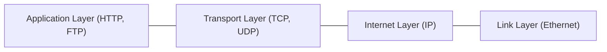

## はじめに

私たちが毎日当たり前のように使用しているWebブラウザ、スマートフォンアプリ、オンラインゲーム、そしてストリーミングサービス。これらすべての基盤となっているのが「TCP/IP（Transmission Control Protocol/Internet Protocol）」と呼ばれるプロトコルスイートです。TCP/IPは特定の企業や政府が単独で作り上げたものではなく、何十年にもわたる世界中の研究者やエンジニアたちの協力と試行錯誤の結晶です。

本記事では、この通信規格がどのようにして生まれ、いかにして現在の巨大なインターネットを支えるデファクトスタンダード（事実上の標準）にまで成長したのか、その歴史的な背景と技術的な進化の過程を深く掘り下げていきます。

## パケット交換技術の誕生とARPANET

TCP/IPの歴史を語る上で欠かせないのが、冷戦時代の1960年代に生まれた「パケット交換」という概念です。当時の通信は電話回線のような「回線交換方式」が主流でした。これは通信を行う二者間で物理的な（あるいは論理的な）専用回線を占有する方式であり、通信中は他の人がその回線を使うことができず、また中継拠点が破壊されると通信が完全に途絶してしまうという脆弱性を抱えていました。

冷戦下のアメリカでは、核攻撃を受けても通信網全体が機能停止に陥らない、堅牢で分散型のネットワークが求められていました。そこで、ランド研究所のポール・バラン（Paul Baran）、イギリス国立物理学研究所（NPL）のドナルド・デイビース（Donald Davies）、そしてMITのレナード・クラインロック（Leonard Kleinrock）らが独立して提唱したのが「パケット交換方式」です。

パケット交換では、送信したいデータを「パケット（小包）」と呼ばれる小さな単位に分割し、それぞれに宛先情報を付与してネットワーク上に送り出します。各パケットはネットワーク内のルーターをバケツリレーのように経由しながら目的地に到達し、受信側で元のデータに再構築されます。これにより、回線を効率的に共有できるだけでなく、一部の回線が遮断されても迂回経路（ルーティング）を選択して通信を継続することが可能になりました。

この理論を実証するため、米国防総省の高等研究計画局（ARPA、現在のDARPA）は「ARPANET」プロジェクトを立ち上げました。1969年10月29日、UCLA（カリフォルニア大学ロサンゼルス校）とSRI（スタンフォード研究所）の間で初めてのメッセージ通信が行われました。「LOGIN」と打ち込もうとして「LO」まで送信した時点でシステムがクラッシュしたという有名なエピソードがありますが、これが実質的なインターネットの産声となりました。初期のARPANETでは「NCP（Network Control Program）」と呼ばれるプロトコルが使用されていました。

## TCP/IPの設計：開かれたネットワークを目指して

ARPANETは成功を収めましたが、当時はARPANET以外にも無線ネットワーク（PRNET）や衛星ネットワーク（SATNET）など、異なる物理媒体や設計思想を持つネットワークが次々と登場し始めていました。NCPはARPANETという単一のネットワーク内での通信に最適化されており、これらの異なるネットワーク同士を相互接続（Internetworking）するには不十分でした。

そこで登場したのが、ヴィントン・サーフ（Vinton Cerf）とボブ・カーン（Bob Kahn）です。彼らは1974年に「A Protocol for Packet Network Intercommunication（パケットネットワーク相互接続のためのプロトコル）」という歴史的な論文を発表しました。この中で提唱されたのが「TCP（Transmission Control Program）」の概念です。

彼らの設計の画期的な点は、「オープン・アーキテクチャ・ネットワーキング」という思想にありました。
1. 各ネットワークは独立して動作し、独自の技術を用いてよい。
2. 通信はベストエフォート（最善の努力）で行われ、パケットが途中で失われた場合は送信元が再送を行う。
3. ネットワークを接続するゲートウェイ（ルーター）は内部状態を保持せず、シンプルに保つ。
4. 全体の中央制御機関を設けない。

初期のTCPは、データの確実な到達を保証する機能（現在のTCP）と、パケットを目的地までルーティングする機能（現在のIP）が一体化していました。しかし、音声通信などのように、データの正確性よりもリアルタイム性が求められる用途には、この一体型のアプローチはオーバーヘッドが大きすぎました。

そこで1978年、プロトコルは2つに分割されることになります。
- **IP (Internet Protocol):** ネットワーク間のパケットのルーティングとアドレス指定（IPアドレス）を担当する。
- **TCP (Transmission Control Protocol):** パケットの順序制御や再送制御を行い、データ転送の信頼性を担保する。

同時に、信頼性を犠牲にして高速なデータ転送を行うための「UDP（User Datagram Protocol）」も追加され、現在私たちが知るTCP/IPスイートの基本アーキテクチャが完成しました（のちのIPv4に相当）。

## 「フラッグ・デイ」とUnixへの統合

TCP/IPの仕様が固まると、ARPANETを移行させる大きな決断が下されました。1983年1月1日、ARPANETに接続されているすべてのコンピュータは、古いNCPからTCP/IPへの切り替えを義務付けられました。この日は「フラッグ・デイ（Flag Day）」と呼ばれ、現代のインターネットが正式に誕生した日として記録されています。

さらに、TCP/IPが爆発的に普及するきっかけとなったのが、カリフォルニア大学バークレー校（UC Berkeley）で開発されていた「BSD（Berkeley Software Distribution）Unix」との統合です。DARPAは、大学などの研究機関で広く使われていたBSD UnixにTCP/IPを組み込むための資金を提供しました。

ビル・ジョイ（Bill Joy、後にサン・マイクロシステムズを設立）を中心とするチームは、1983年にリリースされた4.2BSDにTCP/IPネットワークスタックと、現在でもプログラミングの基礎となっている「ソケットAPI（Socket API）」を実装しました。これにより、研究者や学生は高価な専用ハードウェアを購入することなく、安価なミニコンピュータとUnixOSの標準機能だけでTCP/IPネットワークを構築・利用できるようになりました。この「OSへの標準組み込み」こそが、他の競合プロトコル（OSI参照モデルに基づくプロトコルなど）に対するTCP/IPの決定的な勝利の要因となりました。

## 技術的特徴と数学的モデル

TCP/IPの強みは、その階層モデルにあります。アプリケーション層、トランスポート層、インターネット層、リンク層の4つの層がそれぞれ独立した役割を持つことで、下位の物理回線がイーサネットであろうとWi-Fiであろうと、上位のアプリケーション（Webブラウザなど）は同じように通信を行うことができます。

また、パケットルーティングの基盤には洗練されたアルゴリズムと数学的モデルが存在します。トラフィックのルーティングにおいて、ネットワーク全体の遅延を最小化する問題は、しばしば目的関数として以下のように定式化されます。

$$ \min \sum_{e \in E} f_e(x_e) $$

ここで、$E$はネットワーク内のすべてのリンク（エッジ）の集合、$x_e$はリンク$e$を流れるトラフィック量、$f_e(x_e)$はトラフィック量$x_e$のときのリンク$e$における遅延（コスト関数）を表します。OSPFやBGPなどのルーティングプロトコルは、こうした数学的基盤の上で、各ルーターが自律的に最適な経路を計算し、障害発生時には即座に迂回経路を再計算するメカニズムを備えています。

## 商用化、インターネットの爆発、そしてIPv6への未来

1980年代後半には、全米科学財団（NSF）がスーパーコンピュータセンター同士を結ぶバックボーンネットワーク「NSFNET」をTCP/IPで構築しました。NSFNETは全米の大学や研究機関を接続し、ARPANETに代わるインターネットの根幹となりました。

1990年代に入ると、ティム・バーナーズ＝リー（Tim Berners-Lee）によって「World Wide Web（WWW）」が発明されます。HTTPやHTMLという技術が、TCP/IPという堅牢な通信インフラの上に乗ることで、インターネットは学術機関のものから一般企業や家庭にまで爆発的に普及し、商用化の時代を迎えました。

しかし、TCP/IPの成功は新たな問題を引き起こしました。1981年に標準化されたIPv4は、約43億個のIPアドレス空間しか持っていませんでした。当時の設計者にとって43億は天文学的な数字に思えましたが、世界中の人々がパソコンやスマートフォン、さらにはIoTデバイスを持つようになった現在、IPv4アドレスは事実上枯渇しています。

この問題に対処するため、1990年代後半に策定されたのが「IPv6（Internet Protocol version 6）」です。IPv6は128ビットのアドレス空間を持ち、「約340澗（かん）（$3.4 \times 10^{38}$）個」という事実上無限のアドレスを提供します。現在、世界中でIPv4からIPv6への移行が徐々に進行していますが、完全な移行にはまだ時間がかかると予想されています。

## 結び

冷戦時代の軍事的な要求から始まり、少数の研究者たちによる夢のネットワークとして設計されたTCP/IP。それは、特定のハードウェアやソフトウェアに依存しない「オープン」な哲学を持っていたからこそ、半世紀にわたり進化を続け、現代のデジタル社会の礎（いしずえ）となることができました。

Vint CerfとBob Kahnが描いた「異なるネットワークがシームレスに繋がる世界」は、彼らの想像を遥かに超えるスケールで実現しています。次にあなたがブラウザでWebページを開くとき、その背後で休むことなく駆け巡るTCP/IPのパケットたちと、それを築き上げた先人たちの歴史に、少しだけ思いを馳せてみてはいかがでしょうか。
