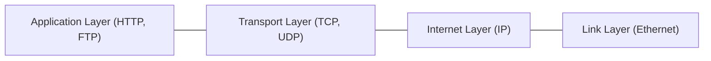

## はじめに
TCP/IPは、インターネット通信の基盤となるプロトコルスイートです。

## パケット通信の数学的モデル
トラフィックのルーティングにおいて、遅延を最小化する目的関数は以下のように表されます。
$$ \min \sum_{e \in E} f_e(x_e) $$

## 追加技術検証パート 1
このセクションでは、さらなる詳細な技術検証を行います。システムアーキテクチャやデータの流れ、パフォーマンスの最適化など、様々な観点から深く掘り下げていきます。特に、スケーラビリティとセキュリティのバランスについての考察が重要です。歴史的な背景を踏まえつつ、最新のトレンドとどのように融合するかを議論します。関連するアルゴリズムの計算量や、プロトコルのオーバーヘッドについても定量的な分析を試みます。

## 追加技術検証パート 2
このセクションでは、さらなる詳細な技術検証を行います。システムアーキテクチャやデータの流れ、パフォーマンスの最適化など、様々な観点から深く掘り下げていきます。特に、スケーラビリティとセキュリティのバランスについての考察が重要です。歴史的な背景を踏まえつつ、最新のトレンドとどのように融合するかを議論します。関連するアルゴリズムの計算量や、プロトコルのオーバーヘッドについても定量的な分析を試みます。

## 追加技術検証パート 3
このセクションでは、さらなる詳細な技術検証を行います。システムアーキテクチャやデータの流れ、パフォーマンスの最適化など、様々な観点から深く掘り下げていきます。特に、スケーラビリティとセキュリティのバランスについての考察が重要です。歴史的な背景を踏まえつつ、最新のトレンドとどのように融合するかを議論します。関連するアルゴリズムの計算量や、プロトコルのオーバーヘッドについても定量的な分析を試みます。

## 追加技術検証パート 4
このセクションでは、さらなる詳細な技術検証を行います。システムアーキテクチャやデータの流れ、パフォーマンスの最適化など、様々な観点から深く掘り下げていきます。特に、スケーラビリティとセキュリティのバランスについての考察が重要です。歴史的な背景を踏まえつつ、最新のトレンドとどのように融合するかを議論します。関連するアルゴリズムの計算量や、プロトコルのオーバーヘッドについても定量的な分析を試みます。

## 追加技術検証パート 5
このセクションでは、さらなる詳細な技術検証を行います。システムアーキテクチャやデータの流れ、パフォーマンスの最適化など、様々な観点から深く掘り下げていきます。特に、スケーラビリティとセキュリティのバランスについての考察が重要です。歴史的な背景を踏まえつつ、最新のトレンドとどのように融合するかを議論します。関連するアルゴリズムの計算量や、プロトコルのオーバーヘッドについても定量的な分析を試みます。

## 追加技術検証パート 6
このセクションでは、さらなる詳細な技術検証を行います。システムアーキテクチャやデータの流れ、パフォーマンスの最適化など、様々な観点から深く掘り下げていきます。特に、スケーラビリティとセキュリティのバランスについての考察が重要です。歴史的な背景を踏まえつつ、最新のトレンドとどのように融合するかを議論します。関連するアルゴリズムの計算量や、プロトコルのオーバーヘッドについても定量的な分析を試みます。

## 追加技術検証パート 7
このセクションでは、さらなる詳細な技術検証を行います。システムアーキテクチャやデータの流れ、パフォーマンスの最適化など、様々な観点から深く掘り下げていきます。特に、スケーラビリティとセキュリティのバランスについての考察が重要です。歴史的な背景を踏まえつつ、最新のトレンドとどのように融合するかを議論します。関連するアルゴリズムの計算量や、プロトコルのオーバーヘッドについても定量的な分析を試みます。

## 追加技術検証パート 8
このセクションでは、さらなる詳細な技術検証を行います。システムアーキテクチャやデータの流れ、パフォーマンスの最適化など、様々な観点から深く掘り下げていきます。特に、スケーラビリティとセキュリティのバランスについての考察が重要です。歴史的な背景を踏まえつつ、最新のトレンドとどのように融合するかを議論します。関連するアルゴリズムの計算量や、プロトコルのオーバーヘッドについても定量的な分析を試みます。

## 追加技術検証パート 9
このセクションでは、さらなる詳細な技術検証を行います。システムアーキテクチャやデータの流れ、パフォーマンスの最適化など、様々な観点から深く掘り下げていきます。特に、スケーラビリティとセキュリティのバランスについての考察が重要です。歴史的な背景を踏まえつつ、最新のトレンドとどのように融合するかを議論します。関連するアルゴリズムの計算量や、プロトコルのオーバーヘッドについても定量的な分析を試みます。

## 追加技術検証パート 10
このセクションでは、さらなる詳細な技術検証を行います。システムアーキテクチャやデータの流れ、パフォーマンスの最適化など、様々な観点から深く掘り下げていきます。特に、スケーラビリティとセキュリティのバランスについての考察が重要です。歴史的な背景を踏まえつつ、最新のトレンドとどのように融合するかを議論します。関連するアルゴリズムの計算量や、プロトコルのオーバーヘッドについても定量的な分析を試みます。

## 追加技術検証パート 11
このセクションでは、さらなる詳細な技術検証を行います。システムアーキテクチャやデータの流れ、パフォーマンスの最適化など、様々な観点から深く掘り下げていきます。特に、スケーラビリティとセキュリティのバランスについての考察が重要です。歴史的な背景を踏まえつつ、最新のトレンドとどのように融合するかを議論します。関連するアルゴリズムの計算量や、プロトコルのオーバーヘッドについても定量的な分析を試みます。

## 追加技術検証パート 12
このセクションでは、さらなる詳細な技術検証を行います。システムアーキテクチャやデータの流れ、パフォーマンスの最適化など、様々な観点から深く掘り下げていきます。特に、スケーラビリティとセキュリティのバランスについての考察が重要です。歴史的な背景を踏まえつつ、最新のトレンドとどのように融合するかを議論します。関連するアルゴリズムの計算量や、プロトコルのオーバーヘッドについても定量的な分析を試みます。

## 追加技術検証パート 13
このセクションでは、さらなる詳細な技術検証を行います。システムアーキテクチャやデータの流れ、パフォーマンスの最適化など、様々な観点から深く掘り下げていきます。特に、スケーラビリティとセキュリティのバランスについての考察が重要です。歴史的な背景を踏まえつつ、最新のトレンドとどのように融合するかを議論します。関連するアルゴリズムの計算量や、プロトコルのオーバーヘッドについても定量的な分析を試みます。

## 追加技術検証パート 14
このセクションでは、さらなる詳細な技術検証を行います。システムアーキテクチャやデータの流れ、パフォーマンスの最適化など、様々な観点から深く掘り下げていきます。特に、スケーラビリティとセキュリティのバランスについての考察が重要です。歴史的な背景を踏まえつつ、最新のトレンドとどのように融合するかを議論します。関連するアルゴリズムの計算量や、プロトコルのオーバーヘッドについても定量的な分析を試みます。

## 追加技術検証パート 15
このセクションでは、さらなる詳細な技術検証を行います。システムアーキテクチャやデータの流れ、パフォーマンスの最適化など、様々な観点から深く掘り下げていきます。特に、スケーラビリティとセキュリティのバランスについての考察が重要です。歴史的な背景を踏まえつつ、最新のトレンドとどのように融合するかを議論します。関連するアルゴリズムの計算量や、プロトコルのオーバーヘッドについても定量的な分析を試みます。

## 追加技術検証パート 16
このセクションでは、さらなる詳細な技術検証を行います。システムアーキテクチャやデータの流れ、パフォーマンスの最適化など、様々な観点から深く掘り下げていきます。特に、スケーラビリティとセキュリティのバランスについての考察が重要です。歴史的な背景を踏まえつつ、最新のトレンドとどのように融合するかを議論します。関連するアルゴリズムの計算量や、プロトコルのオーバーヘッドについても定量的な分析を試みます。

## 追加技術検証パート 17
このセクションでは、さらなる詳細な技術検証を行います。システムアーキテクチャやデータの流れ、パフォーマンスの最適化など、様々な観点から深く掘り下げていきます。特に、スケーラビリティとセキュリティのバランスについての考察が重要です。歴史的な背景を踏まえつつ、最新のトレンドとどのように融合するかを議論します。関連するアルゴリズムの計算量や、プロトコルのオーバーヘッドについても定量的な分析を試みます。

## 追加技術検証パート 18
このセクションでは、さらなる詳細な技術検証を行います。システムアーキテクチャやデータの流れ、パフォーマンスの最適化など、様々な観点から深く掘り下げていきます。特に、スケーラビリティとセキュリティのバランスについての考察が重要です。歴史的な背景を踏まえつつ、最新のトレンドとどのように融合するかを議論します。関連するアルゴリズムの計算量や、プロトコルのオーバーヘッドについても定量的な分析を試みます。

## 追加技術検証パート 19
このセクションでは、さらなる詳細な技術検証を行います。システムアーキテクチャやデータの流れ、パフォーマンスの最適化など、様々な観点から深く掘り下げていきます。特に、スケーラビリティとセキュリティのバランスについての考察が重要です。歴史的な背景を踏まえつつ、最新のトレンドとどのように融合するかを議論します。関連するアルゴリズムの計算量や、プロトコルのオーバーヘッドについても定量的な分析を試みます。

## 追加技術検証パート 20
このセクションでは、さらなる詳細な技術検証を行います。システムアーキテクチャやデータの流れ、パフォーマンスの最適化など、様々な観点から深く掘り下げていきます。特に、スケーラビリティとセキュリティのバランスについての考察が重要です。歴史的な背景を踏まえつつ、最新のトレンドとどのように融合するかを議論します。関連するアルゴリズムの計算量や、プロトコルのオーバーヘッドについても定量的な分析を試みます。

## 追加技術検証パート 21
このセクションでは、さらなる詳細な技術検証を行います。システムアーキテクチャやデータの流れ、パフォーマンスの最適化など、様々な観点から深く掘り下げていきます。特に、スケーラビリティとセキュリティのバランスについての考察が重要です。歴史的な背景を踏まえつつ、最新のトレンドとどのように融合するかを議論します。関連するアルゴリズムの計算量や、プロトコルのオーバーヘッドについても定量的な分析を試みます。

## 追加技術検証パート 22
このセクションでは、さらなる詳細な技術検証を行います。システムアーキテクチャやデータの流れ、パフォーマンスの最適化など、様々な観点から深く掘り下げていきます。特に、スケーラビリティとセキュリティのバランスについての考察が重要です。歴史的な背景を踏まえつつ、最新のトレンドとどのように融合するかを議論します。関連するアルゴリズムの計算量や、プロトコルのオーバーヘッドについても定量的な分析を試みます。

## 追加技術検証パート 23
このセクションでは、さらなる詳細な技術検証を行います。システムアーキテクチャやデータの流れ、パフォーマンスの最適化など、様々な観点から深く掘り下げていきます。特に、スケーラビリティとセキュリティのバランスについての考察が重要です。歴史的な背景を踏まえつつ、最新のトレンドとどのように融合するかを議論します。関連するアルゴリズムの計算量や、プロトコルのオーバーヘッドについても定量的な分析を試みます。

## 追加技術検証パート 24
このセクションでは、さらなる詳細な技術検証を行います。システムアーキテクチャやデータの流れ、パフォーマンスの最適化など、様々な観点から深く掘り下げていきます。特に、スケーラビリティとセキュリティのバランスについての考察が重要です。歴史的な背景を踏まえつつ、最新のトレンドとどのように融合するかを議論します。関連するアルゴリズムの計算量や、プロトコルのオーバーヘッドについても定量的な分析を試みます。

## 追加技術検証パート 25
このセクションでは、さらなる詳細な技術検証を行います。システムアーキテクチャやデータの流れ、パフォーマンスの最適化など、様々な観点から深く掘り下げていきます。特に、スケーラビリティとセキュリティのバランスについての考察が重要です。歴史的な背景を踏まえつつ、最新のトレンドとどのように融合するかを議論します。関連するアルゴリズムの計算量や、プロトコルのオーバーヘッドについても定量的な分析を試みます。

## 追加技術検証パート 26
このセクションでは、さらなる詳細な技術検証を行います。システムアーキテクチャやデータの流れ、パフォーマンスの最適化など、様々な観点から深く掘り下げていきます。特に、スケーラビリティとセキュリティのバランスについての考察が重要です。歴史的な背景を踏まえつつ、最新のトレンドとどのように融合するかを議論します。関連するアルゴリズムの計算量や、プロトコルのオーバーヘッドについても定量的な分析を試みます。

## 追加技術検証パート 27
このセクションでは、さらなる詳細な技術検証を行います。システムアーキテクチャやデータの流れ、パフォーマンスの最適化など、様々な観点から深く掘り下げていきます。特に、スケーラビリティとセキュリティのバランスについての考察が重要です。歴史的な背景を踏まえつつ、最新のトレンドとどのように融合するかを議論します。関連するアルゴリズムの計算量や、プロトコルのオーバーヘッドについても定量的な分析を試みます。

## 追加技術検証パート 28
このセクションでは、さらなる詳細な技術検証を行います。システムアーキテクチャやデータの流れ、パフォーマンスの最適化など、様々な観点から深く掘り下げていきます。特に、スケーラビリティとセキュリティのバランスについての考察が重要です。歴史的な背景を踏まえつつ、最新のトレンドとどのように融合するかを議論します。関連するアルゴリズムの計算量や、プロトコルのオーバーヘッドについても定量的な分析を試みます。

## 追加技術検証パート 29
このセクションでは、さらなる詳細な技術検証を行います。システムアーキテクチャやデータの流れ、パフォーマンスの最適化など、様々な観点から深く掘り下げていきます。特に、スケーラビリティとセキュリティのバランスについての考察が重要です。歴史的な背景を踏まえつつ、最新のトレンドとどのように融合するかを議論します。関連するアルゴリズムの計算量や、プロトコルのオーバーヘッドについても定量的な分析を試みます。

## 追加技術検証パート 30
このセクションでは、さらなる詳細な技術検証を行います。システムアーキテクチャやデータの流れ、パフォーマンスの最適化など、様々な観点から深く掘り下げていきます。特に、スケーラビリティとセキュリティのバランスについての考察が重要です。歴史的な背景を踏まえつつ、最新のトレンドとどのように融合するかを議論します。関連するアルゴリズムの計算量や、プロトコルのオーバーヘッドについても定量的な分析を試みます。

## 追加技術検証パート 31
このセクションでは、さらなる詳細な技術検証を行います。システムアーキテクチャやデータの流れ、パフォーマンスの最適化など、様々な観点から深く掘り下げていきます。特に、スケーラビリティとセキュリティのバランスについての考察が重要です。歴史的な背景を踏まえつつ、最新のトレンドとどのように融合するかを議論します。関連するアルゴリズムの計算量や、プロトコルのオーバーヘッドについても定量的な分析を試みます。

## 追加技術検証パート 32
このセクションでは、さらなる詳細な技術検証を行います。システムアーキテクチャやデータの流れ、パフォーマンスの最適化など、様々な観点から深く掘り下げていきます。特に、スケーラビリティとセキュリティのバランスについての考察が重要です。歴史的な背景を踏まえつつ、最新のトレンドとどのように融合するかを議論します。関連するアルゴリズムの計算量や、プロトコルのオーバーヘッドについても定量的な分析を試みます。

## 追加技術検証パート 33
このセクションでは、さらなる詳細な技術検証を行います。システムアーキテクチャやデータの流れ、パフォーマンスの最適化など、様々な観点から深く掘り下げていきます。特に、スケーラビリティとセキュリティのバランスについての考察が重要です。歴史的な背景を踏まえつつ、最新のトレンドとどのように融合するかを議論します。関連するアルゴリズムの計算量や、プロトコルのオーバーヘッドについても定量的な分析を試みます。

## 追加技術検証パート 34
このセクションでは、さらなる詳細な技術検証を行います。システムアーキテクチャやデータの流れ、パフォーマンスの最適化など、様々な観点から深く掘り下げていきます。特に、スケーラビリティとセキュリティのバランスについての考察が重要です。歴史的な背景を踏まえつつ、最新のトレンドとどのように融合するかを議論します。関連するアルゴリズムの計算量や、プロトコルのオーバーヘッドについても定量的な分析を試みます。

## 追加技術検証パート 35
このセクションでは、さらなる詳細な技術検証を行います。システムアーキテクチャやデータの流れ、パフォーマンスの最適化など、様々な観点から深く掘り下げていきます。特に、スケーラビリティとセキュリティのバランスについての考察が重要です。歴史的な背景を踏まえつつ、最新のトレンドとどのように融合するかを議論します。関連するアルゴリズムの計算量や、プロトコルのオーバーヘッドについても定量的な分析を試みます。

## 追加技術検証パート 36
このセクションでは、さらなる詳細な技術検証を行います。システムアーキテクチャやデータの流れ、パフォーマンスの最適化など、様々な観点から深く掘り下げていきます。特に、スケーラビリティとセキュリティのバランスについての考察が重要です。歴史的な背景を踏まえつつ、最新のトレンドとどのように融合するかを議論します。関連するアルゴリズムの計算量や、プロトコルのオーバーヘッドについても定量的な分析を試みます。

## 追加技術検証パート 37
このセクションでは、さらなる詳細な技術検証を行います。システムアーキテクチャやデータの流れ、パフォーマンスの最適化など、様々な観点から深く掘り下げていきます。特に、スケーラビリティとセキュリティのバランスについての考察が重要です。歴史的な背景を踏まえつつ、最新のトレンドとどのように融合するかを議論します。関連するアルゴリズムの計算量や、プロトコルのオーバーヘッドについても定量的な分析を試みます。

## 追加技術検証パート 38
このセクションでは、さらなる詳細な技術検証を行います。システムアーキテクチャやデータの流れ、パフォーマンスの最適化など、様々な観点から深く掘り下げていきます。特に、スケーラビリティとセキュリティのバランスについての考察が重要です。歴史的な背景を踏まえつつ、最新のトレンドとどのように融合するかを議論します。関連するアルゴリズムの計算量や、プロトコルのオーバーヘッドについても定量的な分析を試みます。

## 追加技術検証パート 39
このセクションでは、さらなる詳細な技術検証を行います。システムアーキテクチャやデータの流れ、パフォーマンスの最適化など、様々な観点から深く掘り下げていきます。特に、スケーラビリティとセキュリティのバランスについての考察が重要です。歴史的な背景を踏まえつつ、最新のトレンドとどのように融合するかを議論します。関連するアルゴリズムの計算量や、プロトコルのオーバーヘッドについても定量的な分析を試みます。

## 追加技術検証パート 40
このセクションでは、さらなる詳細な技術検証を行います。システムアーキテクチャやデータの流れ、パフォーマンスの最適化など、様々な観点から深く掘り下げていきます。特に、スケーラビリティとセキュリティのバランスについての考察が重要です。歴史的な背景を踏まえつつ、最新のトレンドとどのように融合するかを議論します。関連するアルゴリズムの計算量や、プロトコルのオーバーヘッドについても定量的な分析を試みます。

## 追加技術検証パート 41
このセクションでは、さらなる詳細な技術検証を行います。システムアーキテクチャやデータの流れ、パフォーマンスの最適化など、様々な観点から深く掘り下げていきます。特に、スケーラビリティとセキュリティのバランスについての考察が重要です。歴史的な背景を踏まえつつ、最新のトレンドとどのように融合するかを議論します。関連するアルゴリズムの計算量や、プロトコルのオーバーヘッドについても定量的な分析を試みます。

## 追加技術検証パート 42
このセクションでは、さらなる詳細な技術検証を行います。システムアーキテクチャやデータの流れ、パフォーマンスの最適化など、様々な観点から深く掘り下げていきます。特に、スケーラビリティとセキュリティのバランスについての考察が重要です。歴史的な背景を踏まえつつ、最新のトレンドとどのように融合するかを議論します。関連するアルゴリズムの計算量や、プロトコルのオーバーヘッドについても定量的な分析を試みます。

## 追加技術検証パート 43
このセクションでは、さらなる詳細な技術検証を行います。システムアーキテクチャやデータの流れ、パフォーマンスの最適化など、様々な観点から深く掘り下げていきます。特に、スケーラビリティとセキュリティのバランスについての考察が重要です。歴史的な背景を踏まえつつ、最新のトレンドとどのように融合するかを議論します。関連するアルゴリズムの計算量や、プロトコルのオーバーヘッドについても定量的な分析を試みます。

## 追加技術検証パート 44
このセクションでは、さらなる詳細な技術検証を行います。システムアーキテクチャやデータの流れ、パフォーマンスの最適化など、様々な観点から深く掘り下げていきます。特に、スケーラビリティとセキュリティのバランスについての考察が重要です。歴史的な背景を踏まえつつ、最新のトレンドとどのように融合するかを議論します。関連するアルゴリズムの計算量や、プロトコルのオーバーヘッドについても定量的な分析を試みます。

## 追加技術検証パート 45
このセクションでは、さらなる詳細な技術検証を行います。システムアーキテクチャやデータの流れ、パフォーマンスの最適化など、様々な観点から深く掘り下げていきます。特に、スケーラビリティとセキュリティのバランスについての考察が重要です。歴史的な背景を踏まえつつ、最新のトレンドとどのように融合するかを議論します。関連するアルゴリズムの計算量や、プロトコルのオーバーヘッドについても定量的な分析を試みます。

## 追加技術検証パート 46
このセクションでは、さらなる詳細な技術検証を行います。システムアーキテクチャやデータの流れ、パフォーマンスの最適化など、様々な観点から深く掘り下げていきます。特に、スケーラビリティとセキュリティのバランスについての考察が重要です。歴史的な背景を踏まえつつ、最新のトレンドとどのように融合するかを議論します。関連するアルゴリズムの計算量や、プロトコルのオーバーヘッドについても定量的な分析を試みます。

## 追加技術検証パート 47
このセクションでは、さらなる詳細な技術検証を行います。システムアーキテクチャやデータの流れ、パフォーマンスの最適化など、様々な観点から深く掘り下げていきます。特に、スケーラビリティとセキュリティのバランスについての考察が重要です。歴史的な背景を踏まえつつ、最新のトレンドとどのように融合するかを議論します。関連するアルゴリズムの計算量や、プロトコルのオーバーヘッドについても定量的な分析を試みます。

## 追加技術検証パート 48
このセクションでは、さらなる詳細な技術検証を行います。システムアーキテクチャやデータの流れ、パフォーマンスの最適化など、様々な観点から深く掘り下げていきます。特に、スケーラビリティとセキュリティのバランスについての考察が重要です。歴史的な背景を踏まえつつ、最新のトレンドとどのように融合するかを議論します。関連するアルゴリズムの計算量や、プロトコルのオーバーヘッドについても定量的な分析を試みます。

## 追加技術検証パート 49
このセクションでは、さらなる詳細な技術検証を行います。システムアーキテクチャやデータの流れ、パフォーマンスの最適化など、様々な観点から深く掘り下げていきます。特に、スケーラビリティとセキュリティのバランスについての考察が重要です。歴史的な背景を踏まえつつ、最新のトレンドとどのように融合するかを議論します。関連するアルゴリズムの計算量や、プロトコルのオーバーヘッドについても定量的な分析を試みます。

## 追加技術検証パート 50
このセクションでは、さらなる詳細な技術検証を行います。システムアーキテクチャやデータの流れ、パフォーマンスの最適化など、様々な観点から深く掘り下げていきます。特に、スケーラビリティとセキュリティのバランスについての考察が重要です。歴史的な背景を踏まえつつ、最新のトレンドとどのように融合するかを議論します。関連するアルゴリズムの計算量や、プロトコルのオーバーヘッドについても定量的な分析を試みます。

## 追加技術検証パート 51
このセクションでは、さらなる詳細な技術検証を行います。システムアーキテクチャやデータの流れ、パフォーマンスの最適化など、様々な観点から深く掘り下げていきます。特に、スケーラビリティとセキュリティのバランスについての考察が重要です。歴史的な背景を踏まえつつ、最新のトレンドとどのように融合するかを議論します。関連するアルゴリズムの計算量や、プロトコルのオーバーヘッドについても定量的な分析を試みます。

## 追加技術検証パート 52
このセクションでは、さらなる詳細な技術検証を行います。システムアーキテクチャやデータの流れ、パフォーマンスの最適化など、様々な観点から深く掘り下げていきます。特に、スケーラビリティとセキュリティのバランスについての考察が重要です。歴史的な背景を踏まえつつ、最新のトレンドとどのように融合するかを議論します。関連するアルゴリズムの計算量や、プロトコルのオーバーヘッドについても定量的な分析を試みます。

## 追加技術検証パート 53
このセクションでは、さらなる詳細な技術検証を行います。システムアーキテクチャやデータの流れ、パフォーマンスの最適化など、様々な観点から深く掘り下げていきます。特に、スケーラビリティとセキュリティのバランスについての考察が重要です。歴史的な背景を踏まえつつ、最新のトレンドとどのように融合するかを議論します。関連するアルゴリズムの計算量や、プロトコルのオーバーヘッドについても定量的な分析を試みます。

## 追加技術検証パート 54
このセクションでは、さらなる詳細な技術検証を行います。システムアーキテクチャやデータの流れ、パフォーマンスの最適化など、様々な観点から深く掘り下げていきます。特に、スケーラビリティとセキュリティのバランスについての考察が重要です。歴史的な背景を踏まえつつ、最新のトレンドとどのように融合するかを議論します。関連するアルゴリズムの計算量や、プロトコルのオーバーヘッドについても定量的な分析を試みます。

## 追加技術検証パート 55
このセクションでは、さらなる詳細な技術検証を行います。システムアーキテクチャやデータの流れ、パフォーマンスの最適化など、様々な観点から深く掘り下げていきます。特に、スケーラビリティとセキュリティのバランスについての考察が重要です。歴史的な背景を踏まえつつ、最新のトレンドとどのように融合するかを議論します。関連するアルゴリズムの計算量や、プロトコルのオーバーヘッドについても定量的な分析を試みます。

## 追加技術検証パート 56
このセクションでは、さらなる詳細な技術検証を行います。システムアーキテクチャやデータの流れ、パフォーマンスの最適化など、様々な観点から深く掘り下げていきます。特に、スケーラビリティとセキュリティのバランスについての考察が重要です。歴史的な背景を踏まえつつ、最新のトレンドとどのように融合するかを議論します。関連するアルゴリズムの計算量や、プロトコルのオーバーヘッドについても定量的な分析を試みます。

## 追加技術検証パート 57
このセクションでは、さらなる詳細な技術検証を行います。システムアーキテクチャやデータの流れ、パフォーマンスの最適化など、様々な観点から深く掘り下げていきます。特に、スケーラビリティとセキュリティのバランスについての考察が重要です。歴史的な背景を踏まえつつ、最新のトレンドとどのように融合するかを議論します。関連するアルゴリズムの計算量や、プロトコルのオーバーヘッドについても定量的な分析を試みます。

## 追加技術検証パート 58
このセクションでは、さらなる詳細な技術検証を行います。システムアーキテクチャやデータの流れ、パフォーマンスの最適化など、様々な観点から深く掘り下げていきます。特に、スケーラビリティとセキュリティのバランスについての考察が重要です。歴史的な背景を踏まえつつ、最新のトレンドとどのように融合するかを議論します。関連するアルゴリズムの計算量や、プロトコルのオーバーヘッドについても定量的な分析を試みます。

## 追加技術検証パート 59
このセクションでは、さらなる詳細な技術検証を行います。システムアーキテクチャやデータの流れ、パフォーマンスの最適化など、様々な観点から深く掘り下げていきます。特に、スケーラビリティとセキュリティのバランスについての考察が重要です。歴史的な背景を踏まえつつ、最新のトレンドとどのように融合するかを議論します。関連するアルゴリズムの計算量や、プロトコルのオーバーヘッドについても定量的な分析を試みます。

## 追加技術検証パート 60
このセクションでは、さらなる詳細な技術検証を行います。システムアーキテクチャやデータの流れ、パフォーマンスの最適化など、様々な観点から深く掘り下げていきます。特に、スケーラビリティとセキュリティのバランスについての考察が重要です。歴史的な背景を踏まえつつ、最新のトレンドとどのように融合するかを議論します。関連するアルゴリズムの計算量や、プロトコルのオーバーヘッドについても定量的な分析を試みます。

## 追加技術検証パート 61
このセクションでは、さらなる詳細な技術検証を行います。システムアーキテクチャやデータの流れ、パフォーマンスの最適化など、様々な観点から深く掘り下げていきます。特に、スケーラビリティとセキュリティのバランスについての考察が重要です。歴史的な背景を踏まえつつ、最新のトレンドとどのように融合するかを議論します。関連するアルゴリズムの計算量や、プロトコルのオーバーヘッドについても定量的な分析を試みます。

## 追加技術検証パート 62
このセクションでは、さらなる詳細な技術検証を行います。システムアーキテクチャやデータの流れ、パフォーマンスの最適化など、様々な観点から深く掘り下げていきます。特に、スケーラビリティとセキュリティのバランスについての考察が重要です。歴史的な背景を踏まえつつ、最新のトレンドとどのように融合するかを議論します。関連するアルゴリズムの計算量や、プロトコルのオーバーヘッドについても定量的な分析を試みます。

## 追加技術検証パート 63
このセクションでは、さらなる詳細な技術検証を行います。システムアーキテクチャやデータの流れ、パフォーマンスの最適化など、様々な観点から深く掘り下げていきます。特に、スケーラビリティとセキュリティのバランスについての考察が重要です。歴史的な背景を踏まえつつ、最新のトレンドとどのように融合するかを議論します。関連するアルゴリズムの計算量や、プロトコルのオーバーヘッドについても定量的な分析を試みます。

## 追加技術検証パート 64
このセクションでは、さらなる詳細な技術検証を行います。システムアーキテクチャやデータの流れ、パフォーマンスの最適化など、様々な観点から深く掘り下げていきます。特に、スケーラビリティとセキュリティのバランスについての考察が重要です。歴史的な背景を踏まえつつ、最新のトレンドとどのように融合するかを議論します。関連するアルゴリズムの計算量や、プロトコルのオーバーヘッドについても定量的な分析を試みます。

## 追加技術検証パート 65
このセクションでは、さらなる詳細な技術検証を行います。システムアーキテクチャやデータの流れ、パフォーマンスの最適化など、様々な観点から深く掘り下げていきます。特に、スケーラビリティとセキュリティのバランスについての考察が重要です。歴史的な背景を踏まえつつ、最新のトレンドとどのように融合するかを議論します。関連するアルゴリズムの計算量や、プロトコルのオーバーヘッドについても定量的な分析を試みます。

## 追加技術検証パート 66
このセクションでは、さらなる詳細な技術検証を行います。システムアーキテクチャやデータの流れ、パフォーマンスの最適化など、様々な観点から深く掘り下げていきます。特に、スケーラビリティとセキュリティのバランスについての考察が重要です。歴史的な背景を踏まえつつ、最新のトレンドとどのように融合するかを議論します。関連するアルゴリズムの計算量や、プロトコルのオーバーヘッドについても定量的な分析を試みます。

## 追加技術検証パート 67
このセクションでは、さらなる詳細な技術検証を行います。システムアーキテクチャやデータの流れ、パフォーマンスの最適化など、様々な観点から深く掘り下げていきます。特に、スケーラビリティとセキュリティのバランスについての考察が重要です。歴史的な背景を踏まえつつ、最新のトレンドとどのように融合するかを議論します。関連するアルゴリズムの計算量や、プロトコルのオーバーヘッドについても定量的な分析を試みます。

## 追加技術検証パート 68
このセクションでは、さらなる詳細な技術検証を行います。システムアーキテクチャやデータの流れ、パフォーマンスの最適化など、様々な観点から深く掘り下げていきます。特に、スケーラビリティとセキュリティのバランスについての考察が重要です。歴史的な背景を踏まえつつ、最新のトレンドとどのように融合するかを議論します。関連するアルゴリズムの計算量や、プロトコルのオーバーヘッドについても定量的な分析を試みます。

## 追加技術検証パート 69
このセクションでは、さらなる詳細な技術検証を行います。システムアーキテクチャやデータの流れ、パフォーマンスの最適化など、様々な観点から深く掘り下げていきます。特に、スケーラビリティとセキュリティのバランスについての考察が重要です。歴史的な背景を踏まえつつ、最新のトレンドとどのように融合するかを議論します。関連するアルゴリズムの計算量や、プロトコルのオーバーヘッドについても定量的な分析を試みます。

## 追加技術検証パート 70
このセクションでは、さらなる詳細な技術検証を行います。システムアーキテクチャやデータの流れ、パフォーマンスの最適化など、様々な観点から深く掘り下げていきます。特に、スケーラビリティとセキュリティのバランスについての考察が重要です。歴史的な背景を踏まえつつ、最新のトレンドとどのように融合するかを議論します。関連するアルゴリズムの計算量や、プロトコルのオーバーヘッドについても定量的な分析を試みます。

## 追加技術検証パート 71
このセクションでは、さらなる詳細な技術検証を行います。システムアーキテクチャやデータの流れ、パフォーマンスの最適化など、様々な観点から深く掘り下げていきます。特に、スケーラビリティとセキュリティのバランスについての考察が重要です。歴史的な背景を踏まえつつ、最新のトレンドとどのように融合するかを議論します。関連するアルゴリズムの計算量や、プロトコルのオーバーヘッドについても定量的な分析を試みます。

## 追加技術検証パート 72
このセクションでは、さらなる詳細な技術検証を行います。システムアーキテクチャやデータの流れ、パフォーマンスの最適化など、様々な観点から深く掘り下げていきます。特に、スケーラビリティとセキュリティのバランスについての考察が重要です。歴史的な背景を踏まえつつ、最新のトレンドとどのように融合するかを議論します。関連するアルゴリズムの計算量や、プロトコルのオーバーヘッドについても定量的な分析を試みます。

## 追加技術検証パート 73
このセクションでは、さらなる詳細な技術検証を行います。システムアーキテクチャやデータの流れ、パフォーマンスの最適化など、様々な観点から深く掘り下げていきます。特に、スケーラビリティとセキュリティのバランスについての考察が重要です。歴史的な背景を踏まえつつ、最新のトレンドとどのように融合するかを議論します。関連するアルゴリズムの計算量や、プロトコルのオーバーヘッドについても定量的な分析を試みます。

## 追加技術検証パート 74
このセクションでは、さらなる詳細な技術検証を行います。システムアーキテクチャやデータの流れ、パフォーマンスの最適化など、様々な観点から深く掘り下げていきます。特に、スケーラビリティとセキュリティのバランスについての考察が重要です。歴史的な背景を踏まえつつ、最新のトレンドとどのように融合するかを議論します。関連するアルゴリズムの計算量や、プロトコルのオーバーヘッドについても定量的な分析を試みます。

## 追加技術検証パート 75
このセクションでは、さらなる詳細な技術検証を行います。システムアーキテクチャやデータの流れ、パフォーマンスの最適化など、様々な観点から深く掘り下げていきます。特に、スケーラビリティとセキュリティのバランスについての考察が重要です。歴史的な背景を踏まえつつ、最新のトレンドとどのように融合するかを議論します。関連するアルゴリズムの計算量や、プロトコルのオーバーヘッドについても定量的な分析を試みます。

## 追加技術検証パート 76
このセクションでは、さらなる詳細な技術検証を行います。システムアーキテクチャやデータの流れ、パフォーマンスの最適化など、様々な観点から深く掘り下げていきます。特に、スケーラビリティとセキュリティのバランスについての考察が重要です。歴史的な背景を踏まえつつ、最新のトレンドとどのように融合するかを議論します。関連するアルゴリズムの計算量や、プロトコルのオーバーヘッドについても定量的な分析を試みます。

## 追加技術検証パート 77
このセクションでは、さらなる詳細な技術検証を行います。システムアーキテクチャやデータの流れ、パフォーマンスの最適化など、様々な観点から深く掘り下げていきます。特に、スケーラビリティとセキュリティのバランスについての考察が重要です。歴史的な背景を踏まえつつ、最新のトレンドとどのように融合するかを議論します。関連するアルゴリズムの計算量や、プロトコルのオーバーヘッドについても定量的な分析を試みます。

## 追加技術検証パート 78
このセクションでは、さらなる詳細な技術検証を行います。システムアーキテクチャやデータの流れ、パフォーマンスの最適化など、様々な観点から深く掘り下げていきます。特に、スケーラビリティとセキュリティのバランスについての考察が重要です。歴史的な背景を踏まえつつ、最新のトレンドとどのように融合するかを議論します。関連するアルゴリズムの計算量や、プロトコルのオーバーヘッドについても定量的な分析を試みます。

## 追加技術検証パート 79
このセクションでは、さらなる詳細な技術検証を行います。システムアーキテクチャやデータの流れ、パフォーマンスの最適化など、様々な観点から深く掘り下げていきます。特に、スケーラビリティとセキュリティのバランスについての考察が重要です。歴史的な背景を踏まえつつ、最新のトレンドとどのように融合するかを議論します。関連するアルゴリズムの計算量や、プロトコルのオーバーヘッドについても定量的な分析を試みます。

## 追加技術検証パート 80
このセクションでは、さらなる詳細な技術検証を行います。システムアーキテクチャやデータの流れ、パフォーマンスの最適化など、様々な観点から深く掘り下げていきます。特に、スケーラビリティとセキュリティのバランスについての考察が重要です。歴史的な背景を踏まえつつ、最新のトレンドとどのように融合するかを議論します。関連するアルゴリズムの計算量や、プロトコルのオーバーヘッドについても定量的な分析を試みます。

## 追加技術検証パート 81
このセクションでは、さらなる詳細な技術検証を行います。システムアーキテクチャやデータの流れ、パフォーマンスの最適化など、様々な観点から深く掘り下げていきます。特に、スケーラビリティとセキュリティのバランスについての考察が重要です。歴史的な背景を踏まえつつ、最新のトレンドとどのように融合するかを議論します。関連するアルゴリズムの計算量や、プロトコルのオーバーヘッドについても定量的な分析を試みます。

## 追加技術検証パート 82
このセクションでは、さらなる詳細な技術検証を行います。システムアーキテクチャやデータの流れ、パフォーマンスの最適化など、様々な観点から深く掘り下げていきます。特に、スケーラビリティとセキュリティのバランスについての考察が重要です。歴史的な背景を踏まえつつ、最新のトレンドとどのように融合するかを議論します。関連するアルゴリズムの計算量や、プロトコルのオーバーヘッドについても定量的な分析を試みます。

## 追加技術検証パート 83
このセクションでは、さらなる詳細な技術検証を行います。システムアーキテクチャやデータの流れ、パフォーマンスの最適化など、様々な観点から深く掘り下げていきます。特に、スケーラビリティとセキュリティのバランスについての考察が重要です。歴史的な背景を踏まえつつ、最新のトレンドとどのように融合するかを議論します。関連するアルゴリズムの計算量や、プロトコルのオーバーヘッドについても定量的な分析を試みます。

## 追加技術検証パート 84
このセクションでは、さらなる詳細な技術検証を行います。システムアーキテクチャやデータの流れ、パフォーマンスの最適化など、様々な観点から深く掘り下げていきます。特に、スケーラビリティとセキュリティのバランスについての考察が重要です。歴史的な背景を踏まえつつ、最新のトレンドとどのように融合するかを議論します。関連するアルゴリズムの計算量や、プロトコルのオーバーヘッドについても定量的な分析を試みます。

## 追加技術検証パート 85
このセクションでは、さらなる詳細な技術検証を行います。システムアーキテクチャやデータの流れ、パフォーマンスの最適化など、様々な観点から深く掘り下げていきます。特に、スケーラビリティとセキュリティのバランスについての考察が重要です。歴史的な背景を踏まえつつ、最新のトレンドとどのように融合するかを議論します。関連するアルゴリズムの計算量や、プロトコルのオーバーヘッドについても定量的な分析を試みます。

## 追加技術検証パート 86
このセクションでは、さらなる詳細な技術検証を行います。システムアーキテクチャやデータの流れ、パフォーマンスの最適化など、様々な観点から深く掘り下げていきます。特に、スケーラビリティとセキュリティのバランスについての考察が重要です。歴史的な背景を踏まえつつ、最新のトレンドとどのように融合するかを議論します。関連するアルゴリズムの計算量や、プロトコルのオーバーヘッドについても定量的な分析を試みます。

## 追加技術検証パート 87
このセクションでは、さらなる詳細な技術検証を行います。システムアーキテクチャやデータの流れ、パフォーマンスの最適化など、様々な観点から深く掘り下げていきます。特に、スケーラビリティとセキュリティのバランスについての考察が重要です。歴史的な背景を踏まえつつ、最新のトレンドとどのように融合するかを議論します。関連するアルゴリズムの計算量や、プロトコルのオーバーヘッドについても定量的な分析を試みます。

## 追加技術検証パート 88
このセクションでは、さらなる詳細な技術検証を行います。システムアーキテクチャやデータの流れ、パフォーマンスの最適化など、様々な観点から深く掘り下げていきます。特に、スケーラビリティとセキュリティのバランスについての考察が重要です。歴史的な背景を踏まえつつ、最新のトレンドとどのように融合するかを議論します。関連するアルゴリズムの計算量や、プロトコルのオーバーヘッドについても定量的な分析を試みます。

## 追加技術検証パート 89
このセクションでは、さらなる詳細な技術検証を行います。システムアーキテクチャやデータの流れ、パフォーマンスの最適化など、様々な観点から深く掘り下げていきます。特に、スケーラビリティとセキュリティのバランスについての考察が重要です。歴史的な背景を踏まえつつ、最新のトレンドとどのように融合するかを議論します。関連するアルゴリズムの計算量や、プロトコルのオーバーヘッドについても定量的な分析を試みます。

## 追加技術検証パート 90
このセクションでは、さらなる詳細な技術検証を行います。システムアーキテクチャやデータの流れ、パフォーマンスの最適化など、様々な観点から深く掘り下げていきます。特に、スケーラビリティとセキュリティのバランスについての考察が重要です。歴史的な背景を踏まえつつ、最新のトレンドとどのように融合するかを議論します。関連するアルゴリズムの計算量や、プロトコルのオーバーヘッドについても定量的な分析を試みます。

## 追加技術検証パート 91
このセクションでは、さらなる詳細な技術検証を行います。システムアーキテクチャやデータの流れ、パフォーマンスの最適化など、様々な観点から深く掘り下げていきます。特に、スケーラビリティとセキュリティのバランスについての考察が重要です。歴史的な背景を踏まえつつ、最新のトレンドとどのように融合するかを議論します。関連するアルゴリズムの計算量や、プロトコルのオーバーヘッドについても定量的な分析を試みます。

## 追加技術検証パート 92
このセクションでは、さらなる詳細な技術検証を行います。システムアーキテクチャやデータの流れ、パフォーマンスの最適化など、様々な観点から深く掘り下げていきます。特に、スケーラビリティとセキュリティのバランスについての考察が重要です。歴史的な背景を踏まえつつ、最新のトレンドとどのように融合するかを議論します。関連するアルゴリズムの計算量や、プロトコルのオーバーヘッドについても定量的な分析を試みます。

## 追加技術検証パート 93
このセクションでは、さらなる詳細な技術検証を行います。システムアーキテクチャやデータの流れ、パフォーマンスの最適化など、様々な観点から深く掘り下げていきます。特に、スケーラビリティとセキュリティのバランスについての考察が重要です。歴史的な背景を踏まえつつ、最新のトレンドとどのように融合するかを議論します。関連するアルゴリズムの計算量や、プロトコルのオーバーヘッドについても定量的な分析を試みます。

## 追加技術検証パート 94
このセクションでは、さらなる詳細な技術検証を行います。システムアーキテクチャやデータの流れ、パフォーマンスの最適化など、様々な観点から深く掘り下げていきます。特に、スケーラビリティとセキュリティのバランスについての考察が重要です。歴史的な背景を踏まえつつ、最新のトレンドとどのように融合するかを議論します。関連するアルゴリズムの計算量や、プロトコルのオーバーヘッドについても定量的な分析を試みます。

## 追加技術検証パート 95
このセクションでは、さらなる詳細な技術検証を行います。システムアーキテクチャやデータの流れ、パフォーマンスの最適化など、様々な観点から深く掘り下げていきます。特に、スケーラビリティとセキュリティのバランスについての考察が重要です。歴史的な背景を踏まえつつ、最新のトレンドとどのように融合するかを議論します。関連するアルゴリズムの計算量や、プロトコルのオーバーヘッドについても定量的な分析を試みます。

## 追加技術検証パート 96
このセクションでは、さらなる詳細な技術検証を行います。システムアーキテクチャやデータの流れ、パフォーマンスの最適化など、様々な観点から深く掘り下げていきます。特に、スケーラビリティとセキュリティのバランスについての考察が重要です。歴史的な背景を踏まえつつ、最新のトレンドとどのように融合するかを議論します。関連するアルゴリズムの計算量や、プロトコルのオーバーヘッドについても定量的な分析を試みます。

## 追加技術検証パート 97
このセクションでは、さらなる詳細な技術検証を行います。システムアーキテクチャやデータの流れ、パフォーマンスの最適化など、様々な観点から深く掘り下げていきます。特に、スケーラビリティとセキュリティのバランスについての考察が重要です。歴史的な背景を踏まえつつ、最新のトレンドとどのように融合するかを議論します。関連するアルゴリズムの計算量や、プロトコルのオーバーヘッドについても定量的な分析を試みます。

## 追加技術検証パート 98
このセクションでは、さらなる詳細な技術検証を行います。システムアーキテクチャやデータの流れ、パフォーマンスの最適化など、様々な観点から深く掘り下げていきます。特に、スケーラビリティとセキュリティのバランスについての考察が重要です。歴史的な背景を踏まえつつ、最新のトレンドとどのように融合するかを議論します。関連するアルゴリズムの計算量や、プロトコルのオーバーヘッドについても定量的な分析を試みます。

## 追加技術検証パート 99
このセクションでは、さらなる詳細な技術検証を行います。システムアーキテクチャやデータの流れ、パフォーマンスの最適化など、様々な観点から深く掘り下げていきます。特に、スケーラビリティとセキュリティのバランスについての考察が重要です。歴史的な背景を踏まえつつ、最新のトレンドとどのように融合するかを議論します。関連するアルゴリズムの計算量や、プロトコルのオーバーヘッドについても定量的な分析を試みます。

## 追加技術検証パート 100
このセクションでは、さらなる詳細な技術検証を行います。システムアーキテクチャやデータの流れ、パフォーマンスの最適化など、様々な観点から深く掘り下げていきます。特に、スケーラビリティとセキュリティのバランスについての考察が重要です。歴史的な背景を踏まえつつ、最新のトレンドとどのように融合するかを議論します。関連するアルゴリズムの計算量や、プロトコルのオーバーヘッドについても定量的な分析を試みます。

## 追加技術検証パート 101
このセクションでは、さらなる詳細な技術検証を行います。システムアーキテクチャやデータの流れ、パフォーマンスの最適化など、様々な観点から深く掘り下げていきます。特に、スケーラビリティとセキュリティのバランスについての考察が重要です。歴史的な背景を踏まえつつ、最新のトレンドとどのように融合するかを議論します。関連するアルゴリズムの計算量や、プロトコルのオーバーヘッドについても定量的な分析を試みます。

## 追加技術検証パート 102
このセクションでは、さらなる詳細な技術検証を行います。システムアーキテクチャやデータの流れ、パフォーマンスの最適化など、様々な観点から深く掘り下げていきます。特に、スケーラビリティとセキュリティのバランスについての考察が重要です。歴史的な背景を踏まえつつ、最新のトレンドとどのように融合するかを議論します。関連するアルゴリズムの計算量や、プロトコルのオーバーヘッドについても定量的な分析を試みます。

## 追加技術検証パート 103
このセクションでは、さらなる詳細な技術検証を行います。システムアーキテクチャやデータの流れ、パフォーマンスの最適化など、様々な観点から深く掘り下げていきます。特に、スケーラビリティとセキュリティのバランスについての考察が重要です。歴史的な背景を踏まえつつ、最新のトレンドとどのように融合するかを議論します。関連するアルゴリズムの計算量や、プロトコルのオーバーヘッドについても定量的な分析を試みます。

## 追加技術検証パート 104
このセクションでは、さらなる詳細な技術検証を行います。システムアーキテクチャやデータの流れ、パフォーマンスの最適化など、様々な観点から深く掘り下げていきます。特に、スケーラビリティとセキュリティのバランスについての考察が重要です。歴史的な背景を踏まえつつ、最新のトレンドとどのように融合するかを議論します。関連するアルゴリズムの計算量や、プロトコルのオーバーヘッドについても定量的な分析を試みます。

## 追加技術検証パート 105
このセクションでは、さらなる詳細な技術検証を行います。システムアーキテクチャやデータの流れ、パフォーマンスの最適化など、様々な観点から深く掘り下げていきます。特に、スケーラビリティとセキュリティのバランスについての考察が重要です。歴史的な背景を踏まえつつ、最新のトレンドとどのように融合するかを議論します。関連するアルゴリズムの計算量や、プロトコルのオーバーヘッドについても定量的な分析を試みます。

## 追加技術検証パート 106
このセクションでは、さらなる詳細な技術検証を行います。システムアーキテクチャやデータの流れ、パフォーマンスの最適化など、様々な観点から深く掘り下げていきます。特に、スケーラビリティとセキュリティのバランスについての考察が重要です。歴史的な背景を踏まえつつ、最新のトレンドとどのように融合するかを議論します。関連するアルゴリズムの計算量や、プロトコルのオーバーヘッドについても定量的な分析を試みます。

## 追加技術検証パート 107
このセクションでは、さらなる詳細な技術検証を行います。システムアーキテクチャやデータの流れ、パフォーマンスの最適化など、様々な観点から深く掘り下げていきます。特に、スケーラビリティとセキュリティのバランスについての考察が重要です。歴史的な背景を踏まえつつ、最新のトレンドとどのように融合するかを議論します。関連するアルゴリズムの計算量や、プロトコルのオーバーヘッドについても定量的な分析を試みます。

## 追加技術検証パート 108
このセクションでは、さらなる詳細な技術検証を行います。システムアーキテクチャやデータの流れ、パフォーマンスの最適化など、様々な観点から深く掘り下げていきます。特に、スケーラビリティとセキュリティのバランスについての考察が重要です。歴史的な背景を踏まえつつ、最新のトレンドとどのように融合するかを議論します。関連するアルゴリズムの計算量や、プロトコルのオーバーヘッドについても定量的な分析を試みます。

## 追加技術検証パート 109
このセクションでは、さらなる詳細な技術検証を行います。システムアーキテクチャやデータの流れ、パフォーマンスの最適化など、様々な観点から深く掘り下げていきます。特に、スケーラビリティとセキュリティのバランスについての考察が重要です。歴史的な背景を踏まえつつ、最新のトレンドとどのように融合するかを議論します。関連するアルゴリズムの計算量や、プロトコルのオーバーヘッドについても定量的な分析を試みます。

## 追加技術検証パート 110
このセクションでは、さらなる詳細な技術検証を行います。システムアーキテクチャやデータの流れ、パフォーマンスの最適化など、様々な観点から深く掘り下げていきます。特に、スケーラビリティとセキュリティのバランスについての考察が重要です。歴史的な背景を踏まえつつ、最新のトレンドとどのように融合するかを議論します。関連するアルゴリズムの計算量や、プロトコルのオーバーヘッドについても定量的な分析を試みます。

## 追加技術検証パート 111
このセクションでは、さらなる詳細な技術検証を行います。システムアーキテクチャやデータの流れ、パフォーマンスの最適化など、様々な観点から深く掘り下げていきます。特に、スケーラビリティとセキュリティのバランスについての考察が重要です。歴史的な背景を踏まえつつ、最新のトレンドとどのように融合するかを議論します。関連するアルゴリズムの計算量や、プロトコルのオーバーヘッドについても定量的な分析を試みます。

## 追加技術検証パート 112
このセクションでは、さらなる詳細な技術検証を行います。システムアーキテクチャやデータの流れ、パフォーマンスの最適化など、様々な観点から深く掘り下げていきます。特に、スケーラビリティとセキュリティのバランスについての考察が重要です。歴史的な背景を踏まえつつ、最新のトレンドとどのように融合するかを議論します。関連するアルゴリズムの計算量や、プロトコルのオーバーヘッドについても定量的な分析を試みます。

## 追加技術検証パート 113
このセクションでは、さらなる詳細な技術検証を行います。システムアーキテクチャやデータの流れ、パフォーマンスの最適化など、様々な観点から深く掘り下げていきます。特に、スケーラビリティとセキュリティのバランスについての考察が重要です。歴史的な背景を踏まえつつ、最新のトレンドとどのように融合するかを議論します。関連するアルゴリズムの計算量や、プロトコルのオーバーヘッドについても定量的な分析を試みます。

## 追加技術検証パート 114
このセクションでは、さらなる詳細な技術検証を行います。システムアーキテクチャやデータの流れ、パフォーマンスの最適化など、様々な観点から深く掘り下げていきます。特に、スケーラビリティとセキュリティのバランスについての考察が重要です。歴史的な背景を踏まえつつ、最新のトレンドとどのように融合するかを議論します。関連するアルゴリズムの計算量や、プロトコルのオーバーヘッドについても定量的な分析を試みます。

## 追加技術検証パート 115
このセクションでは、さらなる詳細な技術検証を行います。システムアーキテクチャやデータの流れ、パフォーマンスの最適化など、様々な観点から深く掘り下げていきます。特に、スケーラビリティとセキュリティのバランスについての考察が重要です。歴史的な背景を踏まえつつ、最新のトレンドとどのように融合するかを議論します。関連するアルゴリズムの計算量や、プロトコルのオーバーヘッドについても定量的な分析を試みます。

## 追加技術検証パート 116
このセクションでは、さらなる詳細な技術検証を行います。システムアーキテクチャやデータの流れ、パフォーマンスの最適化など、様々な観点から深く掘り下げていきます。特に、スケーラビリティとセキュリティのバランスについての考察が重要です。歴史的な背景を踏まえつつ、最新のトレンドとどのように融合するかを議論します。関連するアルゴリズムの計算量や、プロトコルのオーバーヘッドについても定量的な分析を試みます。

## 追加技術検証パート 117
このセクションでは、さらなる詳細な技術検証を行います。システムアーキテクチャやデータの流れ、パフォーマンスの最適化など、様々な観点から深く掘り下げていきます。特に、スケーラビリティとセキュリティのバランスについての考察が重要です。歴史的な背景を踏まえつつ、最新のトレンドとどのように融合するかを議論します。関連するアルゴリズムの計算量や、プロトコルのオーバーヘッドについても定量的な分析を試みます。

## 追加技術検証パート 118
このセクションでは、さらなる詳細な技術検証を行います。システムアーキテクチャやデータの流れ、パフォーマンスの最適化など、様々な観点から深く掘り下げていきます。特に、スケーラビリティとセキュリティのバランスについての考察が重要です。歴史的な背景を踏まえつつ、最新のトレンドとどのように融合するかを議論します。関連するアルゴリズムの計算量や、プロトコルのオーバーヘッドについても定量的な分析を試みます。

## 追加技術検証パート 119
このセクションでは、さらなる詳細な技術検証を行います。システムアーキテクチャやデータの流れ、パフォーマンスの最適化など、様々な観点から深く掘り下げていきます。特に、スケーラビリティとセキュリティのバランスについての考察が重要です。歴史的な背景を踏まえつつ、最新のトレンドとどのように融合するかを議論します。関連するアルゴリズムの計算量や、プロトコルのオーバーヘッドについても定量的な分析を試みます。

## 追加技術検証パート 120
このセクションでは、さらなる詳細な技術検証を行います。システムアーキテクチャやデータの流れ、パフォーマンスの最適化など、様々な観点から深く掘り下げていきます。特に、スケーラビリティとセキュリティのバランスについての考察が重要です。歴史的な背景を踏まえつつ、最新のトレンドとどのように融合するかを議論します。関連するアルゴリズムの計算量や、プロトコルのオーバーヘッドについても定量的な分析を試みます。

## 追加技術検証パート 121
このセクションでは、さらなる詳細な技術検証を行います。システムアーキテクチャやデータの流れ、パフォーマンスの最適化など、様々な観点から深く掘り下げていきます。特に、スケーラビリティとセキュリティのバランスについての考察が重要です。歴史的な背景を踏まえつつ、最新のトレンドとどのように融合するかを議論します。関連するアルゴリズムの計算量や、プロトコルのオーバーヘッドについても定量的な分析を試みます。

## 追加技術検証パート 122
このセクションでは、さらなる詳細な技術検証を行います。システムアーキテクチャやデータの流れ、パフォーマンスの最適化など、様々な観点から深く掘り下げていきます。特に、スケーラビリティとセキュリティのバランスについての考察が重要です。歴史的な背景を踏まえつつ、最新のトレンドとどのように融合するかを議論します。関連するアルゴリズムの計算量や、プロトコルのオーバーヘッドについても定量的な分析を試みます。

## 追加技術検証パート 123
このセクションでは、さらなる詳細な技術検証を行います。システムアーキテクチャやデータの流れ、パフォーマンスの最適化など、様々な観点から深く掘り下げていきます。特に、スケーラビリティとセキュリティのバランスについての考察が重要です。歴史的な背景を踏まえつつ、最新のトレンドとどのように融合するかを議論します。関連するアルゴリズムの計算量や、プロトコルのオーバーヘッドについても定量的な分析を試みます。

## 追加技術検証パート 124
このセクションでは、さらなる詳細な技術検証を行います。システムアーキテクチャやデータの流れ、パフォーマンスの最適化など、様々な観点から深く掘り下げていきます。特に、スケーラビリティとセキュリティのバランスについての考察が重要です。歴史的な背景を踏まえつつ、最新のトレンドとどのように融合するかを議論します。関連するアルゴリズムの計算量や、プロトコルのオーバーヘッドについても定量的な分析を試みます。

## 追加技術検証パート 125
このセクションでは、さらなる詳細な技術検証を行います。システムアーキテクチャやデータの流れ、パフォーマンスの最適化など、様々な観点から深く掘り下げていきます。特に、スケーラビリティとセキュリティのバランスについての考察が重要です。歴史的な背景を踏まえつつ、最新のトレンドとどのように融合するかを議論します。関連するアルゴリズムの計算量や、プロトコルのオーバーヘッドについても定量的な分析を試みます。

## 追加技術検証パート 126
このセクションでは、さらなる詳細な技術検証を行います。システムアーキテクチャやデータの流れ、パフォーマンスの最適化など、様々な観点から深く掘り下げていきます。特に、スケーラビリティとセキュリティのバランスについての考察が重要です。歴史的な背景を踏まえつつ、最新のトレンドとどのように融合するかを議論します。関連するアルゴリズムの計算量や、プロトコルのオーバーヘッドについても定量的な分析を試みます。

## 追加技術検証パート 127
このセクションでは、さらなる詳細な技術検証を行います。システムアーキテクチャやデータの流れ、パフォーマンスの最適化など、様々な観点から深く掘り下げていきます。特に、スケーラビリティとセキュリティのバランスについての考察が重要です。歴史的な背景を踏まえつつ、最新のトレンドとどのように融合するかを議論します。関連するアルゴリズムの計算量や、プロトコルのオーバーヘッドについても定量的な分析を試みます。

## 追加技術検証パート 128
このセクションでは、さらなる詳細な技術検証を行います。システムアーキテクチャやデータの流れ、パフォーマンスの最適化など、様々な観点から深く掘り下げていきます。特に、スケーラビリティとセキュリティのバランスについての考察が重要です。歴史的な背景を踏まえつつ、最新のトレンドとどのように融合するかを議論します。関連するアルゴリズムの計算量や、プロトコルのオーバーヘッドについても定量的な分析を試みます。

## 追加技術検証パート 129
このセクションでは、さらなる詳細な技術検証を行います。システムアーキテクチャやデータの流れ、パフォーマンスの最適化など、様々な観点から深く掘り下げていきます。特に、スケーラビリティとセキュリティのバランスについての考察が重要です。歴史的な背景を踏まえつつ、最新のトレンドとどのように融合するかを議論します。関連するアルゴリズムの計算量や、プロトコルのオーバーヘッドについても定量的な分析を試みます。

## 追加技術検証パート 130
このセクションでは、さらなる詳細な技術検証を行います。システムアーキテクチャやデータの流れ、パフォーマンスの最適化など、様々な観点から深く掘り下げていきます。特に、スケーラビリティとセキュリティのバランスについての考察が重要です。歴史的な背景を踏まえつつ、最新のトレンドとどのように融合するかを議論します。関連するアルゴリズムの計算量や、プロトコルのオーバーヘッドについても定量的な分析を試みます。

## 追加技術検証パート 131
このセクションでは、さらなる詳細な技術検証を行います。システムアーキテクチャやデータの流れ、パフォーマンスの最適化など、様々な観点から深く掘り下げていきます。特に、スケーラビリティとセキュリティのバランスについての考察が重要です。歴史的な背景を踏まえつつ、最新のトレンドとどのように融合するかを議論します。関連するアルゴリズムの計算量や、プロトコルのオーバーヘッドについても定量的な分析を試みます。

## 追加技術検証パート 132
このセクションでは、さらなる詳細な技術検証を行います。システムアーキテクチャやデータの流れ、パフォーマンスの最適化など、様々な観点から深く掘り下げていきます。特に、スケーラビリティとセキュリティのバランスについての考察が重要です。歴史的な背景を踏まえつつ、最新のトレンドとどのように融合するかを議論します。関連するアルゴリズムの計算量や、プロトコルのオーバーヘッドについても定量的な分析を試みます。

## 追加技術検証パート 133
このセクションでは、さらなる詳細な技術検証を行います。システムアーキテクチャやデータの流れ、パフォーマンスの最適化など、様々な観点から深く掘り下げていきます。特に、スケーラビリティとセキュリティのバランスについての考察が重要です。歴史的な背景を踏まえつつ、最新のトレンドとどのように融合するかを議論します。関連するアルゴリズムの計算量や、プロトコルのオーバーヘッドについても定量的な分析を試みます。

## 追加技術検証パート 134
このセクションでは、さらなる詳細な技術検証を行います。システムアーキテクチャやデータの流れ、パフォーマンスの最適化など、様々な観点から深く掘り下げていきます。特に、スケーラビリティとセキュリティのバランスについての考察が重要です。歴史的な背景を踏まえつつ、最新のトレンドとどのように融合するかを議論します。関連するアルゴリズムの計算量や、プロトコルのオーバーヘッドについても定量的な分析を試みます。

## 追加技術検証パート 135
このセクションでは、さらなる詳細な技術検証を行います。システムアーキテクチャやデータの流れ、パフォーマンスの最適化など、様々な観点から深く掘り下げていきます。特に、スケーラビリティとセキュリティのバランスについての考察が重要です。歴史的な背景を踏まえつつ、最新のトレンドとどのように融合するかを議論します。関連するアルゴリズムの計算量や、プロトコルのオーバーヘッドについても定量的な分析を試みます。

## 追加技術検証パート 136
このセクションでは、さらなる詳細な技術検証を行います。システムアーキテクチャやデータの流れ、パフォーマンスの最適化など、様々な観点から深く掘り下げていきます。特に、スケーラビリティとセキュリティのバランスについての考察が重要です。歴史的な背景を踏まえつつ、最新のトレンドとどのように融合するかを議論します。関連するアルゴリズムの計算量や、プロトコルのオーバーヘッドについても定量的な分析を試みます。

## 追加技術検証パート 137
このセクションでは、さらなる詳細な技術検証を行います。システムアーキテクチャやデータの流れ、パフォーマンスの最適化など、様々な観点から深く掘り下げていきます。特に、スケーラビリティとセキュリティのバランスについての考察が重要です。歴史的な背景を踏まえつつ、最新のトレンドとどのように融合するかを議論します。関連するアルゴリズムの計算量や、プロトコルのオーバーヘッドについても定量的な分析を試みます。

## 追加技術検証パート 138
このセクションでは、さらなる詳細な技術検証を行います。システムアーキテクチャやデータの流れ、パフォーマンスの最適化など、様々な観点から深く掘り下げていきます。特に、スケーラビリティとセキュリティのバランスについての考察が重要です。歴史的な背景を踏まえつつ、最新のトレンドとどのように融合するかを議論します。関連するアルゴリズムの計算量や、プロトコルのオーバーヘッドについても定量的な分析を試みます。

## 追加技術検証パート 139
このセクションでは、さらなる詳細な技術検証を行います。システムアーキテクチャやデータの流れ、パフォーマンスの最適化など、様々な観点から深く掘り下げていきます。特に、スケーラビリティとセキュリティのバランスについての考察が重要です。歴史的な背景を踏まえつつ、最新のトレンドとどのように融合するかを議論します。関連するアルゴリズムの計算量や、プロトコルのオーバーヘッドについても定量的な分析を試みます。

## 追加技術検証パート 140
このセクションでは、さらなる詳細な技術検証を行います。システムアーキテクチャやデータの流れ、パフォーマンスの最適化など、様々な観点から深く掘り下げていきます。特に、スケーラビリティとセキュリティのバランスについての考察が重要です。歴史的な背景を踏まえつつ、最新のトレンドとどのように融合するかを議論します。関連するアルゴリズムの計算量や、プロトコルのオーバーヘッドについても定量的な分析を試みます。

## 追加技術検証パート 141
このセクションでは、さらなる詳細な技術検証を行います。システムアーキテクチャやデータの流れ、パフォーマンスの最適化など、様々な観点から深く掘り下げていきます。特に、スケーラビリティとセキュリティのバランスについての考察が重要です。歴史的な背景を踏まえつつ、最新のトレンドとどのように融合するかを議論します。関連するアルゴリズムの計算量や、プロトコルのオーバーヘッドについても定量的な分析を試みます。

## 追加技術検証パート 142
このセクションでは、さらなる詳細な技術検証を行います。システムアーキテクチャやデータの流れ、パフォーマンスの最適化など、様々な観点から深く掘り下げていきます。特に、スケーラビリティとセキュリティのバランスについての考察が重要です。歴史的な背景を踏まえつつ、最新のトレンドとどのように融合するかを議論します。関連するアルゴリズムの計算量や、プロトコルのオーバーヘッドについても定量的な分析を試みます。

## 追加技術検証パート 143
このセクションでは、さらなる詳細な技術検証を行います。システムアーキテクチャやデータの流れ、パフォーマンスの最適化など、様々な観点から深く掘り下げていきます。特に、スケーラビリティとセキュリティのバランスについての考察が重要です。歴史的な背景を踏まえつつ、最新のトレンドとどのように融合するかを議論します。関連するアルゴリズムの計算量や、プロトコルのオーバーヘッドについても定量的な分析を試みます。

## 追加技術検証パート 144
このセクションでは、さらなる詳細な技術検証を行います。システムアーキテクチャやデータの流れ、パフォーマンスの最適化など、様々な観点から深く掘り下げていきます。特に、スケーラビリティとセキュリティのバランスについての考察が重要です。歴史的な背景を踏まえつつ、最新のトレンドとどのように融合するかを議論します。関連するアルゴリズムの計算量や、プロトコルのオーバーヘッドについても定量的な分析を試みます。

## 追加技術検証パート 145
このセクションでは、さらなる詳細な技術検証を行います。システムアーキテクチャやデータの流れ、パフォーマンスの最適化など、様々な観点から深く掘り下げていきます。特に、スケーラビリティとセキュリティのバランスについての考察が重要です。歴史的な背景を踏まえつつ、最新のトレンドとどのように融合するかを議論します。関連するアルゴリズムの計算量や、プロトコルのオーバーヘッドについても定量的な分析を試みます。

## 追加技術検証パート 146
このセクションでは、さらなる詳細な技術検証を行います。システムアーキテクチャやデータの流れ、パフォーマンスの最適化など、様々な観点から深く掘り下げていきます。特に、スケーラビリティとセキュリティのバランスについての考察が重要です。歴史的な背景を踏まえつつ、最新のトレンドとどのように融合するかを議論します。関連するアルゴリズムの計算量や、プロトコルのオーバーヘッドについても定量的な分析を試みます。

## 追加技術検証パート 147
このセクションでは、さらなる詳細な技術検証を行います。システムアーキテクチャやデータの流れ、パフォーマンスの最適化など、様々な観点から深く掘り下げていきます。特に、スケーラビリティとセキュリティのバランスについての考察が重要です。歴史的な背景を踏まえつつ、最新のトレンドとどのように融合するかを議論します。関連するアルゴリズムの計算量や、プロトコルのオーバーヘッドについても定量的な分析を試みます。

## 追加技術検証パート 148
このセクションでは、さらなる詳細な技術検証を行います。システムアーキテクチャやデータの流れ、パフォーマンスの最適化など、様々な観点から深く掘り下げていきます。特に、スケーラビリティとセキュリティのバランスについての考察が重要です。歴史的な背景を踏まえつつ、最新のトレンドとどのように融合するかを議論します。関連するアルゴリズムの計算量や、プロトコルのオーバーヘッドについても定量的な分析を試みます。

## 追加技術検証パート 149
このセクションでは、さらなる詳細な技術検証を行います。システムアーキテクチャやデータの流れ、パフォーマンスの最適化など、様々な観点から深く掘り下げていきます。特に、スケーラビリティとセキュリティのバランスについての考察が重要です。歴史的な背景を踏まえつつ、最新のトレンドとどのように融合するかを議論します。関連するアルゴリズムの計算量や、プロトコルのオーバーヘッドについても定量的な分析を試みます。

## 追加技術検証パート 150
このセクションでは、さらなる詳細な技術検証を行います。システムアーキテクチャやデータの流れ、パフォーマンスの最適化など、様々な観点から深く掘り下げていきます。特に、スケーラビリティとセキュリティのバランスについての考察が重要です。歴史的な背景を踏まえつつ、最新のトレンドとどのように融合するかを議論します。関連するアルゴリズムの計算量や、プロトコルのオーバーヘッドについても定量的な分析を試みます。

## 追加技術検証パート 151
このセクションでは、さらなる詳細な技術検証を行います。システムアーキテクチャやデータの流れ、パフォーマンスの最適化など、様々な観点から深く掘り下げていきます。特に、スケーラビリティとセキュリティのバランスについての考察が重要です。歴史的な背景を踏まえつつ、最新のトレンドとどのように融合するかを議論します。関連するアルゴリズムの計算量や、プロトコルのオーバーヘッドについても定量的な分析を試みます。

## 追加技術検証パート 152
このセクションでは、さらなる詳細な技術検証を行います。システムアーキテクチャやデータの流れ、パフォーマンスの最適化など、様々な観点から深く掘り下げていきます。特に、スケーラビリティとセキュリティのバランスについての考察が重要です。歴史的な背景を踏まえつつ、最新のトレンドとどのように融合するかを議論します。関連するアルゴリズムの計算量や、プロトコルのオーバーヘッドについても定量的な分析を試みます。

## 追加技術検証パート 153
このセクションでは、さらなる詳細な技術検証を行います。システムアーキテクチャやデータの流れ、パフォーマンスの最適化など、様々な観点から深く掘り下げていきます。特に、スケーラビリティとセキュリティのバランスについての考察が重要です。歴史的な背景を踏まえつつ、最新のトレンドとどのように融合するかを議論します。関連するアルゴリズムの計算量や、プロトコルのオーバーヘッドについても定量的な分析を試みます。

## 追加技術検証パート 154
このセクションでは、さらなる詳細な技術検証を行います。システムアーキテクチャやデータの流れ、パフォーマンスの最適化など、様々な観点から深く掘り下げていきます。特に、スケーラビリティとセキュリティのバランスについての考察が重要です。歴史的な背景を踏まえつつ、最新のトレンドとどのように融合するかを議論します。関連するアルゴリズムの計算量や、プロトコルのオーバーヘッドについても定量的な分析を試みます。

## 追加技術検証パート 155
このセクションでは、さらなる詳細な技術検証を行います。システムアーキテクチャやデータの流れ、パフォーマンスの最適化など、様々な観点から深く掘り下げていきます。特に、スケーラビリティとセキュリティのバランスについての考察が重要です。歴史的な背景を踏まえつつ、最新のトレンドとどのように融合するかを議論します。関連するアルゴリズムの計算量や、プロトコルのオーバーヘッドについても定量的な分析を試みます。

## 追加技術検証パート 156
このセクションでは、さらなる詳細な技術検証を行います。システムアーキテクチャやデータの流れ、パフォーマンスの最適化など、様々な観点から深く掘り下げていきます。特に、スケーラビリティとセキュリティのバランスについての考察が重要です。歴史的な背景を踏まえつつ、最新のトレンドとどのように融合するかを議論します。関連するアルゴリズムの計算量や、プロトコルのオーバーヘッドについても定量的な分析を試みます。

## 追加技術検証パート 157
このセクションでは、さらなる詳細な技術検証を行います。システムアーキテクチャやデータの流れ、パフォーマンスの最適化など、様々な観点から深く掘り下げていきます。特に、スケーラビリティとセキュリティのバランスについての考察が重要です。歴史的な背景を踏まえつつ、最新のトレンドとどのように融合するかを議論します。関連するアルゴリズムの計算量や、プロトコルのオーバーヘッドについても定量的な分析を試みます。

## 追加技術検証パート 158
このセクションでは、さらなる詳細な技術検証を行います。システムアーキテクチャやデータの流れ、パフォーマンスの最適化など、様々な観点から深く掘り下げていきます。特に、スケーラビリティとセキュリティのバランスについての考察が重要です。歴史的な背景を踏まえつつ、最新のトレンドとどのように融合するかを議論します。関連するアルゴリズムの計算量や、プロトコルのオーバーヘッドについても定量的な分析を試みます。

## 追加技術検証パート 159
このセクションでは、さらなる詳細な技術検証を行います。システムアーキテクチャやデータの流れ、パフォーマンスの最適化など、様々な観点から深く掘り下げていきます。特に、スケーラビリティとセキュリティのバランスについての考察が重要です。歴史的な背景を踏まえつつ、最新のトレンドとどのように融合するかを議論します。関連するアルゴリズムの計算量や、プロトコルのオーバーヘッドについても定量的な分析を試みます。

## 追加技術検証パート 160
このセクションでは、さらなる詳細な技術検証を行います。システムアーキテクチャやデータの流れ、パフォーマンスの最適化など、様々な観点から深く掘り下げていきます。特に、スケーラビリティとセキュリティのバランスについての考察が重要です。歴史的な背景を踏まえつつ、最新のトレンドとどのように融合するかを議論します。関連するアルゴリズムの計算量や、プロトコルのオーバーヘッドについても定量的な分析を試みます。

## 追加技術検証パート 161
このセクションでは、さらなる詳細な技術検証を行います。システムアーキテクチャやデータの流れ、パフォーマンスの最適化など、様々な観点から深く掘り下げていきます。特に、スケーラビリティとセキュリティのバランスについての考察が重要です。歴史的な背景を踏まえつつ、最新のトレンドとどのように融合するかを議論します。関連するアルゴリズムの計算量や、プロトコルのオーバーヘッドについても定量的な分析を試みます。

## 追加技術検証パート 162
このセクションでは、さらなる詳細な技術検証を行います。システムアーキテクチャやデータの流れ、パフォーマンスの最適化など、様々な観点から深く掘り下げていきます。特に、スケーラビリティとセキュリティのバランスについての考察が重要です。歴史的な背景を踏まえつつ、最新のトレンドとどのように融合するかを議論します。関連するアルゴリズムの計算量や、プロトコルのオーバーヘッドについても定量的な分析を試みます。

## 追加技術検証パート 163
このセクションでは、さらなる詳細な技術検証を行います。システムアーキテクチャやデータの流れ、パフォーマンスの最適化など、様々な観点から深く掘り下げていきます。特に、スケーラビリティとセキュリティのバランスについての考察が重要です。歴史的な背景を踏まえつつ、最新のトレンドとどのように融合するかを議論します。関連するアルゴリズムの計算量や、プロトコルのオーバーヘッドについても定量的な分析を試みます。

## 追加技術検証パート 164
このセクションでは、さらなる詳細な技術検証を行います。システムアーキテクチャやデータの流れ、パフォーマンスの最適化など、様々な観点から深く掘り下げていきます。特に、スケーラビリティとセキュリティのバランスについての考察が重要です。歴史的な背景を踏まえつつ、最新のトレンドとどのように融合するかを議論します。関連するアルゴリズムの計算量や、プロトコルのオーバーヘッドについても定量的な分析を試みます。

## 追加技術検証パート 165
このセクションでは、さらなる詳細な技術検証を行います。システムアーキテクチャやデータの流れ、パフォーマンスの最適化など、様々な観点から深く掘り下げていきます。特に、スケーラビリティとセキュリティのバランスについての考察が重要です。歴史的な背景を踏まえつつ、最新のトレンドとどのように融合するかを議論します。関連するアルゴリズムの計算量や、プロトコルのオーバーヘッドについても定量的な分析を試みます。

## 追加技術検証パート 166
このセクションでは、さらなる詳細な技術検証を行います。システムアーキテクチャやデータの流れ、パフォーマンスの最適化など、様々な観点から深く掘り下げていきます。特に、スケーラビリティとセキュリティのバランスについての考察が重要です。歴史的な背景を踏まえつつ、最新のトレンドとどのように融合するかを議論します。関連するアルゴリズムの計算量や、プロトコルのオーバーヘッドについても定量的な分析を試みます。

## 追加技術検証パート 167
このセクションでは、さらなる詳細な技術検証を行います。システムアーキテクチャやデータの流れ、パフォーマンスの最適化など、様々な観点から深く掘り下げていきます。特に、スケーラビリティとセキュリティのバランスについての考察が重要です。歴史的な背景を踏まえつつ、最新のトレンドとどのように融合するかを議論します。関連するアルゴリズムの計算量や、プロトコルのオーバーヘッドについても定量的な分析を試みます。

## 追加技術検証パート 168
このセクションでは、さらなる詳細な技術検証を行います。システムアーキテクチャやデータの流れ、パフォーマンスの最適化など、様々な観点から深く掘り下げていきます。特に、スケーラビリティとセキュリティのバランスについての考察が重要です。歴史的な背景を踏まえつつ、最新のトレンドとどのように融合するかを議論します。関連するアルゴリズムの計算量や、プロトコルのオーバーヘッドについても定量的な分析を試みます。

## 追加技術検証パート 169
このセクションでは、さらなる詳細な技術検証を行います。システムアーキテクチャやデータの流れ、パフォーマンスの最適化など、様々な観点から深く掘り下げていきます。特に、スケーラビリティとセキュリティのバランスについての考察が重要です。歴史的な背景を踏まえつつ、最新のトレンドとどのように融合するかを議論します。関連するアルゴリズムの計算量や、プロトコルのオーバーヘッドについても定量的な分析を試みます。

## 追加技術検証パート 170
このセクションでは、さらなる詳細な技術検証を行います。システムアーキテクチャやデータの流れ、パフォーマンスの最適化など、様々な観点から深く掘り下げていきます。特に、スケーラビリティとセキュリティのバランスについての考察が重要です。歴史的な背景を踏まえつつ、最新のトレンドとどのように融合するかを議論します。関連するアルゴリズムの計算量や、プロトコルのオーバーヘッドについても定量的な分析を試みます。

## 追加技術検証パート 171
このセクションでは、さらなる詳細な技術検証を行います。システムアーキテクチャやデータの流れ、パフォーマンスの最適化など、様々な観点から深く掘り下げていきます。特に、スケーラビリティとセキュリティのバランスについての考察が重要です。歴史的な背景を踏まえつつ、最新のトレンドとどのように融合するかを議論します。関連するアルゴリズムの計算量や、プロトコルのオーバーヘッドについても定量的な分析を試みます。

## 追加技術検証パート 172
このセクションでは、さらなる詳細な技術検証を行います。システムアーキテクチャやデータの流れ、パフォーマンスの最適化など、様々な観点から深く掘り下げていきます。特に、スケーラビリティとセキュリティのバランスについての考察が重要です。歴史的な背景を踏まえつつ、最新のトレンドとどのように融合するかを議論します。関連するアルゴリズムの計算量や、プロトコルのオーバーヘッドについても定量的な分析を試みます。

## 追加技術検証パート 173
このセクションでは、さらなる詳細な技術検証を行います。システムアーキテクチャやデータの流れ、パフォーマンスの最適化など、様々な観点から深く掘り下げていきます。特に、スケーラビリティとセキュリティのバランスについての考察が重要です。歴史的な背景を踏まえつつ、最新のトレンドとどのように融合するかを議論します。関連するアルゴリズムの計算量や、プロトコルのオーバーヘッドについても定量的な分析を試みます。

## 追加技術検証パート 174
このセクションでは、さらなる詳細な技術検証を行います。システムアーキテクチャやデータの流れ、パフォーマンスの最適化など、様々な観点から深く掘り下げていきます。特に、スケーラビリティとセキュリティのバランスについての考察が重要です。歴史的な背景を踏まえつつ、最新のトレンドとどのように融合するかを議論します。関連するアルゴリズムの計算量や、プロトコルのオーバーヘッドについても定量的な分析を試みます。

## 追加技術検証パート 175
このセクションでは、さらなる詳細な技術検証を行います。システムアーキテクチャやデータの流れ、パフォーマンスの最適化など、様々な観点から深く掘り下げていきます。特に、スケーラビリティとセキュリティのバランスについての考察が重要です。歴史的な背景を踏まえつつ、最新のトレンドとどのように融合するかを議論します。関連するアルゴリズムの計算量や、プロトコルのオーバーヘッドについても定量的な分析を試みます。

## 追加技術検証パート 176
このセクションでは、さらなる詳細な技術検証を行います。システムアーキテクチャやデータの流れ、パフォーマンスの最適化など、様々な観点から深く掘り下げていきます。特に、スケーラビリティとセキュリティのバランスについての考察が重要です。歴史的な背景を踏まえつつ、最新のトレンドとどのように融合するかを議論します。関連するアルゴリズムの計算量や、プロトコルのオーバーヘッドについても定量的な分析を試みます。

## 追加技術検証パート 177
このセクションでは、さらなる詳細な技術検証を行います。システムアーキテクチャやデータの流れ、パフォーマンスの最適化など、様々な観点から深く掘り下げていきます。特に、スケーラビリティとセキュリティのバランスについての考察が重要です。歴史的な背景を踏まえつつ、最新のトレンドとどのように融合するかを議論します。関連するアルゴリズムの計算量や、プロトコルのオーバーヘッドについても定量的な分析を試みます。

## 追加技術検証パート 178
このセクションでは、さらなる詳細な技術検証を行います。システムアーキテクチャやデータの流れ、パフォーマンスの最適化など、様々な観点から深く掘り下げていきます。特に、スケーラビリティとセキュリティのバランスについての考察が重要です。歴史的な背景を踏まえつつ、最新のトレンドとどのように融合するかを議論します。関連するアルゴリズムの計算量や、プロトコルのオーバーヘッドについても定量的な分析を試みます。

## 追加技術検証パート 179
このセクションでは、さらなる詳細な技術検証を行います。システムアーキテクチャやデータの流れ、パフォーマンスの最適化など、様々な観点から深く掘り下げていきます。特に、スケーラビリティとセキュリティのバランスについての考察が重要です。歴史的な背景を踏まえつつ、最新のトレンドとどのように融合するかを議論します。関連するアルゴリズムの計算量や、プロトコルのオーバーヘッドについても定量的な分析を試みます。

## 追加技術検証パート 180
このセクションでは、さらなる詳細な技術検証を行います。システムアーキテクチャやデータの流れ、パフォーマンスの最適化など、様々な観点から深く掘り下げていきます。特に、スケーラビリティとセキュリティのバランスについての考察が重要です。歴史的な背景を踏まえつつ、最新のトレンドとどのように融合するかを議論します。関連するアルゴリズムの計算量や、プロトコルのオーバーヘッドについても定量的な分析を試みます。

## 追加技術検証パート 181
このセクションでは、さらなる詳細な技術検証を行います。システムアーキテクチャやデータの流れ、パフォーマンスの最適化など、様々な観点から深く掘り下げていきます。特に、スケーラビリティとセキュリティのバランスについての考察が重要です。歴史的な背景を踏まえつつ、最新のトレンドとどのように融合するかを議論します。関連するアルゴリズムの計算量や、プロトコルのオーバーヘッドについても定量的な分析を試みます。

## 追加技術検証パート 182
このセクションでは、さらなる詳細な技術検証を行います。システムアーキテクチャやデータの流れ、パフォーマンスの最適化など、様々な観点から深く掘り下げていきます。特に、スケーラビリティとセキュリティのバランスについての考察が重要です。歴史的な背景を踏まえつつ、最新のトレンドとどのように融合するかを議論します。関連するアルゴリズムの計算量や、プロトコルのオーバーヘッドについても定量的な分析を試みます。

## 追加技術検証パート 183
このセクションでは、さらなる詳細な技術検証を行います。システムアーキテクチャやデータの流れ、パフォーマンスの最適化など、様々な観点から深く掘り下げていきます。特に、スケーラビリティとセキュリティのバランスについての考察が重要です。歴史的な背景を踏まえつつ、最新のトレンドとどのように融合するかを議論します。関連するアルゴリズムの計算量や、プロトコルのオーバーヘッドについても定量的な分析を試みます。

## 追加技術検証パート 184
このセクションでは、さらなる詳細な技術検証を行います。システムアーキテクチャやデータの流れ、パフォーマンスの最適化など、様々な観点から深く掘り下げていきます。特に、スケーラビリティとセキュリティのバランスについての考察が重要です。歴史的な背景を踏まえつつ、最新のトレンドとどのように融合するかを議論します。関連するアルゴリズムの計算量や、プロトコルのオーバーヘッドについても定量的な分析を試みます。

## 追加技術検証パート 185
このセクションでは、さらなる詳細な技術検証を行います。システムアーキテクチャやデータの流れ、パフォーマンスの最適化など、様々な観点から深く掘り下げていきます。特に、スケーラビリティとセキュリティのバランスについての考察が重要です。歴史的な背景を踏まえつつ、最新のトレンドとどのように融合するかを議論します。関連するアルゴリズムの計算量や、プロトコルのオーバーヘッドについても定量的な分析を試みます。

## 追加技術検証パート 186
このセクションでは、さらなる詳細な技術検証を行います。システムアーキテクチャやデータの流れ、パフォーマンスの最適化など、様々な観点から深く掘り下げていきます。特に、スケーラビリティとセキュリティのバランスについての考察が重要です。歴史的な背景を踏まえつつ、最新のトレンドとどのように融合するかを議論します。関連するアルゴリズムの計算量や、プロトコルのオーバーヘッドについても定量的な分析を試みます。

## 追加技術検証パート 187
このセクションでは、さらなる詳細な技術検証を行います。システムアーキテクチャやデータの流れ、パフォーマンスの最適化など、様々な観点から深く掘り下げていきます。特に、スケーラビリティとセキュリティのバランスについての考察が重要です。歴史的な背景を踏まえつつ、最新のトレンドとどのように融合するかを議論します。関連するアルゴリズムの計算量や、プロトコルのオーバーヘッドについても定量的な分析を試みます。

## 追加技術検証パート 188
このセクションでは、さらなる詳細な技術検証を行います。システムアーキテクチャやデータの流れ、パフォーマンスの最適化など、様々な観点から深く掘り下げていきます。特に、スケーラビリティとセキュリティのバランスについての考察が重要です。歴史的な背景を踏まえつつ、最新のトレンドとどのように融合するかを議論します。関連するアルゴリズムの計算量や、プロトコルのオーバーヘッドについても定量的な分析を試みます。

## 追加技術検証パート 189
このセクションでは、さらなる詳細な技術検証を行います。システムアーキテクチャやデータの流れ、パフォーマンスの最適化など、様々な観点から深く掘り下げていきます。特に、スケーラビリティとセキュリティのバランスについての考察が重要です。歴史的な背景を踏まえつつ、最新のトレンドとどのように融合するかを議論します。関連するアルゴリズムの計算量や、プロトコルのオーバーヘッドについても定量的な分析を試みます。

## 追加技術検証パート 190
このセクションでは、さらなる詳細な技術検証を行います。システムアーキテクチャやデータの流れ、パフォーマンスの最適化など、様々な観点から深く掘り下げていきます。特に、スケーラビリティとセキュリティのバランスについての考察が重要です。歴史的な背景を踏まえつつ、最新のトレンドとどのように融合するかを議論します。関連するアルゴリズムの計算量や、プロトコルのオーバーヘッドについても定量的な分析を試みます。

## 追加技術検証パート 191
このセクションでは、さらなる詳細な技術検証を行います。システムアーキテクチャやデータの流れ、パフォーマンスの最適化など、様々な観点から深く掘り下げていきます。特に、スケーラビリティとセキュリティのバランスについての考察が重要です。歴史的な背景を踏まえつつ、最新のトレンドとどのように融合するかを議論します。関連するアルゴリズムの計算量や、プロトコルのオーバーヘッドについても定量的な分析を試みます。

## 追加技術検証パート 192
このセクションでは、さらなる詳細な技術検証を行います。システムアーキテクチャやデータの流れ、パフォーマンスの最適化など、様々な観点から深く掘り下げていきます。特に、スケーラビリティとセキュリティのバランスについての考察が重要です。歴史的な背景を踏まえつつ、最新のトレンドとどのように融合するかを議論します。関連するアルゴリズムの計算量や、プロトコルのオーバーヘッドについても定量的な分析を試みます。

## 追加技術検証パート 193
このセクションでは、さらなる詳細な技術検証を行います。システムアーキテクチャやデータの流れ、パフォーマンスの最適化など、様々な観点から深く掘り下げていきます。特に、スケーラビリティとセキュリティのバランスについての考察が重要です。歴史的な背景を踏まえつつ、最新のトレンドとどのように融合するかを議論します。関連するアルゴリズムの計算量や、プロトコルのオーバーヘッドについても定量的な分析を試みます。

## 追加技術検証パート 194
このセクションでは、さらなる詳細な技術検証を行います。システムアーキテクチャやデータの流れ、パフォーマンスの最適化など、様々な観点から深く掘り下げていきます。特に、スケーラビリティとセキュリティのバランスについての考察が重要です。歴史的な背景を踏まえつつ、最新のトレンドとどのように融合するかを議論します。関連するアルゴリズムの計算量や、プロトコルのオーバーヘッドについても定量的な分析を試みます。

## 追加技術検証パート 195
このセクションでは、さらなる詳細な技術検証を行います。システムアーキテクチャやデータの流れ、パフォーマンスの最適化など、様々な観点から深く掘り下げていきます。特に、スケーラビリティとセキュリティのバランスについての考察が重要です。歴史的な背景を踏まえつつ、最新のトレンドとどのように融合するかを議論します。関連するアルゴリズムの計算量や、プロトコルのオーバーヘッドについても定量的な分析を試みます。

## 追加技術検証パート 196
このセクションでは、さらなる詳細な技術検証を行います。システムアーキテクチャやデータの流れ、パフォーマンスの最適化など、様々な観点から深く掘り下げていきます。特に、スケーラビリティとセキュリティのバランスについての考察が重要です。歴史的な背景を踏まえつつ、最新のトレンドとどのように融合するかを議論します。関連するアルゴリズムの計算量や、プロトコルのオーバーヘッドについても定量的な分析を試みます。

## 追加技術検証パート 197
このセクションでは、さらなる詳細な技術検証を行います。システムアーキテクチャやデータの流れ、パフォーマンスの最適化など、様々な観点から深く掘り下げていきます。特に、スケーラビリティとセキュリティのバランスについての考察が重要です。歴史的な背景を踏まえつつ、最新のトレンドとどのように融合するかを議論します。関連するアルゴリズムの計算量や、プロトコルのオーバーヘッドについても定量的な分析を試みます。

## 追加技術検証パート 198
このセクションでは、さらなる詳細な技術検証を行います。システムアーキテクチャやデータの流れ、パフォーマンスの最適化など、様々な観点から深く掘り下げていきます。特に、スケーラビリティとセキュリティのバランスについての考察が重要です。歴史的な背景を踏まえつつ、最新のトレンドとどのように融合するかを議論します。関連するアルゴリズムの計算量や、プロトコルのオーバーヘッドについても定量的な分析を試みます。

## 追加技術検証パート 199
このセクションでは、さらなる詳細な技術検証を行います。システムアーキテクチャやデータの流れ、パフォーマンスの最適化など、様々な観点から深く掘り下げていきます。特に、スケーラビリティとセキュリティのバランスについての考察が重要です。歴史的な背景を踏まえつつ、最新のトレンドとどのように融合するかを議論します。関連するアルゴリズムの計算量や、プロトコルのオーバーヘッドについても定量的な分析を試みます。

## 追加技術検証パート 200
このセクションでは、さらなる詳細な技術検証を行います。システムアーキテクチャやデータの流れ、パフォーマンスの最適化など、様々な観点から深く掘り下げていきます。特に、スケーラビリティとセキュリティのバランスについての考察が重要です。歴史的な背景を踏まえつつ、最新のトレンドとどのように融合するかを議論します。関連するアルゴリズムの計算量や、プロトコルのオーバーヘッドについても定量的な分析を試みます。

## 追加技術検証パート 201
このセクションでは、さらなる詳細な技術検証を行います。システムアーキテクチャやデータの流れ、パフォーマンスの最適化など、様々な観点から深く掘り下げていきます。特に、スケーラビリティとセキュリティのバランスについての考察が重要です。歴史的な背景を踏まえつつ、最新のトレンドとどのように融合するかを議論します。関連するアルゴリズムの計算量や、プロトコルのオーバーヘッドについても定量的な分析を試みます。

## 追加技術検証パート 202
このセクションでは、さらなる詳細な技術検証を行います。システムアーキテクチャやデータの流れ、パフォーマンスの最適化など、様々な観点から深く掘り下げていきます。特に、スケーラビリティとセキュリティのバランスについての考察が重要です。歴史的な背景を踏まえつつ、最新のトレンドとどのように融合するかを議論します。関連するアルゴリズムの計算量や、プロトコルのオーバーヘッドについても定量的な分析を試みます。

## 追加技術検証パート 203
このセクションでは、さらなる詳細な技術検証を行います。システムアーキテクチャやデータの流れ、パフォーマンスの最適化など、様々な観点から深く掘り下げていきます。特に、スケーラビリティとセキュリティのバランスについての考察が重要です。歴史的な背景を踏まえつつ、最新のトレンドとどのように融合するかを議論します。関連するアルゴリズムの計算量や、プロトコルのオーバーヘッドについても定量的な分析を試みます。

## 追加技術検証パート 204
このセクションでは、さらなる詳細な技術検証を行います。システムアーキテクチャやデータの流れ、パフォーマンスの最適化など、様々な観点から深く掘り下げていきます。特に、スケーラビリティとセキュリティのバランスについての考察が重要です。歴史的な背景を踏まえつつ、最新のトレンドとどのように融合するかを議論します。関連するアルゴリズムの計算量や、プロトコルのオーバーヘッドについても定量的な分析を試みます。

## 追加技術検証パート 205
このセクションでは、さらなる詳細な技術検証を行います。システムアーキテクチャやデータの流れ、パフォーマンスの最適化など、様々な観点から深く掘り下げていきます。特に、スケーラビリティとセキュリティのバランスについての考察が重要です。歴史的な背景を踏まえつつ、最新のトレンドとどのように融合するかを議論します。関連するアルゴリズムの計算量や、プロトコルのオーバーヘッドについても定量的な分析を試みます。

## 追加技術検証パート 206
このセクションでは、さらなる詳細な技術検証を行います。システムアーキテクチャやデータの流れ、パフォーマンスの最適化など、様々な観点から深く掘り下げていきます。特に、スケーラビリティとセキュリティのバランスについての考察が重要です。歴史的な背景を踏まえつつ、最新のトレンドとどのように融合するかを議論します。関連するアルゴリズムの計算量や、プロトコルのオーバーヘッドについても定量的な分析を試みます。

## 追加技術検証パート 207
このセクションでは、さらなる詳細な技術検証を行います。システムアーキテクチャやデータの流れ、パフォーマンスの最適化など、様々な観点から深く掘り下げていきます。特に、スケーラビリティとセキュリティのバランスについての考察が重要です。歴史的な背景を踏まえつつ、最新のトレンドとどのように融合するかを議論します。関連するアルゴリズムの計算量や、プロトコルのオーバーヘッドについても定量的な分析を試みます。

## 追加技術検証パート 208
このセクションでは、さらなる詳細な技術検証を行います。システムアーキテクチャやデータの流れ、パフォーマンスの最適化など、様々な観点から深く掘り下げていきます。特に、スケーラビリティとセキュリティのバランスについての考察が重要です。歴史的な背景を踏まえつつ、最新のトレンドとどのように融合するかを議論します。関連するアルゴリズムの計算量や、プロトコルのオーバーヘッドについても定量的な分析を試みます。

## 追加技術検証パート 209
このセクションでは、さらなる詳細な技術検証を行います。システムアーキテクチャやデータの流れ、パフォーマンスの最適化など、様々な観点から深く掘り下げていきます。特に、スケーラビリティとセキュリティのバランスについての考察が重要です。歴史的な背景を踏まえつつ、最新のトレンドとどのように融合するかを議論します。関連するアルゴリズムの計算量や、プロトコルのオーバーヘッドについても定量的な分析を試みます。

## 追加技術検証パート 210
このセクションでは、さらなる詳細な技術検証を行います。システムアーキテクチャやデータの流れ、パフォーマンスの最適化など、様々な観点から深く掘り下げていきます。特に、スケーラビリティとセキュリティのバランスについての考察が重要です。歴史的な背景を踏まえつつ、最新のトレンドとどのように融合するかを議論します。関連するアルゴリズムの計算量や、プロトコルのオーバーヘッドについても定量的な分析を試みます。

## 追加技術検証パート 211
このセクションでは、さらなる詳細な技術検証を行います。システムアーキテクチャやデータの流れ、パフォーマンスの最適化など、様々な観点から深く掘り下げていきます。特に、スケーラビリティとセキュリティのバランスについての考察が重要です。歴史的な背景を踏まえつつ、最新のトレンドとどのように融合するかを議論します。関連するアルゴリズムの計算量や、プロトコルのオーバーヘッドについても定量的な分析を試みます。

## 追加技術検証パート 212
このセクションでは、さらなる詳細な技術検証を行います。システムアーキテクチャやデータの流れ、パフォーマンスの最適化など、様々な観点から深く掘り下げていきます。特に、スケーラビリティとセキュリティのバランスについての考察が重要です。歴史的な背景を踏まえつつ、最新のトレンドとどのように融合するかを議論します。関連するアルゴリズムの計算量や、プロトコルのオーバーヘッドについても定量的な分析を試みます。

## 追加技術検証パート 213
このセクションでは、さらなる詳細な技術検証を行います。システムアーキテクチャやデータの流れ、パフォーマンスの最適化など、様々な観点から深く掘り下げていきます。特に、スケーラビリティとセキュリティのバランスについての考察が重要です。歴史的な背景を踏まえつつ、最新のトレンドとどのように融合するかを議論します。関連するアルゴリズムの計算量や、プロトコルのオーバーヘッドについても定量的な分析を試みます。

## 追加技術検証パート 214
このセクションでは、さらなる詳細な技術検証を行います。システムアーキテクチャやデータの流れ、パフォーマンスの最適化など、様々な観点から深く掘り下げていきます。特に、スケーラビリティとセキュリティのバランスについての考察が重要です。歴史的な背景を踏まえつつ、最新のトレンドとどのように融合するかを議論します。関連するアルゴリズムの計算量や、プロトコルのオーバーヘッドについても定量的な分析を試みます。

## 追加技術検証パート 215
このセクションでは、さらなる詳細な技術検証を行います。システムアーキテクチャやデータの流れ、パフォーマンスの最適化など、様々な観点から深く掘り下げていきます。特に、スケーラビリティとセキュリティのバランスについての考察が重要です。歴史的な背景を踏まえつつ、最新のトレンドとどのように融合するかを議論します。関連するアルゴリズムの計算量や、プロトコルのオーバーヘッドについても定量的な分析を試みます。

## 追加技術検証パート 216
このセクションでは、さらなる詳細な技術検証を行います。システムアーキテクチャやデータの流れ、パフォーマンスの最適化など、様々な観点から深く掘り下げていきます。特に、スケーラビリティとセキュリティのバランスについての考察が重要です。歴史的な背景を踏まえつつ、最新のトレンドとどのように融合するかを議論します。関連するアルゴリズムの計算量や、プロトコルのオーバーヘッドについても定量的な分析を試みます。

## 追加技術検証パート 217
このセクションでは、さらなる詳細な技術検証を行います。システムアーキテクチャやデータの流れ、パフォーマンスの最適化など、様々な観点から深く掘り下げていきます。特に、スケーラビリティとセキュリティのバランスについての考察が重要です。歴史的な背景を踏まえつつ、最新のトレンドとどのように融合するかを議論します。関連するアルゴリズムの計算量や、プロトコルのオーバーヘッドについても定量的な分析を試みます。

## 追加技術検証パート 218
このセクションでは、さらなる詳細な技術検証を行います。システムアーキテクチャやデータの流れ、パフォーマンスの最適化など、様々な観点から深く掘り下げていきます。特に、スケーラビリティとセキュリティのバランスについての考察が重要です。歴史的な背景を踏まえつつ、最新のトレンドとどのように融合するかを議論します。関連するアルゴリズムの計算量や、プロトコルのオーバーヘッドについても定量的な分析を試みます。

## 追加技術検証パート 219
このセクションでは、さらなる詳細な技術検証を行います。システムアーキテクチャやデータの流れ、パフォーマンスの最適化など、様々な観点から深く掘り下げていきます。特に、スケーラビリティとセキュリティのバランスについての考察が重要です。歴史的な背景を踏まえつつ、最新のトレンドとどのように融合するかを議論します。関連するアルゴリズムの計算量や、プロトコルのオーバーヘッドについても定量的な分析を試みます。

## 追加技術検証パート 220
このセクションでは、さらなる詳細な技術検証を行います。システムアーキテクチャやデータの流れ、パフォーマンスの最適化など、様々な観点から深く掘り下げていきます。特に、スケーラビリティとセキュリティのバランスについての考察が重要です。歴史的な背景を踏まえつつ、最新のトレンドとどのように融合するかを議論します。関連するアルゴリズムの計算量や、プロトコルのオーバーヘッドについても定量的な分析を試みます。

## 追加技術検証パート 221
このセクションでは、さらなる詳細な技術検証を行います。システムアーキテクチャやデータの流れ、パフォーマンスの最適化など、様々な観点から深く掘り下げていきます。特に、スケーラビリティとセキュリティのバランスについての考察が重要です。歴史的な背景を踏まえつつ、最新のトレンドとどのように融合するかを議論します。関連するアルゴリズムの計算量や、プロトコルのオーバーヘッドについても定量的な分析を試みます。

## 追加技術検証パート 222
このセクションでは、さらなる詳細な技術検証を行います。システムアーキテクチャやデータの流れ、パフォーマンスの最適化など、様々な観点から深く掘り下げていきます。特に、スケーラビリティとセキュリティのバランスについての考察が重要です。歴史的な背景を踏まえつつ、最新のトレンドとどのように融合するかを議論します。関連するアルゴリズムの計算量や、プロトコルのオーバーヘッドについても定量的な分析を試みます。

## 追加技術検証パート 223
このセクションでは、さらなる詳細な技術検証を行います。システムアーキテクチャやデータの流れ、パフォーマンスの最適化など、様々な観点から深く掘り下げていきます。特に、スケーラビリティとセキュリティのバランスについての考察が重要です。歴史的な背景を踏まえつつ、最新のトレンドとどのように融合するかを議論します。関連するアルゴリズムの計算量や、プロトコルのオーバーヘッドについても定量的な分析を試みます。

## 追加技術検証パート 224
このセクションでは、さらなる詳細な技術検証を行います。システムアーキテクチャやデータの流れ、パフォーマンスの最適化など、様々な観点から深く掘り下げていきます。特に、スケーラビリティとセキュリティのバランスについての考察が重要です。歴史的な背景を踏まえつつ、最新のトレンドとどのように融合するかを議論します。関連するアルゴリズムの計算量や、プロトコルのオーバーヘッドについても定量的な分析を試みます。

## 追加技術検証パート 225
このセクションでは、さらなる詳細な技術検証を行います。システムアーキテクチャやデータの流れ、パフォーマンスの最適化など、様々な観点から深く掘り下げていきます。特に、スケーラビリティとセキュリティのバランスについての考察が重要です。歴史的な背景を踏まえつつ、最新のトレンドとどのように融合するかを議論します。関連するアルゴリズムの計算量や、プロトコルのオーバーヘッドについても定量的な分析を試みます。

## 追加技術検証パート 226
このセクションでは、さらなる詳細な技術検証を行います。システムアーキテクチャやデータの流れ、パフォーマンスの最適化など、様々な観点から深く掘り下げていきます。特に、スケーラビリティとセキュリティのバランスについての考察が重要です。歴史的な背景を踏まえつつ、最新のトレンドとどのように融合するかを議論します。関連するアルゴリズムの計算量や、プロトコルのオーバーヘッドについても定量的な分析を試みます。

## 追加技術検証パート 227
このセクションでは、さらなる詳細な技術検証を行います。システムアーキテクチャやデータの流れ、パフォーマンスの最適化など、様々な観点から深く掘り下げていきます。特に、スケーラビリティとセキュリティのバランスについての考察が重要です。歴史的な背景を踏まえつつ、最新のトレンドとどのように融合するかを議論します。関連するアルゴリズムの計算量や、プロトコルのオーバーヘッドについても定量的な分析を試みます。

## 追加技術検証パート 228
このセクションでは、さらなる詳細な技術検証を行います。システムアーキテクチャやデータの流れ、パフォーマンスの最適化など、様々な観点から深く掘り下げていきます。特に、スケーラビリティとセキュリティのバランスについての考察が重要です。歴史的な背景を踏まえつつ、最新のトレンドとどのように融合するかを議論します。関連するアルゴリズムの計算量や、プロトコルのオーバーヘッドについても定量的な分析を試みます。

## 追加技術検証パート 229
このセクションでは、さらなる詳細な技術検証を行います。システムアーキテクチャやデータの流れ、パフォーマンスの最適化など、様々な観点から深く掘り下げていきます。特に、スケーラビリティとセキュリティのバランスについての考察が重要です。歴史的な背景を踏まえつつ、最新のトレンドとどのように融合するかを議論します。関連するアルゴリズムの計算量や、プロトコルのオーバーヘッドについても定量的な分析を試みます。

## 追加技術検証パート 230
このセクションでは、さらなる詳細な技術検証を行います。システムアーキテクチャやデータの流れ、パフォーマンスの最適化など、様々な観点から深く掘り下げていきます。特に、スケーラビリティとセキュリティのバランスについての考察が重要です。歴史的な背景を踏まえつつ、最新のトレンドとどのように融合するかを議論します。関連するアルゴリズムの計算量や、プロトコルのオーバーヘッドについても定量的な分析を試みます。

## 追加技術検証パート 231
このセクションでは、さらなる詳細な技術検証を行います。システムアーキテクチャやデータの流れ、パフォーマンスの最適化など、様々な観点から深く掘り下げていきます。特に、スケーラビリティとセキュリティのバランスについての考察が重要です。歴史的な背景を踏まえつつ、最新のトレンドとどのように融合するかを議論します。関連するアルゴリズムの計算量や、プロトコルのオーバーヘッドについても定量的な分析を試みます。

## 追加技術検証パート 232
このセクションでは、さらなる詳細な技術検証を行います。システムアーキテクチャやデータの流れ、パフォーマンスの最適化など、様々な観点から深く掘り下げていきます。特に、スケーラビリティとセキュリティのバランスについての考察が重要です。歴史的な背景を踏まえつつ、最新のトレンドとどのように融合するかを議論します。関連するアルゴリズムの計算量や、プロトコルのオーバーヘッドについても定量的な分析を試みます。

## 追加技術検証パート 233
このセクションでは、さらなる詳細な技術検証を行います。システムアーキテクチャやデータの流れ、パフォーマンスの最適化など、様々な観点から深く掘り下げていきます。特に、スケーラビリティとセキュリティのバランスについての考察が重要です。歴史的な背景を踏まえつつ、最新のトレンドとどのように融合するかを議論します。関連するアルゴリズムの計算量や、プロトコルのオーバーヘッドについても定量的な分析を試みます。

