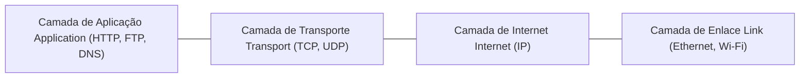

## 1. Introdução: A Arquitetura Invisível do Mundo Conectado

Toda vez que acessamos um site, assistimos a vídeos em streaming, enviamos mensagens instantâneas ou realizamos operações financeiras globais, dependemos de um conjunto universal de protocolos de comunicação: **TCP/IP (Transmission Control Protocol / Internet Protocol)**. O TCP/IP não foi concebido pelo monopólio de uma única empresa nem imposto por um decreto governamental unilateral. Ele representa a convergência de meio século de pesquisa descentralizada, engenharia visionária e cooperação aberta entre cientistas de todo o mundo.

Este artigo analisa a evolução histórica e técnica do TCP/IP: desde suas raízes na Guerra Fria com a comutação de pacotes e o nascimento da ARPANET, até o projeto revolucionário de Vinton Cerf e Robert Kahn, a histórica integração no BSD Unix e a transição para o IPv6.

## 2. O Nascimento da Comutação de Pacotes e a ARPANET

Na década de 1960, as telecomunicações mundiais eram dominadas pela **comutação de circuitos (Circuit Switching)**, o modelo básico da telefonia tradicional. Nesse sistema, estabelece-se um circuito físico ou lógico exclusivo entre duas pontas durante toda a chamada. Esse modelo apresentava vulnerabilidades graves: se uma central caísse ou uma linha fosse rompida, a comunicação cessava totalmente; além disso, o canal ficava ocioso nos momentos de silêncio.

No auge da Guerra Fria, o Departamento de Defesa dos Estados Unidos necessitava de uma rede de comunicações resiliente, capaz de sobreviver a ataques nucleares sem que toda a estrutura entrasse em colapso. De forma independente, três pesquisadores brilhantes conceberam o modelo da **comutação de pacotes (Packet Switching)**:
- **Paul Baran**, na RAND Corporation, projetou redes distribuídas sem nós centrais, capazes de rotear mensagens dinamicamente.
- **Donald Davies**, no National Physical Laboratory (NPL) do Reino Unido, cunhou o termo *"pacote"* e construiu as primeiras redes de teste locais.
- **Leonard Kleinrock**, no MIT, desenvolveu as bases matemáticas da teoria de filas aplicada a redes de dados.

Na comutação de pacotes, os dados são divididos em pequenos blocos padronizados denominados **pacotes**. Cada pacote carrega os endereços de origem e destino e percorre a rede de forma independente através de roteadores. No destino, os pacotes são reordenados para recompor a mensagem original. Caso um link falhe, os roteadores encontram caminhos alternativos automaticamente.

Para testar essa tecnologia, a agência ARPA (depois DARPA) lançou o projeto **ARPANET**. Em 29 de outubro de 1969, transmitiu-se a primeira mensagem entre a UCLA e o Stanford Research Institute (SRI). Embora o sistema tenha travado após digitar apenas "LO" ao tentar escrever "LOGIN", aquele instante marcou o nascimento da Internet. A ARPANET original utilizava o protocolo **NCP (Network Control Program)**.

## 3. O Projeto do TCP/IP: Rumo a Redes de Arquitetura Aberta

A ARPANET provou o sucesso da comutação de pacotes, mas na metade dos anos 1970 novas redes com características físicas totalmente diferentes começaram a surgir: redes de rádio por pacotes (PRNET) para viaturas móveis e redes transatlânticas via satélite (SATNET).

O protocolo NCP havia sido projetado especificamente para a infraestrutura homogênea da ARPANET, sendo incapaz de interconectar redes com mídias e lógicas distintas (Internetworking).

Nesse momento crucial surgiram **Vinton Cerf** e **Robert (Bob) Kahn**. Em maio de 1974, eles publicaram o artigo histórico *"A Protocol for Packet Network Intercommunication"*, lançando a proposta do **TCP (Transmission Control Program)**.

A arquitetura proposta baseava-se nos princípios de **Redes de Arquitetura Aberta (Open-Architecture Networking)**:
1. **Autonomia das redes**: Cada rede constituinte mantém sua tecnologia e topologia próprias sem precisar ser modificada para se conectar à rede global.
2. **Entrega de Melhor Esforço (Best-Effort)**: A rede não oferece garantias absolutas de entrega; o controle de erros e as retransmissões são realizados de ponta a ponta pelos computadores finais.
3. **Roteadores Sem Estado (Stateless Gateways)**: Os roteadores operam de forma rápida e simples, sem armazenar estados de conexões individuais.
4. **Descentralização Operacional**: Não existe uma entidade controladora central para ditar as rotas da rede global.

### A Divisão Histórica: Separação entre TCP e IP (1978)

Originalmente, o TCP reunia em um cabeçalho único tanto a confiabilidade da entrega quanto o roteamento de pacotes. No entanto, experimentos com transmissões de voz em tempo real demonstraram que impor retransmissões rígidas causava latências inaceitáveis.

Em 1978, Cerf, Kahn e Jon Postel tomaram a histórica decisão de separar o protocolo em duas camadas:
- **IP (Internet Protocol)**: Opera na camada de rede, tratando do endereçamento e do roteamento sem conexão de melhor esforço entre redes heterogêneas.
- **TCP (Transmission Control Protocol)**: Opera na camada de transporte, garantindo o controle de fluxo, a ordenação e a integridade dos dados por meio de retransmissões confiáveis.

Simultaneamente, foi introduzido o **UDP (User Datagram Protocol)**, um protocolo leve e sem conexão ideal para serviços de baixa latência como DNS, streaming e comunicações multimídia.

## 4. O "Flag Day" e a Integração no BSD Unix

No início da década de 1980, a suíte TCP/IP consolidou-se no padrão IPv4. Em **1º de janeiro de 1983**, a ARPANET realizou o histórico **"Flag Day"**: todos os computadores da rede foram obrigados a desativar o NCP e migrar em definitivo para o TCP/IP. Essa data é considerada o nascimento oficial da Internet contemporânea.

Entretanto, para que o TCP/IP se popularizasse mundialmente, era fundamental disponibilizar uma implementação de software acessível. A DARPA financiou a equipe do CSRG da Universidade da Califórnia em Berkeley para integrar o TCP/IP diretamente no sistema **BSD Unix**.

A equipe liderada por **Bill Joy** (posterior cofundador da Sun Microsystems) lançou no outono de 1983 o **4.2BSD**, trazendo duas contribuições decisivas:
- Uma pilha TCP/IP nativa e de alto desempenho no próprio núcleo do sistema operacional.
- A pioneira **API de Sockets** (`socket()`, `bind()`, `connect()`, `listen()`, `accept()`).

A API de Sockets simplificou o desenvolvimento de softwares de rede, permitindo que programadores usassem comandos semelhantes aos de manipulação de arquivos comuns. Com isso, universidades e empresas puderam criar redes TCP/IP usando computadores comuns sem a necessidade de equipamentos proprietários caros, consolidando a vitória do TCP/IP sobre o complexo modelo OSI da ISO.

## 5. Fundamentos Técnicos e Modelos Matemáticos de Roteamento

A longevidade do TCP/IP decorre de seu modelo de quatro camadas (Aplicação, Transporte, Internet e Enlace). Essa abstração permite que protocolos como HTTP e SSH funcionem identicamente, quer os dados trafeguem por fibras ópticas, satélites ou conexões celulares 5G.

Na engenharia de tráfego, o roteamento com objetivo de minimizar a latência global de uma rede pode ser formulado matematicamente como o seguinte problema de otimização:

$$ \min \sum_{e \in E} f_e(x_e) $$

Onde:
- $E$ representa o conjunto de todos os enlaces de comunicação (arestas) na rede.
- $x_e$ indica o volume de tráfego que flui pelo enlace $e$.
- $f_e(x_e)$ é uma função convexa de custo que expressa o atraso (propagação e fila) no enlace $e$ em função da carga $x_e$.

Protocolos de roteamento interior como OSPF (baseado no algoritmo de Dijkstra) e exterior como BGP (Border Gateway Protocol) utilizam princípios matemáticos distribuídos para recalcular caminhos ótimos em tempo real perante falhas ou congestionamentos.

## 6. Comercialização, a Revolução da Web e o IPv6

No fim dos anos 1980, a National Science Foundation criou a **NSFNET**, uma espinha dorsal TCP/IP de alta velocidade interligando centros de supercomputação, que substituiu a ARPANET e abriu espaço para o uso comercial da rede.

Entre 1989 e 1991, **Tim Berners-Lee** desenvolveu a World Wide Web no CERN. Ao utilizar a infraestrutura sólida do TCP/IP, a Web transformou uma rede de pesquisa acadêmica em uma plataforma que redefiniu o comércio, a cultura e a vida cotidiana no planeta.

### O Esgotamento de Endereços e a Era do IPv6

O IPv4 original utilizava endereços de 32 bits, comportando cerca de 4,3 bilhões ($2^{32} \approx 4,29 \times 10^9$) de endereços exclusivos. Diante do crescimento exponencial de smartphones e dispositivos IoT, os endereços IPv4 se esgotaram na década de 2010.

A resposta definitiva a esse desafio é o **IPv6**, que adota endereços de 128 bits:

$$ 2^{128} \approx 3,4 \times 10^{38} \text{ endereços} $$

Esse volume astronômico garante endereços praticamente ilimitados para qualquer aplicação futura. Além disso, o IPv6 aprimora o processamento de cabeçalhos nos roteadores e incorpora nativamente a criptografia com o IPsec.

## 7. Conclusão: O Legado da Arquitetura Aberta

O TCP/IP evoluiu de um projeto de comunicações militares na Guerra Fria para se transformar na maior conquista de engenharia colaborativa da história humana.

Sua durabilidade fundamenta-se na inteligência distribuída nas extremidades e na simplicidade no núcleo da rede. O sonho concebido por Vint Cerf e Bob Kahn há mais de cinco décadas continua a conectar a humanidade em um ambiente global, aberto e dinâmico.
