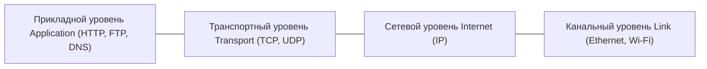

## 1. Введение: Невидимая архитектура цифрового мира

Каждый раз, когда мы открываем веб-браузер, смотрим потоковое видео высокого разрешения, совершаем транзакции на мировых биржах или отправляем мгновенные сообщения, мы полагаемся на универсальный набор правил связи: **TCP/IP (Transmission Control Protocol / Internet Protocol)**. Этот протокол не был изобретен монопольной корпорацией и не был введен государственным указом. Он представляет собой итог полувековых децентрализованных исследований, визионерской инженерии и открытого сотрудничества ученых всего мира.

В этой статье подробно рассматривается история TCP/IP: от зарождения пакетной коммутации в эпоху холодной войны и запуска ARPANET до фундаментальных идей Винтона Серфа и Роберта Кана, исторической интеграции в BSD Unix и перехода на IPv6.

## 2. Рождение пакетной коммутации и ARPANET

В 1960-х годах в глобальных телекоммуникациях доминировала **коммутация каналов (Circuit Switching)** — базовая технология телефонных сетей. При этом подходе между двумя абонентами на все время разговора резервируется выделенный физический или логический канал. Эта система обладала критическими недостатками: при выходе из строя промежуточного узла связь мгновенно обрывалась, а во время пауз в разговоре линия простаивала без пользы.

В разгар холодной войны Министерству обороны США требовалась сеть связи, способная сохранять работоспособность даже в случае масштабного ядерного удара. Независимо друг от друга три выдающихся ученых предложили революционную альтернативу — **пакетную коммутацию (Packet Switching)**:
- **Пол Бэран** в RAND Corporation разработал концепцию распределенной сети необслуживаемых узлов с динамической маршрутизацией.
- **Дональд Дэвис** в Национальной физической лаборатории Великобритании (NPL) ввел сам термин *"пакет"* и построил первые локальные тестовые сети.
- **Леонард Клейнрок** в MIT сформулировал математические основы теории очередей для сетей передачи данных.

При пакетной коммутации поток данных разбивается на небольшие стандартизированные блоки — **пакеты**. Каждый пакет снабжается адресами отправителя и получателя и самостоятельно перемещается по сети через маршрутизаторы. В точке назначения пакеты собираются в исходное сообщение согласно порядковым номерам. Если один из каналов выходит из строя, маршрутизаторы автоматически перенаправляют последующие пакеты по обходным путям.

Для проверки этой теории Агентство перспективных исследовательских проектов (ARPA, позже DARPA) запустило проект **ARPANET**. 29 октября 1969 года состоялась первая передача данных между компьютерами в Калифорнийском университете в Лос-Анджелесе (UCLA) и Стэнфордском исследовательском институте (SRI). Хотя система зависла, успев передать лишь буквы «LO» при попытке ввести слово «LOGIN», это событие ознаменовало рождение компьютерных сетей. Первоначально ARPANET использовала протокол **NCP (Network Control Program)**.

## 3. Проектирование TCP/IP: Концепция открытой сетевой архитектуры

ARPANET доказала состоятельность пакетной коммутации, но вскоре возникли новые вызовы. К середине 1970-х годов появились принципиально новые сети: радиосети пакетной передачи (PRNET) для мобильных объектов и спутниковые сети (SATNET) через Атлантику.

Протокол NCP был жестко привязан к однородной кабельной инфраструктуре ARPANET и не мог объединять сети с совершенно разными физическими характеристиками и принципами передачи (Internetworking).

В этот переломный момент к работе подключились **Винтон (Винт) Серф** и **Роберт (Боб) Кан**. В мае 1974 года они опубликовали фундаментальную статью *"A Protocol for Packet Network Intercommunication"*, в которой сформулировали концепцию протокола **TCP (Transmission Control Program)**.

Их подход опирался на четыре принципа **Открытой сетевой архитектуры (Open-Architecture Networking)**:
1. **Автономия подсетей**: Каждая отдельная сеть сохраняет свою внутреннюю технологию и топологию без необходимости изменений для подключения к общей глобальной сети.
2. **Доставка по принципу «наилучших усилий» (Best-Effort)**: Сама сеть не дает абсолютной гарантии доставки; контроль ошибок и повторная передача возлагаются на конечные узлы (Edge Hosts).
3. **Маршрутизаторы без сохранения состояния (Stateless Gateways)**: Узлы маршрутизации остаются простыми и быстрыми, не сохраняя данных о сессиях отдельных соединений.
4. **Отсутствие централизованного контроля**: В сети нет единого органа управления глобальным трафиком.

### Разделение TCP и IP (1978 год)

Изначально функции маршрутизации и надежной доставки объединялись в общем заголовке TCP. Однако эксперименты с голосовой связью в реальном времени показали, что обязательное ожидание подтверждений и повторная пересылка пакетов приводят к неприемлемым задержкам (Latency).

В 1978 году Серф, Кан, Джон Постел и их коллеги приняли важнейшее решение: разделить TCP на два независимых уровня:
- **IP (Internet Protocol)**: Действует на сетевом уровне; отвечает за адресацию и негарантированную доставку пакетов между разнородными сетями.
- **TCP (Transmission Control Protocol)**: Действует на транспортном уровне; обеспечивает надежную сквозную передачу, сборку фрагментов в строгом порядке и контроль скорости передачи.

Одновременно появился протокол **UDP (User Datagram Protocol)** — легкий протокол без установления соединения, ставший фундаментом для DNS, потокового мультимедиа и сетевых игр.

## 4. «Flag Day» и интеграция в BSD Unix

К началу 1980-х годов стек TCP/IP оформился в стандарте IPv4. **1 января 1983 года** в ARPANET произошел так называемый **«Flag Day» (День флага)**: все подключенные компьютеры были обязаны единовременно отключить устаревший NCP и перейти на TCP/IP. Эта дата считается официальным днем рождения современного Интернета.

Однако для распространения технологии требовалось общедоступное программное обеспечение. DARPA профинансировала исследовательскую группу CSRG в Калифорнийском университете в Беркли для внедрения стека TCP/IP непосредственно в операционную систему **BSD Unix**.

Команда под руководством **Билла Джоя** (будущего сооснователя Sun Microsystems) осенью 1983 года выпустила версию **4.2BSD**, в которой появились два ключевых новшества:
- Высокопроизводительный нативный сетевой стек TCP/IP в ядре операционной системы.
- Интерфейс **сокетов Беркли (Sockets API)** (`socket()`, `bind()`, `connect()`, `listen()`, `accept()`).

Благодаря API сокетов сетевое программирование стало столь же понятным, как обычная работа с файлами в Unix. Любой университет или исследовательский центр мог подключиться к сети TCP/IP на доступных рабочих станциях без покупки дорогостоящего проприетарного оборудования. Это обеспечило TCP/IP окончательную победу над бюрократизированной и громоздкой моделью OSI.

## 5. Технические принципы и математические модели маршрутизации

Непревзойденная устойчивость TCP/IP объясняется 4-уровневой моделью абстракции (прикладной, транспортный, сетевой и канальный уровни). Протоколы верхних уровней (HTTP, SSH, DNS) работают одинаково надежно независимо от того, передаются ли биты по оптоволокну, спутниковому каналу или сотовой сети 5G.

С математической точки зрения маршрутизация трафика с минимизацией совокупной задержки в масштабах всей сети формулируется как задача оптимизации:

$$ \min \sum_{e \in E} f_e(x_e) $$

Где:
- $E$ — множество всех линий связи (ребер) топологии сети.
- $x_e$ — объем потока данных, проходящий через линию $e$.
- $f_e(x_e)$ — выпуклая функция затрат, отражающая суммарную задержку на линии $e$ в зависимости от нагрузки $x_e$.

Протоколы внутренней маршрутизации (такие как OSPF на базе алгоритма Дейкстры) и протоколы междоменной маршрутизации (BGP) используют распределенные алгоритмы, позволяющие маршрутизаторам автономно находить оптимальные пути и мгновенно перенаправлять пакеты при сбоях оборудования.

## 6. Коммерциализация, рождение Веба и переход на IPv6

В конце 1980-х годов Национальный научный фонд США (NSF) развернул магистральную сеть **NSFNET** на базе TCP/IP, связавшую суперкомпьютерные центры. NSFNET заменила ARPANET и открыла путь для коммерческих провайдеров.

В 1989–1991 годах **Тим Бернерс-Ли** в ЦЕРН разработал Всемирную паутину (World Wide Web: HTTP, HTML, URL). Развернутый поверх стабильного стека TCP/IP, Веб превратил академическую сеть в главную движущую силу глобальной экономики, культуры и общения.

### Дефицит адресов и переход к IPv6

Исходный стандарт IPv4 использовал 32-битные адреса, предоставляя около 4,3 миллиарда ($2^{32} \approx 4,29 \times 10^9$) уникальных адресов. К 2010-м годам из-за бума смартфонов и интернета вещей пул свободных адресов IPv4 был полностью исчерпан.

Окончательным решением проблемы стал протокол **IPv6** со 128-битной адресацией:

$$ 2^{128} \approx 3,4 \times 10^{38} \text{ адресов} $$

Это колоссальное число позволяет выделить триллионы уникальных IP-адресов буквально на каждый квадратный миллиметр поверхности Земли. Кроме того, IPv6 упрощает обработку заголовков пакетов и включает встроенную поддержку безопасности IPsec.

## 7. Заключение: Триумф открытой архитектуры

История TCP/IP — это путь от военной оборонной разработки времен холодной войны до величайшего открытого инженерного творения человечества.

Его непреходящая ценность заключается в философии простоты внутри сети и интеллектуальности на ее границах. Видение Винта Серфа и Боба Кана объединило человечество в единое информационное пространство, открыв путь к бесконечным технологическим инновациям.
