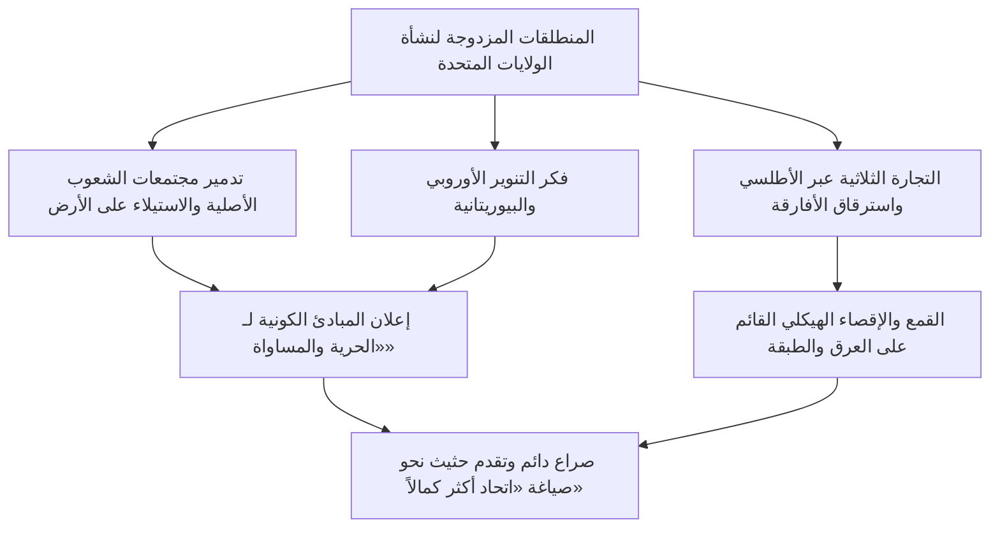
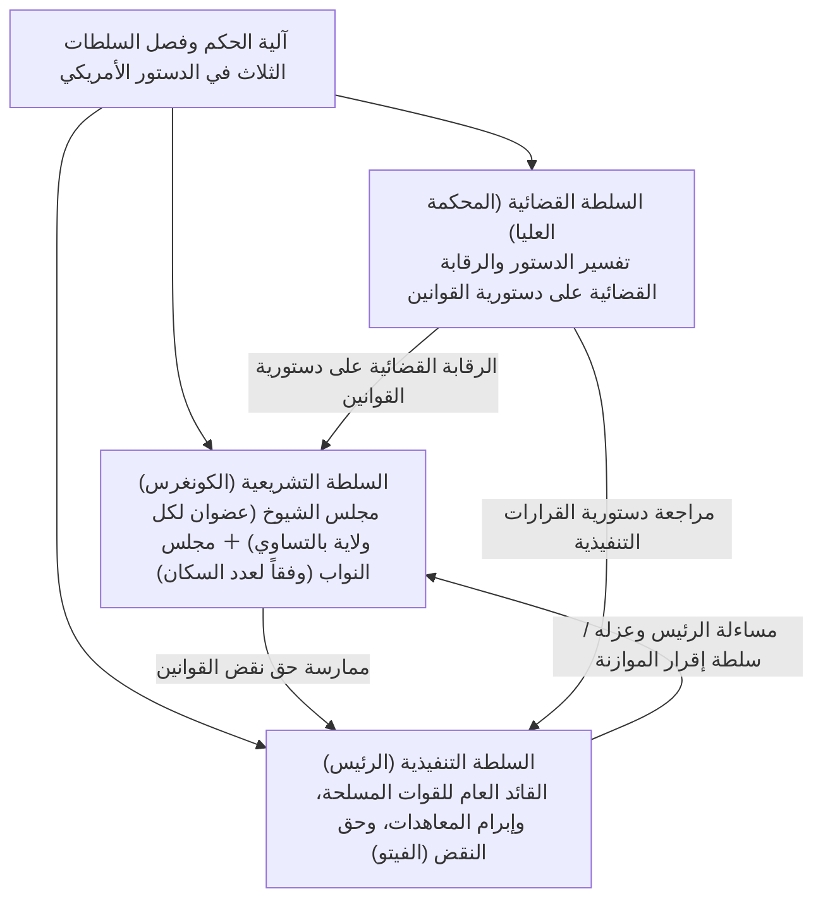
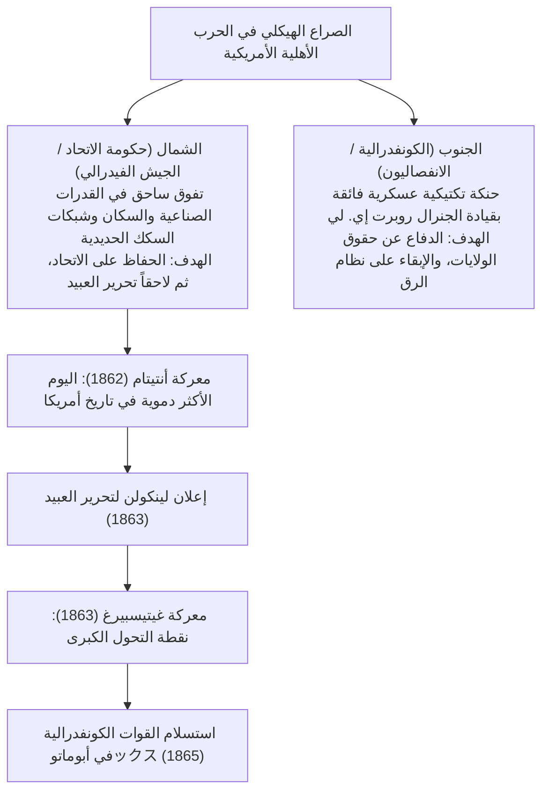
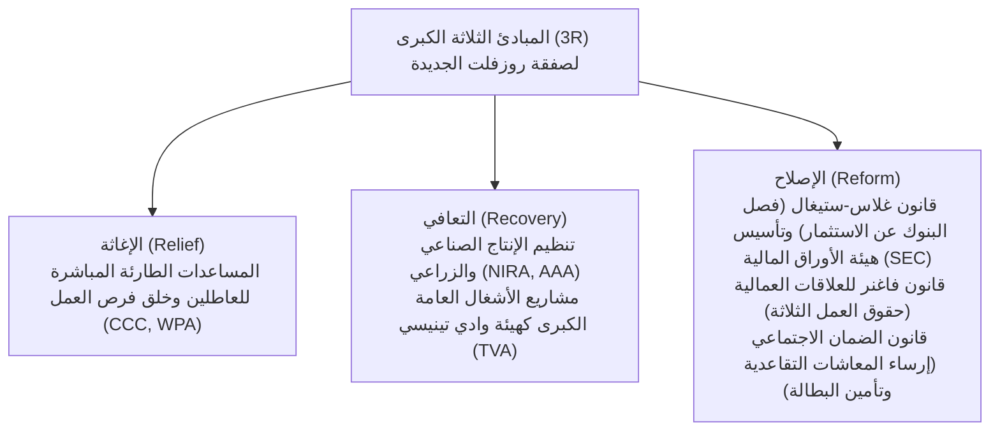
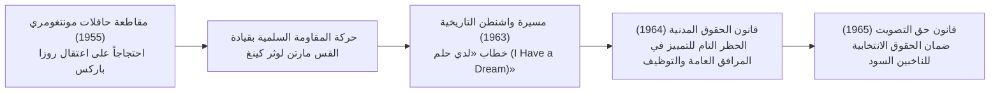
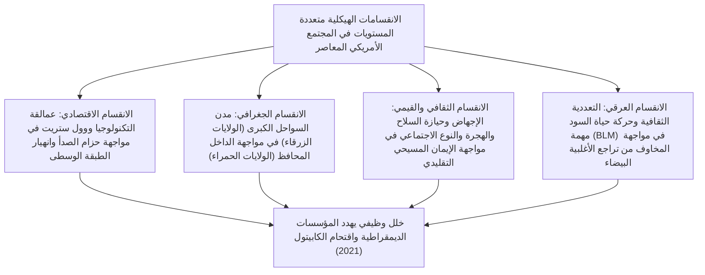

## 1. مقدمة: الولايات المتحدة الأمريكية بوصفها دولة-تجربة

### 1.1 وهم «العالم الجديد» وواقع حضارات الشعوب الأصلية

عند الحديث عن تاريخ الولايات المتحدة الأمريكية، سادت لفترة طويلة سردية أسطورية تعتبر البلاد «أرض الميعاد التي استصلحها الأوروبيون البيض الفارون بحثاً عن الحرية في برية عذراء غير مأهولة». غير أن التطورات التي شهدتها حقول الأنثروبولوجيا والدراسات التاريخية منذ النصف الثاني من القرن العشرين كشفت بجلاء عن حقيقة أن هذه القارة شهدت، لآلاف السنين قبل وصول الأوروبيين، ازدهار حضارات أصيلة ومتطورة للغاية للشعوب الأصلية (الأمريكيين الأصليين).

لقد كانت هناك منظومة بيئية واجتماعية غنية ومتنوعة، تجلت في حضارة بناة التلال التي يمثلها الموقع الحضري الهائل في كاهوكيا (Cahokia) بوادي المسيسيبي، ومجمعات المساكن الصخرية الشاهقة المنحوتة بإتقان لثقافة الأناسازي (شعب بويبلو) في الجنوب الغربي، وكونفدرالية الإيروكوا (Haudenosaunee) في الشمال الشرقي، حيث اتحدت خمس قبائل لبناء نظام فيدرالي ديمقراطي متقدم. وعقب وصول كولومبوس عام 1492، تسببت الأوبئة الفتاكة الوافدة من أوروبا مثل الجدري والحصبة والإنفلونزا (فيما يُعرف بـ «التبادل الكولومبي»)، مقترنة بحملات الغزو والاستعمار الوحشية، في فناء ما بين 80% إلى 90% من السكان الأصليين؛ ويُعد الإدراك التاريخي الصارم بأن «العالم الجديد» شُيّد على أنقاض هذا الدمار نقطة الانطلاق الجوهرية لفهم تاريخ أمريكا الحديث.

---

### 1.2 الآباء الحجاج، وميثاق مايفلاور، والبصمة الروحية للبيوريتانية

في أعقاب تأسيس مستوطنة جيمستاون (مستعمرة فرجينيا) عام 1607، تمثل الحجر الأساس الروحي للهوية القومية الأمريكية في وصول طائفة البيوريتانيين الانفصاليين (الآباء الحجاج - Pilgrim Fathers) الذين هبطوا في خليج ماساتشوستس على متن سفينة مايفلاور (Mayflower) عام 1620.

وقبيل النزول إلى الشاطئ، وُقّع على متن السفينة **«ميثاق مايفلاور (Mayflower Compact)»**، الذي مثّل إعلاناً تاريخياً فارقاً للحكم الذاتي في تاريخ البشرية؛ فبدلاً من الخضوع لحكم مفروض من أعلى بواسطة الملوك أو الإقطاعيين، نص الميثاق على: **«تأسيس هيئة سياسية مدنية لحكم أنفسهم، وسن قوانين عادلة ومتساوية ترتكز على التوافق الطوعي للأفراد الأحرار (العقد الاجتماعي)»**.

وقد أرسى زعيمهم جون وينثروب مفهوم «مدينة فوق تل (A City upon a Hill)» ــ وهو إحساس جارف بالرسالة الدينية والمدنية يقوم على أن مجتمع البيوريتانيين، المرتبطين بعهد مع الله، يجب أن يكون منارة ونموذجاً يُحتذى به للعالم بأسره ــ وهو المفهوم الذي تحول لاحقاً إلى الحمض النووي التأسيسي لعقيدة «الاستثنائية الأمريكية (American Exceptionalism)»، التي تؤمن بأن الولايات المتحدة تحمل رسالة مقدسة واستثنائية لقيادة العالم.

---

## 2. من الحقبة الاستعمارية إلى الثورة التحريرية وميلاد الدستور الأمريكي

### 2.1 تطور المستعمرات الثلاث عشرة ونهاية حقبة «الإهمال الحميد»

طوّرت المستعمرات البريطانية الثلاث عشرة التي تأسست على طول ساحل المحيط الأطلسي هياكل اقتصادية واجتماعية متباينة للغاية: فكانت مستعمرات نيو إنجلاند الشمالية ترتكز على التجارة وصيد الأسماك والزراعة الأسرية المحدودة متسلحة بالعقيدة البيوريتانية؛ والمستعمرات الوسطى تشكل فسيفساء عرقية ودينية تعتمد على زراعة الحبوب؛ بينما هيمنت على المستعمرات الجنوبية المزارع الشاسعة (المعروفة بنظام البلانتيشن) لزراعة التبغ والأرز والنيلي بالاعتماد القسري على السخرة واسترقاق السود المنحدرين من أصول إفريقية.

وحتى منتصف القرن الثامن عشر، انتهج التاج البريطاني تجاه هذه المستعمرات سياسة أُطلق عليها اسم **«الإهمال الحميد (Salutary Neglect)»**، حيث ترك لها حكماً ذاتياً فعلياً وتجنب التدخل الصارم في شؤونها الداخلية. غير أن انتصار بريطانيا في «حرب السنوات السبع» ــ ولا سيما على جبهتها في أمريكا الشمالية المعروفة باسم «الحرب الفرنسية والهندية (1754–1763)» ــ ألقى على كاهل الخزانة البريطانية ديوناً حربية باهظة وهائلة.

وعلى إثر ذلك، اتجه البرلمان البريطاني نحو فرض ضرائب باهظة على المستعمرات بذريعة المشاركة في تغطية تكاليف الدفاع وحمايتها:
- **قانون السكر (1764)** و**قانون الطابع (1765)**: فرضا ضرائب طوابع على الصحف والكتيبات، وحتى أوراق اللعب والوثائق القانونية.
- واجه سكان المستعمرات هذه الإجراءات بغضب عارم ومقاومة شرسة، رافعين شعارهم الدستوري الشهير: **«لا ضريبة بدون تمثيل (No taxation without representation)»**، ونظموا حملات مقاطعة واسعة للبضائع البريطانية.
- ومع تصاعد وتيرة الأحداث إثر مذبحة بوسطن عام 1770، ثم حادثة «حفلة شاي بوسطن» عام 1773 (حين أُلقيت شحنات شاي شركة الهند الشرقية في مياه الميناء)، ردت بريطانيا بقبضة عسكرية قمعية وسنت تشريعات عقابية صارمة عُرفت بـ «القوانين الجائرة (Intolerable Acts)»، مما جعل الصدام المسلح أمراً حتمياً لا مناص منه.

---

### 2.2 توماس بين وكتاب «الحس السليم» وإعلان الاستقلال (1776)

في أبريل من عام 1775، دوّت الطلقات الأولى في معركتي ليكسينغتون وكونكورد، مؤذنة باندلاع حرب الاستقلال الأمريكية. في ذلك الوقت، كان العديد من سكان المستعمرات لا يزالون يترددون بين الولاء للتاج البريطاني وبين خيار الانفصال والاستقلال التام.

وجاء الحسم المباغت لهذه الحيرة في يناير 1776 مع صدور كتيب **«الحس السليم (Common Sense)»**، الذي نشره توماس بين (Thomas Paine) دون الكشف عن اسمه في البداية. وبأسلوب بياني بليغ ولغة متقدة ومفهومة للعامة، بَيّن بين عبثية بقاء جزيرة صغيرة مثل بريطانيا في موقع الهيمنة الأبدية على قارة شاسعة، وأثبت كيف أن الملكية الوراثية بطبيعتها نظام جائر ينتهك الحقوق الطبيعية للإنسان؛ فبيع من الكتيب مئات الآلاف من النسخ مشعلاً حماسة الاستقلال في أرجاء البلاد.

وفي الرابع من يوليو 1776، صادق المؤتمر القاري الثاني على **«وثيقة إعلان الاستقلال الأمريكي (Declaration of Independence)»** التي صاغ مسودتها توماس جيفرسون:

> «إننا نعتبر هذه الحقائق بديهية بذاتها: أن جميع الناس خُلقوا متساوين، وأن خالقهم قد وهبهم حقوقاً معينة غير قابلة للتصرف، منها الحق في الحياة والحرية والسعي وراء السعادة؛ وأنه بغية ضمان هذه الحقوق، تُقام الحكومات بين البشر مستمدةً سلطاتها العادلة من رضا المحكومين.»

شكل هذا الإعلان التاريخي الرفيع، المستلهم من نظرية العقد الاجتماعي والحقوق الطبيعية لجون لوك، تأصيلاً شرعياً لحق الشعوب في مقاومة الاستبداد والثورة عليه، ليغدو صرحاً خالداً للحرية الكونية في سجل الإنسانية.

خاض الجيش القاري بقيادة القائد العام جورج واشنطن حرب استنزاف ضارية متحملاً نقص الإمدادات القاسي وبرد الشتاء القارس، وشكل الانتصار الباهر في معركة ساراتوغا (1777) نقطة تحول حاسمة أسفرت عن إبرام تحالفات عسكرية مع فرنسا وإسبانيا وهولندا. وفي عام 1781، نجحت القوات المشتركة في محاصرة القوة البريطانية الرئيسية في معركة يوركتاون وإجبارها على الاستسلام، لتعترف بريطانيا بموجب معاهدة باريس (1783) باستقلال الولايات المتحدة الأمريكية اعترافاً كاملاً وغير مشروط.

---

### 2.3 إخفاق «مواد الاتحاد الكونفدرالي» ومؤتمر فيلادلفيا الدستوري (1787)

في أعقاب الاستقلال، لم تكن الولايات المتحدة في واقع أمرها سوى كونفدرالية رخوة للغاية تجمع ثلاث عشرة دولة ذات سيادة مستقلة، تستند إلى «مواد الاتحاد الكونفدرالي (Articles of Confederation)» التي دخلت حيز التنفيذ عام 1781:
- افتقرت الحكومة المركزية (مؤتمر الكونفدرالية) إلى سلطة فرض الضرائب، ولم تكن تمتلك جيشاً نظامياً دائماً، ولا صلاحية تنظيم التجارة الخارجية أو بين الولايات.
- وحين اندلعت «ثورة شيز (Shays' Rebellion)» عام 1786 ــ وهي تمرد مسلح قاده مزارعون يرزحون تحت وطأة الديون الثقيلة والكساد الاقتصادي بعد الحرب ــ عجزت حكومة الاتحاد حتى عن إرسال قوات لإخماد التمرد، مما جعل شبح انهيار الدولة وتفككها خطراً ماثلاً للعيان.

وفي صيف عام 1787، اجتمع 55 مندوباً في قاعة الاستقلال بفيلادلفيا (من بينهم جيمس ماديسون، وألكسندر هاملتون، وبنجامين فرانكلين، وغيرهم من «الآباء المؤسسين»)، حيث انكبوا على صياغة **«دستور الولايات المتحدة الأمريكية»** المعمول به حتى اليوم.

- **التسوية الكبرى (تسوية كونيتيكت)**: دمجت بين رغبة الولايات الصغيرة في التمثيل المتساوي (خطة نيوجيرسي) ومطلب الولايات الكبرى في التمثيل النسبي حسب السكان (خطة فرجينيا)، وأسفرت عن إنشاء برلمان من مجلسين: «مجلس الشيوخ» (عضوان بالتساوي لكل ولاية) و«مجلس النواب» (تمثيل متناسب طردياً مع عدد السكان).
- **حساب السكان المستعبدين (تسوية ثلاثة أخماس)**: بغية الوصول إلى توافق يحد من النفوذ السياسي المفرط للولايات الجنوبية، تم التوصل إلى حل وسط تاريخي يُحتسب بموجبه كل فرد مستعبد بمقدار «ثلاثة أخماس» شخص حر لأغراض توزيع المقاعد في مجلس النواب وتقدير الضرائب المباشرة.
- **الضوابط والتوازنات (فصل السلطات)**: انطلاقاً من فلسفة مونتسكيو، وُزعت الصلاحيات بين الرئاسة، والكونغرس، والقضاء الفيدرالي، مع بناء منظومة مؤسسية محكمة من الكوابح والموازنات تضمن عدم استئثار أي فرد أو مؤسسة بسلطات ديكتاتورية مطلقة.

---

## 3. التوسع الإقليمي، و«المصير الحتمي»، واضطرابات الحرب الأهلية

### 3.1 «المصير الحتمي» والتوسع الإقليمي عبر القارة

خلال النصف الأول من القرن التاسع عشر، اندفعت الولايات المتحدة بوتيرة مذهلة للتوسع غرباً:
- **1803: صفقة شراء لويزيانا**: اشترى الرئيس توماس جيفرسون أراضي لويزيانا الشاسعة غرب نهر المسيسيبي من نابليون بونابرت بمبلغ زهيد لم يتجاوز 15 مليون دولار، مما ضاعف المساحة الإجمالية للدولة بين عشية وضحاها.
- **1823: مبدأ مونرو**: أعلن الرئيس جيمس مونرو مبدأ العزلة وعدم التدخل المتبادل، مؤكداً أن «القوى الأوروبية محظور عليها التدخل في شؤون القارة الأمريكية، وفي المقابل لن تتدخل الولايات المتحدة في النزاعات الأوروبية».
- **المصير الحتمي (Manifest Destiny)**: تمثلت في أيديولوجيا توسعية استحوذت على الوجدان القومي، قائمة على الزعم بأن «التوسع واستيطان أراضي قارة أمريكا الشمالية حتى سواحل المحيط الهادئ ونشر مبادئ الحرية والديمقراطية فيها هو تفويض إلهي ورسالة مقدرة حتمياً على الأمة الأمريكية».

وعلى الجانب المظلم من هذا التوسع الإقليمي، سُحقت المجالات الحيوية للشعوب الأصلية بلا رحمة؛ فبموجب «قانون ترحيل الهنود» لعام 1830، الذي قاده الرئيس أندرو جاكسون، رُحِّلت القبائل الخمس الكبرى ــ وفي مقدمتها قبيلة الشيروكي ــ قسراً من مواطن أجدادها في الغابات الشرقية، ليقطع أبناؤها آلاف الكيلومترات سيراً على الأقدام وسط صقيع الشتاء القارس نحو أوكلاهوما («إقليم الهنود»). وقضى الآلاف منهم نحبهم جراء الجوع والمرض والإرهاق في تلك المسيرة المأساوية التي خُلّدت في الذاكرة التاريخية باسم **«درب الدموع (Trail of Tears)»**.

وبانتصارها في الحرب المكسيكية الأمريكية (1846–1848)، ضمت الولايات المتحدة كاليفورنيا وتكساس ونيومكسيكو، وتلا ذلك حمى الذهب في كاليفورنيا عام 1848، لتكتمل بذلك ملامح دولة قارية تمتد أراضيها من شواطئ الأطلسي إلى أعماق الهادئ.

---

### 3.2 أزمة العبودية وتفاقم الانقسام الوطني

ومع كل توسع إقليمي نحو الغرب، طفا على السطح سؤال مصيري كاد أن يعصف بكيان الاتحاد برمته: **«هل سيُسمح بنظام الرق في الأقاليم حديثة الانضمام أم سيُحظر تماماً؟»**

- **اقتصاد الشمال**: تصاعدت فيه الثورة الصناعية، وازدهرت الصناعات التحويلية والتجارة والقطاع المصرفي بالاعتماد على العمالة المأجورة الحرة، مما دفعه إلى تبني سياسات الحماية الجمركية لحماية سوقه المحلية.
- **اقتصاد الجنوب**: استند إلى مزارع القطن الضخمة في ظل ما عُرف بـ «مملكة القطن (King Cotton)»، واعتمد اقتصادياً بصورة كلية على السخرة والعمل المجاني لما يقرب من أربعة ملايين عبد من أصول إفريقية، وكان ينادي بحرية التجارة لتصدير محاصيله الزراعية إلى بريطانيا وغيرها من الأسواق الدولية.

وللحفاظ على التوازن الحرج للقوى بين «الولايات الحرة» و«ولايات الرق» في الكونغرس الفيدرالي، توالت الحلول التوفيقية المؤقتة، مثل تسوية ميزوري لعام 1820 (التي حظرت العبودية شمال خط عرض 36°30')، وتسوية عام 1850 (التي شددت قانون العبيد الفارين).

إلا أن صدور قانون كانساس-نبراسكا عام 1854 (الذي اعتمد مبدأ السيادة الشعبية تاركاً لسكان الأقاليم تقرير مصير العبودية بالاقتراع) فجر نزاعاً دموياً عُرف بـ «كانساس الدامية». وفضلاً عن ذلك، أصدرت المحكمة العليا عام 1857 **«حكم دريد سكوت (Dred Scott v. Sandford)»** المثير للجدل، الذي قضى بأن «السود ليسوا مواطنين بموجب الدستور ولا يملكون أية حقوق»، وأن «حظر الكونغرس للعبودية في الأقاليم الفيدرالية يُعد أمراً غير دستوري»، الأمر الذي أثار موجة سخط وغضب عارمة لدى الرأي العام المناهض للعبودية في الشمال.

---

### 3.3 الحرب الأهلية الأمريكية (1861–1865): إعادة التوحيد بالدماء وإلغاء العبودية

في انتخابات الرئاسة لعام 1860، فاز مرشح الحزب الجمهوري أبراهام لينكولن (Abraham Lincoln)، الذي تعهد في برنامجه الانتخابي بـ «منع تمدد العبودية نحو أراضي الغرب الجديد». وعلى إثر ذلك، أعلنت سبع ولايات جنوبية، في مقدمتها ولاية كارولاينا الجنوبية، انفصالها عن الاتحاد وتشكيل «الولايات الكونفدرالية الأمريكية».

وفي أبريل 1861، أطلقت المدفعية الكونفدرالية نيرانها على قلعة سمتر (Fort Sumter)، لتندلع رسمياً نيران **«الحرب الأهلية الأمريكية (American Civil War)»**.

ارتقى لينكولن بطبيعة الحرب من مجرد «إخماد تمرد داخلي لصون الاتحاد» إلى «ملحمة مقدسة من أجل حرية الإنسانية»:
- **1 يناير 1863: إعلان تحرير العبيد (Emancipation Proclamation)**: قضى بالتحرير الفوري لجميع العبيد في المناطق الثائرة في الجنوب؛ ومكن ذلك من انضمام مئات الآلاف من الجنود السود إلى صفوف جيش الاتحاد (نحو 180 ألف مقاتل)، وقطع الطريق أخلاقياً ودبلوماسياً على أي تدخل من بريطانيا أو فرنسا لصالح الكونفدرالية.
- **نوفمبر 1863: خطاب غيتيسبيرغ الشهير**: الذي أكد فيه لينكولن ضرورة ضمان **«ألا تفنى حكومة الشعب، بالشعب، ولأجل الشعب (Government of the people, by the people, for the people) من على وجه البسيطة»**.

وبعد حرب استنزاف شاملة وسياسة الأرض المحروقة (مسيرة الجنرال شيرمان إلى البحر)، استسلم قائد القوات الجنوبية الجنرال لي للجنرال غرانت في أبوماتوكس بولاية فرجينيا في أبريل 1865. وبعد مأساة إنسانية هي الأكبر في تاريخ الأمة أسفرت عن مصرع ما يزيد على 600 ألف قتيل، تمت المصادقة على التعديل الثالث عشر (إلغاء العبودية)، والتعديل الرابع عشر (المحاكمة العادلة والمساواة أمام القانون)، والتعديل الخامس عشر (كفالة حق التصويت بغض النظر عن العرق)، لتتحول الولايات المتحدة من مجرد «كونفدرالية ولايات» إلى «دولة قومية واحدة لا تتجزأ».

بيد أنه مع إسدال الستار على حقبة إعادة الإعمار (Reconstruction)، سنت الولايات الجنوبية «قوانين جيم كرو (Jim Crow Laws)» لفرض الفصل العنصري، لتبدأ حقبة مظلمة من التمييز الشديد ضد السود وعمليات الإعدام الميداني دون محاكمة (اللينش) على يد جماعات كو كلوكس كلان (KKK).

---

## 4. العصر المذهب، والثورة الصناعية، وبزوغ الإمبريالية

### 4.1 صعود الرأسمالية الاحتكارية و«العصر المذهب»

منذ نهاية الحرب الأهلية وحتى مطلع القرن العشرين، شهد الاقتصاد الأمريكي طفرة صناعية هائلة لا مثيل لها في التاريخ البشري. وقد أطلق الأديب مارك توين على هذه الحقبة اسم **«العصر المذهب (Gilded Age)»**، في إشارة مجازية إلى عصر يلمع بالذهب من سطحه الخارجي بينما ينخر الفساد والتعفن جوهره الداخلي:

- شكّل اكتمال أول خط سكة حديد عابر للقارات عام 1869 انطلاقة لدمج أرجاء البلاد كافة في سوق داخلية قومية عملاقة وموحدة.
- **احتكارات «بارونات اللصوص» (Robber Barons)**:
  - سيطرة جون دي. روكفلر عبر شركته «ستاندرد أويل» على أكثر من 90% من عمليات تكرير النفط في الولايات المتحدة.
  - إمبراطورية الصلب التي شيدها أندرو كارنيغي («كارنيغي للصلب»).
  - تركز رأس المال المالي وتأسيس التكتلات الاحتكارية الكبرى (تراست) بزعامة جيه بي مورغان (مثل تأسيس شركة يو إس ستيل).
- ساهمت شبكات الكهرباء لتوماس إديسون، واختراع الهاتف لألكسندر غراهام بيل، وخطوط الإنتاج المتسلسلة لسيارات هنري فورد («الفوردية»)، في دفع الإنتاج الصناعي الأمريكي ليتجاوز بريطانيا وألمانيا بفارق شاسع، وتتبوأ الولايات المتحدة الصدارة بوصفها القوة الصناعية الأولى عالمياً.

وعلى النقيض من ذلك، أدى التوزيع غير العادل للثروات وظروف العمل المزرية إلى اندلاع إضرابات عمالية دامية كإضراب هومستيد وإضراب بولمان؛ في حين أفضى تدفق عشرات الملايين من المهاجرين الجدد القادمين من أوروبا (الإيطاليين والأيرلنديين واليهود من أوروبا الشرقية) إلى تكدسهم في أحياء عشوائية فقيرة في كبريات المدن.

---

### 4.2 زوال الجبهة الغربية (الفرونتير) والاستحواذ على أراضٍ وراء البحار

في تعداد السكان لعام 1890، أعلن المؤرخ فريدريك جاكسون تيرنر «زوال الجبهة الغربية (الفرونتير - Frontier)». ومع اندثار تلك الحدود الاستيطانية الغربية التي صقلت الروح الديمقراطية والحيوية الأمريكية، تحولت أنظار الولايات المتحدة بصورة حتمية صوب الأسواق الخارجية في المحيط الهادئ وأمريكا اللاتينية (متأثرة بنظرية القوة البحرية للأدميرال ألفريد ثاير ماهان):

- **1898: الحرب الأمريكية الإسبانية**: اتخذت الولايات المتحدة من حادثة انفجار البارجة «مين (USS Maine)» ذريعة لخوض الحرب ضد إسبانيا، وحققت نصراً حاسماً في غضون بضعة أشهر، لتستولي على الفلبين وغوام وبورتوريكو، وتضم هاواي، متحولة بين عشية وضحاها إلى إمبراطورية بحرية كبرى في المحيط الهادئ.
- **مبدأ الباب المفتوح (1899)**: طرح وزير الخارجية جون هاي مبدأ «فتح الأبواب، وتكافؤ الفرص، وسلامة الأراضي الصينية» في مواجهة اقتسام القوى الكبرى للصين، تأميناً لوصول التجارة الأمريكية إلى الأسواق الآسيوية.

وعلى الصعيد الداخلي، ولمواجهة تغول الاحتكارات الرأسمالية والفساد السياسي، قاد الرئيس ثيودور روزفلت (محاربة التراست وحماية البيئة) والرئيس وودرو ويلسون **«الحركة التقدمية (Progressivism)»**، التي أثمرت عن تفعيل قانون شيرمان لمكافحة الاحتكار، وتأسيس نظام الاحتياطي الفيدرالي (FRS)، وإقرار حق المرأة في التصويت بموجب التعديل التاسع عشر للدستور.

---

## 5. الحربان العالميتان، والكساد الكبير، وإرساء الهيمنة الأمريكية (باكس أمريكانا)

### 5.1 الحرب العالمية الأولى و«عشرينات القرن العشرين الصاخبة»

عند اندلاع الحرب العالمية الأولى عام 1914، التزمت الولايات المتحدة الحياد في البداية، وتحولت بفضل تصدير الأسلحة والإمدادات إلى القوى الأوروبية المتحاربة من دولة مدينة إلى أكبر دولة دائنة في العالم. لكن إعلان ألمانيا «حرب الغواصات غير المحدودة» واعتراض «برقية تسيمرمان» دفعا واشنطن إلى إعلان الحرب ودخول المعترك العالمي عام 1917.

طرح الرئيس ويلسون **«نقاط السلام الأربع عشرة»**، داعياً إلى إنهاء الدبلوماسية السرية، وحق الشعوب في تقرير مصيرها، وتأسيس عصبة الأمم. بيد أن مجلس الشيوخ الأمريكي، مدفوعاً بالنزعة الانعزالية المتجذرة، رفض التصديق على معاهدة فرساي وآثر عدم الانضمام إلى عصبة الأمم.

وفي عقد العشرينيات، عاشت الولايات المتحدة حقبة ذهبية عُرفت باسم **«عشرينات القرن العشرين الصاخبة (Roaring Twenties)»**، التي شهدت صعود مجتمع الاستهلاك الجماهيري غير المسبوق:
- انتشرت أجهزة الراديو، وسيارة فورد طراز (T)، والسينما، وموسيقى الجاز، والأجهزة المنزلية الكهربائية في منازل الطبقة الوسطى.
- خيمت حمى المضاربات المالية على بورصة وول ستريت، وساد اعتقاد وهمي بـ «الرخاء الأبدي المستدام».
- ومن جهة أخرى، أدى فرض حظر الكحول (التعديل الثامن عشر للدستور) إلى تغول الجريمة المنظمة وصعود المافيا (بزعامة آل كابوني)، بينما ألقت النزعات المعادية للأجانب والتعصب العرقي والديني (انبعاث تنظيم كو كلوكس كلان وإقرار قوانين الحصص للمهاجرين) بظلالها القاتمة على المجتمع.

---

### 5.2 الكساد الكبير وسياسة «الصفقة الجديدة» (النيوديل)

في 24 أكتوبر 1929، المعروف بـ «الخميس الأسود (Black Thursday)»، شهدت بورصة نيويورك في وول ستريت انهياراً مروعاً للأسهم، معلناً انطلاق عاصفة الكساد الكبير التي هزت أركان الاقتصاد العالمي.
أفلست آلاف البنوك في أنحاء البلاد، وقفزت معدلات البطالة إلى 25% (عاطل عن العمل بين كل أربعة أفراد)، واجتاحت العواصف الترابية («قصعة الغبار» - Dust Bowl) الغرب الأوسط دافعة المزارعين إلى حافة التشرد والمجاعة، بينما باءت سياسات الرئيس هربرت هوفر القائمة على مبدأ «دعه يعمل» بفشل ذريع.

وفور توليه مقاليد الرئاسة عام 1933، سارع فرانكلين دي. روزفلت (FDR) إلى إطلاق وتنفيذ سياسة **«الصفقة الجديدة (New Deal)»**.

لقد شكّلت «الصفقة الجديدة»، التي استبقت نظريات الاقتصاد الكينزي عبر التدخل الحكومي النشط في السوق وإرساء الدعائم المؤسسية لدولة الرفاه الاجتماعي، نقلة نوعية وسعت الصلاحيات الرئاسية بصورة غير مسبوقة، وأضحت المرجعية التأسيسية لليبرالية الأمريكية المعاصرة.

---

### 5.3 الحرب العالمية الثانية وبسط الهيمنة العالمية

في 7 ديسمبر 1941، إثر الهجوم المباغت للبحرية اليابانية على بيرل هاربر، دخلت الولايات المتحدة الحرب العالمية الثانية بكامل ثقلها.

أعلنت واشنطن نفسها **«ترسانة الديمقراطية (Arsenal of Democracy)»**، وحوّلت قدراتها الصناعية المدنية دفعة واحدة نحو الإنتاج الحربي والعسكري؛ فتحولت مصانع السيارات إلى إنتاج الدبابات والطائرات الحربية، وتدفقت النساء إلى المصانع كقوة عاملة رئيسية (متجسدة في الرمز الشهير «روزي الفاتقة» - Rosie the Riveter).

- تحقيق النصر في الجبهة الأوروبية عبر إنزال نورماندي التاريخي (1944) وإسقاط ألمانيا النازية.
- اعتماد استراتيجية «القفز بين الجزر» في مسرح عمليات المحيط الهادئ وإرغام اليابان على الاستسلام.
- تطوير القنبلة الذرية عبر المشروع فائق السرية «مشروع مانهاتن»، وإلقاؤها على مدينتي هيروشيما وناغازاكي.

ومع وضع أوزار الحرب العالمية الثانية، كانت الولايات المتحدة تستأثر وحدها بنصف الإنتاج الصناعي العالمي، وتستحوذ على أكثر من 70% من احتياطيات الذهب العالمية، وتتربع كقوة نووية وحيدة في العالم آنذاك.
وفي عام 1944، أرست اتفاقية بريتون وودز **النظام النقدي الدولي المستند إلى الدولار الأمريكي كعملة احتياط وربط رئيسية (صندوق النقد والبنك الدوليان)**، وصيغ ميثاق الأمم المتحدة في سان فرانسيسكو عام 1945؛ لتدشن الولايات المتحدة اسماً وفعلاً حقبة **«الهيمنة الأمريكية المطلقة (باكس أمريكانا - Pax Americana)»**.

---

## 6. هيكل الحرب الباردة، وحركة الحقوق المدنية، وأمجاد الأمة ومكابداتها

### 6.1 الحرب الباردة بين المعسكرين وظلال الردع النووي

من تحت رماد الحرب العالمية الثانية، تفجر صراع القوتين العظميين المعروَف بـ «الحرب الباردة (Cold War)» بين المعسكر الليبرالي بقيادة الولايات المتحدة والمعسكر الاشتراكي بزعامة الاتحاد السوفيتي:

- **1947: مبدأ ترومان**: إطلاق «سياسة الاحتواء (Containment Policy)» لوقف تمدد الشيوعية.
- **خطة مارشال**: برنامج المساعدات المالية والاقتصادية الضخم لإعادة إعمار أوروبا الغربية وتحصينها ضد المد الشيوعي.
- **1949: تأسيس حلف شمال الأطلسي (الناتو - NATO)**: بناء منظومة دفاع مشترك وأمن جماعي.
- اندلاع الحرب الكورية (1950–1953)، وتصاعد موجة الملاحقة الهستيرية للميول اليسارية داخل الولايات المتحدة والمعروفة بـ «صيد الحمر» (المكارثية).

وفي عام 1962، تفجرت **«أزمة الصواريخ الكوبية»** إثر قيام الاتحاد السوفيتي بنصب صواريخ نووية في كوبا، حيث وقف الرئيس جون إف. كينيدي في مواجهة الزعيم السوفيتي نيكيتا خروتشوف في أخطر مواجهة اقتربت فيها البشرية من حافة حرب نووية إفنائية؛ وسادت العالم معادلة قاسية من «توازن الرعب» المستند إلى عقيدة «التدمير المتبادل المؤكد (MAD)».

---

### 6.2 حركة الحقوق المدنية: النضال في سبيل المساواة الحقيقية

في أعقاب الحرب العالمية الثانية، وفي حين كان أفراد الطبقة الوسطى البيضاء ينتقلون إلى منازل الضواحي المريحة وينعمون بأجهزة التلفاز والثلاجات الكهربائية الحديثة، كان السود، ولا سيما في ولايات الجنوب، لا يزالون يرزحون تحت وطأة الفصل العنصري والاضطهاد الممنهج.

وفي عام 1954، أصدرت المحكمة العليا حكمها التاريخي في قضية **«براون ضد مجلس التعليم (Brown v. Board of Education)»**، الذي أقر بأن الفصل العنصري في المدارس العامة «غير متكافئ بطبيعته الجوهرية» ويعد انتهاكاً غير دستوري، مما أشعل شرارة حركة الحقوق المدنية في كل أرجاء البلاد.

واجهت الشرطة البيضاء الفعاليات المباشرة واللاعنفية التي قادها القس مارتن لوثر كينغ الابن (من اعتصامات، ورحلات الحرية، والمسيرات الاحتجاجية) بالقمع العنيف مستخدمة كلاب الحراسة وخراطيم المياه عالية الضغط؛ إلا أن بث تلك المشاهد القاسية والوحشية على شاشات التلفاز في كافة أنحاء أمريكا هز الضمير الأخلاقي للرأي العام. وفي عهد الرئيس ليندون بي. جونسون، أُقِرّ **قانون الحقوق المدنية لعام 1964** و**قانون حقوق التصويت لعام 1965**، ليتم تفكيك منظومة الفصل العنصري القانونية التي دامت قرابة قرن كامل.

---

### 6.3 مستنقع حرب فيتنام وصعود الثقافة المضادة

على النقيض من تلك المكاسب الحقوقية، وقعت الولايات المتحدة في أسر «نظرية الدومينو» في جنوب شرق آسيا (الفرضية القائلة بأن سقوط دولة في قبضة الشيوعية سيجر دول الجوار تباعاً)، فانزلقت في مستنقع التدخل العسكري المباشر في حرب فيتنام (1965–1973).
أدت حرب العصابات في الأدغال الكثيفة، وإلقاء المبيدات والمواد الحارقة (العامل البرتقالي)، ومذبحة ماي لاي، ومقتل عشرات الآلاف من الشباب الأمريكيين المجندين إجبارياً، إلى تقويض ثقة الشعب بحكومته تقويضاً جذرياً.

تفجرت موجات احتجاجية عارمة مناهضة للحرب انطلقت من الجامعات، واجتاحت المجتمع **«الثقافة المضادة (Counterculture)»** متجسدة في حركة الهيبيز، وموسيقى الروك (مهرجان وودستوك)، وحركة تحرير المرأة، والحركات البيئية. وفي عام 1974، أُجبر الرئيس ريتشارد نيكسون على تقديم استقالته، ليكون أول رئيس أمريكي يستقيل من منصبه، وذلك على خلفية التستر على فضيحة «ووترغيت»؛ لتدخل الولايات المتحدة مرحلة من الإحباط الروحي والأخلاقي العميق والاضطراب الاقتصادي (الركود التضخمي وتخبط إدارة كارتر).

---

## 7. من اقتصاد ريغان إلى ما بعد الحرب الباردة، و11 سبتمبر، والانقسامات المعاصرة العميقة

### 7.1 ثورة ريغان ونهاية الحرب الباردة

في عام 1980، حقق رونالد ريغان (Ronald Reagan) فوزاً كاسحاً في انتخابات الرئاسة رافعاً شعار «استعادة عظمة أمريكا (Make America Great Again)»:

- **اقتصاد ريغان (Reaganomics)**: بالاستناد إلى اقتصاد جانب العرض (Supply-side economics)، نفذت الإدارة تخفيضات ضريبية كبرى، وحررت القيود التنظيمية، وخفضت ميزانيات الرعاية الاجتماعية، وشددت المعروض النقدي؛ مما عزز مفهوم «الحكومة المصغرة» ونشر تيار النيوليبرالية عبر العالم.
- **مواجهة «إمبراطورية الشر»**: رصدت الإدارة ميزانيات دفاعية فلكية، وأطلقت «مبادرة الدفاع الاستراتيجي (SDI - المعروفة بحرب النجوم)»، وأنهكت الاقتصاد المخطط للاتحاد السوفيتي في سباق تسلح محموم.
- ومع سقوط جدار برلين عام 1989، ثم انهيار الاتحاد السوفيتي عام 1991، وضعت الحرب الباردة التي استمرت لنصف قرن أوزارها بنصر حاسم ومطلق للولايات المتحدة؛ وهو ما اعتبره المفكر فرانسيس فوكوياما بمثابة «نهاية التاريخ (الانتصار النهائي للديمقراطية الليبرالية والرأسمالية)».

---

## 7.1.5 حرب الخليج (1991) والثورة العسكرية لمبدأ باول

في أغسطس من عام 1990، وعقب إسدال الستار على الحرب الباردة مباشرة، اجتاحت القوات العراقية بقيادة الرئيس صدام حسين دولة الكويت المجاورة في هجوم مباغت. سارع الرئيس جورج إتش. دبليو. بوش إلى استصدار قرارات ملزمة من مجلس الأمن التابع للأمم المتحدة، وشكل تحالفاً دولياً عريضاً ضم 34 دولة، ليطلق في يناير 1991 عملية «عاصفة الصحراء» (حرب الخليج الثانية).

### عقيدة عسكرية تجاوزت كابوس فيتنام
انطلاقاً من الدروس القاسية والمريرة للتورط في مستنقع فيتنام، صاغ رئيس هيئة الأركان المشتركة الجنرال كولن باول ما عُرف بـ **«مبدأ باول (Powell Doctrine)»**، الذي اشترط لخوض أي حرب المعايير الصارمة التالية:
1. وجود تهديد حيوي وجلي للأمن والمصالح القومية.
2. أن يكون اللجوء إلى القوة هو «الملاذ الأخير» بعد استنفاد الوسائل الدبلوماسية والاقتصادية كافة.
3. تحديد أهداف عسكرية واضحة وقابلة للتحقيق بدقة.
4. الزج بـ **«قوة عسكرية ساحقة وحاسمة (Overwhelming Force)»** دفعة واحدة لشل قدرات العدو وحسم المعركة في أسرع وقت دون منحه فرصة للمناورة.
5. وضع استراتيجية خروج ومعايير انسحاب محددة سلفاً قبل بدء العمليات.

استعرضت القوات الأمريكية تفوقها التقني الفائق عبر شاشات التلفزة العالمية (شبكة CNN)، مستخدمة مقاتلات الشبح (F-117)، والذخائر الموجهة بدقة عبر الأقمار الاصطناعية (القنابل الذكية)، وصواريخ توماهوك المجنحة، وصواريخ باتريوت الدفاعية، لتسحق الجيش العراقي في عملية برية خاطفة لم تستغرق سوى 100 ساعة فقط.

أعلن الرئيس بوش الأب حينها أن «شبح فيتنام قد دُفن إلى الأبد تحت رمال الصحراء»، لترسخ الولايات المتحدة مكانتها بوصفها «القوة العظمى الوحيدة» التي تقود «نظاماً عالمياً جديداً (New World Order)». بيد أن المفارقة التاريخية الساخرة تمثلت في أن نشوة هذا النصر الكاسح دفعت واشنطن لاحقاً في حرب العراق عام 2003 إلى التخلي عن حكمة وحذر مبدأ باول، والانزلاق بفعل الغطرسة والغرور الإمبريالي (Hubris) إلى مستنقع احتلال كارثي جديد.

## 7.2 إشراقات العولمة وظلالها القاتمة وثورة تكنولوجيا المعلومات

في عهد إدارة بيل كلينتون خلال تسعينيات القرن العشرين، اقترن خفض الإنفاق العسكري إثر انتهاء الحرب الباردة («عوائد السلام») بطفرة ثورة الإنترنت وتكنولوجيا المعلومات المنطلقة من وادي السيليكون، مما ولد مرحلة من الرخاء الاقتصادي الاستثنائي عُرفت بـ «الاقتصاد الجديد (New Economy)».

قادت واشنطن اتفاقية التجارة الحرة لأمريكا الشمالية (نافتا - NAFTA) ودعمت انضمام الصين إلى منظمة التجارة العالمية (WTO)، مما دفع عجلة عولمة الاقتصاد العالمي بسرعة مذهلة. ومع ذلك، أفرز انتصار العولمة والرأسمالية المالية تشوهات هيكلية عميقة في الداخل الأمريكي:
- نزحت مصانع القطاع الصناعي نحو المكسيك والصين بحثاً عن اليد العاملة الرخيصة، مما قاد إلى تدهور الطبقة العاملة البيضاء في الغرب الأوسط ومناطق «حزام الصدأ (Rust Belt)».
- اتسعت فجوة التفاوت الاقتصادي والانقسام الثقافي إلى درجات يصعب ردمها بين نخب التكنولوجيا والمال على الساحلين الشرقي والغربي من جهة، وبين عمال الداخل المهمشين من جهة أخرى.

---

### 7.3 هجمات الحادي عشر من سبتمبر وانتكاسة «الحرب على الإرهاب»

في 11 سبتمبر 2001، صُدم العالم باختطاف عناصر من تنظيم القاعدة لطائرات ركاب واصطدامها ببرجي مركز التجارة العالمي في نيويورك ومقر وزارة الدفاع (البنتاغون). وأمام هذا الهجوم المباشر غير المسبوق على الأراضي الأمريكية، اجتاحت المجتمع موجة عارمة من الحماسة القومية، ليعلن الرئيس جورج دبليو بوش تدشين «الحرب العالمية على الإرهاب»:

- غزو أفغانستان وإسقاط نظام حكم طالبان.
- حرب العراق عام 2003، بذريعة امتلاك نظامها لأسلحة الدمار الشامل.
- غير أنه لم يُعثر على أية أسلحة دمار شامل في العراق، وتحولت منطقة الشرق الأوسط إلى بؤرة للحروب الأهلية وصعود التنظيمات المتطرفة (مثل تنظيم داعش)، وفقد آلاف الجنود الأمريكيين أرواحهم، واستنزفت تريليونات الدولارات من الثروة القومية، مما أصاب الهيبة الأخلاقية والمكانة الدولية للولايات المتحدة في مقتل.

---

### 7.4 أزمة ليمان براذرز، وأوباما، والظاهرة الترامبية، وتخبطات القرن الحادي والعشرين

في عام 2008، ومع انهيار فقاعة الرهن العقاري عالي المخاطر في وول ستريت وإفلاس بنك ليمان براذرز، تفجرت «الأزمة المالية العالمية». وفي خضم تلك الهزة العنيفة التي كادت تعصف بالنظام الرأسمالي، صعد باراك أوباما (Barack Obama) حاملاً شعاري «التغيير (Change)» و«نعم نستطيع (Yes We Can)»، ليصبح أول رئيس من أصول إفريقية للبلاد. ومع أنه نجح في تمرير إصلاح الرعاية الصحية الشامل (أوباما كير)، إلا أن الساحة السياسية سرعان ما انزلقت إلى استقطاب حزبي حاد مدفوعاً بحركة «حفلة الشاي» المحافظة.

وفي عام 2016، توّج هذا الاحتقان بانتخاب دونالد ترامب (Donald Trump) رئيساً للبلاد، بعدما استثمر في سخط الطبقة العاملة البيضاء في حزام الصدأ ضد النخب الحاكمة والعولمة («انتفاضة حزام الصدأ»).

وكما تجسد في حادثة اقتحام مبنى الكونغرس (الكابيتول) في السادس من يناير 2021، تواجه الولايات المتحدة اليوم أخطر حالة من «انهيار التوافق الوطني» منذ تأسيسها.

---

## 2.4 الانشقاق الفكري بين الآباء المؤسسين: سجال هاملتون وجيفرسون

عقب التصديق على الدستور الأمريكي، تفجر داخل حكومة أول رئيس للبلاد، جورج واشنطن، واحد من أعمق الصراعات الفكرية والسياسية في تاريخ البشرية حول الرؤية المستقبلية لهوية الأمة الأمريكية، وتمثل في الصدام المحتدم بين وزير الخزانة ألكسندر هاملتون ووزير الخارجية توماس جيفرسون.

### ① الصدام بين الرؤى الاقتصادية: إمبراطورية مالية أم جمهورية زراعية؟
- **رؤية هاملتون**: تطلع إلى بناء إمبراطورية صناعية ومالية وعسكرية عظمى على غرار بريطانيا؛ فطرح فكرة تحمل الحكومة الفيدرالية لديون حرب الاستقلال المستحقة على الولايات كافة (قانون تحمل الديون)، وأصدر سندات الدين القومي، وأسس «البنك الأول للولايات المتحدة (First Bank of the United States)». وسعى إلى رعاية وتنمية قطاع التصنيع وإنشاء دولة مركزية قوية تعتمد على جيش نظامي دائم وجهاز بيروقراطي كفء.
- **رؤية جيفرسون**: كان جيفرسون موقناً بأن المدن الكبرى وطبقات العمال الصناعيين عرضة للفساد والتبعية، وأن الإنسان الذي يعتمد في رزقه وقوته على غيره لا يمكن أن يتمتع بحرية مدنية حقيقية. ورأى أن المزارعين المستقلين الأحرار (Yeoman Farmers) الذين يحرثون أراضيهم بأيديهم هم الموئل الأصيل للفضيلة والأخلاق المدنية (Virtue)، داعياً إلى أن تقتصر وظيفة الحكومة المركزية على الدفاع الوطني والحد الأدنى من المهام الدبلوماسية في ظل مفهوم «الحكومة المحدودة».

### ② التنازع حول تفسير الدستور: نظرية الصلاحيات الضمنية في مواجهة التفسير الحرفي الصارم
- أثارت مسألة أحقية الكونغرس الفيدرالي في إنشاء بنك مركزي (بنك الولايات المتحدة) انقساماً فقهياً ودستورياً حاسماً:
- **التفسير الحرفي الصارم لجيفرسون (Strict Construction)**: استند إلى أن المادة الأولى (القسم الثامن) من الدستور، التي تسرد صلاحيات الكونغرس الحصرية، لا تتضمن أي ذكر لإنشاء بنوك. واعتبر أن ممارسة أي صلاحيات لم ينص عليها الدستور صراحة تُعد عملاً غير دستوري يغتصب حقوق الولايات والشعب (وفقاً لروح التعديل العاشر للدستور).
- **التفسير المرن الموسع لهاملتون (Loose Construction)**: احتج هاملتون بـ «فقرة الضروري والملائم (Necessary and Proper Clause - الفقرة المرنة)» الواردة في المادة الأولى (القسم الثامن، البند 18)، مجادلاً بأن الوسائل المساعدة اللازمة لممارسة الحكومة الفيدرالية لسلطاتها المنصوص عليها ــ كجباية الضرائب وإدارة الدين العام ــ تُعد دستورية ومشروعة بوصفها «صلاحيات ضمنية (Implied Powers)»، حتى وإن لم ترد بنص صريح. وقد ترسخت نظرية هاملتون لاحقاً كعقيدة قضائية راسخة بحكم رئيس المحكمة العليا جون مارشال في قضية «ماكولوتش ضد ميريلاند (McCulloch v. Maryland)» عام 1819، مشكلة الأساس القانوني المتين لصعود الحكومة الفيدرالية القوية حتى عصرنا الراهن.

---

## 3.6 التحولات العسكرية والتقنية في الحرب الأهلية ومحن حقبة إعادة الإعمار

تُوصف الحرب الأهلية الأمريكية في السجلات التاريخية العالمية بأنها «أول حرب شاملة حديثة (First Modern Total War)»؛ إذ شهدت ميادين القتال فيها للمرة الأولى الزج بكامل تقنيات الثورة الصناعية الحديثة، مما جرد التكتيكات العسكرية الميدانية الكلاسيكية المستوحاة من العصر النابليوني من فاعليتها تماماً.

### ① ثورة التقنيات العسكرية
1. **البنادق ذات السبطانة الحلزونية ورصاصات مينييه (Minié Ball)**:
   - في حين لم يتجاوز المدى الفعال للبنادق القديمة ملساء السبطانة (المسكيت) ما بين $50 \sim 100$ ياردة، جاءت البنادق المحلزنة المقترنة برصاصات مينييه المصنوعة من الرصاص اللين لترفع المدى القاتل دفعة واحدة إلى ما بين $300 \sim 500$ ياردة.
   - ورغم هذا التطور، واصل القادة العسكريون اعتماد تكتيكات الهجوم بالتشكيلات المتراصة التقليدية، مما جعل المشاة فريسة لنيران حامية مروعة مهدت لعصر الرشاشات، وأدى إلى سقوط عشرات الآلاف من القتلى والجرحى كما حدث في معركة غيتيسبيرغ (هجوم بيكيت الشهير)؛ مما فرض انتقال المعارك حتمياً إلى «حرب الخنادق».
2. **التوظيف العسكري للسكك الحديدية والتلغراف**:
   - سخر جيش الاتحاد شبكة السكك الحديدية الكثيفة لنقل عشرات الآلاف من الجنود كتعزيزات وإمدادات إلى خطوط الجبهة في غضون أيام قلائل.
   - ولازم الرئيس لينكولن غرفة التلغراف في البيت الأبيض ليجري مشاورات استراتيجية لحظية وفورية مع القادة في الميدان، مطبقاً للمرة الأولى في التاريخ نموذج القيادة والسيطرة والاتصالات الحديثة (C4I).
3. **مواجهة السفن الحربية المدرعة بالحديد (الكاسيات الحديدية)**:
   - في معركة هامبتون رودز البحرية عام 1862، اشتبكت المدرعة الجنوبية «فرجينيا (ميريماك سابقاً)» مع المدرعة الشمالية ذات البرج الدوار «مونيتور»؛ لتطوي تلك الموقعة عصر السفن الحربية الخشبية الشراعية إلى غير رجعة بين عشية وضحاها.

### ② انتكاسة حقبة إعادة الإعمار (1865–1877) وظلمات قوانين جيم كرو
أبدى الرئيس أندرو جونسون، الذي تولى الرئاسة إثر اغتيال لينكولن، تساهلاً مفرطاً تجاه ولايات الجنوب؛ مما دفع الجناح الراديكالي في الحزب الجمهوري عبر الكونغرس إلى تولي زمام المبادرة، فقسم الجنوب إلى خمس مناطق عسكرية، وفرض بالقوة كفالة حق السود في التصويت، مما أسفر عن انتخاب العديد من النواب والمسؤولين الفيدراليين السود (إعادة الإعمار الراديكالي).

بيد أن صفقة سياسية عُقدت لحسم انتخابات الرئاسة لعام 1877 (تسوية هايز-تيلدن) قضت بسحب القوات الفيدرالية بالكامل من ولايات الجنوب، لتستعيد نخب المزارعين البيض مقاليد السلطة المحلية (حكومات «المُخلِّصين» - Redeemers):
- صاغت الولايات الجنوبية منظومة تشريعية وقانونية ملتوية استهدفت تجريد المواطنين السود عملياً من حق التصويت، من خلال فرض ضريبة الرؤوس (Poll Tax)، واختبارات القراءة والكتابة والوعي الدستوري (Literacy Test)، وبند الجد (الذي يعفي من الاختبار من يحق لأسلافه التصويت قبل عام 1867).
- وفي عام 1896، أصدرت المحكمة العليا حكمها الجائر في قضية **«بليسي ضد فيرغسون (Plessy v. Ferguson)»**، الذي أقر دستورية الفصل العنصري في وسائل النقل العام والمدارس تحت مبدأ «منفصلون لكن متساوون (Separate but Equal)». وظل هذا النظام التشريعي المظلم لقوانين جيم كرو قائماً ومفروضاً لأكثر من نصف قرن حتى انطلاق حركة الحقوق المدنية في خمسينيات القرن العشرين.

---

## 7.5 التسييس القضائي والصراع حول سوابق المحكمة العليا في القرن الحادي والعشرين

يقف الصراع المحتدم حول تشكيل المحكمة العليا وتعديل سوابقها القضائية ــ والمعروف بـ «الحروب القضائية (Judicial Wars)» ــ في طليعة جبهات الانقسام السياسي في أمريكا المعاصرة.

### ① الحق في الإجهاض: الانقلاب الجذري من حكم «رو» إلى حكم «دوبس»
- **1973: حكم رو ضد ويد (Roe v. Wade)**: قضت المحكمة العليا بأن حق المرأة في إنهاء الحمل يعد حقاً أساسياً يكفله الدستور، استناداً إلى «الحق في الخصوصية» المحمي بموجب بند الإجراءات القانونية الواجبة في التعديل الرابع عشر.
- وفي المقابل، خاض اليمين الديني المسيحي المحافظ (تيار الدفاع عن الحياة - Pro-Life)، بالتحالف الوثيق مع الحزب الجمهوري، حملة منظمة دامت نصف قرن لتعيين قضاة محافظين مناهضين للإجهاض في سدة المحكمة العليا.
- وتُوِّج ذلك في عهد إدارة ترامب بتعيين ثلاثة قضاة محافظين (غورسيتش، وكافانو، وباريت)، لتستقر تركيبة المحكمة على أغلبية محافظة ساحقة بواقع 6 قضاة محافظين مقابل 3 ليبراليين؛ مما أدى في **حكم «دوبس ضد منظمة جاكسون لصحة المرأة (Dobbs v. Jackson)» لعام 2022** إلى نقض وإلغاء حكم «رو» بعد نصف قرن من صدوره. واعتبرت المحكمة أن «الحق في الإجهاض لا وجود له بنص صريح في الدستور ولا هو متجذر في التاريخ والتقاليد الأمريكية»، معيدة سلطة تقييد الإجهاض أو حظره إلى المجالس التشريعية في الولايات.
- وأسفر هذا التحول القضائي عن دخول قوانين الحظر الشامل للإجهاض حيز التنفيذ في الولايات المحافظة في الجنوب والغرب الأوسط، في حين أعلنت الولايات ذات الأغلبية الديمقراطية (مثل كاليفورنيا ونيويورك) نفسها «ملاذات آمنة» لحماية الإجهاض، مما وسع شقة الانقسام الوطني قانونياً إلى درجات غير مسبوقة.

### ② حق حيازة السلاح: التفسير الأصلي للتعديل الثاني للدستور
- **التعديل الثاني للدستور**: «بما أن وجود ميليشيا حسنة التنظيم ضروري لأمن الولاية الحرة، فلا يجوز المساس بحق الشعب في اقتناء الأسلحة وحملها.»
- **2008: حكم مقاطعة كولومبيا ضد هيلر (District of Columbia v. Heller)**: استناداً إلى منهج «الأصالة الدستورية (Originalism)» ــ وهو منهج قضائي يركز على المعنى الأصلي للنص كما فُهم وقت إقراره، وقاده القاضي أنتونين سكاليا ــ قضت المحكمة العليا للمرة الأولى بأن التعديل الثاني يكفل «حقاً فردياً مطلقاً لجميع المواطنين في حيازة السلاح من أجل الدفاع عن النفس، بصرف النظر تماماً عن الانخراط في أية ميليشيا منظمة». ويشكل هذا السند القضائي المتشدد حجر عثرة مانعاً أمام سن تشريعات فيدرالية جذرية لتنظيم حيازة السلاح، على الرغم من تكرار حوادث إطلاق النار الجماعي الدامية في البلاد.

---

## 6.5 صدمة نيكسون (1971) وإرساء نظام البترودولار

مثّل الإعلان المباغت للرئيس ريتشارد نيكسون في 15 أغسطس 1971، والمعروف باسم «صدمة نيكسون (Nixon Shock)» أو صدمة الدولار، أكبر زلزال مالي وجيوسياسي شهده النصف الثاني من القرن العشرين.

### ① انهيار نظام بريتون وودز
قام النظام النقدي الدولي المنبثق عن مؤتمر بريتون وودز بولاية نيو هامبشاير عام 1944 على قاعدة «معيار الصرف بالذهب والدولار»، حيث تعهدت الولايات المتحدة للعالم بتحويل الدولار إلى ذهب بسعر ثابت قدره **«35 دولاراً لكل أونصة ذهب»**، مع ربط عملات الدول الأخرى بأسعار صرف ثابتة مقابل الدولار.

ولكن مع أواخر الستينيات، وتحت وطأة نفقات برامج «المجتمع العظيم» في عهد الرئيس ليندون جونسون وتكاليف حرب فيتنام الباهظة، تفاقم العجز المالي وعجز ميزان المدفوعات الأمريكي بصورة فلكية؛ وبدأت دول أوروبية، كفرنسا وألمانيا الغربية، تطالب باستبدال أرصدتها المتراكمة من الدولارات بالذهب الفعلي، مما أوشك على تجفيف احتياطيات الذهب الفيدرالية في فورت نوكس.

وفي خطاب متلفز للأمة، أعلن نيكسون من جانب واحد **«تعليق قابلية تحويل الدولار إلى ذهب بشكل فوري وإلى أجل غير مسمى»**. وأدى هذا القرار إلى انهيار نظام بريتون وودز، ليدخل الاقتصاد العالمي بدءاً من عام 1973 حقبة «نظام أسعار الصرف العائمة (Floating Exchange Rate System)»، حيث تتحدد قيم العملات وفق آليات العرض والطلب في الأسواق.

### ② ولادة نظام البترودولار (Petrodollar System)
مع فقدان الغطاء الذهبي، واجه الدولار شبح التضخم الجامح وفقدان الثقة العالمي وقيمته النقدية. وهنا تدخل مهندس السياسة الخارجية في إدارة نيكسون، هنري كيسنجر، عبر دبلوماسية سرية مكوكية مع المملكة العربية السعودية، أكبر مصدر للنفط في العالم (1974):
- تضمن الولايات المتحدة حماية أمن العائلة المالكة وتزويدها بأحدث العتاد العسكري المتطور.
- وفي المقابل، وافقت السعودية على **«تسعير وتسوية جميع مبيعات النفط الخام الدولية بالدولار الأمريكي حصراً»** (وهو الاتفاق الذي تعمم لاحقاً على سائر دول منظمة أوبك).
- وبذلك نشأت بنية اقتصادية عالمية باتت تفرض على كل دول الأرض تكديس الدولار الأمريكي كاحتياطي نقدي إلزامي لشراء النفط الذي يمثل شريان الحياة للحضارة الصناعية المعاصرة (**نظام البترودولار**). ومكن هذا النظام الولايات المتحدة من حيازة ما أسماه الاقتصاديون «الامتياز الباهظ (Exorbitant Privilege)»، والمتمثل في شراء موارد الطاقة ومقدرات العالم الحقيقية بمجرد طباعة أوراق نقدية إلزامية (Fiat Money) تصدرها مطابع بنك الاحتياطي الفيدرالي.

---

## 7.6 تحول ملامح أمة المهاجرين: قانون الهجرة لعام 1965 والتحولات الديموغرافية الكبرى

تمثلت الثورة الصامتة الأخرى التي أعادت صياغة الهوية الاجتماعية والتركيبة السكانية لأمريكا في **«قانون الهجرة والجنسية لعام 1965 (قانون هارت-سيلر)»** الذي وقعه الرئيس ليندون جونسون.

كان قانون الهجرة لعام 1924 (قانون جونسون-ريد) يطبق «نظام الحصص وفقاً للأصول القومية»، مستنداً إلى النسب السكانية لعام 1890؛ وهو ما عنى عملياً الانحياز الفج للمهاجرين البيض القادمين من شمال غرب أوروبا، والإقصاء الصارم للمهاجرين من جنوب أوروبا وشرقها وسكان آسيا.

ألغى قانون عام 1965 تلك الحصص القائمة على التمييز العنصري، واستبدلها بنظام جديد يمنح الأولوية القصوى لـ «لم شمل الأسر» واستقطاب «أصحاب الكفاءات والمهارات العالية»:
- ورغم أن الكونغرس لم يتوقع حينها أن يُحدث هذا التعديل تحولاً جذرياً في التركيبة العرقية، إلا أن نتائجه كانت ثورية ومزلزلة.
- ففي حين تراجعت الهجرة من أوروبا بصورة حادة، شهدت البلاد طفرة كبرى وتدفقاً هائلاً للمهاجرين من أمريكا اللاتينية (المكسيك ودول أمريكا الوسطى) وآسيا (الصين، والفلبين، والهند، وكوريا، وفيتنام).
- وفي بيانات التعداد السكاني الأمريكي لعقد 2020، انخفضت نسبة البيض غير اللاتينيين إلى قرابة $58\%$، وتشير التقديرات الديموغرافية المؤكدة إلى أنه بحلول عام 2045 تقريباً، ستتحول الولايات المتحدة حتمياً إلى **«مجتمع أقلية الأغلبية (Majority-Minority Society)»**، حيث سيهبط البيض إلى ما دون 50% ولن تعود هناك أي أغلبية عرقية مطلقة في البلاد.

إن هذا التحول الديموغرافي المتسارع وما ولده لدى شرائح الطبقة العاملة البيضاء التقليدية من هواجس وجودية وشعور عميق بـ «سلب الوطن منهم»، يمثل الوقود السيكولوجي والدافع الجوهري الأقوى الذي يغذي الصعود الكاسح للتيار الترامبي (المعادي للهجرة، والداعي لبناء الجدار الحدودي، ورفع شعار «أمريكا أولاً»).

## 8. خاتمة: التحدي المستمر نحو صياغة «اتحاد أكثر كمالاً»

إن تاريخ الولايات المتحدة الأمريكية، قبل أن يكون سجلاً للتوسع الإقليمي أو الهيمنة العسكرية والاقتصادية، هو في جوهره **«تاريخ ملحمي لصراع دائم؛ حيث تتحطم المبادئ مراراً على صخرة التناقضات الواقعية، لتنبعث مجدداً من بين الركام في محاولة مستمرة لإعادة البناء والسمو»**.

يبدأ ديباجة الدستور الأمريكي بتلك العبارة الخالدة:
> **«نحن شعب الولايات المتحدة، رغبةً منا في إنشاء اتحاد أكثر كمالاً (in Order to form a more perfect Union)...»**

لم يتوهم الآباء المؤسسون قط أن الدولة التي شيدوها كانت مكتملة أو معصومة منذ لحظة ولادتها؛ ولهذا السبب تحديداً لم يستخدموا تعبير «الاتحاد الكامل»، بل آثروا استخدام صيغة المقارنة الديناميكية المستمرة: **«اتحاد أكثر كمالاً (more perfect)»**.

إن إبادة السكان الأصليين، وخطيئة العبودية، والفصل العنصري، وأخطاء التوسع والتدخلات الخارجية ــ رغم ارتكاب الدولة لكل تلك المآسي الجسيمة ــ كانت تقابل في كل مرة بـ «قدرة على الترميم الذاتي»، حيث ينهض المواطنون بأنفسهم لتعديل الدستور، وتقويم القوانين، وتوسيع آفاق الحرية والمساواة، لتتجلى في ذلك القوة الحقيقية الكامنة لهذه الدولة-التجربة.

وفي مطلع القرن الحادي والعشرين، وفي ظل عواصف الاستقطاب ورياح التشكيك التي تعصف بالمجتمع، يبقى السؤال معلقاً: هل تستطيع الولايات المتحدة استعادة جذوتها الأولى المتجسدة في شعارها التأسيسي «الوحدة في التنوع (E Pluribus Unum: من الكثرة واحد)»، لتبسط شعلة الأمل مجدداً؟ إن رحلة البحث عن الإجابة والإبحار نحو ذلك الأفق لا تزال ماضية حتى يومنا هذا.
