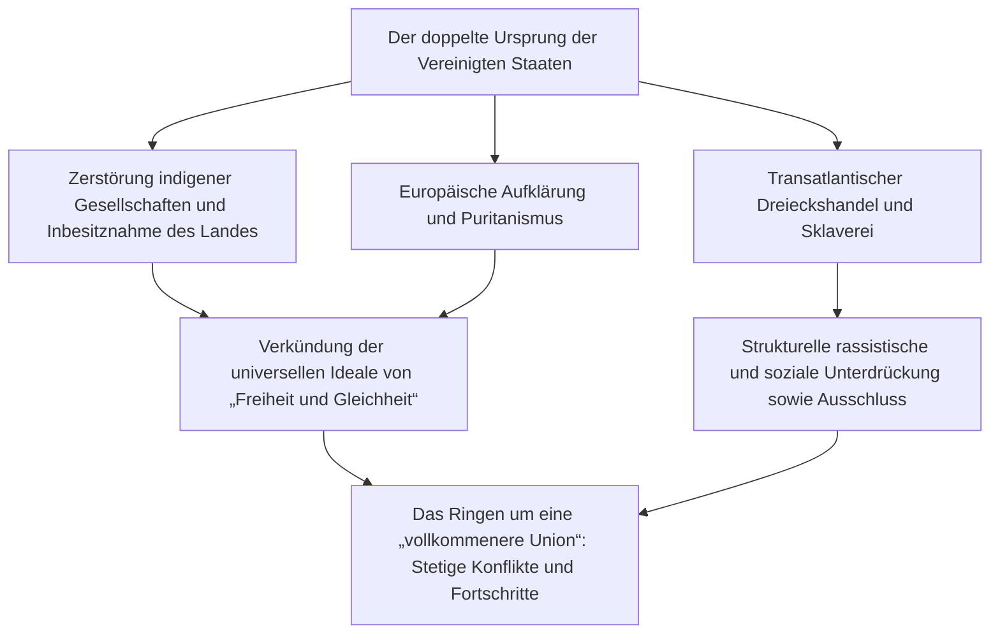
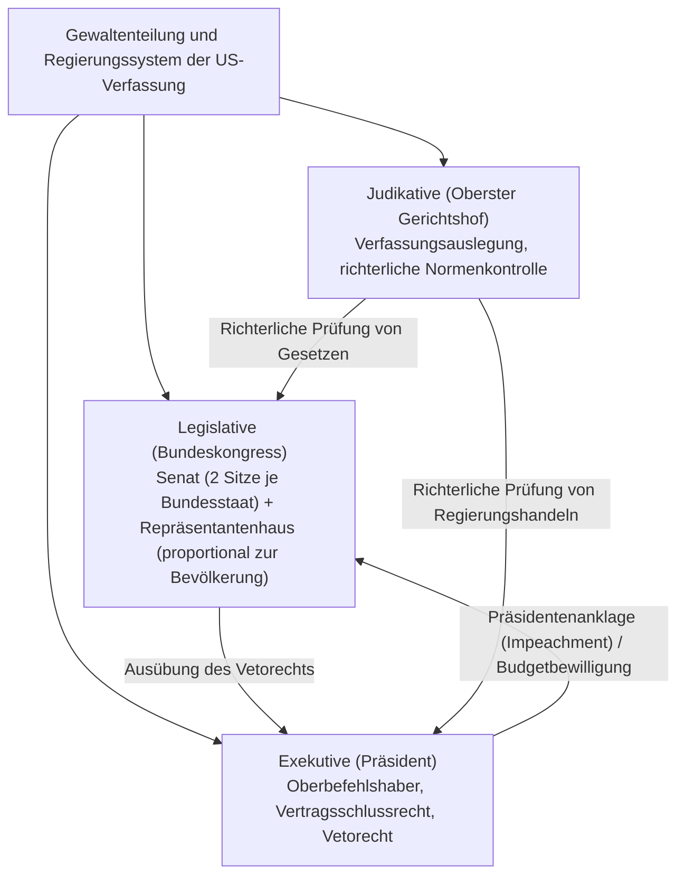
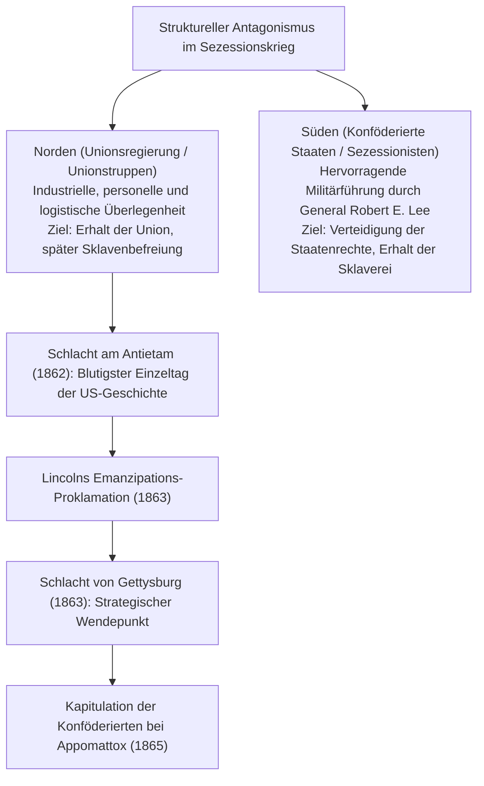
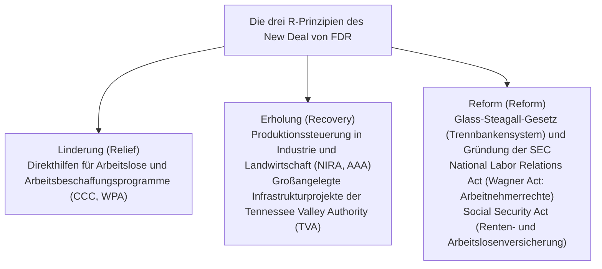
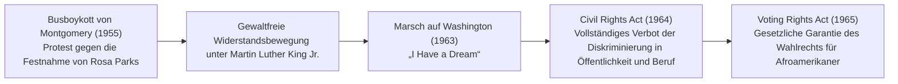
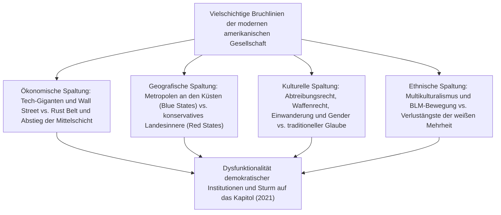

## 1. Einleitung: Die Vereinigten Staaten als Experimentierstaat

### 1.1 Die Illusion der „Neuen Welt“ und die Realität der indigenen Zivilisationen

In den traditionellen Geschichtsnarrativen über die Vereinigten Staaten von Amerika dominierte lange Zeit der Mythos eines „Gelobten Landes“, das von europäischen Siedlern auf der Suche nach Freiheit aus einer vermeintlich unberührten Wildnis erschlossen worden sei. Fortschritte in der Anthropologie und Geschichtswissenschaft seit der zweiten Hälfte des 20. Jahrhunderts haben dieses Bild jedoch grundlegend revidiert: Sie belegen eindrücklich, dass dieser Kontinent bereits Jahrtausende vor dem Eintreffen der Europäer von hochentwickelten indigenen Zivilisationen (Native Americans) besiedelt und geprägt war.

Ob die Kultur der Hügelbauer („Moundbuilders“) im Mississippi-Tal mit der monumentalen Metropole Cahokia, die kunstvollen Felsenbehausungen der Anasazi- bzw. Pueblo-Kultur im Südwesten oder der Irokesenbund (Haudenosaunee) im Nordosten, in dem sich fünf Stämme zu einer hochentwickelten demokratischen Föderation zusammengeschlossen hatten – Nordamerika beherbergte ein vielgestaltiges und reichhaltiges soziokulturelles Gefüge. Seit der Ankunft von Christoph Kolumbus im Jahr 1492 wurden durch eingeschleppte europäische Infektionskrankheiten wie Pocken, Masern und Influenza (im Rahmen des sogenannten „Kolumbianischen Austauschs“) sowie durch rücksichtslose Eroberungsfeldzüge schätzungsweise 80 bis 90 Prozent der indigenen Bevölkerung dahingerafft. Die nüchterne Erkenntnis, dass die Errichtung der „Neuen Welt“ auf den Trümmern dieser Zivilisationen erfolgte, bildet den unverzichtbaren Ausgangspunkt jedes modernen Verständnisses der amerikanischen Geschichte.

---

### 1.2 Die Pilgerväter, der Mayflower-Vertrag und die geistige Prägung durch den Puritanismus

Nach der Gründung von Jamestown in der Kolonie Virginia im Jahr 1607 legte eine weitere Gruppe das geistige Fundament der späteren nationalen Identität Amerikas: die separatistischen Puritaner („Pilgerväter“), die 1620 an Bord der Mayflower an der Küste der Massachusetts Bay landeten.

Der noch vor dem Betreten des Festlands an Bord unterzeichnete **Mayflower-Vertrag (Mayflower Compact)** war eine welthistorisch bahnbrechende Erklärung der Selbstverwaltung: Statt einer von Monarchen oder Feudalherren oktroyierten Herrschaft begründete er ein **politisches Gemeinwesen auf der Grundlage des freiwilligen Konsenses freier Individuen (Gesellschaftsvertrag), um gerechte und gleiche Gesetze zu erlassen und sich selbst zu regieren**.

Das von ihrem späteren Anführer John Winthrop geprägte Leitbild einer „Stadt auf dem Berge“ (A City upon a Hill) – das unerschütterliche Sendungsbewusstsein, wonach eine mit Gott im Bunde stehende puritanische Gemeinschaft als leuchtendes Vorbild für die gesamte Menschheit strahlen müsse – ging als elementare DNA in den sogenannten „amerikanischen Exzeptionalismus“ (American Exceptionalism) ein: den festen Glauben daran, dass die Vereinigten Staaten zu einer weltweiten Führungs- und Erlösungsmission berufen seien.

---

## 2. Von der Kolonialzeit über die Amerikanische Revolution zur Entstehung der Verfassung

### 2.1 Die Entwicklung der 13 Kolonien und das Ende der „heilsamen Vernachlässigung“

Die dreizehn britischen Kolonien entlang der nordamerikanischen Atlantikküste wiesen von Beginn an stark voneinander abweichende sozioökonomische Strukturen auf: das nördliche Neuengland (Handel, Fischerei, kleinbäuerliche Landwirtschaft und puritanischer Glaube), die mittleren Kolonien (Getreideanbau und ein Mosaik aus ethnisch wie religiös vielfältigen Einwanderern) sowie die südlichen Kolonien (ausgedehnte Plantagenwirtschaft für Tabak, Reis und Indigo, basierend auf der Ausbeutung versklavter Afrikaner).

Bis zur Mitte des 18. Jahrhunderts griff die britische Krone kaum reglementierend in die inneren Angelegenheiten der Kolonien ein – eine Politik, die als **„heilsame Vernachlässigung“ (Salutary Neglect)** bezeichnet wird und den Siedlern de facto weitgehende Selbstverwaltung gewährte. Dies änderte sich jedoch grundlegend mit dem Siebenjährigen Krieg bzw. dessen nordamerikanischem Schauplatz, dem Franzosen- und Indianerkrieg (1754–1763): Großbritannien ging zwar siegreich hervor, sah sich jedoch mit immensen Staatsschulden für die Kriegskosten konfrontiert.

Das britische Parlament versuchte daraufhin, die Kolonisten unter dem Vorwand der Verteidigungskosten an den Staatsfinanzen zu beteiligen, und leitete eine verschärfte Steuerpolitik ein:
- **Das Zuckergesetz (Sugar Act, 1764)** und das **Stempelsteuergesetz (Stamp Act, 1765)**: Erhebung von Abgaben auf Zeitungen, Broschüren, juristische Dokumente und sogar Spielkarten.
- Die Kolonien reagierten mit vehementem Widerstand, formulierten das verfassungsrechtliche Prinzip **„Keine Besteuerung ohne Repräsentation“ (No taxation without representation)** und organisierten Boykotte britischer Handelswaren.
- Nach dem Massaker von Boston (1770) und der Boston Tea Party (1773), bei der Aktivisten die Teeladungen der Britischen Ostindien-Kompanie ins Hafenbecken warfen, reagierte London mit drakonischen Strafmaßnahmen (den sogenannten Zwangsgesetzen bzw. Coercive/Intolerable Acts). Damit war die Schwelle zum bewaffneten Konflikt überschritten.

---

### 2.2 Thomas Paine, „Common Sense“ und die Unabhängigkeitserklärung (1776)

Im April 1775 fielen bei Lexington und Concord die ersten Schüsse, die den Amerikanischen Unabhängigkeitskrieg entfesselten. Dennoch schwankte ein Großteil der kolonialen Bevölkerung zu diesem Zeitpunkt noch immer zwischen Loyalität zur britischen Krone und der Forderung nach vollständiger Loslösung.

Diese Lähmung wurde schlagartig durch eine im Januar 1776 anonym publizierte Flugschrift aufgelöst: Thomas Paines **„Common Sense“**. In einer klaren, mitreißenden Sprache legte Paine dar, wie widersinnig es sei, dass eine kleine Insel auf Dauer einen riesigen Kontinent beherrschen solle, und verurteilte die erbliche Monarchie als eine grundlegende Pervertierung der Menschen- und Naturrechte. Mit Hunderttausenden verkauften Exemplaren entfachte die Schrift eine Welle der Begeisterung für die Unabhängigkeit in allen Kolonien.

Am 4. Juli 1776 verabschiedete der Zweite Kontinentalkongress schließlich die maßgeblich von Thomas Jefferson verfasste **Amerikanische Unabhängigkeitserklärung (Declaration of Independence)**.

> „Wir halten diese Wahrheiten für ausgemacht, dass alle Menschen gleich erschaffen worden, dass sie von ihrem Schöpfer mit gewissen unveräußerlichen Rechten begabt worden, worunter sind Leben, Freiheit und das Bestreben nach Glückseligkeit; dass, um diese Rechte zu sichern, Regierungen unter den Menschen eingesetzt werden, die ihre rechtmäßige Macht von der Einwilligung der Regierten herleiten.“

Dieses epochale Dokument synthetisierte die Naturrechtsphilosophie und Gesellschaftsvertragstheorie John Lockes, legitimierte das Recht des Volkes auf Widerstand und Revolution gegen tyrannische Herrschaft und wurde zu einem universalen Denkmal der neuzeitlichen Freiheitsgeschichte.

Die Kontinentalarmee unter dem Oberbefehl von George Washington führte trotz verheerender Ausrüstungsmängel und harter Entbehrungen einen Zermürbungskrieg. Der Sieg in der Schlacht von Saratoga (1777) markierte den diplomatischen Wendepunkt und brachte das Bündnis mit Frankreich sowie Unterstützung durch Spanien und die Vereinigten Niederlande ein. Nachdem die alliierten Truppen 1781 die britische Hauptarmee bei Yorktown zur Kapitulation gezwungen hatten, erkannte Großbritannien im Frieden von Paris (1783) die uneingeschränkte Unabhängigkeit der Vereinigten Staaten von Amerika an.

---

### 2.3 Das Scheitern der Konföderationsartikel und der Verfassungskonvent von Philadelphia (1787)

In ihren ersten Jahren waren die unabhängig gewordenen Staaten lediglich durch die 1781 ratifizierten Konföderationsartikel (Articles of Confederation) miteinander verbunden – ein äußerst lockerer Staatenbund von 13 souveränen Einzelstaaten:
- Die Zentralgewalt (der Konföderationskongress) besaß weder die Befugnis zur Steuererhebung noch ein stehendes Heer oder die Kompetenz zur Regulierung des Außen- und zwischenstaatlichen Handels.
- Als verschuldete und von Zwangsversteigerungen bedrohte Farmer unter Führung von Daniel Shays in Massachusetts zu den Waffen griffen (Shays’ Rebellion, 1786), erwies sich die Konföderation als unfähig, Truppen zu entsenden; das Gespenst von Anarchie und Staatszerfall rückte in bedrohliche Nähe.

Im Sommer 1787 versammelten sich daraufhin 55 Delegierte – unter ihnen James Madison, Alexander Hamilton und Benjamin Franklin, heute verehrt als die Gründerväter (Founding Fathers) – in der Independence Hall in Philadelphia, um das bestehende Regierungssystem grundlegend zu reformieren, und schufen die bis heute gültige **Verfassung der Vereinigten Staaten**.

- **Der Große Kompromiss (Connecticut-Kompromiss)**: Vermittlung zwischen den bevölkerungsreichen Staaten (Virginia-Plan: Vertretung nach Einwohnerzahl) und den kleineren Staaten (New-Jersey-Plan: gleiche Vertretung jedes Staates). Es entstand das Zweikammersystem aus Repräsentantenhaus (proportional zur Bevölkerung) und Senat (zwei Senatoren je Bundesstaat).
- **Die Drei-Fünftel-Klausel (Three-Fifths Compromise)**: Um die politische Vormacht der Südstaaten einzuhegen und dennoch ihre Zustimmung zu sichern, wurde festgelegt, dass bei der Zuteilung von Parlamentssitzen und direkten Steuern eine versklavte Person als drei Fünftel eines freien Bürgers gewertet wurde – ein folgenschwerer moralischer und verfassungsrechtlicher Kompromiss mit der Sklaverei.
- **Checks and Balances (Gewaltenhemmung und -balance)**: Aufbauend auf den Staatstheorien Montesquieus wurden Exekutive, Legislative und Judikative mit wechselseitigen Kontroll- und Vetorechten ausgestattet, um zu verhindern, dass ein einzelnes Staatsorgan oder Individuum eine tyrannische Machtfülle erlangen konnte.

---

## 3. Territoriale Expansion, Manifest Destiny und der Sezessionskrieg

### 3.1 „Manifest Destiny“ und die kontinentale Expansion

In der ersten Hälfte des 19. Jahrhunderts expandierten die Vereinigten Staaten in atemberaubendem Tempo nach Westen:
- **1803: Der Louisiana-Kauf (Louisiana Purchase)**: Präsident Thomas Jefferson erwarb das riesige französische Kolonialterritorium westlich des Mississippi von Napoleon Bonaparte für lediglich 15 Millionen Dollar, wodurch sich das Staatsgebiet auf einen Schlag verdoppelte.
- **1823: Die Monroe-Doktrin**: Präsident James Monroe proklamierte den Grundsatz der Nichteinmischung: Die europäischen Mächte hätten sich jeglicher Kolonisation und Intervention auf dem amerikanischen Kontinent zu enthalten, während die USA sich im Gegenzug nicht in europäische Konflikte einmischen würden.
- **Manifest Destiny („Offenkundige Bestimmung“)**: Die expansionistische Doktrin, wonach es der göttliche Auftrag der Vereinigten Staaten sei, den gesamten nordamerikanischen Kontinent bis zum Pazifik zu besiedeln, zu erschließen und die Fackel von Freiheit und Demokratie zu verbreiten, erfasste weite Teile der Gesellschaft.

Auf der Kehrseite dieses territorialen Vorstoßes stand die schonungslose Verdrängung und Vernichtung der indigenen Völker. Unter Präsident Andrew Jackson verabschiedete der Kongress den Indian Removal Act von 1830: Die sogenannten „Fünf zivilisierten Nationen“, darunter die Cherokee, wurden gewaltsam aus ihren angestammten Heimatgebieten im Osten vertrieben und auf strapaziösen Märschen über Tausende von Kilometern durch eisige Kälte in das designierte „Indianerterritorium“ (das heutige Oklahoma) deportiert. Tausende starben an Hunger, Erschöpfung und Seuchen auf diesem Leidensweg, der als **„Pfad der Tränen“ (Trail of Tears)** unauslöschlich im historischen Gedächtnis verankert ist.

Mit dem Sieg im Mexikanisch-Amerikanischen Krieg (1846–1848) eigneten sich die USA Gebiete an, aus denen später Kalifornien, Nevada, Utah, New Mexico, Arizona und Teile Colorados hervorgingen, und sicherten sich zudem Texas. Angeheizt durch den kalifornischen Goldrausch von 1848 wuchs die Nation endgültig zu einem transkontinentalen Staat heran, der vom Atlantik bis zum Pazifik reichte.

---

### 3.2 Die Krise der Sklaverei und die zunehmende Polarisierung der Nation

Mit jedem neu hinzugewonnenen Gebiet im Westen trat jedoch dieselbe zerreißende Frage unerbittlich hervor: **„Soll die Sklaverei in den neuen Territorien zugelassen oder verboten werden?“**

- **Die Wirtschaft des Nordens**: Geprägt durch die einsetzende Industrielle Revolution stützte sich der Norden auf freie Lohnarbeit, Fabrikproduktion, Fernhandel und das Finanzwesen. Um die heimische Industrie vor ausländischer Konkurrenz zu schützen, forderte er Schutzzölle.
- **Die Wirtschaft des Südens**: Gegründet auf riesigen Baumwollplantagen hing das „Baumwollkönigreich“ (King Cotton) existenziell von der unbezahlten Zwangsarbeit von annähernd vier Millionen versklavten Afroamerikanern ab. Da der Süden Baumwolle in großen Mengen nach Großbritannien und Europa exportierte, verlangte er kompromisslosen Freihandel.

Um das prekäre Kräfteverhältnis zwischen freien Staaten und Sklavenstaaten im Kongress zu wahren, griff die Politik immer wieder zu brüchigen Kompromissen: dem Missouri-Kompromiss von 1820 (Verbot der Sklaverei nördlich der Breite $36^\circ 30'$) und dem Kompromiss von 1850 mit der drakonischen Verschärfung des Gesetzes über entlaufene Sklaven (Fugitive Slave Act).

Als jedoch das Kansas-Nebraska-Gesetz von 1854 das Prinzip der „Volkssouveränität“ einführte – wonach die Siedler in den Territorien selbst per Abstimmung über die Zulassung der Sklaverei entscheiden sollten –, entflammte in Kansas ein blutiger Kleinkrieg bewaffneter Gruppierungen („Bleeding Kansas“). Im Jahr 1857 fällte der Oberste Gerichtshof zudem das berüchtigte **Dred-Scott-Urteil (Dred Scott v. Sandford)**: Richter Roger B. Taney erklärte, Afroamerikaner seien keine Bürger im Sinne der Verfassung und hätten keinerlei Rechte; überdies sei ein Verbot der Sklaverei in den Bundesterritorien durch den Kongress verfassungswidrig. Dieses Urteil versetzte der Anti-Sklaverei-Bewegung im Norden einen Schock und trieb die Wut der Öffentlichkeit auf den Siedepunkt.

---

### 3.3 Der Amerikanische Bürgerkrieg (1861–1865): Blutzoll der Wiedervereinigung und Emanzipation

Als bei der Präsidentschaftswahl von 1860 der Republikaner Abraham Lincoln triumphierte, der sich unmissverständlich gegen die weitere Ausdehnung der Sklaverei ausgesprochen hatte, erklärten South Carolina und sechs weitere Südstaaten ihren Austritt (Sezession) aus der Union und gründeten die Konföderierten Staaten von Amerika (Confederate States of America).

Im April 1861 begann mit dem Beschuss des von Unionstruppen gehaltenen Fort Sumter durch die Konföderierten der **Amerikanische Bürgerkrieg (American Civil War)**.

Präsident Lincoln erhob den Krieg von einem bloßen Feldzug zur Wiederherstellung der territorialen Ordnung zu einem Kreuzzug für die menschliche Freiheit:
- **1. Januar 1863: Die Emanzipations-Proklamation (Emancipation Proclamation)**: Lincoln erklärte alle versklavten Menschen in den rebellierenden Südstaaten mit sofortiger Wirkung für frei. Dies ermöglichte die Rekrutierung von rund 180.000 afroamerikanischen Soldaten in die Unionsarmee und verhinderte zugleich wirksam ein diplomatisches oder militärisches Eingreifen Großbritanniens und Frankreichs zugunsten der Konföderation auf moralischer Ebene.
- **November 1863: Die Gettysburg-Rede**: Lincoln mahnte, dass die **„Regierung des Volkes, durch das Volk und für das Volk“ (Government of the people, by the people, for the people)** nicht von der Erde verschwinden dürfe.

Nach Phasen des totalen Krieges und der Taktik der verbrannten Erde (General Shermans „Marsch zum Meer“) kapitulierte General Robert E. Lee im April 1865 bei Appomattox Court House vor Unionsgeneral Ulysses S. Grant. Mit über 600.000 Toten forderte der Bürgerkrieg mehr amerikanische Menschenleben als jeder andere Konflikt in der Geschichte des Landes. Durch die Ratifizierung des 13. Verfassungszusatzes (Abschaffung der Sklaverei), des 14. Zusatzes (Rechtsstaatlichkeit und Gleichheit vor dem Gesetz) und des 15. Zusatzes (Wahlrecht ungeachtet der Rasse) wandelten sich die Vereinigten Staaten von einem fragilen Bund souveräner Staaten in eine unauflösliche nationale Union.

Als jedoch die Phase der Reconstruction endete, etablierten die Südstaaten das Regime der sogenannten Jim-Crow-Gesetze – ein System gesetzlich verankerter Rassentrennung und brutaler Unterdrückung, das von Terror und Lynchmorden des Ku-Klux-Klan (KKK) begleitet wurde.

---

## 4. Das Gilded Age, die Industrielle Revolution und der Beginn des Imperialismus

### 4.1 Der Aufstieg des Großkapitals und das „Vergoldete Zeitalter“ (Gilded Age)

Vom Ende des Bürgerkriegs bis zum Beginn des 20. Jahrhunderts erlebte die amerikanische Wirtschaft eine beispiellose Explosion der Produktivkräfte. Mark Twain prägte für diese Epoche den Begriff **„Gilded Age“ (Vergoldetes Zeitalter)**: eine Zeit glanzvoller Oberflächen, hinter denen sich tiefgreifende soziale Missstände und politische Korruption verbargen.

- Mit der Fertigstellung der ersten transkontinentalen Eisenbahnlinie im Jahr 1869 verschmolz der Subkontinent zu einem gigantischen, einheitlichen Binnenmarkt.
- **Die Monopole der „Räuberbarone“ (Robber Barons)**:
  - John D. Rockefellers *Standard Oil Company*, die zeitweise 90 Prozent der gesamten Erdölraffination des Landes kontrollierte.
  - Andrew Carnegies Stahl-Imperium (*Carnegie Steel*).
  - J. P. Morgans Konzentration des Finanzkapitals, die in der Gründung gigantischer Trusts gipfelte (unter anderem *U.S. Steel*).
- Thomas Edisons Elektrifizierung, Alexander Graham Bells Telefon und Henry Fords Fließbandproduktion (Fordismus) katapultierten die USA an die weltweite Spitze der Industrieproduktion – weit vor Großbritannien und das Deutsche Reich.

Auf der anderen Seite führte die extreme Konzentration von Reichtum bei gleichzeitiger Verelendung der Arbeiterschaft zu erbitterten und blutigen Arbeitskämpfen wie dem Homestead-Streik oder dem Pullman-Streik. Gleichzeitig strömten Millionen neuer Einwanderer aus Süd- und Osteuropa (Italiener, Iren, osteuropäische Juden) in die Metropolen und bevölkerten prekäre Elendsviertel.

---

### 4.2 Das Ende der Frontier und der Übergang zur Übersee-Expansion

Im Gefolge des Zensus von 1890 formulierte der Historiker Frederick Jackson Turner seine berühmte Frontier-These über das Verschwinden der Siedlungsgrenze. Mit dem Verlust dieser Grenze, die den Pioniergeist, den Individualismus und die demokratische Vitalität Amerikas geformt hatte, richtete sich der Blick der Nation zwangsläufig nach Übersee – getrieben von der Suche nach neuen Absatzmärkten im Pazifik und in Lateinamerika (beflügelt durch Alfred Thayer Mahans Theorie der Seemacht):

- **1898: Der Spanisch-Amerikanische Krieg**: Nach der Explosion des Kriegsschiffs USS Maine im Hafen von Havanna besiegten die USA das geschwächte spanische Kolonialreich binnen weniger Monate. Durch den Friedensschluss fielen die Philippinen, Guam und Puerto Rico an die USA; im selben Jahr wurde Hawaii annektiert. Die USA betraten damit die Weltbühne als imperiale Großmacht im Pazifik.
- **Die Politik der offenen Tür (Open Door Policy, 1899)**: Außenminister John Hay forderte angesichts der Aufteilung Chinas durch die europäischen Kolonialmächte und Japan gleiche Handelschancen und die Wahrung der territorialen Integrität Chinas.

Im Inneren regte sich derweil breiter gesellschaftlicher Widerstand gegen die Willkür der Monopole und die politische Korruption. Die **„Progressive Bewegung“ (Progressivism)** unter Präsident Theodore Roosevelt („Trust-Buster“, Naturschutzprogramme) und später Woodrow Wilson setzte entscheidende Reformen durch: die striktere Durchsetzung des Sherman Antitrust Act, die Schaffung des Federal Reserve System (1913) sowie die Ratifizierung des 19. Verfassungszusatzes (1920), der das Frauenwahlrecht bundesweit verankerte.

---

## 5. Die zwei Weltkriege, die Große Depression und die Etablierung der Pax Americana

### 5.1 Der Erste Weltkrieg und die „Roaring Twenties“

Bei Ausbruch des Ersten Weltkriegs 1914 wahrten die Vereinigten Staaten zunächst strikte Neutralität. Durch gigantische Rüstungs- und Rohstofflieferungen an die Alliierten wandelte sich das Land von einem Schuldner- zum weltweit größten Gläubigerstaat. Die Wiederaufnahme des uneingeschränkten U-Boot-Krieges durch das Deutsche Reich sowie die diplomatische Affäre um die Zimmermann-Depesche veranlassten die USA jedoch im April 1917 zum Kriegseintritt.

Präsident Woodrow Wilson proklamierte sein **Vierzehn-Punkte-Programm**, das das Selbstbestimmungsrecht der Völker, die Freiheit der Meere, das Ende der Geheimdiplomatie und die Schaffung eines Völkerbundes forderte. Im Nachkriegsamerika stieß Wilsons internationalistische Vision jedoch auf den Widerstand des US-Senats: In Rückbesinnung auf isolationistische Traditionen lehnte der Senat die Ratifizierung des Versailler Vertrages ab; die USA traten dem Völkerbund niemals bei.

Die 1920er Jahre gingen als **„Roaring Twenties“ (Goldene Zwanziger)** in die Geschichte ein – eine Ära des rasanten wirtschaftlichen Aufschwungs und der Entstehung einer modernen Massenkonsumgesellschaft:
- Automobile (Fords Modell T), Radios, Kinofilme, Jazzmusik und elektrische Haushaltsgeräte wurden zu Massengütern und prägten den Alltag breiter Schichten.
- Die Wall Street erlebte eine Spekulationsorgie, befeuert von dem Glauben an eine nie endende Prosperität.
- Schattenseiten dieser Epoche waren die Prohibition (18. Verfassungszusatz), die das Aufblühen des organisierten Verbrechens um Gangsterbosse wie Al Capone begünstigte, sowie eine Welle fremdenfeindlicher und rassistischer Strömungen (Wiederbelebung des Ku-Klux-Klan, Verabschiedung strikter Einwanderungsquoten).

---

### 5.2 Die Weltwirtschaftskrise und der New Deal

Am 24. Oktober 1929 – dem „Schwarzen Donnerstag“ (Black Thursday) – brach die New Yorker Börse an der Wall Street spektakulär ein und löste die Große Depression aus.
Binnen kurzer Zeit brachen Tausende Banken zusammen, die Arbeitslosigkeit stieg auf 25 Prozent (jeder vierte Erwerbstätige war ohne Beschäftigung), und schwere Dürren im Mittleren Westen führten zu verheerenden Sandstürmen („Dust Bowl“), die unzählige Farmerfamilien ins Elend stürzten. Das Festhalten von Präsident Herbert Hoover an traditionellen Laissez-faire-Prinzipien erwies sich angesichts des Ausmaßes der Katastrophe als völlig unzureichend.

Der im Frühjahr 1933 ins Amt eingeführte Präsident Franklin D. Roosevelt (FDR) leitete mit seinem **„New Deal“** eine fundamentale Wende in der US-amerikanischen Wirtschafts- und Sozialpolitik ein.

Indem der Staat im Vorgriff auf keynesianische Konzepte direkt in die Wirtschaftskreisläufe eingriff und institutionelle Grundlagen für einen modernen Wohlfahrtsstaat schuf, stärkte der New Deal die Exekutivmacht des Präsidenten nachhaltig und begründete die moderne Tradition des amerikanischen Liberalismus.

---

### 5.3 Der Zweite Weltkrieg und der Aufstieg zur Weltmacht

Am 7. Dezember 1941 traten die USA nach dem japanischen Überraschungsangriff auf Pearl Harbor in den Zweiten Weltkrieg ein.

Als selbsternanntes **„Arsenal der Demokratie“ (Arsenal of Democracy)** mobilisierte die Nation ihre gesamte industrielle Potenz für die Kriegsproduktion: Automobilwerke stellten binnen kürzester Zeit auf Panzer und Kampfflugzeuge um; Millionen von Frauen („Rosie the Riveter“) traten in die Rüstungsbetriebe ein.

- Erfolgreiche Eröffnung der Westfront durch die Landung in der Normandie (Operation Overlord, 1944) und Zerschlagung des nationalsozialistischen Deutschlands.
- Strategie des „Inselspringens“ (Island Hopping) auf dem pazifischen Kriegsschauplatz bis zur Kapitulation des Japanischen Kaiserreichs.
- Entwicklung der ersten Atombomben im streng geheimen Manhattan-Projekt und deren Einsatz gegen Hiroshima und Nagasaki im August 1945.

Am Ende des Krieges verfügten die Vereinigten Staaten über die Hälfte der weltweiten Industrieproduktion, hielten rund 70 Prozent der weltweiten Währungs-Goldreserven und besaßen das Monopol auf die Atombombe.
Durch das Abkommen von Bretton Woods (1944) etablierten sie den **US-Dollar als globale Leitwährung und schufen IWF sowie Weltbank**; 1945 wurde in San Francisco die Charta der Vereinten Nationen beschlossen. Die Ära der **„Pax Americana“** – einer Epoche unangefochtener globaler Führungsrolle der USA – hatte damit auf allen Ebenen begonnen.

---

## 6. Kalter Krieg, Bürgerrechtsbewegung, Glanz und Erschütterungen

### 6.1 Der Ost-West-Konflikt und der Schatten der nuklearen Abschreckung

Aus den Trümmern des Zweiten Weltkriegs erwuchs unmittelbar der Systemkonflikt zwischen den beiden neuen Supermächten: der Kalte Krieg (Cold War) zwischen dem von den USA geführten westlichen Lager und dem von der Sowjetunion beherrschten Ostblock.

- **1947: Die Truman-Doktrin**: Die Strategie der weltweiten „Eindämmung“ (Containment Policy) des sowjetischen Kommunismus.
- **Der Marshallplan (European Recovery Program)**: Ein milliardenschweres Wiederaufbauprogramm zur wirtschaftlichen Stabilisierung Westeuropas als Bollwerk gegen kommunistische Einflüsse.
- **1949: Gründung der NATO**: Errichtung eines transatlantischen Systems der kollektiven Verteidigung.
- Der Ausbruch des Koreakriegs (1950–1953) und im Inland eine hysterische antikommunistische Verfolgungswelle, die als McCarthy-Ära („Rote Jagd“) berüchtigt wurde.

Im Oktober 1962 führte die Stationierung sowjetischer Nuklearraketen auf Kuba während der **Kubakrise** die Menschheit an den Rand eines thermonuklearen Weltkriegs. Die Konfrontation zwischen Präsident John F. Kennedy und KPdSU-Chef Nikita Chruschtschow endete mit dem Abzug der Raketen, doch das Prinzip der wechselseitigen gesicherten Zerstörung (Mutual Assured Destruction, MAD) prägte fortan das globale atomare Gleichgewicht des Schreckens.

---

### 6.2 Die Bürgerrechtsbewegung: Der Kampf um reale Gleichberechtigung

Während die weiße Mittelschicht in den Nachkriegsjahrzehnten in die expandierenden Vorstädte (Suburbs) zog und den American Dream mit Fernsehern, Eigenheimen und Konsumgütern lebte, blieb der schwarzen Bevölkerung, insbesondere in den Südstaaten, die elementare bürgerliche Gleichberechtigung verwehrt.

Mit dem historischen Grundsatzurteil **Brown v. Board of Education** (1954) erklärte der Oberste Gerichtshof die Rassentrennung an öffentlichen Schulen für verfassungswidrig, da getrennte Bildungseinrichtungen „von Natur aus ungleich“ seien. Dies gab den Auftakt zu einer landesweiten Bürgerrechtsbewegung (Civil Rights Movement).

Gegen die gewaltfreien Aktionen (Sit-ins, Freedom Rides, Protestmärsche) unter Führung von Dr. Martin Luther King Jr. setzte die weiße Polizeigewalt in den Südstaaten berittene Truppen, Polizeihunde und Wasserwerfer ein. Die im landesweiten Fernsehen ausgestrahlten Bilder dieser Brutalität erschütterten das moralische Gewissen der Nation tiefgreifend. Unter Präsident Lyndon B. Johnson verabschiedete der Kongress schließlich den **Civil Rights Act von 1964** und den **Voting Rights Act von 1965**, wodurch das System der gesetzlichen Rassentrennung nach einem Jahrhundert institutioneller Diskriminierung formal beseitigt wurde.

---

### 6.3 Das Trauma des Vietnamkriegs und die Gegenkultur

Geleitet von der sogenannten Domino-Theorie – der Annahme, dass der Fall eines Staates an den Kommunismus das Umkippen der gesamten Region zur Folge hätte – verstrickten sich die USA ab 1965 in eine massive militärische Eskalation im Vietnamkrieg (1965–1973).
Der asymmetrische Dschungelkrieg gegen den Vietcong, der Einsatz chemischer Entlaubungsmittel (Agent Orange), Kriegsverbrechen wie das Massaker von My Lai und der Tod von über 58.000 überwiegend zwangsverpflichteten jungen US-Soldaten erschütterten das Vertrauen der Bevölkerung in den Staat in seinen Grundfesten.

An den Universitäten entluden sich beispiellose Antikriegsproteste. Zusammen mit der Hippie-Bewegung, der Rockmusik (Woodstock-Festival 1969), der neuen Frauenbewegung (Women's Lib) und der modernen Umweltbewegung entstand eine kraftvolle **Gegenkultur (Counterculture)**. Als 1974 Präsident Richard Nixon im Zuge der Vertuschungsversuche der Watergate-Affäre als bislang einziger US-Präsident zurücktreten musste, versank die Nation in einer tiefen Identitätskrise, die durch wirtschaftliche Stagflation und weltpolitische Ohnmachtserfahrungen unter Jimmy Carter noch verstärkt wurde.

---

## 7. Von der Reaganomics über die Post-Cold-War-Ära und den 11. September bis zur tiefen Spaltung der Gegenwart

### 7.1 Die Reagan-Revolution und das Ende des Kalten Krieges

Mit dem Wahlkampfversprechen einer nationalen Wiedergeburt („Let’s Make America Great Again“) errang Ronald Reagan 1980 einen Erdrutschsieg bei der Präsidentschaftswahl.

- **Reaganomics**: Aufbauend auf der angebotsorientierten Wirtschaftstheorie (Supply-Side Economics) setzte Reagan radikale Steuersenkungen, umfassende Deregulierung, Kürzungen bei den Sozialausgaben und eine restriktive Geldpolitik durch. Damit etablierte er das Modell des „schlanken Staates“ und leitete den weltweiten Siegeszug des Neoliberalismus ein.
- **Konfrontation mit dem „Reich des Bösen“**: Durch eine drastische Erhöhung des Verteidigungshaushalts und die Ankündigung der Strategischen Verteidigungsinitiative (SDI, bekannt als „Star Wars“) trieb Reagan die Rüstungsspirale voran und zwang die sowjetische Planwirtschaft an die Grenze des ökonomischen Kollapses.
- Mit dem Fall der Berliner Mauer 1989 und dem Zerfall der Sowjetunion 1991 endete der Kalte Krieg mit dem vollständigen Triumph der Vereinigten Staaten. Der Politikwissenschaftler Francis Fukuyama sprach vom „Ende der Geschichte“ und dem endgültigen Siegeszug der liberalen Demokratie und des freien Marktes.

---

## 7.1.5 Der Golfkrieg (1991) und die Militärrevolution der Powell-Doktrin

Im August 1990, unmittelbar nach dem Ende des Kalten Krieges, überfielen die Truppen des irakischen Diktators Saddam Hussein das benachbarte Emirat Kuwait. Präsident George H. W. Bush erwirkte mehrere Resolutionen des UN-Sicherheitsrates, formierte eine beispiellose Koalition aus 34 Nationen und leitete im Januar 1991 mit der Operation „Desert Storm“ (Zweiter Golfkrieg) die militärische Befreiung Kuwaits ein.

### Eine Militärdoktrin zur Überwindung des Vietnam-Traumas
Aus den bitteren Erfahrungen des zermürbenden Vietnamkriegs formulierte der Vorsitzende des Vereinigten Generalstabs, General Colin Powell, die wegweisende **„Powell-Doktrin“ (Powell Doctrine)**:
1. Vorliegen einer existenziellen und eindeutigen Bedrohung für vitale nationale Sicherheitsinteressen.
2. Kriegseinsatz ausschließlich als „Ultima Ratio“ nach Ausschöpfung aller diplomatischen und ökonomischen Mittel.
3. Definition klarer, präzise umrissener und erreichbarer militärischer und politischer Zielsetzungen.
4. Konzentrierter Einsatz **„überwältigender militärischer Gewalt“ (Overwhelming Force)**, um dem Feind keine Initiative zu belassen und den Konflikt in kürzester Frist entscheidend zu gewinnen.
5. Existenz einer vorab festgelegten, tragfähigen Abzugs- und Ausstiegsstrategie (Exit Strategy).

Mit Stealth-Kampfflugzeugen (F-117), laser- und GPS-gelenkten Präzisionswaffen („Smart Bombs“), Tomahawk-Marschflugkörpern und Patriot-Flugabwehrsystemen demonstrierte das US-Militär der weltweiten Öffentlichkeit über Live-Übertragungen des Nachrichtensenders CNN eine technologische Überlegenheit neuer Dimension und zerschlug die irakischen Streitkräfte in einer Bodenoffensive von lediglich 100 Stunden.

Präsident Bush verkündete triumphierend, das Trauma Vietnams sei endgültig im Wüstensand begraben worden; die USA sahen sich als einzige verbliebene Supermacht zur Führung einer „Neuen Weltordnung“ (New World Order) berufen. Paradoxerweise trug jedoch gerade die Erinnerung an diesen überwältigend schnellen Sieg dazu bei, dass die strategische Vorsicht der Powell-Doktrin im Vorfeld des Irakkriegs von 2003 verdrängt wurde – eine Hybris, die in ein desaströses Besatzungsabenteuer münden sollte.

## 7.2 Licht und Schatten der Globalisierung sowie die IT-Revolution

Unter der Präsidentschaft von Bill Clinton in den 1990er Jahren führten die Reduzierung der Militärausgaben nach dem Kalten Krieg („Friedensdividende“) und der Boom der Internet- und IT-Technologie rund um das Silicon Valley zu einer anhaltenden Hochkonjunktur („New Economy“).

Mit der Unterzeichnung des Nordamerikanischen Freihandelsabkommens (NAFTA) und der Vorbereitung des Beitritts Chinas zur Welthandelsorganisation (WTO) trieb Washington die weltwirtschaftliche Verflechtung voran. Dieser Siegeszug des globalen Finanz- und Handelskapitalismus erzeugte jedoch gravierende strukturelle Verwerfungen im Inneren:
- Ganze Produktionszweige wanderten in Niedriglohnländer wie Mexiko und China ab, was zum Niedergang der klassischen Industrie im Mittleren Westen – dem sogenannten Rostgürtel (Rust Belt) – und zur Verarmung der weißen Arbeiterklasse führte.
- Die sozioökonomische und kulturelle Kluft zwischen den kosmopolitischen High-Tech- und Finanzeliten an den Küsten und den abgehängten Regionen im Landesinneren vertiefte sich zusehends.

---

### 7.3 Die Terroranschläge des 11. September und das Scheitern des „Kriegs gegen den Terror“

Am 11. September 2001 verübten Terroristen des Netzwerks Al-Qaida Anschläge mit entführten Passagierflugzeugen auf das World Trade Center in New York und das Pentagon bei Washington, D.C. Der erste verheerende Angriff auf das amerikanische Festland seit Pearl Harbor löste eine Welle patriotischer Mobilisierung aus; Präsident George W. Bush rief den globalen „Krieg gegen den Terror“ (War on Terror) aus:

- Militärische Intervention in Afghanistan und Sturz des Taliban-Regimes (2001).
- 2003: Der völkerrechtlich hochgradig umstrittene Irakkrieg unter dem Vorwand, das Regime von Saddam Hussein besitze Massenvernichtungswaffen.
- Da im Irak keine Massenvernichtungswaffen gefunden wurden, versank das Land in einem blutigen Bürgerkrieg und wurde zur Brutstätte für terroristische Milizen wie den Islamischen Staat (ISIS). Der Einsatz forderte das Leben Tausender US-Soldaten, kostete Billionen Dollar und fügte der moralischen Autorität und dem internationalen Ansehen der Vereinigten Staaten verheerenden Schaden zu.

---

### 7.4 Finanzkrise, Präsidentschaft Obamas, das Phänomen Trump und die Verunsicherung des 21. Jahrhunderts

Im Jahr 2008 platzte an der Wall Street die spekulative Subprime-Hypothekenblase, und die Insolvenz von Lehman Brothers entfesselte die schwerste globale Finanzkrise seit 1929. Inmitten dieser Erschütterung des kapitalistischen Systems zog Barack Obama mit den Wahlslogans „Change“ und „Yes We Can“ als erster afroamerikanischer Präsident ins Weiße Haus ein. Zwar gelang ihm mit dem *Affordable Care Act* („Obamacare“) eine historische Reform des Gesundheitssystems, doch stieß seine Präsidentschaft auf die erbitterte Fundamentalopposition der konservativen Tea-Party-Bewegung, die das politische System in Washington lähmte.

Im Jahr 2016 trug schließlich die Wut der im Rust Belt abgehängten weißen Arbeiterschaft über das politische Establishment und die Folgen der Globalisierung Donald Trump ins Präsidentenamt.

Wie der gewaltsame Sturm auf das US-Kapitol am 6. Januar 2021 auf dramatische Weise vor Augen führte, durchleben die Vereinigten Staaten heute den tiefsten Zerfall des nationalen Grundkonsenses seit dem Sezessionskrieg.

---

---

## 2.4 Der ideologische Bruch der Gründerväter: Die Kontroverse zwischen Hamilton und Jefferson

Nach der Ratifizierung der US-Verfassung entbrannte im Kabinett des ersten Präsidenten George Washington eine der folgenschwersten intellektuellen Auseinandersetzungen über die künftige Gestalt der amerikanischen Republik: der fundamentale Konflikt zwischen Finanzminister Alexander Hamilton und Außenminister Thomas Jefferson.

### ① Die Kollision ökonomischer Visionen: Finanzimperium oder Agrarrepublik
- **Hamiltons Konzept**: Hamilton strebte ein nach britischem Vorbild gestaltetes, wirtschaftlich und militärisch schlagkräftiges Industrie- und Finanzimperium an. Die Bundesregierung übernahm im Rahmen des Funding Act of 1790 die Kriegsschulden der einzelnen Staaten, emittierte Bundesanleihen und gründete die Erste Bank der Vereinigten Staaten (*First Bank of the United States*). Durch Schutzzölle sollte die heimische Industrie gefördert und gestützt auf ein stehendes Heer sowie eine handlungsfähige Verwaltung ein moderner Nationalstaat geschaffen werden.
- **Jeffersons Konzept**: Jefferson warnte vor den korrumpierenden Einflüssen der Großstädte und der Lohnarbeit; wer von einem Arbeitgeber abhängig sei, könne kein wahrhaft freier Staatsbürger sein. Als moralisches Fundament der Republik sah er die unabhängigen, ihr eigenes Land bestellenden Kleinbauern (Yeoman Farmers), die durch Tugendhaftigkeit (*Virtue*) und Autarkie glänzten. Die Bundesregierung sollte sich auf Landesverteidigung und minimale außenpolitische Aufgaben beschränken („schlanker Staat“).

### ② Der Verfassungsstreit: Implied Powers versus Strict Constructionism
- An der Frage, ob der Bundeskongress die verfassungsrechtliche Kompetenz zur Gründung einer Nationalbank besitze, schieden sich die Geister der Verfassungsauslegung.
- **Jeffersons strikte Auslegung (Strict Constructionism)**: In Art. I, Abs. 8 der Verfassung, der die Befugnisse des Kongresses taxativ aufzählt, findet sich kein Recht zur Errichtung von Banken. Die Inanspruchnahme nicht ausdrücklich zugewiesener Kompetenzen stelle einen verfassungswidrigen Übergriff auf die Hoheitsrechte der Bundesstaaten und des Volkes dar (im Geiste des 10. Verfassungszusatzes).
- **Hamiltons flexible Auslegung (Loose Constructionism)**: Hamilton berief sich auf die sogenannte Erforderlichkeitsklausel (Necessary and Proper Clause, auch Elastizitätsklausel genannt) in Art. I, Abs. 8, Ziff. 18. Er argumentierte, dass der Bundesregierung zur wirksamen Ausübung ihrer ausdrücklich genannten Pflichten – wie Steuererhebung und Kreditaufnahme – alle zweckdienlichen und verhältnismäßigen Mittel zustünden. Diese Rechtsfigur der **„stillschweigenden Befugnisse“ (Implied Powers)** wurde 1819 durch Chief Justice John Marshall im bahnbrechenden Grundsatzurteil *McCulloch v. Maryland* bestätigt und schuf das verfassungsrechtliche Fundament für das Anwachsen der modernen Bundesgewalt.

---

## 3.6 Militär- und technikhistorische Zäsuren des Sezessionskriegs und die Tragik der Reconstruction

Der Sezessionskrieg gilt in der Militärgeschichtsschreibung als der „erste moderne totale Krieg“ (First Modern Total War). Erstmals kamen die technologischen Errungenschaften der Industriellen Revolution im großen Maßstab auf dem Schlachtfeld zum Einsatz und machten die eleganten Formationstaktiken der napoleonischen Ära mit einem Schlag obsolet.

### ① Die Revolutionierung der Militärtechnik
1. **Gezogene Gewehre und das Minié-Geschoss (Minié Ball)**:
   - Während herkömmliche Musketen mit glattem Lauf lediglich eine effektive Kampfentfernung von $50 \sim 100$ Yards aufwiesen, steigerte die Kombination aus gezogenem Lauf (Rifling) und dem konischen Weichblei-Minié-Geschoss die effektive Reichweite sprunghaft auf $300 \sim 500$ Yards.
   - Da die Generäle beider Seiten jedoch weiterhin frontale Linienangriffe in dichter Schützenformation befahlen, wurden die vorrückenden Infanteristen im vernichtenden Abwehrfeuer regelrecht niedergemäht – wie etwa bei „Pickett’s Charge“ in der Schlacht von Gettysburg, wo Tausende fielen. Dies erzwang den Übergang zum modernen Stellungskrieg (Grabenkrieg).
2. **Militärische Nutzung von Eisenbahn und Telegrafie**:
   - Die Unionstruppen nutzten ihr dichtes Schienennetz virtuos, um Zehntausende Soldaten samt schwerem Nachschub binnen weniger Tage über riesige Distanzen an die Brennpunkte der Front zu verlegen.
   - Im Telegrafenraum des Weißen Hauses verfolgte Präsident Lincoln den Kriegsverlauf nahezu in Echtzeit und tauschte strategische Instruktionen mit seinen Befehlshabern aus – eine historische Premiere moderner operativer Führung (C4I).
3. **Das Aufeinandertreffen der Panzerschiffe**:
   - In der Seeschlacht von Hampton Roads (1862) duellierten sich das konföderierte Panzerschiff CSS Virginia (die umgebaute Merrimack) und die mit einem neuartigen Drehturm ausgestattete USS Monitor der Union. Dieses Gefecht besiegelte das Ende der traditionellen Holzsegelschiffe in der Seekriegsführung über Nacht.

### ② Das Scheitern der Reconstruction (1865–1877) und die Finsternis der Jim-Crow-Ära
Nach der Ermordung Lincolns verfolgte dessen Nachfolger Andrew Johnson eine überaus milde Haltung gegenüber den ehemaligen Konföderierten. Daraufhin rissen die sogenannten Radikalen Republikaner (Radical Republicans) im Kongress die Initiative an sich: Sie unterstellten den Süden fünf Militärbezirken, setzten das Wahlrecht für die befreiten Afroamerikaner mit militärischer Gewalt durch und ermöglichten so die Wahl zahlreicher schwarzer Abgeordneter und Senatoren (Radikale Reconstruction).

Dieses demokratische Experiment endete jedoch abrupt mit dem Kompromiss von 1877 (Hayes-Tilden-Kompromiss): Als Gegenleistung für die Anerkennung des umstrittenen Präsidentschaftssiegs von Rutherford B. Hayes zog Washington sämtliche Unionstruppen aus dem Süden ab. Daraufhin übernahmen konservative weiße Eliten (die sogenannten „Redeemers“ bzw. Erlöser) erneut die Macht in den Bundesstaaten:
- Die Südstaaten bauten ein raffiniertes Geflecht diskriminierender Gesetze auf – darunter Kopfsteuern (Poll Taxes), Alphabetisierungstests (Literacy Tests) und Großvaterklauseln (Befreiung von den Prüfungen nur für Nachkommen von Wählern vor 1867) –, um Afroamerikaner faktisch vollständig vom Wahlrecht auszuschließen.
- 1896 besiegelte der Supreme Court im Urteil **Plessy v. Ferguson** diese Entrechtung: Unter der verfassungsrechtlichen Doktrin „Getrennt, aber gleich“ (Separate but Equal) wurde die gesetzliche Rassentrennung in öffentlichen Verkehrsmitteln, Schulen und Einrichtungen für rechtmäßig erklärt. Dieses menschenunwürdige System der Jim-Crow-Gesetze sollte über ein halbes Jahrhundert bis zu den Kämpfen der Bürgerrechtsbewegung in den 1950er und 1960er Jahren Bestand haben.

---

## 7.5 Justizpolitik und das Ringen um Präzedenzfälle am Supreme Court im 21. Jahrhundert

An vorderster Front der gegenwärtigen Polarisierung der USA tobt ein erbitterter Streit um die personelle Zusammensetzung und Rechtsprechung des Supreme Court – ein Phänomen, das häufig als „Justizkrieg“ (Judicial Wars) bezeichnet wird.

### ① Das Recht auf Schwangerschaftsabbruch: Vom Urteil Roe v. Wade zum Dobbs-Paukenschlag
- **1973: Das Urteil Roe v. Wade**: Der Supreme Court leitete aus dem durch die Due-Process-Klausel des 14. Verfassungszusatzes geschützten Grundrecht auf Privatsphäre ein bundesweit geschütztes Recht von Frauen auf Schwangerschaftsabbruch ab.
- In Reaktion darauf formierte sich die christliche religiöse Rechte (die „Pro-Life“-Bewegung), die über ein halbes Jahrhundert hinweg in engem Bündnis mit der Republikanischen Partei eine gezielte Strategie verfolgte, um konservative Richter an den Obersten Gerichtshof zu berufen.
- Während der Amtszeit von Donald Trump wurden drei konservative Richter nominiert (Neil Gorsuch, Brett Kavanaugh und Amy Coney Barrett), wodurch sich eine konservative Supermehrheit von 6 zu 3 Stimmen etablierte. Im Juni 2022 kassierte das Gericht im Urteil **Dobbs v. Jackson Women's Health Organization** den Präzedenzfall *Roe v. Wade* nach fast 50 Jahren: Das angebliche Recht auf Abtreibung sei weder im Text der Verfassung verankert noch historisch in den Traditionen der Nation verwurzelt. Die Regelungskompetenz fiel damit vollumfänglich an die Gesetzgeber der Einzelstaaten zurück.
- Dieser seismische Rechtswechsel führte dazu, dass konservative Bundesstaaten im Süden und Mittleren Westen sofort drakonische Abtreibungsverbote verhängten, während demokratisch geführte Staaten wie Kalifornien und New York sich zu Zufluchtsorten („Sanctuary States“) erklärten – ein Zustand tiefer rechtlicher und moralischer Zerrissenheit der Nation.

### ② Das Recht auf Waffenbesitz: Die originalistische Auslegung des 2. Verfassungszusatzes
- **Der 2. Verfassungszusatz (Second Amendment)**: „Da eine wohlgeordnete Miliz für die Sicherheit eines freien Staates notwendig ist, darf das Recht des Volkes, Waffen zu besitzen und zu tragen, nicht beeinträchtigt werden.“
- **2008: Das Urteil District of Columbia v. Heller**: Gestützt auf die von Richter Antonin Scalia vertretene Doktrin des Originalismus (Originalism – eine Auslegungsmethode, die auf das historische Begriffsverständnis zum Zeitpunkt der Verfassungsgebung abstellt) entschied der Supreme Court erstmals ausdrücklich, dass der 2. Verfassungszusatz ein individuelles Recht jedes Bürgers auf Waffenbesitz zum Zweck der Selbstverteidigung schützt – unabhängig vom Dienst in einer regulären Miliz. Angesichts grassierender Massenerschießungen (Mass Shootings) bildet dieses verfassungsgerichtliche Diktum das entscheidende juristische Bollwerk, das wirksame Waffenkontrollgesetze auf Bundesebene bis heute weitgehend verunmöglicht.

---

## 6.5 Der Nixon-Schock (1971) und die Etablierung des Petrodollar-Systems

Einer der tiefgreifendsten Umbrüche im globalen Währungsgefüge und in der internationalen Geopolitik ereignete sich am 15. August 1971, als Präsident Richard Nixon in einer dramatischen Fernsehansprache den sogenannten „Nixon-Schock“ verkündete.

### ① Das Ende des Bretton-Woods-Systems
Die 1944 im US-Bundesstaat New Hampshire vereinbarte Währungsordnung von Bretton Woods basierte auf dem Gold-Devisen-Standard: Die USA garantierten der Welt die unbegrenzte Einlösung von **35 US-Dollar je Feinunze Gold**, während die übrigen Währungen feste Wechselkurse zum US-Dollar unterhielten.

In den späten 1960er Jahren führten jedoch die massiven Sozialprogramme der „Great Society“ unter Lyndon B. Johnson und die eskalierenden Militärausgaben für den Vietnamkrieg zu einer dramatischen Explosion des US-Haushalts- und Leistungsbilanzdefizits. Als europäische Staaten, allen voran Frankreich und die Bundesrepublik Deutschland, begannen, ihre akkumulierten Dollarreserven massenhaft in physisches Gold umzutauschen, drohten die Goldreserven in Fort Knox rapide zu versiegen.

Nixon reagierte mit einer einseitigen Verfügung: Er setzte **die freie Konvertibilität des US-Dollars in Gold mit sofortiger Wirkung und auf unbestimmte Zeit aus**. Dieser Schritt brachte das Bretton-Woods-System zum Einsturz; ab 1973 ging das internationale Währungssystem endgültig zu flexiblen, marktbasierten Wechselkursen (Floating Exchange Rates) über.

### ② Die Entstehung des Petrodollar-Systems
Ohne den Goldanker drohte dem US-Dollar eine unkontrollierbare Abwertung und galoppierende Inflation. In dieser prekären Lage initiierte Nixons Außenminister Henry Kissinger eine Reihe geheimer Verhandlungen mit dem weltweit führenden Erdölexporteur Saudi-Arabien (1974):
- Die Vereinigten Staaten sicherten dem Haus Saud umfassende militärische Unterstützung, Waffenlieferungen und Sicherheitsgarantien für das Königreich zu.
- Im Gegenzug verpflichtete sich Riad, **alle Erdölexporte ausnahmslos in US-Dollar abzurechnen** und die erzielten Überschüsse in US-Staatsanleihen zu reinvestieren – eine Praxis, die bald von den anderen OPEC-Staaten übernommen wurde.
- Durch dieses Arrangement entstand das sogenannte **Petrodollar-System**: Jeder Staat weltweit war nun gezwungen, kontinuierlich Dollarreserven vorzuhalten, um den lebenswichtigen Rohstoff Erdöl auf dem Weltmarkt erwerben zu können. Dies sicherte den USA ein „übermäßiges Privileg“ (Exorbitant Privilege): Washington konnte seine Schulden und Importe praktisch unbegrenzt über die Druckerpresse der Federal Reserve mit ungedecktem Fiat-Geld (Fiat Money) finanzieren und seine globale Vormachtstellung im Finanzsystem festigen.

---

## 7.6 Der Wandel des Einwanderungslandes: Der Immigration Act von 1965 und die demografische Zeitenwende

Eine weitere tiefgreifende Transformation der amerikanischen Gesellschaft wurde durch den 1965 von Präsident Lyndon B. Johnson unterzeichneten **Immigration and Nationality Act (Hart-Celler Act)** angestoßen.

Der vorherige Immigration Act von 1924 (Johnson-Reed Act) basierte auf einem nationalen Quotensystem, das sich am Zensus von 1890 orientierte. Dieses Regime bevorzugte gezielt Einwanderer aus Nord- und Westeuropa, während Zuwanderer aus Süd- und Osteuropa stark reglementiert und solche aus Asien faktisch gänzlich ausgeschlossen wurden.

Das Gesetz von 1965 schaffte dieses diskriminierende Quotensystem vollständig ab und stellte stattdessen zwei Kriterien in den Mittelpunkt: die Familienzusammenführung und die Qualifikation von Fachkräften.
- Obwohl die Initiatoren im Kongress keine drastischen Verschiebungen der ethnischen Zusammensetzung erwartet hatten, waren die demografischen Konsequenzen revolutionär.
- Während der Zustrom aus Europa stark zurückging, erlebte die Zuwanderung aus Lateinamerika (insbesondere Mexiko und Zentralamerika) sowie aus Asien (unter anderem China, den Philippinen, Indien, Südkorea und Vietnam) einen beispiellosen Boom.
- Bei den Zensus-Erhebungen der 2020er Jahre ist der Anteil der nicht-hispanischen Weißen bereits auf rund $58\%$ gesunken. Prognosen zufolge wird um das Jahr 2045 der Wendepunkt erreicht sein, an dem die USA zu einer sogenannten **„Majority-Minority-Gesellschaft“** werden – einem Staat, in dem keine ethnische Gruppe mehr die absolute Bevölkerungsmehrheit stellt.

Die existenzielle Angst und das Gefühl von Entfremdung und Statusverlust unter vielen traditionellen weißen Arbeitern angesichts dieser tektonischen demografischen Verschiebungen („uns wird unser Land weggenommen“) bildet die stärkste soziopsychologische Triebfeder des Trumpismus (Forderung nach Grenzmauern, strikte Abschiebungspolitik, „America First“).

## 8. Fazit: Das unvollendete Streben nach einer „vollkommeneren Union“

Die Geschichte der Vereinigten Staaten von Amerika ist weit mehr als eine Chronik territorialer Ausdehnung, militärischer Siege oder ökonomischer Dominanz. Sie ist vor allem **die Geschichte eines dramatischen Ringens, in dem universale Ideale immer wieder an den harten Widersprüchen der Realität zerschellten und aus deren Trümmern mit bemerkenswerter Beharrlichkeit neu geschmiedet wurden**.

Die Präambel der Verfassung der Vereinigten Staaten formuliert dieses Leitmotiv unmissverständlich:
> **„Wir, das Volk der Vereinigten Staaten, von der Absicht geleitet, eine vollkommenere Union zu bilden (in Order to form a more perfect Union) …“**

Die Gründerväter hegten nicht die Vermessenheit zu glauben, das von ihnen geschaffene Gemeinwesen sei von Beginn an makellos. Genau deshalb wählten sie keinen statischen Superlativ, sondern den dynamischen Komparativ: eine **„vollkommenere“ (more perfect)** Union.

Die Vernichtung der indigenen Urbevölkerung, die historische Erbschuld der Sklaverei, die Schande der Rassentrennung und die verhängnisvollen Irrtümer imperialer Kriege – ungeachtet dieser schweren historischen Verfehlungen zeigte die amerikanische Demokratie immer wieder eine bemerkenswerte Selbstheilungskraft: Durch den unermüdlichen Einsatz ihrer Bürger wurden Verfassungszusätze erstritten, Gesetze korrigiert und die Grenzen von Freiheit und Gleichheit Schritt für Schritt erweitert.

Inmitten der tiefen Spaltungen und des Misstrauens des 21. Jahrhunderts steht die Nation vor der Frage, ob sie zu ihrem Gründungsleitbild zurückfinden kann: **„E Pluribus Unum“ (Aus vielen Eines)** – der Einheit in der Vielfalt. Das Ringen um die Antwort auf diese Schicksalsfrage bleibt die fortwährende Expedition des amerikanischen Experiments.
