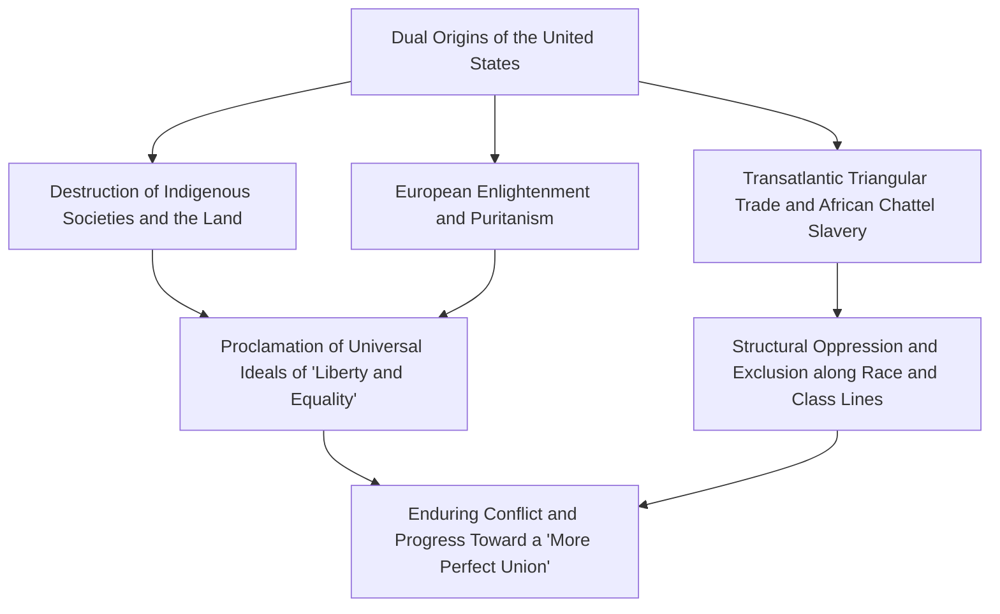
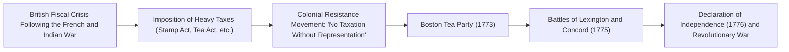
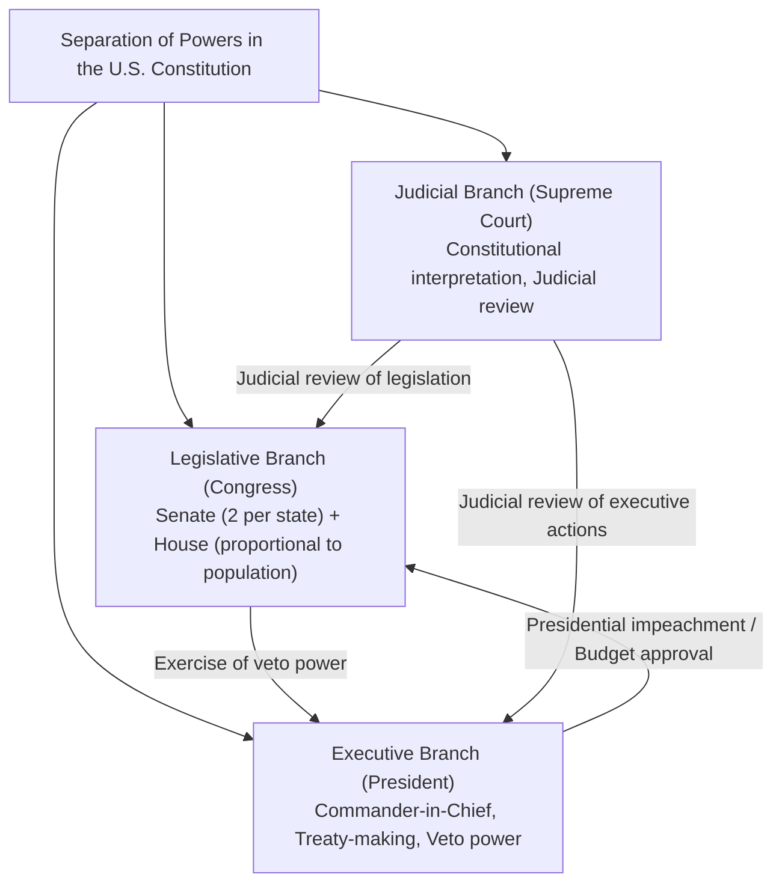
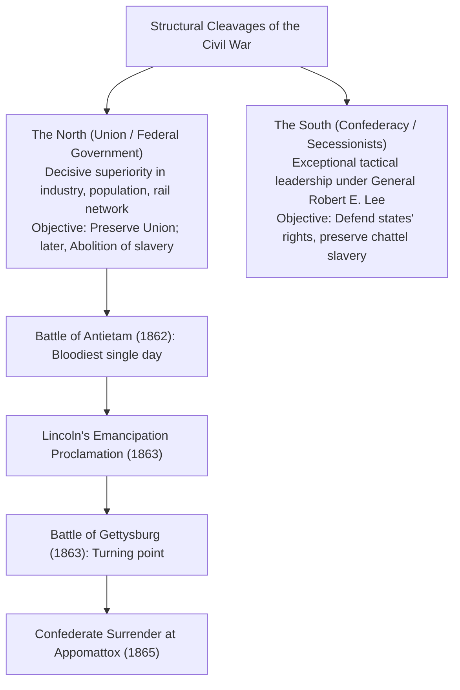
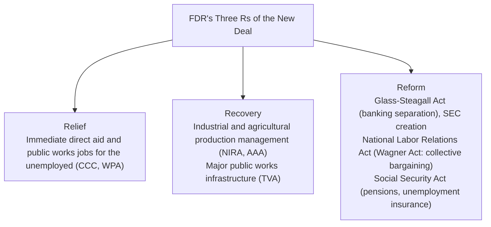
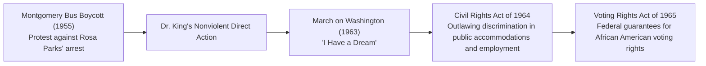
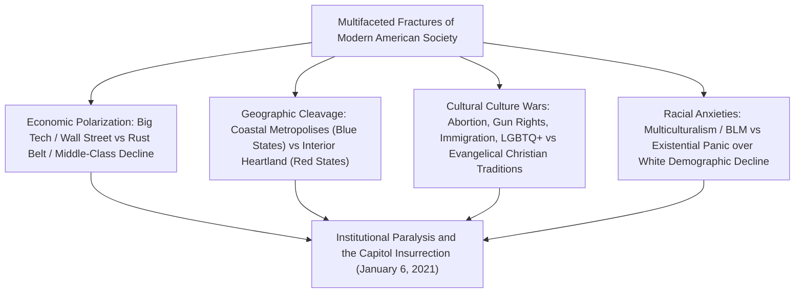
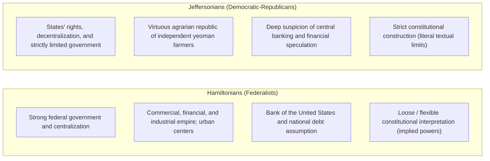

## 1. Introduction: The United States as an Experimental Nation

### 1.1 The Illusion of the "New World" and the Reality of Indigenous Civilizations

In narrating the history of the United States, a mythical narrative long held sway: that it was a "promised land forged in an untamed wilderness by white Europeans seeking freedom." However, advances in anthropology and historiography since the late twentieth century have definitively established that long before the arrival of Europeans, sophisticated and distinct Native American civilizations had flourished across this continent for thousands of years.

A diverse and rich social ecology thrived: from the mound-builder civilizations exemplified by the massive urban center of Cahokia in the Mississippi Valley, to the intricate cliff dwellings crafted by the Ancestral Puebloan (Anasazi) culture of the Southwest, and the Haudenosaunee (Iroquois Confederacy) of the Northeast, where five nations united to establish an advanced democratic confederacy. Following Christopher Columbus's landfall in 1492, the introduction of European infectious diseases—smallpox, measles, influenza (the so-called "Columbian Exchange")—alongside ruthless campaigns of conquest wiped out an estimated 80% to 90% of the indigenous population. A sober historical awareness that the "New World" was constructed atop this devastation is an indispensable starting point for any rigorous understanding of modern American history.

---

### 1.2 The Pilgrim Fathers, the Mayflower Compact, and the Spiritual Imprint of Puritanism

Following the establishment of Jamestown (Virginia Colony) in 1607, the spiritual cornerstone of American national identity was laid by the Separatist Puritans—the Pilgrim Fathers—who landed in Massachusetts Bay aboard the *Mayflower* in 1620.

Just prior to disembarking, they signed the **Mayflower Compact**, a landmark declaration of self-governance in human history. Rather than accepting top-down rule imposed by a monarch or feudal lords, it established a political body governed by **"just and equal laws enacted through the voluntary consent of free individuals (a social contract) to govern themselves."**

The vision articulated by their leader John Winthrop—"A City upon a Hill," the profound conviction that a Puritan community bound in covenant with God must shine as a beacon and model for the entire world—became the foundational DNA of what would later be known as "American Exceptionalism": the enduring belief that the United States is endowed with a unique, transcendent mission to lead humanity.

---

## 2. From the Colonial Era to the Revolutionary War and the Framing of the Constitution

### 2.1 The Development of the Thirteen Colonies and the End of "Salutary Neglect"

The thirteen British colonies established along the Atlantic seaboard developed markedly divergent socioeconomic architectures: northern New England (commerce, maritime fisheries, small-scale family farming, and devout Puritanism); the Middle Colonies (grain agriculture and a diverse ethnic and religious mosaic); and the Southern Colonies (large-scale cash-crop plantations producing tobacco, rice, and indigo powered by the labor of enslaved Black people).

Until the mid-eighteenth century, the British Crown practiced a policy of **"Salutary Neglect,"** refraining from strict parliamentary enforcement and granting the colonies substantive de facto self-government. However, although Great Britain emerged victorious from the French and Indian War (1754–1763)—the North American theater of the Seven Years' War fought for European hegemony—the imperial treasury was burdened with staggering war debts.

Citing the need to fund colonial defense, the British Parliament abruptly pivoted toward heavy taxation of the colonies:
- **The Sugar Act (1764)** and **The Stamp Act (1765)**: Levying taxes on legal documents, newspapers, pamphlets, and even playing cards.
- The colonists mounted fierce resistance, rallying around the constitutional maxim **"No taxation without representation"** and organizing widespread boycotts of British goods.
- Escalating tensions led to the Boston Massacre in 1770 and the Boston Tea Party in 1773 (where chests of East India Company tea were hurled into Boston Harbor). When London responded with punitive military crackdowns (the Coercive, or "Intolerable," Acts), armed conflict became unavoidable.

---

### 2.2 Thomas Paine's *Common Sense* and the Declaration of Independence (1776)

In April 1775, gunfire echoed across Lexington and Concord, initiating the American Revolutionary War. At the time, many colonists still wavered between lingering loyalty to King George III and the radical step of total independence.

This hesitation was shattered almost overnight in January 1776 by the anonymous publication of Thomas Paine's pamphlet, ***Common Sense***. Writing in vivid, accessible, and impassioned prose, Paine demonstrated the absurdity of an entire continent being perpetually governed by an island, while condemning hereditary monarchy as an inherently illegitimate institution that desecrated the natural rights of humankind. Selling hundreds of thousands of copies, the pamphlet ignited an uncontainable fervor for independence across the colonies.

On July 4, 1776, the Second Continental Congress formally adopted the **Declaration of Independence**, drafted by Thomas Jefferson:

> "We hold these truths to be self-evident, that all men are created equal, that they are endowed by their Creator with certain unalienable Rights, that among these are Life, Liberty and the pursuit of Happiness.—That to secure these rights, Governments are instituted among Men, deriving their just powers from the consent of the governed."

Synthesizing John Locke's social contract theory and natural rights philosophy, this eloquent manifesto justified the people's right of revolution against tyrannical governance, becoming a timeless monument to universal liberty in world history.

The Continental Army, led by Commander-in-Chief George Washington, waged a war of attrition, enduring severe supply shortages and harsh winters. Following the pivotal American victory at the Battle of Saratoga (1777), Washington secured formal military alliances with France, Spain, and the Dutch Republic. After besieging and forcing the surrender of the main British forces at the Battle of Yorktown in 1781, Great Britain formally recognized the complete sovereignty and independence of the United States in the Treaty of Paris (1783).

---

### 2.3 The Failure of the Articles of Confederation and the Constitutional Convention of Philadelphia (1787)

The newly independent nation operated initially under the Articles of Confederation, ratified in 1781. In reality, it was little more than a loose confederation of thirteen sovereign, independent states:
- The national government (the Confederation Congress) lacked the authority to levy taxes, maintain a standing army, or regulate interstate and foreign commerce.
- When Shays' Rebellion (1786)—an armed uprising of debt-burdened farmers suffering from postwar economic depression and aggressive tax enforcement—erupted in Massachusetts, the confederation government was powerless even to dispatch federal troops, exposing the young republic to the immediate threat of collapse.

In the summer of 1787, fifty-five delegates (the "Founding Fathers," including James Madison, Alexander Hamilton, and Benjamin Franklin) convened at Independence Hall in Philadelphia to draft what would become the enduring **Constitution of the United States**.

- **The Great Compromise (Connecticut Compromise)**: Harmonized the demands of smaller states for equal representation (the New Jersey Plan) with those of larger states for proportional representation (the Virginia Plan), creating a bicameral legislature comprising the Senate (two senators per state) and the House of Representatives (apportioned by population).
- **The Three-Fifths Compromise**: In calculating seats in the House and direct tax liabilities, delegates struck a fateful compromise to appease Southern states while limiting their political dominance: each enslaved person was counted as "three-fifths" of a free person.
- **Checks and Balances**: Drawing directly upon Montesquieu's theory of separation of powers, the framers divided authority among the Executive, Legislative, and Judicial branches, constructing intricate institutional barriers to prevent any single individual or faction from seizing despotic control.

---

## 3. Territorial Expansion, Manifest Destiny, and the Tumultuous Civil War

### 3.1 "Manifest Destiny" and Transcontinental Territorial Expansion

During the first half of the nineteenth century, the United States expanded westward at an astonishing pace:
- **1803: The Louisiana Purchase**: President Thomas Jefferson purchased the vast territory of Louisiana west of the Mississippi River from Napoleon Bonaparte for just $15 million, instantly doubling the nation's land area.
- **1823: The Monroe Doctrine**: President James Monroe articulated the foundational principles of American foreign policy—isolationism and mutual non-interference—proclaiming that European powers must not interfere in the affairs of the Western Hemisphere, just as the United States would not embroil itself in European conflicts.
- **Manifest Destiny**: The expansionist ideology that it was the divinely ordained mission of the United States to possess and cultivate the North American continent to the Pacific Ocean, spreading liberty and democratic institutions, captured the national imagination.

Behind this relentless territorial conquest, however, the sovereign homelands of indigenous peoples were systematically devastated. Under the Indian Removal Act of 1830, orchestrated by President Andrew Jackson, the Cherokee and other Southeast nations were forcibly uprooted from their ancestral eastern woodlands and marched across thousands of miles of frozen wilderness to present-day Oklahoma (the Indian Territory). Marked by the deaths of thousands from starvation, exposure, and disease, this harrowing forced expulsion remains seared into history as the **"Trail of Tears."**

Following victory in the Mexican-American War (1846–1848), the United States annexed Alta California, Texas, and New Mexico. With the ensuing California Gold Rush of 1848, the United States fulfilled its continental expanse, stretching unbroken from the Atlantic to the Pacific.

---

### 3.2 The Slavery Crisis and Deepening Sectional Division

Yet, with every leap westward, a catastrophic question repeatedly threatened the Union: **"Shall slavery be permitted or prohibited in the newly incorporated territories?"**

- **The Northern Economy**: Driven by the Industrial Revolution, the North developed extensive manufacturing, commerce, and finance powered by free wage labor, favoring protective tariffs to safeguard its domestic markets.
- **The Southern Economy**: Founded upon vast cotton plantations, the South flourished as "King Cotton," entirely dependent on the uncompensated labor of four million enslaved African Americans and staunchly advocating free trade to export its cash crops to Great Britain and Europe.

To preserve the fragile equilibrium between "free states" and "slave states" in the U.S. Senate, a series of precarious legislative compromises were enacted, including the Missouri Compromise of 1820 (prohibiting slavery in territories north of latitude 36°30') and the Compromise of 1850 (which enacted a draconian Fugitive Slave Act).

However, the passage of the Kansas-Nebraska Act of 1854—which left the question of slavery to local territorial voters under the doctrine of "popular sovereignty"—ignited a bloody localized civil conflict dubbed "Bleeding Kansas." Furthermore, in the notorious 1857 ***Dred Scott v. Sandford*** decision, the Supreme Court ruled that Black people were not citizens under the Constitution and possessed "no rights which the white man was bound to respect," declaring that Congress lacked the constitutional power to ban slavery in federal territories. The verdict provoked incandescent outrage throughout anti-slavery circles across the North.

---

### 3.3 The American Civil War (1861–1865): Bloody Reunion and Emancipation

When Republican Abraham Lincoln was elected president in 1860 on a platform pledged to halt the further westward expansion of slavery, seven Southern states led by South Carolina declared their secession from the Union and organized the Confederate States of America.

In April 1861, Confederate artillery opened fire on federal-held Fort Sumter in Charleston Harbor, inaugurating the **American Civil War**.

Lincoln elevated the purpose of the war from a mere suppression of rebellion to preserve the Union into a moral crusade for universal human freedom:
- **January 1, 1863: The Emancipation Proclamation**: Declaring all enslaved persons within Confederate-held territory to be forever free. This unlocked the enlistment of roughly 180,000 Black soldiers into the Union ranks and morally foreclosed any diplomatic recognition or military intervention by Britain or France on behalf of the Confederacy.
- **November 1863: The Gettysburg Address**: Lincoln movingly proclaimed that **"government of the people, by the people, for the people, shall not perish from the earth."**

Through total war and scorched-earth campaigns—most notably General William Tecumseh Sherman's March to the Sea—the Union grinded down the South. In April 1865, Confederate General Robert E. Lee surrendered to Union General Ulysses S. Grant at Appomattox Court House in Virginia. At the cost of more than 600,000 lives—the deadliest conflict in American history—the nation ratified the Thirteenth Amendment (abolishing slavery), the Fourteenth Amendment (guaranteeing due process and equal protection under the law), and the Fifteenth Amendment (securing voting rights regardless of race). The United States was fundamentally transformed from a fragile collection of states into an indivisible, unified nation-state.

However, once the Reconstruction era collapsed, Southern states instituted the brutal regime of "Jim Crow" segregation laws, ushering in decades of disenfranchisement, virulent racial terror, and extrajudicial lynchings by the Ku Klux Klan (KKK).

---

## 4. The Gilded Age, the Industrial Revolution, and the Dawn of Imperialism

### 4.1 The Rise of Giant Corporations and the "Gilded Age"

In the decades following the Civil War and continuing into the early twentieth century, the American economy experienced an explosive expansion unprecedented in human history. Mark Twain satirically dubbed this era the **"Gilded Age"**—a period glittering brilliantly with gold on the surface, but hollow and corrupt at its core.

- The completion of the First Transcontinental Railroad in 1869 integrated the entire continent into a colossal single domestic market.
- **Monopolies of the "Robber Barons"**:
  - John D. Rockefeller's Standard Oil (controlling over 90% of U.S. oil refining).
  - Andrew Carnegie's steel empire (Carnegie Steel).
  - J. Pierpont Morgan's consolidation of finance capital and titanic industrial trusts (the founding of U.S. Steel).
- Thomas Edison's electrical grid, Alexander Graham Bell's telephone, and Henry Ford's assembly-line mass production (Fordism) propelled American industrial output past that of Great Britain and Germany combined, establishing the United States as the world's preeminent manufacturing titan.

At the same time, extreme concentrations of wealth and wretched working conditions triggered bloody labor confrontations, such as the Homestead Strike and the Pullman Strike, while tens of millions of "New Immigrants" from Southern and Eastern Europe (Italians, Poles, Slovaks, and Eastern European Jews) crowded into squalid urban tenements.

---

### 4.2 The Closing of the Frontier and the Acquisition of Overseas Territories

In the 1890 census, historian Frederick Jackson Turner famously declared the "closing of the American frontier." With the vanishing of the western frontier that had forged American democratic vitality and rugged individualism, the nation's ambition turned outward toward overseas markets across the Pacific and Latin America, reinforced by Alfred Thayer Mahan's influential naval doctrine of sea power.

- **1898: The Spanish-American War**: Triggered by the explosion of the USS *Maine* in Havana Harbor, the United States fought and rapidly defeated Spain in a few short months. Annexing the Philippines, Guam, and Puerto Rico, and annexing Hawaii in the same year, the nation abruptly transformed into a transpacific empire.
- **The Open Door Policy (1899)**: Secretary of State John Hay issued the Open Door notes regarding the European and Japanese partitioning of China, asserting principles of equal commercial opportunity and the preservation of Chinese territorial and administrative integrity to secure access to Asian markets.

Domestically, in order to curb corporate excesses and eliminate systemic political corruption, Presidents Theodore Roosevelt (trust-busting and environmental conservation) and Woodrow Wilson championed the **Progressive Era** reform movement. This era culminated in the aggressive enforcement of the Sherman Antitrust Act, the creation of the Federal Reserve System (1913), and the passage of the Nineteenth Amendment (1920), which secured women's suffrage.

---

## 5. The Two World Wars, the Great Depression, and the Rise of Pax Americana

### 5.1 World War I and the "Roaring Twenties"

When World War I erupted in 1914, the United States initially declared neutrality, supplying arms, grain, and raw materials to the European belligerents and transforming itself from a debtor nation into the world's greatest creditor. However, following Imperial Germany's resumption of unrestricted submarine warfare and the interception of the Zimmermann Telegram, the U.S. entered the conflict in 1917.

President Woodrow Wilson proclaimed his **Fourteen Points**, articulating an idealistic vision for the postwar order that included the abolition of secret diplomacy, national self-determination, and the establishment of a League of Nations. Yet, in the aftermath of the war, the U.S. Senate—reasserting its deep-rooted isolationist tradition—refused to ratify the Treaty of Versailles, leaving the United States outside the League of Nations.

During the 1920s, the nation entered an era of unprecedented mass consumer prosperity known as the **"Roaring Twenties."**
- Radios, Model T automobiles, motion pictures, jazz music, and electric home appliances became ubiquitous features of middle-class households.
- Financial markets were swept by speculative stock mania, fostering a widespread conviction of "permanent prosperity."
- Simultaneously, the enforcement of Prohibition (Eighteenth Amendment) fueled the violent rise of organized crime syndicates (Al Capone), while nativism, religious fundamentalism, and racial backlash (the resurgence of the Ku Klux Klan and the National Origins Act of 1924) cast dark shadows across society.

---

### 5.2 The Great Depression and the New Deal

On October 24, 1929—"Black Thursday"—the catastrophic collapse of stock prices on Wall Street triggered the Great Depression.
Across the country, thousands of commercial banks failed, unemployment soared to 25% (one in four workers), and catastrophic ecological dust storms (the Dust Bowl) ravaged the Great Plains, displacing hundreds of thousands of impoverished farmers. President Herbert Hoover's laissez-faire reliance on voluntary cooperation collapsed utterly.

Taking office in 1933, President Franklin Delano Roosevelt (FDR) launched the bold experimental program known as the **New Deal**.

Anticipating Keynesian economics, the New Deal saw the federal government intervene decisively in the private economy to build the institutional foundations of an American welfare state. It dramatically expanded presidential authority and reshaped modern American liberalism for generations.

---

### 5.3 World War II and the Ascent to Global Hegemony

On December 7, 1941, the Japanese surprise attack on Pearl Harbor thrust the United States directly into World War II.

Roosevelt designated the nation the **"Arsenal of Democracy,"** mobilizing civilian industrial manufacturing for total war. Automobile assembly plants rapidly converted to the mass production of tanks and warplanes, while millions of women entered factory workforces (epitomized by "Rosie the Riveter").

- In the European theater: The success of the Normandy landings (D-Day, 1944) and the ultimate defeat of Nazi Germany.
- In the Pacific theater: The brutal "island-hopping" campaign culminating in Japan's unconditional surrender.
- Behind the scenes: The ultra-secret Manhattan Project, which developed the atomic bomb, dropped on Hiroshima and Nagasaki in August 1945.

At the war's conclusion, the United States accounted for fully half of the world's total industrial output, held 70% of global gold reserves, and stood as the world's sole nuclear power.
The Bretton Woods Agreement of 1944 instituted an **international monetary framework anchored to the U.S. dollar backed by gold (alongside the IMF and World Bank)**, and in 1945 the United Nations Charter was signed in San Francisco. The era of **"Pax Americana"** had formally dawned.

---

## 6. Cold War Architecture, the Civil Rights Movement, and American Triumphs and Agonies

### 6.1 The Cold War and the Shadow of Nuclear Deterrence

Out of the ashes of World War II emerged the Cold War—a global geopolitical and ideological confrontation between the United States, championing the Western capitalist bloc, and the Soviet Union, leading the communist world.

- **1947: The Truman Doctrine**: Formulating the "Containment Policy" to check the global spread of Soviet communism.
- **The Marshall Plan**: Massive financial aid packages for European economic recovery to inoculate Western Europe against communist revolution.
- **1949: Creation of NATO (North Atlantic Treaty Organization)**: Establishing a collective security alliance.
- The eruption of the Korean War (1950–1953) and intense domestic anti-communist paranoia and witch-hunts ("McCarthyism" or the Second Red Scare).

During the **Cuban Missile Crisis** of October 1962, triggered by the clandestine Soviet deployment of nuclear missiles in Cuba, President John F. Kennedy and Premier Nikita Khrushchev engaged in a direct confrontation that brought humanity to the brink of nuclear catastrophe. A precarious peace was maintained under the grim doctrine of Mutually Assured Destruction (MAD).

---

### 6.2 The Civil Rights Movement: The Struggle for Genuine Equality

In the postwar era, while white middle-class families migrated to newly built suburban communities enjoying television sets and modern consumer appliances, African Americans—especially across the Jim Crow South—remained trapped in institutionalized disenfranchisement, segregation, and degradation.

In 1954, the Supreme Court handed down its historic decision in ***Brown v. Board of Education of Topeka***, holding that racial segregation in public schools was "inherently unequal" and unconstitutional, igniting the nationwide Civil Rights Movement.

Led by the Reverend Dr. Martin Luther King Jr., activists engaged in disciplined, nonviolent direct action—sit-ins, Freedom Rides, and peaceful marches. Southern law enforcement countered with police attack dogs, tear gas, and high-pressure firehoses. Televised broadcasts of this brutal violence shocked the nation's conscience. Under President Lyndon B. Johnson, Congress enacted the **Civil Rights Act of 1964** and the **Voting Rights Act of 1965**, dismantling the century-old legal infrastructure of American racial segregation.

---

### 6.3 The Quagmire of the Vietnam War and the Counterculture

Yet, captivated by the Cold War "Domino Theory"—the conviction that if one nation fell to communism, surrounding nations would inevitably follow—the United States plunged into catastrophic military intervention in the Vietnam War (1965–1973).
Jungle guerrilla combat, the deployment of toxic Agent Orange, the atrocities of the My Lai massacre, and the deaths of tens of thousands of young American draftees thoroughly shattered public faith in federal institutions.

Massive anti-war demonstrations erupted across university campuses, merging into a sweeping **"Counterculture"** movement: hippies, rock music (the Woodstock Festival), the women's liberation movement, and modern environmentalism. In 1974, following the Watergate scandal and subsequent cover-up, President Richard Nixon resigned under threat of impeachment—the first and only president in U.S. history to do so. The nation drifted into an era of deep spiritual malaise, economic stagflation, and crisis under the Carter presidency.

---

## 7. From Reaganomics to the Post-Cold War, 9/11, and Modern Polarization

### 7.1 The Reagan Revolution and the End of the Cold War

In 1980, Ronald Reagan swept into the presidency promising to "Make America Great Again."

- **Reaganomics**: Grounded in supply-side economic theory, Reagan implemented sweeping income tax cuts, deregulation, domestic spending reductions, and tight monetary policy, championing "small government" and ushering in the global era of neoliberalism.
- **Confronting the "Evil Empire"**: Escalating defense spending, Reagan launched the Strategic Defense Initiative (SDI, or "Star Wars"), reigniting the arms race and exhausting the sclerotic Soviet planned economy.
- The fall of the Berlin Wall in 1989 and the formal dissolution of the Soviet Union on Christmas Day in 1991 signaled the decisive end of the Cold War. Historian Francis Fukuyama proclaimed this epochal moment "the end of history"—the final triumph of Western liberal democracy and market capitalism.

---

## 7.1.5 The Gulf War (1991) and the Revolution of the Powell Doctrine

In August 1990, immediately following the end of the Cold War, Iraqi President Saddam Hussein launched a lightning invasion of neighboring Kuwait. President George H.W. Bush assembled a broad coalition under United Nations Security Council authorization, commanding forces from 34 nations to launch Operation Desert Storm in January 1991.

### A Military Doctrine Born from the Trauma of Vietnam
Forged from the painful lessons of the protracted quagmire in Vietnam, Chairman of the Joint Chiefs of Staff General Colin Powell articulated the **"Powell Doctrine"**:
1. Is a vital national security interest threatened?
2. Has every diplomatic and economic alternative been exhausted as a genuine last resort?
3. Is there a clear, achievable military objective?
4. Will **"overwhelming force"** be applied decisively to crush enemy resistance in the shortest possible timeframe?
5. Is there a clear and plausible exit strategy?

Showcased in real time on CNN, the U.S. military deployed cutting-edge stealth fighters (F-117 Nighthawks), GPS-guided precision munitions ("smart bombs"), Tomahawk cruise missiles, and Patriot air-defense batteries, obliterating the Iraqi army after a ground campaign lasting just 100 hours.

President Bush declared, "By God, we've kicked the Vietnam syndrome once and for all," and the United States gained supreme confidence as the world's "sole superpower," championing a "New World Order." Ironically, however, the very memory of this frictionless victory led neoconservative policymakers to abandon the prudence of the Powell Doctrine in the 2003 Iraq War, breeding the catastrophic hubris that led to disastrous regime change and prolonged occupation.

---

## 7.2 The Promises and Perils of Globalization, and the Information Technology Revolution

Under President Bill Clinton in the 1990s, the reduction of post-Cold War defense spending (the "peace dividend") combined with the explosive rise of the commercial Internet and Silicon Valley created an era of unprecedented economic expansion (the "New Economy").

The administration championed global trade liberalization through the North American Free Trade Agreement (NAFTA) and paved the way for China's accession to the World Trade Organization (WTO). Yet, this triumph of globalization and financialized capitalism generated deep structural fractures within the domestic landscape:
- Manufacturing plants relocated en masse to low-wage economies in Mexico and China, gutting industrial towns across the Midwest and generating the "Rust Belt," where millions of white working-class families experienced downward mobility.
- An unbridgeable economic and cultural chasm widened between affluent coastal tech and financial elites and the hollowed-out communities of the interior.

---

### 7.3 The 9/11 Terrorist Attacks and the Missteps of the "War on Terror"

On September 11, 2001, al-Qaeda hijackers flew commercial airliners into the World Trade Center towers in New York City and the Pentagon in Washington, D.C. Reeling from the first foreign attack on the continental homeland since 1814, American society rallied around unprecedented patriotic solidarity as President George W. Bush declared a global "War on Terror."

- The invasion of Afghanistan (toppling the Taliban regime that harbored al-Qaeda).
- 2003: The invasion of Iraq, justified on assertions that the regime possessed weapons of mass destruction (WMDs).
- However, no WMD stockpiles were ever discovered. Iraq descended into sectarian civil war and became a fertile breeding ground for extremist insurgencies (including ISIS). The conflicts cost thousands of American lives, hundreds of thousands of civilian casualties, and trillions of dollars, severely eroding America's moral authority on the world stage.

---

### 7.4 The Great Recession, Obama, the Trump Phenomenon, and Twenty-First-Century Turmoil

In 2008, the collapse of Wall Street's subprime mortgage bubble precipitated the Great Recession. Amidst the worst financial crisis since the 1930s, Barack Obama made history as the nation's first African American president on a message of "Hope" and "Change." While Obama achieved sweeping healthcare reform (the Affordable Care Act / Obamacare), fierce conservative grassroots backlash—crystallized in the Tea Party movement—plunged Washington into historic legislative gridlock.

In 2016, channeling the volcanic resentment of Rust Belt working-class voters who felt abandoned by political elites and hyper-globalization, Donald J. Trump captured the presidency on an unapologetic "America First" nationalist platform.

As dramatized by the violent insurrection at the U.S. Capitol on January 6, 2021, the modern United States confronts what is arguably its deepest breakdown in national consensus since the Civil War.

---

---

## 2.4 The Ideological Rift Among the Founders: The Hamilton–Jefferson Debates

Following the ratification of the Constitution, one of the most consequential intellectual clashes in political history unfolded within the cabinet of the first president, George Washington: the duel between Secretary of the Treasury Alexander Hamilton and Secretary of State Thomas Jefferson.

### ① Clashing Economic Visions: Financial Empire vs. Agrarian Republic
- **Hamilton's Vision**: Modeled the American future on Great Britain's fiscal-military prowess. He proposed that the federal government assume all wartime debts incurred by individual states (the Assumption Act), establish a national debt as a cohesive national cement, and charter the First Bank of the United States. He championed federal protection for domestic manufacturing and sought a centralized state supported by a standing army and an administrative bureaucracy.
- **Jefferson's Vision**: Convinced that large cities and manufacturing factories were breeding grounds for political corruption and that citizens dependent on wages could never exercise true republican independence. He believed that self-sufficient, landowning yeoman farmers were the true repositories of civic virtue and morality. Jefferson insisted that the national government should remain minimal, handling only national defense and essential foreign diplomacy.

### ② Constitutional Hermeneutics: Implied Powers vs. Strict Construction
- The debate over whether Congress possessed the authority to charter a national bank crystallized the fundamental divide in American jurisprudence.
- **Jefferson's Strict Construction**: Nowhere in Article I, Section 8 among the enumerated powers of Congress is the power to incorporate a bank mentioned. Exercising powers not explicitly granted by the constitutional text was, to Jefferson, an unconstitutional usurpation that violated the rights reserved to the states and the people under the Tenth Amendment.
- **Hamilton's Loose Construction**: Drawing upon Article I, Section 8, Clause 18—the "Necessary and Proper Clause" (the Elastic Clause)—Hamilton argued that the federal government possessed "implied powers" to adopt any reasonable means necessary to execute its explicitly enumerated powers (such as taxing and managing public debt), even in the absence of explicit textual authorization. Hamilton's doctrine was formally canonized by Chief Justice John Marshall in the landmark Supreme Court decision ***McCulloch v. Maryland* (1819)**, establishing the enduring constitutional bedrock for expansive modern federal governance.

---

## 3.6 Military and Technological Watersheds of the Civil War and the Agony of Reconstruction

The American Civil War is widely recognized as history's "First Modern Total War." The technological fruits of the Industrial Revolution were deployed across the battlefield on a massive scale, rendering obsolete the romantic, Napoleonic-era infantry tactics of open-field maneuver.

### ① The Military-Technological Revolution
1. **Rifled Muskets and the Minié Ball**:
   - While traditional smoothbore muskets had an effective range of merely $50 \sim 100$ yards, rifled barrels firing soft lead Minié balls extended lethality to $300 \sim 500$ yards.
   - However, commanders on both sides continued to order troops forward in tightly packed, shoulder-to-shoulder linear assaults, sending infantry directly into catastrophic fields of fire. The resulting slaughter, as witnessed at Pickett's Charge at Gettysburg, produced tens of thousands of casualties in hours and compelled armies to dig into defensive trench systems.
2. **Military Utilization of Railroads and the Telegraph**:
   - The Union utilized its vast, standardized railroad network to transport tens of thousands of reinforcements and tons of supplies directly to front lines in a matter of days.
   - Stationed in the War Department telegraph office adjacent to the White House, President Lincoln monitored tactical developments and communicated orders to generals in real time, pioneering modern command, control, and communications (C4I).
3. **The Clash of Ironclads**:
   - In March 1862 at the Battle of Hampton Roads, the Confederate ironclad CSS *Virginia* (formerly the USS *Merrimack*) battled the Union's revolving-turret USS *Monitor*. The era of wooden sailing navies was rendered extinct overnight.

### ② The Frustrations of Reconstruction (1865–1877) and the Shadow of Jim Crow
Following Lincoln's assassination, President Andrew Johnson pursued an excessively lenient policy toward former Confederate leaders, prompting Radical Republicans in Congress to seize control of Reconstruction. Congress divided the South into five military districts, protected Black male suffrage, and oversaw the historic election of African Americans to state legislatures and the U.S. Congress (Radical Reconstruction).

However, the Compromise of 1877—a backroom political bargain that settled the disputed 1876 presidential election in favor of Rutherford B. Hayes in exchange for the total withdrawal of federal troops from the South—abandoned Black citizens to former Confederate planters and politicians (the "Redeemers"), who promptly reclaimed power:
- Southern states erected an intricate labyrinth of disenfranchisement measures: poll taxes, arbitrary literacy tests, and grandfather clauses (exempting only those whose ancestors had the vote prior to 1867).
- In the infamous 1896 case of ***Plessy v. Ferguson***, the Supreme Court legitimized racial segregation across public transport, schools, and facilities under the doctrine of "separate but equal." This dark regime of Jim Crow segregation would endure across the South for more than half a century until the modern Civil Rights Movement.

---

## 7.5 Judicial Politics and Twenty-First-Century Battles over Supreme Court Precedent

At the forefront of contemporary American political polarization stands the "Judicial Wars"—intense partisan battles over the composition of the federal judiciary and the overturning of landmark Supreme Court precedents.

### ① Reproductive Rights: From *Roe* to the Overturning in *Dobbs*
- **1973: *Roe v. Wade***: The Supreme Court recognized a constitutional right to abortion, grounded in the "right to privacy" protected by the Due Process Clause of the Fourteenth Amendment.
- In reaction, conservative Christian evangelicals and the religious right launched a five-decade alliance with the Republican Party, organizing a relentless political and legal campaign to seat anti-abortion conservative originalists on the high court.
- With Donald Trump appointing three conservative justices (Neil Gorsuch, Brett Kavanaugh, and Amy Coney Barrett) to solidify a 6–3 conservative supermajority, the Court issued its seismic ruling in ***Dobbs v. Jackson Women's Health Organization* (2022)**, formally overruling *Roe v. Wade* after nearly fifty years. The majority held that the Constitution contains no reference to abortion and that no such right is deeply rooted in the nation's history and tradition, returning the authority to regulate or prohibit abortion entirely to state legislatures.
- This reversal triggered trigger bans outlawing abortion across much of the South and Midwest, while liberal states like California and New York declared themselves abortion sanctuaries, driving the nation's cultural and legal divide to unprecedented extremes.

### ② The Right to Bear Arms: Originalism and the Second Amendment
- **The Second Amendment**: "A well regulated Militia, being necessary to the security of a free State, the right of the people to keep and bear Arms, shall not be infringed."
- **2008: *District of Columbia v. Heller***: Guided by the originalist jurisprudence of Justice Antonin Scalia—which interprets constitutional provisions according to their public meaning at the time of enactment—the Supreme Court held for the first time that the Second Amendment confers an individual right to possess a firearm unconnected to service in a militia, centrally for self-defense within the home. This jurisprudence severely limits the ability of federal, state, and local governments to enact comprehensive gun safety legislation even in the face of epidemic mass shootings.

---

## 6.5 The Nixon Shock (1971) and the Formation of the Petrodollar System

One of the most consequential transformations in international finance and global geopolitics in the late twentieth century occurred on August 15, 1971, when President Richard Nixon unilaterally announced the "Nixon Shock" (or Dollar Shock).

### ① The Collapse of the Bretton Woods System
Established in 1944 at Bretton Woods, New Hampshire, the postwar monetary architecture rested upon a gold-exchange standard wherein the United States guaranteed to redeem dollars for gold at the fixed parity of **$35 per ounce of gold**, while other nations pegged their currencies to the U.S. dollar at fixed exchange rates.

By the late 1960s, however, massive federal expenditures for Lyndon Johnson's "Great Society" social programs and the spiraling costs of the Vietnam War produced staggering fiscal and trade deficits. European central banks—most notably France and West Germany—demanded gold in exchange for their mounting dollar holdings, threatening to deplete Fort Knox's gold reserves.

In a nationally televised address, Nixon unilaterally declared **"the temporary suspension of the convertibility of the dollar into gold."** This decision dismantled the Bretton Woods system. By 1973, major economies transitioned permanently to a floating exchange rate system, where currency valuations were determined by market supply and demand.

### ② The Genesis of the Petrodollar System
Severed from its gold backing, the U.S. dollar faced severe inflationary pressures and the threat of global depreciation. In response, Secretary of State Henry Kissinger executed secret diplomatic negotiations with Saudi Arabia, the world's leading crude oil exporter, in 1974:
- The United States guaranteed military protection, arms sales, and security for the House of Saud.
- In return, Saudi Arabia agreed to **price and invoice all global crude oil sales exclusively in U.S. dollars** and to reinvest surplus oil revenues (petrodollars) into U.S. Treasury securities (a practice soon adopted by all OPEC member states).
- This arrangement created a structural imperative: every sovereign nation on earth required massive reserves of U.S. dollars simply to purchase oil, the indispensable lifeblood of modern industrial economies. This **Petrodollar system** cemented the dollar's status as the uncontested global reserve currency, allowing the United States to print fiat currency to acquire real resources worldwide—an advantage French President Charles de Gaulle famously decried as the dollar's "exorbitant privilege."

---

## 7.6 The Demographic Remaking of an Immigrant Nation: The 1965 Immigration Act

Another quiet revolution that fundamentally altered the fabric of American society was the **Immigration and Nationality Act of 1965 (the Hart-Celler Act)**, signed into law by President Lyndon B. Johnson.

The Immigration Act of 1924 (the Johnson-Reed Act) had instituted a strict National Origins Formula based on the 1890 U.S. census, deliberately favoring immigrants from Northern and Western Europe while virtually barring people from Southern and Eastern Europe, Asia, and Africa.

The 1965 Act abolished this racially discriminatory quota system, establishing new immigration criteria prioritized around family reunification and specialized employment skills:
- Although congressional architects did not foresee a dramatic change in national demographics, the results were transformative.
- Immigration from Europe plummeted, while immigration from Latin America (Mexico, Central America) and Asia (China, the Philippines, India, Korea, and Vietnam) surged exponentially.
- By the 2020 U.S. census, the share of non-Hispanic white Americans had declined to approximately $58\%$. Demographic projections indicate that by around 2045, the United States will become a **"majority-minority nation,"** in which no single racial group forms an absolute majority.

The rapid pace of this demographic shift has induced deep existential anxiety among traditional white working-class populations who feel that "their country is being taken from them." This sentiment serves as the profound psychological engine fueling Trumpism: aggressive border enforcement, the border wall, and "America First" nationalism.

## 8. Conclusion: The Unfinished Quest for a "More Perfect Union"

The history of the United States is far more than a chronicle of territorial conquest, economic mastery, or military hegemony: it is **a grand and turbulent epic in which foundational ideals are repeatedly shattered by the brutal contradictions of reality, only to be painstakingly reimagined and rebuilt from the rubble.**

The Preamble to the United States Constitution proclaims at its very opening:
> **"We the People of the United States, in Order to form a more perfect Union..."**

The framers never deluded themselves into believing that the nation they were forging was perfect at its inception. It is for this reason that they chose the dynamic comparative—not a "perfect Union," but a **"more perfect"** Union.

From the dispossession and slaughter of indigenous peoples, the immense sin of chattel slavery, and racial segregation, to foreign imperial misadventures—the United States has committed colossal transgressions throughout its existence. Yet, its true genius and enduring resilience have resided in the capacity of its people to repeatedly amend the Constitution, rectify unjust laws, and push outward the frontiers of liberty and equality through citizen activism.

In the twenty-first century, gripped by profound polarization and cynicism, whether the United States can rediscover its founding motto—*E Pluribus Unum* ("Out of many, one")—and remain a beacon of hope for humanity remains an open question. The voyage toward that elusive ideal continues unabated.
