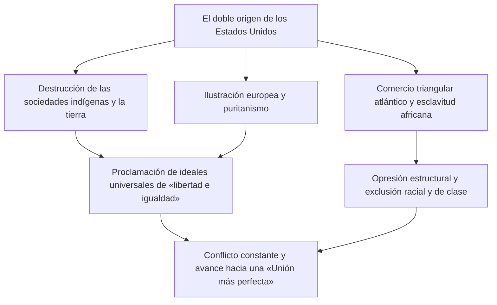
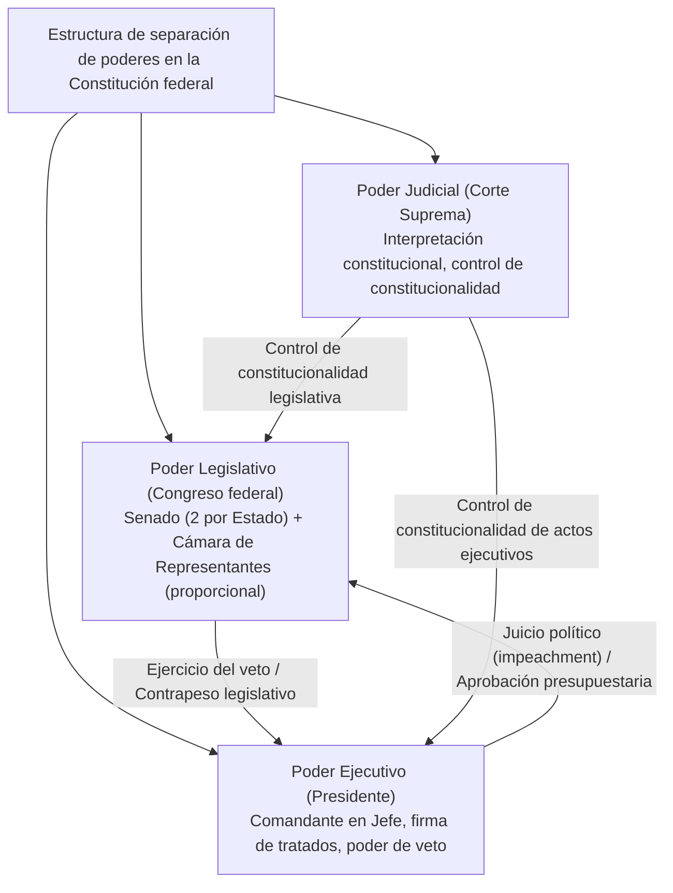
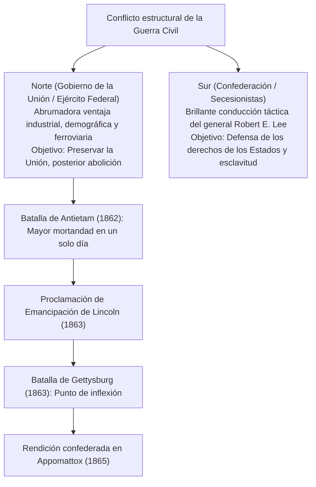
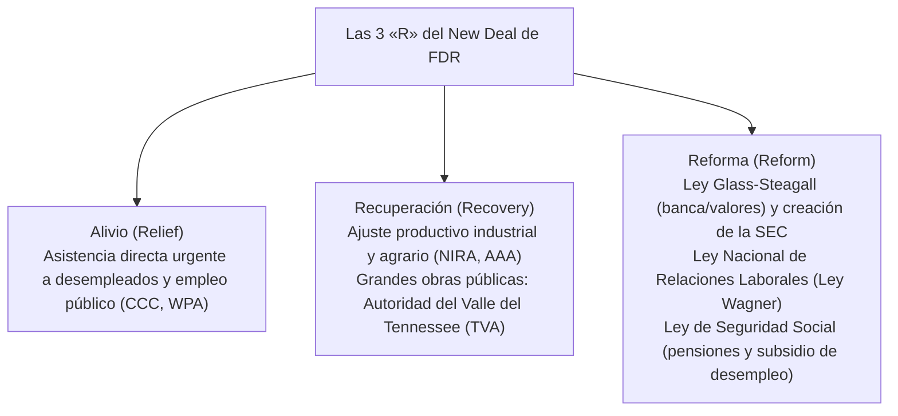
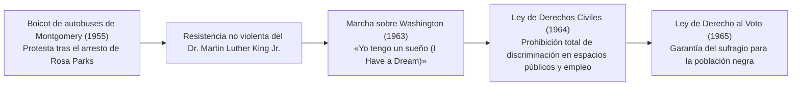
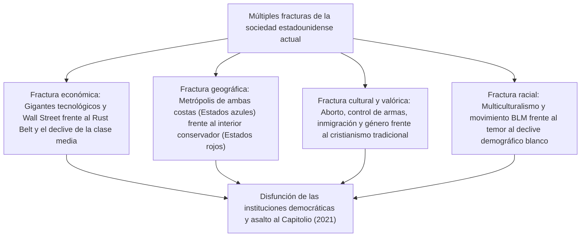
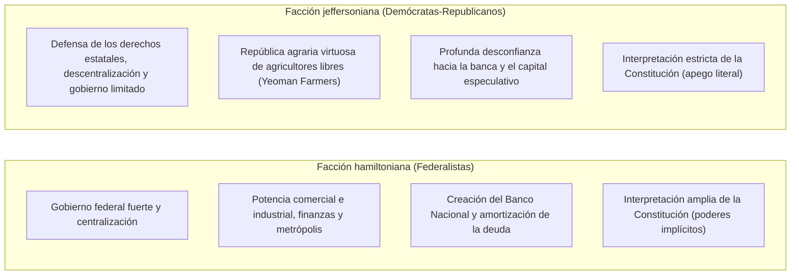

## 1. Introducción: Los Estados Unidos como Estado experimental

### 1.1 La ilusión del «Nuevo Mundo» y la realidad de las civilizaciones indígenas

Al narrar la historia de los Estados Unidos, predominó durante mucho tiempo una narrativa mítica: la de una «tierra prometida» forjada en una naturaleza virgen por colonos blancos europeos en busca de libertad. No obstante, los avances de la antropología y la historiografía desde la segunda mitad del siglo XX han demostrado de manera irrefutable que, mucho antes de la llegada de los europeos, este continente albergaba avanzadas y complejas civilizaciones indígenas (nativos americanos) que florecieron a lo largo de milenios.

Existía un ecosistema social extraordinariamente diverso y próspero: desde la civilización de los constructores de montículos en el valle del Misisipi, ejemplificada por el monumental asentamiento urbano de Cahokia, hasta las elaboradas viviendas en acantilados de la cultura anasazi (pueblo) en el suroeste, pasando por la Confederación Iroquesa (*Haudenosaunee*) en el noreste, una sofisticada unión democrática y federal forjada por cinco naciones indígenas. Tras la llegada de Cristóbal Colón en 1492, las enfermedades infecciosas introducidas desde Europa —como la viruela, el sarampión y la gripe (el llamado «intercambio colombino»)— junto con brutales campañas de conquista diezmaron entre el $80\%$ y el $90\%$ de la población autóctona. Asumir con rigor histórico que el «Nuevo Mundo» se erigió sobre los escombros de esa aniquilación constituye el punto de partida indispensable para comprender la historia estadounidense contemporánea.

---

### 1.2 Los Padres Peregrinos, el Pacto del Mayflower y la impronta espiritual del puritanismo

Tras el establecimiento del asentamiento de Jamestown (colonia de Virginia) en 1607, la piedra angular espiritual de la identidad nacional estadounidense fue colocada en 1620 por los puritanos separatistas —los Padres Peregrinos (*Pilgrim Fathers*)—, quienes desembarcaron en la bahía de Massachusetts a bordo del *Mayflower*.

Poco antes de tocar tierra, se firmó a bordo el **Pacto del Mayflower (*Mayflower Compact*)**, una declaración de autogobierno verdaderamente revolucionaria en la historia humana: no emanaba de la imposición de reyes o señores feudales, sino del principio de **«fundar un cuerpo político civil para gobernarse a sí mismos, promulgando leyes justas y equitativas basadas en el consentimiento voluntario de individuos libres (contrato social)»**.

El concepto de «una ciudad sobre una colina» (*A City upon a Hill*), proclamado por el líder puritano John Winthrop —la convicción mesiánica de que una comunidad puritana unida en pacto con Dios debía resplandecer como faro y modelo moral para el mundo entero—, se convirtió en el ADN fundamental del «excepcionalismo estadounidense» (*American Exceptionalism*), la creencia perdurable de que la nación posee un mandato providencial para guiar el destino de la humanidad.

---

## 2. De la era colonial a la Revolución de Independencia y el nacimiento de la Constitución

### 2.1 El desarrollo de las Trece Colonias y el fin del «abandono saludable»

Las trece colonias británicas establecidas a lo largo de la costa atlántica desarrollaron estructuras socioeconómicas marcadamente dispares: Nueva Inglaterra en el norte (marcada por el comercio, la pesca, la pequeña agricultura de subsistencia y el fervor puritano), las Colonias Centrales (definidas por el cultivo de cereales y un rico mosaico étnico y religioso) y las Colonias del Sur (dominadas por una economía de grandes plantaciones de tabaco, arroz e índigo sustentada en el trabajo forzado de personas negras esclavizadas).

Hasta mediados del siglo XVIII, la Corona británica no intervenía de manera estricta en los asuntos coloniales, aplicando una política de tolerancia fáctica conocida como **«abandono saludable» o negligencia benigna (*Salutary Neglect*)**, que concedió a las asambleas locales un amplio grado de autogobierno. Sin embargo, aunque Gran Bretaña se alzó victoriosa en la Guerra Franco-India (1754-1763) —el teatro norteamericano de la Guerra de los Siete Años por la supremacía europea—, la metrópoli contrajo una descomunal deuda bélica.

Con el pretexto de costear la defensa fronteriza, el Parlamento británico viró hacia una política de imposición fiscal agresiva sobre las colonias:
- **La Ley del Azúcar (*Sugar Act*, 1764)** y la **Ley del Timbre (*Stamp Act*, 1765)**: gravaron documentos legales, periódicos, panfletos e incluso naipes.
- Los colonos reaccionaron con vehemencia, enarbolando el principio constitucional de **«No hay tributación sin representación» (*No taxation without representation*)** e impulsando boicots masivos a las manufacturas británicas.
- La escalada de tensiones condujo a la Masacre de Boston (1770) y al Motín del Té de Boston (1773) —donde cargamentos de té de la Compañía Británica de las Indias Orientales fueron arrojados al mar—. Cuando Londres respondió con medidas coercitivas y represivas (las denominadas «Leyes Intolerables»), el choque armado se tornó inevitable.

---

### 2.2 Thomas Paine, «El sentido común» y la Declaración de Independencia (1776)

En abril de 1775, los disparos en las batallas de Lexington y Concord desataron formalmente la Guerra de Independencia de los Estados Unidos. En aquel momento inicial, una gran parte de los colonos todavía se debatía entre la lealtad monárquica a la Corona británica y la ruptura total hacia la independencia.

Quien pulverizó esas dudas de raíz fue Thomas Paine con su célebre panfleto anónimo **«El sentido común» (*Common Sense*)**, publicado en enero de 1776. Con una prosa apasionada y accesible para el pueblo llano, Paine argumentó que resultaba absurdo que una simple isla gobernara a perpetuidad a todo un continente, denunciando además la monarquía hereditaria como una tiranía perversa que ultrajaba los derechos naturales del ser humano. Con cientos de miles de ejemplares vendidos, el texto desató un clamor popular irrefrenable en favor de la independencia.

Así, el 4 de julio de 1776, el Segundo Congreso Continental adoptó solemnemente la **Declaración de Independencia de los Estados Unidos (*Declaration of Independence*)**, redactada principalmente por Thomas Jefferson.

> «Sostenemos como evidentes estas verdades: que todos los hombres son creados iguales; que son dotados por su Creador de ciertos derechos inalienables; que entre estos están la vida, la libertad y la búsqueda de la felicidad; que para garantizar estos derechos se instituyen entre los hombres los gobiernos, los cuales derivan sus poderes legítimos del consentimiento de los gobernados.»

Sintetizando la teoría del contrato social y la filosofía de los derechos naturales de John Locke, esta magna declaración justificó el derecho del pueblo a la rebelión (derecho a la revolución) frente a la tiranía, consagrándose como un monumento imperecedero a la libertad universal en la historia de la humanidad.

Bajo el mando del general George Washington, el Ejército Continental soportó penurias extremas de suministros y crueles inviernos mediante una estrategia de desgaste militar. La decisiva victoria en la batalla de Saratoga (1777) convenció a Francia, y posteriormente a España y las Provincias Unidas, de intervenir como aliados estratégicos. En 1781, tras el asedio y rendición del grueso de las fuerzas británicas en Yorktown, la Corona británica reconoció formalmente la plena independencia de los Estados Unidos mediante el Tratado de París de 1783.

---

### 2.3 El colapso de los Artículos de la Confederación y la Convención Constituyente de Filadelfia (1787)

Al consumarse la independencia, la naciente república no era más que una laxa confederación de trece Estados soberanos regidos por los «Artículos de la Confederación» (*Articles of Confederation*), ratificados en 1781:
- El gobierno central (el Congreso de la Confederación) carecía de facultades para recaudar impuestos directos, mantener un ejército permanente o regular el comercio exterior e interestatal.
- Cuando estalló la Rebelión de Shays (1786) —un levantamiento armado de agricultores endeudados abrumados por la recesión de posguerra y las cargas fiscales en Massachusetts—, el gobierno confederal fue incapaz de movilizar tropas para restablecer el orden, exponiendo al país a un colapso inminente.

En el verano de 1787, cincuenta y cinco delegados (entre ellos los llamados «Padres Fundadores» como James Madison, Alexander Hamilton y Benjamin Franklin) se congregaron en el *Independence Hall* de Filadelfia para redactar la actual **Constitución de los Estados Unidos**.

- **El Gran Compromiso (Compromiso de Connecticut)**: fusionó el Plan de Nueva Jersey (que exigía una representación igualitaria por Estado, favorecido por los pequeños) y el Plan de Virginia (que demandaba una representación proporcional a la población, promovido por los grandes Estados), estableciendo un Congreso bicameral compuesto por el «Senado» (dos escaños iguales por Estado) y la «Cámara de Representantes» (proporcional al número de habitantes).
- **El Compromiso de los Tres Quintos (*Three-Fifths Compromise*)**: para conciliar las demandas del Sur y evitar su hegemonía desmedida, se acordó contar a cada persona esclavizada como «tres quintos de una persona libre» para el reparto de escaños en la Cámara de Representantes y la asignación de impuestos directos, un compromiso moralmente nefasto pero políticamente decisivo para forjar la federación.
- **Frenos y contrapesos (*Checks and Balances*)**: basándose en las teorías de Montesquieu, se dividieron los poderes en Ejecutivo, Legislativo y Judicial, erigiendo una sofisticada arquitectura institucional para impedir que cualquier individuo, facción u órgano concentrara un poder despótico.

---

## 3. Expansión territorial, Destino Manifiesto y la convulsión de la Guerra Civil

### 3.1 El «Destino Manifiesto» y la expansión transcontinental

Durante la primera mitad del siglo XIX, la Unión se expandió hacia el oeste con una velocidad vertiginosa:
- **1803: La compra de Luisiana (*Louisiana Purchase*)**: el presidente Thomas Jefferson adquirió de Napoleón Bonaparte el inmenso territorio de Luisiana al oeste del río Misisipi por apenas quince millones de dólares, duplicando de un solo golpe la superficie del país.
- **1823: La Doctrina Monroe**: el presidente James Monroe proclamó el principio de no intervención recíproca: las potencias europeas no debían interferir en los asuntos del continente americano, mientras que los Estados Unidos no intervendrían en los conflictos bélicos de Europa.
- **El Destino Manifiesto (*Manifest Destiny*)**: arraigó en la psique colectiva una ideología expansionista que proclamaba que la Providencia divina había otorgado a la nación el deber ineludible y sagrado de poblar, civilizar y gobernar el continente norteamericano desde la costa atlántica hasta el océano Pacífico, propagando la libertad y la democracia.

Bajo la sombra de esta expansión continental, el espacio vital de las naciones indígenas fue sistemáticamente destruido. Con la Ley de Traslado Forzoso de Indígenas (*Indian Removal Act*) de 1830, impulsada por el presidente Andrew Jackson, los pueblos originarios —entre ellos las «Cinco Tribus Civilizadas», como los cheroquis— fueron expulsados por la fuerza de sus tierras ancestrales en los bosques orientales. Fueron obligados a marchar a pie miles de kilómetros a través de gélidas estepas hacia el Territorio Indio (actual Oklahoma). Miles murieron a causa del hambre, la extenuación y las epidemias en esta penosa odisea, grabada indeleblemente en la memoria colectiva como el **«Sendero de Lágrimas» (*Trail of Tears*)**.

Con la victoria en la Guerra de Intervención Estadounidense en México (1846-1848), los Estados Unidos se anexionaron Texas, California, Nuevo México y amplios territorios del suroeste. Acompañada por la Fiebre del Oro de 1848 en California, la Unión consolidó definitivamente su estructura como un coloso transcontinental que unía ambos océanos.

---

### 3.2 La crisis de la esclavitud y la agudización de la fractura nacional

No obstante, cada vez que las fronteras se expandían hacia el oeste, una cuestión corrosiva y divisiva sacudía los cimientos de la federación: **«¿Debía permitirse o prohibirse la esclavitud en los nuevos territorios que se incorporaban como Estados a la Unión?»**

- **La economía del Norte**: inmersa en la Revolución Industrial, desarrolló una pujante manufactura, banca y comercio sustentados en el trabajo asalariado libre. Exigía políticas proteccionistas y aranceles para resguardar su mercado interno.
- **La economía del Sur**: cimentada en las inmensas plantaciones del «Rey Algodón» (*King Cotton*), dependía absolutamente de la explotación y el trabajo no remunerado de casi cuatro millones de afrodescendientes esclavizados. Defendía vehementemente el libre comercio para exportar su materia prima a Gran Bretaña y Europa.

Para mantener el precario equilibrio de poder en el Senado federal entre «Estados libres» y «Estados esclavistas», se recurrió a sucesivas soluciones de compromiso: el Compromiso de Misuri de 1820 (que prohibía la esclavitud en los territorios al norte del paralelo 36°30′ N) y el Compromiso de 1850 (que incluyó una drástica Ley de Esclavos Fugitivos).

Sin embargo, la Ley Kansas-Nebraska de 1854 introdujo la doctrina de la «soberanía popular» (dejando la decisión sobre la esclavitud al voto de los colonos territoriales), desatando una sangrienta guerra civil local conocida como «Kansas sangrante» (*Bleeding Kansas*). Poco después, en 1857, la ignominiosa sentencia de la Corte Suprema en el **Caso Dred Scott (*Dred Scott v. Sandford*)** dictaminó que los afroamericanos no eran ciudadanos ante la Constitución y «no tenían derechos que el hombre blanco estuviera obligado a respetar», declarando inconstitucional cualquier prohibición de la esclavitud en los territorios por parte del Congreso. El fallo indignó profundamente a la opinión pública abolicionista del Norte.

---

### 3.3 La Guerra Civil (1861-1865): Sangrienta reunificación y emancipación

En las elecciones presidenciales de 1860, el candidato del recién fundado Partido Republicano, Abraham Lincoln, partidario de frenar la expansión de la esclavitud hacia el oeste, obtuvo la victoria. En respuesta inmediata, Carolina del Sur y otros seis Estados del Sur proclamaron su secesión de la Unión, constituyendo los «Estados Confederados de América» (*Confederate States of America*).

En abril de 1861, el bombardeo confederado sobre Fort Sumter encendió la hoguera de la **Guerra Civil estadounidense (*American Civil War*)**.

Lincoln elevó la naturaleza del conflicto: de una simple supresión militar de una insurrección para preservar la Unión, a una cruzada moral por la libertad humana universal:
- **1 de enero de 1863: La Proclamación de Emancipación (*Emancipation Proclamation*)**: decretó la libertad inmediata de todas las personas esclavizadas en los territorios rebeldes confederados. Esto facilitó el alistamiento masivo de combatientes afroamericanos en el ejército de la Unión (unos 180.000 soldados) y bloqueó moralmente el reconocimiento diplomático o la intervención militar de Gran Bretaña y Francia a favor de la Confederación.
- **Noviembre de 1863: El Discurso de Gettysburg (*Gettysburg Address*)**: Lincoln exhortó solemnemente a que el **«gobierno del pueblo, por el pueblo y para el pueblo (*government of the people, by the people, for the people*)»** no pereciera de la faz de la tierra.

Tras una guerra total y tácticas de tierra quemada (como la Marcha hacia el Mar del general Sherman), en abril de 1865 el general confederado Robert E. Lee se rindió formalmente ante el general Ulysses S. Grant en Appomattox Court House, Virginia. Tras un saldo devastador de más de 600.000 muertos —la mayor carnicería en la historia nacional—, la ratificación de las enmiendas constitucionales Decimotercera (abolición de la esclavitud), Decimocuarta (debido proceso legal e igualdad ante la ley) y Decimoquinta (derecho de sufragio sin distinción de raza) transformó a los Estados Unidos de una federación de Estados en una «nación indivisible e integrada».

Sin embargo, al concluir la era de la Reconstrucción (*Reconstruction*), los Estados del Sur implementaron las infames leyes segregacionistas de «Jim Crow», dando paso a un prolongado período de terrorismo racial, linchamientos a manos del Ku Klux Klan (KKK) y privación masiva de derechos civiles para la población negra.

---

## 4. La Edad Dorada, la Revolución Industrial y el amanecer del imperialismo

### 4.1 El ascenso del gran capital y la «Edad Dorada»

Entre el final de la Guerra Civil y los albores del siglo XX, la economía estadounidense experimentó una expansión sin precedentes en los anales de la humanidad. Mark Twain bautizó satíricamente a esta era como la **«Edad Dorada» (*Gilded Age*)**, aludiendo a una sociedad con un brillante barniz dorado en su superficie que ocultaba una profunda putrefacción social y corrupción política interna.

- La culminación del ferrocarril transcontinental en 1869 integró todo el territorio nacional en un colosal mercado único.
- **Los monopolios de los «barones ladrones» (*Robber Barons*)**:
  - John D. Rockefeller y la Standard Oil (que llegó a controlar más del $90\%$ de la refinación petrolera del país).
  - Andrew Carnegie y su gigantesco imperio del acero (Carnegie Steel).
  - J. P. Morgan y la concentración del capital financiero en megacorporaciones y *trusts* (fundador de U.S. Steel, la primera corporación milmillonaria).
- La electrificación masiva impulsada por Thomas Edison, la telefonía de Alexander Graham Bell y, más adelante, la cadena de montaje y la producción en masa de Henry Ford (el fordismo), catapultaron a los Estados Unidos al rango de primera potencia industrial del planeta, superando con creces a Gran Bretaña y Alemania.

En contrapartida, la extrema concentración de la riqueza y las condiciones laborales paupérrimas detonaron feroces y sangrientos conflictos sindicales, tales como la huelga de Homestead y la huelga de Pullman, mientras millones de nuevos inmigrantes provenientes de Europa (italianos, irlandeses, judíos de Europa oriental y eslavos) se hacinaban en los miserables tugurios urbanos de las metrópolis industriales.

---

### 4.2 El cierre de la frontera y la adquisición de territorios de ultramar

A partir de los datos del censo de 1890, el historiador Frederick Jackson Turner formuló su célebre tesis sobre el «cierre de la frontera» (*Frontier Thesis*). Al agotarse la frontera del Oeste que había forjado el vigor democrático, el individualismo y la energía expansiva del pueblo estadounidense, la mirada de la nación se dirigió inevitablemente hacia los mercados de ultramar en el océano Pacífico y América Latina, doctrina respaldada por las teorías sobre el poderío naval de Alfred Thayer Mahan.

- **1898: La Guerra Hispano-Estadounidense**: la explosión del acorazado *Maine* en el puerto de La Habana sirvió de detonante para entrar en guerra contra España, obteniendo una rápida y aplastante victoria. Como resultado, los Estados Unidos adquirieron Puerto Rico, Guam y las islas Filipinas, y se anexionaron Hawái, convirtiéndose de súbito en un imperio marítimo interoceánico.
- **La Doctrina de Puertas Abiertas (1899)**: el secretario de Estado John Hay proclamó ante el reparto de China por las potencias coloniales europeas y Japón el principio de «puertas abiertas, igualdad de oportunidades comerciales e integridad territorial», consolidando el despliegue comercial y estratégico de Washington en Asia.

En el plano interno, para refrenar los excesos de los monopolios y la rampante corrupción política, cobró fuerza el movimiento del **«Progresismo» (*Progressivism*)**, abanderado por mandatarios como Theodore Roosevelt (mediante la disolución de monopolios con la Ley Sherman Antimonopolio y la creación de parques nacionales) y Woodrow Wilson. Este ciclo reformista cristalizó en la aplicación de normativas antitrust, la creación del Sistema de la Reserva Federal (FRS) y la aprobación del sufragio femenino a través de la Decimonovena Enmienda.

---

## 5. Las dos guerras mundiales, la Gran Depresión y la consolidación de la Pax Americana

### 5.1 La Primera Guerra Mundial y los «Felices Años Veinte»

Al estallar la Primera Guerra Mundial en 1914, los Estados Unidos mantuvieron inicialmente una política de estricta neutralidad. La exportación masiva de armamento, alimentos e insumos industriales a los Aliados transformó con rapidez al país de deudor internacional a la mayor potencia acreedora del planeta. Sin embargo, la reanudación alemana de la guerra submarina indiscriminada y la interceptación del telegrama Zimmermann precipitaron la entrada de Washington en la contienda en 1917.

El presidente Woodrow Wilson presentó sus célebres **«Catorce Puntos»**, proponiendo la abolición de la diplomacia secreta, la autodeterminación de los pueblos y la creación de la Sociedad de Naciones para garantizar la seguridad colectiva. No obstante, anclado en su arraigada tradición aislacionista, el Senado estadounidense rechazó la ratificación del Tratado de Versalles y vetó el ingreso del país en la Sociedad de Naciones.

Durante la década de 1920, la nación se sumergió en una época dorada de consumo de masas sin precedentes: los **«Felices Años Veinte» (*Roaring Twenties*)**:
- La radio, el automóvil (el modelo Ford T), el cine de Hollywood, el jazz y los electrodomésticos poblaron la vida cotidiana de las familias.
- Wall Street se convirtió en el epicentro de una euforia especulativa sin freno, alimentando la ilusión de una «prosperidad perpetua».
- Sin embargo, la promulgación de la Ley Seca (Decimoctava Enmienda) espoleó el crimen organizado y el contrabando liderado por mafiosos como Al Capone, al tiempo que resurgían con fuerza el nativismo y la xenofobia (el renacer del Ku Klux Klan y las restrictivas leyes de cuotas de inmigración).

---

### 5.2 La Gran Depresión y el New Deal

El 24 de octubre de 1929 —el funesto «Jueves Negro» (*Black Thursday*)—, el pánico y el crac de la Bolsa de Nueva York en Wall Street desataron la devastadora tormenta de la Gran Depresión.
Miles de instituciones bancarias quebraron en cadena en todo el país, la tasa de desempleo se disparó hasta alcanzar el $25\%$ (uno de cada cuatro trabajadores en la indigencia) y pavorosas tormentas de polvo en las Grandes Llanuras (*Dust Bowl*) arruinaron a millones de agricultores. La ortodoxia de *laissez-faire* del presidente Herbert Hoover fracasó rotundamente.

Al asumir la presidencia en 1933, Franklin Delano Roosevelt (FDR) implementó con audacia el ambicioso programa del **«New Deal» (Nuevo Trato)**.

Anticipándose a la teoría macroeconómica keynesiana, el Estado intervino directamente en la economía de mercado para sentar las bases institucionales del Estado de bienestar. El New Deal expandió drásticamente las prerrogativas del poder ejecutivo federal y se convirtió en la matriz fundacional del liberalismo estadounidense moderno.

---

### 5.3 La Segunda Guerra Mundial y la supremacía hegemónica global

El 7 de diciembre de 1941, el sorpresivo ataque aeronaval japonés sobre Pearl Harbor forzó la entrada formal de los Estados Unidos en la Segunda Guerra Mundial.

Proclamándose a sí misma como el **«Arsenal de la Democracia» (*Arsenal of Democracy*)**, la nación reconvirtió instantáneamente su capacidad manufacturera civil a la producción militar. Las fábricas automotrices pasaron a producir tanques y bombarderos en masa, mientras millones de mujeres se incorporaban a la industria bélica (personificadas en la icónica figura de «Rosie la Remachadora»).

- En el teatro europeo: el éxito del Desembarco de Normandía (1944) y la capitulación incondicional de la Alemania nazi.
- En el frente del Pacífico: la estrategia de «saltos de isla en isla» (*island hopping*) hasta forzar la rendición del Imperio japonés.
- Y en la cúspide del avance científico-bélico: el ultrasecreto «Proyecto Manhattan», que culminó en el desarrollo de la bomba atómica y su devastador lanzamiento sobre Hiroshima y Nagasaki.

Al término de la contienda en 1945, los Estados Unidos concentraban la mitad de la producción manufacturera global, custodiaban más del $70\%$ de las reservas mundiales de oro y emergían como la única potencia con armamento nuclear.
A través de los Acuerdos de Bretton Woods de 1944, estructuraron el **orden monetario y financiero internacional basado en el dólar como divisa de reserva mundial (junto al FMI y el Banco Mundial)**, y en 1945 se aprobó en San Francisco la Carta de las Naciones Unidas. Así comenzó, en plenitud institucional y militar, la era de la **«Pax Americana»**.

---

## 6. La Guerra Fría, el Movimiento por los Derechos Civiles y el apogeo y desencanto de la superpotencia

### 6.1 La Guerra Fría Este-Oeste y la sombra de la disuasión nuclear

De las cenizas de la Segunda Guerra Mundial brotó la «Guerra Fría» (*Cold War*), el colosal antagonismo ideológico y geopolítico entre el bloque capitalista liderado por Washington y el bloque comunista encabezado por la Unión Soviética:
- **1947: La Doctrina Truman**: formuló la política de «contención» (*Containment Policy*) contra la expansión mundial del comunismo.
- **El Plan Marshall**: un masivo programa de ayuda económica e industrial para reconstruir Europa Occidental y frenar el avance soviético.
- **1949: Creación de la OTAN (Organización del Tratado del Atlántico Norte)**: consolidó una sólida alianza militar de defensa colectiva transatlántica.
- El estallido de la Guerra de Corea (1950-1953) y la histeria interna anticomunista de la «Caza de Brujas» encabezada por el senador Joseph McCarthy (el macartismo).

En octubre de 1962, durante la **Crisis de los Misiles en Cuba**, el emplazamiento de silos nucleares soviéticos en la isla caribeña provocó un tenso pulso entre el presidente John F. Kennedy y el líder soviético Nikita Jrushchov, situando a la humanidad al borde del holocausto nuclear. Desde entonces, el mundo vivió bajo la sombría y gélida lógica de la Destrucción Mutua Asegurada (MAD, por sus siglas en inglés).

---

### 6.2 El Movimiento por los Derechos Civiles: La lucha por la igualdad real

Mientras las familias blancas de clase media migraban masivamente a los suburbios para disfrutar del confort de los televisores, refrigeradores y automóviles en una sociedad de la opulencia, la población afroamericana —especialmente en el Sur— seguía sometida a un régimen asfixiante de humillación, violencia y segregación racial.

En 1954, el histórico fallo de la Corte Suprema en el **Caso Brown contra el Consejo de Educación (*Brown v. Board of Education*)** sentenció que la segregación racial en las escuelas públicas era «intrínsecamente desigual», desmantelando la doctrina jurisprudencial previa y encendiendo la mecha del moderno Movimiento por los Derechos Civiles.

Ante las tácticas de desobediencia civil pacífica lideradas por Martin Luther King Jr. (sentadas en mostradores, viajes por la libertad y marchas pacíficas), los cuerpos policiales racistas respondieron con perros de ataque, porras y mangueras de alta presión. Las crudas e inhumanas escenas transmitidas por la televisión sacudieron la conciencia moral de la nación y del mundo. Bajo la presidencia de Lyndon B. Johnson se promulgaron la **Ley de Derechos Civiles de 1964** y la **Ley de Derecho al Voto de 1965**, desmantelando por vía legislativa casi un siglo de segregación legalizada.

---

### 6.3 El cenagal de Vietnam y la contracultura

No obstante, prisionera de la «teoría del dominó» en el Sudeste Asiático (según la cual la caída de un país bajo el comunismo arrastraría fatalmente a los colindantes), la Casa Blanca se adentró en una intervención militar a gran escala en la Guerra de Vietnam (1965-1973).
La guerra de guerrillas en la jungla, el bombardeo indiscriminado con napalm y defoliantes (agente naranja), las atrocidades como la masacre de My Lai y la muerte de decenas de miles de jóvenes soldados reclutados forzosamente destruyeron de cuajo la confianza de los ciudadanos en sus gobernantes.

En los campus universitarios estalló una marea de protestas contra la guerra, catalizando el vendaval de la **«contracultura» (*counterculture*)**: el movimiento *hippie*, la música rock (el Festival de Woodstock), la liberación femenina (*Women's Lib*) y el ecologismo. En 1974, acorralado por el encubrimiento del espionaje en el edificio Watergate, el presidente Richard Nixon se vio forzado a dimitir —el primer y único caso en la historia del país—. Los Estados Unidos se precipitaron en una profunda crisis existencial, moral y económica, dominada por la estanflación y el desconcierto de la era Carter.

---

## 7. De la Reaganomía al fin de la Guerra Fría, el 11-S y las profundas fracturas contemporáneas

### 7.1 La revolución de Reagan y el final de la Guerra Fría

En 1980, enarbolando la promesa de restaurar el orgullo nacional («Make America Great Again»), Ronald Reagan cosechó una victoria electoral arrolladora:
- **La Reaganomía (*Reaganomics*)**: fundamentada en la economía de la oferta (*supply-side economics*), implementó drásticas reducciones fiscales, desregulación de mercados, recorte del gasto social y control monetario. Con ello impulsó el modelo del «Estado mínimo» y consagró el auge planetario del neoliberalismo.
- **Confrontación con el «Imperio del Mal»**: mediante un incremento colosal del presupuesto de defensa y el lanzamiento de la Iniciativa de Defensa Estratégica (SDI o «Guerra de las Galaxias»), forzó una carrera armamentística que terminó por estrangular y quebrar la rígida economía planificada soviética.
- La caída del Muro de Berlín en 1989 y la disolución de la Unión Soviética en 1991 clausuraron medio siglo de confrontación bipolar con el triunfo absoluto de los Estados Unidos. El politólogo Francis Fukuyama calificó este desenlace como «el fin de la historia», es decir, la victoria definitiva de la democracia liberal y el capitalismo de mercado.

---

## 7.1.5 La Guerra del Golfo (1991) y la revolución militar de la Doctrina Powell

En agosto de 1990, en el umbral inmediato del fin de la Guerra Fría, el régimen de Sadam Husein en Irak invadió sorpresivamente a su vecino Kuwait. El presidente George H. W. Bush coordinó una firme resolución en el Consejo de Seguridad de la ONU y lideró una coalición multinacional de 34 naciones para lanzar en enero de 1991 la Operación Tormenta del Desierto (la Guerra del Golfo).

### La doctrina militar que superó la pesadilla de Vietnam
Fruto de las amargas lecciones del empantanamiento en Vietnam, el general Colin Powell, entonces presidente del Estado Mayor Conjunto, formuló la influyente **«Doctrina Powell» (*Powell Doctrine*)**:
1. Existencia de una amenaza vital, directa y clara a la seguridad nacional.
2. Empleo de la fuerza militar exclusivamente como «último recurso», una vez agotadas todas las vías diplomáticas y económicas.
3. Objetivos militares claramente definidos y factibles de alcanzar.
4. Despliegue masivo e implacable de una **«fuerza abrumadora» (*Overwhelming Force*)** para anular la capacidad de respuesta enemiga y lograr una victoria contundente y rápida.
5. Una estrategia de salida (*exit strategy*) claramente trazada con antelación.

Las fuerzas armadas estadounidenses hicieron alarde ante las cámaras de televisión global (CNN) de una asombrosa superioridad tecnológica: cazas furtivos invisibles al radar (F-117), municiones guiadas por GPS de alta precisión («bombas inteligentes»), misiles de crucero Tomahawk y baterías antimisiles Patriot, aniquilando las defensas iraquíes en apenas cien horas de campaña terrestre.

El presidente Bush proclamó con júbilo: «El fantasma de Vietnam ha quedado enterrado para siempre bajo las arenas del desierto», consolidando la convicción de Washington como la «superpotencia solitaria» llamada a liderar un «Nuevo Orden Mundial» (*New World Order*). No obstante, de manera paradójica, la memoria de aquella victoria relámpago engendró una arrogante *hibris* que, en la invasión de Irak de 2003, llevó a ignorar la prudencia y los preceptos de la propia Doctrina Powell, arrastrando a la nación a una ocupación militar caótica y desastrosa.

## 7.2 Luces y sombras de la globalización y la revolución de las TIC

Durante la presidencia de Bill Clinton en los años noventa, la reducción del gasto militar tras el fin de la Guerra Fría («el dividendo de la paz») y la eclosión de la revolución de Internet impulsada desde Silicon Valley propiciaron una etapa de expansión económica descomunal conocida como la «Nueva Economía».

Con el Tratado de Libre Comercio de América del Norte (TLCAN/NAFTA) y el respaldo a la adhesión de China a la Organización Mundial del Comercio (OMC), la globalización económica cobró un ritmo trepidante. Sin embargo, el triunfo del capitalismo financiero y la deslocalización generó profundas fracturas estructurales en el seno del país:
- La deslocalización de plantas manufactureras hacia países con mano de obra barata como México y China desmanteló el tejido productivo del Medio Oeste y del Cinturón del Óxido (*Rust Belt*), hundiendo a la clase obrera manufacturera.
- La brecha socioeconómica y cultural entre las élites cosmopolitas de las costas este y oeste (banca y tecnología) y los trabajadores relegados del interior rural e industrial se ensanchó hasta límites casi irreconciliables.

---

### 7.3 Los atentados del 11 de septiembre y el tropiezo de la «Guerra contra el Terror»

El 11 de septiembre de 2001, aviones comerciales secuestrados por la red terrorista Al Qaeda fueron estrellados contra las Torres Gemelas del World Trade Center en Nueva York y el Pentágono en Washington. La conmoción por este ataque directo en suelo continental provocó una ola masiva de patriotismo, tras la cual el presidente George W. Bush declaró la «Guerra Global contra el Terrorismo»:
- Invasión de Afganistán y derrocamiento del régimen talibán.
- 2003: Invasión de Irak bajo la acusación de poseer armas de destrucción masiva.
- No obstante, tales arsenales de destrucción masiva jamás fueron hallados. La intervención desestabilizó la región entera, convirtiendo a Oriente Medio en un hervidero de guerras sectarias y cuna de grupos extremistas como Dáesh/ISIS. A costa de miles de vidas militares estadounidenses y billones de dólares drenados del erario público, la legitimidad moral y el liderazgo internacional de los Estados Unidos quedaron gravemente erosionados.

---

### 7.4 La crisis de Lehman Brothers, Obama, el fenómeno Trump y el desconcierto del siglo XXI

En 2008, el estallido de la burbuja inmobiliaria de las hipotecas *subprime* en Wall Street desató el colapso del banco Lehman Brothers y la Gran Recesión global. En medio del terremoto que sacudió los cimientos del sistema financiero, Barack Obama fue elegido bajo los lemas de «Change» y «Yes We Can», convirtiéndose en el primer presidente afroamericano de la historia estadounidense. Aunque logró promulgar la histórica reforma del sistema de salud (el *Obamacare*), su mandato debió afrontar una virulenta polarización partidista azuzada por el movimiento ultraconservador del *Tea Party*.

Posteriormente, en 2016, canalizando la indignación y el resentimiento de la clase trabajadora blanca del *Rust Belt* contra el *establishment* político y las secuelas de la globalización, Donald Trump alcanzó la presidencia de los Estados Unidos.

Como evidenció el dramático asalto al Capitolio federal el 6 de enero de 2021, los Estados Unidos se encuentran hoy inmersos en la crisis de consenso democrático y fractura cívica más severa desde la época de la secesión.

---

## 2.4 La ruptura ideológica de los Padres Fundadores: El debate Hamilton vs. Jefferson

Tras la ratificación de la Constitución, en el seno del gabinete del primer presidente, George Washington, se produjo una de las confrontaciones intelectuales y políticas más trascendentales de la historia universal sobre el modelo de civilización que debía encarnar la nación: el choque doctrinal entre el secretario del Tesoro, Alexander Hamilton, y el secretario de Estado, Thomas Jefferson.

### ① Choque de visiones económicas: ¿Imperio financiero o república agraria?
- **La visión de Hamilton**: aspiraba a convertir a los Estados Unidos en un imperio moderno industrial, comercial y financiero a semejanza de Gran Bretaña. Propuso la asunción federal de las deudas bélicas de los Estados contraídas durante la Revolución (*Funding Act*), la emisión de deuda pública y la fundación del Primer Banco de los Estados Unidos (*First Bank of the United States*). Abogaba por proteger e incentivar la industria manufacturera y consolidar un Estado centralizado dotado de un ejército profesional y una burocracia eficiente.
- **La visión de Jefferson**: convencido de que las grandes metrópolis industriales y los asalariados eran presa fácil de la degradación moral y dependían de voluntades ajenas perdiendo la verdadera libertad cívica, sostenía que la base inquebrantable de la virtud republicana (*Virtue*) residía en los agricultores propietarios independientes (*yeoman farmers*). Para Jefferson, el gobierno federal debía mantenerse como un Estado mínimo circunscrito a la defensa y las relaciones diplomáticas esenciales.

### ② Conflicto de hermenéutica constitucional: Poderes implícitos frente a interpretación estricta
- El debate sobre si el Congreso poseía la facultad legal de fundar un banco central abrió una brecha fundamental en la doctrina jurídica:
- **La interpretación estricta de Jefferson (*Strict Construction*)**: el Artículo I, Sección 8 de la Constitución enumera taxativamente los poderes del Congreso y en ningún punto menciona la «creación de bancos». Ejercer prerrogativas no consagradas expresamente en el texto constituía un acto inconstitucional que usurpaba la soberanía reservada a los Estados y al pueblo (espíritu de la Décima Enmienda).
- **La interpretación amplia de Hamilton (*Loose Construction*)**: basándose en la «Cláusula de lo Necesario y Adecuado» (*Necessary and Proper Clause* o cláusula elástica) del Artículo I, Sección 8, Cláusula 18, sostuvo que aquellos medios incidentales indispensables para cumplir con las facultades expresas (tributación, endeudamiento y defensa) debían considerarse constitucionales como «poderes implícitos» (*Implied Powers*). Esta doctrina hamiltoniana fue consagrada por el presidente de la Corte Suprema John Marshall en el célebre fallo *McCulloch v. Maryland* (1819), sentando los cimientos jurisprudenciales de la supremacía y expansión del poder federal hasta la actualidad.

---

## 3.6 Puntos de inflexión técnico-militares de la Guerra Civil y las tribulaciones de la Reconstrucción

La Guerra Civil es considerada en la historia militar universal como la «primera guerra moderna total» (*First Modern Total War*). La plena convergencia de las tecnologías derivadas de la Revolución Industrial en el campo de batalla dejó obsoletas las clásicas tácticas de maniobra y formaciones cerradas de las guerras napoleónicas.

### ① La revolución en la tecnología bélica
1. **Fusiles estriados y la bala Minié (*Minié Ball*)**:
   - Mientras el alcance efectivo de los tradicionales mosquetes de ánima lisa apenas oscilaba entre $50 \sim 100$ yardas, los nuevos fusiles con estrías helicoidales en el cañón y balas cilíndrico-cónicas de plomo deformable (balas Minié) multiplicaron el alcance letal certero a $300 \sim 500$ yardas.
   - Sin embargo, los generales persistieron en ordenar asaltos frontales masivos en líneas cerradas, enviando a oleadas de soldados a ser masacrados ante cortinas de fuego letales, como en la infame Carga de Pickett en Gettysburg. Como consecuencia directa, los frentes de combate derivaron inevitablemente en una devastadora guerra de trincheras.
2. **Movilización logística mediante el ferrocarril y el telégrafo**:
   - El Norte utilizó su extensa y eficiente red ferroviaria para movilizar decenas de miles de tropas y pertrechos al frente en cuestión de días.
   - Desde la sala de telégrafos del Departamento de Guerra, el presidente Lincoln mantuvo una comunicación instantánea y permanente con sus generales, implementando de facto el primer sistema moderno de mando, control y comunicaciones en tiempo real (C4I).
3. **El combate de los acorazados (*Ironclads*)**:
   - En marzo de 1862, la batalla de Hampton Roads presenció el mítico duelo entre el acorazado confederado CSS *Virginia* (antiguo USS *Merrimack*) y el innovador acorazado con torreta giratoria de la Unión, USS *Monitor*. En un solo día, los buques de guerra de madera y vela pasaron a la historia naval como reliquias del pasado.

### ② La frustración de la Reconstrucción (1865-1877) y las tinieblas de Jim Crow
Tras el asesinato de Lincoln, su sucesor Andrew Johnson adoptó una política excesivamente benevolente hacia la antigua aristocracia confederada. Los republicanos radicales en el Congreso asumieron el control del proceso, dividieron el Sur en cinco distritos militares y protegieron el sufragio de los libertos afroamericanos, logrando la histórica elección de legisladores y gobernantes negros (la «Reconstrucción Radical»).

No obstante, a raíz del pacto político que resolvió las controvertidas elecciones de 1876 (el Compromiso de 1877 entre Hayes y Tilden), las tropas federales fueron retiradas del Sur, permitiendo que la élite blanca terrateniente retomara el poder estatal bajo los llamados gobiernos «redentores» (*Redeemers*):
- Los Estados del Sur tejieron un tramado de leyes para privar de hecho a los afroamericanos del voto: impuestos de capitación (*Poll Taxes*), exámenes de alfabetización fraudulentos (*Literacy Tests*) y la perversa «cláusula del abuelo» (que eximía únicamente a los descendientes de quienes votaban antes de 1867).
- En 1896, la sentencia de la Corte Suprema en el **Caso Plessy contra Ferguson (*Plessy v. Ferguson*)** bendijo jurídicamente este régimen opresivo bajo la doctrina de «separados pero iguales» (*Separate but Equal*), validando la segregación racial en ferrocarriles, escuelas y espacios públicos. Este ominoso sistema de leyes de Jim Crow se mantuvo incólume durante más de medio siglo, hasta el auge del Movimiento por los Derechos Civiles en la década de 1950.

---

## 7.5 Política judicial y las batallas jurisprudenciales de la Corte Suprema en el siglo XXI

En la primera línea del antagonismo político de los Estados Unidos actuales se libran las «guerras judiciales» (*Judicial Wars*), centradas en la conformación de la Corte Suprema y la reversión de precedentes constitucionales fundamentales.

### ① El derecho al aborto: Del hito de Roe v. Wade al drástico vuelco de Dobbs
- **1973: El fallo Roe contra Wade (*Roe v. Wade*)**: la Corte Suprema consagró el derecho constitucional de la mujer a interrumpir el embarazo amparándose en el «derecho a la privacidad» dimanante de la Cláusula del Debido Proceso de la Decimocuarta Enmienda.
- En respuesta, la derecha religiosa aglutinada en torno al fundamentalismo evangélico y el movimiento provida (*pro-life*) tejió una alianza estratégica de medio siglo con el Partido Republicano con el objetivo de designar juristas conservadores en el alto tribunal.
- Durante el mandato de Donald Trump, la confirmación de tres jueces conservadores (Neil Gorsuch, Brett Kavanaugh y Amy Coney Barrett) forjó una supermayoría conservadora de 6 a 3. Esto derivó, en el **fallo de 2022 en el Caso Dobbs contra la Organización de Salud Femenina de Jackson (*Dobbs v. Jackson Women's Health Organization*)**, en la anulación de *Roe v. Wade* tras medio siglo de vigencia. Al dictaminar que la Constitución no menciona el aborto y que dicho derecho no está arraigado en la historia y tradición nacional, la Corte devolvió la facultad regulatoria a las asambleas legislativas de cada Estado.
- La derogación del precedente provocó la entrada en vigor inmediata de leyes de prohibición total o severísima del aborto en los Estados conservadores del Sur y del Medio Oeste, mientras que los Estados progresistas (como California y Nueva York) se declararon «Estados santuario», profundizando la balcanización jurídica del territorio nacional.

### ② El derecho a poseer armas: La hermenéutica originalista de la Segunda Enmienda
- **La Segunda Enmienda**: «Siendo necesaria una milicia bien organizada para la seguridad de un Estado libre, el derecho del pueblo a poseer y portar armas no será infringido.»
- **2008: Caso Distrito de Columbia contra Heller (*District of Columbia v. Heller*)**: bajo el liderazgo hermenéutico del juez Antonin Scalia y la doctrina del originalismo (*Originalism* —que exige interpretar el texto según el sentido original entendido al momento de su promulgación—), la Corte Suprema determinó por primera vez que la Segunda Enmienda ampara un derecho individual y autónomo a poseer armas de fuego para la legítima defensa en el hogar, con independencia del servicio en una milicia organizada. Esta sólida blindura jurisprudencial explica por qué resulta extraordinariamente arduo aprobar leyes federales de control de armas, incluso frente a la incesante sangría de tiroteos masivos.

---

## 6.5 El «Choque de Nixon» (1971) y la consolidación del sistema del petrodólar

Uno de los mayores terremotos en las finanzas y la geopolítica mundial de la segunda mitad del siglo XX tuvo lugar el 15 de agosto de 1971, cuando el presidente Richard Nixon anunció sorpresivamente al mundo el «Choque de Nixon» (*Nixon Shock* o choque del dólar).

### ① El ocaso del orden de Bretton Woods
El orden monetario internacional fraguado en 1944 en Bretton Woods (Nuevo Hampshire) se erigía sobre el patrón oro-dólar (*Gold-Exchange Standard*): los Estados Unidos garantizaban la convertibilidad directa del dólar a razón de **35 dólares por onza de oro fino**, mientras que las demás monedas mantenían tipos de cambio fijos vinculados al billete verde.

Sin embargo, a finales de la década de 1960, el descomunal gasto social del programa de la «Gran Sociedad» (*Great Society*) de Lyndon B. Johnson, sumado a las astronómicas erogaciones militares de la Guerra de Vietnam, generó déficits gemelos (fiscal y de balanza de pagos) de proporciones insostenibles. Ante la creciente pérdida de confianza, naciones como Francia y la República Federal de Alemania comenzaron a exigir en masa la liquidación de sus reservas de dólares en lingotes de oro físicos, colocando las reservas auríferas de Fort Knox al borde del agotamiento.

En un histórico mensaje televisado, Nixon declaró unilateralmente la **suspensión inmediata e indefinida de la convertibilidad del dólar en oro**. Aquello dinamitó el régimen de Bretton Woods y precipitó a la economía mundial, a partir de 1973, al régimen de tipos de cambio flotantes regidos por la oferta y la demanda del mercado.

### ② El nacimiento del sistema del petrodólar (*Petrodollar*)
Desprovisto del anclaje del oro, el dólar se vio asediado por el riesgo de una severa depreciación y espirales inflacionarias. Fue en ese momento cuando el secretario de Estado de la administración Nixon, Henry Kissinger, orquestó una audaz maniobra diplomática secreta con Arabia Saudita en 1974:
- Washington ofreció a la monarquía saudí protección de seguridad inquebrantable, armamento militar de vanguardia e inmunidad estratégica frente a amenazas regionales.
- A cambio, el reino de la Casa de Saúd acordó **fijar el precio y liquidar la totalidad de sus exportaciones de petróleo exclusivamente en dólares estadounidenses** (norma que se extendería con rapidez a toda la OPEP).
- A través de este mecanismo se perfeccionó la **arquitectura del petrodólar**: cualquier nación soberana que necesitara comprar crudo —la sangre energética indiscutible de la civilización industrial moderna— estaba forzada a acumular inmensas reservas en dólares. Gracias a este artificio, los Estados Unidos blindaron el llamado «privilegio exorbitante» (*Exorbitant Privilege*): la capacidad de financiar su deuda y adquirir los recursos energéticos del globo mediante moneda fiduciaria (*Fiat Money*) emitida sin restricciones materiales por su propio banco central (la Reserva Federal).

---

## 7.6 La metamorfosis de la nación de inmigrantes: La Ley de Inmigración de 1965 y la revolución demográfica

Otra revolución silenciosa que transformó radicalmente el tejido sociológico y la fisonomía identitaria de los Estados Unidos fue la **Ley de Inmigración y Nacionalidad de 1965 (conocida como Ley Hart-Celler)**, rubricada por el presidente Lyndon B. Johnson.

La restrictiva Ley de Inmigración de 1924 (Ley Johnson-Reed) había instaurado un sistema de cuotas nacionales basado en el censo demográfico de 1890, un mecanismo deliberadamente xenófobo concebido para favorecer de manera abrumadora la inmigración de origen blanco y del noroeste de Europa, vetando o reduciendo a cifras testimoniales a los migrantes procedentes del sur y este de Europa, y excluyendo taxativamente a los asiáticos.

La Ley de 1965 abolió por completo aquellas cuotas discriminatorias por origen geográfico y estableció un nuevo sistema de visados sustentado primordialmente en dos pilares: la reunificación familiar y la captación de mano de obra especializada o altamente cualificada.
- Aunque los legisladores en el Capitolio no anticiparon que la reforma causaría mutaciones demográficas de gran escala, las consecuencias históricas fueron colosales.
- Mientras la afluencia procedente de Europa se redujo drásticamente, se produjo un incremento exponencial de flujos migratorios provenientes de América Latina (México, Centroamérica y el Caribe) y de Asia (China, Filipinas, India, Corea y Vietnam).
- En el censo federal de la década de 2020, la proporción de blancos no hispanos descendió a aproximadamente el $58\%$, y las proyecciones estadísticas estiman que hacia el año 2045 la población blanca dejará de constituir la mayoría absoluta, transformando a los Estados Unidos en una **«sociedad de mayorías minoritarias» (*majority-minority society*)**, en la que ningún grupo étnico ostentará por sí solo la mayoría demográfica.

El vértigo provocado por esta acelerada mutación demográfica despertó en amplios sectores de la clase trabajadora blanca tradicional un profundo pavor existencial a la desposesión cultural y política —la sensación visceral de que «nos están arrebatando nuestro país»—. Esa angustia identitaria constituye el combustible psicológico y sociológico que propulsa con mayor virulencia al trumpismo (su discurso antiinmigración, la construcción del muro fronterizo y la retórica nacionalista del *America First*).

## 8. Conclusión: El incesante desafío de forjar una «Unión más perfecta»

Antes que una crónica de conquista territorial o de hegemonía militar y económica, la historia de los Estados Unidos es **«el relato de una lucha titánica en la que los ideales universales son quebrantados una y otra vez por las contradicciones de la realidad, solo para renacer y reconstruirse sobre sus propios escombros»**.

El Preámbulo de la Constitución de los Estados Unidos proclama solemnemente en sus primeras líneas:
> **«Nosotros, el pueblo de los Estados Unidos, a fin de formar una Unión más perfecta (*in Order to form a more perfect Union*)...»**

Los redactores de la Constitución jamás concibieron que la república que alumbraban fuera perfecta desde su génesis. Precisamente por esa razón no emplearon el término estático de «una Unión perfecta», sino la forma dinámica y evolutiva en grado comparativo: **«una Unión *más perfecta* (*more perfect*)»**.

El etnocidio y despojo de los pueblos originarios, la abominación de la esclavitud, el oprobio de la segregación racial y los desmanes intervencionistas en el exterior: a pesar de haber incurrido en monstruosas contradicciones históricas, la verdadera fortaleza de esta nación experimental ha residido en su capacidad de autocorrección cívica, en virtud de la cual la propia ciudadanía ha enmendado la Constitución, reformado las leyes y ensanchado progresivamente las fronteras de la libertad y la igualdad humana.

En este siglo XXI sacudido por la polarización y la desconfianza mutua, queda abierta la incógnita de si los Estados Unidos serán capaces de reencontrarse con su lema fundacional: la unidad en la diversidad («*E Pluribus Unum*», de muchos, uno), proyectando una vez más una luz de esperanza sobre el porvenir de la libertad democrática. La azarosa travesía para responder a ese desafío sigue su curso.
