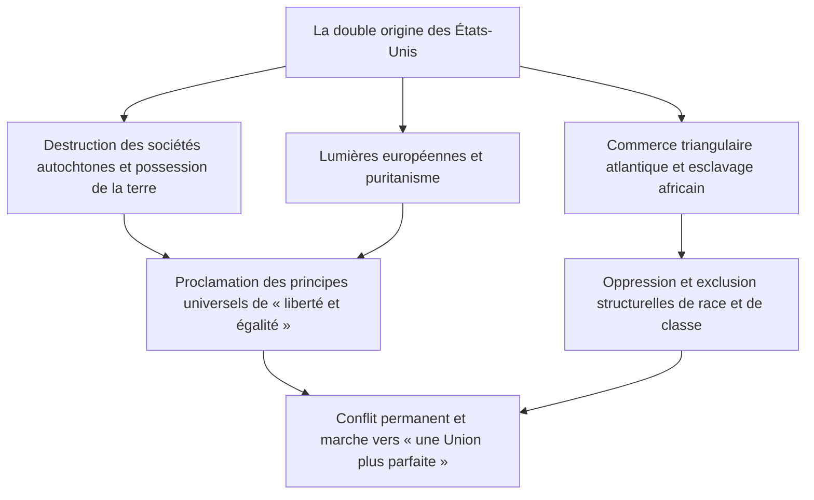
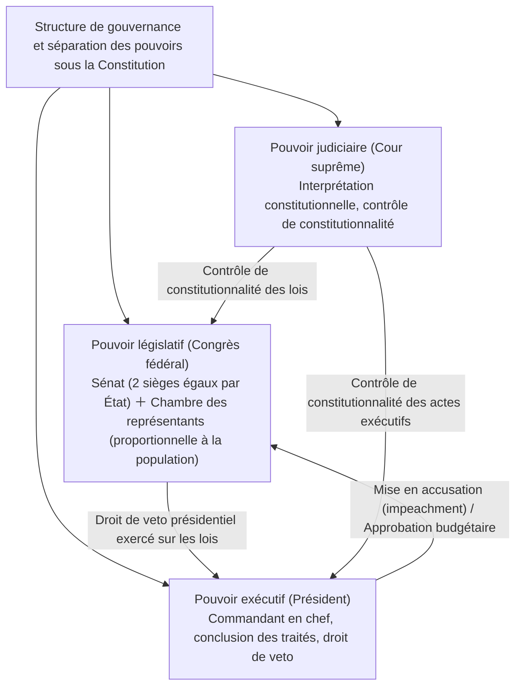
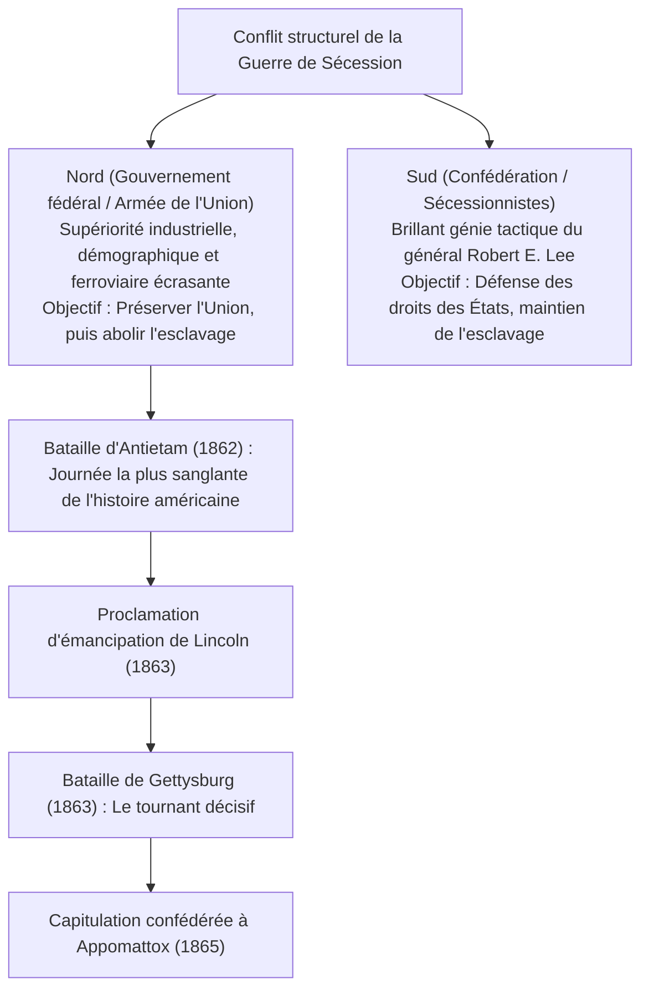
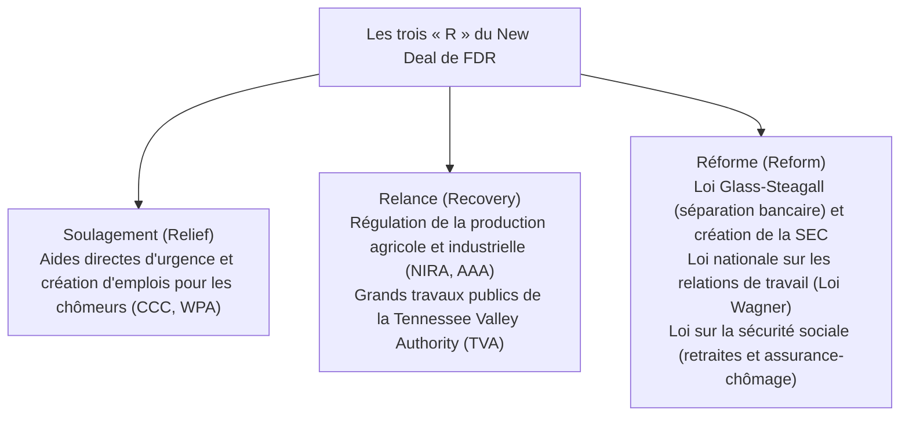
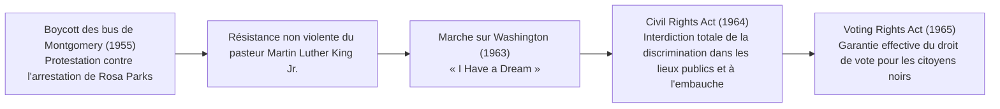
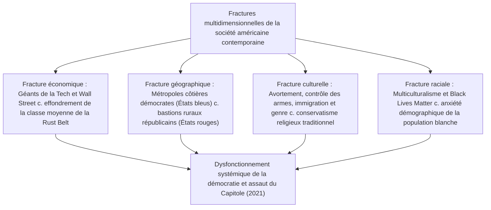

## 1. Introduction : Les États-Unis comme nation expérimentale

### 1.1 L'illusion du « Nouveau Monde » et la réalité des civilisations autochtones

Lorsqu'il s'agit de relater l'histoire des États-Unis d'Amérique, un récit mythologique a longtemps prévalu : celui d'une « terre promise défrichée au cœur d'une nature sauvage par des pionniers européens blancs en quête de liberté ». Cependant, les avancées de l'anthropologie et de l'historiographie depuis la seconde moitié du XXe siècle ont mis en lumière une réalité fondamentale : bien avant l'arrivée des Européens, ce continent abritait des civilisations autochtones (amérindiennes) florissantes, raffinées et façonnées par des millénaires d'histoire.

Des bâtisseurs de tertres de la vallée du Mississippi — illustrés par la métropole monumentale de Cahokia — aux complexes d'habitations troglodytiques des Anasazis (Pueblos) dans le Sud-Ouest, en passant par la Confédération iroquoise (*Haudenosaunee*) dans le Nord-Est, qui unissait cinq nations au sein d'une structure fédérale et démocratique hautement sophistiquée, une diversité écosystémique et sociale remarquable s'était épanouie. À partir de l'arrivée de Christophe Colomb en 1492, les épidémies importées d'Europe (variole, rougeole, grippe — désignées sous le concept d'« échange colombien ») conjuguées à de brutales campagnes de conquête anéantirent entre 80 % et 90 % de la population autochtone. Cette prise de conscience lucide — comprendre que le « Nouveau Monde » fut érigé sur les ruines d'une destruction massive — constitue le point de départ incontournable de toute analyse rigoureuse de l'histoire américaine.



---

### 1.2 Les Pères pèlerins, le Pacte du Mayflower et l'empreinte spirituelle du puritanisme

Dans le sillage de l'établissement de Jamestown en Virginie (1607), le socle spirituel de l'identité nationale américaine fut posé par les puritains séparatistes — les Pères pèlerins (*Pilgrim Fathers*) — qui débarquèrent en 1620 sur les rivages de Cape Cod et de la baie du Massachusetts à bord du *Mayflower*.

Signé à bord du navire à la veille du débarquement, le **Pacte du Mayflower (*Mayflower Compact*)** ne constituait point une injonction d'autorité venue d'en haut, émanant d'un monarque ou de seigneurs féodaux, mais bien une déclaration d'autogouvernance révolutionnaire dans l'histoire de l'humanité : **« instituer un corps politique civil fondé sur le consentement mutuel et volontaire d'individus libres (le contrat social), habilité à promulguer des lois justes et égales pour l'intérêt commun de la colonie »**.

L'idéal prêché par le gouverneur John Winthrop, celui d'**« Une cité sur la colline » (*A City upon a Hill*)** — la conviction ardente qu'une communauté puritaine liée par une alliance avec Dieu devait briller comme un modèle édifiant pour le monde entier —, devint l'ADN originel de l'**« exceptionnalisme américain » (*American Exceptionalism*)**, cette croyance inébranlable selon laquelle les États-Unis sont investis d'une mission rédemptrice singulière pour guider l'humanité.

---

## 2. De l'ère coloniale à la Révolution d'indépendance et à la naissance de la Constitution

### 2.1 Le développement des Treize Colonies et la fin de la « bienveillante négligence »

Les Treize Colonies britanniques établies le long du littoral atlantique virent se développer des structures socio-économiques nettement différenciées : la Nouvelle-Angleterre au nord (axée sur le commerce maritime, la pêche, l'agriculture vivrière et une foi puritaine rigoureuse), les colonies centrales (caractérisées par la céréaliculture et une mosaïque ethnique et religieuse pluraliste) et les colonies du Sud (fondées sur de vastes plantations de tabac, de riz et d'indigo dépendant entièrement du travail servile des esclaves noirs africains).

Jusqu'au milieu du XVIIIe siècle, la métropole britannique s'abstint d'interférer de manière draconienne dans les affaires coloniales, appliquant une doctrine d'autonomie *de facto* désignée sous le terme de **« bienveillante négligence » (*Salutary Neglect*)**. Cependant, bien que la Grande-Bretagne fût sortie victorieuse de la guerre de Sept Ans (connue en Amérique du Nord sous le nom de « guerre contre les Français et les Indiens », 1754-1763), elle se retrouva écrasée sous le fardeau d'une dette de guerre colossale.

Sous prétexte de faire contribuer les colons aux coûts de leur propre défense, le Parlement de Westminster opéra un revirement fiscal autoritaire :
- Le **Sugar Act (Loi sur le sucre, 1764)** puis le **Stamp Act (Loi sur le timbre, 1765)** frappèrent d'une taxe fiscale les journaux, brochures, documents juridiques et jusqu'aux jeux de cartes.
- Les colons ripostèrent avec véhémence en brandissant le principe constitutionnel fondamental : **« Pas de taxation sans représentation » (*No taxation without representation*)**, déclenchant un boycott massif des marchandises britanniques.
- Après le massacre de Boston en 1770 et la fameuse *Boston Tea Party* de 1773 (au cours de laquelle des caisses de thé de la Compagnie des Indes orientales furent jetées par-dessus bord), la Couronne britannique promulgua des mesures punitives impitoyables (les « lois intolérables » ou *Intolerable Acts*), rendant l'affrontement armé désormais inéluctable.


---

### 2.2 Le « Sens commun » de Thomas Paine et la Déclaration d'indépendance (1776)

En avril 1775, le retentissement des premiers coups de feu aux batailles de Lexington et de Concord donna le coup d'envoi de la guerre d'Indépendance américaine. À cette époque, une grande partie de la population coloniale hésitait encore entre la loyauté traditionnelle envers la Couronne britannique et le saut vertigineux vers la souveraineté.

Cette indécision fut balayée en un éclair par la publication, en janvier 1776, du pamphlet anonyme de Thomas Paine : **« Le Sens commun » (*Common Sense*)**. Dans une prose percutante, limpide et passionnée, Paine démontrait l'absurdité fondamentale qu'une simple île gouvernât perpétuellement un continent entier, tout en dénonçant la monarchie héréditaire comme une institution perverse violant les droits naturels les plus sacrés. Diffusé à des centaines de milliers d'exemplaires, cet écrit insuffla un enthousiasme révolutionnaire à travers toutes les colonies.

Le 4 juillet 1776, réuni à Philadelphie lors du Second Congrès continental, les délégués adoptèrent la **« Déclaration unanime des treize États-Unis d'Amérique » (*Declaration of Independence*)**, rédigée par Thomas Jefferson.

> « Nous tenons ces vérités pour évidentes en elles-mêmes : que tous les hommes sont créés égaux ; qu’ils sont doués par le Créateur de certains droits inaliénables ; que parmi ces droits se trouvent la vie, la liberté et la recherche du bonheur. Que pour garantir ces droits, des gouvernements sont établis parmi les hommes, tenant leurs justes pouvoirs du consentement des gouvernés. »

Synthétisant la philosophie des Lumières, le contrat social de John Locke et la doctrine des droits naturels, cette déclaration solennelle justifiait le droit imprescriptible des peuples à la résistance contre la tyrannie (le droit de révolution), s'érigeant en monument universel de la liberté humaine.

Sous le commandement suprême du général George Washington, l'Armée continentale, bravant le dénuement matériel et les rigueurs des hivers, mena une guerre d'usure stratégique. La victoire éclatante de Saratoga (1777) permit de sceller des alliances militaires décisives avec la France, l'Espagne et les Provinces-Unies. En 1781, le siège de Yorktown força la capitulation du gros des troupes britanniques, et le traité de Paris de 1783 contraignit le Royaume de Grande-Bretagne à reconnaître la pleine et entière indépendance des États-Unis.

---

### 2.3 La faillite des Articles de la Confédération et la Convention de Philadelphie (1787)

À l'issue de leur accession à l'indépendance, les États-Unis n'étaient régis que par les « Articles de la Confédération » (*Articles of Confederation*), entrés en vigueur en 1781 : une confédération extrêmement lâche unissant treize républiques souveraines et indépendantes.
- Le pouvoir central (le Congrès de la Confédération) ne disposait d'aucun pouvoir de taxation, d'aucune armée permanente et d'aucun mécanisme de régulation du commerce interétatique ou extérieur.
- Face à la rébellion de Shays (1786) — un soulèvement armé de fermiers endettés du Massachusetts réprimé dans la douleur —, le gouvernement confédéral se révéla incapable de dépêcher la moindre troupe, exposant au grand jour le spectre imminent d'un effondrement national.

À l'été 1787, cinquante-cinq délégués (parmi lesquels les Pères fondateurs James Madison, Alexander Hamilton, Benjamin Franklin et George Washington) se réunirent à l'Independence Hall de Philadelphie pour forger l'actuelle **Constitution des États-Unis**.



- **Le Grand Compromis (Compromis du Connecticut)** : Réconciliant la revendication d'égalité absolue portée par les petits États (le Plan du New Jersey) et celle d'une représentativité proportionnelle réclamée par les grands États (le Plan de Virginie), la Convention créa un parlement bicaméral constitué d'un « Sénat » (deux sièges par État, sur un pied d'égalité stricte) et d'une « Chambre des représentants » (répartie selon le poids démographique).
- **Le décompte servile (Compromis des trois cinquièmes)** : Afin de rallier les États esclavagistes du Sud sans leur concéder une hégémonie politique démesurée, un compromis historique fut scellé, stipulant que chaque esclave compterait pour « trois cinquièmes d'un homme libre » lors de la répartition des sièges législatifs et de l'imposition directe.
- **Freins et contrepoids (*Checks and Balances*)** : Puisant dans la pensée de Montesquieu, les constituants organisèrent une stricte séparation des pouvoirs entre l'exécutif, le législatif et le judiciaire, instaurant un édifice institutionnel complexe conçu pour empêcher toute concentration despotique de l'autorité suprême.

---

## 3. Expansion territoriale, « Destinée manifeste » et déchirements de la Guerre de Sécession

### 3.1 La « Destinée manifeste » et l'expansion continentale

Tout au long de la première moitié du XIXe siècle, les États-Unis connurent une extension territoriale fulgurante en direction de l'ouest :
- **1803 : L'Achat de la Louisiane** : Le président Thomas Jefferson racheta à la France napoléonienne l'immense territoire de la Louisiane à l'ouest du fleuve Mississippi pour la modique somme de 15 millions de dollars, doublant instantanément la superficie de la nation.
- **1823 : La Doctrine Monroe** : Le président James Monroe formula le principe cardinal selon lequel les puissances européennes ne devaient plus interférer dans les affaires du continent américain, en échange de quoi les États-Unis s'abstiendraient de s'ingérer dans les conflits d'Europe.
- **La Destinée manifeste (*Manifest Destiny*)** : Une idéologie expansionniste enflamma les esprits, proclamant que la conquête et la mise en valeur du continent jusqu'aux rivages du Pacifique, ainsi que la diffusion de la liberté et de la démocratie républicaine, constituaient une mission providentielle assignée par Dieu à la nation américaine.

Cette irrésistible poussée territoriale s'accomplit au détriment tragique et implacable des peuples autochtones. En vertu de l'*Indian Removal Act* (Loi sur la déportation des Indiens) promulgué en 1830 sous la présidence d'Andrew Jackson, les Cinq tribus civilisées (notamment les Cherokees) furent arrachées à leurs forêts ancestrales de l'Est pour être déportées de force, au terme d'une marche harassante de plusieurs milliers de kilomètres dans les rigueurs hivernales, vers les territoires arides de l'actuel Oklahoma. Cette tragédie humanitaire, qui coûta la vie à des milliers d'âmes mortes d'épuisement, de famine et d'épidémies, demeure à jamais gravée sous le nom de **« Piste des Larmes » (*Trail of Tears*)**.

La victoire lors de la guerre américano-mexicaine (1846–1848) permit d'annexer la Californie, le Texas et le Nouveau-Mexique. Propulsés par la ruée vers l'or de 1848, les États-Unis parachevèrent leur vocation de république transcontinentale reliant l'Atlantique au Pacifique.

---

### 3.2 La crise de l'esclavage et l'escalade de la fracture nationale

Cependant, chaque nouvelle conquête territoriale rouvrait une blessure mortelle menaçant l'intégrité de l'Union : **« Dans ces nouveaux territoires admis au sein de la République, l'esclavage devait-il être autorisé ou formellement prohibé ? »**

- **L'économie du Nord** : Portée par une Révolution industrielle en plein essor, elle reposait sur le salariat libre, l'industrie manufacturière, le négoce maritime et les capitaux financiers, revendiquant des barrières douanières protectionnistes pour son marché intérieur.
- **L'économie du Sud** : Bâtie sur de gigantesques plantations de coton (« King Cotton »), elle dépendait exclusivement de l'exploitation impitoyable de près de quatre millions d'esclaves afro-américains et exigeait le libre-échange pour exporter ses récoltes vers la Grande-Bretagne et le continent européen.

Pour préserver l'équilibre précaire entre « États libres » et « États esclavagistes » au sein du Sénat, des palliatifs législatifs successifs furent adoptés : le Compromis du Missouri de 1820 (interdisant l'esclavage au nord du parallèle 36°30') puis le Compromis de 1850 (durcissant la loi sur les esclaves fugitifs / *Fugitive Slave Act*).

Cependant, la loi Kansas-Nebraska de 1854 — introduisant le principe de souveraineté populaire où les pionniers locaux devaient décider du statut de l'esclavage — plongea la région dans les violences intestines sanglantes du « Kansas sanglant » (*Bleeding Kansas*). Enfin, en 1857, l'infâme arrêt de la Cour suprême **« Dred Scott c. Sandford »** jugea que les personnes d'ascendance africaine n'étaient en aucun cas des citoyens protégés par la Constitution et ne possédaient aucun droit légal, ajoutant que le Congrès n'avait pas le pouvoir constitutionnel de bannir l'esclavage dans les territoires. Cet arrêt jeta l'opinion publique antiesclavagiste du Nord dans une fureur inextinguible.

---

### 3.3 La Guerre de Sécession (1861–1865) : Réunification sanglante et émancipation des esclaves

Lors de l'élection présidentielle de 1860, la victoire d'Abraham Lincoln, candidat du jeune Parti républicain fermement opposé à toute extension territoriale de l'esclavage, provoqua la déflagration. La Caroline du Sud, suivie de six autres États du Sud, fit sécession de l'Union et fonda les « États confédérés d'Amérique » (*Confederate States of America*).

En avril 1861, les canons confédérés ouvrirent le feu contre le Fort Sumter : la **Guerre de Sécession (*American Civil War*)** venait d'éclater.



Au fil des épreuves, Lincoln sublima la nature du conflit : d'une simple répression militaire visant à sauver l'intégrité territoriale de l'Union, il en fit une croisade morale pour l'émancipation universelle.
- **1er janvier 1863 : La Proclamation d'émancipation (*Emancipation Proclamation*)** : Lincoln proclama la libération immédiate et irrévocable de tous les esclaves situés dans les zones en rébellion. Cet acte historique ouvrit les rangs de l'armée de l'Union à près de 180 000 soldats noirs et rendit diplomatiquement intenable toute intervention de la Grande-Bretagne ou de la France en faveur de la Confédération.
- **Novembre 1863 : Le Discours de Gettysburg** : Lincoln formula la vibrante profession de foi démocratique selon laquelle **« le gouvernement du peuple, par le peuple, pour le peuple (*Government of the people, by the people, for the people*) ne doit point disparaître de la surface de la terre »**.

Au terme d'une guerre d'anéantissement total et de la stratégie de la terre brûlée menée par le général Sherman (la « marche vers la mer »), le général en chef sudiste Robert E. Lee capitula en avril 1865 face au général Ulysses S. Grant à Appomattox, en Virginie. Au prix effroyable de plus de 600 000 vies fauchées — la pire hécatombe de l'histoire américaine —, la ratification du 13e amendement (abolition de l'esclavage), du 14e amendement (garantie d'une procédure régulière et de l'égale protection des lois) et du 15e amendement (droit de vote sans distinction de race) métamorphosa les États-Unis : ils cessèrent d'être une simple fédération d'États pour devenir un État-nation unifié et indissoluble.

Cependant, dès la clôture de la période de Reconstruction, les États du Sud instituèrent les pernicieuses « lois Jim Crow » de ségrégation raciale légale, plongeant la population afro-américaine dans les ténèbres d'une marginalisation féroce et sous la terreur des lynchages perpétrés par le Ku Klux Klan (KKK).

---

## 4. Le Gilded Age, la Révolution industrielle et l'aube de l'impérialisme

### 4.1 L'essor du grand capital et le « Gilded Age »

De la fin de la guerre de Sécession à l'orée du XXe siècle, l'économie américaine connut une explosion productive sans précédent dans les annales de la civilisation. L'écrivain Mark Twain baptisa avec ironie cette époque le **« Gilded Age » (l'Âge de clinquant ou Âge doré)**, pour souligner qu'un éclat d'or superficiel dissimulait en vérité les abîmes de la corruption politique et des inégalités les plus outrancières.

- L'achèvement du premier chemin de fer transcontinental en 1869 unifia l'immense territoire en un gigantesque marché intérieur intégré.
- **Les monopoles des « barons voleurs » (*Robber Barons*)** :
  - La *Standard Oil* de John D. Rockefeller vint contrôler jusqu'à 90 % du raffinage pétrolier américain.
  - L'empire sidérurgique d'Andrew Carnegie (*Carnegie Steel*).
  - La toute-puissance du capital financier orchestrée par J. P. Morgan, instigateur de trusts titanesques tels que la fondation d'*U.S. Steel*.
- L'électrification menée par Thomas Edison, l'invention du téléphone par Alexander Graham Bell et la chaîne de montage standardisée de Henry Ford (le fordisme) propulsèrent les États-Unis au premier rang de la production industrielle mondiale, surclassant largement les empires britannique et allemand.

Toutefois, cette polarisation extrême des richesses et l'exploitation féroce de la main-d'œuvre provoquèrent de gigantesques conflits sociaux ensanglantés, tels que la grève de Homestead ou la grève Pullman. Parallèlement, des dizaines de millions de « nouveaux immigrants » venus d'Europe méridionale et orientale (Italiens, Irlandais, Juifs ashkénazes) vinrent s'entasser dans les taudis insalubres (*tenements*) des grandes métropoles urbaines.

---

### 4.2 La fermeture de la Frontière et l'expansion ultramarine

Lors du recensement décennal de 1890, l'historien Frederick Jackson Turner proclama « la fermeture définitive de la Frontière » (*Closing of the Frontier*). Dès lors que s'éteignait cette ligne pionnière de l'Ouest qui avait forgé le dynamisme démocratique et l'esprit d'entreprise des pionniers américains, le regard de la République se tourna inexorablement vers les horizons maritimes de l'océan Pacifique et de l'Amérique latine, portée par les thèses stratégiques du capitaine de vaisseau Alfred Thayer Mahan sur la puissance navale.

- **1898 : La guerre hispano-américaine** : Déclenchée à la suite de l'explosion du cuirassé USS *Maine* dans la baie de La Havane, elle se solda par une victoire fulgurante en quelques mois. Les États-Unis s'emparèrent des Philippines, de Guam et de Porto Rico, tout en annexant l'archipel d'Hawaï, s'affirmant ainsi d'un coup comme une puissance impériale océanique.
- **La doctrine de la Porte ouverte (1899)** : Le secrétaire d'État John Hay formula les principes de « porte ouverte, d'égalité des chances commerciales et de préservation territoriale » en Chine pour empêcher le dépeçage colonial exclusif de ce marché par les puissances européennes.

Sur le front domestique, pour juguler les dérives prédatrices des cartels et assainir la vie politique, s'éleva le vaste mouvement de l'**« ère progressiste » (*Progressivism*)**, incarné par les présidents Theodore Roosevelt (avec sa politique résolue de démantèlement des trusts et de préservation environnementale) et Woodrow Wilson. Ce sursaut civique aboutit à l'application rigoureuse du *Sherman Antitrust Act*, à la création du Système fédéral de réserve (la *Fed*) et à la conquête historique du suffrage universel féminin par le 19e amendement constitutionnel.

---

## 5. Les deux guerres mondiales, la Grande Dépression et l'avènement de la Pax Americana

### 5.1 La Première Guerre mondiale et les « Années folles »

Face au déclenchement de la Première Guerre mondiale en 1914, les États-Unis adoptèrent dans un premier temps une posture de stricte neutralité, tirant d'immenses bénéfices de l'exportation d'armes, de vivres et de matières premières vers les puissances alliées, ce qui transforma le pays en premier créancier de la planète. Néanmoins, face à la guerre sous-marine à outrance décrétée par l'Empire allemand et à l'interception du télégramme Zimmermann, la République franchit le pas et entra en guerre en 1917.

Le président Woodrow Wilson proclama ses célèbres **« Quatorze points »**, plaidant pour l'abolition de la diplomatie secrète, le droit des peuples à disposer d'eux-mêmes et la création de la Société des Nations (SDN). Cependant, le Sénat américain, dominé par un réflexe isolationniste viscéral, refusa de ratifier le traité de Versailles, scellant le refus des États-Unis d'intégrer la SDN.

Au cours des années 1920, la nation vécut une parenthèse dorée d'euphorie et de surconsommation de masse désignée sous le nom des **« Années folles » (*Roaring Twenties*)**.
- La radiodiffusion, la démocratisation de l'automobile (la Ford T), le cinéma hollywoodien, le jazz et l'électroménager conquirent les foyers américains.
- Wall Street fut emportée par un vertige spéculatif débridé, nourrissant le mythe d'une prospérité éternelle.
- Pourtant, cette décennie eut son revers ténébreux : l'instauration de la Prohibition (18e amendement) engendra l'explosion du crime organisé (illustré par Al Capone), tandis que refaisait surface un violent repli identitaire et xénophobe (résurgence du KKK et adoption de la loi restrictive sur les quotas d'immigration en 1924).

---

### 5.2 La Grande Dépression et le New Deal

Le 24 octobre 1929, lors du funeste « Jeudi noir » (*Black Thursday*), l'effondrement spectaculaire de la Bourse de New York à Wall Street déclencha la pire crise économique de l'ère moderne.
Des milliers d'établissements bancaires mirent la clé sous la porte, le chômage frappa jusqu'à 25 % de la population active (un travailleur sur quatre privé d'emploi) et des tempêtes de poussière dévastatrices (le *Dust Bowl*) chassèrent des milliers de fermiers ruinés sur les routes. Le dogme du laissez-faire du président Herbert Hoover se révéla totalement impuissant face au désastre.

Élu triomphalement à la présidence en 1933, Franklin Delano Roosevelt (FDR) mit en œuvre sans délai le **« New Deal » (la Nouvelle Donne)**.



En intervenant activement dans les rouages du marché bien avant la généralisation théorique du keynésianisme et en bâtissant les fondations de l'État-providence, le New Deal entraîna une formidable expansion des prérogatives présidentielles et devint la pierre angulaire du libéralisme américain contemporain.

---

### 5.3 La Seconde Guerre mondiale et la consécration de l'hégémonie mondiale

Le 7 décembre 1941, l'attaque aéronavale foudroyante de Pearl Harbor par les forces japonaises précipita l'entrée directe des États-Unis dans la Seconde Guerre mondiale.

S'érigeant solennellement en **« Arsenal de la démocratie » (*Arsenal of Democracy*)**, l'Amérique reconvertit son immense tissu manufacturier vers un effort de guerre titanesque. Les usines automobiles assemblèrent à la chaîne des chars et des bombardiers, tandis qu'une armée de femmes ouvrières (« Rosie la riveteuse ») investissait les chaînes d'assemblage industrielles.

- Le débarquement réussi de Normandie (1944) sur le front ouest-européen et l'anéantissement du IIIe Reich nazi.
- La stratégie des « sauts de grenouille » à travers l'immensité du théâtre du Pacifique aboutissant à la capitulation de l'Empire du Japon.
- Et, sous le sceau du secret absolu, l'aboutissement du projet Manhattan concevant l'arme atomique, larguée sur Hiroshima et Nagasaki.

À l'issue des hostilités en 1945, les États-Unis pesaient à eux seuls la moitié de la production manufacturière du globe, détenaient 70 % des réserves monétaires d'or mondiales et s'imposaient comme le détenteur unique de la bombe nucléaire.
Les accords de Bretton Woods signés en 1944 firent du **dollar américain la monnaie d'ancrage universelle adossée à l'or (créant le FMI et la Banque mondiale)**, tandis qu'était adoptée à San Francisco en 1945 la Charte des Nations Unies. L'ère de la **« Pax Americana »** s'ouvrait au sommet de la puissance mondiale.

---

## 6. Guerre froide, mouvement des droits civiques : gloire et tourments américains

### 6.1 La guerre froide et le spectre de la dissuasion nucléaire

Des décombres fumants du second conflit mondial émergea un affrontement géopolitique et idéologique planétaire entre les deux superpuissances : les États-Unis, champions du monde libre, et l'Union soviétique, phare du bloc communiste. C'était l'aube de la « guerre froide » (*Cold War*).

- **1947 : La doctrine Truman** : L'adoption formelle de la « doctrine d'endiguement » (*Containment Policy*) destinée à juguler l'expansion soviétique.
- **Le Plan Marshall** : Un programme titanesque d'assistance financière injecté pour relever l'Europe occidentale et la prémunir du basculement communiste.
- **1949 : Fondation de l'Organisation du traité de l'Atlantique Nord (OTAN)** : Bâtissant un bouclier indéfectible d'autodéfense collective.
- La guerre de Corée (1950–1953) et, sur le plan intérieur, les dérives paranoïaques de la « chasse aux sorcières » anticommuniste incarnée par le maccarthysme.

Lors de la vertigineuse **crise des missiles de Cuba** en 1962, suite au déploiement secret d'ogives nucléaires soviétiques sur l'île caribéenne, le face-à-face angoissant entre John F. Kennedy et Nikita Khrouchtchev amena l'humanité au bord immédiat de l'apocalypse atomique. Un équilibre de la terreur glacé, dicté par le dogme de la destruction mutuelle assurée (MAD), s'installa dès lors sur les relations internationales.

---

### 6.2 Le mouvement des droits civiques : La lutte pour l'égalité réelle

Tandis que la classe moyenne blanche prospérait dans la quiétude des banlieues pavillonnaires (*suburbs*), s'émerveillant devant leurs téléviseurs et réfrigérateurs étincelants, les populations noires — en particulier dans le Sud profond — demeuraient soumises au joug humiliant d'une ségrégation institutionnelle implacable.

En 1954, le verdict historique de la Cour suprême des États-Unis dans l'arrêt **« Brown c. Board of Education »** déclara la ségrégation raciale dans les établissements scolaires publics « intrinsèquement inégale » et contraire à la Constitution, allumant l'étincelle du grand mouvement des droits civiques.



Menées sous l'égide morale du pasteur Martin Luther King Jr., les actions directes non violentes (sit-in pacifiques, *Freedom Rides*, marches de masse) se heurtèrent à la férocité policière des ségrégationnistes blancs, qui déchaînèrent chiens d'attaque et lances à haute pression. Mais ces scènes d'une cruauté révoltante, diffusées en direct sur les écrans de télévision de toute la nation, frappèrent les esprits au cœur. Sous l'impulsion du président Lyndon B. Johnson furent promulguées deux lois fondatrices : le **Civil Rights Act de 1964** et le **Voting Rights Act de 1965**, abattant enfin l'armature juridique d'un siècle de ségrégation Jim Crow.

---

### 6.3 L'enlisement de la guerre du Vietnam et la contre-culture

Cependant, prisonniers de la théorie des dominos — postulant que la chute d'un pays dans l'orbite communiste provoquerait l'effondrement en cascade des nations adjacentes —, les États-Unis s'embourbèrent dans la tragédie de la guerre du Vietnam (1965–1973).
La guérilla impitoyable dans la jungle impénétrable, l'épandage massif d'agent orange défoliant, l'abomination du massacre de My Lai et la mort de dizaines de milliers de conscrits américains réduisirent en poussière la confiance du peuple envers ses dirigeants.

Une puissante onde de contestation pacifiste embrasa les campus universitaires, convergeant avec le mouvement hippie, l'essor du rock (le mythique festival de Woodstock), le renouveau du féminisme (*Women's Lib*) et la conscience écologique naissante, au sein d'une immense vague d'émancipation désignée sous le nom de **« contre-culture » (*Counterculture*)**. En 1974, pris au piège de ses mensonges dans la ténébreuse affaire du Watergate, Richard Nixon devint le premier président de l'histoire des États-Unis contraint à la démission. L'Amérique plongeait alors dans une longue période de désarroi spirituel et de crise morale, accentuée par la stagflation et le marasme de l'administration Carter.

---

## 7. Des Reaganomics à l'après-guerre froide, au 11-Septembre et aux profondes fractures contemporaines

### 7.1 La révolution reaganienne et la fin de la guerre froide

En 1980, en promettant de « restaurer la grandeur de l'Amérique » (*Make America Great Again*), Ronald Reagan remporta une victoire électorale écrasante.

- **Les « Reaganomics »** : Fondée sur les préceptes de l'économie de l'offre (*supply-side economics*), cette doctrine mit en œuvre des baisses d'impôts substantielles, une déréglementation agressive, une réduction drastique des dépenses sociales et un resserrement du crédit. Elle propagea à l'échelle planétaire le règne du néolibéralisme et le dogme de l'État minimal.
- **La confrontation avec « l'Empire du Mal »** : En gonflant massivement les budgets militaires et en lançant l'Initiative de défense stratégique (IDS, surnommée « Guerre des étoiles »), Reagan engagea une course aux armements insoutenable qui asphyxia définitivement l'économie planifiée de l'Union soviétique.
- La chute du mur de Berlin en 1989, suivie de la dissolution formelle de l'URSS en 1991, scella le dénouement de la guerre froide par un triomphe absolu des États-Unis. L'essayiste Francis Fukuyama put alors prophétiser « la fin de l'Histoire » : la consécration définitive et indépassable de la démocratie libérale et du capitalisme de marché.

---

## 7.1.5 La guerre du Golfe (1991) et la révolution doctrinale de Colin Powell

En août 1990, au lendemain immédiat de la fin de la guerre froide, le dictateur irakien Saddam Hussein envahit et annexa le petit émirat voisin du Koweït en un assaut foudroyant. Le président George H. W. Bush obtint le mandat du Conseil de sécurité des Nations Unies, forgea une vaste coalition internationale regroupant trente-quatre nations et lança en janvier 1991 l'opération « Tempête du désert » (la guerre du Golfe).

### Une doctrine militaire née des traumatismes du Vietnam
Tirant les leçons cuisantes de l'enlisement vietnamien, le président du Comité des chefs d'état-major interarmées, le général Colin Powell, forgea une ligne directrice rigoureuse connue sous le nom de **« Doctrine Powell »** :
1. L'existence d'une menace directe, capitale et manifeste pesant sur les intérêts vitaux de la nation.
2. Le recours aux armes uniquement comme « ultime extrémité », une fois épuisées toutes les voies diplomatiques et sanctions économiques.
3. La formulation d'objectifs militaires limpides, nets et atteignables.
4. Le déploiement d'une **« force écrasante » (*Overwhelming Force*)** dès l'entame des hostilités, de manière à saturer l'adversaire sans lui laisser la moindre chance de réplique et remporter une victoire fulgurante.
5. La définition rigoureuse, préalable et intangible d'une stratégie de sortie et de retrait (*exit strategy*).

L'armée américaine fit la démonstration éblouissante de sa suprématie technologique à travers la retransmission en direct sur CNN : avions furtifs d'attaque F-117, armements de précision guidés par laser et satellites GPS (« bombes intelligentes »), missiles de croisière Tomahawk et intercepteurs antimissiles Patriot pulvérisèrent le dispositif de défense irakien en seulement 100 heures d'offensive terrestre.

Le président Bush put alors exulter en affirmant que « le fantôme du Vietnam a été enfoui à jamais sous les sables du désert », conférant à l'Amérique l'assurance de régir, en tant qu'« unique superpuissance », un « nouvel ordre mondial » (*New World Order*). Paradoxalement pourtant, l'ivresse de ce succès foudroyant allait faire oublier la prudence cardinale de la doctrine Powell lors de l'invasion de l'Irak en 2003, enfantant une funeste présomption (*l'hubris*) qui précipita la nation dans le désastreux bourbier de l'occupation.

---

## 7.2 Lueurs et ombres de la mondialisation et révolution numérique

Tout au long des années 1990, sous la présidence de Bill Clinton, les dividendes de la paix issus de la fin de la guerre froide combinés au boom prodigieux de l'Internet et des technologies de l'information impulsé par la Silicon Valley engendrèrent une ère d'expansion économique extraordinaire (la « nouvelle économie »).

En pilotant la mise en œuvre de l'Accord de libre-échange nord-américain (ALÉNA / NAFTA) et l'accession de la Chine à l'Organisation mondiale du commerce (OMC), les États-Unis accélérèrent à un rythme effréné la mondialisation des échanges. Néanmoins, ce triomphe du capitalisme financier et de la dérégulation laissa d'immenses séquelles structurelles sur le sol national :
- Les activités manufacturières délocalisèrent massivement leurs usines vers des pays à bas coûts salariaux tels que la Chine ou le Mexique, plongeant la classe ouvrière blanche du Midwest et de la *Rust Belt* (la ceinture industrielle de la rouille) dans la ruine et le déclassement.
- Entre les élites hyper-qualifiées des côtes est et ouest, dopées à la finance et aux hautes technologies, et les travailleurs abandonnés de l'Amérique profonde, se creusa un abîme économique, social et culturel que rien ne semblait plus pouvoir combler.

---

### 7.3 Les attentats du 11-Septembre et les dérives de la « guerre contre le terrorisme »

Le 11 septembre 2001, des avions de ligne détournés par des terroristes d'Al-Qaïda s'écrasèrent contre les tours jumelles du World Trade Center à New York et contre le Pentagone à Washington, perpétrant les attaques les plus meurtrières jamais subies sur le territoire continental américain. Face à ce traumatisme d'une violence inouïe, le peuple américain fit preuve d'une unité patriotique intense, tandis que le président George W. Bush décrétait une « guerre mondiale contre le terrorisme ».

- L'intervention militaire en Afghanistan et le renversement rapide du régime des talibans.
- 2003 : Le déclenchement de la guerre d'Irak, justifiée par l'allégation officielle de la présence d'armes de destruction massive (ADM).
- Cependant, aucune trace d'ADM ne fut jamais découverte en Irak. Le pays s'enfonça dans une anarchie sanguinaire et devint le terreau de groupuscules djihadistes fanatiques (Daech / ISIS), au prix de milliers de vies de soldats américains fauchées et de l'engloutissement de milliers de milliards de dollars de finances publiques. L'autorité morale et le crédit diplomatique des États-Unis sur la scène internationale en sortirent profondément meurtris.

---

### 7.4 La crise des subprimes, l'ère Obama, le trumpisme et les tourments du XXIe siècle

En 2008, l'explosion de la bulle spéculative des crédits hypothécaires à risque (*subprime*) à Wall Street précipita la faillite retentissante de Lehman Brothers et déclencha une crise financière mondiale d'une violence inouïe. Alors que les piliers mêmes du modèle capitaliste vacillaient, Barack Obama, galvanisant les espoirs populaires avec ses slogans « Change » et « Yes We Can », fut élu premier président afro-américain de l'histoire de la République. Malgré l'adoption d'une réforme historique de l'assurance maladie (*Affordable Care Act* ou Obamacare), son mandat se heurta à une polarisation partisane acharnée, alimentée par la rébellion conservatrice de base du Tea Party.

Puis, en 2016, canalisant la rancœur volcanique des classes populaires blanches de la *Rust Belt* abandonnées par les élites et déstabilisées par la mondialisation (la « revanche de la ceinture de rouille »), le milliardaire Donald Trump conquit la magistrature suprême.



Comme l'a révélé avec effroi l'assaut insurrectionnel du Capitole fédéral le 6 janvier 2021, les États-Unis d'Amérique traversent aujourd'hui la crise la plus aiguë de délitement de leur consensus républicain depuis les déchirements de la guerre de Sécession.

---

## 2.4 La fracture intellectuelle des Pères fondateurs : Le débat Hamilton contre Jefferson

Au lendemain de la ratification de la Constitution des États-Unis, le cabinet du premier président, George Washington, devint le théâtre de l'un des affrontements intellectuels les plus magistraux et structurants de l'histoire politique moderne : la querelle fondamentale opposant le secrétaire au Trésor Alexander Hamilton au secrétaire d'État Thomas Jefferson.

```mermaid
flowchart LR
    subgraph Faction hamiltonienne (Parti fédéraliste)
        H1["Gouvernement fédéral fort et pouvoir centralisé"]
        H2["Puissance industrielle, commerciale et financière, essor urbain"]
        H3["Création de la Banque des États-Unis et reprise des dettes publiques"]
        H4["Interprétation souple de la Constitution (pouvoirs implicites)"]
    end
    subgraph Faction jeffersonienne (Parti républicain-démocrate)
        J1["Défense des droits des États, décentralisation, gouvernement limité"]
        J2["République agraire vertueuse reposant sur les fermiers indépendants"]
        J3["Défiance absolue envers les banques et la spéculation financière"]
        J4["Interprétation stricte de la Constitution (respect littéral du texte)"]
    end
```

### ① Le choc des modèles économiques : Empire financier ou République agraire ?
- **La vision de Hamilton** : Il ambitionnait de doter l'Amérique d'une stature comparable à la puissance britannique : un empire commercial, manufacturier, financier et naval moderne. Il instaura la reprise intégrale et la mutualisation par le gouvernement fédéral des dettes de guerre contractées par chaque État (*Funding Act*), émit des titres d'emprunt public et fit fonder la Première Banque des États-Unis (*First Bank of the United States*). Partisan résolu de la protection et de la promotion des manufactures, il concevait un État centralisé et puissant, pourvu d'une administration solide et d'une armée permanente.
- **La vision de Jefferson** : Convaincu que les grandes métropoles et la classe ouvrière d'usine constituaient des foyers inévitables de corruption et d'asservissement civique — l'homme dépendant d'un maître pour son salaire ne pouvant jouir d'une véritable liberté —, il voyait dans les fermiers indépendants propriétaires de leur terre (*Yeoman Farmers*) le sanctuaire ultime de la vertu civique et de la morale républicaine. Pour lui, le gouvernement fédéral devait rester un appareil minimal, strictement limité à la défense des frontières et aux relations diplomatiques essentielles.

### ② Le grand schisme constitutionnel : Pouvoirs implicites contre construction stricte
- La légitimité du Congrès fédéral à fonder une banque centrale devint la ligne de fracture originelle du droit constitutionnel américain.
- **L'interprétation stricte de Jefferson (*Strict Construction*)** : L'article I, section 8 de la Constitution, énumérant de manière limitative les pouvoirs du Congrès fédéral, ne mentionne nulle part le pouvoir de créer une société bancaire. S'arroger des compétences non expressément déléguées par le texte écrit constitue une usurpation inconstitutionnelle des droits des États et des citoyens (dans l'esprit du 10e amendement).
- **L'interprétation souple de Hamilton (*Loose Construction*)** : Se fondant sur la 18e clause de l'article I, section 8 — la fameuse clause dite des « pouvoirs nécessaires et appropriés » (*Necessary and Proper Clause* ou « clause élastique ») —, Hamilton démontra que le gouvernement fédéral, pour accomplir efficacement ses missions régaliennes expresses telles que la levée des impôts et la gestion de la dette publique, devait jouir de tous les instruments institutionnels indispensables. Même en l'absence de mention explicite, ces moyens constituent des **« pouvoirs implicites » (*Implied Powers*)** parfaitement constitutionnels. Cette théorie audacieuse fut définitivement consacrée par le grand président de la Cour suprême John Marshall dans le monumental arrêt **« McCulloch c. Maryland » (1819)**, fournissant le socle jurisprudentiel inébranlable sur lequel repose l'immense puissance de l'État fédéral contemporain.

---

## 3.6 Tournant technico-militaire de la Guerre de Sécession et tourments de la Reconstruction

La Guerre de Sécession est universellement qualifiée par les historiens militaires de **« première guerre totale moderne » (*First Modern Total War*)**. Pour la première fois à une telle échelle, les technologies issues de la Révolution industrielle furent déployées sans retenue sur les champs de bataille, frappant d'obsolescence absolue les manœuvres flamboyantes de l'ère napoléonienne.

### ① La révolution des technologies de guerre
1. **Le fusil rayé et la balle Minié (*Minié Ball*)** :
   - Alors que le vieux mousquet à âme lisse n'offrait qu'une portée utile d'$50 \sim 100$ yards, l'adoption de canons rayés à rainures hélicoïdales conjuguée à la balle conique en plomb doux de l'officier Minié porta la précision mortelle à une distance fulgurante de $300 \sim 500$ yards.
   - Les généraux persistant à ordonner des charges frontales massives en rangs serrés, l'infanterie fut fauchée par un déluge de feu inouï (comme lors de la charge de Pickett à Gettysburg), empilant des dizaines de milliers de cadavres. Le champ de bataille moderne bascula irrémédiablement dans la guerre de tranchées.
2. **La logistique ferroviaire et la révolution du télégraphe** :
   - L'état-major nordiste s'appuya sur son réseau ferroviaire hyper-développé pour acheminer sur les lignes de front, en quelques jours à peine, des renforts de dizaines de milliers d'hommes avec leur ravitaillement complet.
   - Retranché dans la salle du télégraphe de la Maison Blanche, le président Lincoln échangeait des directives stratégiques en temps réel avec ses généraux au front, inaugurant le tout premier dispositif moderne de commandement et de contrôle à distance (C4I).
3. **Le choc des cuirassés navals** :
   - En mars 1862, lors de la bataille navale de Hampton Roads, le navire blindé confédéré CSS *Virginia* (l'ancien *Merrimack*) affronta le révolutionnaire cuirassé à tourelle tournante de l'Union, l'USS *Monitor*. En une seule journée de canonnade, l'ère pluriséculaire des vaisseaux de guerre en bois à voiles fut reléguée au musée de l'histoire.

### ② La tragédie de la Reconstruction (1865–1877) et la nuit des lois Jim Crow
Après l'assassinat d'Abraham Lincoln, son successeur Andrew Johnson fit preuve d'une coupable indulgence envers les anciens dirigeants confédérés. En réaction, les républicains radicaux prirent le contrôle du Congrès, découpèrent le Sud rebelle en cinq districts militaires sous tutelle de l'armée et garantirent l'exercice du droit de vote aux affranchis noirs, permettant l'élection historique des premiers législateurs afro-américains (la Reconstruction radicale).

Cependant, à l'occasion du compromis politique scellé lors de l'élection présidentielle de 1877 (le Compromis Hayes-Tilden), les troupes fédérales évacuèrent entièrement le Sud. Aussitôt, l'aristocratie foncière blanche des grands planteurs reprit les rênes des gouvernements d'État (les gouvernements dits « rédempteurs » ou *Redeemers*).
- Les États sudistes mirent en place un arsenal législatif perfide pour confisquer *de facto* le droit de vote des Afro-Américains : l'impôt de capitation (*Poll Tax*), les tests d'alphabétisation arbitraires (*Literacy Test*) et la fameuse clause de grand-père (*Grandfather Clause*, exemptant d'examen les seuls descendants d'électeurs inscrits avant 1867).
- En 1896, l'arrêt de la Cour suprême **« Plessy c. Ferguson »** consacra la sinistre doctrine **« séparés mais égaux » (*Separate but Equal*)**, conférant une légitimité constitutionnelle totale à la ségrégation raciale dans les transports, les écoles et les édifices publics. Cette chape de plomb des lois Jim Crow allait étouffer le Sud pendant plus d'un demi-siècle, jusqu'aux grands soulèvements civiques des années 1950.

---

## 7.5 Politique judiciaire et batailles jurisprudentielles du XXIe siècle devant la Cour suprême

Le front le plus incandescent des fractures politiques de l'Amérique contemporaine se joue dans les prétoires : une véritable « guerre judiciaire » (*Judicial Wars*) engagée pour le contrôle idéologique de la Cour suprême fédérale et le renversement de ses grands précédents doctrinaux.

### ① Le droit à l'avortement : Du revirement de Roe v. Wade à l'arrêt Dobbs
- **1973 : Arrêt « Roe c. Wade » (*Roe v. Wade*)** : La Cour suprême déduisit de la clause de procédure régulière (*Due Process Clause*) du 14e amendement un « droit fondamental à la vie privée », consacrant la protection constitutionnelle du droit des femmes à recourir à l'avortement.
- En riposte, la droite religieuse évangélique et le camp pro-vie (*Pro-Life*) menèrent pendant un demi-siècle, en symbiose avec le Parti républicain, une croisade méthodique visant à placer des magistrats conservateurs résolus sur les sièges de la plus haute juridiction.
- Sous le mandat de Donald Trump, la nomination consécutive de trois juges conservateurs (Neil Gorsuch, Brett Kavanaugh et Amy Coney Barrett) fit basculer la Cour vers une écrasante majorité conservatrice de 6 voix contre 3. Conséquence directe : par l'arrêt **« Dobbs c. Jackson Women's Health Organization » rendu en 2022**, la Cour suprême anéantit purement et simplement le précédent *Roe* établi cinquante ans plus tôt. Affirmant que « le droit à l'avortement ne figure point dans le texte constitutionnel et n'est enraciné dans aucune tradition historique de la nation », la Cour restitua l'entière compétence de légiférer sur l'IVG aux parlements de chaque État.
- Ce séisme jurisprudentiel provoqua l'entrée en vigueur immédiate de lois de prohibition totale dans de nombreux États conservateurs du Sud et du Midwest, tandis que les États démocrates (à l'instar de la Californie ou de New York) s'érigeaient en « États sanctuaires » garantissant ce droit, matérialisant une fracture juridique d'une profondeur inédite au cœur même de la République.

### ② Le droit de porter des armes : L'interprétation origineliste du deuxième amendement
- **Texte du deuxième amendement** : « Une milice bien organisée étant nécessaire à la sécurité d'un État libre, le droit du peuple de détenir et de porter des armes ne sera point violé. »
- **2008 : Arrêt « District of Columbia c. Heller »** : Sous la plume érudite du juge Antonin Scalia, chantre de l'« originelisme » (*Originalism* — méthode herméneutique stipulant que la Constitution doit être interprétée selon le sens précis que ses termes avaient à l'époque de son adoption), la Cour suprême trancha pour la toute première fois que le deuxième amendement garantit un droit fondamental et individuel absolu de détenir et de porter des armes à feu pour sa propre défense, qu'un citoyen appartienne ou non à un corps de milice. Alors même que les massacres par armes à feu endeuillent quotidiennement la société américaine, ce verrouillage jurisprudentiel insurmontable frappe d'inconstitutionnalité presque toute tentative de régulation fédérale substantielle sur les armes à feu.

---

## 6.5 Le « choc Nixon » (1971) et l'instauration du système du pétrodollar

La rupture la plus monumentale de l'ordre financier international et de la géopolitique mondiale de la seconde moitié du XXe siècle survint le dimanche 15 août 1971, lorsque le président Richard Nixon annonça à la télévision le coup de tonnerre du « choc Nixon » (ou choc du dollar).

### ① L'effondrement du système de Bretton Woods
L'architecture monétaire mondiale échafaudée à l'été 1944 dans la station de Bretton Woods reposait sur l'étalon de change-or (*Gold-Exchange Standard*) : les États-Unis garantissaient solennellement à l'ensemble du monde de convertir à vue le dollar en or physique au cours fixe immuable de **35 dollars pour une once d'or pur**, les autres monnaies nationales maintenant une parité de change fixe vis-à-vis du billet vert.

Cependant, à la fin des années 1960, le financement simultané des généreux programmes sociaux de la « Grande Société » du président Lyndon Johnson et les dépenses militaires colossales englouties dans le bourbier de la guerre du Vietnam firent exploser le déficit budgétaire et la balance des paiements américains. Lorsque des puissances européennes, emmenées par la République fédérale d'Allemagne et la France du général de Gaulle, commencèrent à exiger la conversion effective de leurs réserves d'excédents de dollars en lingots d'or sonnants et trébuchants, les coffres de Fort Knox se retrouvèrent au bord de l'assèchement complet.

Dans une allocution solennelle, le président Nixon décréta unilatéralement la **« suspension immédiate et sans condition de la convertibilité du dollar américain en or »**. Cette décision signa l'arrêt de mort du système de Bretton Woods, propulsant le monde à partir de 1973 dans l'inconnu du « régime des taux de change flottants » gouverné par le seul jeu de l'offre et de la demande sur les marchés financiers.

### ② L'avènement du système du « pétrodollar » (*Petrodollar*)
Dépourvu désormais de tout adossement au métal précieux, le dollar américain se trouva exposé au péril d'une dépréciation vertigineuse et d'une hyperinflation dévastatrice. C'est alors que le conseiller à la sécurité nationale et secrétaire d'État de l'administration Nixon, Henry Kissinger, pilota un coup de maître diplomatique secret en 1974 avec la monarchie d'Arabie saoudite, premier producteur mondial d'or noir :
- En échange d'un bouclier militaire absolu, de garanties de sécurité sans faille et d'un approvisionnement en armements de pointe accordés à la dynastie des Saoud,
- Riyad consentit formellement à **« libeller la totalité des transactions internationales d'exportation de pétrole brut exclusivement en dollars américains »** (un mécanisme qui fut ensuite étendu à l'ensemble des pays membres de l'OPEP).
- Grâce à cet artifice géopolitique de génie, chaque État de la planète, tributaire de l'or noir pour faire tourner les moteurs de sa civilisation industrielle, fut contraint de constituer en permanence d'immenses réserves de change en devises américaines (**le régime du pétrodollar**). Les États-Unis venaient d'ériger ce que l'on nomma le **« privilège exorbitant » (*Exorbitant Privilege*)** : la capacité sans égale d'acquérir les ressources énergétiques vitales du monde entier en les réglant au moyen d'une pure monnaie fiduciaire (*Fiat Money*) imprimée à discrétion par leur propre banque centrale (la Réserve fédérale).

---

## 7.6 La métamorphose de la nation d'immigrants : La loi de 1965 et le séisme démographique

Une autre révolution silencieuse appelée à bouleverser irréversiblement l'identité sociologique des États-Unis découla de l'**« Immigration and Nationality Act » (loi Hart-Celler)** promulguée en 1965 par le président Lyndon B. Johnson.

La précédente législation de 1924 (la loi Johnson-Reed) avait instauré un « système de quotas par pays d'origine » calqué sur les proportions démographiques du recensement de 1890. Cette machinerie juridique favorisait ouvertement et presque exclusivement les immigrants blancs originaires d'Europe du Nord et de l'Ouest, tout en rejetant impitoyablement les candidats à l'exil venus d'Europe méridionale, d'Europe orientale et de la quasi-totalité du continent asiatique.

La loi de 1965 balaya ces critères ouvertement discriminatoires pour édifier un système d'admission universel reposant sur deux piliers principaux : le « regroupement familial » (la réunification des familles) et l'accueil de « travailleurs à haute qualification professionnelle ».
- Les parlementaires n'avaient nullement anticipé l'ampleur du bouleversement qu'ils allaient déclencher, mais la métamorphose fut spectaculaire.
- Alors que les flux migratoires en provenance d'Europe se tarissaient rapidement, les arrivées depuis l'Amérique latine (Mexique, pays d'Amérique centrale) et l'Asie (Chine, Philippines, Inde, Corée, Vietnam) connurent une croissance exponentielle.
- Selon les données du recensement fédéral des années 2020, la proportion d'Américains blancs non hispaniques a fléchi à environ $58\%$. À l'horizon 2045, il est désormais démographiquement inéluctable que les États-Unis basculent dans une société dite **« majorité-minorité » (*majority-minority*)**, où la population blanche perdra sa majorité absolue pour ne former que la première minorité parmi d'autres.

Ce basculement démographique vertigineux a suscité chez les classes populaires blanches traditionnelles l'angoisse existentielle profonde d'être « dépossédées de leur propre patrie ». C'est précisément cette blessure identitaire et cette panique démographique qui alimentent le puissant carburant psychologique du phénomène trumpiste, avec ses cris de ralliement axés sur le rejet de l'immigration, l'érection d'un mur frontalier et le mot d'ordre « America First ».

---

## 8. Conclusion : L'incessante quête d'une « Union plus parfaite »

L'histoire des États-Unis d'Amérique ne se réduit pas à une simple fresque de conquêtes territoriales ni à l'affirmation d'une hégémonie militaire et financière. Elle est avant tout **« l'épopée dramatique d'un idéal perpétuellement brisé au contact des dures contradictions du réel, mais qui, du sein de ses propres décombres, trouve toujours la force de se régénérer »**.

Le préambule de la Constitution fédérale proclame avec majesté dès ses premières lignes :
> **« Nous, le Peuple des États-Unis, en vue de former une Union plus parfaite (*in Order to form a more perfect Union*)… »**

Les Pères fondateurs n'eurent jamais la naïveté de croire que l'État qu'ils venaient d'enfanter pût être irréprochable dès son berceau. C'est précisément la raison pour laquelle ils ne forgèrent pas le concept figé d'« Union parfaite », mais lui préférèrent un comparatif dynamique et humble : une Union **« plus parfaite (*more perfect*) »**.

Le génocide et la spoliation des peuples autochtones, la tache indélébile de l'esclavage, l'infamie de la ségrégation raciale, les dérives de l'impérialisme militaire : si cette nation a accumulé d'immenses et tragiques fautes, c'est dans sa formidable capacité d'autocorrection que réside son génie singulier. Chaque fois que l'injustice semblait triompher, les citoyens eux-mêmes se sont levés pour amender leur loi fondamentale, corriger l'ordre légal et repousser toujours plus loin les frontières de la liberté et de l'égalité réelles.

En ce XXIe siècle tourmenté par les démons de la division et de la défiance, les États-Unis sauront-ils retrouver la sève de leur devise gravée dans le sceau républicain : *E Pluribus Unum* (« De plusieurs, un seul ») ? La grande traversée démocratique pour répondre à cette question se poursuit encore aujourd'hui.
