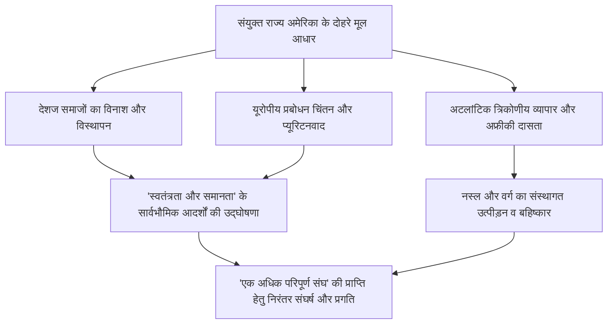
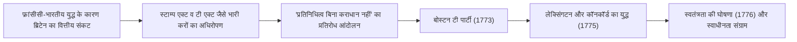
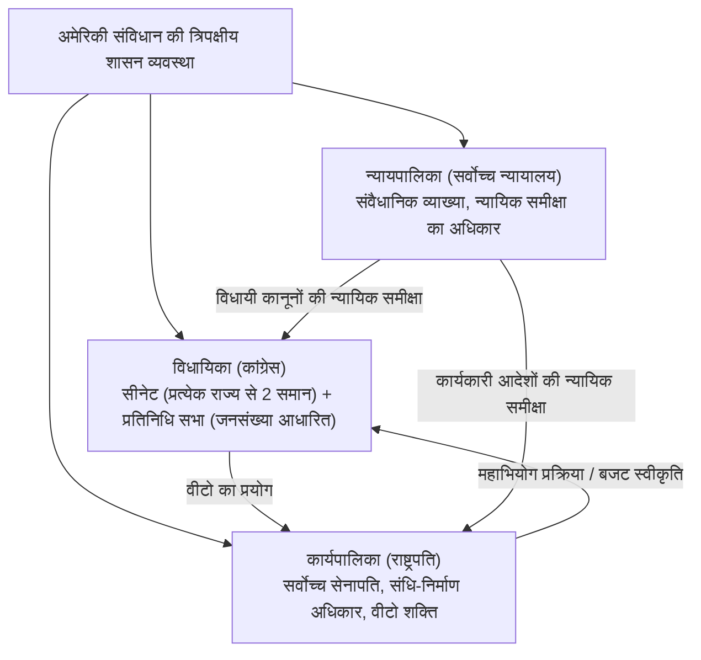
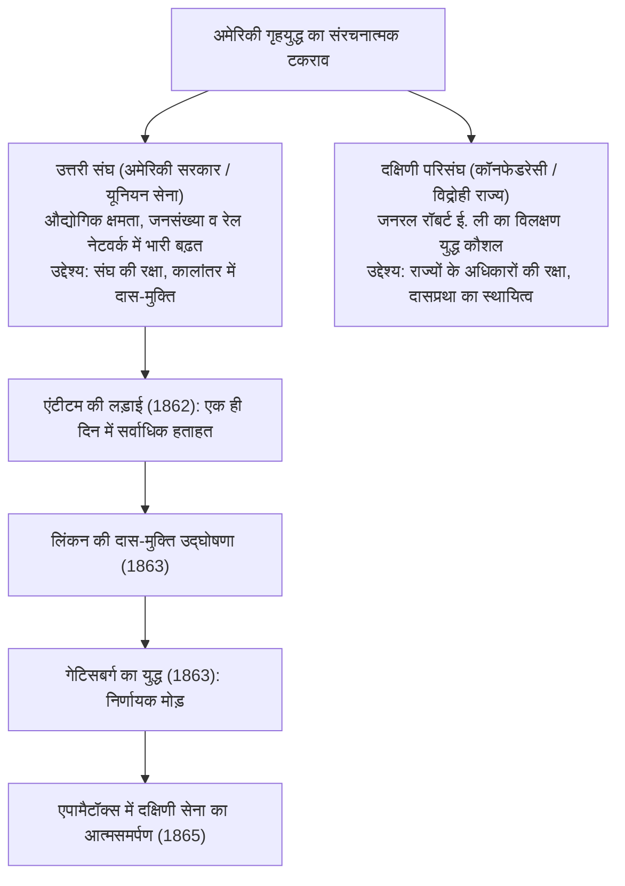
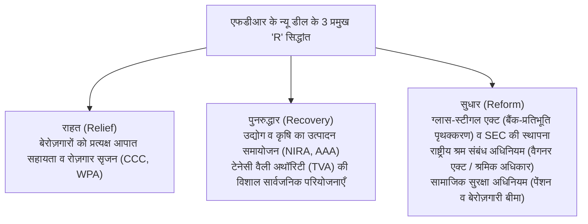
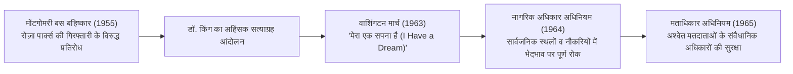
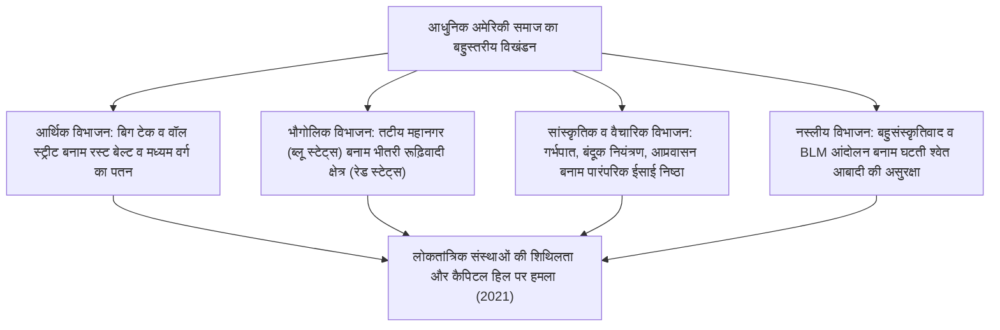
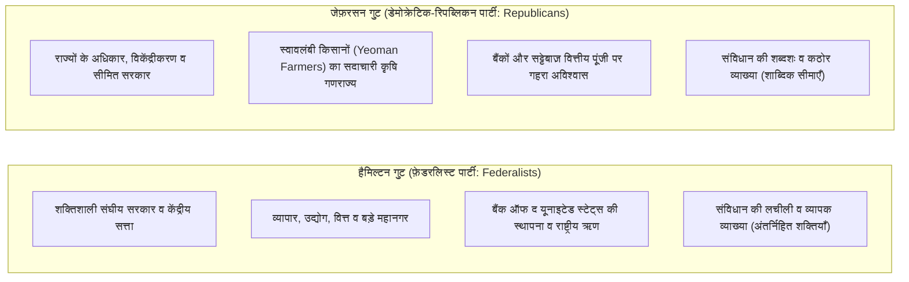

## 1. प्रस्तावना: एक प्रयोगात्मक राष्ट्र के रूप में संयुक्त राज्य अमेरिका

### 1.1 "नई दुनिया" का भ्रम और देशज सभ्यताओं की वास्तविक स्थिति

जब संयुक्त राज्य अमेरिका के इतिहास की बात की जाती है, तो दीर्घकाल से एक मिथकीय आख्यान हावी रहा है कि "यह अज्ञात व असभ्य बीहड़ों में स्वतंत्रता की खोज में आए यूरोपीय श्वेतों द्वारा बसाई गई एक प्रतिज्ञाबद्ध भूमि (Promised Land) थी।" किंतु, 20वीं शताब्दी के उत्तरार्ध से नृविज्ञान और इतिहास-लेखन में हुई प्रगति ने इस तथ्य को निर्विवाद रूप से स्थापित कर दिया है कि यूरोपीय लोगों के आगमन से पूर्व, इस महाद्वीप में सहस्राब्दियों से पल्लवित और अत्यंत विकसित देशज (मूल अमेरिकी) सभ्यताएँ फल-फूल रही थीं।

मिसिसिप्पी घाटी में स्थित काहोकिया (Cahokia) के विशाल पुरातात्विक टीलों से प्रमाणित टीला-निर्माता सभ्यताओं से लेकर, दक्षिण-पश्चिम में अनासाजी (पुएब्लो) संस्कृति द्वारा निर्मित चट्टानी शैल-गृहों (cliff dwellings), तथा उत्तर-पूर्व में पाँच प्रमुख जनजातियों द्वारा स्थापित परिपक्व लोकतांत्रिक परिसंघीय शासन प्रणाली वाले इरोक्वॉइस परिसंघ (हौडेनोसौनी / Haudenosaunee) तक—यहाँ एक अत्यंत समृद्ध एवं विविध सामाजिक-पारिस्थितिक तंत्र विद्यमान था। वर्ष 1492 में कोलंबस के आगमन के उपरांत, यूरोप से आई संक्रामक महामारियों—चेचक, खसरा, इन्फ्लूएंजा आदि (तथाकथित "कोलंबियन एक्सचेंज")—और क्रूर विजय अभियानों के परिणामस्वरूप यहाँ की 80% से 90% मूल आबादी विनष्ट हो गई। इस विनाश की नींव पर ही इस "नई दुनिया" का निर्माण हुआ—यह वस्तुनिष्ठ ऐतिहासिक यथार्थ आधुनिक अमेरिकी इतिहास को समझने का अपरिहार्य प्रारंभिक बिंदु है।

---

### 1.2 पिलग्रिम फादर्स, मेफ़्लावर समझौता और प्यूरिटनवाद की आध्यात्मिक छाप

1607 में जेम्सटाउन (वर्जीनिया उपनिवेश) की स्थापना के पश्चात, अमेरिकी राष्ट्रीय पहचान के आध्यात्मिक आधार स्तंभ के रूप में 1620 में मेफ़्लावर जहाज़ से मैसाचुसेट्स की खाड़ी में पहुँचे पृथकतावादी प्यूरिटन (जिन्हें 'पिलग्रिम फादर्स' कहा जाता है) का अवतरण हुआ।

तट पर उतरने से ठीक पूर्व, जहाज़ पर हस्ताक्षरित **"मेफ़्लावर समझौता (Mayflower Compact)"** किसी राजा अथवा सामंत द्वारा ऊपर से थोपे गए शासन के स्थान पर, **"स्वतंत्र व्यक्तियों की स्वैच्छिक सहमति (सामाजिक अनुबंध) के आधार पर न्यायसंगत व समतामूलक कानून बनाने और स्वयं को अनुशासित करने वाले एक राजनीतिक समुदाय की स्थापना"** का मानव इतिहास का अत्यंत युगांतरकारी स्वशासन घोषणा-पत्र था।

प्यूरिटन नेता जॉन विन्थ्रोप (John Winthrop) द्वारा उपदेशित **"पहाड़ी पर बसा नगर (A City upon a Hill)"** की अवधारणा—कि ईश्वर के साथ अनुबंध करने वाले प्यूरिटन समुदाय को समस्त संसार के समक्ष एक प्रकाशमान आदर्श प्रस्तुत करना चाहिए—आगे चलकर उस धारणा का मूल डीएनए बनी, जिसे आज **"अमेरिकी विशिष्टतावाद (American Exceptionalism)"** कहा जाता है, अर्थात् यह अडिग विश्वास कि अमेरिका को विश्व का मार्गदर्शन करने का एक विशिष्ट ईश्वरीय दायित्व प्राप्त है।

---

## 2. औपनिवेशिक युग से स्वाधीनता संग्राम और संविधान निर्माण तक

### 2.1 13 उपनिवेशों का विकास और "हितकारी उपेक्षा" का अवसान

अटलांटिक महासागर के तटवर्ती क्षेत्रों में स्थापित 13 ब्रिटिश उपनिवेशों ने एक-दूसरे से पर्याप्त भिन्न सामाजिक-आर्थिक संरचनाओं का विकास किया था: उत्तरी न्यू इंग्लैंड (व्यापार, मत्स्य पालन, लघु कृषि और प्यूरिटन निष्ठा), मध्यवर्ती उपनिवेश (अनाज की खेती और विभिन्न जातियों व धर्मों का संगम), तथा दक्षिणी उपनिवेश (तंबाकू, चावल और नील की खेती पर आधारित विशाल बागान व्यवस्था और अफ्रीकी अश्वेत दासों का श्रम)।

18वीं शताब्दी के मध्य तक, ब्रिटिश साम्राज्य ने इन उपनिवेशों के आंतरिक मामलों में कोई प्रत्यक्ष कठोर हस्तक्षेप न करते हुए व्यावहारिक स्वशासन की अनुमति दी थी, जिसे **"हितकारी उपेक्षा (Salutary Neglect)"** की नीति कहा जाता है। किंतु, यूरोप में आधिपत्य को लेकर लड़े गए 'सप्तवर्षीय युद्ध' के उत्तरी अमेरिकी मोर्चे यानी **"फ्रांसीसी और भारतीय युद्ध (French and Indian War: 1754–1763)"** में ब्रिटेन विजयी तो हुआ, परंतु ब्रिटिश राजकोष भीषण युद्ध ऋण के भार तले दब गया।

ब्रिटिश संसद ने सैन्य सुरक्षा के व्यय का बहाना बनाकर उपनिवेशों पर कठोर कर लगाने की दिशा में नीतिगत बदलाव किया:
- **शुगर एक्ट (1764)**, **स्टाम्प एक्ट (1765)**: समाचार पत्रों, पुस्तिकाओं से लेकर ताश के पत्तों तक पर स्टाम्प शुल्क अधिरोपित किया गया।
- उपनिवेशवासियों ने इसका तीव्र विरोध किया और **"प्रतिनिधित्व के बिना कोई कराधान नहीं (No taxation without representation)"** का संवैधानिक नारा बुलंद करते हुए ब्रिटिश वस्तुओं का व्यापक बहिष्कार किया।
- 1770 के 'बोस्टन नरसंहार' और 1773 के 'बोस्टन टी पार्टी' (ईस्ट इंडिया कंपनी की चाय की पेटियों को समुद्र में फेंकना) के बाद जब ब्रिटिश हुकूमत ने सैन्य बल के दम पर दमनकारी कानून (असहनीय कानून / Coercive Acts) लागू किए, तो सशस्त्र संघर्ष अवश्यंभावी हो गया।

---

### 2.2 थॉमस पेन की 'कॉमन सेंस' और स्वतंत्रता की घोषणा (1776)

अप्रैल 1775 में लेक्सिंगटन और कॉनकॉर्ड में दागी गई बंदूकों की गूँज के साथ अमेरिकी स्वाधीनता संग्राम का बिगुल बज चुका था। उस समय भी कई उपनिवेशवासी ब्रिटिश राजमुकुट के प्रति निष्ठा और पूर्ण स्वतंत्रता के द्वंद्व में फँसे हुए थे।

इस हिचकिचाहट को जनवरी 1776 में थॉमस पेन (Thomas Paine) द्वारा अनाम रूप से प्रकाशित पुस्तिका **'कॉमन सेंस (Common Sense)'** ने एक ही झटके में दूर कर दिया। पेन ने अत्यंत सरल और ओजस्वी भाषा में यह तर्क प्रस्तुत किया कि "एक छोटे से द्वीप द्वारा एक समूचे महाद्वीप पर हमेशा के लिए शासन किया जाना पूर्णतः विवेकहीन है" तथा "वंशानुगत राजतंत्र अनिवार्य रूप से मानव के प्राकृतिक अधिकारों का हनन करने वाली एक दूषित व्यवस्था है।" इस पुस्तिका की लाखों प्रतियाँ बिकीं और संपूर्ण अमेरिका में स्वाधीनता की ज्वाला धधक उठी।

तत्पश्चात 4 जुलाई 1776 को, द्वितीय महाद्वीपीय कांग्रेस में थॉमस जेफ़रसन द्वारा प्रारूपित **"अमेरिकी स्वतंत्रता की घोषणा (Declaration of Independence)"** को अंगीकार किया गया।

> "हम इन सत्यों को स्वतःसिद्ध मानते हैं: कि सभी मनुष्य जन्म से समान बनाए गए हैं; उन्हें उनके सृष्टिकर्ता द्वारा कुछ अहस्तांतरणीय अधिकार प्रदान किए गए हैं, जिनमें जीवन, स्वतंत्रता और सुख की खोज सम्मिलित हैं। तथा इन अधिकारों की सुरक्षा हेतु ही मानव समाज में सरकारों की स्थापना होती है, जो अपनी न्यायसंगत सत्ता शासितों की सहमति से प्राप्त करती हैं।"

जॉन लॉक के सामाजिक अनुबंध और प्राकृतिक अधिकारों के सिद्धांतों पर आधारित इस भव्य घोषणा ने निरंकुश शासन के विरुद्ध जनता के प्रतिरोध (क्रांति के अधिकार) को न्यायोचित ठहराया और यह विश्व इतिहास में मानव स्वतंत्रता का एक अमर कीर्तिमान बन गई।

कमांडर-इन-चीफ जॉर्ज वाशिंगटन के नेतृत्व में महाद्वीपीय सेना ने रसद की भारी कमी और हाड़ कँपा देने वाली ठंड का सामना करते हुए दीर्घकालिक रक्षात्मक व गुरिल्ला युद्ध लड़ा। 1777 में साराटोगा की लड़ाई में मिली ऐतिहासिक विजय के बाद फ्रांस, स्पेन और नीदरलैंड के साथ सैन्य गठबंधन स्थापित हुआ। 1781 में यॉर्कटाउन की लड़ाई में ब्रिटिश मुख्य सेना को घेरकर आत्मसमर्पण के लिए विवश किया गया, और 1783 की पेरिस संधि द्वारा ब्रिटेन ने संयुक्त राज्य अमेरिका की पूर्ण स्वाधीनता को औपचारिक मान्यता दे दी।

---

### 2.3 परिसंघ के अनुच्छेदों की विफलता और फिलाडेल्फिया संवैधानिक सम्मेलन (1787)

स्वाधीनता के प्रारंभिक दौर में संयुक्त राज्य अमेरिका 1781 में लागू **"परिसंघ के अनुच्छेदों (Articles of Confederation)"** पर आधारित 13 संप्रभु राज्यों का एक अत्यंत शिथिल और कमज़ोर महासंघ (Confederation) मात्र था।
- केंद्रीय सरकार (परिसंघ कांग्रेस) के पास न तो कर लगाने का अधिकार था, न ही कोई स्थायी सेना थी, और न ही विदेशी व्यापार को विनियमित करने की शक्ति।
- जब युद्धोपरांत आर्थिक मंदी और भारी ऋणों से त्रस्त किसानों ने 1786 में "शेज़ का विद्रोह (Shays' Rebellion)" किया, तो परिसंघ सरकार एक सैन्य टुकड़ी तक भेजने में असमर्थ रही, जिससे देश के विखंडन का संकट साक्षात् सामने आ खड़ा हुआ।

1787 की ग्रीष्म ऋतु में, फिलाडेल्फिया के इंडिपेंडेंस हॉल में 55 प्रतिनिधि (जिन्हें जेम्स मैडिसन, अलेक्जेंडर हैमिल्टन, बेंजामिन फ्रैंकलिन सहित 'फाउंडिंग फादर्स / राष्ट्र-निर्माता' कहा जाता है) एकत्रित हुए और उन्होंने वर्तमान **"संयुक्त राज्य अमेरिका के संविधान"** का निर्माण किया।

- **महान समझौता (कनेक्टिकट समझौता)**: छोटे राज्यों द्वारा प्रस्तावित समान प्रतिनिधित्व (न्यू जर्सी योजना) और बड़े राज्यों द्वारा प्रस्तावित जनसंख्या-आधारित प्रतिनिधित्व (वर्जीनिया योजना) का समन्वय करते हुए द्विसदनीय व्यवस्था स्थापित की गई: "सीनेट (प्रत्येक राज्य को समान 2 सीटें)" और "प्रतिनिधि सभा (जनसंख्या के अनुपात में सीटें)"।
- **दास आबादी की गणना (तीन-पंचमांश समझौता / Three-Fifths Compromise)**: दक्षिणी राज्यों के राजनीतिक प्रभाव को संतुलित करने के लिए प्रतिनिधि सभा में सीटों के आवंटन और प्रत्यक्ष करों के निर्धारण हेतु प्रत्येक दास को स्वतंत्र व्यक्ति का "तीन-पंचमांश (3/5)" गिनने का ऐतिहासिक एवं विवादास्पद समझौता किया गया।
- **नियंत्रण और संतुलन (Checks and Balances)**: मॉन्टेस्क्यू के विचारों से प्रेरित होकर राष्ट्रपति, कांग्रेस और संघीय न्यायालयों के बीच शक्तियों का स्पष्ट विभाजन किया गया, ताकि कोई भी व्यक्ति अथवा संस्था निरंकुश सत्ता न हथिया सके।

---

## 3. क्षेत्रीय विस्तार, प्रत्यक्ष प्रारब्ध (मैनिफेस्ट डेस्टिनी) और गृहयुद्ध का भीषण दौर

### 3.1 "प्रत्यक्ष प्रारब्ध" और महाद्वीपीय भूभाग का विस्तार

19वीं शताब्दी के पूर्वार्ध में अमेरिका ने विस्मयकारी गति से पश्चिम की ओर अपने साम्राज्य का विस्तार किया।
- **1803: लुइसियाना खरीद**: राष्ट्रपति थॉमस जेफ़रसन ने फ्रांस के नेपोलियन से मिसिसिप्पी नदी के पश्चिम में स्थित विशाल लुइसियाना क्षेत्र को मात्र 1.5 करोड़ डॉलर में खरीदकर देश के भूभाग को एक ही झटके में दोगुना कर दिया।
- **1823: मुनरो सिद्धांत (Monroe Doctrine)**: राष्ट्रपति जेम्स मुनरो ने घोषणा की कि "यूरोपीय शक्तियाँ अमेरिकी महाद्वीप के मामलों में किसी भी प्रकार का हस्तक्षेप न करें, और संयुक्त राज्य अमेरिका भी यूरोपीय विवादों से दूर रहेगा"—यह अलगाववाद और परस्पर अहस्तक्षेप की नीति का उद्घोष था।
- **मैनिफेस्ट डेस्टिनी (Manifest Destiny / प्रत्यक्ष प्रारब्ध)**: यह विस्तारवादी विचारधारा देश में तेज़ी से फैली कि "प्रशांत महासागर के तट तक समूचे उत्तरी अमेरिकी महाद्वीप पर अधिकार करना, उसका विकास करना तथा स्वतंत्रता व लोकतंत्र का प्रसार करना अमेरिका को ईश्वर द्वारा सौंपा गया स्पष्ट और अनिवार्य दैवीय दायित्व है।"

किंतु इस क्षेत्रीय विस्तार की भयानक कीमत यहाँ के मूल निवासियों को चुकानी पड़ी। राष्ट्रपति एंड्रयू जैक्सन द्वारा पारित 1830 के **'भारतीय निष्कासन अधिनियम (Indian Removal Act)'** के अंतर्गत चेरोकी सहित पाँच प्रमुख जनजातियों को उनके पुश्तैनी पूर्वी वनों से बलपूर्वक बेदखल कर, भीषण शीत ऋतु में हज़ारों किलोमीटर पैदल चलाकर ओक्लाहोमा (इंडियन टेरिटरी) की ओर खदेड़ दिया गया। मार्ग में भूख, कुपोषण और बीमारियों से हज़ारों निर्दोषों की मृत्यु हो गई। इस कारुणिक त्रासदी को इतिहास में **"आंसुओं का मार्ग (Trail of Tears)"** के नाम से जाना जाता है।

मैक्सिकन-अमेरिकी युद्ध (1846–1848) में विजय के फलस्वरूप कैलिफोर्निया, टेक्सास और न्यू मैक्सिको का अधिग्रहण हुआ, और 1848 के 'गोल्ड रश' के साथ ही अमेरिका अटलांटिक से प्रशांत महासागर तक फैला एक विशाल महाद्वीपीय राष्ट्र बन गया।

---

### 3.2 दासप्रथा का संकट और राष्ट्रीय विभाजन का गहराना

परंतु, जैसे-जैसे सीमा पश्चिम की ओर बढ़ती गई, एक विनाशकारी प्रश्न पूरे संघ को झकझोरता रहा: **"नए शामिल होने वाले क्षेत्रों में दासप्रथा की अनुमति दी जाए या उस पर प्रतिबंध लगाया जाए?"**

- **उत्तरी अर्थव्यवस्था**: औद्योगिक क्रांति के प्रभाव से मुक्त श्रमिकों पर आधारित विनिर्माण, व्यापार और बैंकिंग का अभूतपूर्व विकास। घरेलू उद्योगों के संरक्षण हेतु संरक्षणवादी व्यापार नीति का समर्थन।
- **दक्षिणी अर्थव्यवस्था**: विशाल कपास बागानों पर टिकी, 40 लाख अफ्रीकी अश्वेत दासों के अवैतनिक व अमानवीय श्रम पर आश्रित "किंग कॉटन" की सत्ता। ब्रिटेन आदि देशों को कच्चा माल निर्यात करने हेतु मुक्त व्यापार की प्रबल पक्षधर।

कांग्रेस में 'मुक्त राज्यों' और 'दास राज्यों' का शक्ति-संतुलन बनाए रखने के लिए 1820 का मिसौरी समझौता (36°30' अक्षांश के उत्तर में दासप्रथा पर रोक) तथा 1850 का समझौता (भगोड़ा दास अधिनियम का कड़ा प्रावधान) जैसे कामचलाऊ उपाय किए गए।

किंतु, 1854 के कंसास-नेब्रास्का अधिनियम (जिसने स्थानीय जनमत संग्रह द्वारा दासप्रथा का निर्णय करने की छूट दी) के कारण "रक्त-रंजित कंसास (Bleeding Kansas)" नामक गृहयुद्ध छिड़ गया। इसके अतिरिक्त 1857 में सर्वोच्च न्यायालय के **"ड्रेड स्कॉट बनाम सैंडफोर्ड"** के कुख्यात फैसले ने यह व्यवस्था दी कि "अश्वेत व्यक्ति संविधान के तहत नागरिक नहीं हैं और उन्हें कोई अधिकार प्राप्त नहीं हैं" तथा "कांग्रेस द्वारा किसी क्षेत्र में दासप्रथा को प्रतिबंधित करना असंवैधानिक है।" इसने उत्तरी राज्यों के दासता-विरोधी जनमत को भड़का दिया।

---

### 3.3 अमेरिकी गृहयुद्ध (1861–1865): रक्तरंजित पुनर्मिलन और दास-मुक्ति

1860 के राष्ट्रपति चुनाव में रिपब्लिकन पार्टी के अब्राहम लिंकन (Abraham Lincoln)—जिन्होंने नए क्षेत्रों में दासप्रथा के विस्तार को रोकने का संकल्प लिया था—विजयी हुए। इसके तुरंत बाद दक्षिण कैरोलिना सहित 7 दक्षिणी राज्यों ने संघ से अलग होने की घोषणा कर दी और "कॉनफेडरेट स्टेट्स ऑफ अमेरिका (दक्षिणी परिसंघ)" का गठन कर लिया।

अप्रैल 1861 में जब दक्षिणी सेना ने फोर्ट सम्टर पर तोपखाने से हमला किया, तो **"अमेरिकी गृहयुद्ध (American Civil War)"** का विधिवत आरंभ हो गया।

राष्ट्रपति लिंकन ने इस युद्ध के उद्देश्य को मात्र "संघ की बहाली" से ऊपर उठाकर "मानव स्वतंत्रता के धर्मयुद्ध" में परिवर्तित कर दिया:
- **1 जनवरी 1863: मुक्ति उद्घोषणा (Emancipation Proclamation)**: विद्रोही दक्षिणी क्षेत्रों के समस्त दासों को तत्काल प्रभाव से 'सदा के लिए मुक्त' घोषित कर दिया गया। इसके परिणामस्वरूप लगभग 1.8 लाख अश्वेत सैनिकों ने यूनियन सेना में शामिल होकर युद्ध का पासा पलट दिया, और ब्रिटेन व फ्रांस द्वारा दक्षिण को समर्थन देने की नैतिक संभावना समाप्त हो गई।
- **नवंबर 1863: गेटिसबर्ग संबोधन (Gettysburg Address)**: लिंकन ने अपने विश्वप्रसिद्ध भाषण में संकल्प व्यक्त किया कि **"जनता की, जनता द्वारा, जनता के लिए सरकार (Government of the people, by the people, for the people)"** इस पृथ्वी से कभी लुप्त नहीं होनी चाहिए।

जनरल शर्मन के विनाशकारी "मार्च टू द सी" और भीषण समग्र युद्ध के उपरांत, अप्रैल 1865 में दक्षिणी कमांडर जनरल ली ने वर्जीनिया के एपामैटॉक्स कोर्ट हाउस में यूनियन कमांडर जनरल यूलिसिस एस. ग्रांट के समक्ष घुटने टेक दिए। 6 लाख से अधिक प्राणों की आहुति देकर लड़े गए इस गृहयुद्ध के पश्चात संविधान में 13वाँ संशोधन (दासप्रथा का उन्मूलन), 14वाँ संशोधन (कानून की सम्यक प्रक्रिया और विधि के समक्ष समानता), तथा 15वाँ संशोधन (नस्ल के आधार पर मताधिकार से वंचित न करना) जोड़े गए। इसके साथ ही संयुक्त राज्य अमेरिका शिथिल राज्यों के संघ से एक "अविभाज्य एकीकृत राष्ट्र" में रूपांतरित हो गया।

किंतु, युद्धोपरांत 'पुनर्निर्माण काल (Reconstruction)' के समाप्त होते ही दक्षिणी राज्यों में नस्ली अलगाव को संस्थागत रूप देने वाले **"जिम क्रो कानून (Jim Crow Laws)"** लागू कर दिए गए, और कु क्लक्स क्लान (KKK) द्वारा अश्वेतों की लिंचिंग और भयानक सामाजिक प्रताड़ना का काला युग प्रारंभ हुआ।

---

## 4. गिल्डेड एज (स्वर्णिम आवरण का युग), औद्योगिक क्रांति और साम्राज्यवाद का उदय

### 4.1 महा-पूंजीपतियों का उत्थान और "गिल्डेड एज"

गृहयुद्ध के बाद से 20वीं शताब्दी के प्रारंभ तक अमेरिकी अर्थव्यवस्था ने मानव इतिहास की अभूतपूर्व औद्योगिक छलांग लगाई। प्रख्यात लेखक मार्क ट्वेन ने इस युग को **"गिल्डेड एज (Gilded Age)"** नाम दिया—एक ऐसा कालखंड जो ऊपर से तो सोने जैसा दमकता था, किंतु भीतर से भयानक भ्रष्टाचार और विषमता से सड़ रहा था।

- 1869 में पहली ट्रांसकॉन्टिनेंटल रेलमार्ग के पूरा होने से संपूर्ण अमेरिका एक विशाल एकीकृत राष्ट्रीय बाज़ार में बदल गया।
- **रॉबर बैरन्स (Robber Barons / लुटेरे उद्योगपति) का एकाधिकार**:
  - जॉन डी. रॉकफेलर की "स्टैंडर्ड ऑयल" (जिसने अमेरिका के 90% पेट्रोलियम शोधन पर नियंत्रण कर लिया)।
  - एंड्रयू कार्नेगी का इस्पात साम्राज्य (कार्नेगी स्टील)।
  - जे. पी. मॉर्गन द्वारा वित्तीय पूंजी का एकत्रीकरण और महा-ट्रस्टों का निर्माण (यू.एस. स्टील की स्थापना)।
- थॉमस एडिसन द्वारा विद्युत ग्रिड, अलेक्जेंडर ग्राहम बेल द्वारा टेलीफोन, और हेनरी फोर्ड द्वारा असेंबली लाइन जन-उत्पादन प्रणाली (फोर्डिज़्म) के आविष्कारों ने अमेरिका को औद्योगिक उत्पादन में ब्रिटेन और जर्मनी को बहुत पीछे छोड़ते हुए विश्व का नंबर एक औद्योगिक देश बना दिया।

दूसरी ओर, धन के इस असीमित संकेंद्रण और अमानवीय कामकाजी परिस्थितियों के कारण होमस्टेड स्ट्राइक और पुलमैन स्ट्राइक जैसे खूनी श्रमिक संघर्ष हुए, जबकि यूरोप (इटली, आयरलैंड, पूर्वी यूरोपीय यहूदी) से आए करोड़ों नए प्रवासियों ने अमेरिकी महानगरों में नारकीय मलिन बस्तियों (स्लम्स) को जन्म दिया।

---

### 4.2 सीमांत (फ्रंटियर) का अवसान और विदेशी क्षेत्रों का अधिग्रहण

1890 की जनगणना के आधार पर इतिहासकार फ्रेडरिक जैक्सन टर्नर ने "अमेरिकन फ्रंटियर (पश्चिमी सीमांत) के समाप्त होने" की घोषणा की। जब उस पश्चिमी सीमांत का अंत हो गया जिसने अमेरिकी लोकतंत्र और साहस को गढ़ा था, तो अमेरिका की दृष्टि स्वाभाविक रूप से प्रशांत महासागर और लैटिन अमेरिकी बाज़ारों की ओर मुड़ गई (अल्फ्रेड थायर महान का नौसैनिक शक्ति सिद्धांत)।

- **1898: स्पेनिश-अमेरिकी युद्ध**: 'यूएसएस मेन' युद्धपोत के रहस्यमय विस्फोट के बहाने स्पेन के विरुद्ध छेड़े गए इस युद्ध में अमेरिका ने कुछ ही महीनों में निर्णायक विजय प्राप्त की। फिलीपींस, गुआम और प्यूर्टो रिको पर नियंत्रण स्थापित किया तथा हवाई द्वीपसमूह का विलय कर अमेरिका एक समुद्री साम्राज्य बन गया।
- **ओपन डोर नीति (1899)**: विदेश मंत्री जॉन हे ने यूरोपीय शक्तियों द्वारा चीन के विभाजन के विरुद्ध "खुले द्वार, समान अवसर और क्षेत्रीय अखंडता" की नीति की घोषणा की, ताकि एशियाई बाज़ारों में अमेरिकी व्यापार की निर्बाध पहुँच सुनिश्चित हो सके।

घरेलू स्तर पर, एकाधिकार पूंजी के अत्याचारों और राजनीतिक भ्रष्टाचार पर अंकुश लगाने हेतु राष्ट्रपति थियोडोर रूजवेल्ट (ट्रस्ट-भंजन, पर्यावरण संरक्षण) और वुड्रो विल्सन के नेतृत्व में **"प्रगतिशीलतावादी आंदोलन (Progressivism)"** चला। इसके अंतर्गत शर्मन एंटी-ट्रस्ट एक्ट का कड़ा क्रियान्वयन, फेडरल रिजर्व सिस्टम (FRS) की स्थापना, और महिलाओं को मताधिकार प्रदान करने वाला 19वाँ संविधान संशोधन अस्तित्व में आए।

---

## 5. दोनों विश्व युद्ध, महामंदी और पैक्स अमेरिकाना की स्थापना

### 5.1 प्रथम विश्व युद्ध और "गर्जनशील बीस का दशक"

1914 में जब प्रथम विश्व युद्ध छिड़ा, तो अमेरिका ने प्रारंभ में तटस्थता बरती और यूरोपीय देशों को हथियारों व सामग्रियों के भारी निर्यात के दम पर एक बड़े ऋणदाता देश में बदल गया। किंतु जर्मनी की 'असीमित पनडुब्बी युद्ध' नीति और 'ज़िमरमैन टेलीग्राम' कांड के उपरांत अमेरिका ने 1917 में युद्ध में प्रवेश किया।

राष्ट्रपति वुड्रो विल्सन ने **"चौदह सूत्रीय शांति सिद्धांत"** प्रस्तुत किए, जिनमें गुप्त संधियों का अंत, आत्मनिर्णय का अधिकार और 'लीग ऑफ नेशंस (राष्ट्र संघ)' की स्थापना का प्रस्ताव था। किंतु युद्ध के बाद अमेरिकी सीनेट ने अपने पारंपरिक अलगाववाद के कारण वर्साय संधि का अनुसमर्थन करने से इनकार कर दिया और अमेरिका राष्ट्र संघ का सदस्य नहीं बना।

1920 के दशक में अमेरिका ने **"रोअरिंग ट्वेंटीज़ (Roaring Twenties / गर्जनशील बीस का दशक)"** के रूप में अभूतपूर्व उपभोक्तावादी समाज के स्वर्ण युग का अनुभव किया:
- रेडियो, मॉडल-टी फोर्ड कारें, सिनेमा, जैज़ संगीत और घरेलू बिजली उपकरण आम घरों का हिस्सा बन गए।
- शेयर बाज़ार में अंधाधुंध सट्टेबाज़ी का ज्वार उमड़ पड़ा और लोगों को लगा कि यह समृद्धि शाश्वत है।
- दूसरी ओर, शराबबंदी (18वाँ संशोधन) ने अल कपोन जैसे माफिया गिरोहों को जन्म दिया, और आप्रवासन विरोधी उग्र राष्ट्रवाद तथा कु क्लक्स क्लान का पुनरुत्थान देखने को मिला।

---

### 5.2 1929 की महामंदी और न्यू डील नीति

24 अक्टूबर 1929 को "काला गुरुवार (Black Thursday)" आया। न्यूयॉर्क वॉल स्ट्रीट शेयर बाज़ार के ऐतिहासिक क्रैश के साथ संपूर्ण विश्व पर 'महामंदी (Great Depression)' का कहर टूट पड़ा।
हज़ारों बैंक दिवालिया हो गए, बेरोज़गारी की दर $25\%$ (प्रत्येक चार में से एक व्यक्ति) तक पहुँच गई, और मध्य-पश्चिम में आए भीषण रेतीले तूफानों (डस्ट बाउल) ने लाखों किसानों को बेघर कर दिया। राष्ट्रपति हर्बर्ट हूवर की अहस्तक्षेपवादी (laissez-faire) नीतियाँ पूर्णतः विफल सिद्ध हुईं।

1933 में सत्ता में आए राष्ट्रपति फ्रैंकलिन डी. रूजवेल्ट (FDR) ने स्थिति से निपटने हेतु ऐतिहासिक **"न्यू डील (New Deal)"** नीति लागू की।

कीन्स के अर्थशास्त्र से भी पहले राज्य द्वारा बाज़ार में प्रत्यक्ष हस्तक्षेप और कल्याणकारी राज्य की नींव रखने वाली इस न्यू डील नीति ने राष्ट्रपति पद की शक्तियों का अभूतपूर्व विस्तार किया और यह आधुनिक अमेरिकी उदारवाद (लिबरलिज्म) का आधार बनी।

---

### 5.3 द्वितीय विश्व युद्ध और वैश्विक आधिपत्य का अधिग्रहण

7 दिसंबर 1941 को जापानी नौसेना द्वारा पर्ल हार्बर पर किए गए औचक हमले के बाद अमेरिका द्वितीय विश्व युद्ध में पूरी शक्ति से कूद पड़ा।

अमेरिका ने स्वयं को **"लोकतंत्र का शस्त्रागार (Arsenal of Democracy)"** घोषित किया और अपनी समूची असैन्य औद्योगिक क्षमता को रातों-रात सैन्य उत्पादन में झोंक दिया। ऑटोमोबाइल कारखानों में टैंक और लड़ाकू विमान बनने लगे, और लाखों महिला श्रमिक (रोजी द रिवेटर) उत्पादन के मोर्चे पर डट गईं।

- यूरोपीय मोर्चे पर 1944 के 'नॉर्मंडी लैंडिंग (डी-डे)' की सफलता और नाज़ी जर्मनी की पराजय।
- प्रशांत मोर्चे पर 'आइलैंड-हॉपिंग' रणनीति और जापान का आत्मसमर्पण।
- तथा अत्यंत गोपनीय 'मैनहट्टन प्रोजेक्ट' के माध्यम से परमाणु बम का विकास एवं हिरोशिमा व नागासाकी पर उनका विध्वंसक प्रयोग।

युद्ध समाप्त होने तक, अमेरिका विश्व के कुल औद्योगिक उत्पादन के आधे हिस्से का उत्पादन कर रहा था, दुनिया के $70\%$ स्वर्ण भंडार पर उसका अधिकार था, और वह विश्व की एकमात्र परमाणु शक्ति बन चुका था।
1944 के ब्रेटन वुड्स समझौते ने **अमेरिकी डॉलर को वैश्विक रिज़र्व मुद्रा (IMF और विश्व बैंक)** के रूप में स्थापित किया, और 1945 में सैन फ्रांसिस्को में संयुक्त राष्ट्र चार्टर को अंगीकार किया गया। इस प्रकार निर्विवाद रूप से **"पैक्स अमेरिकाना (Pax Americana / अमेरिकी शांति व आधिपत्य का युग)"** प्रारंभ हुआ।

---

## 6. शीत युद्ध की संरचना, नागरिक अधिकार आंदोलन और अमेरिकी गौरव व द्वंद्व

### 6.1 पूर्व-पश्चिम शीत युद्ध और परमाणु प्रतिरोध की विभीषिका

द्वितीय विश्व युद्ध के मलबे से दो महाशक्तियों के बीच एक नया वैश्विक वैचारिक संघर्ष उत्पन्न हुआ—पूंजीवादी लोकतांत्रिक गुट का नेतृत्व करने वाला अमेरिका और साम्यवादी गुट का नेतृत्व करने वाला सोवियत संघ। इसे **"शीत युद्ध (Cold War)"** कहा गया।

- **1947: ट्रूमैन सिद्धांत**: साम्यवाद के प्रसार को रोकने हेतु "संरोधन नीति (Containment Policy)" का प्रतिपादन।
- **मार्शल योजना**: पश्चिमी यूरोप को आर्थिक रूप से सुदृढ़ कर साम्यवाद के प्रभाव से बचाने हेतु दिया गया विशाल आर्थिक पैकेज।
- **1949: नाटो (NATO) की स्थापना**: सामूहिक रक्षा गठबंधन का निर्माण।
- कोरियाई युद्ध (1950–1953) का भड़कना और घरेलू मोर्चे पर साम्यवाद-विरोधी उन्माद व दमनकारी अभियान—"रेड स्केयर (मैकार्थीवाद)"।

1962 के **क्यूबा मिसाइल संकट** के दौरान जब सोवियत संघ ने क्यूबा में परमाणु मिसाइलें तैनात कीं, तो राष्ट्रपति जॉन एफ. कैनेडी और सोवियत नेता निकिता ख्रुश्चेव आमने-सामने आ गए, जिससे विश्व परमाणु महाविनाश के कगार पर पहुँच गया था। 'पारस्परिक सुनिश्चित विनाश (MAD)' पर आधारित भय के भयानक संतुलन ने समूची दुनिया को अपनी गिरफ़्त में ले लिया।

---

### 6.2 नागरिक अधिकार आंदोलन: वास्तविक समानता के लिए महासंग्राम

द्वितीय विश्व युद्ध के बाद जहाँ एक ओर श्वेत मध्यम वर्ग उपनगरों (suburbs) में अपने निजी मकानों, टीवी और आधुनिक जीवनशैली का उपभोग कर रहा था, वहीं दूसरी ओर दक्षिणी राज्यों में अश्वेत समुदाय अमानवीय पृथक्करण और अपमानजनक भेदभाव का दंश झेलने को विवश था।

1954 में अमेरिकी सर्वोच्च न्यायालय के ऐतिहासिक फैसले **"ब्राउन बनाम तोपेका शिक्षा बोर्ड (Brown v. Board of Education)"** ने सरकारी स्कूलों में नस्ली अलगाव को "मूलतः असमान" घोषित करते हुए असंवैधानिक करार दिया। इसने देशव्यापी नागरिक अधिकार आंदोलन की चिंगारी सुलगा दी।

डॉ. मार्टिन लूथर किंग जूनियर के नेतृत्व में चले अहिंसक सीधे अभियानों (धरना, फ्रीडम राइड्स, मार्च) पर जब श्वेत पुलिसकर्मियों ने खूंखार कुत्तों और पानी की तोपों से बर्बर हमले किए, तो इन दृश्यों का राष्ट्रीय टेलीविजन पर प्रसारण देखकर समूचे देश की अंतरात्मा काँप उठी। राष्ट्रपति लिंडन बी. जॉनसन के कार्यकाल में ऐतिहासिक **1964 का नागरिक अधिकार अधिनियम** तथा **1965 का मताधिकार अधिनियम** पारित हुए, जिससे एक सदी से चली आ रही संस्थागत व कानूनी नस्लभेदी व्यवस्था ध्वस्त हो गई।

---

### 6.3 वियतनाम युद्ध का दलदल और प्रति-संस्कृति (काउंटर-कल्चर) का उभार

किंतु, दक्षिण-पूर्व एशिया में 'डोमिनो थ्योरी' (एक देश के साम्यवादी बनने पर पड़ोसियों का भी साम्यवाद की ओर झुकना) के भय से ग्रस्त होकर अमेरिका ने वियतनाम युद्ध (1965–1973) के दलदल में छलांग लगा दी।
घने जंगलों में गुरिल्ला युद्ध, 'एजेंट ऑरेंज' रसायन का छिड़काव, माई लाई नरसंहार, और अनिवार्य सैन्य भर्ती (ड्राफ्ट) के तहत हज़ारों युवा अमेरिकियों की मौतों ने सरकार के प्रति जनता के विश्वास को तार-तार कर दिया।

विश्वविद्यालय परिसरों में युद्ध-विरोधी प्रचंड आंदोलन भड़क उठे। इसके साथ ही हिप्पी आंदोलन, रॉक संगीत (वुडस्टॉक फेस्टिवल), महिला मुक्ति आंदोलन (वूमेन्स लिब) और पर्यावरण चेतना जैसी **"प्रति-संस्कृति (Counterculture)"** की लहर पूरे देश में छा गई। 1974 में राष्ट्रपति रिचर्ड निक्सन को "वाटरगेट कांड" में सबूत छिपाने के षड्यंत्र के कारण पद से त्यागपत्र देना पड़ा—वे त्यागपत्र देने वाले पहले अमेरिकी राष्ट्रपति बने। इसके बाद अमेरिका आर्थिक गतिरोध व मुद्रास्फीति (स्टैगफ्लेशन) और कार्टर प्रशासन के दौरान गहरी नैतिक व मनोवैज्ञानिक हताशा में डूब गया।

---

## 7. रीगनोमिक्स से शीतयुद्धोत्तर काल, 9/11 और आधुनिक समाज का गहन विभाजन

### 7.1 रीगन क्रांति और शीत युद्ध का समापन

1980 में "मजबूत अमेरिका की पुनर्स्थापना (Make America Great Again)" का नारा देकर रोनाल्ड रीगन (Ronald Reagan) ने भारी बहुमत से राष्ट्रपति चुनाव जीता।

- **रीगनोमिक्स (Reaganomics)**: आपूर्ति-पक्ष अर्थशास्त्र (सप्लाई-साइड इकोनॉमिक्स) के आधार पर करों में भारी कटौती, बाज़ार का गैर-विनियमन (डीरेग्यूलेशन), सामाजिक कल्याण बजट में कटौती और मुद्रा आपूर्ति का कड़ा नियंत्रण। इसने "छोटे शासन" और नवउदारवाद (Neoliberalism) की वैश्विक लहर को जन्म दिया।
- **"दुष्ट साम्राज्य" से सीधा मुकाबला**: रक्षा बजट में भारी वृद्धि करते हुए सामरिक रक्षा पहल (SDI / स्टार वार्स) को आगे बढ़ाया और हथियारों की होड़ में सोवियत संघ की योजनाबद्ध अर्थव्यवस्था को दिवालियापन के कगार पर धकेल दिया।
- 1989 में बर्लिन की दीवार का गिरना और 1991 में सोवियत संघ का विघटन—इसके साथ ही आधी सदी लंबा शीत युद्ध अमेरिका की पूर्ण विजय के साथ समाप्त हुआ। इतिहासकार फ्रांसिस फुकुयामा ने इसे "इतिहास का अंत (उदारवादी लोकतंत्र और पूंजीवाद की अंतिम विजय)" घोषित किया।

---

#---

## 7.1.5 खाड़ी युद्ध (1991) और पॉवेल सिद्धांत की सैन्य क्रांति

शीत युद्ध समाप्त होते ही अगस्त 1990 में इराक के तानाशाह सद्दाम हुसैन ने पड़ोसी देश कुवैत पर अचानक आक्रमण कर कब्ज़ा कर लिया। राष्ट्रपति जॉर्ज एच. डब्ल्यू. बुश ने संयुक्त राष्ट्र सुरक्षा परिषद से प्रस्ताव पारित करवाया और 34 देशों के बहुराष्ट्रीय गठबंधन का गठन कर जनवरी 1991 में "ऑपरेशन डेजर्ट स्टॉर्म (खाड़ी युद्ध)" का आगाज़ किया।

### वियतनाम के बुरे स्वप्न से उबरने वाला सैन्य सिद्धांत
वियतनाम युद्ध के दलदल से मिले कटु अनुभवों के आधार पर तत्कालीन जॉइंट चीफ्स ऑफ स्टाफ के अध्यक्ष जनरल कॉलिन पॉवेल ने जो सैन्य रणनीति विकसित की, उसे **"पॉवेल सिद्धांत (Powell Doctrine)"** कहा जाता है:
1. राष्ट्रीय हितों के समक्ष एक अत्यंत गंभीर और स्पष्ट ख़तरा विद्यमान होना चाहिए।
2. सभी कूटनीतिक और आर्थिक विकल्पों की विफलता के बाद ही सैन्य बल "अंतिम उपाय" होना चाहिए।
3. एक स्पष्ट और साध्य सैन्य लक्ष्य निर्धारित होना चाहिए।
4. **"अत्यधिक एवं प्रचंड सैन्य बल (Overwhelming Force)"** का एकमुश्त प्रयोग किया जाना चाहिए, ताकि शत्रु को संभलने का अवसर दिए बिना अल्पकाल में पूर्ण विजय प्राप्त की जा सके।
5. युद्धक्षेत्र से बाहर निकलने की स्पष्ट रणनीति (एग्ज़िट स्ट्रैटेजी) पूर्व-निर्धारित होनी चाहिए।

अमेरिकी सेना ने स्टील्थ विमान (F-117), जीपीएस-निर्देशित सटीक बम (स्मार्ट बम), टॉमहॉक क्रूज़ मिसाइलें और पैट्रियट मिसाइल रक्षा प्रणाली जैसे अत्याधुनिक हथियारों की विध्वंसक मारक क्षमता का सीएनएन (CNN) के माध्यम से सीधा प्रसारण कर दुनिया को अपनी तकनीक दिखाई, और मात्र 100 घंटे के ज़मीनी अभियान में इराकी सेना को ध्वस्त कर दिया।

राष्ट्रपति बुश ने गर्व से घोषणा की कि "वियतनाम का भूत अब रेगिस्तान की रेत में दफन हो चुका है," और अमेरिका ने "एकमात्र महाशक्ति" के रूप में एक "नई विश्व व्यवस्था (New World Order)" का नेतृत्व करने का आत्मविश्वास हासिल किया। किंतु विडंबना यह रही कि इसी आसान जीत के अहंकार ने आगे चलकर 2003 के इराक युद्ध में पॉवेल सिद्धांत की सतर्कता को भुला दिया और अमेरिका को एक विनाशकारी कब्ज़े के दलदल में धकेल दिया।

---

## 7.2 वैश्वीकरण के उजाले और साए, तथा आईटी क्रांति

1990 के दशक में बिल क्लिंटन के प्रशासन के दौरान, शीत युद्ध के अंत से रक्षा खर्च में हुई बचत (शांति का लाभांश / Peace Dividend) और सिलिकॉन वैली से उपजी इंटरनेट व आईटी क्रांति के विस्फोट ने अभूतपूर्व आर्थिक समृद्धि ("न्यू इकोनॉमी") को जन्म दिया।

उत्तरी अमेरिकी मुक्त व्यापार समझौते (NAFTA) और चीन के विश्व व्यापार संगठन (WTO) में प्रवेश के साथ वैश्विक आर्थिक एकीकरण तीव्र गति से आगे बढ़ा। किंतु इस वैश्वीकरण और वित्तीय पूंजीवाद की विजय ने अमेरिकी समाज के भीतर गंभीर संरचनात्मक दरारें भी उत्पन्न कर दीं:
- विनिर्माण क्षेत्र के कारखाने कम मज़दूरी वाले चीन और मैक्सिको स्थानांतरित हो गए, जिससे मध्य-पश्चिम और तथाकथित 'रस्ट बेल्ट' (जंग लगी औद्योगिक पट्टी) का श्वेत श्रमिक वर्ग आर्थिक रूप से तबाह हो गया।
- दोनों तटों के हाई-टेक व वॉल स्ट्रीट के कुलीन वर्ग और देश के भीतरी इलाकों के उपेक्षित कामगारों के बीच आर्थिक व सांस्कृतिक खाई इतनी चौड़ी हो गई कि उसे पाटना असंभव प्रतीत होने लगा।

---

### 7.3 9/11 के आतंकवादी हमले और "आतंक के विरुद्ध युद्ध" का भटकाव

11 सितंबर 2001 को अल-कायदा के आतंकवादियों ने विमानों का अपहरण कर न्यूयॉर्क के वर्ल्ड ट्रेड सेंटर और पेंटागन पर आत्मघाती हमले किए। अपनी ही मुख्य भूमि पर हुए इस भीषणतम हमले के बाद देश में राष्ट्रभक्ति का अप्रत्याशित ज्वार उमड़ पड़ा, और राष्ट्रपति जॉर्ज डब्ल्यू. बुश ने "आतंक के विरुद्ध वैश्विक युद्ध (Global War on Terrorism)" का ऐलान किया।

- अफगानिस्तान पर आक्रमण (तालिबान शासन का पतन)।
- 2003: इराक युद्ध (सद्दाम हुसैन द्वारा सामूहिक विनाश के हथियार रखने का झूठा दावा)।
- किंतु इराक में कोई विनाशकारी हथियार नहीं मिले, और समूचा मध्य-पूर्व गृहयुद्ध तथा खूंखार आतंकी संगठन (ISIS) का गढ़ बन गया। इस निरर्थक युद्ध में हज़ारों अमेरिकी सैनिकों के प्राण गए और खरबों डॉलर का राष्ट्रीय धन स्वाहा हो गया, जिससे विश्व में अमेरिका के नैतिक प्रभाव को गहरा आघात पहुँचा।

---

### 7.4 लेहमैन संकट, ओबामा, ट्रम्प परिघटना और 21वीं सदी का भटकाव

2008 में वॉल स्ट्रीट के सबप्राइम बंधक संकट से उपजे 'लेहमैन ब्रदर्स' के पतन ने विश्वव्यापी वित्तीय संकट (ग्रेट रिसेशन) को जन्म दिया। पूंजीवादी व्यवस्था की नींव हिलने के बीच, "बदलाव (Change)" और "हाँ, हम कर सकते हैं (Yes We Can)" का नारा देकर बराक ओबामा (Barack Obama) देश के पहले अफ्रीकी मूल के राष्ट्रपति बने। उन्होंने स्वास्थ्य सेवा सुधार (ओबामाकेयर) को लागू किया, किंतु रिपब्लिकन पार्टी और रूढ़िवादी जमीनी आंदोलन "टी पार्टी" के साथ राजनीतिक ध्रुवीकरण और कटुता चरम पर पहुँच गई।

और फिर 2016 में, वाशिंगटन के राजनीतिक अभिजात्य वर्ग और वैश्वीकरण से त्रस्त रस्ट बेल्ट के श्वेत कामगारों के असंतोष को भुनाते हुए डोनाल्ड ट्रम्प (Donald Trump) ने राष्ट्रपति पद का चुनाव जीतकर पूरी दुनिया को स्तब्ध कर दिया।

6 जनवरी 2021 को अमेरिकी कैपिटल हिल (संसद भवन) पर हुए अभूतपूर्व हिंसक हमले ने यह सिद्ध कर दिया कि आज का संयुक्त राज्य अमेरिका अपनी स्थापना के बाद से राष्ट्रीय सहमति के सबसे गहरे संकट का सामना कर रहा है।

---

---

## 2.4 राष्ट्र-निर्माताओं का वैचारिक टकराव: हैमिल्टन बनाम जेफ़रसन विवाद

अमेरिकी संविधान के अनुसमर्थन के उपरांत, प्रथम राष्ट्रपति जॉर्ज वाशिंगटन के मंत्रिमंडल के भीतर राष्ट्र के भावी स्वरूप को लेकर मानव इतिहास की सबसे महत्वपूर्ण वैचारिक लड़ाइयों में से एक लड़ी गई—वित्त मंत्री अलेक्जेंडर हैमिल्टन और विदेश मंत्री थॉमस जेफ़रसन के बीच का खुला टकराव।

### ① आर्थिक दृष्टिकोण का टकराव: वित्तीय साम्राज्य या कृषि गणराज्य?
- **हैमिल्टन की परिकल्पना**: वे ब्रिटेन की तर्ज पर एक शक्तिशाली आधुनिक औद्योगिक, वित्तीय और सैन्य महाशक्ति का निर्माण करना चाहते थे। उन्होंने स्वाधीनता संग्राम के दौरान राज्यों पर चढ़े समस्त युद्ध-ऋणों को केंद्र सरकार के अधीन लेने (ऋण अभिग्रहण अधिनियम) का प्रस्ताव रखा और राष्ट्रीय बांड जारी करके "बैंक ऑफ द यूनाइटेड स्टेट्स" की स्थापना की। वे घरेलू विनिर्माण को संरक्षण देने तथा एक सुदृढ़ स्थायी सेना व नौकरशाही से संपन्न केंद्रीकृत राज्य के पक्षधर थे।
- **जेफ़रसन की परिकल्पना**: उनका दृढ़ विश्वास था कि बड़े शहर और कारखानों में काम करने वाले मज़दूर शीघ्र भ्रष्ट हो जाते हैं, तथा जो व्यक्ति अपनी आजीविका के लिए दूसरों पर निर्भर है, वह सच्चा नागरिक स्वाभिमान नहीं रख सकता। वे मानते थे कि अपनी भूमि जोतने वाला आत्मनिर्भर किसान (योमैन फार्मर) ही नैतिक सद्गुण (Virtue) का वास्तविक स्रोत है, और केंद्र सरकार को केवल रक्षा और न्यूनतम विदेश नीति तक सीमित एक "छोटी सरकार" होना चाहिए।

### ② संवैधानिक व्याख्या का विवाद: अंतर्निहित शक्तियाँ बनाम कठोर व्याख्या
- कांग्रेस को एक केंद्रीय बैंक (बैंक ऑफ द यूनाइटेड स्टेट्स) स्थापित करने का संवैधानिक अधिकार है या नहीं, इस प्रश्न पर संविधान की व्याख्या का एक युगांतरकारी द्वंद्व छिड़ गया।
- **जेफ़रसन की कठोर व्याख्या (Strict Construction)**: संविधान के अनुच्छेद 1, खंड 8 में कांग्रेस की उल्लिखित शक्तियों में "बैंक स्थापना" का कोई उल्लेख नहीं है। अतः जो अधिकार संविधान में स्पष्ट रूप से नहीं दिए गए हैं, उनका प्रयोग करना राज्यों और जनता के अधिकारों का हनन करने वाला असंवैधानिक कृत्य है (10वें संविधान संशोधन की भावना)।
- **हैमिल्टन की व्यापक व्याख्या (Loose Construction)**: उन्होंने अनुच्छेद 1, खंड 8, उपखंड 18 के "आवश्यक एवं उचित उपबंध (Necessary and Proper Clause / लचीला उपबंध)" का हवाला देते हुए सिद्ध किया कि जब संविधान केंद्र सरकार को कर लगाने और सार्वजनिक ऋण प्रबंधन की स्पष्ट शक्तियाँ सौंपता है, तो उन शक्तियों को प्रभावी रूप से क्रियान्वित करने के लिए आवश्यक साधन भी संविधान में स्वतः निहित माने जाने चाहिए, भले ही उनका शाब्दिक उल्लेख न हो। इसे **"अंतर्निहित शक्तियों का सिद्धांत (Doctrine of Implied Powers)"** कहा गया। आगे चलकर मुख्य न्यायाधीश जॉन मार्शल ने "मैककलोच बनाम मैरीलैंड (1819)" के ऐतिहासिक फैसले में हैमिल्टन के इस सिद्धांत पर मुहर लगा दी, जो आज तक शक्तिशाली संघीय सरकार का वैधानिक आधार बना हुआ है।

---

## 3.6 गृहयुद्ध का सैन्य व तकनीकी इतिहास और पुनर्निर्माण काल की विफलताएं

अमेरिकी गृहयुद्ध को विश्व इतिहास का "प्रथम आधुनिक समग्र युद्ध (First Modern Total War)" कहा जाता है। औद्योगिक क्रांति की नवीनतम प्रौद्योगिकियों का पहली बार युद्धक्षेत्र में बड़े पैमाने पर उपयोग हुआ, जिसने नेपोलियन कालीन परंपरागत खुले मैदान की सुंदर व्यूहरचनाओं को पूरी तरह ध्वस्त कर दिया।

### ① सैन्य तकनीक में क्रांति
1. **राइफल वाली बंदूकें और मिनिए गोली (Minié Ball)**:
   - पारंपरिक चिकनी नली वाली मस्कट बंदूकों की मारक क्षमता मात्र $50 \sim 100$ गज़ थी। इसके विपरीत, नाल के भीतर घुमावदार खांचे (राइफलिंग) वाली बंदूकों और मुलायम सीसे से बनी मिनिए गोलियों ने मारक क्षमता को सीधे $300 \sim 500$ गज़ तक पहुँचा दिया।
   - दुर्भाग्यवश, सेनापतियों ने पुरानी घनीभूत पैदल सेना की कतारों से हमला करने की पुरानी रणनीति जारी रखी, जिसके फलस्वरूप मशीनगन के प्रादुर्भाव से ठीक पहले की इस भीषण गोलियों की बौछार में हज़ारों सैनिक तिनकों की तरह कट गए (जैसे गेटिसबर्ग में पिकेट का हमला)। इसका अपरिहार्य परिणाम यह हुआ कि युद्ध खुले मैदान से हटकर खंदकों (ट्रेंच वॉरफेयर) में तब्दील हो गया।
2. **रेलवे और टेलीग्राफ का सैन्य उपयोग**:
   - उत्तरी संघ ने अपने घने रेल नेटवर्क का अभूतपूर्व लाभ उठाते हुए हज़ारों सैनिकों की कुमुक और रसद सामग्री को कुछ ही दिनों में मोर्चे पर पहुँचा दिया।
   - व्हाइट हाउस के टेलीग्राफ कक्ष में बैठकर राष्ट्रपति लिंकन युद्धक्षेत्र के जनरलों से सीधे रियल-टाइम में सामरिक संवाद करते थे—यह आधुनिक सैन्य इतिहास में पहली बार दूरस्थ कमान एवं नियंत्रण (C4I) का वास्तविक प्रयोग था।
3. **लौह-कवचित युद्धपोतों (Ironclads) की भिड़ंत**:
   - 1862 के हैम्पटन रोड्स के नौसैनिक युद्ध में दक्षिणी परिसंघ के लौह-कवचित पोत "वर्जीनिया" (पूर्व नाम मैरीमैक) और उत्तरी संघ के घूमते बुर्ज वाले "मॉनिटर" के बीच ऐतिहासिक द्वंद्व हुआ। इस घटना ने लकड़ी के पालों वाले जहाजों के युग का रातों-रात अंत कर दिया।

### ② पुनर्निर्माण काल (Reconstruction: 1865–1877) का अवसान और जिम क्रो का अंधकार
लिंकन की हत्या के बाद राष्ट्रपति बने एंड्रयू जॉनसन दक्षिणी राज्यों के प्रति अत्यधिक उदार थे। इसके प्रत्युत्तर में रेडिकल रिपब्लिकनों ने संसद का नियंत्रण अपने हाथ में लेकर दक्षिण को पाँच सैन्य ज़िलों में विभाजित कर दिया तथा अश्वेतों को मताधिकार दिलाकर अनेक अश्वेत सांसदों और सीनेटरों को निर्वाचित करवाया (रेडिकल पुनर्निर्माण)।

किंतु, 1877 के राष्ट्रपति चुनाव के विवादास्पद राजनीतिक समझौते (हेज़-टिल्डेन समझौता) के तहत जब संघीय सेनाओं को दक्षिण से पूरी तरह वापस बुला लिया गया, तो स्थानीय श्वेत ज़मींदारों (प्लांटर्स) ने राज्य सरकारों पर पुनः कब्ज़ा कर लिया (रिडीमर सरकारें)।
- दक्षिणी राज्यों ने पोल टैक्स (मतदान कर), साक्षरता परीक्षा (Literacy Test) और ग्रैंडफादर क्लॉज (1867 से पूर्व जिनके पूर्वज मतदाता थे, केवल उन्हें परीक्षा से छूट) जैसे कपटपूर्ण कानून बनाकर अश्वेतों से मताधिकार व्यावहारिक रूप से छीन लिया।
- 1896 में अमेरिकी सर्वोच्च न्यायालय ने **"प्लेसी बनाम फर्ग्यूसन"** के अपने शर्मनाक फैसले में "पृथक किंतु समान (Separate but Equal)" के सिद्धांत को मान्यता देते हुए सार्वजनिक परिवहन और स्कूलों में नस्ली अलगाव को संवैधानिक वैधता प्रदान कर दी। जिम क्रो कानूनों की यह घोर अमानवीय व्यवस्था 1950 के दशक के नागरिक अधिकार आंदोलन तक आधी सदी से अधिक समय तक कायम रही।

---

## 7.5 न्यायिक राजनीति और 21वीं सदी के सर्वोच्च न्यायालय के ऐतिहासिक मुकदमों का संघर्ष

आधुनिक अमेरिका के राजनीतिक ध्रुवीकरण का सबसे प्रखर मोर्चा संघीय सर्वोच्च न्यायालय के न्यायाधीशों की नियुक्ति और नज़ीरों (precedents) के पलटने को लेकर चल रहा "न्यायिक युद्ध (Judicial Wars)" है।

### ① गर्भपात का अधिकार: 'रो' फैसले से 'डॉब्स' फैसले की ऐतिहासिक वापसी
- **1973: रो बनाम वेड (Roe v. Wade)**: सर्वोच्च न्यायालय ने 14वें संविधान संशोधन के सम्यक प्रक्रिया खंड (Due Process Clause) में अंतर्निहित "गोपनीयता के अधिकार" के आधार पर महिलाओं के गर्भपात कराने के अधिकार को एक मौलिक संवैधानिक अधिकार के रूप में मान्यता दी थी।
- इसके विरोध में, ईसाई इवेंजेलिकल समुदाय और धार्मिक दक्षिणपंथियों (प्रो-लाइफ आंदोलन) ने रिपब्लिकन पार्टी के साथ मिलकर आधी सदी तक यह संगठित अभियान चलाया कि "सर्वोच्च न्यायालय में गर्भपात-विरोधी रूढ़िवादी न्यायाधीशों को नियुक्त किया जाए।"
- ट्रम्प प्रशासन के दौरान तीन रूढ़िवादी न्यायाधीशों (गोर्सच, कैवानॉ, और बैरेट) की नियुक्ति से सर्वोच्च न्यायालय में रूढ़िवादियों का 6 बनाम 3 का भारी बहुमत हो गया। इसके परिणामस्वरूप, **2022 के "डॉब्स बनाम जैक्सन महिला स्वास्थ्य संगठन (Dobbs v. Jackson)"** के ऐतिहासिक फैसले में न्यायालय ने 50 वर्ष पुरानी 'रो' नज़ीर को निरस्त कर दिया। न्यायालय ने कहा कि "गर्भपात का अधिकार न तो अमेरिकी संविधान में उल्लिखित है और न ही देश की ऐतिहासिक परंपराओं में गहराई से समाहित है," और गर्भपात को विनियमित करने का अधिकार राज्यों की विधायिकाओं को वापस सौंप दिया।
- इस फैसले के बाद जहाँ दक्षिणी और मध्य-पश्चिमी रूढ़िवादी राज्यों में गर्भपात पर पूर्ण प्रतिबंध के कानून तुरंत लागू हो गए, वहीं डेमोक्रेटिक शासित राज्यों (जैसे कैलिफोर्निया और न्यूयॉर्क) ने स्वयं को गर्भपात के लिए "शरणस्थली (Sanctuary)" घोषित कर दिया, जिससे देश का कानूनी विभाजन अभूतपूर्व गहराई तक पहुँच गया।

### ② हथियार रखने का अधिकार: दूसरे संविधान संशोधन की मूलवादी (ओरिजिनलिज़्म) व्याख्या
- **दूसरा संविधान संशोधन**: "एक अनुशासित नागरिक सेना (मिलिशिया) एक स्वतंत्र राज्य की सुरक्षा हेतु आवश्यक होने के कारण, जनता के शस्त्र रखने और उन्हें धारण करने के अधिकार का उल्लंघन नहीं किया जाएगा।"
- **2008: डिस्ट्रिक्ट ऑफ कोलंबिया बनाम हेलर (District of Columbia v. Heller)**: न्यायमूर्ति एंटोनिन स्कालिया द्वारा प्रतिपादित मूलवाद (Originalism: संविधान निर्माण के समय शब्दों के तत्कालीन मूल अर्थ को प्राथमिकता देने की विधि) के आधार पर सर्वोच्च न्यायालय ने यह ऐतिहासिक व्यवस्था दी कि दूसरा संशोधन किसी मिलिशिया सेवा से परे हटकर, प्रत्येक व्यक्ति को आत्मरक्षा हेतु घर में व्यक्तिगत हथियार रखने का पूर्ण अधिकार प्रदान करता है। आज जब अमेरिका में गोलीबारी (मास शूटिंग) की विभीषिका चरम पर है, तब भी संघीय स्तर पर बंदूक नियंत्रण के कड़े कानून न बन पाने के पीछे यही अभेद्य न्यायिक दीवार खड़ी है।

---

## 6.5 निक्सन शॉक (1971) और पेट्रोडॉलर व्यवस्था की स्थापना

20वीं शताब्दी के उत्तरार्ध के अंतरराष्ट्रीय वित्त और भू-राजनीति का सबसे बड़ा युगांतरकारी मोड़ 15 अगस्त 1971 को आया, जब राष्ट्रपति रिचर्ड निक्सन ने टेलीविजन पर अप्रत्याशित रूप से "निक्सन झटका (Nixon Shock / डॉलर शॉक)" की घोषणा की।

### ① ब्रेटन वुड्स व्यवस्था का अवसान
द्वितीय विश्व युद्ध के समापन पर 1944 में न्यू हैम्पशायर के ब्रेटन वुड्स में स्थापित अंतरराष्ट्रीय मौद्रिक प्रणाली **"35 डॉलर = 1 औंस सोना"** की निर्धारित दर पर सोने में परिवर्तनीयता की अमेरिकी गारंटी पर टिकी थी, तथा अन्य वैश्विक मुद्राएँ डॉलर के मुकाबले निश्चित विनिमय दर बनाए रखती थीं। इसे "स्वर्ण-डॉलर मानक (Gold-Exchange Standard)" कहा जाता था।

किंतु 1960 के दशक के उत्तरार्ध में राष्ट्रपति लिंडन जॉनसन की "ग्रेट सोसाइटी" कल्याणकारी योजनाओं और वियतनाम युद्ध के भारी सैन्य खर्चों के कारण अमेरिका का राजकोषीय घाटा और व्यापार घाटा बेकाबू हो गया। फ्रांस और पश्चिम जर्मनी जैसे यूरोपीय देशों ने अपने पास जमा डॉलर के बदले फोर्ट नॉक्स से सोने की मांग शुरू कर दी, जिससे अमेरिका का स्वर्ण भंडार समाप्त होने की कगार पर पहुँच गया।

राष्ट्रपति निक्सन ने एकतरफा घोषणा करते हुए **"डॉलर के बदले सोना देने की व्यवस्था को तत्काल और अनिश्चितकाल के लिए निलंबित"** कर दिया। इसके साथ ही ब्रेटन वुड्स व्यवस्था ध्वस्त हो गई और 1973 से विश्व अर्थव्यवस्था बाज़ार की मांग और आपूर्ति पर आधारित "फ्लोटिंग एक्सचेंज रेट (परिवर्तनशील विनिमय दर प्रणाली)" के युग में प्रवेश कर गई।

### ② पेट्रोडॉलर (Petrodollar) प्रणाली का जन्म
सोने का सहारा छिन जाने के बाद डॉलर पर भयानक अवमूल्यन और साख खोने का संकट मंडराने लगा। इस संकट से पार पाने के लिए निक्सन प्रशासन के राष्ट्रीय सुरक्षा सलाहकार और विदेश मंत्री हेनरी किसिंजर ने 1974 में विश्व के सबसे बड़े तेल निर्यातक देश सऊदी अरब के साथ एक अत्यंत गोपनीय कूटनीतिक समझौता किया:
- अमेरिका ने सऊदी शाही परिवार को अत्याधुनिक सैन्य सुरक्षा, हथियार और सामरिक गारंटी प्रदान करने का वचन दिया।
- इसके बदले में सऊदी अरब इस बात पर सहमत हुआ कि **"वह अपने समस्त कच्चे तेल का अंतरराष्ट्रीय व्यापार केवल और केवल अमेरिकी डॉलर में ही करेगा"** (जिसे बाद में ओपेक के अन्य देशों में भी विस्तारित किया गया)।
- इसके फलस्वरूप एक ऐसी वैश्विक संरचना तैयार हुई जिसमें आधुनिक औद्योगिक सभ्यता की जीवनरेखा यानी पेट्रोलियम खरीदने के लिए विश्व के प्रत्येक देश को अपने विदेशी मुद्रा भंडार में अनिवार्य रूप से अमेरिकी डॉलर रखना ही पड़ा। इसी को **"पेट्रोडॉलर व्यवस्था"** कहा जाता है। इसके दम पर अमेरिका ने अपनी केंद्रीय बैंक (फेडरल रिजर्व) द्वारा छापी जाने वाली कागज़ी मुद्रा (फ़िएट मनी) के बल पर वैश्विक ऊर्जा संसाधनों पर प्रभुत्व स्थापित करने का वह "असाधारण विशेषाधिकार (Exorbitant Privilege)" प्राप्त कर लिया, जो इतिहास में किसी अन्य साम्राज्य के पास नहीं था।

---

## 7.6 एक आप्रवासी राष्ट्र का कायापलट: 1965 का आप्रवासन कानून और जनसांख्यिकीय भूचाल

अमेरिकी समाज की पहचान को जड़ों से बदल देने वाली एक और मूक क्रांति वह थी जब 1965 में राष्ट्रपति लिंडन बी. जॉनसन ने **"आप्रवासन एवं राष्ट्रीयता अधिनियम (हार्ट-सेलर एक्ट)"** पर हस्ताक्षर किए।

1924 के पुराने आप्रवासन कानून (जॉनसन-रीड एक्ट) ने 1890 की अमेरिकी जनगणना के अनुपातों के आधार पर राष्ट्रीय कोटा प्रणाली लागू कर रखी थी, जिसने खुले तौर पर उत्तर-पश्चिमी यूरोप के श्वेतों को प्राथमिकता दी थी और दक्षिणी-पूर्वी यूरोप तथा एशियाई देशों के आप्रवासियों को लगभग पूरी तरह प्रतिबंधित कर रखा था।

1965 के नए कानून ने इस नस्लभेदी कोटा प्रणाली को पूरी तरह समाप्त कर दिया और इसके स्थान पर "पारिवारिक पुनर्मिलन" तथा "उच्च-कौशल युक्त कामगारों" को सर्वोच्च प्राथमिकता देने वाली नई व्यवस्था प्रारंभ की:
- यद्यपि कांग्रेस को यह अनुमान नहीं था कि इस संशोधन से देश की जनसांख्यिकी पर इतना व्यापक प्रभाव पड़ेगा, किंतु इसके परिणाम अत्यंत नाटकीय सिद्ध हुए।
- यूरोप से आने वाले प्रवासियों की संख्या में भारी गिरावट आई, जबकि लैटिन अमेरिका (मैक्सिको व मध्य अमेरिकी देश) और एशिया (भारत, चीन, फिलीपींस, वियतनाम, दक्षिण कोरिया) से प्रवासियों की संख्या में अभूतपूर्व विस्फोट हुआ।
- 2020 के दशक की अमेरिकी जनगणना के अनुसार, गैर-हिस्पैनिक श्वेतों की हिस्सेदारी घटकर लगभग $58\%$ रह गई है, और यह तय है कि वर्ष 2045 के आसपास **"श्वेत आबादी 50% से नीचे आ जाएगी और अमेरिका एक ऐसा समाज बन जाएगा जहाँ कोई भी एकल बहुसंख्यक वर्ग नहीं होगा (मैजॉरिटी-माइनॉरिटी समाज)"**।

इस तीव्र जनसांख्यिकीय बदलाव के प्रति पारंपरिक श्वेत श्रमिक वर्ग के मन में "हमारा देश हमसे छीना जा रहा है" का जो गहरा अस्तित्ववादी भय और असुरक्षा पैदा हुई, वही वास्तव में ट्रम्पवाद (आप्रवासन-विरोध, सीमा पर दीवार का निर्माण, और 'अमेरिका फर्स्ट') को संचालित करने वाली सबसे शक्तिशाली मनोवैज्ञानिक शक्ति है।

## 8. निष्कर्ष: "एक अधिक परिपूर्ण संघ" की अनवरत साधना

संयुक्त राज्य अमेरिका का इतिहास केवल भूभाग के विस्तार अथवा सैन्य व आर्थिक महाशक्ति बनने का इतिहास नहीं है, बल्कि यह **"एक ऐसा भव्य और त्रासद इतिहास है जहाँ महान आदर्श यथार्थ के अंतर्विरोधों की शिला पर बार-बार चकनाचूर हुए, और उन्हीं भग्नावशेषों के बीच से उन आदर्शों को पुनः जीवित करने का अनवरत संघर्ष किया गया।"**

अमेरिकी संविधान की प्रस्तावना अपने प्रारंभिक शब्दों में ही यह भव्य संकल्प व्यक्त करती है:
> **"हम संयुक्त राज्य के लोग, एक अधिक परिपूर्ण संघ का निर्माण करने के लिए (in Order to form a more perfect Union)..."**

राष्ट्र-निर्माताओं को यह मुगालता कदापि नहीं था कि उनके द्वारा बनाया गया राष्ट्र पहले दिन से ही परिपूर्ण होगा। यही कारण है कि उन्होंने "एक परिपूर्ण संघ" के स्थान पर "एक **अधिक परिपूर्ण (more perfect)** संघ" जैसे गत्यात्मक और तुलनात्मक विशेषण का प्रयोग किया।

देशज जातियों का नरसंहार, दासप्रथा का अक्षम्य पाप, नस्ली पृथक्करण और विदेशी आक्रमणों की गलतियाँ—इतने भीषण अपराध करने के उपरांत भी, प्रत्येक संकट के समय यहाँ के नागरिकों ने स्वयं आगे बढ़कर संविधान में संशोधन किए, कानूनों को सुधारा और स्वतंत्रता व समानता की सीमाओं का निरंतर विस्तार किया। यही आत्म-सुधार की क्षमता इस प्रयोगात्मक राष्ट्र की वास्तविक शक्ति रही है।

21वीं सदी के इस दौर में, जब देश गहरे ध्रुवीकरण और अविश्वास के भंवर में फँसा है, क्या संयुक्त राज्य अमेरिका अपने मूल मंत्र **"अनेकता में एकता (E Pluribus Unum: अनेक से एक)"** को पुनः जागृत कर विश्व के समक्ष आशा की किरण बनकर खड़ा हो सकेगा? इस प्रश्न का उत्तर तलाशने की ऐतिहासिक यात्रा आज भी अनवरत जारी है।
