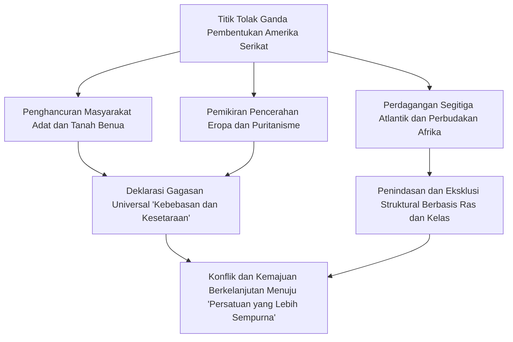
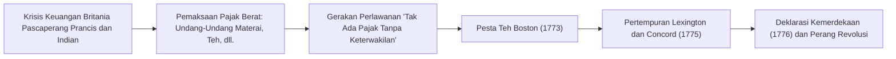
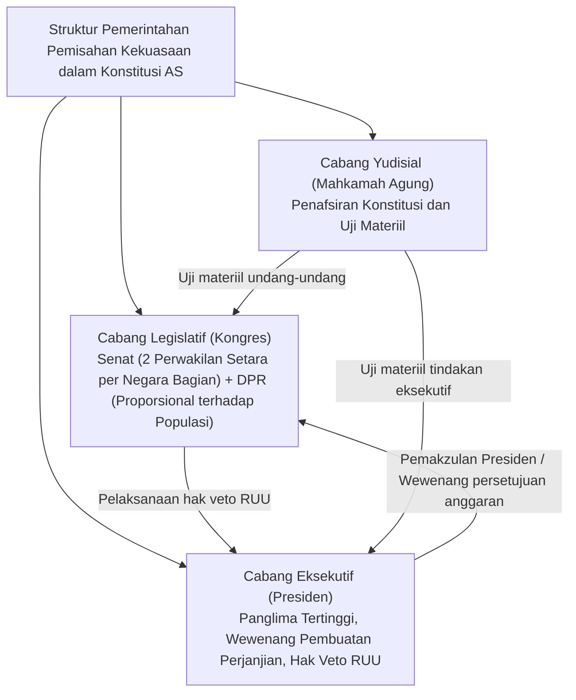
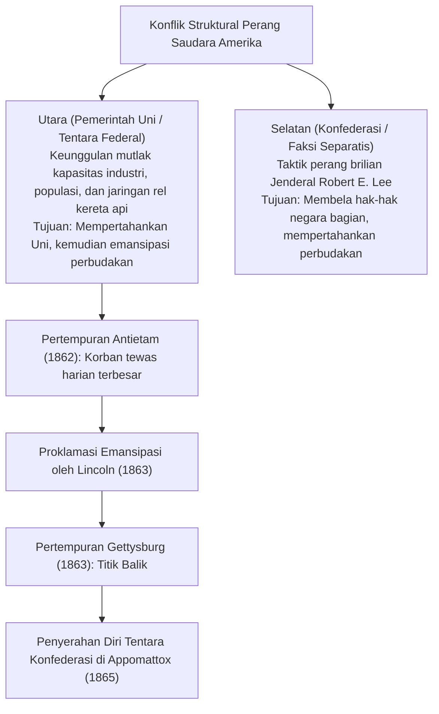
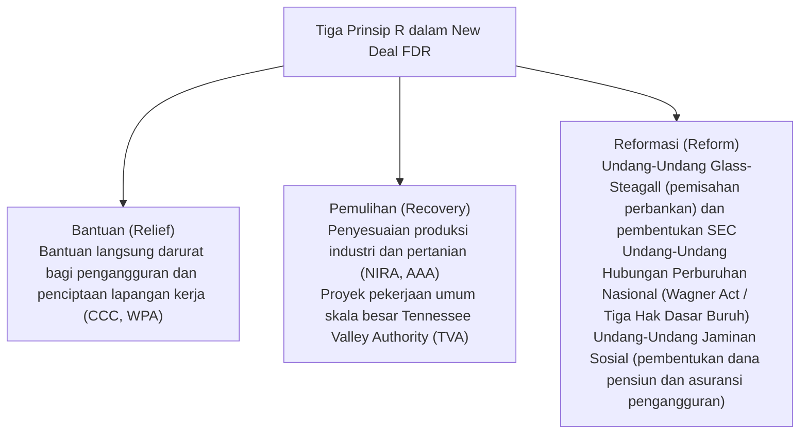
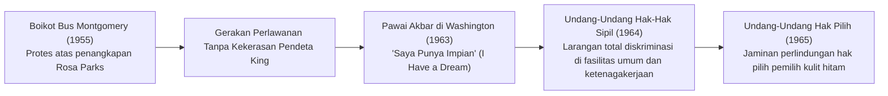
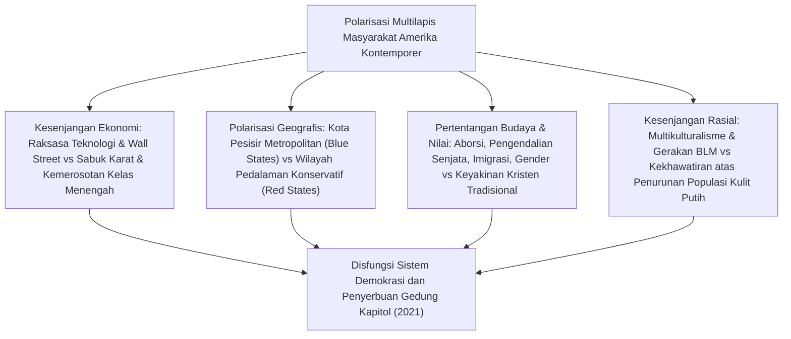
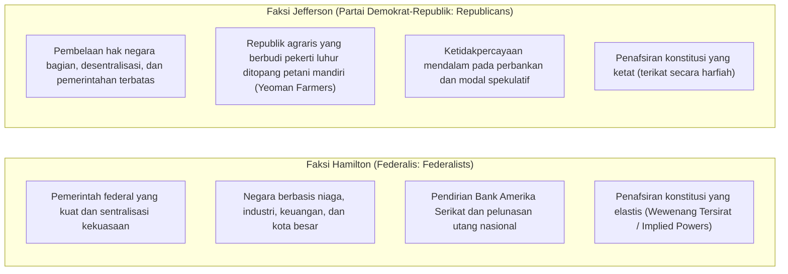

## 1. Pendahuluan: Amerika Serikat sebagai Negara Eksperimental

### 1.1 Ilusi "Benua Baru" dan Realitas Peradaban Penduduk Asli

Dalam mengkaji sejarah Amerika Serikat, narasi mitologis bahwa benua ini adalah "tanah terjanji yang dirintis oleh bangsa kulit putih Eropa demi mencari kebebasan di belantara liar" telah lama mendominasi. Namun, kemajuan di bidang antropologi dan historiografi sejak paruh kedua abad ke-20 telah mengungkap fakta tak terbantahkan bahwa ribuan tahun sebelum kedatangan bangsa Eropa, benua ini telah menjadi tempat berkembangnya peradaban penduduk asli (Native Americans) yang maju, unik, dan mandiri.

Mulai dari peradaban pembangun gundukan tanah (Mound Builders) yang dicerminkan oleh reruntuhan kota metropolitan Cahokia di Lembah Mississippi, kompleks pemukiman tebing batu yang rumit dari kebudayaan Anasazi (Pueblo) di wilayah Barat Daya, hingga Konfederasi Iroquois (Haudenosaunee) di Timur Laut tempat lima suku bersatu membentuk sistem konfederasi demokratis yang sangat maju—ekosistem sosial yang beragam dan kaya telah hadir jauh sebelumnya. Sejak kedatangan Columbus pada tahun 1492, penyakit menular yang dibawa dari Eropa seperti cacar, campak, dan influenza (dikenal sebagai "Pertukaran Kolumbus" atau *Columbian Exchange*) serta penaklukan militer yang brutal telah memusnahkan $80\%$ hingga $90\%$ populasi penduduk asli. Kesadaran historis yang jernih bahwa "Dunia Baru" ini dibangun di atas puing-puing kehancuran tersebut merupakan titik tolak fundamental yang tak terelakkan dalam memahami sejarah Amerika kontemporer.

---

### 1.2 Kaum Peziarah (Pilgrim Fathers), Perjanjian Mayflower, dan Teraan Spiritual Puritanisme

Menyusul pendirian koloni Jamestown (Koloni Virginia) pada tahun 1607, fondasi spiritual yang membentuk identitas nasional Amerika diletakkan oleh kelompok Puritan Separatis (dikenal sebagai Kaum Peziarah atau *Pilgrim Fathers*) yang mendarat di Teluk Massachusetts dengan kapal *Mayflower* pada tahun 1620.

Sesaat sebelum mendarat, sebuah kesepakatan ditandatangani di atas geladak kapal, yaitu **"Perjanjian Mayflower (Mayflower Compact)"**. Perjanjian ini merupakan deklarasi pemerintahan mandiri yang amat monumental dalam sejarah umat manusia: alih-alih menerima kekuasaan hierarkis dari atas oleh raja atau penguasa feodal, masyarakat ini bersepakat untuk **"mendirikan suatu komunitas politik yang memerintah dirinya sendiri melalui persetujuan sukarela individu-individu merdeka (kontrak sosial) demi menyusun hukum yang adil dan setara"**.

Gagasan "Sebuah Kota di Atas Bukit" (*A City upon a Hill*) yang dikhotbahkan oleh pemimpin John Winthrop—yaitu rasa terpanggil yang kuat bahwa komunitas kaum Puritan yang mengikat kovenan dengan Tuhan harus menjadi teladan yang bersinar terang bagi seluruh dunia—kelak bermutasi menjadi DNA mendasar dari "Eksepsionalisme Amerika" (*American Exceptionalism*), yakni keyakinan bahwa Amerika Serikat mengemban misi khusus untuk memimpin dunia.

---

## 2. Dari Era Kolonial Menuju Revolusi Kemerdekaan dan Kelahiran Konstitusi AS

### 2.1 Perkembangan 13 Koloni dan Berakhirnya "Pengabaian yang Bermanfaat"

Tiga belas koloni Inggris yang berdiri di sepanjang pesisir Atlantik mengembangkan struktur sosial-ekonomi yang sangat kontras: wilayah New England di utara (perdagangan, perikanan, pertanian skala kecil, dan teologi Puritan); Koloni Tengah (pertanian serealia serta mozaik etnis dan agama yang majemuk); dan Koloni Selatan (perkebunan tembakau, beras, dan nila berskala masif yang bertumpu pada kerja paksa budak Afrika).

Hingga pertengahan abad ke-18, pemerintah Kerajaan Britania menerapkan kebijakan **"Pengabaian yang Bermanfaat (Salutary Neglect)"**, di mana mereka tidak melakukan campur tangan ketat dan secara *de facto* memberikan otonomi kepada koloni-koloni tersebut. Akan tetapi, kendati Britania berhasil memenangkan "Perang Prancis dan Indian (1754–1763)"—front Amerika Utara dari Perang Tujuh Tahun yang memperebutkan hegemoni Eropa—pemerintah Britania terjerat utang perang dalam jumlah yang teramat besar.

Parlemen Britania lantas beralih ke kebijakan pajak berat terhadap pihak koloni dengan dalih memikul beban biaya pertahanan:
- **Undang-Undang Gula (1764)**, **Undang-Undang Materai (1765)**: Menetapkan pajak materai atas surat kabar, pamflet, hingga kartu permainan.
- Pihak koloni menentang keras dan melancarkan aksi boikot terhadap produk-produk Britania dengan mengusung semboyan konstitusional: **"Tak ada pajak tanpa keterwakilan (No taxation without representation)"**.
- Menyusul peristiwa Pembantaian Boston (1770) dan Pesta Teh Boston (1773)—di mana peti-peti teh milik Perusahaan Hindia Timur Britania dibuang ke laut—pemerintah Britania merespons dengan represi militer tangan besi (Undang-Undang yang Tak Tertahankan / *Intolerable Acts*), sehingga bentrokan bersenjata memasuki tahap yang tak terelakkan.

---

### 2.2 'Common Sense' Karya Thomas Paine dan Deklarasi Kemerdekaan (1776)

Pada bulan April 1775, letusan senjata dalam Pertempuran Lexington dan Concord berkumandang, menandai meletusnya Perang Kemerdekaan Amerika. Pada masa itu, sebagian besar penduduk koloni masih terombang-ambing di antara kesetiaan kepada Raja Britania dan tuntutan kemerdekaan.

Kebimbangan tersebut diruntuhkan seketika oleh risalah yang diterbitkan secara anonim oleh Thomas Paine pada Januari 1776 berjudul **'Common Sense' (Akal Sehat)**. Melalui untaian kalimat yang lugas dan berapi-api, Paine mendemonstrasikan bahwa "adalah suatu absurditas jika sebuah pulau kecil seperti Britania harus menguasai sebuah benua besar untuk selamanya" serta membuktikan bahwa "monarki herediter pada hakikatnya merupakan institusi jahat yang menodai hak-hak kodrati manusia". Pamflet ini terjual ratusan ribu eksemplar dan menyulut gelombang antusiasme kemerdekaan di seluruh penjuru Amerika.

Hingga akhirnya, pada 4 Juli 1776, Kongres Kontinental Kedua mengesahkan **"Deklarasi Kemerdekaan Amerika Serikat (Declaration of Independence)"** yang dirancang oleh Thomas Jefferson.

> "Kami menganggap kebenaran-kebenaran ini sebagai hal yang terbukti dengan sendirinya: bahwa semua manusia diciptakan setara, bahwa mereka dianugerahi oleh Pencipta mereka hak-hak tertentu yang tidak dapat dicabut, di antaranya adalah Hak Hidup, Kemerdekaan, dan Upaya Mengejar Kebahagiaan. Dan bahwa untuk menjamin hak-hak ini, pemerintah dibentuk di antara manusia, dengan memperoleh kekuasaannya yang sah dari persetujuan pihak yang diperintah."

Dengan memadukan teori kontrak sosial John Locke dan filsafat hak kodrati manusia, deklarasi luhur ini melegitimasikan hak rakyat untuk melawan tirani (hak revolusi) dan menjadi tonggak monumental bagi kebebasan universal dalam sejarah manusia.

Tentara Kontinental di bawah pimpinan Panglima Tertinggi George Washington melancarkan strategi perang atrisi sembari bertahan dari krisis logistik dan musim dingin yang membekukan. Kemenangan dalam Pertempuran Saratoga (1777) menjadi titik balik yang mengamankan aliansi militer dengan Prancis, Spanyol, dan Belanda. Dalam Pertempuran Yorktown tahun 1781, pasukan sekutu mengepung dan memaksa pasukan utama Britania menyerah, hingga melalui Traktat Paris tahun 1783, Britania Raya secara resmi mengakui kemerdekaan penuh Amerika Serikat.

---

### 2.3 Runtuhnya Pasal-Pasal Konfederasi dan Konvensi Konstitusi Philadelphia (1787)

Pada mulanya, negara baru yang meraih kemerdekaan ini hanyalah sebuah konfederasi yang amat longgar di antara 13 negara bagian yang berdaulat, berlandaskan "Pasal-Pasal Konfederasi (Articles of Confederation)" yang mulai berlaku pada tahun 1781.
- Pemerintah pusat (Kongres Konfederasi) tidak memiliki wewenang memungut pajak, tidak memiliki tentara reguler, serta tidak memiliki kekuasaan untuk mengatur perdagangan luar negeri.
- Ketika menghadapi "Pemberontakan Shays (1786)"—pemberontakan bersenjata para petani yang didera resesi pascaperang dan jeratan pajak tinggi—pemerintah konfederasi bahkan tidak berdaya mengirimkan pasukan, sehingga ancaman disintegrasi negara menjadi kenyataan di depan mata.

Pada musim panas tahun 1787, sebanyak 55 delegasi (termasuk para "Bapak Bangsa" seperti James Madison, Alexander Hamilton, dan Benjamin Franklin) berkumpul di Independence Hall di Philadelphia untuk merumuskan apa yang menjadi **"Konstitusi Amerika Serikat"** saat ini.

- **Kompromi Besar (Kompromi Connecticut)**: Memadukan usulan negara bagian kecil yang menghendaki keterwakilan setara (Rencana New Jersey) dengan usulan negara bagian besar yang menginginkan keterwakilan proporsional terhadap populasi (Rencana Virginia), membentuk sistem bikameral yang terdiri atas "Senat" (setara 2 senator untuk setiap negara bagian) dan "DPR" (proporsional berdasarkan jumlah penduduk).
- **Perhitungan Populasi Budak (Kompromi Tiga per Lima)**: Demi meredam dominasi politik negara-negara bagian Selatan sekaligus mencapai konsensus, disepakati kompromi historis di mana satu orang budak dihitung setara dengan "tiga per lima" orang merdeka dalam alokasi kursi DPR dan perhitungan pajak langsung.
- **Pengawasan dan Keseimbangan (Checks and Balances)**: Berpijak pada pemikiran Montesquieu, kekuasaan dipisahkan di antara Presiden, Kongres, dan Mahkamah Agung, membentuk benteng kelembagaan yang rumit agar tiada satu pun individu atau institusi yang mampu memonopoli kekuasaan tirani.

---

## 3. Ekspansi Teritorial, Manifest Destiny, dan Badai Perang Saudara

### 3.1 "Takdir Nyata" (Manifest Destiny) dan Perluasan Wilayah Melintasi Benua

Pada paruh pertama abad ke-19, Amerika Serikat memperluas wilayah kekuasaannya ke arah barat dengan kecepatan yang mencengangkan:
- **1803: Pembelian Louisiana (Louisiana Purchase)**: Presiden Thomas Jefferson membeli wilayah Louisiana yang sangat luas di sebelah barat Sungai Mississippi dari Napoleon Bonaparte (Prancis) seharga hanya 15 juta dolar, yang seketika melipatgandakan luas wilayah daratan negara tersebut.
- **1823: Doktrin Monroe**: Presiden James Monroe mendeklarasikan prinsip isolasionisme dan non-intervensi timbal balik, menegaskan bahwa "kekuatan-kekuatan Eropa dilarang mencampuri urusan benua Amerika, dan sebaliknya Amerika Serikat tidak akan ikut campur dalam pertikaian antarbangsa di Eropa."
- **Takdir Nyata (Manifest Destiny)**: Sebuah ideologi ekspansionis yang merasuki kesadaran kolektif bangsa Amerika, berkeyakinan bahwa "adalah takdir suci yang diperintahkan langsung oleh Tuhan bagi Amerika Serikat untuk menguasai dan membangun benua Amerika Utara hingga ke pesisir Samudra Pasifik, seraya menyebarluaskan panji kebebasan dan demokrasi."

Di balik ekspansi megah ini terbentang tragedi kemanusiaan yang teramat kelam: ruang hidup penduduk asli dilibas tanpa ampun. Melalui "Undang-Undang Pemindahan Penduduk Asli (Indian Removal Act, 1830)" yang diprakarsai oleh Presiden Andrew Jackson, Bangsa Cherokee dan empat suku utama lainnya diusir secara paksa dari tanah leluhur mereka di hutan-hutan timur dan digiring berjalan kaki ribuan kilometer melintasi badai salju menuju Teritori Indian di Oklahoma. Ribuan jiwa binasa akibat kelaparan, keletihan, dan wabah penyakit di sepanjang lintasan maut yang terpatri abadi dalam sejarah sebagai **"Jejak Air Mata (Trail of Tears)"**.

Kemenangan dalam Perang Meksiko-Amerika (1846–1848) menyerahkan California, Texas, dan New Mexico ke pangkuan AS, disusul gelombang demam emas California (Gold Rush 1848), mengukuhkan transformasi Amerika Serikat menjadi negara benua raksasa yang membentang dari Samudra Atlantik hingga Samudra Pasifik.

---

### 3.2 Krisis Perbudakan dan Eskalasi Perpecahan Bangsa

Namun, setiap kali perbatasan wilayah bergeser makin jauh ke barat, sebuah pertanyaan destruktif terus mengguncang sendi-sendi Uni: **"Apakah teritori-teritori baru yang dianeksasi akan diizinkan menerapkan sistem perbudakan, ataukah perbudakan dilarang di sana?"**

- **Perekonomian Utara**: Mengalami industrialisasi pesat, digerakkan oleh tenaga kerja bebas di sektor manufaktur, niaga, dan perbankan. Mendukung kebijakan proteksionisme tarif demi melindungi pasar domestik.
- **Perekonomian Selatan**: Berpijak pada perkebunan kapas raksasa yang diperbudak secara cuma-cuma oleh hampir 4 juta warga kulit hitam Afrika dalam kerajaan kapas (*King Cotton*). Menganut perdagangan bebas demi mengekspor komoditas pertanian ke Britania Raya dan pasar dunia.

Demi mempertahankan perimbangan rapuh antara "negara bagian bebas" dan "negara bagian budak" di Kongres, berbagai kebijakan tambal sulam diupayakan, seperti Kompromi Missouri 1820 (melarang perbudakan di teritori utara garis lintang $36^\circ 30'$) dan Kompromi 1850 (yang memperketat Undang-Undang Budak Buron).

Akan tetapi, disahkannya Undang-Undang Kansas-Nebraska pada tahun 1854—yang menyerahkan legalitas perbudakan kepada referendum warga teritori setempat di bawah doktrin kedaulatan rakyat (*popular sovereignty*)—memicu perang saudara mini yang brutal, dikenal sebagai "Kansas Berdarah (Bleeding Kansas)". Ketegangan mencapai titik didih ketika Mahkamah Agung menjatuhkan **"Putusan Dred Scott (1857)"**, yang memvonis secara kontroversial bahwa "warga kulit hitam bukanlah warga negara di bawah Konstitusi dan tidak memiliki hak apa pun yang wajib dihormati," serta menetapkan bahwa "Kongres tidak memiliki kewenangan konstitusional untuk melarang perbudakan di wilayah teritori federal." Putusan ini menyulut kemurkaan luar biasa dari opini publik anti-perbudakan di Utara.

---

### 3.3 Perang Saudara Amerika (1861–1865): Penyatuan Berdarah dan Emansipasi Perbudakan

Ketika Abraham Lincoln dari Partai Republik memenangkan Pemilihan Presiden tahun 1860 dengan komitmen tegas untuk "menghentikan ekspansi perbudakan ke wilayah-wilayah baru di barat," tujuh negara bagian Selatan yang dipelopori Carolina Selatan menyatakan memisahkan diri (*secession*) dari Uni dan mendirikan "Konfederasi Negara-Negara Bagian Amerika (Confederate States of America / CSA)".

Pada bulan April 1861, gempuran meriam pasukan Konfederasi terhadap Benteng Sumter secara resmi meletuskan **"Perang Saudara Amerika (American Civil War)"**.

Lincoln secara bertahap mengangkat dimensi moral pertempuran ini: dari sekadar "penumpasan pemberontakan demi mempertahankan kesatuan wilayah Uni" menjadi "perang suci demi emansipasi dan kebebasan sejati umat manusia."
- **1 Januari 1863: Proklamasi Emansipasi (Emancipation Proclamation)**: Menyatakan pembebasan segera bagi seluruh budak di wilayah-wilayah yang memberontak. Deklarasi ini membuka jalan bagi masuknya sekitar 180.000 prajurit kulit hitam ke dalam jajaran Angkatan Bersenjata Uni, sekaligus mengunci langkah diplomatik Britania dan Prancis agar tidak memberikan pengakuan maupun bantuan militer kepada pihak Selatan karena alasan moral.
- **November 1863: Pidato Gettysburg**: Lincoln menegaskan tekad suci agar **"pemerintahan dari rakyat, oleh rakyat, untuk rakyat (government of the people, by the people, for the people)"** tidak akan pernah lenyap dari muka bumi.

Melalui perang total (*total war*) dan taktik bumi hangus (Pawai ke Laut oleh Jenderal Sherman), Jenderal Robert E. Lee dari kubu Konfederasi akhirnya menyerah kepada Jenderal Ulysses S. Grant dari kubu Uni di Appomattox Court House, Virginia, pada April 1865. Setelah menelan lebih dari 600.000 korban jiwa—tragedi paling berdarah dalam sejarah Amerika—Amandemen Konstitusi Ke-13 (penghapusan perbudakan), Ke-14 (proses hukum yang adil dan perlindungan hukum yang setara), serta Ke-15 (hak pilih tanpa memandang ras) diratifikasi. Amerika Serikat terlahir kembali: bukan lagi sekadar federasi longgar, melainkan sebuah negara-bangsa yang tunggal dan tak terpisahkan.

Kendati demikian, begitu Era Rekonstruksi (*Reconstruction Era*) berakhir, negara-negara bagian Selatan segera mengundangkan serangkaian "Hukum Jim Crow" (undang-undang segregasi rasial), menjerumuskan warga kulit hitam ke dalam era kegelapan diskriminasi yang dilembagakan serta ancaman aksi main hakim sendiri (*lynching*) oleh Ku Klux Klan (KKK).

---

## 4. Era Berlapis Emas, Revolusi Industri, dan Fajar Imperialisme

### 4.1 Kebangkitan Kapital Raksasa dan "Era Berlapis Emas"

Dari akhir Perang Saudara hingga awal abad ke-20, perekonomian Amerika Serikat meledak dengan kedahsyatan yang belum pernah terjadi sebelumnya dalam sejarah dunia. Sastrawan Mark Twain menjuluki era ini sebagai **"Era Berlapis Emas (Gilded Age)"**—suatu periode yang permukaannya berkilau keemasan laksana logam mulia, namun di dalamnya sarat akan kebusukan, keserakahan, dan korupsi sistemik.

- Rampungnya jalur Kereta Api Transkontinental pada tahun 1869 menyatukan seluruh daratan Amerika menjadi satu pasar tunggal raksasa.
- **Monopoli Para Baron Perampok (Robber Barons)**:
  - John D. Rockefeller melalui Standard Oil (menguasai hingga $90\%$ kapasitas penyulingan minyak di AS).
  - Andrew Carnegie dengan imperium bajanya (Carnegie Steel).
  - J.P. Morgan memusatkan kapital keuangan dan membentuk trust-trust raksasa (termasuk pendirian US Steel).
- Penemuan jaringan tenaga listrik oleh Thomas Edison, telepon oleh Alexander Graham Bell, serta lini perakitan massal oleh Henry Ford (Fordisme) mendongkrak output manufaktur Amerika Serikat melampaui Britania Raya dan Kekaisaran Jerman, menobatkannya sebagai raksasa industri nomor satu di dunia.

Di sisi lain, ketimpangan kekayaan yang teramat timpang serta kondisi kerja yang eksploitatif dan mengenaskan memicu konflik perburuhan berdarah, seperti Mogok Kerja Homestead dan Mogok Kerja Pullman. Pada saat yang sama, puluhan juta imigran gelombang baru dari Eropa Selatan dan Timur (warga Italia, Irlandia, dan Yahudi Eropa Timur) membanjiri kawasan kumuh (*slum*) kota-kota industri.

---

### 4.2 Lenyapnya Garis Depan (Frontier) dan Perebutan Wilayah Seberang Lautan

Dalam sensus nasional tahun 1890, sejarawan Frederick Jackson Turner mengumumkan tesisnya mengenai "Lenyapnya Garis Perbatasan (*Closing of the Frontier*)". Ketika ruang batas liar di Barat—yang selama ini membentuk watak demokratis, mobilitas, dan vitalitas bangsa Amerika—telah habis dijelajahi, tatapan Amerika Serikat secara tak terelakkan beralih melintasi Samudra Pasifik dan Amerika Latin demi mencari pasar luar negeri (dipicu pula oleh teori kekuatan maritim karya Alfred Thayer Mahan).

- **1898: Perang Spanyol-Amerika**: Meletus akibat insiden tenggelamnya kapal perang *USS Maine* di Pelabuhan Havana, perang ini berakhir dengan kemenangan mutlak AS hanya dalam tempo beberapa bulan. Melalui traktat damai, AS merebut Filipina, Guam, dan Puerto Riko, seraya menganeksasi Hawaii, seketika melompat menjadi imperium maritim di Pasifik.
- **Kebijakan Pintu Terbuka (Open Door Policy, 1899)**: Menteri Luar Negeri John Hay menuntut jaminan "pintu terbuka, peluang setara, dan integritas teritorial" dalam pembagian zona pengaruh di Tiongkok oleh kekuatan-kekuatan kolonial imperialis Eropa dan Jepang.

Di kancah domestik, demi mengekang kesewenang-wenangan modal monopoli dan membasmi korupsi politik, bergulir gerakan **"Progresivisme (Progressivism)"** di bawah kepemimpinan Presiden Theodore Roosevelt (pembongkaran trust kartel, perlindungan sumber daya alam) dan Presiden Woodrow Wilson. Gerakan ini membuahkan penegakan Undang-Undang Anti-Trust Sherman, pendirian Sistem Bank Sentral (Federal Reserve System / Fed), serta pengesahan hak pilih bagi kaum perempuan (Amandemen Konstitusi Ke-19).

---

## 5. Dua Perang Dunia, Depresi Besar, dan Pengukuhan Pax Americana

### 5.1 Perang Dunia Pertama dan "Dekade Dua Puluhan yang Menggelegar"

Ketika Perang Dunia Pertama meletus pada tahun 1914, Amerika Serikat mula-mula mempertahankan netralitas seraya mengekspor senjata, amunisi, dan bahan pangan dalam jumlah kolosal ke negara-negara Sekutu, mentransformasikan dirinya dari negara debitur menjadi negara kreditur terbesar di planet ini. Namun, menyusul kampanye perang kapal selam tanpa batas oleh Jerman dan terkuaknya telegram diplomatik Zimmermann, AS akhirnya menyatakan perang pada tahun 1917.

Presiden Woodrow Wilson memproklamasikan **"Empat Belas Pasal Pedoman Perdamaian (Fourteen Points)"**, mendengungkan prinsip transparansi diplomasi, hak penentuan nasib sendiri bagi setiap bangsa (*self-determination*), dan pembentukan Liga Bangsa-Bangsa (LBB). Akan tetapi, terdorong oleh tradisi isolasionisme yang mengakar kuat, Senat AS menolak meratifikasi Traktat Versailles, sehingga Amerika Serikat justru tidak bergabung dalam Liga Bangsa-Bangsa yang dirancangnya sendiri.

Memasuki dekade 1920-an, Amerika Serikat memasuki zaman keemasan masyarakat konsumsi massal yang belum pernah disaksikan sebelumnya, yang termasyhur sebagai **"Roaring Twenties (Dekade Dua Puluhan yang Menggelegar)"**.
- Radio komersial, mobil Ford Model T, industri perfilman Hollywood, musik jazz, dan berbagai perabot rumah tangga listrik merambah kehidupan keluarga kelas menengah.
- Pasar modal Wall Street tersapu euforia spekulasi saham massal, di mana publik meyakini bahwa "kemakmuran abadi" telah tiba.
- Kendati demikian, periode ini juga menyimpan sisi gelap: penerapan Larangan Minuman Keras (Amandemen Ke-18) menyuburkan kejahatan terorganisir dan mafia sindikat (seperti Al Capone), sementara nativisme serta xenofobia rasial dan religius kembali bangkit (kebangkitan gelombang kedua KKK dan pengesahan sistem kuota imigrasi yang diskriminatif).

---

### 5.2 Depresi Besar dan Kebijakan New Deal

Pada 24 Oktober 1929—dikenal sebagai "Kamis Hitam (Black Thursday)"—kejatuhan dramatis harga saham di Bursa Efek New York meniupkan badai dahsyat Depresi Besar (Great Depression) yang meluluhlantakkan perekonomian global.
Ribuan bank di seluruh negeri bangkrut, tingkat pengangguran melonjak hingga $25\%$ (satu dari setiap empat pekerja kehilangan mata pencaharian), dan bencana badai debu raksasa (*Dust Bowl*) melanda kawasan Great Plains, memaksa jutaan petani meninggalkan tanah mereka yang tandus. Pendekatan ekonomi *laissez-faire* yang dipertahankan oleh Presiden Herbert Hoover gagal total mengatasi petaka ini.

Dilantik pada tahun 1933, Presiden Franklin D. Roosevelt (FDR) meluncurkan serangkaian kebijakan intervensi radikal yang terangkum dalam program **"New Deal (Kesepakatan Baru)"**.

Dengan mendahului teori ekonomi John Maynard Keynes, New Deal merepresentasikan transformasi di mana negara secara aktif turun tangan mengelola ekonomi pasar dan membangun fondasi negara kesejahteraan (*welfare state*). Kebijakan ini memperluas wewenang kekuasaan kepresidenan secara revolusioner dan menjadi kiblat utama bagi paham liberalisme Amerika modern.

---

### 5.3 Perang Dunia Kedua dan Merengkuh Hegemoni Global

Pada 7 Desember 1941, serangan mendadak armada tempur Kekaisaran Jepang terhadap pangkalan Armada Pasifik AS di Pearl Harbor menyeret Amerika Serikat ke kancah Perang Dunia Kedua secara penuh.

Amerika Serikat menobatkan dirinya sebagai **"Gudang Senjata Demokrasi (Arsenal of Democracy)"**, memobilisasi seluruh kapasitas manufaktur sipil menjadi mesin produksi perang berskala luar biasa. Pabrik-pabrik perakitan mobil beralih haluan memproduksi tank tempur dan pesawat pengebom secara massal, sementara jutaan perempuan memasuki angkatan kerja pabrik (disimbolkan oleh figur ikonik *Rosie the Riveter*).

- Di front Eropa: Keberhasilan Pendaratan Normandia (D-Day, 1944) dan penghancuran total rezim Nazi Jerman.
- Di front Pasifik: Strategi lompat pulau (*island hopping*) yang berujung pada kapitulasi tanpa syarat Kekaisaran Jepang.
- Pengembangan bom atom melalui proyek sains-militer paling rahasia, "Proyek Manhattan (Manhattan Project)", yang berujung pada penjatuhan bom nuklir di Hiroshima dan Nagasaki.

Saat perang berakhir pada tahun 1945, Amerika Serikat memproduksi separuh dari total output industri dunia, menguasai sekitar $70\%$ cadangan emas moneter global, serta berdiri tegak sebagai satu-satunya kekuatan pemilik senjata nuklir.
Melalui Konferensi Bretton Woods tahun 1944, dibangunlah tatanan moneter internasional yang menempatkan **dolar AS sebagai mata uang jangkar dunia yang terikat pada emas (didukung oleh IMF dan Bank Dunia)**, disusul perumusan Piagam PBB di San Francisco pada tahun 1945. Fajar era **"Pax Americana (Kedamaian ala Amerika)"** secara resmi merekah, mengukuhkan hegemoni global Amerika Serikat tanpa tandingan.

---

## 6. Arsitektur Perang Dingin, Gerakan Hak-Hak Sipil, Kejayaan dan Kepedihan Amerika

### 6.1 Perang Dingin Timur-Barat dan Bayang-Bayang Deteren Nuklir

Dari puing-puing abu Perang Dunia Kedua, muncullah konfrontasi geopolitik bipolar antara kubu dunia bebas yang dipimpin Amerika Serikat berhadapan dengan kubu blok sosialis di bawah pimpinan Uni Soviet, yang dikenal sebagai "Perang Dingin (Cold War)".

- **1947: Doktrin Truman**: Meletakkan "Kebijakan Pembendungan (Containment Policy)" demi membendung perluasan pengaruh komunisme di seluruh penjuru dunia.
- **Rencana Marshall (Marshall Plan)**: Paket bantuan rekonstruksi ekonomi masif guna membangun kembali negara-negara Eropa Barat yang hancur sekaligus mencegah revolusi komunis.
- **1949: Pembentukan Pakta Pertahanan Atlantik Utara (NATO)**: Membangun sistem pertahanan keamanan kolektif bersama sekutu Barat.
- Berkobarnya Perang Korea (1950–1953) serta histeria represi antikomunis di dalam negeri yang dikenal sebagai perburuan kaum merah atau "McCarthyisme (McCarthyism)".

Puncak ketegangan terjadi pada **Krisis Rudal Kuba (Cuban Missile Crisis, 1962)** ketika Uni Soviet secara rahasia menempatkan rudal nuklir balistik di Kuba. Konfrontasi menegangkan antara Presiden John F. Kennedy dan Perdana Menteri Nikita Khrushchev membawa peradaban manusia ke titik paling dekat dengan pemusnahan total melalui perang termonuklir global. Semenjak itu, dunia hidup di bawah bayang-bayang doktrin perdamaian semu yang rapuh berlandaskan "Pemusnahan Terpasti Bersama (Mutual Assured Destruction / MAD)".

---

### 6.2 Gerakan Hak-Hak Sipil: Perjuangan Menuntut Kesetaraan Sejati

Pascaperang, tatkala jutaan keluarga kelas menengah kulit putih menikmati kemakmuran hidup di perumahan suburban yang nyaman dengan kepemilikan mobil pribadi, televisi berwarna, dan lemari es mutakhir, jutaan warga kulit hitam Amerika—terutama di wilayah Selatan—masih terbelenggu dalam sistem penindasan, segregasi, dan teror rasial yang biadab.

Pada tahun 1954, Mahkamah Agung AS menerbitkan putusan penting dalam kasus **"Brown v. Board of Education"**, yang menyatakan bahwa pemisahan rasial di sekolah-sekolah umum pada hakikatnya "secara inheren tidak setara (*inherently unequal*)" dan karenanya melanggar konstitusi. Putusan ini menyalakan sumbu Gerakan Hak-Hak Sipil (Civil Rights Movement) di seantero negeri.

Menghadapi aksi perlawanan langsung tanpa kekerasan yang dipimpin oleh Pendeta Martin Luther King Jr. (seperti aksi duduk / *sit-ins*, *Freedom Rides*, dan pawai damai), aparat kepolisian kulit putih membalas dengan anjing pelacak ganas dan semprotan meriam air bertekanan tinggi. Rekaman visual dari kekejaman ini disiarkan langsung ke televisi di seluruh Amerika, menggugah nurani dan opini publik secara tak terbendung. Di bawah kepemimpinan Presiden Lyndon B. Johnson, disahkanlah **Undang-Undang Hak-Hak Sipil 1964 (Civil Rights Act of 1964)** yang melarang diskriminasi di tempat umum dan tempat kerja, disusul oleh **Undang-Undang Hak Pilih 1965 (Voting Rights Act of 1965)**, meruntuhkan pilar-pilar legal segregasi rasial yang telah bercokol selama hampir satu abad.

---

### 6.3 Jebakan Rawa Perang Vietnam dan Ledakan Counterculture

Namun, terperangkap oleh "Teori Domino" (keyakinan bahwa jatuhnya satu negara ke tangan komunis akan meruntuhkan negara-negara tetangganya di Asia Tenggara), Amerika Serikat tergelincir ke dalam keterlibatan militer skala penuh yang berdarah di Perang Vietnam (1965–1973).
Perang gerilya di rimba lebat yang tak berkesudahan, penggunaan zat kimia defolian (Agen Oranye), Pembantaian My Lai, serta tewasnya puluhan ribu pemuda wajib militer Amerika meremukkan kepercayaan rakyat terhadap pemerintah mereka sendiri.

Di kampus-kampus universitas, gerakan anti-perang meletus dalam skala kolosal, berpadu dengan gerakan kaum hippie, musik rock (Festival Woodstock), gerakan pembebasan perempuan (*Women's Liberation*), dan gerakan kesadaran lingkungan, melahirkan pusaran **"Counterculture (Budaya Tandingan)"**. Pada tahun 1974, menyusul skandal spionase politik dan upaya penutupan kasus dalam "Skandal Watergate", Richard Nixon mencatatkan diri sebagai presiden pertama dalam sejarah AS yang mengundurkan diri dari jabatannya demi menghindari pemakzulan. Amerika Serikat tersuruk ke dalam krisis moral dan malaise nasional yang parah, diperparah oleh fenomena stagflasi ekonomi dan kelesuan era pemerintahan Jimmy Carter.

---

## 7. Dari Reaganomics, Pasca-Perang Dingin, Tragedi 9/11 hingga Jurang Polarisasi Kontemporer

### 7.1 Revolusi Reagan dan Berakhirnya Perang Dingin

Pada tahun 1980, Ronald Reagan meraih kemenangan telak dalam pemilihan presiden dengan membawa panji kebangkitan optimisme nasional: "Membuat Amerika Berjaya Kembali (Make America Great Again)".

- **Reaganomics**: Berpijak pada mazhab ekonomi sisi penawaran (*supply-side economics*), pemerintahannya memberlakukan pemotongan pajak penghasilan secara masif, deregulasi perbankan dan industri, pemangkasan anggaran kesejahteraan sosial, serta pengetatan suplai uang moneter. Kebijakan ini memelopori arus global "pemerintahan ramping" dan neoliberalisme ke panggung internasional.
- **Konfrontasi Melawan "Kekaisaran Iblis" (Evil Empire)**: Memompa anggaran pertahanan dalam jumlah raksasa demi meluncurkan Prakarsa Pertahanan Strategis (Strategic Defense Initiative / SDI, populer disebut Proyek Star Wars). Perlombaan senjata berteknologi tinggi ini memaksa Uni Soviet menguras habis kapasitas ekonomi komandonya yang kian renta.
- Runtuhnya Tembok Berlin pada tahun 1989 dan bubarnya Uni Soviet pada Desember 1991 menandai berakhirnya Perang Dingin selama hampir setengah abad dengan kemenangan mutlak Amerika Serikat. Sejarawan Francis Fukuyama merayakan momen ini sebagai "Akhir Sejarah" (*The End of History*)—yakni kemenangan final dan universal bagi demokrasi liberal dan kapitalisme pasar.

---

#---

## 7.1.5 Perang Teluk (1991) dan Revolusi Militer Doktrin Powell

Tak lama setelah Perang Dingin usai, pada Agustus 1990, Presiden Irak Saddam Hussein melancarkan invasi kilat dan mencaplok negara tetangganya, Kuwait. Presiden George H.W. Bush mengamankan mandat resolusi Dewan Keamanan PBB dan menghimpun pasukan koalisi multinasional dari 34 negara untuk melancarkan "Operasi Badai Gurun (Perang Teluk)" pada Januari 1991.

### Doktrin Militer yang Menyingkirkan Mimpi Buruk Vietnam
Berangkat dari trauma mendalam atas kegagalan Perang Vietnam yang berlarut-larut, Ketua Kepala Staf Gabungan Jenderal Colin Powell merumuskan pedoman strategis yang dikenal sebagai **"Doktrin Powell (Powell Doctrine)"**:
1. Adanya ancaman yang nyata dan vital terhadap kepentingan keamanan nasional.
2. Pengerahan kekuatan militer hanya dilakukan sebagai "upaya pamungkas (last resort)" setelah seluruh jalur diplomatik dan ekonomi buntu.
3. Adanya tujuan militer dan politik yang jelas, terukur, dan realistis untuk dicapai.
4. Mengerahkan **"Kekuatan Militer yang Menghancurkan dan Tanpa Tanding (Overwhelming Force)"** sejak saat pertama guna meremukkan musuh dalam tempo sesingkat-singkatnya tanpa memberi ruang untuk membalas.
5. Memiliki kriteria penarikan pasukan dan strategi keluar (*exit strategy*) yang telah dirumuskan secara gamblang sejak awal.

Melalui liputan siaran langsung televisi (CNN) yang ditonton di seluruh dunia, militer AS mendemonstrasikan keunggulan absolut persenjataan berteknologi tinggi: pesawat tempur siluman F-117 Nighthawk, amunisi berpemandu presisi GPS (bom pintar), rudal jelajah Tomahawk, serta sistem penangkis rudal Patriot. Pasukan koalisi berhasil menghancurkan angkatan perang Irak hanya dalam tempo 100 jam pertempuran darat.

Presiden Bush dengan bangga memproklamirkan bahwa "hantu Vietnam telah terkubur di bawah pasir gurun," memicu gelombang kepercayaan diri bahwa Amerika Serikat selaku "satu-satunya adidaya" kini berhak memimpin "Tatanan Dunia Baru (New World Order)". Namun secara ironis, memori manis kemenangan kilat ini justru melahirkan rasa jumawa (*hubris*) di masa depan, yang membuat para pemimpin Washington mengabaikan kehati-hatian Doktrin Powell saat menginvasi Irak pada tahun 2003, menyeret negara tersebut ke dalam pendudukan militer yang berujung pada bencana berkepanjangan.

## 7.2 Cahaya dan Bayang-Bayang Globalisasi, serta Revolusi Teknologi Informasi

Di bawah kepemimpinan Presiden Bill Clinton pada dekade 1990-an, pemotongan belanja militer pasca-Perang Dingin ("dividen perdamaian") berpadu mesra dengan ledakan revolusi internet dan teknologi informasi yang berpusat di Silicon Valley, melahirkan periode ekspansi ekonomi terpanjang dalam sejarah AS yang dikenal sebagai "Ekonomi Baru (New Economy)".

Pemerintah AS memimpin ratifikasi Perjanjian Perdagangan Bebas Amerika Utara (NAFTA) serta mendorong aksesi Tiongkok ke dalam Organisasi Perdagangan Dunia (WTO), mengakselerasi globalisasi ekonomi dunia dengan kecepatan eksponensial. Namun demikian, kemenangan globalisasi dan kapitalisme finansial ini meninggalkan luka struktural yang menganga di dalam negeri:
- Fasilitas manufaktur direlokasi secara massal ke Tiongkok dan Meksiko demi menekan biaya upah buruh, merontokkan fondasi ekonomi kelas pekerja kerah putih dan buruh pabrik di kawasan Midwest yang kini dijuluki "Sabuk Karat (Rust Belt)".
- Jurang pemisah yang lebar—baik secara ekonomi, kultural, maupun sosial—terbuka menganga antara kaum elit teknologi-keuangan di pesisir barat dan timur dengan masyarakat kelas pekerja di pedalaman yang merasa ditinggalkan dan diabaikan.

---

### 7.3 Serangan Teroris 11 September dan Buntunya "Perang Melawan Teror"

Pada 11 September 2001, teroris Al-Qaeda membajak empat pesawat komersial dan menabrakkan menara kembar World Trade Center di New York serta markas Departemen Pertahanan (Pentagon) di Virginia. Tragedi berdarah 9/11 ini merupakan serangan langsung pertama terhadap daratan utama Amerika sejak Perang 1812, memicu gelombang patriotisme yang luar biasa di kalangan warga. Menanggapi tragedi ini, Presiden George W. Bush mengumumkan "Perang Global Melawan Terorisme".

- Invasi militer ke Afghanistan demi menumbangkan rezim Taliban yang melindungi Osama bin Laden.
- 2003: Invasi ke Irak dengan dalih bahwa rezim Saddam Hussein memiliki senjata pemusnah massal (WMD).
- Namun, senjata pemusnah massal yang dituduhkan tidak pernah ditemukan. Kawasan Timur Tengah terjerumus ke dalam perang sektarian yang berkepanjangan dan menjadi lahan subur bagi kemunculan kelompok teroris baru (ISIS), menelan ribuan nyawa prajurit AS dan membakar triliunan dolar kekayaan negara. Otoritas moral dan kepemimpinan internasional Amerika Serikat pun merosot secara drastis.

---

### 7.4 Krisis Lehman Brothers, Era Obama, Fenomena Trump, dan Turbulensi Abad Ke-21

Pada tahun 2008, pecahnya gelembung kredit perumahan berisiko tinggi (*subprime mortgage*) di Wall Street memicu kebangkrutan bank investasi Lehman Brothers, memantik Krisis Keuangan Global terparah sejak Depresi Besar 1929.
Di tengah keguncangan kapitalisme global tersebut, Barack Obama terpilih menjadi presiden berdarah Afrika-Amerika pertama dalam sejarah Amerika Serikat dengan membawa panji harapan: "Change" dan "Yes We Can". Kendati berhasil meloloskan reformasi asuransi kesehatan yang monumental (*Affordable Care Act* / Obamacare), masa pemerintahannya diwarnai oleh kebuntuan politik partisan yang kian akut akibat perlawanan keras gerakan sayap kanan Tea Party.

Hingga pada pemilihan presiden tahun 2016, Donald Trump berhasil memenangkan kursi kepresidenan dengan memanfaatkan gelombang kemurkaan dan keputusasaan para pekerja kulit putih di Rust Belt (*Rust Belt Revolt*) yang muak terhadap kemapanan elit politik Washington dan globalisme.

Peristiwa Penyerbuan Gedung Kapitol (Capitol Riot) pada 6 Januari 2021 menjadi cerminan nyata bahwa Amerika Serikat pada hari ini tengah bergulat dengan keretakan konsensus nasional paling parah sejak Perang Saudara.

---

---

## 2.4 Keretakan Ideologis Para Bapak Bangsa: Perdebatan Hamilton vs. Jefferson

Setelah ratifikasi Konstitusi Amerika Serikat rampung, perdebatan pemikiran paling sengit dan mendasar dalam sejarah politik modern meletus tepat di dalam kabinet Presiden pertama George Washington: pertarungan gagasan antara Menteri Keuangan Alexander Hamilton dan Menteri Luar Negeri Thomas Jefferson mengenai arah masa depan Republik.

### ① Benturan Visi Ekonomi: Imperium Finansial atau Republik Agraris?
- **Visi Hamilton**: Mengangankan Amerika Serikat tumbuh menjadi imperium industri, keuangan, dan militer yang perkasa menyerupai Britania Raya. Ia mengusulkan agar pemerintah federal menanggung seluruh utang perang kemerdekaan yang dipikul oleh masing-masing negara bagian (*Assumption Act*), menerbitkan obligasi nasional, dan mendirikan "Bank Pertama Amerika Serikat (First Bank of the United States)". Hamilton menghendaki negara tersentralisasi yang melindungi manufaktur domestik serta ditopang oleh birokrasi dan tentara profesional yang kuat.
- **Visi Jefferson**: Yakin sepenuhnya bahwa konsentrasi kekuasaan di kota-kota besar dan buruh pabrik yang bergantung pada majikan adalah sarang korupsi moral yang mematikan kebebasan sipil sejati. Baginya, para petani mandiri yang menggarap tanah mereka sendiri (*yeoman farmers*) merupakan sumber kebajikan moral dan kewarganegaraan (*republican virtue*). Oleh karena itu, ia menuntut pemerintahan yang ramping dan minimalis, di mana wewenang pemerintah pusat dibatasi hanya pada urusan pertahanan dan diplomasi luar negeri.

### ② Polarisasi Penafsiran Konstitusi: Doktrin Wewenang Tersirat vs. Penafsiran Harfiah
- Pertikaian mengenai apakah Kongres memiliki wewenang konstitusional untuk mendirikan sebuah bank sentral (Bank AS) menjadi tonggak bersejarah dalam yurisprudensi Amerika.
- **Penafsiran Ketat Jefferson (Strict Construction)**: Pasal I Bagian 8 Konstitusi yang merinci kewenangan Kongres sama sekali tidak mencantumkan wewenang untuk "mendirikan badan hukum perbankan". Menjalankan kekuasaan yang tidak tertulis secara eksplisit dalam teks konstitusi merupakan pelanggaran inkonstitusional yang merampas kedaulatan negara bagian dan hak-hak rakyat (sebagaimana ditegaskan dalam semangat Amandemen Ke-10).
- **Penafsiran Luas Hamilton (Loose Construction)**: Bersandar pada "Klausul yang Diperlukan dan Patut (Necessary and Proper Clause / Elastic Clause)" pada Pasal I Bagian 8 Butir 18 Konstitusi, Hamilton membantah dengan menyatakan bahwa pemerintah federal memiliki hak untuk menggunakan segala sarana tambahan yang pantas guna merealisasikan wewenang yang tercantum (seperti memungut pajak dan mengelola utang). Wewenang penunjang ini sah secara konstitusional sebagai **"Wewenang Tersirat (Implied Powers)"** kendati tidak tertulis secara harfiah. Teori Hamilton ini kemudian disahkan secara yudisial oleh Ketua Mahkamah Agung John Marshall dalam putusan bersejarah *McCulloch v. Maryland* (1819), meletakkan dasar hukum yang kokoh bagi ekspansi kekuasaan pemerintah federal modern hingga hari ini.

---

## 3.6 Titik Balik Militer, Teknologi, dan Derita Era Rekonstruksi Pasca-Perang Saudara

Perang Saudara Amerika kerap diposisikan oleh para sejarawan militer sebagai "Perang Total Modern Pertama (First Modern Total War)". Untuk pertama kalinya, inovasi teknologi Revolusi Industri dikerahkan secara total ke medan tempur, membuat taktik perang kavaleri dan infanteri terbuka era Napoleon menjadi usang dan mematikan seketika.

### ① Revolusi Teknologi Militer
1. **Senapan Berulir dan Peluru Minié (Minié Ball)**:
   - Jika senapan laras licin (*musket*) tradisional hanya memiliki jarak tembak efektif $50 \sim 100$ yard, senapan berulir (*rifled musket*) yang dipadukan dengan peluru timah lunak Minié mampu memperpanjang jarak tembak mematikan hingga $300 \sim 500$ yard.
   - Namun, para komandan perang yang masih terpaku pada doktrin lama tetap memerintahkan pasukan bergerak maju dalam barisan rapat terbuka. Akibatnya, barisan infanteri disapu bersih oleh hujan timah panas bagai mesin pembantai—sebagaimana terlihat dalam peristiwa Serangan Pickett di Pertempuran Gettysburg—menumpuk puluhan ribu korban jiwa dan memaksa medan tempur beralih ke era "perang parit (*trench warfare*)".
2. **Pemanfaatan Kereta Api dan Telegraf untuk Operasi Militer**:
   - Pasukan Uni memanfaatkan jaringan rel kereta api yang padat di wilayah Utara untuk mengangkut puluhan ribu prajurit bala bantuan serta logistik perbekalan ke garis depan hanya dalam hitungan hari.
   - Bertempat di ruang telegraf Gedung Putih, Presiden Lincoln berkomunikasi langsung secara *real-time* dengan para jenderal lapangan melalui kabel telegraf, mempraktikkan sistem komando dan kendali jarak jauh modern (C4I) untuk pertama kalinya dalam sejarah militer.
3. **Bentrokan Kapal Perang Lapis Baja (Ironclad)**:
   - Pada tahun 1862, Pertempuran Hampton Roads mempertemukan kapal lapis baja Konfederasi *CSS Virginia* (bekas *Merrimack*) melawan kapal perang lapis baja berkubah meriam putar milik Uni, *USS Monitor*. Pertempuran ini seketika mengakhiri era supremasi kapal perang layar kayu di seluruh dunia hanya dalam satu hari.

### ② Kegagalan Era Rekonstruksi (1865–1877) dan Gulita Hukum Jim Crow
Pascaterbunuhnya Lincoln, Andrew Johnson yang naik menjadi presiden bersikap terlalu lunak dan permisif terhadap para elite lama Selatan. Menanggapi hal ini, faksi Republik Radikal di Kongres mengambil alih kendali kebijakan: mereka membagi kawasan Selatan menjadi lima distrik militer, menjamin hak pilih bagi warga kulit hitam, serta berhasil mengantarkan banyak tokoh kulit hitam terpilih menjadi anggota Kongres dan senator (Rekonstruksi Radikal).

Akan tetapi, melalui kesepakatan politik di balik pintu tertutup pasca-pemilihan presiden tahun 1877 (Kompromi Hayes-Tilden), pasukan federal ditarik mundur sepenuhnya dari kawasan Selatan. Begitu garnisun militer pergi, para tuan tanah kulit putih (*planters*) merebut kembali tampuk kekuasaan di negara-negara bagian Selatan (pemerintahan kaum "Penebus" / *Redeemers*):
- Negara-negara bagian Selatan menerapkan instrumen hukum yang manipulatif—seperti Pajak Pemungutan Suara (*Poll Tax*), Uji Melek Huruf (*Literacy Test*), dan Klausul Kakek (*Grandfather Clause*, yang hanya membebaskan keturunan pemilih sebelum 1867 dari ujian)—untuk mencabut hak pilih warga kulit hitam secara sistematis.
- Pada tahun 1896, Mahkamah Agung AS melegitimasi segregasi tersebut melalui putusan penting dalam kasus **"Plessy v. Ferguson"**, yang menetapkan doktrin **"Terpisah tetapi Setara (Separate but Equal)"**, menyatakan bahwa segregasi rasial di fasilitas transportasi umum dan sekolah tidak melanggar konstitusi. Sistem diskriminatif Jim Crow yang kelam ini terus bertahan kokoh selama lebih dari setengah abad hingga meletusnya Gerakan Hak-Hak Sipil pada dekade 1950-an.

---

## 7.5 Politik Yudisial dan Pertarungan Putusan Mahkamah Agung Abad Ke-21

Di garis terdepan polarisasi politik Amerika kontemporer, berkecamuk apa yang disebut sebagai "Perang Yudisial (Judicial Wars)"—yakni pertarungan sengit memperebutkan komposisi hakim di Mahkamah Agung AS serta pembatalan preseden-preseden hukum penting.

### ① Hak Aborsi: Pembalikan Dramatis dari Putusan Roe ke Putusan Dobbs
- **1973: Putusan Roe v. Wade**: Mahkamah Agung memutuskan bahwa hak seorang perempuan untuk memilih melakukan aborsi merupakan hak fundamental yang dijamin secara konstitusional di bawah "hak atas privasi (*right to privacy*)", yang berakar pada Klausul Proses Hukum yang Adil (*Due Process Clause*) Amandemen Ke-14.
- Keputusan ini memicu mobilisasi politik besar-besaran dari kelompok sayap kanan religius, khususnya kaum Kristen Injili (*Evangelikal*) yang terhimpun dalam gerakan pro-kehidupan (*pro-life*). Selama hampir setengah abad, mereka bersekutu erat dengan Partai Republik dengan satu agenda utama: menempatkan hakim-hakim agung konservatif yang berkomitmen membatalkan putusan Roe.
- Selama masa kepresidenan Donald Trump, tiga hakim agung konservatif (Neil Gorsuch, Brett Kavanaugh, dan Amy Coney Barrett) berhasil dikukuhkan, menggeser perimbangan Mahkamah Agung menjadi mayoritas mutlak konservatif 6 berbanding 3. Puncaknya, dalam putusan kasus **"Dobbs v. Jackson Women's Health Organization (2022)"**, Mahkamah Agung secara resmi menganulir preseden Roe yang telah bertahan selama 50 tahun. Mahkamah menyatakan bahwa "hak atas aborsi tidak disebutkan secara eksplisit dalam teks Konstitusi dan tidak berakar dalam sejarah tradisi bangsa," sehingga kewenangan mengatur atau melarang aborsi dikembalikan sepenuhnya kepada badan legislatif masing-masing negara bagian.
- Pembatalan ini memicu pengesahan undang-undang larangan total aborsi di sejumlah negara bagian konservatif di kawasan Selatan dan Midwest, sementara negara-negara bagian berhaluan Demokrat (seperti California dan New York) mendeklarasikan wilayah mereka sebagai suaka (*sanctuary*) perlindungan hak reproduksi. Polarisasi hukum di Amerika Serikat pun kian terbelah hingga ke tingkat yang nyaris mustahil dijembatani.

### ② Hak Kepemilikan Senjata: Penafsiran Originalisme atas Amandemen Kedua
- **Amandemen Kedua Konstitusi AS**: "Suatu milisi yang diatur secara baik, diperlukan bagi keamanan suatu Negara Bagian yang merdeka, hak rakyat untuk menyimpan dan menyandang Senjata, tidak boleh dilanggar."
- **2008: Putusan District of Columbia v. Heller**: Dipelopori oleh Hakim Antonin Scalia melalui pendekatan Originalisme (*Originalism*—metode penafsiran yang menitikberatkan pada makna teks saat konstitusi diratifikasi), Mahkamah Agung untuk pertama kalinya menegaskan secara eksplisit bahwa Amandemen Kedua menjamin hak individu yang absolut untuk memiliki senjata demi membela diri di rumah, terlepas dari apakah individu tersebut tergabung dalam suatu milisi resmi atau tidak. Doktrin yudisial yang amat kuat ini menjadi alasan mendasar mengapa upaya pengetatan undang-undang pengendalian senjata di tingkat federal selalu kandas di Amerika Serikat, sekalipun insiden penembakan massal terus berulang silih berganti.

---

## 6.5 Guncangan Nixon (1971) dan Terbentuknya Rezim Petrodolar

Salah satu goncangan geopolitik dan keuangan internasional terbesar pada paruh kedua abad ke-20 terjadi pada 15 Agustus 1971, ketika Presiden Richard Nixon mengumumkan sebuah dekret ekonomi mengejutkan yang dikenal di panggung dunia sebagai "Guncangan Nixon (Nixon Shock / Dollar Shock)".

### ① Runtuhnya Sistem Bretton Woods
Tatanan moneter internasional yang dirancang di Bretton Woods, New Hampshire pada tahun 1944 menjelang akhir Perang Dunia Kedua bertumpu pada "Standar Pertukaran Emas-Dolar (Gold-Exchange Standard)", di mana Amerika Serikat menjamin kepada seluruh dunia kesediaan menukar **"1 ons emas = 35 dolar AS"** secara tetap, sementara mata uang negara-negara lain mematok nilai tukar tetap terhadap dolar.

Namun, memasuki akhir dekade 1960-an, belanja domestik program kesejahteraan "Masyarakat Hebat (Great Society)" era Lyndon Johnson yang berpadu dengan biaya militer raksasa Perang Vietnam memicu defisit fiskal dan defisit neraca pembayaran AS yang membengkak secara astronomis. Ketika negara-negara Eropa seperti Jerman Barat dan Prancis mulai menuntut penukaran cadangan dolar kertas mereka menjadi emas batangan murni, cadangan emas federal di Fort Knox menyusut drastis ke ambang batas kritis.

Melalui pidato langsung di televisi, Presiden Nixon secara sepihak mengumumkan bahwa **"pemerintah AS menangguhkan konversi dolar menjadi emas secara langsung dan tanpa batas waktu."** Tindakan ini seketika meruntuhkan sistem Bretton Woods, memaksa perekonomian dunia sejak tahun 1973 beralih ke "Sistem Nilai Tukar Mengambang (Floating Exchange Rate System)", di mana kurs mata uang ditentukan murni oleh dinamika penawaran dan permintaan di pasar valuta asing.

### ② Kelahiran Rezim Petrodolar (Petrodollar System)
Kehilangan sandaran emas murni, dolar AS sempat diintai ancaman depresiasi tajam dan hiperinflasi. Di tengah kebuntuan inilah Menteri Luar Negeri era Nixon, Henry Kissinger, merancang manuver diplomasi rahasia dengan produsen minyak terbesar dunia, Arab Saudi, pada tahun 1974.
- Amerika Serikat memberikan jaminan perlindungan militer mutakhir dan kepastian keamanan bagi kelangsungan takhta Dinasti Saud.
- Sebagai imbalannya, Arab Saudi menyetujui kesepakatan bahwa **"seluruh transaksi dan penyelesaian perdagangan minyak mentah internasional wajib menggunakan mata uang dolar AS semata"** (yang kemudian diadopsi oleh seluruh anggota OPEC).
- Melalui kesepakatan ini, terciptalah struktur global di mana setiap negara di dunia—apabila ingin membeli minyak bumi yang menjadi urat nadi peradaban industri modern—harus senantiasa menghimpun dan memegang cadangan devisa dalam bentuk dolar AS (**Rezim Petrodolar**). Amerika Serikat pun berhasil mengukuhkan posisi yang dijuluki sebagai "Hak Istimewa Luar Biasa (Exorbitant Privilege)", di mana mereka mampu memborong komoditas energi dunia hanya dengan menerbitkan uang fiat (*fiat money*) yang dicetak oleh bank sentralnya (Federal Reserve).

---

## 7.6 Metamorfosis Negara Imigran: UU Imigrasi 1965 dan Pergeseran Tektonik Demografi

Satu lagi revolusi hening yang merombak total wajah identitas masyarakat Amerika Serikat adalah **"Undang-Undang Imigrasi dan Kebangsaan 1965 (Hart-Celler Act)"** yang ditandatangani oleh Presiden Lyndon B. Johnson.

Sebelumnya, Undang-Undang Imigrasi 1924 (Johnson-Reed Act) memberlakukan "Sistem Kuota Asal Negara" yang mengacu pada proporsi sensus tahun 1890. Sistem ini secara terang-terangan memberikan perlakuan istimewa kepada imigran berkulit putih dari Eropa Barat dan Utara, sembari mendiskriminasi serta membatasi secara ketat imigran dari Eropa Selatan, Eropa Timur, dan melarang imigran Asia hampir secara total.

UU Imigrasi 1965 menghapuskan sistem kuota diskriminatif berbasis asal usul ras tersebut, dan menggantikannya dengan sistem penerimaan baru yang memprioritaskan "penyatuan kembali anggota keluarga (reunifikasi keluarga)" serta "tenaga kerja berketerampilan tinggi".
- Kongres pada mulanya memperkirakan reformasi ini tidak akan mengubah demografi secara drastis, namun dampaknya terbukti sangat spektakuler.
- Arus imigran dari benua Eropa menyusut drastis, sementara gelombang imigrasi dari kawasan Amerika Latin (Meksiko dan Amerika Tengah) serta Asia (Tiongkok, Filipina, India, Korea Selatan, dan Vietnam) melonjak secara luar biasa.
- Berdasarkan sensus kependudukan AS dekade 2020-an, proporsi warga kulit putih non-Hispanik telah menyusut hingga kisaran $58\%$. Diproyeksikan bahwa pada sekitar tahun 2045, Amerika Serikat akan secara ireversibel bertransformasi menjadi **"Masyarakat Mayoritas-Minoritas (Majority-Minority Society)"**, di mana warga kulit putih tidak lagi menjadi mayoritas mutlak populasi dan tiada satu pun kelompok rasial tunggal yang mendominasi jumlah penduduk.

Kecemasan eksistensial dan rasa keterancaman yang mendalam di kalangan pekerja tradisional kulit putih—bahwa "negeri mereka tengah direbut dari tangan mereka"—akibat pergeseran demografis yang begitu cepat inilah yang sesungguhnya menjadi bahan bakar psikologis paling kuat di balik merebaknya fenomena Trumpisme (sikap anti-imigran, pembangunan tembok perbatasan, dan doktrin *America First*).

## 8. Kesimpulan: Perjuangan Tanpa Akhir Menuju "Persatuan yang Lebih Sempurna"

Sejarah Amerika Serikat, jauh melampaui sekadar catatan perluasan teritorial atau hegemoni ekonomi dan militernya, pada hakikatnya adalah **"kisah pergulatan agung di mana cita-cita luhur senantiasa dihempas dan diremukkan oleh kontradiksi realitas, namun dari puing-puing kepedihan tersebut, masyarakatnya berjuang tiada henti untuk membangkitkan dan memperbarui kembali cita-cita kebangsaan mereka."**

Pembukaan Konstitusi Amerika Serikat menegaskan amanat suci tersebut di baris pertamanya:
> **"Kami, Rakyat Amerika Serikat, dalam rangka membentuk suatu Persatuan yang lebih sempurna (in Order to form a more perfect Union)..."**

Para Bapak Bangsa sama sekali tidak pernah berilusi bahwa negara yang mereka dirikan telah sempurna sejak awal kelahirannya. Justru karena itulah mereka tidak memilih frasa "persatuan yang sempurna", melainkan menggunakan bentuk komparatif yang dinamis: **"persatuan yang lebih sempurna (more perfect Union)"**.

Pembantaian penduduk asli, dosa kelam perbudakan, segregasi rasial, hingga kesalahan fatal imperialisme dan intervensi militer luar negeri—kendati telah melakukan sederet kesalahan besar dalam sejarahnya, bangsa ini berulang kali menunjukkan daya lentur (*resilience*) untuk memperbaiki dirinya sendiri: mengamandemen konstitusi, menegakkan hukum, serta memperluas batas-batas kebebasan dan kesetaraan melalui perjuangan gigih warga negaranya sendiri. Inilah kekuatan sejati yang menopang negara eksperimental ini.

Di abad ke-21 yang sarat akan polarisasi dan krisis ketidakpercayaan ini, apakah Amerika Serikat akan mampu merengkuh kembali semboyan azasinyanya: *E Pluribus Unum* ("Dari yang banyak, menjadi satu") dan kembali menyalakan lentera harapan bagi dunia? Pelayaran sejarah untuk menjawab teka-teki agung tersebut, hingga saat ini, masih terus berlayar.
