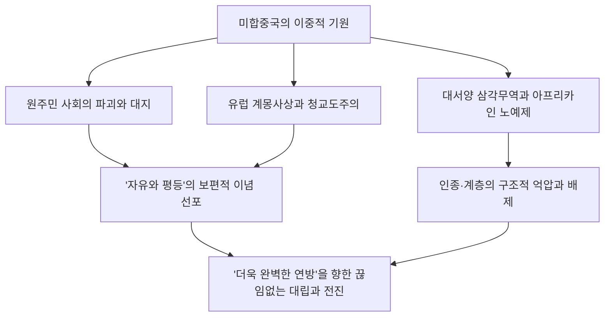
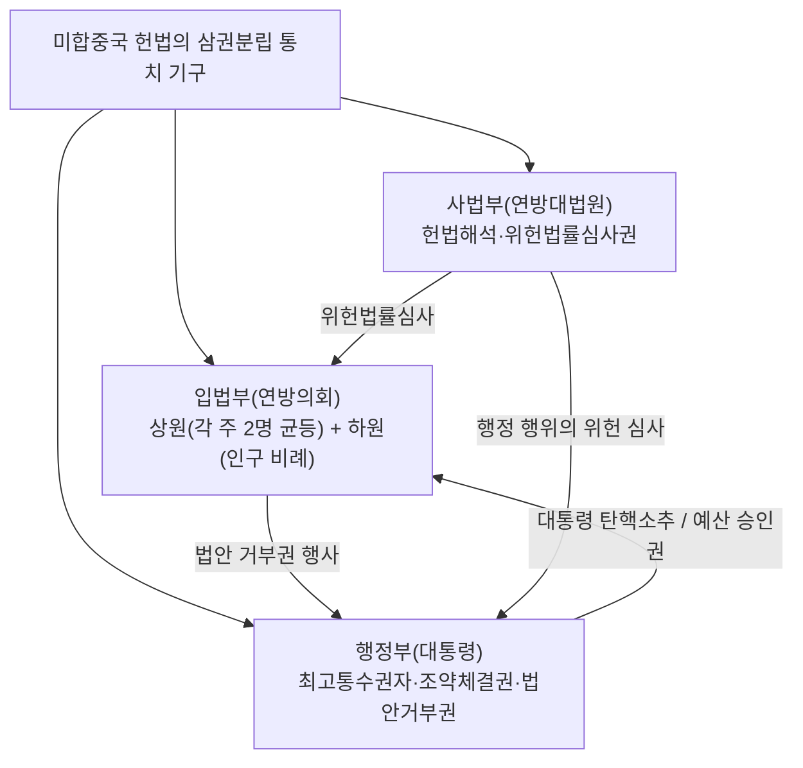
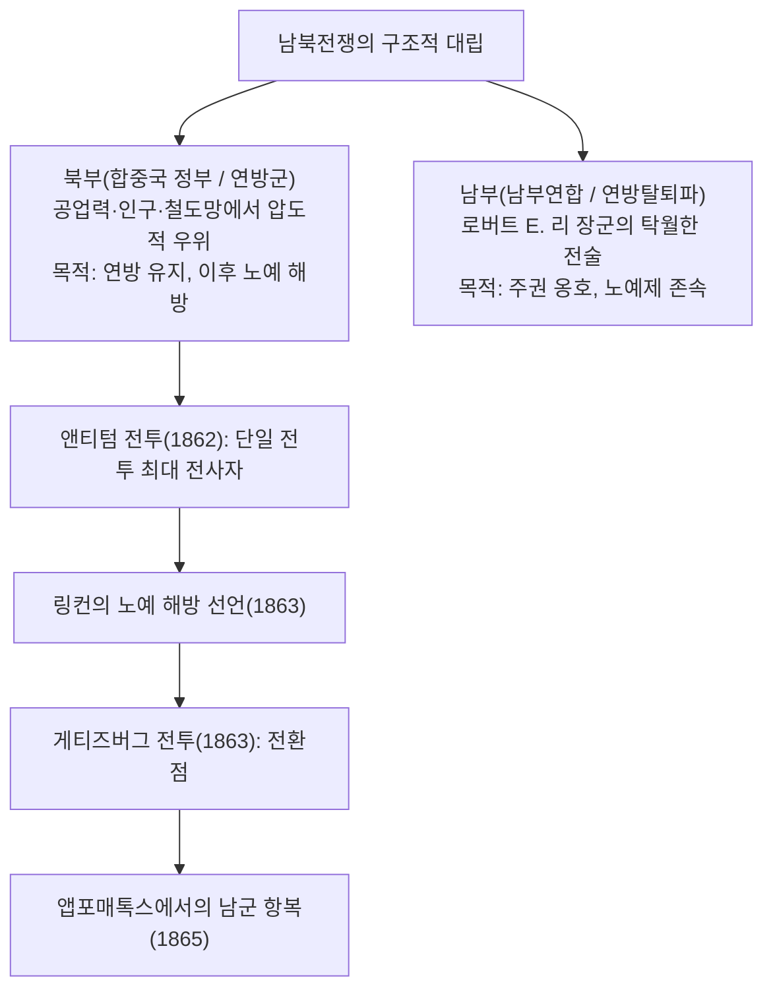
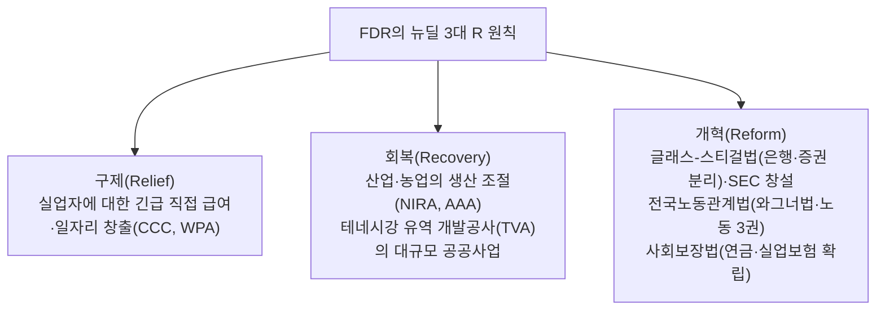
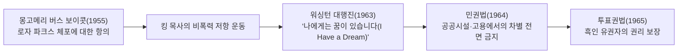
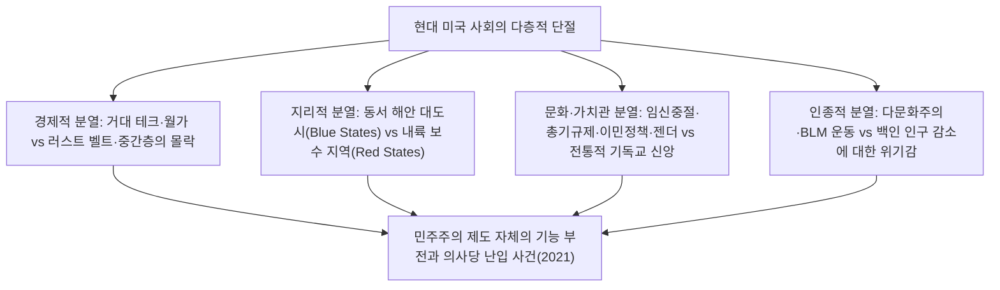
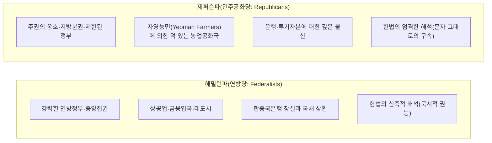

## 1. 서론: 실험국가로서의 미합중국

### 1.1 '신대륙'이라는 환상과 원주민 문명의 실체

미합중국이라는 국가의 역사를 논할 때 오랫동안 "미개한 황야에서 자유를 찾아 나선 유럽 백인들이 개척한 약속의 땅"이라는 신화적 서사가 지배적이었다. 그러나 20세기 후반 이후 인류학과 역사학의 발전은 유럽인이 도달하기 이전부터 이 대륙에 수천 년에 걸쳐 독자적인 고도의 원주민(네이티브 아메리칸) 문명이 번영하고 있었다는 사실을 명백히 밝혀냈다.

미시시피 계곡의 카호키아(Cahokia) 거대 도시 유적으로 대표되는 흙둔덕(Mound) 축조자들의 문명, 남서부의 아나사지(푸에블로) 문화가 남긴 정교한 절벽 주거군, 그리고 북동부에서 5개 부족이 결속하여 고도의 민주적 연방제를 구축했던 이로쿼이 연맹(Haudenosaunee) 등 다양하고 풍요로운 사회적 생태계가 존재했다. 1492년 콜럼버스의 도달 이후 유럽에서 유입된 천연두, 홍역, 인플루엔자 등의 감염병(이른바 '콜럼버스의 교환')과 가혹한 정복 활동으로 인해 원주민 인구의 80%에서 90%가 소멸했으며, 그 파괴의 터전 위에 '신세계'가 건설되었다는 냉철한 역사 인식이 현대 미국사 이해의 필수적인 출발점이다.

---

### 1.2 필그림 파더스, 메이플라워 서약, 청교도주의의 정신적 각인

1607년 제임스타운(버지니아 식민지) 입식에 이어 미국의 국민적 정체성의 정신적 초석이 된 것은, 1620년 메이플라워호를 타고 매사추세츠만에 상륙한 분리파 청교도(필그림 파더스, Pilgrim Fathers)들이다.

상륙 직전 배 안에서 서명된 **'메이플라워 서약(Mayflower Compact)'**은 국왕이나 봉건 영주에 의한 위로부터의 지배가 아니라, **"자유로운 개인들의 자발적 합의(사회계약)에 기초하여 공정하고 평등한 법을 제정하고 스스로를 통치하는 정치 사회를 창설한다"**는 인류 역사상 지극히 획기적인 자치 선언이었다.

지도자 존 윈스롭(John Winthrop)이 설파한 '언덕 위의 도시(A City upon a Hill)'라는 이념—신과 계약을 맺은 청교도 공동체는 전 세계의 모범으로서 밝게 빛나야 한다는 강렬한 사명감—은 훗날 합중국이 세계를 이끌 특별한 사명을 띠고 있다고 믿는 '미국 예외주의(American Exceptionalism)'의 근원적 DNA가 되었다.

---

## 2. 식민지 시대부터 독립혁명·합중국 헌법의 탄생

### 2.1 13개 식민지의 발전과 '유익한 태만'의 종언

대서양 연안에 성립된 13개 영국령 식민지는 북부 뉴잉글랜드(상업·어업·소규모 농업·청교도 신앙), 중부 식민지(곡물 농업·다양한 민족과 종교의 모자이크), 남부 식민지(담배·쌀·인디고를 재배하는 대규모 플랜테이션과 흑인 노예 노동)라는 현저히 상이한 경제·사회 구조를 발전시키고 있었다.

18세기 중엽까지 영국 본국은 식민지에 대해 엄격한 간섭을 하지 않고 사실상의 자치를 인정하는 **'유익한 태만(Salutary Neglect)'** 정책을 취했다. 그러나 유럽의 패권을 둘러싼 7년 전쟁의 북미 전선인 '프렌치 인디언 전쟁(1754–1763)'에서 영국이 승리했음에도 불구하고, 본국은 막대한 전쟁 부채를 떠안게 되었다.

영국 의회는 방위비 분담을 구실로 식민지에 대한 과중한 과세 정책으로 급선회했다.
- **설탕법(1764년)**, **인지세법(1765년)**: 신문, 팜플렛, 심지어 트럼프 카드에 이르기까지 인지세를 부과했다.
- 식민지 측은 맹렬히 반발하며 **"대표 없는 과세 없다(No taxation without representation)"**라는 입헌주의적 구호를 내걸고 본국 상품에 대한 불매 운동을 전개했다.
- 1770년 보스턴 학살 사건, 1773년 보스턴 차 사건(동인도회사의 차 상자를 바다에 투기)을 거치며 본국이 군사력을 통한 강권 탄압(참을 수 없는 여러 법 / 억압법)에 나서자 무력 충돌은 불가피한 단계로 접어들었다.

---

### 2.2 토머스 페인의 『상식』과 독립선언서(1776년)

1775년 4월, 렉싱턴·콩코드 전투의 총성이 울려 퍼지며 미국 독립전쟁의 서막이 올랐다. 당시 식민지 주민 대다수는 여전히 영국 국왕에 대한 충성심과 독립 사이에서 동요하고 있었다.

이러한 방황을 일순간에 깨뜨린 것이 1776년 1월 토머스 페인(Thomas Paine)이 익명으로 발표한 소책자 **『상식(Common Sense)』**이다. 페인은 평이하면서도 열정적인 언어로 "한낱 섬나라에 불과한 영국이 대륙을 영구히 지배하는 것은 불합리하다", "세습 군주제는 본질적으로 인간의 자연권을 모독하는 악한 제도이다"라는 점을 논증했고, 수십만 부가 팔려 나가며 미 전역에 독립의 열풍을 불러일으켰다.

그리고 1776년 7월 4일, 제2차 대륙회의에서 토머스 제퍼슨(Thomas Jefferson)이 기초한 **'미국 독립선언서(Declaration of Independence)'**가 채택되었다.

> "우리는 다음과 같은 진리를 자명한 것으로 믿는다. 곧, 모든 인간은 평등하게 창조되었으며, 창조주로부터 생명, 자유, 그리고 행복의 추구를 포함하는 양도할 수 없는 일정한 권리를 부여받았다는 것이다. 그리고 이러한 권리를 확보하기 위해 인류 사이에 정부가 조직되었으며, 정부의 정당한 권력은 피치자의 동의에서 비롯된다는 것이다."

존 로크의 사회계약론과 자연권 사상을 집대성한 이 격조 높은 선언은 전제 정치에 대한 인민의 저항권(혁명권)을 정당화하며 인류 역사상 보편적 자유의 기념비가 되었다.

조지 워싱턴 총사령관이 이끄는 대륙군은 보급 부족과 혹한을 견뎌내며 지구전을 전개했고, 새러토가 전투(1777년) 승리를 계기로 프랑스, 스페인, 네덜란드와의 군사 동맹을 이끌어냈다. 1781년 요크타운 전투에서 영국군 주력 부대를 포위·항복시켰으며, 1783년 파리 조약을 통해 영국은 미합중국의 완전한 독립을 승인했다.

---

### 2.3 연합규약의 파탄과 필라델피아 제헌회의(1787년)

독립을 달성한 초기 합중국은 1781년에 발효된 '연합규약(Articles of Confederation)'에 기초한, 13개 독립 주권 국가의 지극히 느슨한 국가연합(Confederation)에 불과했다.
- 중앙정부(연합의회)에는 과세권도 상비군도 없었으며, 대외 통상을 통제할 권한조차 없었다.
- 전후 불황과 과중한 세금에 허덕이던 농민들이 무장 봉기한 '셰이즈의 반란(1786년)'에 직면했을 때, 연합정부는 군대를 파견할 능력조차 없었으며 국가 붕괴의 위기가 현실화되었다.

1787년 여름, 필라델피아 독립기념관에 55명의 대표(제임스 매디슨, 알렉산더 해밀턴, 벤저민 프랭클린 등 '건국의 아버지들')가 결집하여 현행 **'미합중국 헌법'**을 제정했다.

- **대타협(코네티컷 타협)**: 인구가 적은 주(소주)들이 요구한 각 주 평등 대표제(뉴저지안)와 인구가 많은 주(대주)들이 요구한 인구 비례 대표제(버지니아안)를 통합하여, '상원(각 주 균등 2명)'과 '하원(인구 비례)'의 양원제를 창설했다.
- **노예 인구 산정(3/5 타협)**: 남부 주들의 정치적 발언권을 제어하면서도 합의를 도출하기 위해, 하원 의석 배분과 직접세 산정에 있어 노예 1명을 자유민의 '5분의 3명'으로 계산한다는 역사적 타협이 이루어졌다.
- **견제와 균형(Checks and Balances)**: 몽테스키외의 사상에 입각하여 대통령, 연방의회, 연방법원의 삼권을 분립시키고, 어떠한 개인이나 기관도 독재적 권력을 장악할 수 없도록 정교한 제도적 방벽을 구축했다.

---

## 3. 영토 확장·명백한 운명과 격동의 남북전쟁

### 3.1 '명백한 운명'과 대륙 횡단 영토 확장

19세기 전반, 합중국은 경이적인 속도로 서부를 향해 영토를 확장해 나갔다.
- **1803년: 루이지애나 매입**: 토머스 제퍼슨 대통령이 프랑스의 나폴레옹으로부터 미시시피강 서쪽의 광대한 루이지애나 식민지를 단돈 1,500만 달러에 매입하여 국토 면적을 단숨에 두 배로 늘렸다.
- **1823년: 먼로 독트린**: 제임스 먼로 대통령은 "유럽 열강은 아메리카 대륙의 문제에 간섭해서는 안 되며, 합중국 또한 유럽의 분쟁에 개입하지 않는다"는 고립주의와 상호 불간섭 원칙을 선언했다.
- **명백한 운명(Manifest Destiny)**: "북미 대륙을 태평양 연안에 이르기까지 영유·개발하고 자유와 민주주의를 확산시키는 것은 신이 합중국에 부여한 명백한 사명이다"라는 팽창주의 이데올로기가 국민을 열광시켰다.

이러한 영토 확장의 이면에서 원주민들의 생존권은 무자비하게 분쇄되었다. 앤드루 잭슨 대통령이 주도한 1830년 '인디언 이주법'으로 인해 체로키족을 비롯한 5대 부족은 대대로 살아온 동부 삼림 지대에서 혹한의 황야를 걸어 수천 킬로미터 떨어진 오클라호마(인디언 준주)로 강제 연행되었다. 수천 명이 기아와 질병으로 목숨을 잃은 이 고난의 길은 **'눈물의 길(Trail of Tears)'**로 역사에 깊이 각인되었다.

미국-멕시코 전쟁(1846–1848년) 승리로 캘리포니아, 텍사스, 뉴멕시코를 획득하고, 1848년의 골드러시를 거치며 합중국은 대서양에서 태평양으로 이어지는 거대한 대륙 국가를 완성했다.

---

### 3.2 노예제의 위기와 국가 분열의 격화

그러나 영토가 서부로 팽창할 때마다 하나의 파멸적인 질문이 연방을 끊임없이 뒤흔들었다. **"새롭게 편입되는 준주에서 노예제를 허용할 것인가, 아니면 금지할 것인가?"**

- **북부 경제**: 산업혁명이 진전되며 자유 노동자에 기반한 제조업, 상업, 금융업이 발달했다. 국내 시장 보호를 요구하는 보호무역주의를 취했다.
- **남부 경제**: 거대 목화 플랜테이션을 기반으로 400만 명에 이르는 아프리카계 흑인 노예의 무상 노동에 의존하는 목화 왕국(King Cotton)을 형성했다. 농산물을 영국 등에 수출하기 위해 자유무역을 지향했다.

연방의회에서 '자유주'와 '노예주' 사이의 세력 균형을 유지하기 위해 1820년 미주리 타협(북위 36도 30분 이북 준주에서의 노예제 금지), 1850년 타협(도망노예법 강화) 등 미봉책이 거듭되었다.

그러나 1854년 캔자스-네브래스카법(준주 주민의 투표로 노예제 존폐를 결정한다는 인민주권론)으로 인해 '피 흘리는 캔자스'라 불리는 내전 상태가 발발했다. 나아가 1857년 연방대법원의 **'드레드 스콧 판결'**은 "흑인은 헌법상 시민이 아니며 어떠한 권리도 갖지 못한다", "연방의회가 준주에서의 노예 소유를 금지하는 것은 위헌이다"라고 판시하여 북부의 반노예제 여론을 격분시켰다.

---

### 3.3 남북전쟁(1861–1865): 피로 물든 재통합과 노예 해방

1860년 대통령 선거에서 '노예제의 추가적인 서부 확산 저지'를 공약으로 내건 공화당의 에이브러햄 링컨(Abraham Lincoln)이 당선되자, 사우스캐롤라이나주를 필두로 남부 7개 주가 연방 탈퇴를 선언하고 '아메리카 남부연합(Confederate States of America)'을 결성했다.

1861년 4월, 남군의 섬터 요새 포격으로 인해 **'남북전쟁(American Civil War)'**이 발발했다.

링컨은 전쟁의 성격을 '연방 유지를 위한 내란 진압'에서 '인류의 자유를 위한 성전'으로 승화시켰다.
- **1863년 1월 1일: 노예 해방 선언(Emancipation Proclamation)**: 남부 반란 지역의 모든 노예를 즉시 해방할 것을 선언했다. 이로써 흑인 병사들의 대규모 연방군 참전(약 18만 명)이 실현되었으며, 영국과 프랑스가 남부를 지원하며 개입하는 것을 도덕적으로 봉쇄했다.
- **1863년 11월: 게티즈버그 연설**: **"국민의, 국민에 의한, 국민을 위한 정치(Government of the people, by the people, for the people)"**가 세상에서 사라지지 않도록 해야 한다고 호소했다.

총력전과 초토화 작전(셔먼 장군의 바다로의 진군)을 거쳐 1865년 4월, 남군의 리 장군은 버지니아주 앱포매톡스에서 북군의 그랜트 장군에게 항복했다. 사망자 60만 명 이상이라는 합중국 역사상 최대의 비극을 거쳐 헌법 수정 제13조(노예제 폐지), 제14조(적법절차와 법 앞의 평등), 제15조(인종에 구애받지 않는 투표권)가 비준되었으며, 합중국은 '국가연합'에서 '분할할 수 없는 통일 국민국가'로 다시 태어났다.

그러나 전후 재건 시대(Reconstruction)가 막을 내리자 남부 각 주에서는 '짐 크로 법(인종격리법)'이 제정되었고, 흑인에 대한 가혹한 인종차별과 쿠 클럭스 클랜(KKK)에 의한 사형(린치)의 암흑시대가 지속되었다.

---

## 4. 도금 시대·산업혁명과 제국주의의 서막

### 4.1 거대 자본의 대두와 '도금 시대'

남북전쟁 이후부터 20세기 초에 걸쳐 미국 경제는 인류 역사상 전례 없는 대폭발을 이루었다. 마크 트웨인은 이 시대를 겉은 황금처럼 찬란하게 빛나지만 내실은 부패로 가득 차 있다는 의미를 담아 **'도금 시대(Gilded Age)'**라고 명명했다.

- 1869년 대륙횡단철도의 완성을 계기로 전미가 하나의 거대한 단일 국내 시장으로 통합되었다.
- **강도 귀족(Robber Barons)의 독점**:
  - 존 D. 록펠러의 '스탠더드 오일'(전미 석유 정제의 90%를 지배).
  - 앤드루 카네기의 철강 제국(카네기 스틸).
  - J.P. 모건에 의한 금융자본 집중과 거대 트러스트(US 스틸 창설).
- 에디슨에 의한 전력망 발명, 벨에 의한 전화 발명, 헨리 포드에 의한 컨베이어 벨트 대량생산 방식(포디즘)이 전 세계 공업 생산량에서 미국을 영국과 독일을 아득히 능가하는 세계 제1위의 공업 초강대국으로 끌어올렸다.

한편 부의 극단적인 편중과 열악한 노동 환경은 홈스테드 파업, 풀먼 파업과 같은 유혈 노동쟁의를 촉발했고, 유럽에서 유입된 수천만 명에 달하는 신이민자(이탈리아, 아일랜드, 동유럽 유대계)들이 도시의 슬럼가를 형성했다.

---

### 4.2 프런티어의 소멸과 해외 영토의 획득

1890년 인구조사에서 역사학자 프레더릭 잭슨 터너는 '프런티어(개척 변경)의 소멸'을 선언했다. 미국인의 민주주의적 정신과 활력을 길러온 서부의 프런티어가 소멸하자, 합중국의 시선은 필연적으로 태평양과 중남미의 해외 시장으로 향했다(마한 해군 군인의 해양권력론).

- **1898년: 미국-스페인 전쟁**: '메인호 폭침 사건'을 계기로 스페인과 개전하여 불과 수개월 만에 압승을 거두었다. 필리핀, 괌, 푸에르토리코를 획득하고 하와이를 병합하여 일거에 태평양의 해양제국으로 비약했다.
- **문호 개방 선언(1899년)**: 존 헤이 국무장관은 열강에 의한 중국 분할에 맞서 '문호 개방·기회 균등·영토 보전'을 제창하며 아시아 시장 진출을 도모했다.

국내에서는 독점 자본의 횡포와 정치적 부패를 시정하기 위해 시어도어 루스벨트 대통령(트러스트 해체, 자연환경 보호)과 우드로 윌슨 대통령에 의한 **'혁신주의(Progressivism)'** 운동이 전개되었으며, 셔먼 반트러스트법의 적용, 연방준비제도(FRS)의 창설, 여성 참정권(헌법 수정 제19조) 획득으로 결실을 맺었다.

---

## 5. 양차 세계대전·대공황과 팍스 아메리카나의 확립

### 5.1 제1차 세계대전과 '광란의 20년대'

1914년에 발발한 제1차 세계대전에 대해 합중국은 당초 중립을 지켰으며, 유럽 열강에 대한 무기·물자 수출을 통해 막대한 채권국으로 전환되었다. 그러나 독일에 의한 '무제한 잠수함 작전'과 '치머만 전보 사건'을 계기로 1917년에 참전했다.

윌슨 대통령은 **'14개조 평화 원칙'**을 내걸고 비밀 외교 폐지, 민족 자결, 국제연맹 창설을 제창했다. 그러나 전후 미 상원은 고립주의 전통에 따라 베르사유 조약의 비준을 거절하고 국제연맹 불참을 선택했다.

1920년대에 합중국은 **'광란의 20년대(Roaring Twenties)'**라 불리는 전례 없는 대중소비사회의 황금기를 맞이했다.
- 라디오, 자동차(포드 모델 T), 영화, 재즈 음악, 가전제품이 일반 가정에 널리 보급되었다.
- 금융시장은 주식 투자의 열광에 휩싸였고, '영원한 번영'이 믿어졌다.
- 그 이면에서는 금주법(헌법 수정 제18조) 시행이 마피아(알 카포네)의 횡행을 초래했고, 인종적·종교적 배외주의(KKK의 재흥, 이민할당법 제정)가 어두운 그림자를 드리웠다.

---

### 5.2 대공황과 뉴딜 정책

1929년 10월 24일, '검은 목요일(Black Thursday)'. 뉴욕 주식시장 월스트리트의 주가 대폭락을 신호로 대공황의 폭풍이 불어닥쳤다.
미 전역에서 수천 개의 은행이 도산했고, 실업률은 25%(4명 중 1명)에 달했으며, 중서부를 덮친 모래폭풍(더스트볼)은 농민들을 길거리로 내몰았다. 후버 대통령의 자유방임주의적 대응은 완전히 파탄 났다.

1933년에 취임한 프랭클린 D. 루스벨트(FDR) 대통령은 **'뉴딜(New Deal) 정책'**을 단행했다.

케인스 경제학에 앞서 국가가 시장경제에 적극적으로 개입하여 복지국가의 제도적 기틀을 구축한 뉴딜은 대통령 권한을 비약적으로 확대시켰으며, 현대 미국 리버럴리즘의 원점이 되었다.

---

### 5.3 제2차 세계대전과 세계 패권 장악

1941년 12월 7일, 일본군에 의한 진주만 공습으로 미국은 제2차 세계대전에 본격 참전했다.

합중국은 스스로를 **'민주주의의 병기창(Arsenal of Democracy)'**으로 규정하고 민간 공업 역량을 일거에 군수 생산으로 전환했다. 자동차 공장은 전차와 항공기를 양산했고, 여성 노동자들(리벳공 로지)이 공장으로 대거 진출했다.

- 유럽 전선에서의 노르망디 상륙작전(1944년) 성공과 나치 독일의 타도.
- 태평양 전선에서의 아일랜드 호핑(개구리뜀 작전)과 일본의 항복.
- 그리고 극비 프로젝트 '맨해튼 계획'을 통한 원자폭탄 개발과 히로시마·나가사키 투하.

대전 종결 시점에 미합중국은 전 세계 공업 생산의 절반을 차지하고 전 세계 금(Gold) 준비금의 70%를 보유한 유일한 핵보유국으로 군림하고 있었다.
1944년 브레턴우즈 협정을 통해 **미국 달러를 기축통화로 하는 국제 통화 체제(IMF·세계은행)**를 확립했고, 1945년에는 샌프란시스코에서 국제연합 헌장이 채택되었다. 명실상부한 **'팍스 아메리카나(미국의 평화)'**의 시대가 개막한 것이다.

---

## 6. 냉전 구조·민권운동·미국의 영광과 고뇌

### 6.1 동서 냉전과 핵 억지의 그림자

제2차 세계대전의 잿더미 속에서 자유주의 진영을 이끄는 미국과 사회주의 진영을 이끄는 소비에트 연방 간의 초강대국 대립인 '냉전(Cold War)'이 발발했다.

- **1947년: 트루먼 독트린**: 공산주의 팽창을 저지하기 위한 '봉쇄 정책(Containment Policy)'.
- **마셜 플랜**: 서유럽 국가들의 공산화를 방지하기 위한 막대한 부흥 지원책.
- **1949년: 북대서양 조약 기구(NATO) 창설**: 집단적 자위권 체제의 구축.
- 한국전쟁(1950–1953년) 발발과 국내에서의 과격한 반공 사상 탄압인 '매카시즘(빨갱이 사냥)'.

1962년 **쿠바 미사일 위기**에서는 소련이 쿠바에 핵미사일 기지를 건설한 것을 둘러싸고 존 F. 케네디 대통령과 흐루쇼프 서기장이 정면 대치하며 인류 역사상 가장 핵전쟁 발발에 접근했다. 상호확증파괴(MAD)에 기초한 냉혹한 공포의 균형이 세계를 뒤덮었다.

---

### 6.2 민권운동: 진정한 평등을 향한 투쟁

제2차 세계대전 이후 중산층 백인들이 교외(서버브)의 마이홈으로 이주하여 TV와 대형 냉장고를 향유하는 한편, 남부를 중심으로 한 흑인들은 여전히 가혹한 격리와 차별에 신음하고 있었다.

1954년 연방대법원의 판결인 **'브라운 대 토피카 교육위원회 재판'**은 공립학교에서의 인종격리를 "본질적으로 불평등하다"고 보아 위헌으로 판시하며 전미 민권운동에 불을 지폈다.

마틴 루터 킹 주니어 목사가 주도하는 비폭력 직접행동(연좌 농성, 프리덤 라이드, 행진)에 대해 백인 경찰은 경찰견과 방수포로 탄압을 가했으나, 그 잔혹한 영상이 전미 TV로 방영되며 도덕적 여론을 크게 움직였다. 린든 B. 존슨 대통령 체제 하에서 **1964년 민권법** 및 **1965년 투표권법**이 성립되었고, 1세기에 걸친 법적 인종차별 제도는 마침내 해체되었다.

---

### 6.3 베트남 전쟁의 늪과 카운터컬처

그러나 동남아시아의 도미노 이론(한 국가의 공산화가 주변국으로 파급된다는 가설)에 사로잡힌 합중국은 베트남 전쟁(1965–1973년)이라는 진흙탕에 본격적으로 개입했다.
밀림에서의 게릴라전, 고엽제 살포, 미라이 학살 사건, 그리고 징집된 수만 명의 미국 젊은이들의 전사는 국민들의 정부에 대한 신뢰를 밑바닥부터 분쇄했다.

대학 캠퍼스를 중심으로 거대한 반전 운동이 폭발했고, 히피 운동, 록 음악(우드스톡 페스티벌), 여성해방운동(우먼 리브), 환경보호운동 등 **'카운터컬처(대항문화)'**의 광풍이 휘몰아쳤다. 1974년에는 닉슨 대통령이 '워터게이트 사건' 은폐 공작으로 인해 미국 역사상 최초로 대통령직을 사임하기에 이르렀고, 합중국은 정신적·도덕적으로 깊은 실의의 시대(스태그플레이션과 카터 정권의 혼미)를 맞이했다.

---

## 7. 레이거노믹스부터 포스트 냉전·9.11·현대 사회의 깊은 분열

### 7.1 레이건 혁명과 냉전의 종결

1980년, '강한 미국의 부활(Make America Great Again)'을 내걸고 로널드 레이건(Ronald Reagan) 대통령이 압승을 거두었다.

- **레이거노믹스(Reaganomics)**: 공급중시 경제학에 기초하여 대규모 감세, 규제 완화, 사회보장 예산 삭감, 통화공급량 긴축을 실시했다. '작은 정부'와 신자유주의(네오리버럴리즘) 조류를 전 세계로 확산시켰다.
- **'악의 제국'과의 대결**: 막대한 국방 예산을 투입하여 전략방위구상(SDI: 스타워즈 계획)을 추진했고, 군비 경쟁을 통해 소비에트 연방의 계획경제를 피폐화시켰다.
- 1989년 베를린 장벽 붕괴, 그리고 1991년 소비에트 연방의 붕괴로 반세기에 걸친 냉전은 합중국의 완전한 승리로 종결되었다. 역사학자 프랜시스 후쿠야마는 이를 '역사의 종말(자유민주주의와 자본주의의 최종적 승리)'이라 불렀다.

---

#---

## 7.1.5 걸프 전쟁(1991)과 파월 독트린의 군사 혁명

냉전 종결 직후인 1990년 8월, 이라크의 사담 후세인 대통령이 이웃 나라인 쿠웨이트를 전격 침공했다. 조지 H. W. 부시 대통령은 유엔 안보리 결의를 이끌어내고 34개국으로 구성된 다국적군을 결성하여 1991년 1월 '사막의 폭풍 작전(걸프 전쟁)'을 발동했다.

### 베트남의 악몽을 극복한 군사 독트린
베트남 전쟁이 진흙탕에 빠졌던 쓰라린 교훈으로부터 합참의장 콜린 파월 장군이 수립한 것이 바로 **'파월 독트린(Powell Doctrine)'**이다.
1. 국익에 대한 중대하고 명확한 위협이 존재할 것.
2. 다른 모든 외교적·경제적 수단을 다한 뒤의 '최후의 수단'일 것.
3. 명확하고 달성 가능한 군사적 목표가 정의되어 있을 것.
4. **'압도적인 병력(Overwhelming Force)'**을 일거에 투입하여 적에게 반격의 여지를 주지 않고 단기간에 완승할 것.
5. 명확한 철수 기준(출구 전략)이 사전에 확립되어 있을 것.

미군은 스텔스 전투기(F-117), GPS 유도 정밀유도무기(스마트 폭탄), 토마호크 순항미사일, 패트리어트 요격미사일 등 하이테크 무기의 압도적 위력을 생중계(CNN)로 전 세계에 과시하며 불과 100시간의 지상전 만에 이라크군을 분쇄했다.

부시 대통령은 "베트남의 망령은 사막의 모래 아래 묻혔다"고 선언했고, 합중국은 '유일 초강대국'으로서 '새로운 세계 질서(New World Order)'를 주도한다는 자신감을 드높였다. 그러나 역설적이게도 이 압도적인 승리의 기억이 훗날 2003년 이라크 전쟁에서 파월 독트린의 신중함을 잊게 만들고 파멸적인 점령 정책으로 치닫는 과신(오만, Hubris)을 낳는 원인이 되었다.

## 7.2 세계화의 빛과 그림자, 그리고 IT 혁명

1990년대 빌 클린턴 행정부 하에서 냉전 종결에 따른 군사비 삭감(평화의 배당)과 실리콘밸리를 중심으로 한 인터넷·IT 혁명의 폭발이 전례 없는 경제적 번영(뉴 이코노미)을 가져왔다.

북미자유무역협정(NAFTA) 체결과 중국의 WTO 가입을 주도하며 세계 경제의 글로벌화가 맹렬한 속도로 진전되었다. 그러나 이 글로벌화와 금융자본주의의 승리는 국내에 심각한 구조적 왜곡을 낳았다.
- 제조업 공장이 임금이 저렴한 중국이나 멕시코로 유출되면서 중서부와 러스트 벨트(녹슨 공업지대)의 백인 노동자 계급이 몰락했다.
- 동서부 해안의 하이테크·금융 엘리트와 내륙의 소외된 노동자들 사이에 경제적·문화적 단절이 수습 불가능할 정도로 확대되었다.

---

### 7.3 9·11 동시다발 테러와 '대테러 전쟁'의 좌절

2001년 9월 11일, 알카에다의 납치 항공기가 뉴욕의 세계무역센터 빌딩과 국방부(펜타곤)에 충돌하는 '동시다발 테러 사건'이 발생했다. 본토가 직접 공격을 받은 미국 국민들은 유례없는 애국심의 고양을 보였고, 조지 W. 부시 대통령은 '대테러 세계 전쟁'을 선포했다.

- 아프가니스탄 침공(탈레반 정권 타도).
- 2003년: 이라크 전쟁(대량살상무기 보유를 구실로 개전).
- 그러나 이라크에서 대량살상무기는 발견되지 않았으며, 중동 지역은 내전과 과격파 조직(ISIS)의 온상이 되었고, 수천 명의 미군 병사의 목숨과 수조 달러의 국부가 소모되었다. 미국의 국제적 도덕적 권위는 현저하게 실추되었다.

---

### 7.4 리먼 쇼크, 오바마, 트럼프 현상과 21세기의 혼미

2008년, 월스트리트의 서브프라임 모기지 거품 붕괴를 계기로 '리먼 쇼크(세계 금융위기)'가 발발했다. 자본주의의 대들보가 흔들리는 가운데 "Change", "Yes We Can"을 내건 버락 오바마(Barack Obama)가 합중국 역사상 최초의 아프리카계 대통령으로 취임했다. 의료보험제도 개혁(오바마케어)을 실현시켰으나, 보수파의 풀뿌리 운동인 '티파티'와의 사이에서 당파적 대립은 진흙탕 싸움이 되었다.

그리고 2016년, 기성 정치 엘리트(에스태블리시먼트)와 글로벌리즘에 격분한 러스트 벨트 백인 노동자층의 분노('러스트 벨트의 역습')를 등에 업고 도널드 트럼프(Donald Trump)가 대통령에 당선되었다.

2021년 1월 6일 연방의회 의사당 난입 사건이 상징하듯, 오늘날의 미합중국은 건국 이래 최대의 '국민적 합의의 붕괴'에 직면해 있다.

---

---

## 2.4 건국의 아버지들의 사상적 결렬: 해밀턴 vs 제퍼슨 논쟁

합중국 헌법이 비준된 후, 초대 대통령 조지 워싱턴의 각내에서 미국이라는 국가의 미래상을 둘러싼 인류 역사상 손꼽히는 지적 격돌이 발발했다. 재무장관 알렉산더 해밀턴과 국무장관 토머스 제퍼슨의 대립이다.

### ① 경제 구상의 격돌: 금융 제국인가, 농업 공화국인가
- **해밀턴의 구상**: 영국과 같은 강대한 근대 공업·금융·군사 제국을 지향했다. 각 주가 떠안고 있던 독립전쟁의 전시 채무를 연방정부가 일괄 인수하고(채무인수법), 국채를 발행하여 '합중국 제1은행(First Bank of the United States)'을 설립했다. 제조업을 보호 육성하고 막강한 상비군과 관료 기구를 갖춘 중앙집권 국가를 지향했다.
- **제퍼슨의 구상**: 대도시와 공장 노동자는 부패하기 쉬우며, 타인에게 생계를 의존하는 인간은 진정한 시민적 자유를 가질 수 없다고 확신했다. 광활한 토지를 스스로 경작하는 자립적인 자영농민(요먼 파머, Yeoman Farmers)이야말로 도덕과 덕(Virtue)의 원천이며, 중앙정부는 국방과 최소한의 외교만을 수행하는 '작은 정부'여야 한다고 주장했다.

### ② 헌법 해석의 대립: 묵시적 권능론 vs 엄격 해석
- 연방의회에 중앙은행(합중국은행)을 설립할 권한이 있는가를 둘러싸고 헌법 해석의 결정적인 분기점이 탄생했다.
- **제퍼슨의 엄격 해석(Strict Construction)**: 헌법 제1조 제8항의 연방의회 열거 권한에 '은행 설립'이라는 문자는 없다. 헌법에 명문으로 규정되지 않은 권한을 행사하는 것은 각 주와 인민의 권리를 박탈하는 위헌 행위이다(헌법 수정 제10조의 정신).
- **해밀턴의 신축적 해석(Loose Construction)**: 헌법 제1조 제8항 제18호의 '필요적절조항(Necessary and Proper Clause: 탄력조항)'을 근거로 삼아, 연방정부가 징세나 국채 관리라는 열거 권한을 효과적으로 수행하기 위해 필요한 부수적 수단은 명문의 규정이 없더라도 '묵시적 권능(Implied Powers)'으로서 합헌이라고 논파했다. 이 해밀턴의 이론은 훗날 마셜 대법원장에 의한 '매컬록 대 메릴랜드주 사건 판결(1819년)'에 의해 사법부의 확립된 법리가 되었으며, 현대에 이르는 강대한 연방정부의 법적 기반이 되었다.

---

## 3.6 남북전쟁의 군사·기술사적 전환점과 재건기의 고뇌

남북전쟁은 세계사에서 '최초의 근대적 총력전(First Modern Total War)'이라 불린다. 산업혁명의 최신 기술이 처음으로 전장에 전면 투입되어 종래 나폴레옹 시대의 화려한 야전 전술을 완전히 무력화했다.

### ① 군사 기술의 혁명
1. **라이플총과 미니에탄(Minié Ball)**:
   - 종래 활강총(머스킷)의 유효사거리가 $50 \sim 100$ 야드였던 것에 비해, 총열 내부에 나선형 홈(강선, Rifling)을 판 라이플총과 연납으로 제작된 미니에탄은 유효사거리를 단숨에 $300 \sim 500$ 야드로 늘렸다.
   - 그러나 지휘관들은 과거의 밀집 대형에 의한 돌격을 지속했기 때문에 기관총 전야의 가공할 탄막 앞에 보병들이 쓰러져 나갔고, 게티즈버그 전투(피켓의 돌격) 등에서 수만 명의 사상자가 산더미를 이루는 결과를 낳았다. 전장은 필연적으로 '참호전'으로 이행했다.
2. **철도와 전신의 군사적 이용**:
   - 북군은 조밀한 철도망을 구사하여 수만 명 규모의 증원 부대와 보급 물자를 며칠 만에 전선으로 수송했다.
   - 백악관 전신실에 상주한 링컨 대통령은 전신을 통해 전장의 사령관들과 실시간으로 전략을 협의하며 사상 최초의 근대적 원격 지휘통제(C4I)를 실천했다.
3. **장갑함의 격돌**:
   - 1862년 햄프턴 로즈 해전에서 남군의 장갑함 '버지니아(구 메리맥)'와 북군의 회전포탑 장갑함 '모니터'가 격돌했다. 목조 범선의 시대는 하룻밤 사이에 종언을 고했다.

### ② 재건기(Reconstruction: 1865–1877)의 좌절과 짐 크로의 어둠
링컨 암살 후에 대통령이 된 앤드루 존슨은 남부에 지나치게 관대했기 때문에 급진파 공화당이 의회 주도로 남부를 5개 군관구로 분할하고 흑인의 투표권을 행사하게 하여 많은 흑인 연방의원을 탄생시켰다(급진적 재건).

그러나 1877년 대통령 선거를 둘러싼 정치적 뒷거래(헤이스=틸던 타협)에 의해 연방군이 남부에서 전면 철수하자, 백인 농장주(플랜터) 세력이 주 정권을 탈환했다(구원자/리디머 정권).
- 남부 각 주는 인두세(Poll Tax), 문해력 시험(Literacy Test), 조부 조항(1867년 이전 유권자의 자손만 무시험) 등 교묘한 법 제도를 촘촘히 엮어 흑인들로부터 투표권을 실질적으로 박탈했다.
- 1896년 연방대법원 판결 **'플레시 대 퍼거슨 재판'**은 '분리하되 평등하다(Separate but Equal)'는 원칙을 내걸고 대중교통과 학교에서의 인종격리를 합헌으로 승인했다. 이 암흑의 짐 크로 법 체제는 1950년대 민권운동까지 반세기 이상 유지되었다.

---

## 7.5 사법 정치와 21세기 연방대법원 판례를 둘러싼 투쟁

현대 미국 정치적 분열의 최전선에 있는 것이 연방대법원의 구성과 판례 변경을 둘러싼 '사법 전쟁(Judicial Wars)'이다.

### ① 임신중절의 권리: 로 판결에서 돕스 판결로의 대역전
- **1973년: 로 대 웨이드 판결(Roe v. Wade)**: 대법원은 헌법 수정 제14조의 적법절차(듀 프로세스) 조항이 보장하는 '프라이버시의 권리'에 기초하여 여성이 임신을 중절할 권리를 헌법상의 기본적 권리로 승인했다.
- 이에 맞서 기독교 복음주의를 중심으로 한 종교적 우파(프로라이프 세력)는 반세기에 걸쳐 공화당과 결속하여 "낙태에 반대하는 보수파 판사를 대법원에 보내는" 조직적 운동을 전개했다.
- 트럼프 정권 하에서 3명의 보수파 판사(고서치, 캐버노, 배럿)가 지명되어 대법원의 구성이 '보수파 6 대 리버럴파 3'의 압도적 다수가 된 결과, **2022년의 '돕스 대 잭슨 여성건강기구 판결(Dobbs v. Jackson)'**에서 대법원은 50년 만에 로 판결을 파기했다. "중절의 권리는 합중국 헌법에 명기되어 있지 않으며 역사적 전통에도 뿌리내리고 있지 않다"며 중절의 규제 권한을 각 주의 입법부로 되돌려 보냈다.
- 이 판례 변경으로 인해 남부와 중서부의 보수파 주에서 중절 전면 금지법이 잇따라 발효된 반면, 민주당 지지 주(캘리포니아나 뉴욕)는 중절의 피난처(생크추어리)를 선언하여 국가의 분열은 법적으로 수습 불가능한 깊이에 이르렀다.

### ② 총기 소지의 권리: 헌법 수정 제2조의 원의주의 해석
- **헌법 수정 제2조**: "규율 있는 민병은 자유로운 주의 안보를 위해 필요하므로, 인민이 무기를 보유하고 휴대하는 권리는 침해되어서는 안 된다."
- **2008년: 컬럼비아 특별구 대 헬러 판결(District of Columbia v. Heller)**: 안토닌 스칼리아 판사가 이끄는 원의주의(Originalism: 헌법 제정 당시 단어의 의미를 중시하는 해석 기법)에 기초하여 대법원은 수정 제2조의 권리를 "민병 조직에 소속되어 있는지 여부와 상관없이 모든 개인이 자기방어를 위해 총기를 보유하는 절대적 권리이다"라고 처음으로 명언했다. 총기 난사 사건이 빈발하는 현대에도 연방 차원에서의 발본적인 총기 규제법 제정이 극히 곤란한 배경에는 이 강력한 사법적 판단이 존재한다.

---

## 6.5 닉슨 쇼크(1971)와 페트로달러 체제의 확립

20세기 후반 국제금융·지정학에서 일어난 최대의 격변이 1971년 8월 15일, 리처드 닉슨 대통령이 전격적으로 발표한 '닉슨 쇼크(달러 쇼크)'이다.

### ① 브레턴우즈 체제의 종언
제2차 세계대전 말기인 1944년 합중국 뉴햄프셔주 브레턴우즈에서 확립된 국제 통화 체제는 **'금 1온스 = 35미국 달러'**로 고정 교환할 것을 합중국이 전 세계에 보증하고, 각국 통화는 미국 달러에 대해 고정환율을 유지하는 '금·달러 본위제(Gold-Exchange Standard)'였다.

그러나 1960년대 후반 린든 존슨 행정부 하의 '위대한 사회(Great Society)' 복지 정책과 늪에 빠진 베트남 전쟁의 막대한 군사비 지출로 인해 미국의 재정 적자와 국제수지 적자가 천문학적으로 팽창했다. 서독과 프랑스를 비롯한 유럽 각국이 보유한 달러 지폐를 금으로 교환해 줄 것을 요구하기 시작했기 때문에 포트녹스의 연방 금 준비금은 고갈 직전으로 내몰렸다.

닉슨 대통령은 TV 연설에서 **"금과 미국 달러의 태환을 즉각적이고 무기한으로 정지한다"**고 일방적으로 발표했다. 이로써 브레턴우즈 체제는 붕괴되었고, 세계 경제는 1973년 이후 시장의 수급에 따라 환율이 변동하는 '변동환율제(Floating Exchange Rate System)'로 돌입했다.

### ② 페트로달러(Petrodollar) 시스템의 탄생
금의 뒷배를 잃은 미국 달러는 극심한 인플레이션과 하락의 위기에 직면했다. 여기서 닉슨 행정부의 헨리 키신저 국무장관이 획책한 것이 세계 최대의 산유국 사우디아라비아와의 극비 외교(1974년)였다.
- 합중국은 사우디아라비아 왕실에 대해 최신예 군사 원조와 방위 보증을 제공한다.
- 그 대가로 사우디아라비아는 **"석유(원유) 국제 거래의 결제 통화를 미국 달러로만 한정한다"**는 데 합의했다(OPEC 전체로의 확대).
- 이로써 전 세계 모든 국가는 근대 문명의 혈액인 석유를 구입하기 위해 항상 미국 달러를 외환보유액으로 계속 보유해야만 하는 구조가 완성되었다(**페트로달러 체제**). 합중국은 자국의 중앙은행(FRB)이 인쇄하는 불환지폐(Fiat Money)에 의해 전 세계의 에너지 자원을 실질적으로 사들일 수 있는 '과도한 특권(Exorbitant Privilege)'을 확립한 것이다.

---

## 7.6 이민 국가의 변모: 1965년 이민법과 인구 동태의 지각변동

미국 사회의 정체성을 근저에서부터 다시 쓴 또 하나의 조용한 혁명이 1965년에 린든 존슨 대통령이 서명한 **'이민 및 국적법(하트-셀러 법)'**이다.

1924년의 이민법(존슨-리드 법)은 1890년 시점의 합중국 인구 비율에 기초하여 이민자 수를 할당하는 '출신국가별 쿼터제'를 채택하고 있어 실질적으로 백인·서북유럽계 이민을 노골적으로 우대하고 남유럽·동유럽·아시아계 이민을 극단적으로 배제하고 있었다.

1965년 법은 이 인종차별적 할당을 전폐하고 '가족 초청(친족 재결합)'과 '고급 기술 노동자'를 최우선 기준으로 하는 새로운 수용 제도를 도입했다.
- 의회는 이 법 개정이 인구 구성에 커다란 영향을 미치리라고 예상하지 못했으나, 결과는 극적이었다.
- 유럽으로부터의 이민이 격감한 반면, 라틴아메리카(멕시코, 중미 국가들) 및 아시아(중국, 필리핀, 인도, 한국, 베트남)로부터의 이민이 폭발적으로 급증했다.
- 2020년대 미국 인구조사에서 비히스패닉 백인의 비율은 약 $58\%$까지 저하되었으며, 2045년경에는 **"백인이 인구의 과반 아래로 떨어져 다수파가 존재하지 않는 사회(매조리티-마이너리티 사회)"**로 비가역적으로 돌입할 것이 확정되어 있다.

이 급속한 인구 동태(데모그래픽스)의 격변에 대한 전통적 백인 노동자층의 "자신들의 나라를 빼앗긴다"는 깊은 실존적 공포와 초조감이야말로 트럼프주의(반이민, 국경 장벽 건설, 아메리카 퍼스트)를 강력하게 구동하는 최대의 심층심리적 에너지인 것이다.

## 8. 결론: 끝나지 않는 '더욱 완벽한 연방'을 향한 도전

미합중국의 역사란 영토의 확대나 군사·경제적 패권의 역사이기 이전에, **"이념이 현실의 모순에 의해 끊임없이 부서지고, 그 잔해 속에서 다시 이념을 재생시키고자 했던 장대한 고투의 역사"**이다.

합중국 헌법 전문은 그 서두에서 드높이 노래하고 있다.
> **"우리 합중국 인민은, 더욱 완벽한 연방을 형성하고(in Order to form a more perfect Union)……"**

건국의 아버지들은 스스로 만든 국가가 처음부터 완벽하리라고는 털끝만큼도 생각하지 않았다. 그렇기에 그들은 '완벽한 연방'이 아니라, "**더욱 완벽한(more perfect)** 연방"이라는 동적인 비교급을 사용했던 것이다.

원주민 학살, 노예제의 죄업, 인종격리, 대외 침략의 과오—수많은 거대한 잘못을 범하면서도, 그때마다 시민 자신의 손으로 헌법을 수정하고 법을 바로잡으며 자유와 평등의 경계선을 넓혀온 자기회복력이야말로 이 실험국가의 진정한 저력이었다.

분열과 불신이 소용돌이치는 21세기 현대에 미합중국이 다시금 그 원점인 "다양성 속의 통합(E Pluribus Unum: 여럿에서 하나로)"을 되찾고 세계에 희망의 등불을 밝힐 수 있을 것인가. 그 답을 이끌어내기 위한 항해는 지금도 여전히 이어지고 있다.
