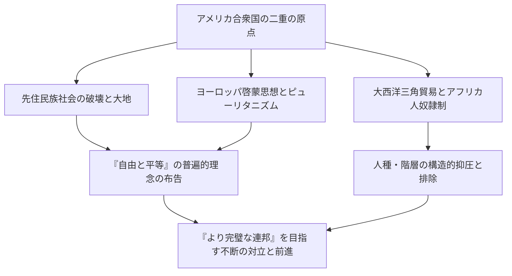
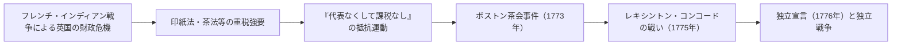
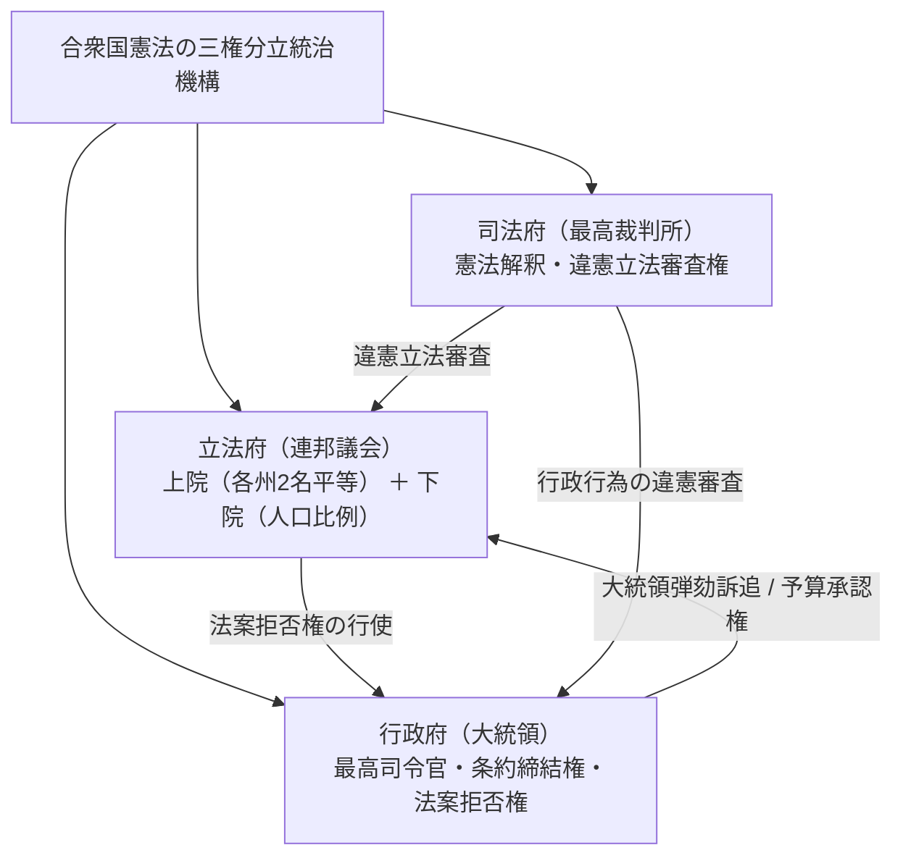
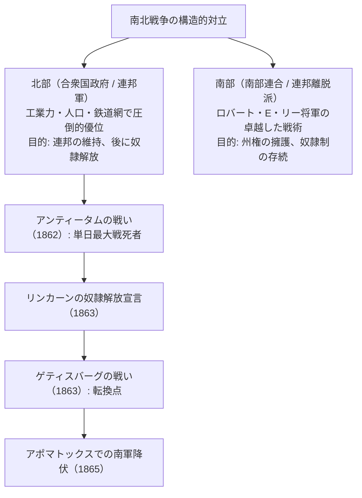
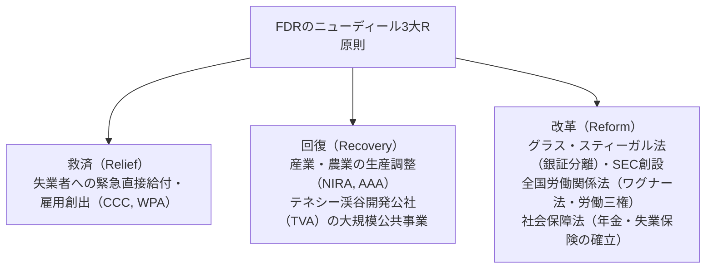
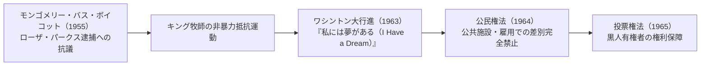
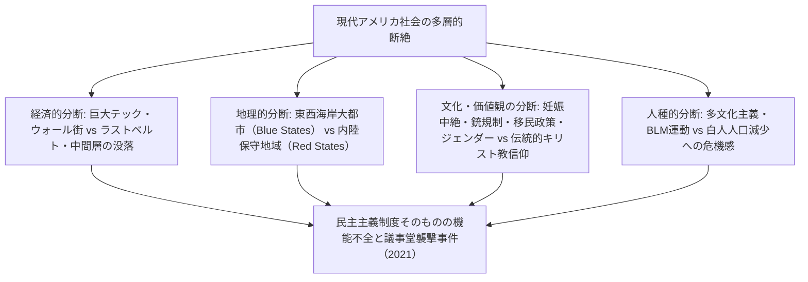

## 1. 序論：実験国家としてのアメリカ合衆国

### 1.1 「新大陸」という幻想と先住民族文明の実態

アメリカ合衆国という国家の歴史を語る際、長らく「未開の荒野に自由を求めたヨーロッパ白人が拓いた約束の地」という神話的ナラティブが支配的であった。しかし、20世紀後半以降の人類学・歴史学の進展は、ヨーロッパ人の到達以前に、この大陸には数千年にわたる独自の高度な先住民族（ネイティブアメリカン）文明が栄えていた事実を明らかにしている。

ミシシッピ渓谷のカホキア（Cahokia）巨大都市遺跡に代表されるマウンド建設者たちの文明、南西部のアナサジ（プエブロ）文化による精緻な崖住居群、そして北東部で五部族が結束して高度な民主的連邦制を築き上げていたイロコイ連邦（Haudenosaunee）など、多様で豊かな社会生態系が存在していた。1492年のコロンブス到達以降、ヨーロッパからもたらされた天然痘、麻疹、インフルエンザなどの感染症（いわゆる「コロンブスの交換」）と過酷な征服活動により、先住民人口の80%から90%が失われ、その破壊の上に「新世界」が建設されたという冷徹な歴史認識が、現代アメリカ史理解の必須の出発点である。



---

### 1.2 ピルグリム・ファーザーズ、メイフラワー誓約、ピューリタニズムの精神的刻印

1607年のジェームズタウン（バージニア植民地）入植に続き、アメリカの国民的アイデンティティの精神的礎石となったのが、1620年にメイフラワー号でマサチューセッツ湾に上陸した分離派ピューリタン（ピルグリム・ファーザーズ）である。

上陸直前、船上で署名された「**メイフラワー誓約（Mayflower Compact）**」は、国王や封建領主による上からの支配ではなく、「**自由な個人の自発的合意（社会契約）に基づいて公正かつ平等な法を制定し、自らを統治する政治社会を創設する**」 という人類史上極めて画期的な自治宣言であった。

指導者ジョン・ウィンスロップが説いた「丘の上の町（A City upon a Hill）」という理念――神と契約を結んだ清教徒の共同体は、全世界の模範として光り輝かなければならないという強烈な使命感――は、後に合衆国が世界を導く特別な使命を帯びていると信じる「アメリカ例外主義（American Exceptionalism）」の根源的DNAとなった。

---

## 2. 植民地時代から独立革命・合衆国憲法の誕生

### 2.1 13植民地の発展と「有益なる怠慢」の終焉

大西洋岸に成立した13の英領植民地は、北部ニューイングランド（商業・漁業・小規模農業・ピューリタン信仰）、中部植民地（穀物農業・多様な民族と宗教のモザイク）、南部植民地（タバコ・米・インディゴを栽培する大規模プランテーションと黒人奴隷労働）という、著しく異なる経済社会構造を発展させていた。

18世紀半ばまで、イギリス本国は植民地に対して厳格な干渉を行わず、事実上の自治を認める「**有益なる怠慢（Salutary Neglect）**」 政策を採っていた。しかし、ヨーロッパの覇権をめぐる七年戦争の北米戦線である「フレンチ・インディアン戦争（1754–1763）」においてイギリスが勝利したものの、本国は莫大な戦費債務を抱え込むこととなった。

イギリス議会は、防衛費の負担を口実に植民地に対する重税政策へと舵を切った。
- **砂糖法（1764年）**、**印紙法（1765年）**：新聞、パンフレット、トランプに至るまで印紙税を課す。
- 植民地側は猛然と反発し、「**代表なくして課税なし（No taxation without representation）**」 という立憲的スローガンを掲げて本国製品のボイコットを展開した。
- 1770年のボストン虐殺事件、1773年のボストン茶会事件（東インド会社の茶箱を海へ投棄）を経て、本国が軍事力による強権弾圧（耐えがたき諸法）に乗り出すと、武力衝突は不可避の段階へと突入した。



---

### 2.2 トマス・ペイン『コモン・センス』と独立宣言（1776年）

1775年4月、レキシントン・コンコードの戦いによって銃声が轟き、アメリカ独立戦争の火蓋が切って落とされた。当時、植民地住民の多くは依然としてイギリス国王への忠誠心と独立の間で揺れ動いていた。

この迷いを一瞬で打ち破ったのが、1776年1月にトマス・ペイン（Thomas Paine）が匿名で発表した小冊子『**コモン・センス（Common Sense）**』 である。ペインは平易で情熱的な言葉で、「島国に過ぎないイギリスが大陸を永遠に支配することが不条理であること」「世襲君主制が本質的に人間の自然権を冒涜する悪制度であること」を論証し、数十万部を売り上げて全米に独立の熱狂を巻き起こした。

そして1776年7月4日、第2回大陸会議において、トマス・ジェファーソンが起草した「**アメリカ独立宣言（Declaration of Independence）**」 が採択された。

> 「われわれは、以下の真理を自明のことと信じる。すなわち、すべての人間は生まれながらにして平等に造られ、創造主によって、生存、自由、そして幸福の追求を含む、奪うべからざる権利を与えられていること。そして、これらの権利を確保するために、人類の間に政府が組織され、その正当な権力は被治者の同意に由来すること。」

ジョン・ロックの社会契約論と自然権思想を集大成したこの格調高い宣言は、専制政治に対する人民の抵抗権（革命権）を正当化し、人類史における普遍的自由の記念碑となった。

ジョージ・ワシントン総司令官率いる大陸軍は、補給不足と寒冷に耐えながら持久戦を展開し、サラトガの戦い（1777年）の勝利を機にフランス、スペイン、オランダの軍事同盟を取り付けた。1781年のヨークタウンの戦いで英軍主力部隊を包囲・降伏させ、1783年のパリ条約によってイギリスはアメリカ合衆国の完全な独立を承認した。

---

### 2.3 連合規約の破綻とフィラデルフィア憲法制定会議（1787年）

独立を果たした当初の合衆国は、1781年に発効した「連合規約（Articles of Confederation）」に基づく、13の独立主権国家の極めて緩やかな国家連合（Confederation）に過ぎなかった。
- 中央政府（連合会議）には課税権も常備軍もなく、対外通商を統制する権限もなかった。
- 戦後不況と重税に苦しむ農民が武装蜂起した「シェイズの反乱（1786年）」に直面したとき、連合政府は軍隊を派遣することすらできず、国家崩壊の危機が現実のものとなった。

1787年夏、フィラデルフィアの独立記念館に55名の代表（ジェームズ・マディソン、アレクサンダー・ハミルトン、ベンジャミン・フランクリンら「建国の父」）が集結し、現行の「**アメリカ合衆国憲法**」 を起草した。



- **大妥協（コネティカット妥協）**: 小州が求めた各州平等代表（ニュージャージー案）と、大州が求めた人口比例代表（バージニア案）を統合し、「上院（各州一律2名）」と「下院（人口比例）」の二院制を創設。
- **奴隷人口の計算（5分の3妥協）**: 南部州の政治的発言力を抑えつつ合意を得るため、下院の議席配分と直接税の算定において、奴隷1人を自由民の「5分の3人」としてカウントするという歴史的妥協が図られた。
- **チェック・アンド・バランス（抑制と均衡）**: モンテスキューの思想に基づき、大統領、連邦議会、連邦裁判所の三権を分立させ、いかなる個人や機関も独裁的権力を握れない精緻な制度的防壁を構築した。

---

## 3. 領土拡大・マニフェスト・デスティニーと激動の南北戦争

### 3.1 「明白なる天命」と大陸横断の領土拡張

19世紀前半、合衆国は驚異的なスピードで西方へと領土を拡大していった。
- **1803年：ルイジアナ買収**: トマス・ジェファーソン大統領がフランスのナポレオンからミシシッピ川以西の広大なルイジアナ植民地をわずか1500万ドルで買収し、国土の面積を一挙に倍増させた。
- **1823年：モンロー教書**: ジェームズ・モンロー大統領は、「欧州列強はアメリカ大陸の諸問題に干渉してはならず、合衆国も欧州の紛争に関与しない」という孤立主義と相互不干渉の原則を宣言した。
- **マニフェスト・デスティニー（Manifest Destiny: 明白なる天命）**: 「北米大陸を太平洋岸に至るまで領有・開発し、自由と民主主義を広めることは、神から合衆国に下された明白な使命である」という膨張主義的イデオロギーが国民を熱狂させた。

この領土拡大の裏で、先住民族の生存圏は無慈悲に粉砕された。アンドリュー・ジャクソン大統領が主導した1830年の「先住民移住法」により、チェロキー族をはじめとする五大部族は、先祖伝来の東部森林地帯から厳冬の荒野を徒歩で数千キロ離れたオクラホマ（インディアン準州）へと強制連行された。数千人が飢餓と病気で命を落としたこの苦難の道は「**涙の旅路（Trail of Tears）**」 として歴史に深く刻まれている。

米墨戦争（1846–1848年）の勝利によってカリフォルニア、テキサス、ニューメキシコを獲得し、1848年のゴールドラッシュを経て、合衆国は大西洋から太平洋へと連なる大陸国家を完成させた。

---

### 3.2 奴隷制の危機と国家分裂の激化

しかし、領土が西方へ拡大するたびに、ひとつの破滅的な問いが連邦を揺るがし続けた。「**新しく編入される準州において、奴隷制を認めるのか、それとも禁止するのか？**」

- **北部経済**: 産業革命が進行し、自由労働者による製造業、商業、金融業が発達。国内市場の保護を求める保護貿易主義。
- **南部経済**: 巨大綿花プランテーションを基盤とし、400万人に及ぶアフリカ系黒人奴隷の無償労働に依存する綿花王国（King Cotton）。農産物をイギリス等へ輸出するため自由貿易を志向。

連邦議会における「自由州」と「奴隷州」の勢力均衡を保つため、1820年のミズーリ妥協（北緯36度30分以北の準州での奴隷制禁止）、1850年の妥協（逃亡奴隷法の強化）など弥縫策が重ねられた。

しかし、1854年のカンザス・ネブラスカ法（準州住民の投票で奴隷制の当否を決める人民主権論）により「血を流すカンザス」と呼ばれる内戦状態が勃発。さらに1857年の最高裁「**ドレッド・スコット判決**」は、「黒人は憲法上の市民ではなく、いかなる権利も持たない」「連邦議会が準州における奴隷所有を禁止することは違憲である」と判示し、北部の反奴隷制世論を激怒させた。

---

### 3.3 南北戦争（1861–1865）：血塗られた再統合と奴隷解放

1860年大統領選挙において、「奴隷制の更なる西漸阻止」を公約に掲げた共和党のエイブラハム・リンカーン（Abraham Lincoln）が当選すると、サウスカロライナ州をはじめとする南部7州が連邦からの離脱を宣言し、「アメリカ南部連合（Confederate States of America）」を結成した。

1861年4月、南軍によるサムター要塞砲撃によって「**南北戦争（American Civil War）**」 が勃発した。



リンカーンは戦争の性格を「連邦維持のための内乱鎮圧」から「人類の自由のための聖戦」へと昇華させた。
- **1863年1月1日：奴隷解放宣言（Emancipation Proclamation）**: 南部反乱地域のすべての奴隷を即時解放することを宣言。これにより黒人兵士の大規模な連邦軍参入（約18万人）が実現し、さらにイギリス・フランスの南部支援介入を道徳的に封じ込めた。
- **1863年11月：ゲティスバーグ演説**: 「**人民の、人民による、人民のための政治（Government of the people, by the people, for the people）**」 を世界から消滅させてはならないと訴えた。

総力戦と焦土作戦（シャーマン将軍の海への進軍）を経て、1865年4月、南軍のリー将軍はバージニア州アポマトックスで北軍のグラント将軍に降伏した。死者60万人以上という合衆国史上最大の悲劇を経て、憲法修正第13条（奴隷制廃止）、第14条（適正手続と法の下の平等）、第15条（人種に関わらない投票権）が批准され、合衆国は「国家連合」から「不可分の統一国民国家」へと生まれ変わった。

しかし、戦後の再建期（Reconstruction）が幕を閉じると、南部諸州では「ジム・クロウ法（人種隔離法）」が制定され、黒人に対する過酷な人種差別とクー・クラックス・クラン（KKK）による私刑（リンチ）の暗黒時代が続くこととなった。

---

## 4. 金ぴか時代・産業革命と帝国主義の夜明け

### 4.1 巨大資本の台頭と「金ぴか時代」

南北戦争後から20世紀初頭にかけて、アメリカ経済は人類史上空前の大爆発を遂げた。マーク・トウェインはこの時代を、表面は黄金のように輝いているが内実は腐敗に満ちているという意味を込めて「**金ぴか時代（Gilded Age）**」 と名付けた。

- 1869年の大陸横断鉄道の完成を契機に、全米が単一の巨大国内市場へと統合された。
- **強盗貴族（Robber Barons）の独占**:
  - ジョン・D・ロックフェラーの「スタンダード・オイル」（全米石油精製の90%を支配）。
  - アンドリュー・カーネギーの鉄鋼帝国（カーネギー・スチール）。
  - J・P・モルガンによる金融資本の集中と巨大トラスト（USスチール創設）。
- エジソンによる電力網の発明、ベルによる電話の発明、ヘンリー・フォードによるベルトコンベア大量生産方式（フォーディズム）が、世界の工業生産高でアメリカをイギリスやドイツを遥かに凌駕する世界第1位の工業超大国へと押し上げた。

一方、富の極端な偏在と劣悪な労働環境は、ホームステッド・ストライキやプルマン・ストライキといった血塗られた労働争議を引き起こし、ヨーロッパからの数千万人におよぶ新移民（イタリア、アイルランド、東欧ユダヤ系）が都市のスラム街を形成した。

---

### 4.2 フロンティアの消滅と海外領土の獲得

1890年の国勢調査において、歴史家フレデリック・ジャクソン・ターナーは「フロンティア（開拓辺境）の消滅」を宣言した。アメリカ人の民主主義的精神とバイタリティを育んできた西部のフロンティアが消滅したとき、合衆国の視線は必然的に太平洋と中南米の海外市場へと向けられた（海軍軍人マハンの海洋権力論）。

- **1898年：米西戦争**: 「メイン号爆沈事件」を契機にスペインと開戦し、わずか数ヶ月で圧勝。フィリピン、グアム、プエルトリコを獲得し、ハワイを併合して一挙に太平洋の海洋帝国へと飛躍した。
- **門戸開放宣言（1899年）**: ジョン・ヘイ国務長官は、列強による中国分割に対し「門戸開放・機会均等・領土保全」を提唱し、アジア市場への進出を図った。

国内では、独占資本の横暴と政治腐敗を是正するため、セオドア・ルーズベルト大統領（トラスト解体、自然環境保護）やウッドロウ・ウィルソン大統領による「**革新主義（Progressivism）**」 運動が展開され、シャーマン反トラスト法の適用、連邦準備制度（FRS）の創設、女性参政権（憲法修正第19条）の獲得へと結実した。

---

## 5. 二つの世界大戦・世界恐慌とパクス・アメリカーナの確立

### 5.1 第一次世界大戦と「狂騒の20年代」

1914年に勃発した第一次世界大戦に対し、合衆国は当初中立を保ち、欧州列強への兵器・物資の輸出によって巨額の債権国へと転換した。しかし、ドイツによる「無制限潜水艦作戦」と「ツィンメルマン電報事件」を受け、1917年に参戦した。

ウィルソン大統領は「**十四か条の平和原則**」 を掲げ、秘密外交の廃止、民族自決、国際連盟の創設を提唱した。しかし、戦後の米上院は孤立主義の伝統からヴェルサイユ条約の批准を拒絶し、国際連盟への不参加を選択した。

1920年代、合衆国は「**狂騒の20年代（Roaring Twenties）**」 と呼ばれる未曾有の大衆消費社会の黄金期を迎えた。
- ラジオ、自動車（T型フォード）、映画、ジャズ音楽、家電製品が一般家庭に普及。
- 金融市場は株式投資の熱狂に包まれ、「永遠の繁栄」が信じられた。
- その一方で、禁酒法（憲法修正第18条）の施行がマフィア（アル・カポネ）の横行を招き、人種的・宗教的排外主義（KKKの再興、移民割当法の制定）が影を落とした。

---

### 5.2 世界恐慌とニューディール政策

1929年10月24日、「暗黒の木曜日（Black Thursday）」。ニューヨーク株式市場ウォール街の株価大暴落を合図に、世界恐慌の嵐が吹き荒れた。
全米で数千の銀行が倒産し、失業率は25%（4人に1人）に達し、中西部を襲った砂嵐（ダストボウル）が農民を路頭に迷わせた。フーヴァー大統領の自由放任主義的対応は完全に破綻した。

1933年に就任したフランクリン・D・ルーズベルト（FDR）大統領は、「**ニューディール（New Deal: 新規まき直し）政策**」 を断行した。



ケインズ経済学に先駆けて国家が市場経済に積極的に介入し、福祉国家の制度的基盤を構築したニューディールは、大統領権力を飛躍的に拡大させ、現代アメリカのリベラリズムの原点となった。

---

### 5.3 第二次世界大戦と世界の覇権掌握

1941年12月7日、日本軍による真珠湾攻撃によって、アメリカは第二次世界大戦に本格参戦した。

合衆国は自らを「**民主主義の兵器廠（Arsenal of Democracy）**」 と位置づけ、民間工業力を一挙に軍需生産へと転換した。自動車工場は戦車と航空機を量産し、女性労働者（ロージー・ザ・リベッター）が工場へ進出した。

- ヨーロッパ戦線におけるノルマンディー上陸作戦（1944年）の成功とナチス・ドイツの打倒。
- 太平洋戦線におけるアイランド・ホッピング（飛び石作戦）と日本の降伏。
- そして極秘プロジェクト「マンハッタン計画」による原子爆弾の開発と広島・長崎への投下。

大戦終結時、アメリカ合衆国は世界の工業生産の半分を占め、世界の金（ゴールド）準備の70%を保有し、唯一の核保有国として君臨していた。
1944年のブレトンウッズ協定によって**米ドルを基軸通貨とする国際通貨体制（IMF・世界銀行）** を確立し、1945年にはサンフランシスコで国際連合憲章が採択された。名実ともに「**パクス・アメリカーナ（アメリカの平和）**」 の時代が幕を開けたのである。

---

## 6. 冷戦構造・公民権運動・アメリカの栄光と苦悩

### 6.1 東西冷戦と核抑止の影

第二次世界大戦の灰燼の中から、自由主義陣営を率いるアメリカと、社会主義陣営を率いるソビエト連邦との超大国間対立「冷戦（Cold War）」が勃発した。

- **1947年：トルーマン・ドクトリン**: 共産主義の膨張を阻止するための「封じ込め政策（Containment Policy）」。
- **マーシャル・プラン**: 西欧諸国の共産化を防ぐための巨額の復興支援策。
- **1949年：北大西洋条約機構（NATO）の創設**: 集団的自衛権体制の構築。
- 朝鮮戦争（1950–1953年）の勃発と、国内での過激な反共思想弾圧「赤狩り（マッカーシズム）」。

1962年の**キューバ危機**においては、ソ連がキューバに核ミサイル基地を建設したことを巡り、ジョン・F・ケネディ大統領とフルシチョフ書記長が対峙し、人類史上最も核戦争の勃発に接近した。相互確証破壊（MAD）に基づく冷徹な恐怖の均衡が世界を覆った。

---

### 6.2 公民権運動：真の平等を求めた闘争

第二次世界大戦後、中産階級の白人たちが郊外（サバーブ）のマイホームへと移住し、テレビや大型冷蔵庫を謳歌する一方、南部を中心とする黒人たちは依然として過酷な隔離と差別に喘いでいた。

1954年の最高裁判決「**ブラウン対教育委員会裁判**」は、公立学校における人種隔離を「本質的に不平等である」として違憲と判示し、全米の公民権運動に火をつけた。



キング牧師（マーティン・ルーサー・キング・ジュニア）が主導する非暴力直接行動（座り込み、フリーダム・ライド、行進）に対し、白人警察は警察犬や放水銃で弾圧を加えたが、その残酷な映像が全米のテレビに放映され、道徳的世論を大きく動かした。リンドン・B・ジョンソン大統領の下で**1964年公民権法** および **1965年投票権法** が成立し、1世紀にわたる法的人種差別制度はついに解体された。

---

### 6.3 ベトナム戦争の泥沼化とカウンターカルチャー

しかし、東南アジアのドミノ理論（一国の共産化が周辺国に波及するという仮説）に囚われた合衆国は、ベトナム戦争（1965–1973年）へと泥沼の本格介入を行った。
密林でのゲリラ戦、枯葉剤散布、ソンミ村虐殺事件、そして徴兵された数万人のアメリカ人若者の戦死は、国民の政府に対する信頼を根底から粉砕した。

大学キャンパスを中心に巨大な反戦運動が爆発し、ヒッピー運動、ロック音楽（ウッドストック・フェスティバル）、ウーマン・リブ（女性解放運動）、環境保護運動といった「**カウンターカルチャー（対抗文化）**」 が吹き荒れた。1974年にはニクソン大統領が「ウォーターゲート事件」の隠蔽工作によって大統領として史上初の辞任に追い込まれ、合衆国は精神的・道徳的な深い失意の時代（スタグフレーションとカーター政権の混迷）を迎えた。

---

## 7. レーガノミクスからポスト冷戦・9.11・現代社会の深き分断

### 7.1 レーガン革命と冷戦の終結

1980年、「強いアメリカの復活（Make America Great Again）」を掲げてロナルド・レーガン（Ronald Reagan）大統領が圧勝した。

- **レーガノミクス（Reaganomics）**: サプライサイド経済学に基づき、大規模減税、規制緩和、社会保障予算の削減、通貨供給量の引き締めを実施。「小さな政府」と新自由主義（ネオリベラリズム）の潮流を世界に広げた。
- 「**悪の帝国**」への対決: 巨額の国防予算を投じて戦略防衛構想（SDI: スターウォーズ計画）を推進し、軍拡競争でソビエト連邦の計画経済を疲弊させた。
- 1989年のベルリンの壁崩壊、そして1991年のソビエト連邦崩壊により、半世紀に及ぶ冷戦は合衆国の完全な勝利で終結した。歴史家フランシス・フクヤマはこれを「歴史の終わり（自由民主主義と資本主義の最終的勝利）」と呼んだ。

---

#---

## 7.1.5 湾岸戦争（1991）とパウエル・ドクトリンの軍事革命

冷戦終結直後の1990年8月、イラクのサダム・フセイン大統領が隣国クウェートへ電撃侵攻した。ジョージ・H・W・ブッシュ大統領は国連安保理の決議を取り付け、34カ国からなる多国籍軍を結成して1991年1月に「砂漠の嵐作戦（湾岸戦争）」を発動した。

### ベトナムの悪夢を克服した軍事ドクトリン
ベトナム戦争の泥沼化の苦い教訓から、統合参謀本部議長コリン・パウエル将軍が打ち立てたのが「**パウエル・ドクトリン（Powell Doctrine）**」である。
1. 国益に対する重大かつ明確な脅威が存在すること。
2. 他のすべての外交的・経済的手段を尽くした後の「最後の手段」であること。
3. 明確かつ達成可能な軍事的目標が定義されていること。
4. 「**圧倒的な兵力（Overwhelming Force）**」を一挙に投入し、敵に反撃の余地を与えずに短期間で完勝すること。
5. 明確な撤退基準（出口戦略）が事前に確立されていること。

米軍はステルス戦闘機（F-117）、GPS誘導精密誘導兵器（スマート爆弾）、トマホーク巡航ミサイル、ペトリオット迎撃ミサイルといったハイテク兵器の圧倒的威力をテレビ中継（CNN）で世界に誇示し、わずか100時間の地上戦でイラク軍を粉砕した。

ブッシュ大統領は「ベトナムの亡霊は砂漠の砂の下に葬られた」と宣言し、合衆国は「唯一の超大国」として「新しい世界秩序（New World Order）」を主導する自信を深めた。しかし皮肉にも、この圧倒的勝利の記憶が、後の2003年イラク戦争においてパウエル・ドクトリンの慎重さを忘れさせ、破滅的な占領政策へと突入する過信（ヒュブリス）を生み出す遠因となったのである。

## 7.2 グローバリゼーションの光と影、そしてIT革命

1990年代のビル・クリントン政権下において、冷戦終結による軍事費削減（平和の配当）と、シリコンバレーを中心とするインターネット・IT革命の爆発が、未曾有の経済的繁栄（ニューエコノミー）をもたらした。

北米自由貿易協定（NAFTA）や中国のWTO加盟を主導し、世界経済のグローバル化が猛烈なスピードで進展した。しかし、このグローバル化と金融資本主義の勝利は、国内に深刻な構造的歪みを生み出した。
- 製造業の工場が賃金の安い中国やメキシコへと流出し、中西部やラストベルト（錆びついた工業地帯）の白人労働者階級が没落した。
- 東西海岸のハイテク・金融エリートと、内陸部の取り残された労働者との間で、経済的・文化的な断絶が修復不能なまでに拡大していった。

---

### 7.3 9.11同時多発テロと「対テロ戦争」の蹉跌

2001年9月11日、アルカイダのハイジャック機がニューヨークの世界貿易センタービルと国防総省（ペンタゴン）に激突する「同時多発テロ事件」が発生した。本土が直接攻撃を受けたアメリカ国民は未曾有の愛国心の高まりを見せ、ジョージ・W・ブッシュ大統領は「対テロ世界戦争」を布告した。

- アフガニスタン侵攻（タリバン政権打倒）。
- 2003年：イラク戦争（大量破壊兵器の保有を理由とする開戦）。
- しかし、イラクで大量破壊兵器は発見されず、中東地域は内戦と過激派組織（ISIS）の温床となり、数千人の米軍兵士の命と数兆ドルの国富が費やされた。アメリカの国際的道徳的権威は著しく失墜した。

---

### 7.4 リーマン・ショック、オバマ、トランプ現象と21世紀の混迷

2008年、ウォール街のサブプライム住宅ローンバブルの崩壊を機に「リーマン・ショック（世界金融危機）」が勃発。資本主義の屋台骨が揺らぐ中、「Change」「Yes We Can」を掲げたバラク・オバマ（Barack Obama）が合衆国史上初のアフリカ系大統領に就任した。医療保険制度改革（オバマケア）を実現させたものの、保守派の草の根運動「ティーパーティー」との間で党派対立は泥沼化した。

そして2016年、政治的エスタブリッシュメントとグローバリズムに激怒したラストベルトの白人労働者層（ラストベルトの逆襲）の怒りを背負い、ドナルド・トランプ（Donald Trump）が大統領に当選した。



2021年1月6日の連邦議会議事堂襲撃事件に象徴されるように、今日のアメリカ合衆国は、建国以来最大の「国民的合意の崩壊」に直面している。

---

---

## 2.4 建国の父たちの思想的決裂：ハミルトン vs ジェファーソン論争

合衆国憲法が批准された後、初代大統領ジョージ・ワシントンの閣内において、アメリカという国家の将来像をめぐる人類史上有数の知的激突が勃発した。財務長官アレクサンダー・ハミルトンと、国務長官トマス・ジェファーソンの対立である。

```mermaid
flowchart LR
    subgraph ハミルトン派（連邦党: Federalists）
        H1["強力な連邦政府・中央集権"]
        H2["商工業・金融立国・大都市"]
        H3["合衆国銀行創設と国債償還"]
        H4["憲法の伸縮的解釈（黙示の権能）"]
    end
    subgraph ジェファーソン派（民主共和党: Republicans）
        J1["州権の擁護・地方分権・限定政府"]
        J2["自営農民（Yeoman Farmers）による徳ある農業共和国"]
        J3["銀行・投機資本への深い不信"]
        J4["憲法の厳格解釈（文字通りの拘束）"]
    end
```

### ① 経済構想の激突：金融帝国か、農業共和国か
- **ハミルトンの構想**: イギリスのような強大な近代工業・金融・軍事帝国を目指した。各州が抱える独立戦争の戦時債務を連邦政府が一括して引き受け（債務引受法）、国債を発行して「合衆国第一銀行（First Bank of the United States）」を設立。製造業を保護育成し、強力な常備軍と官僚機構を備えた中央集権国家を志向した。
- **ジェファーソンの構想**: 大都市や工場労働者は腐敗しやすく、他者に生計を依存する人間は真の市民的自由を持ち得ないと確信していた。広大な土地を自ら耕す自立した自営農民（ヨーマン・ファーマー）こそが道徳と徳（Virtue）の源泉であり、中央政府は国防と最低限の外交のみを行う「小さな政府」であるべきだと主張した。

### ② 憲法解釈の対立：黙示の権能論 vs 厳格解釈
- 連邦議会に中央銀行（合衆国銀行）を設立する権限があるかを巡り、憲法解釈の決定的な分岐点が生まれた。
- **ジェファーソンの厳格解釈（Strict Construction）**: 憲法第1条第8項の連邦議会の列挙権限に「銀行設立」の文字はない。憲法に明文で書かれていない権限を行使することは、各州と人民の権利を奪う違憲行為である（憲法修正第10条の精神）。
- **ハミルトンの伸縮的解釈（Loose Construction）**: 憲法第1条第8項第18号の「必要かつ適切条項（Necessary and Proper Clause: 弾力条項）」を根拠とし、連邦政府が徴税や国債管理という列挙権限を効果的に遂行するために必要な付随的手段は、明文の規定がなくとも「黙示の権能（Implied Powers）」として合憲であると論破した。このハミルトンの理論は、後にマーシャル最高裁長官による「マカロック対メリーランド州事件判決（1819年）」によって司法の確立した法理となり、現代に至る強大な連邦政府の法的基盤となった。

---

## 3.6 南北戦争の軍事・技術史的転換点と再建期の苦悩

南北戦争は、世界史において「最初の近代総力戦（First Modern Total War）」と呼ばれる。産業革命の最新テクノロジーが初めて戦場に全面投入され、従来のナポレオン時代の華麗な野戦戦術を完全に無力化した。

### ① 軍事技術の革命
1. **ライフル銃とミニエー弾（Minié Ball）**:
   - 従来の滑腔銃（マスケット）の有効射程が $50 \sim 100$ ヤードであったのに対し、銃身内部に螺旋の溝（ライフリング）を施したライフル銃と軟鉛製のミニエー弾は、有効射程を一挙に $300 \sim 500$ ヤードへと延伸させた。
   - しかし指揮官たちは旧来の密集隊形による突撃を続けたため、機関銃前夜の恐るべき弾幕に歩兵が薙ぎ倒され、ゲティスバーグの戦い（ピケットの突撃）などで数万の死傷者が山を築く結果となった。戦場は必然的に「塹壕戦」へと移行した。
2. **鉄道と電信の軍事利用**:
   - 北軍は稠密な鉄道網を駆使し、数万人規模の増援部隊と補給物資を数日で前線へ輸送した。
   - ホワイトハウスの電信室に詰めたリンカーン大統領は、電信を通じて戦場の司令官たちとリアルタイムで戦略協議を行い、史上初の近代的な遠隔指揮統制（C4I）を実践した。
3. **装甲艦の激突**:
   - 1862年のハンプトン・ローズ海戦において、南軍の装甲艦「バージニア（旧メリマック）」と北軍の回転砲塔装甲艦「モニター」が激突。木造帆船の時代は一夜にして終わりを告げた。

### ② 再建期（Reconstruction: 1865–1877）の挫折とジム・クロウの闇
リンカーン暗殺後に大統領となったアンドリュー・ジョンソンは南部に寛容すぎたため、急進派共和党が議会主導で南部を5つの軍管区に分割し、黒人の投票権を行使させて多くの黒人連邦議員を誕生させた（急進的再建）。

しかし、1877年の大統領選挙をめぐる政治取引（ヘイズ＝ティルデン妥協）により、連邦軍が南部から全面撤退すると、白人農場主（プランター）勢力が州政権を奪還した（リディーマー/救済者政権）。
- 南部諸州は、人頭税（Poll Tax）、識字テスト（Literacy Test）、祖父条項（1867年以前の有権者の子孫のみ無試験）といった巧妙な法制度を張り巡らせて黒人から投票権を実質的に剥奪した。
- 1896年の最高裁判決「**プレッシー対ファーガソン裁判**」は、「分離すれども平等（Separate but Equal）」の原則を掲げて公共交通機関や学校における人種隔離を合憲と承認。この暗黒のジム・クロウ法体制は、1950年代の公民権運動まで半世紀以上にわたって維持されることとなった。

---

## 7.5 司法ポリティクスと21世紀の最高裁判例をめぐる闘争

現代アメリカの政治的分断の最前線にあるのが、連邦最高裁判所の構成と判例の変更をめぐる「司法戦争（Judicial Wars）」である。

### ① 妊娠中絶の権利：ロー判決からドブス判決への大逆転
- **1973年：ロー対ウェイド判決（Roe v. Wade）**: 最高裁は、憲法修正第14条のデュー・プロセス条項が保障する「プライバシーの権利」に基づき、女性が妊娠を中絶する権利を憲法上の基本的権利として承認した。
- これに対し、キリスト教福音派を中心とする宗教的右派（プロライフ勢力）は、半世紀にわたり共和党と結束して「中絶反対派の保守派判事を最高裁に送り込む」組織的運動を展開した。
- トランプ政権下で3名の保守派判事（ゴーサッチ、カバノー、バレット）が指名され、最高裁の構成が「保守派6対リベラル派3」の圧倒的多数となった結果、2022年の「**ドブス対ジャクソン女性健康機構判決（Dobbs v. Jackson）**」において、最高裁は50年ぶりにロー判決を破棄した。「中絶の権利は合衆国憲法には明記されておらず、歴史的伝統にも根ざしていない」として、中絶の規制権限限を各州の立法府へと差し戻した。
- この判例変更により、南部や中西部の保守派州で中絶の全面禁止法が相次いで発効する一方、民主党支持州（カリフォルニアやニューヨーク）は中絶の避難地（サンクチュアリ）を宣言し、国家の分裂は法的に修復不能な深さへと達している。

### ② 銃所持の権利：憲法修正第2条の原意主義解釈
- **憲法修正第2条**: 「規律ある民兵は、自由な州の安全にとって必要であるから、人民が武器を保有し携行する権利は侵してはならない。」
- **2008年：コロンビア特別区対ヘラー判決（District of Columbia v. Heller）**: アントニン・スカリア判事率いる原意主義（Originalism: 憲法制定当時の言葉の意味を重視する解釈手法）に基づき、最高裁は修正第2条の権利を「民兵組織に所属しているか否かに関わらず、すべての個人が自己防衛のために銃を保有する絶対的権利である」と初めて明言した。銃乱射事件が頻発する現代においても、連邦レベルでの抜本的な銃規制法制定が極めて困難である背景には、この強力な司法判断が存在する。

---

## 6.5 ニクソン・ショック（1971）とペトロダラー体制の確立

20世紀後半の国際金融・地政学における最大の激変が、1971年8月15日、リチャード・ニクソン大統領が電撃的に発表した「ニクソン・ショック（ドル・ショック）」である。

### ① ブレトンウッズ体制の終焉
第二次世界大戦末期の1944年に合衆国ニューハンプシャー州ブレトンウッズで確立された国際通貨体制は、「**金1オンス＝35米ドル**」で固定換金することを合衆国が全世界に保証し、各国通貨は米ドルに対して固定為替レートを維持するという「金・ドル本位制（Gold-Exchange Standard）」であった。

しかし、1960年代後半、リンドン・ジョンソン政権下の「偉大な社会（Great Society）」福祉政策と、泥沼化したベトナム戦争の莫大な軍事費支出により、米国の財政赤字と国際収支赤字が天文学的に膨張した。西ドイツやフランスをはじめとする欧州諸国が、手持ちのドル紙幣を金（ゴールド）に換金することを要求し始めたため、フォートノックスの連邦金準備は枯渇寸前に追い込まれた。

ニクソン大統領はテレビ演説で、「**金と米ドルの兌換を即時かつ無期限に停止する**」と一方的に発表した。これによりブレトンウッズ体制は崩壊し、世界経済は1973年以降、市場の需給によってレートが変動する「変動為替相場制（Floating Exchange Rate System）」へと突入した。

### ② ペトロダラー（Petrodollar）システムの誕生
金の後ろ盾を失った米ドルは、激しいインフレと下落の危機に直面した。ここでニクソン政権のヘンリー・キッシンジャー国務長官が画策したのが、世界最大の産油国サウジアラビアとの極秘外交（1974年）であった。
- 合衆国はサウジアラビア王室に対し、最新鋭の軍事支援と防衛の保証を提供する。
- その見返りとして、サウジアラビアは「**石油（原油）の国際取引の決済通貨を米ドルのみに限定する**」ことに合意した（OPEC全体への拡大）。
- これにより、世界中のすべての国家は、近代文明の血液である石油を購入するために、常に米ドルを外貨準備として保有し続けなければならない構造が完成した（**ペトロダラー体制**）。合衆国は、自国の中央銀行（FRB）が印刷する不換紙幣（Fiat Money）によって世界のエネルギー資源を実質的に買い占められるという「不当な特権（Exorbitant Privilege）」を確立したのである。

---

## 7.6 移民国家の相貌変容：1965年移民法と人口動態の地殻変動

アメリカ社会のアイデンティティを根底から塗り替えたもう一つの静かな革命が、1965年にリンドン・ジョンソン大統領が署名した「**移民国籍法（ハート・セラー法）**」である。

1924年の移民法（ジョンソン・リード法）は、1890年時点の合衆国人口比率に基づいて移民数を割り当てる「出身国別割当制度」を採用しており、実質的に白人・北西ヨーロッパ系移民を露骨に優遇し、南欧・東欧・アジア系移民を極限まで排除していた。

1965年法はこの人種差別的割当を全廃し、「家族の呼び寄せ（親族再統合）」と「高度技能労働者」を最優先基準とする新たな受け入れ制度を導入した。
- 議会はこの法改正が人口構成に大きな影響を与えるとは予想していなかったが、結果は劇的であった。
- ヨーロッパからの移民が激減する一方、ラテンアメリカ（メキシコ、中米諸国）およびアジア（中国、フィリピン、インド、韓国、ベトナム）からの移民が爆発的に急増した。
- 2020年代の米国国勢調査において、非ヒスパニック白人の割合は約 $58\%$ まで低下しており、2045年頃には「**白人が人口の過半数を割り込み、多数派が存在しない社会（マジョリティ・マイノリティ社会）**」へと不可逆的に突入することが確定している。

この急速な人口動態（デモグラフィクス）の激変に対する、伝統的白人労働者層の「自分たちの国を奪われる」という深い実存的恐怖と焦燥感こそが、トランプ主義（反移民、国境の壁建設、アメリカ・ファースト）を強力に駆動する最大の深層心理的エネルギーなのである。

## 8. 結論：終わらない「より完璧な連邦」への挑戦

アメリカ合衆国の歴史とは、領土の拡大や軍事・経済の覇権の歴史である以前に、「**理念が現実の矛盾によって絶えず撃ち砕かれ、その瓦礫の中から再び理念を再生させようとする壮大な苦闘の歴史**」 である。

合衆国憲法前文は、その冒頭に高らかに謳っている。
> 「**われら合衆国の人民は、より完璧な連邦を形成し（in Order to form a more perfect Union）……**」

建国の父たちは、自らが作った国家が最初から完璧であるなどとは毛頭考えていなかった。だからこそ彼らは「完璧な連邦」ではなく、「**より完璧な（more perfect）** 連邦」という動的な比較級を用いたのである。

先住民の虐殺、奴隷制の罪業、人種隔離、対外侵略の誤謬――数々の巨大な過ちを犯しながらも、その都度、市民自身の手によって憲法を修正し、法を正し、自由と平等の境界線を押し広げてきた自己修復力こそが、この実験国家の真の底力であった。

分断と不信が渦巻く21世紀の現代において、アメリカ合衆国が再びその原点である「多様性の中の統合（E Pluribus Unum: 多数から一つへ）」を取り戻し、世界に希望の灯を掲げることができるのか。その答えを導き出す航海は、今なお続いているのである。
