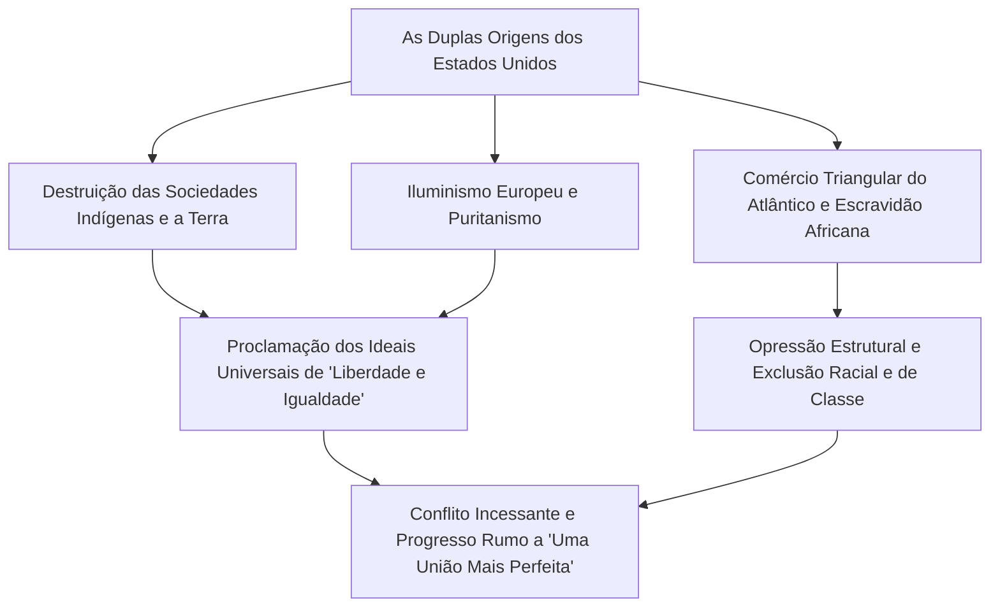
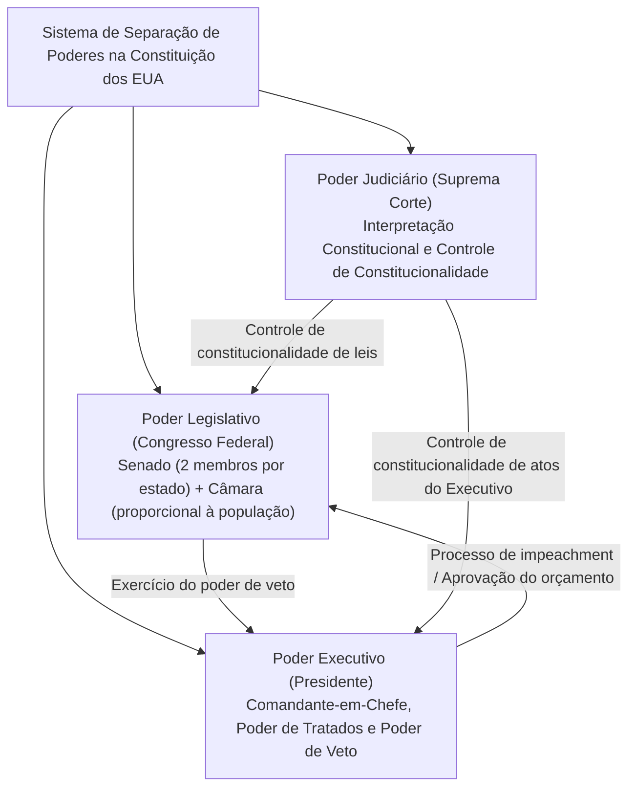
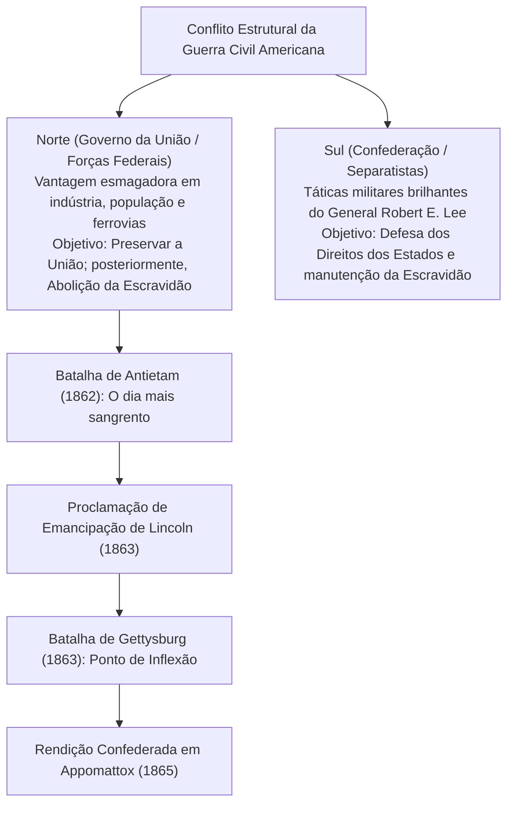
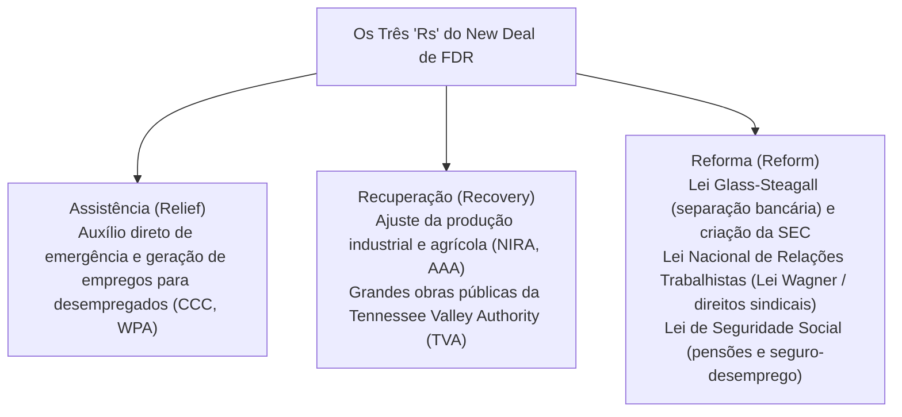
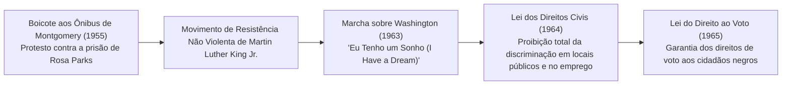
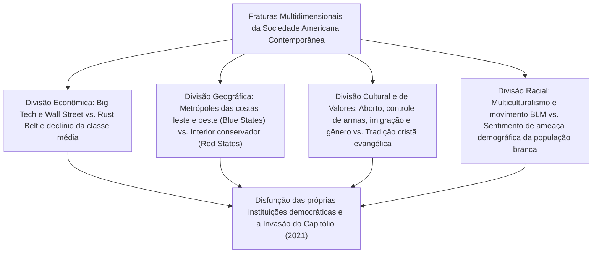
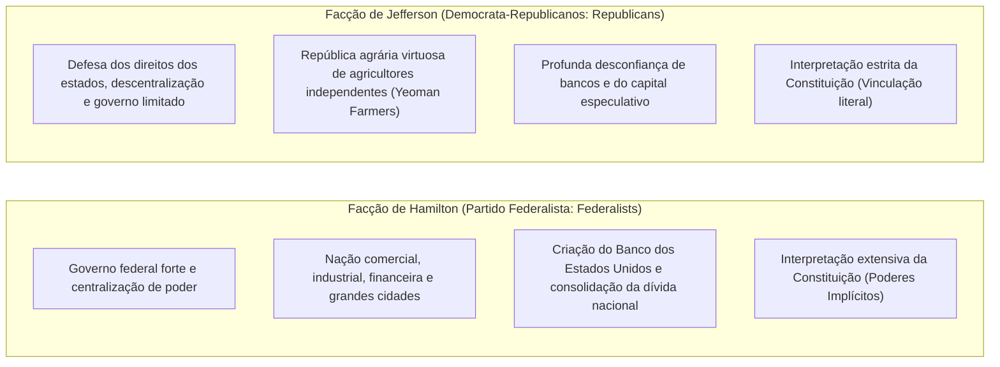

## 1. Introdução: Os Estados Unidos como uma Nação-Experimento

### 1.1 A Ilusão do "Novo Mundo" e a Realidade das Civilizações Indígenas

Ao narrar a história dos Estados Unidos da América, predominou durante muito tempo uma narrativa mítica: a de uma "terra prometida desbravada por europeus brancos que buscavam a liberdade na vastidão de um deserto selvagem". Contudo, os avanços da antropologia e da historiografia a partir da segunda metade do século XX revelaram de forma inequívoca que, muito antes da chegada dos europeus, floresciam neste continente civilizações indígenas (nativos americanos) autóctones e altamente sofisticadas, desenvolvidas ao longo de milênios.

Existiam ecossistemas sociais ricos e heterogêneos, exemplificados pela civilização dos construtores de montículos (Mound Builders), cujo expoente máximo foi a monumental metrópole de Cahokia, no vale do rio Mississippi; pelos refinados complexos de habitações em penhascos da cultura Anasazi (ancestrais dos povos Pueblo), no Sudoeste; e pela Confederação Iroquesa (Haudenosaunee), no Nordeste, onde cinco nações se uniram para forjar um sofisticado sistema federativo democrático. A partir da chegada de Cristóvão Colombo em 1492, a introdução de patógenos europeus como varíola, sarampo e influenza (o chamado "Intercâmbio Colombiano"), somada a campanhas brutais de conquista, dizimou entre 80% e 90% da população nativa. Compreender lucidamente que o "Novo Mundo" foi erigido sobre os escombros dessa catástrofe humana é o ponto de partida indispensável para qualquer análise crítica da história norte-americana.

---

### 1.2 Os Pais Peregrinos, o Pacto do Mayflower e a Marca Espiritual do Puritanismo

Após a fundação do assentamento de Jamestown (na Colônia da Virgínia) em 1607, o alicerce espiritual da identidade nacional americana foi estabelecido pelos puritanos separatistas (os Pais Peregrinos ou *Pilgrim Fathers*), que desembarcaram na Baía de Massachusetts a bordo do navio *Mayflower* em 1620.

Firmado a bordo do navio momentos antes do desembarque, o **Pacto do Mayflower (*Mayflower Compact*)** constituiu um marco sem precedentes na história do autogoverno: em vez de aceitar uma autoridade imposta de cima por reis ou senhores feudais, proclamou **"a criação de um corpo político civil autogovernado, estabelecendo leis justas e iguais com base no consentimento voluntário de indivíduos livres (um contrato social)"**.

O ideal de uma "Cidade sobre a Colina" (*A City upon a Hill*), pregado pelo líder John Winthrop — a convicção convicta de que uma comunidade puritana em aliança com Deus deveria resplandecer como farol e modelo para o mundo inteiro —, tornou-se o DNA primordial do "Excepcionalismo Americano" (*American Exceptionalism*), a crença de que os Estados Unidos possuem uma missão histórica e providencial de liderar a humanidade.

---

## 2. Da Era Colonial à Revolução de Independência e o Nascimento da Constituição

### 2.1 O Desenvolvimento das Treze Colônias e o Fim da "Negligência Salutar"

As Treze Colônias britânicas estabelecidas ao longo da costa atlântica desenvolveram estruturas socioeconômicas marcadamente distintas: a região Norte, na Nova Inglaterra (voltada ao comércio, à pesca, à agricultura em pequena escala e fortemente alicerçada na fé puritana); as Colônias Centrais (focadas na produção de grãos e marcadas por um mosaico de pluralismo étnico e religioso); e as Colônias do Sul (dominadas por grandes plantações agrícolas de tabaco, arroz e anil sustentadas pela mão de obra de africanos escravizados).

Até meados do século XVIII, a metrópole britânica praticou em relação às suas colônias uma política conhecida como **"Negligência Salutar" (*Salutary Neglect*)**, concedendo-lhes ampla autonomia de fato e abstendo-se de uma ingerência rigorosa. Não obstante, embora a Grã-Bretanha tenha saído vitoriosa da Guerra Franco-Indígena (1754–1763) — o teatro norte-americano da Guerra dos Sete Anos pela hegemonia global —, o conflito deixou a Coroa sobrecarregada por um astronômico endividamento financeiro.

O Parlamento britânico mudou drasticamente de curso, impondo uma série de tributos sobre os colonos sob a justificativa de custear as despesas com a defesa militar:
- **A Lei do Açúcar (1764)** e a **Lei do Selo (1765)**: esta última exigia selos fiscais em jornais, panfletos, documentos legais e até em cartas de baralho.
- Os colonos reagiram com veemente indignação, articulando o lema constitucional **"Nenhuma tributação sem representação" (*No taxation without representation*)** e deflagrando boicotes generalizados a produtos britânicos.
- Após o Massacre de Boston em 1770 e a célebre Festa do Chá de Boston em 1773 (quando carregamentos de chá da Companhia das Índias Orientais foram jogados ao mar), a metrópole respondeu com medidas punitivas severas — as chamadas "Leis Intoleráveis" ou "Leis Coercitivas" de 1774. A partir desse momento, a confrontação armada tornou-se inevitável.

---

### 2.2 Thomas Paine, *Senso Comum* e a Declaração de Independência (1776)

Em abril de 1775, os disparos ecoaram nas Batalhas de Lexington e Concord, deflagrando oficialmente a Guerra da Independência Americana. À época, grande parte dos habitantes coloniais ainda hesitava, oscilando entre a lealdade à Coroa britânica e o anseio radical de separação e independência.

Essa vacilação coletiva foi dissipada de forma fulminante pela publicação anônima, em janeiro de 1776, do panfleto **_Senso Comum_ (*Common Sense*)**, de Thomas Paine. Com linguagem direta, acessível e inflamada, Paine demonstrou o absurdo intrínseco de uma ilha governar perpetuamente um continente imenso, denunciando a monarquia hereditária como uma instituição perversa que afronta as leis da natureza e a dignidade humana. O opúsculo vendeu centenas de milhares de exemplares e incendiou a chama revolucionária por todas as colônias.

Em 4 de julho de 1776, o Segundo Congresso Continental reunido na Filadélfia aprovou a **Declaração de Independência dos Estados Unidos (*Declaration of Independence*)**, redigida por Thomas Jefferson.

> "Consideramos estas verdades como autoevidentes: que todos os homens são criados iguais, dotados pelo seu Criador de certos direitos inalienáveis, entre os quais estão a vida, a liberdade e a busca da felicidade; que, para assegurar esses direitos, governos são instituídos entre os homens, derivando seus justos poderes do consentimento dos governados."

Ao sintetizar a filosofia dos direitos naturais e a teoria do contrato social de John Locke, essa proclamação magistral legitimou o direito do povo de resistir à tirania e rebelar-se contra o poder despótico (o direito de revolução), consagrando-se como um dos monumentos universais da liberdade na história humana.

O Exército Continental, sob o comando-geral de George Washington, resistiu a privações lancinantes de suprimentos e ao rigor dos invernos, empreendendo uma guerra de desgaste calculada. A vitória decisiva na Batalha de Saratoga (1777) viabilizou alianças estratégicas e militares cruciais com a França, a Espanha e as Províncias Unidas (Holanda). Em 1781, na Batalha de Yorktown, as tropas combinadas cercaram e forçaram a capitulação do exército britânico principal. Finalmente, com a assinatura do Tratado de Paris em 1783, o Império Britânico reconheceu formal e plenamente a independência dos Estados Unidos da América.

---

### 2.3 O Fracasso dos Artigos da Confederação e a Convenção Constitucional da Filadélfia (1787)

Logo após conquistar a independência, a nova entidade política regia-se pelos Artigos da Confederação (*Articles of Confederation*), ratificados em 1781, configurando-se apenas como uma frouxa aliança de treze repúblicas soberanas independentes (uma confederação).
- O governo central (o Congresso da Confederação) não dispunha de prerrogativas para cobrar impostos diretos, manter um exército permanente em tempo de paz nem regular o comércio interestadual ou exterior.
- Diante da eclosão da Rebelião de Shays (1786) — uma insurreição armada de fazendeiros endividados e veteranos de guerra de Massachusetts fustigados por execuções de hipotecas e tributação escorchante —, o governo confederado mostrou-se incapaz de mobilizar tropas federais para conter o levante, expondo o espectro iminente de desintegração nacional e anarquia.

No verão de 1787, cinquenta e cinco delegados — incluindo James Madison, Alexander Hamilton e Benjamin Franklin, reverenciados como os "Pais Fundadores" (*Founding Fathers*) — reuniram-se no Pennsylvania State House (hoje Independence Hall), na Filadélfia, com a missão de redigir a duradoura **Constituição dos Estados Unidos**.

- **O Grande Compromisso (Compromisso de Connecticut)**: Conciliou as reivindicações dos estados populosos por representação proporcional (o Plano da Virgínia) com a exigência dos estados menores por representação paritária (o Plano de Nova Jersey), instituindo um parlamento bicameral: o Senado (com dois senadores por estado, em igualdade estrita) e a Câmara dos Deputados (com distribuição proporcional à população).
- **O Compromisso dos Três Quintos (*Three-Fifths Compromise*)**: Para viabilizar a adesão dos estados escravistas do Sul sem conceder-lhes um domínio desmedido no Congresso, estabeleceu-se a controversa cláusula de que cada pessoa escravizada seria contada como "três quintos" de um indivíduo livre para fins de representação legislativa e tributação direta.
- **Freios e Contrapesos (*Checks and Balances*)**: Inspirando-se na doutrina da separação de poderes de Montesquieu, a carta magna dividiu o poder entre o Executivo (Presidência), o Legislativo (Congresso) e o Judiciário (Suprema Corte e tribunais federais), engendrando uma intrincada blindagem institucional destinada a impedir a concentração tirânica de poder em qualquer autoridade ou facção.

---

## 3. Expansão Territorial, o "Destino Manifesto" e o Turbilhão da Guerra Civil

### 3.1 O "Destino Manifesto" e a Expansão Continental

Durante a primeira metade do século XIX, os Estados Unidos expandiram seus domínios territoriais em direção ao Oeste com um ímpeto vertiginoso:
- **1803: A Compra da Louisiana (*Louisiana Purchase*)**: O presidente Thomas Jefferson adquiriu de Napoleão Bonaparte o imenso território da Louisiana a oeste do rio Mississippi pela quantia irrisória de 15 milhões de dólares, duplicando instantaneamente a extensão geográfica do país.
- **1823: A Doutrina Monroe (*Monroe Doctrine*)**: O presidente James Monroe formulou o postulado da não intervenção recíproca e do isolacionismo hemisférico, asseverando perante as potências europeias que qualquer ingerência colonial no continente americano seria considerada uma agressão aos próprios Estados Unidos ("a América para os americanos").
- **O Destino Manifesto (*Manifest Destiny*)**: Propagou-se na consciência coletiva a doutrina ideológica segundo a qual os Estados Unidos haviam sido divinamente predestinados e comissionados a expandir suas fronteiras de costa a costa, do Atlântico ao Pacífico, disseminando a liberdade e as instituições republicanas.

Nas sombras dessa expansão fulgurante, o território e a subsistência dos povos autóctones foram implacavelmente esmagados. Sob o mandato do presidente Andrew Jackson, a Lei de Remoção Indígena (*Indian Removal Act*) de 1830 forçou as chamadas "Cinco Tribos Civilizadas" — notadamente os Cherokee — a abandonarem suas terras ancestrais nas florestas orientais e marcharem a pé por milhares de quilômetros sob invernos rigorosos em direção ao Território Indígena (atual Oklahoma). Milhares sucumbiram à fome, à exaustão e às moléstias nessa marcha fúnebre, gravada para sempre nos anais da história como a **"Trilha das Lágrimas" (*Trail of Tears*)**.

Com a vitória na Guerra Mexicano-Americana (1846–1848), os EUA anexaram a Califórnia, o Novo México e consolidaram o domínio sobre o Texas (Tratado de Guadalupe Hidalgo). Impulsionada pela Corrida do Ouro de 1848 na Califórnia, a jovem república consumava sua transformação definitiva em uma colossal potência continental bioceânica.

---

### 3.2 A Crise da Escravidão e o Acirramento da Fratura Nacional

Todavia, a cada nova extensão territorial em direção ao Oeste, uma interrogação devastadora colocava a integridade da União em xeque: **"Deveria a escravidão ser autorizada ou terminantemente proibida nos novos territórios e estados recém-incorporados?"**

- **A Economia do Norte**: Movida pelo avanço célere da Revolução Industrial, alicerçada no trabalho livre assalariado, na manufatura diversificada, no comércio marítimo e nas finanças. Defendia tarifas alfandegárias protecionistas para blindar o mercado interno.
- **A Economia do Sul**: Fundamentada no latifúndio monocultor algodoeiro — o império do "Rei Algodão" (*King Cotton*) — e na exploração desumana de cerca de 4 milhões de afro-americanos submetidos à escravidão. Favorecia o livre-comércio para escoar sua produção primária para as fábricas têxteis da Grã-Bretanha e da Europa continental.

Para preservar o tênue equilíbrio de poder político no Senado entre "estados livres" e "estados escravistas", sucessivos arranjos legislativos paliativos foram costurados, como o Compromisso do Missouri de 1820 (que proibia a escravidão nos territórios ao norte do paralelo 36°30') e o Compromisso de 1850 (que incluiu o draconiano Ato dos Escravos Fugitivos).

Contudo, a promulgação da Lei de Kansas-Nebraska em 1854 — que consagrou a tese da "soberania popular", transferindo a decisão sobre a escravidão ao voto dos próprios colonos locais — desencadeou um conflito sangrento conhecido como "Bleeding Kansas" (o Kansas Ensanguentado). O golpe derradeiro na coesão constitucional deu-se com a estarrecedora decisão da Suprema Corte no **Caso Dred Scott contra Sandford (1857)**, que declarou que os negros (sejam escravizados ou livres) não eram cidadãos perante a Constituição e, portanto, "não possuíam direitos que um homem branco estivesse obrigado a respeitar", afirmando ainda a inconstitucionalidade de qualquer proibição federal da escravidão nos territórios. A sentença ultrajou e radicalizou a opinião pública antiescravista no Norte.

---

### 3.3 A Guerra Civil Americana (1861–1865): Sangrenta Reunificação e Emancipação dos Escravizados

Nas eleições presidenciais de 1860, a vitória do candidato republicano Abraham Lincoln, cuja plataforma proibia terminantemente a expansão da escravidão para novos territórios, precipitou a crise final: a Carolina do Sul e outros seis estados do Sul declararam formalmente a secessão da União, constituindo os Estados Confederados da América (*Confederate States of America*).

Em abril de 1861, o bombardeio confederado contra as guarnições federais em Fort Sumter deflagrou a **Guerra Civil Americana** (*American Civil War* ou Guerra de Secessão).

Com clarividência moral e política, Lincoln transformou o caráter do conflito: de uma mera repressão armada a uma insurreição separatista em prol da preservação formal da União, converteu a luta em uma cruzada universal pela redenção e liberdade humana:
- **1º de janeiro de 1863: Proclamação de Emancipação (*Emancipation Proclamation*)**: Decretou que todos os indivíduos escravizados nas regiões em rebelião contra a União estavam irrevogavelmente livres. Essa medida ensejou o alistamento maciço de soldados negros nas fileiras federais (cerca de 180 mil combatentes) e inviabilizou moral e diplomaticamente o reconhecimento da Confederação pelo Reino Unido e pela França.
- **Novembro de 1863: O Discurso de Gettysburg (*Gettysburg Address*)**: Lincoln imortalizou os mortos no campo de batalha concitando os sobreviventes a assegurarem que o **"governo do povo, pelo povo e para o povo (*government of the people, by the people, for the people*)"** jamais perecesse sobre a face da Terra.

Após anos de guerra total e campanhas devastadoras de terra arrasada (como a Marcha para o Mar do General William T. Sherman), o General Robert E. Lee rendeu-se incondicionalmente ao General Ulysses S. Grant em Appomattox Court House, Virgínia, em abril de 1865. Ao custo estarrecedor de mais de 600 mil vidas — a maior tragédia bélica e humana da história americana —, a União triunfou. Foram promulgadas as chamadas "Emendas da Reconstrução": a Décima Terceira Emenda (abolição formal da escravidão), a Décima Quarta Emenda (devido processo legal e igual proteção perante as leis) e a Décima Quinta Emenda (proibição de negar o direito ao voto com base em raça). Os Estados Unidos deixaram de ser concebidos no plural como uma união frouxa de entidades soberanas para consolidarem-se como um Estado-nação indivisível.

No entanto, com o encerramento do conturbado período da Reconstrução (*Reconstruction*), as elites brancas dos estados sulistas instituíram o regime segregacionista das "Leis Jim Crow" (*Jim Crow laws*), inaugurando décadas sombrias de opressão racial sistemática, humilhações cotidianas e o terror letal dos linchamentos perpetrados pela Ku Klux Klan (KKK).

---

## 4. A Era Dourada (*Gilded Age*), a Revolução Industrial e a Alvorada do Imperialismo

### 4.1 A Ascensão do Grande Capital e a "Era Dourada"

Entre o término da Guerra Civil e o limiar do século XX, a economia dos Estados Unidos experimentou uma expansão industrial e financeira sem paralelo na história global. O escritor Mark Twain cunhou para essa época o termo irônico **"Era Dourada" (*Gilded Age*)** — aludindo a algo cuja superfície reluz como ouro maciço, mas cujo interior se encontra carcomido pela corrupção, avareza e exploração desenfreada.

- A conclusão da Primeira Ferrovia Transcontinental em 1869 unificou o imenso território continental em um mercado interno singular e coeso.
- **O Monopólio dos "Barões Ladrões" (*Robber Barons*)**:
  - John D. Rockefeller fundou a Standard Oil, que chegou a concentrar mais de 90% de todo o refino de petróleo dos Estados Unidos.
  - Andrew Carnegie erigiu um colosso da siderurgia através da Carnegie Steel, dominando a produção de trilhos e aço para a moderna infraestrutura.
  - J. P. Morgan capitaneou a concentração bancária e financeira, estruturando megatrustes como a fundação da U.S. Steel, a primeira corporação bilionária do planeta.
- Inovações capitais como a eletrificação urbana de Thomas Edison, o telefone de Alexander Graham Bell e, subsequentemente, a linha de montagem industrial em série de Henry Ford (o Fordismo) impulsionaram os Estados Unidos ao posto de maior superpotência manufatureira do mundo, superando com folga o Reino Unido e a Alemanha na produção industrial global.

Em contrapartida, a abissal disparidade de renda e as condições de trabalho desumanas culminaram em conflitos laborais violentos, como a Greve de Homestead (1892) e a Greve de Pullman (1894). Paralelamente, vagas de dezenas de milhões de imigrantes desembarcados da Europa (italianos, irlandeses, eslavos e judeus da Europa Oriental) amontoavam-se em cortiços insalubres (*tenements*) nos bairros operários das metrópoles industriais em expansão.

---

### 4.2 O Desaparecimento da Fronteira e a Projeção Imperial Ultramarina

Com base no censo populacional de 1890, o historiador Frederick Jackson Turner proferiu sua célebre tese sobre o "Fechamento da Fronteira" (*The Closing of the Frontier*). Desvanecida a fronteira ocidental — que até então servira como catalisador vital para a identidade democrática e a energia expansionista americana —, os olhos da liderança política e econômica voltaram-se irresistivelmente para além-mar, visando os mercados do Pacífico e da América Latina, estimulados pelas teorias geopolíticas de poder naval de Alfred Thayer Mahan (*The Influence of Sea Power upon History*).

- **1898: A Guerra Hispano-Americana**: Tendo como estopim a explosão do encouraçado USS *Maine* no porto de Havana, os Estados Unidos entraram em guerra contra a Espanha e alcançaram uma vitória acachapante em poucos meses. O Tratado de Paris de 1898 transferiu o domínio de Porto Rico, Guam e das Filipinas para Washington, concomitantemente à anexação do Havaí, convertendo o país de uma república continental em um império marítimo intercontinental.
- **A Política de Portas Abertas (*Open Door Policy*, 1899)**: O secretário de Estado John Hay emitiu notas diplomáticas exigindo que as potências coloniais que retalhavam a China garantissem igualdade de oportunidades comerciais e a integridade territorial chinesa, assegurando o acesso irrestrito dos interesses mercantis americanos ao imenso mercado asiático.

No plano interno, diante dos desmandos das corporações monopolistas e da corrupção nas máquinas partidárias urbanas, eclodiu o movimento do **Progressismo (*Progressivism*)**, liderado por presidentes como Theodore Roosevelt (famoso pelo desmantelamento de trustes predatórios e pela preservação ambiental) e Woodrow Wilson. Essa era reformista ensejou a aplicação vigorosa da Lei Antitruste Sherman, a criação do Federal Reserve System (o banco central norte-americano, em 1913), a introdução do imposto de renda federal (Décima Sexta Emenda) e a conquista histórica do sufrágio feminino com a Décima Nona Emenda (1920).

---

## 5. As Duas Guerras Mundiais, a Grande Depressão e o Estabelecimento da Pax Americana

### 5.1 A Primeira Guerra Mundial e os "Loucos Anos 20"

Ao eclodir a Primeira Guerra Mundial em 1914, os Estados Unidos mantiveram inicialmente uma postura de estrita neutralidade oficial. Todavia, o fornecimento colossal de insumos bélicos, matérias-primas e empréstimos financeiros às potências da Entente transformou o país de nação devedora na maior credora internacional do planeta. A declaração da Alemanha de guerra submarina irrestrita contra o tráfego marítimo e a interceptação do Telegrama Zimmermann (no qual Berlim propunha uma aliança militar secreta com o México) forçaram a entrada norte-americana na guerra em 1917.

O presidente Woodrow Wilson proclamou os seus **"Quatorze Pontos" (*Fourteen Points*)**, defendendo o banimento da diplomacia secreta, a liberdade dos mares, a autodeterminação dos povos e a fundação da Liga das Nações para salvaguardar a segurança coletiva internacional. Não obstante, o Senado dos EUA, apegado à tradição isolacionista e temeroso da perda de soberania nacional, recusou-se a ratificar o Tratado de Versalhes, mantendo o país fora da organização multilateral que ele próprio concebera.

Na década de 1920, a sociedade norte-americana mergulhou nos chamados **"Loucos Anos 20" (*Roaring Twenties*)**, uma época áurea caracterizada pela emergência vigorosa da cultura de consumo de massa:
- A rápida popularização dos aparelhos de rádio, dos automóveis fabricados em escala com o Ford Modelo T, das produções cinematográficas de Hollywood, do jazz e dos eletrodomésticos transformou a vida cotidiana dos lares médios.
- Os mercados financeiros foram tomados por uma euforia desenfreada de especulação acionária, difundindo-se a ilusão de uma "prosperidade eterna".
- Em contrapartida, a promulgação da Lei Seca (Décima Oitava Emenda) gerou um mercado clandestino bilionário de contrabando de bebidas alcoólicas e fomentou a ascensão brutal do crime organizado e da máfia (cujo expoente foi Al Capone), enquanto o obscurantismo e a xenofobia ganhavam força com o ressurgimento da KKK e a aprovação de leis restritivas de cotas de imigração por nacionalidade em 1924.

---

### 5.2 A Grande Depressão e o New Deal

Em 24 de outubro de 1929, a fatídica "Quinta-Feira Negra" (*Black Thursday*), o colapso catastrófico dos preços das ações na Bolsa de Nova York (Wall Street) detonou a maior crise sistêmica do capitalismo moderno: a Grande Depressão.
Milhares de instituições bancárias faliram em todo o país, a taxa de desemprego atingiu a impressionante marca de 25% (um em cada quatro trabalhadores fora do mercado de trabalho) e severas tempestades de poeira no Meio-Oeste (o *Dust Bowl*) destruíram a agricultura, reduzindo centenas de milhares de famílias rurais à miséria absoluta. A abordagem ortodoxa e de *laissez-faire* do presidente Herbert Hoover revelou-se flagrantemente ineficaz para estancar a sangria econômica.

Eleito em 1932 e empossado em 1933, o presidente Franklin Delano Roosevelt (FDR) implementou de imediato o ambicioso pacote de intervenções governamentais conhecido como **"New Deal"**.

Ao antecipar a aplicação prática das teorias do economista John Maynard Keynes por meio da intervenção regulatória e fiscal do Estado na economia e da estruturação das fundações de um Estado de bem-estar social, o New Deal expandiu de maneira sem precedentes o poder do Executivo federal, tornando-se o paradigma definidor do liberalismo americano contemporâneo.

---

### 5.3 A Segunda Guerra Mundial e a Conquista da Hegemonia Global

Em 7 de dezembro de 1941, o ataque fulminante das forças japonesas contra a base naval de Pearl Harbor, no Havaí — classificado por Roosevelt como "uma data que viverá na infâmia" —, precipitou a entrada definitiva dos Estados Unidos na Segunda Guerra Mundial.

Proclamando-se o **"Arsenal da Democracia" (*Arsenal of Democracy*)**, a nação mobilizou todo o seu incomparável aparato industrial civil para a produção bélica em escala gigantesca: linhas de montagem automobilísticas foram convertidas na produção contínua de tanques e aviões de guerra, e milhões de mulheres ingressaram em massa nas fábricas industriais, personificadas pelo símbolo cultural de "Rosie the Riveter".
- No Teatro Europeu, o desembarque anfíbio bem-sucedido na Normandia (o Dia D, em junho de 1944) abriu a frente ocidental que levou ao aniquilamento do regime nazista de Adolf Hitler.
- No Teatro do Pacífico, a estratégia implacável de "salto de ilha em ilha" (*island hopping*) impeliu o recuo das forças imperiais japonesas até sua capitulação definitiva.
- Por fim, a consumação do ultrassecreto Projeto Manhattan levou ao desenvolvimento da bomba atômica e ao seu lançamento catastrófico sobre as cidades de Hiroshima e Nagasaki em agosto de 1945.

No término das hostilidades mundiais, os Estados Unidos ostentavam uma superioridade material estarrecedora: respondiam por cerca de metade de toda a produção manufatureira do globo, detinham aproximadamente 70% das reservas mundiais de ouro monetário e desfrutavam do monopólio absoluto das armas nucleares.
Pelo Acordo de Bretton Woods em 1944, erigiu-se a **arquitetura financeira e monetária internacional ancorada no dólar norte-americano como moeda de reserva global**, acompanhada pela criação do Fundo Monetário Internacional (FMI) e do Banco Mundial; em 1945, na Conferência de São Francisco, foi chancelada a Carta das Nações Unidas. Inaugurava-se formal e factualmente a era da **"Pax Americana"**.

---

## 6. A Estrutura da Guerra Fria, o Movimento dos Direitos Civis e as Glórias e Angústias Americanas

### 6.1 A Guerra Fria e a Sombra da Dissuasão Nuclear

Das cinzas da Segunda Guerra Mundial emergiu a Guerra Fria (*Cold War*): um confronto multidimensional e planetário entre duas superpotências antagônicas — os Estados Unidos, liderando o bloco capitalista liberal, e a União Soviética (URSS), à frente do bloco socialista.

- **1947: A Doutrina Truman (*Truman Doctrine*)**: Estabeleceu formalmente a estratégia de "Contenção" (*Containment Policy*) concebida para barrar o avanço expansionista do comunismo soviético em todo o mundo.
- **O Plano Marshall (*Marshall Plan*)**: Um programa econômico de ajuda financeira massiva canalizado para a reconstrução dos países da Europa Ocidental devastados pela guerra, visando mitigar a atração eleitoral de partidos comunistas locais e reaquecer os fluxos do comércio transatlântico.
- **1949: Fundação da Organização do Tratado do Atlântico Norte (OTAN / NATO)**: Criação de uma aliança militar permanente consagrando o princípio da defesa coletiva.
- A deflagração da Guerra da Coreia (1950–1953) e, no plano doméstico, a paranoia persecutória contra supostos infiltrados comunistas conhecida como "Caça às Bruxas" ou Macarthismo (*McCarthyism*), conduzida pelo senador Joseph McCarthy.

Em outubro de 1962, a dramática **Crise dos Mísseis de Cuba** levou a humanidade à beira da aniquilação termonuclear: ante a instalação secreta de ogivas e mísseis balísticos soviéticos na ilha caribenha de Cuba, o presidente John F. Kennedy impôs um bloqueio naval e confrontou o premiê soviético Nikita Khrushchev. O desfecho tenso consolidou o equilíbrio do terror fundado na doutrina da Destruição Mútua Assegurada (*Mutual Assured Destruction* - MAD).

---

### 6.2 O Movimento dos Direitos Civis: A Luta pela Igualdade Substantiva

No pós-guerra, enquanto a classe média branca desfrutava do sonho americano nos subúrbios ajardinados (*suburbia*), munida de televisores, automóveis familiares e eletrodomésticos de última geração, a população afro-americana — sobretudo nos estados do Sul — permanecia aprisionada sob o jugo violento da segregação racial e da exclusão econômica e política.

Em 1954, a decisão histórica da Suprema Corte no caso **Brown contra o Conselho de Educação (*Brown v. Board of Education*)** declarou formalmente que a segregação racial nas escolas públicas era "inerentemente desigual", sepultando a doutrina anterior e ateando fogo ao Movimento pelos Direitos Civis em todo o território nacional.

As campanhas de ação direta e não violenta encabeçadas pelo reverendo Martin Luther King Jr. (como os protestos sentados em lanchonetes [*sit-ins*], as Caravanas da Liberdade [*Freedom Rides*] e as grandes marchas de protesto) foram brutalmente repelidas pelas forças policiais sulistas com cães de ataque e jatos d'água de alta pressão. As imagens chocantes transmitidas em rede nacional abalaram profundamente a consciência moral da opinião pública. Sob a liderança do presidente Lyndon B. Johnson, foram sancionadas a **Lei dos Direitos Civis de 1964** (que proscreveu a discriminação em instalações públicas e nas contratações) e a **Lei do Direito ao Voto de 1965** (que erradicou os artifícios sulistas que impediam o voto negro), desmantelando juridicamente o aparato de segregação erigido por quase um século.

---

### 6.3 O Atoladeiro da Guerra do Vietnã e a Contracultura

Contudo, refém da "Teoria do Dominó" (a suposição geopolítica de que a queda de um país para a órbita comunista provocaria o colapso subsequente das nações vizinhas no Sudeste Asiático), a administração americana mergulhou em uma intervenção militar desastrosa na Guerra do Vietnã (1965–1973).
A sangrenta guerra de guerrilha nas selvas, o lançamento de desfolhantes químicos devastadores como o Agente Laranja, atrocidades escandalosas como o Massacre de My Lai e a morte trágica de mais de 58 mil jovens conscriptos americanos pulverizaram os laços de confiança e credibilidade entre a sociedade civil e os governantes em Washington (*credibility gap*).

Movimentos de protesto antiguerra incendiaram os campi universitários por toda a nação, convergindo em uma exuberante e combativa **"Contracultura" (*Counterculture*)**, caracterizada pelo movimento hippie, pelos acordes rebeldes do rock (culminando no Festival de Woodstock de 1969), pela liberação sexual, pelo feminismo da segunda onda e pelo despertar do ambientalismo moderno. Em 1974, após a conspiração para obstruir a justiça no infame Escândalo de Watergate, o presidente Richard Nixon tornou-se o primeiro titular do cargo na história americana a renunciar, lançando o país em um período de profunda desilusão moral e institucional, agravado pela crise econômica da estagflação durante a conturbada presidência de Jimmy Carter.

---

## 7. Da Revolução Reagan ao Pós-Guerra Fria, o 11 de Setembro e as Profundas Fraturas Contemporâneas

### 7.1 A Revolução Reagan e o Fim da Guerra Fria

Em 1980, empunhando a promessa patriótica de restauração da grandeza e da confiança nacional, o republicano Ronald Reagan obteve uma vitória eleitoral esmagadora.

- **Reaganomics**: Alicerçada na teoria econômica do lado da oferta (*supply-side economics*), implementou amplas reduções de impostos corporativos e de renda, desregulamentação financeira e industrial, contenção dos gastos sociais de bem-estar social e política monetária austera. Propagou globalmente o ideário do "Estado mínimo" e a ascensão hegemônica do neoliberalismo.
- **Confronto com o "Império do Mal"**: Rechaçando a política de distensão, Reagan canalizou orçamentos colossais para a modernização das forças armadas e lançou a Iniciativa de Defesa Estratégica (SDI, popularmente conhecida como "Guerra nas Estrelas"), acelerando uma corrida armamentista de alta tecnologia que exauriu estruturalmente a cambaleante economia planificada soviética.
- A queda do Muro de Berlim em 1989 e a consequente dissolução formal da União Soviética em 1991 selaram o término de quase meio século de Guerra Fria com o triunfo inconteste dos Estados Unidos. O cientista político Francis Fukuyama proclamou esse instante como o "Fim da História" — o triunfo derradeiro da democracia liberal e da economia de mercado sobre seus rivais ideológicos.

---

## 7.1.5 A Guerra do Golfo (1991) e a Revolução Militar da Doutrina Powell

Em agosto de 1990, no limiar da ordem pós-Guerra Fria, as forças iraquianas do ditador Saddam Hussein invadiram de surpresa e anexaram o vizinho emirado do Kuwait. O presidente George H. W. Bush articulou uma resposta diplomática firme, obtendo resoluções autorizativas do Conselho de Segurança da ONU e forjando uma coalizão militar multinacional composta por 34 nações para deflagrar, em janeiro de 1991, a Operação Tempestade no Deserto (*Operation Desert Storm*).

### Uma Doutrina Militar para Superar o Pesadelo do Vietnã
Destilando as lições amargas e traumáticas deixadas pelo atoleiro da Guerra do Vietnã, o presidente do Estado-Maior Conjunto das Forças Armadas, general Colin Powell, concebeu e aplicou a célebre **"Doutrina Powell" (*Powell Doctrine*)**, articulada em princípios estratégicos estritos:
1. A existência de uma ameaça direta, vital e manifesta aos interesses da segurança nacional.
2. O recurso à força bélica apenas como *última ratio*, após o esgotamento cabal de todas as alternativas diplomáticas, políticas e econômicas.
3. O estabelecimento prévio de objetivos militares claros, precisos e tangíveis.
4. O desdobramento concentrado e fulminante de **"Poder de Fogo Esmagador" (*Overwhelming Force*)**, neutralizando qualquer capacidade de resistência do inimigo e abreviando drasticamente a duração do conflito.
5. A definição expressa e inequívoca de uma estratégia de saída (*exit strategy*) antes do início das operações de combate.

As Forças Armadas norte-americanas exibiram ao vivo nos televisores de todo o mundo, via coberturas pioneiras da CNN, a superioridade devastadora de sua tecnologia bélica de ponta: caças furtivos invisíveis ao radar (F-117 Nighthawk), bombas guiadas a laser e por GPS (as chamadas "bombas inteligentes"), mísseis de cruzeiro Tomahawk e baterias antiaéreas Patriot. Em uma campanha terrestre relâmpago de apenas 100 horas de duração, as forças aliadas esfacelaram o dispositivo militar iraquiano.

O presidente Bush proclamou jubiloso que "o fantasma do Vietnã foi finalmente sepultado sob as areias do deserto", fortalecendo a convicção de que os Estados Unidos, incontestes na condição de "superpotência solitária", estavam destinados a liderar uma "Nova Ordem Mundial" (*New World Order*). Contudo, com profunda ironia histórica, a memória embriagadora dessa vitória acachapante obscureceu os alertas de prudência da própria Doutrina Powell, gestando a arrogância trágica (*hybris*) que culminaria no atoleiro e na desastrosa ocupação na invasão do Iraque em 2003.

## 7.2 Luzes e Sombras da Globalização e a Revolução da Tecnologia da Informação

Durante os mandatos do presidente Bill Clinton na década de 1990, a conjugação entre a redução orçamentária dos gastos de defesa decorrente do pós-Guerra Fria (os "dividendos da paz") e a estrondosa revolução tecnológica impulsionada pela internet comercial e pelas empresas inovadoras do Vale do Silício gerou um ciclo de exuberância econômica sem precedentes, batizado de "Nova Economia" (*New Economy*).

Washington liderou ativamente a integração planetária dos mercados, ratificando o Tratado de Livre Comércio da América do Norte (NAFTA) e patrocinando o ingresso da China na Organização Mundial do Comércio (OMC). Não obstante, a globalização acelerada aliada à financeirização da economia produziu fraturas e assimetrias estruturais devastadoras no tecido social doméstico:
- Milhares de parques industriais e fábricas do setor manufatureiro migraram para o México e a China em busca de mão de obra barata, provocando a desindustrialização catastrófica do Meio-Oeste e o empobrecimento da classe trabalhadora no chamado Cinturão da Ferrugem (*Rust Belt*).
- Aprofundou-se um fosso socioeconômico e cultural intransponível entre as elites cosmopolitas, acadêmicas e financeiras das costas Leste e Oeste e as comunidades operárias do interior profundo e esquecido da América.

---

### 7.3 Os Atentados de 11 de Setembro e os Descaminhos da "Guerra ao Terror"

Em 11 de setembro de 2001, o sequestro e colisão de quatro aviões de passageiros por terroristas da rede al-Qaeda contra as torres gêmeas do World Trade Center em Nova York e o Pentágono em Washington infligiram o mais mortífero ataque direto em solo continental da história americana. A nação reagiu com uma onda avassaladora de comoção e fervor patriótico, levando o presidente George W. Bush a declarar a "Guerra Global ao Terrorismo" (*Global War on Terror*):

- A invasão do Afeganistão no final de 2001, com a subsequente deposição do regime Talibã que abrigava Osama bin Laden.
- A Invasão do Iraque em 2003, sob a acusação — desmentida pelos fatos — de que o regime de Saddam Hussein acumulava armas de destruição em massa (ADMs) e mantinha conluios com o terrorismo internacional.
- Todavia, nenhuma arma de destruição em massa foi encontrada no Iraque. A destruição das instituições estatais iraquianas mergulhou a região do Oriente Médio em um ciclo atroz de guerra civil sectária, abrindo caminho para a ascensão do grupo jihadista Estado Islâmico (ISIS). A empreitada custou a vida de milhares de militares americanos, drenou trilhões de dólares do tesouro público e deteriorou gravemente a autoridade moral e a legitimidade diplomática dos Estados Unidos no cenário internacional.

---

### 7.4 O Colapso Financeiro de 2008, Barack Obama, o Fenômeno Trump e o Desconcerto do Século XXI

Em 2008, a desintegração da bolha imobiliária dos empréstimos hipotecários de alto risco (*subprime*) em Wall Street desencadeou a falência do banco Lehman Brothers e a pior crise financeira internacional desde a Grande Depressão de 1929. Em meio ao abalo sísmico do sistema financeiro, Barack Obama ascendeu à presidência impulsionado pelas mensagens de esperança sintetizadas nos slogans "Change" e "Yes We Can", consagrando-se como o primeiro presidente afro-americano dos Estados Unidos. Apesar de ter aprovado a histórica Reforma do Sistema de Saúde (*Affordable Care Act*, o "Obamacare"), seu governo enfrentou uma ferrenha e intransigente oposição partidária catalisada pelo movimento conservador de base do *Tea Party*, aprofundando a polarização política em Washington.

Nas eleições presidenciais de 2016, canalizando o ressentimento virulento da classe operária branca do Cinturão da Ferrugem contra as elites políticas tradicionais de Washington e os efeitos corrosivos da globalização econômica, o magnata imobiliário e personalidade da mídia Donald Trump conquistou a Casa Branca sob a bandeira do nacionalismo populista.

Como culminou de forma dramática na trágica invasão do Capitólio em 6 de janeiro de 2021 por uma multidão partidária empenhada em barrar a certificação da vitória eleitoral de Joe Biden, os Estados Unidos da América contemporâneos encontram-se imersos no mais agudo colapso de consenso cívico e coesão constitucional desde os tempos sombrios da Guerra Civil.

---

---

## 2.4 A Ruptura Ideológica entre os Pais Fundadores: O Debate entre Hamilton e Jefferson

Logo após a ratificação da Constituição Federal, o gabinete ministerial do primeiro presidente, George Washington, tornou-se o palco de um dos debates intelectuais e políticos mais transcendentais da história moderna acerca do destino dos Estados Unidos: o confronto monumental entre o Secretário do Tesouro, Alexander Hamilton, e o Secretário de Estado, Thomas Jefferson.

### ① O Confronto das Visões Econômicas: Império Financeiro ou República Agrária?
- **A Visão de Hamilton**: Inspirava-se no modelo do Império Britânico como uma potência comercial, industrial, financeira e militarmente formidável. Propôs que o governo federal assumisse a totalidade das vultosas dívidas de guerra contraídas pelos estados individuais (a Lei de Assunção de Dívidas), consolidando o crédito nacional mediante a emissão de títulos da dívida pública e a fundação do Primeiro Banco dos Estados Unidos (*First Bank of the United States*). Projetava um Estado centralizado, dotado de indústria manufatureira pujante sob proteção alfandegária, um exército permanente bem equipado e uma burocracia governamental enérgica.
- **A Visão de Jefferson**: Acreditava piamente que as grandes metrópoles e as fábricas urbanas eram viveiros de degeneração moral e que cidadãos dependentes de salários patronais não poderiam exercer a autêntica virtude cívica da liberdade republicana. Para ele, a espinha dorsal e o bastião moral da república residiam no agricultor livre e autossuficiente (*yeoman farmer*), proprietário e cultivador de sua própria terra. Defendia um "governo mínimo", estritamente descentralizado, cuja atuação federal deveria circunscrever-se à defesa militar básica e às relações exteriores estritas.

### ② A Disputa sobre a Hermenêutica Constitucional: Poderes Implícitos vs. Construção Estrita
- A legitimidade jurídica do Congresso federal para instituir um banco central (o Banco dos Estados Unidos) desencadeou a cisão fundamental na interpretação da Constituição norte-americana.
- **A Construção Estrita de Jefferson (*Strict Construction*)**: Argumentava que o Artigo I, Seção 8 da Constituição — que enumera os poderes delegados ao Congresso — não continha menção expressa à prerrogativa de fundar bancos ou corporações financeiras. Para Jefferson, arrogar-se poderes não expressamente prescritos na letra constitucional constituía uma usurpação tirânica e inconstitucional das competências soberanas reservadas aos estados ou ao povo, violando a essência da Décima Emenda.
- **A Interpretação Ampla de Hamilton (*Loose Construction*)**: Alicerçou-se na Cláusula do "Necessário e Adequado" (*Necessary and Proper Clause* ou cláusula elástica, Artigo I, Seção 8, Cláusula 18), asseverando que, ao conferir ao governo federal os poderes explícitos de tributar, gerir a dívida e regular o comércio, a Constituição conferiu-lhe implicitamente os meios subsidiários imprescindíveis para exercer tais fins. Demonstrou a plena constitucionalidade dos chamados "Poderes Implícitos" (*Implied Powers*). Essa tese hamiltoniana foi consagrada juridicamente pela Suprema Corte sob a presidência do *Chief Justice* John Marshall no célebre acórdão *McCulloch contra Maryland* (1819), assentando as bases constitucionais perenes para a expansão do poder federal até a contemporaneidade.

---

## 3.6 A Virada Militar e Tecnológica da Guerra Civil e as Angústias da Reconstrução

A Guerra Civil Americana é reconhecida pela historiografia bélica como a "Primeira Guerra Total Moderna" (*First Modern Total War*). Pela primeira vez na história, as inovações tecnológicas da Revolução Industrial foram aplicadas massivamente nos campos de batalha, tornando obsoletas as táticas clássicas de manobra e cargas de infantaria herdadas das Guerras Napoleônicas.

### ① A Revolução na Tecnologia Militar
1. **O Fuzil Estriado e o Projétil Minié (*Minié Ball*)**:
   - Enquanto os antigos mosquetes de alma lisa possuíam um alcance eficaz de apenas $50 \sim 100$ jardas, os fuzis com cano raiado combinados com o projétil cônico de chumbo expansivo Minié estenderam instantaneamente o alcance letal para $300 \sim 500$ jardas, aumentando exponencialmente a precisão e o poder vulnerante.
   - No entanto, generais formados em doutrinas antigas continuaram ordenando assaltos frontais em fileiras cerradas, resultando no massacre estarrecedor de divisões inteiras de infantaria perante cortinas devastadoras de fogo de fuzilaria, como na fatídica Carga de Pickett em Gettysburg. A dinâmica dos combates migrou de forma inexorável para a guerra de trincheiras e terraplanagens fortificadas.
2. **O Uso Bélico das Ferrovias e do Telégrafo**:
   - O Exército da União tirou proveito de sua densa malha ferroviária para deslocar dezenas de milhares de soldados e toneladas de munições e víveres por centenas de quilômetros em questão de dias.
   - O presidente Lincoln passava horas infindáveis na sala de telégrafos do Departamento de Guerra, trocando despachos quase instantâneos com seus comandantes nas linhas de frente e exercendo pela primeira vez na história moderna um comando estratégico e operacional centralizado e em tempo real.
3. **O Confronto dos Couraçados (*Ironclads*)**:
   - Na célebre Batalha de Hampton Roads (1862), o couraçado confederado CSS *Virginia* (o antigo USS *Merrimack*) duelou ferozmente com o revolucionário navio blindado de torre giratória da União, o USS *Monitor*. Em poucas horas de combate impenetrável à artilharia convencional, a era secular dos navios de guerra de madeira e vela foi sepultada para sempre.

### ② O Fracasso da Reconstrução (1865–1877) e as Sombras de Jim Crow
Após o assassinato de Lincoln, seu sucessor, Andrew Johnson, adotou uma política indulgente e conivente com os antigos proprietários do Sul rebelde. Em reação, os Republicanos Radicais assumiram o controle do Congresso, decretando a Reconstrução Radical: o Sul foi submetido à ocupação militar dividido em cinco distritos governados por generais da União, garantindo-se ativamente os direitos políticos e eleitorais dos afro-americanos libertos, o que levou à eleição histórica dos primeiros congressistas e senadores negros dos Estados Unidos.

Entretanto, nas eleições presidenciais disputadas de 1876, um pacto de bastidores partidário — o infame Compromisso de 1877 (ou Compromisso Hayes-Tilden) — determinou a retirada definitiva de todas as tropas federais remanescentes do Sul em troca da presidência para o republicano Rutherford B. Hayes. Com o abandono federal, a oligarquia latifundiária branca recuperou o poder político estadual sulista (os chamados governos dos "Redentores" ou *Redeemers*):
- Os legisladores sulistas engendraram um labirinto de dispositivos jurídicos discriminatórios concebidos especificamente para desprover os afro-americanos do direito de voto: impostos de capitação eleitoral (*poll taxes*), testes arbitrários de alfabetização (*literacy tests*) e "cláusulas do avô" (*grandfather clauses*, que isentavam os cidadãos cujos ancestrais já votavam antes de 1867 — favorecendo exclusivamente os brancos).
- Em 1896, a Suprema Corte chancelou a opressão no escandaloso acórdão **Plessy contra Ferguson (*Plessy v. Ferguson*)**, entronizando a infame doutrina do "Iguais, mas Separados" (*Separate but Equal*), conferindo legalidade constitucional à segregação racial em vagões de trens, escolas e espaços públicos. O regime draconiano das Leis Jim Crow prevaleceria incólume por mais de meio século, até a eclosão do Movimento dos Direitos Civis na década de 1950.

---

## 7.5 A Judicialização da Política e as Batalhas Jurisprudenciais da Suprema Corte no Século XXI

Na linha de frente da conflagração ideológica nos Estados Unidos contemporâneos encontra-se a instrumentalização da Suprema Corte Federal e a disputa feroz pela nomeação de seus juízes e reversão de precedentes jurídicos fundamentais — as chamadas "Guerras Judiciais" (*Judicial Wars*).

### ① O Direito ao Aborto: A Reviravolta Histórica de *Roe* a *Dobbs*
- **1973: O Julgamento *Roe v. Wade***: A Suprema Corte determinou que a Cláusula do Devido Processo Legal da Décima Quarta Emenda abrange o direito constitucional fundamental à privacidade, salvaguardando a autonomia da mulher grávida para decidir sobre a interrupção da gestação.
- Em contraposição veemente, os setores da Direita Religiosa encabeçados por cristãos evangélicos e católicos conservadores (o movimento *pro-life*) forjaram uma aliança estratégica com o Partido Republicano ao longo de meio século, empreendendo uma mobilização sistemática com o objetivo de nomear juízes conservadores e "originalistas" para a Suprema Corte a fim de derrubar a decisão.
- Durante a presidência de Donald Trump, a nomeação de três magistrados conservadores (Neil Gorsuch, Brett Kavanaugh e Amy Coney Barrett) consolidou uma sólida maioria conservadora de 6 a 3 na Suprema Corte. Em consequência, em junho de **2022, no histórico caso *Dobbs v. Jackson Women's Health Organization***, o tribunal revogou expressamente *Roe v. Wade* após meio século de vigência, sustentando que a Constituição não faz menção ao aborto nem tal prerrogativa está profundamente enraizada na história e tradição jurídica da nação, devolvendo a autoridade regulatória integral aos legislativos estaduais.
- A revogação desencadeou uma fragmentação territorial e jurídica imediata: dezenas de estados republicanos no Sul e Meio-Oeste promulgaram leis de proibição quase total do procedimento, enquanto estados governados pelo Partido Democrata (como Califórnia e Nova York) aprovaram legislações instituindo "santuários" de proteção à saúde reprodutiva, cristalizando uma cisão federativa sem precedentes.

### ② O Direito ao Porte de Armas: A Hermenêutica Originalista da Segunda Emenda
- **A Segunda Emenda da Constituição**: "Sendo necessária à segurança de um Estado livre uma milícia bem regulamentada, o direito do povo de guardar e usar armas não será infringido."
- **2008: O Julgamento *District of Columbia v. Heller***: Sob a relatoria do juiz Antonin Scalia e fundamentando-se no Originalismo (*Originalism* — metodologia jurídica que busca fixar o sentido dos dispositivos constitucionais com base na compreensão pública original à época de sua promulgação em 1791), a Suprema Corte decidiu pela primeira vez que a Segunda Emenda protege o direito individual do cidadão comum de possuir e portar armas de fogo para fins de autodefesa legítima, independentemente de qualquer vínculo com um corpo de milícia organizada. Em meio à proliferação endêmica de tiroteios em massa na sociedade contemporânea, esse robusto escudo jurisprudencial constitui o principal obstáculo à aprovação de legislações federais de controle de armas.

---

## 6.5 O "Choque Nixon" (1971) e o Estabelecimento da Ordem do Petrodólar

A mais profunda convulsão no sistema financeiro internacional e na geopolítica global da segunda metade do século XX deu-se em 15 de agosto de 1971, quando o presidente Richard Nixon anunciou unilateralmente pela televisão o que ficou conhecido como o "Choque Nixon" (*Nixon Shock*).

### ① O Fim do Sistema de Bretton Woods
O regime monetário forjado em 1944 em Bretton Woods, New Hampshire, consagrou o padrão de câmbio-ouro (*Gold-Exchange Standard*), no qual os Estados Unidos se comprometeram perante o mundo a garantir a conversibilidade irrevogável de **"uma onça troy de ouro puro por 35 dólares americanos"**, enquanto as demais nações vinculavam suas respectivas moedas a taxas de câmbio fixas em relação ao dólar.

No entanto, no final da década de 1960, a combinação dos vultosos gastos sociais da "Grande Sociedade" (*Great Society*) sob Lyndon B. Johnson com o custo militar colossal da Guerra do Vietnã disparou os déficits gêmeos (fiscal e comercial) dos Estados Unidos. Bancos centrais de nações europeias, notadamente a França e a Alemanha Ocidental, passaram a exigir formalmente o resgate em ouro de suas reservas acumuladas em dólares, levando as reservas federais mantidas em Fort Knox à beira do esgotamento crítico.

Em um pronunciamento dramático à nação, Nixon decretou **a suspensão imediata e por tempo indeterminado da conversibilidade direta entre o dólar e o ouro**. O anúncio implodiu o sistema de paridade de Bretton Woods, inaugurando a partir de 1973 a era contemporânea das taxas de câmbio flutuantes (*Floating Exchange Rate System*), governadas pelas forças de oferta e demanda do mercado global de divisas.

### ② O Nascimento do Sistema do Petrodólar (*Petrodollar System*)
Desprovido do lastro áureo, o dólar enfrentou grave risco de desvalorização abrupta em um ambiente de surtos inflacionários globais. Foi nesse cenário crítico que o conselheiro de segurança nacional e secretário de Estado de Nixon, Henry Kissinger, orquestrou uma diplomacia secreta decisiva com a Arábia Saudita, o maior produtor de petróleo da Terra, culminando nos acordos estratégicos de 1974:
- Os Estados Unidos comprometeram-se a garantir a segurança militar incondicional e o fornecimento de armamentos de última geração à Casa de Saud.
- Em contrapartida, a monarquia saudita acordou que **todas as exportações internacionais de petróleo bruto seriam cotadas e faturadas exclusivamente em dólares norte-americanos**, expandindo posteriormente esse padrão a todos os países membros da OPEP.
- Dessa forma, estabeleceu-se um mecanismo geopolítico perene pelo qual cada país do planeta, para obter o petróleo — o sangue vital da civilização industrial moderna —, era compelido a acumular e manter vultosas reservas cambiais em dólares (o chamado **Sistema do Petrodólar**). Com isso, os Estados Unidos consolidaram o que o estadista francês Valéry Giscard d'Estaing batizou de "privilégio exorbitante" (*exorbitant privilege*): a capacidade singular de emitir a moeda fiduciária (*fiat money*) de circulação universal por meio do Federal Reserve (Fed), financiando seus déficits domésticos e adquirindo recursos energéticos reais globais com títulos e moeda que eles próprios imprimem.

---

## 7.6 A Metamorfose da Nação de Imigrantes: A Lei de Imigração de 1965 e as Transformações Demográficas

Outra revolução silenciosa que transformou profundamente a tessitura social e cultural da sociedade americana foi a **Lei de Imigração e Nacionalidade de 1965 (conhecida como Lei Hart-Celler)**, sancionada aos pés da Estátua da Liberdade pelo presidente Lyndon B. Johnson.

A legislação migratória anterior — o Ato de Imigração de 1924 (Lei Johnson-Reed) — impunha o sistema discriminatório de "cotas de origem nacional" baseado no censo de 1890, concebido deliberadamente para preservar a homogeneidade caucasiana anglo-saxônica, favorecendo quase com exclusividade a Europa Ocidental e do Norte, enquanto bania praticamente os contingentes do Leste e Sul europeus e proibia de forma humilhante os povos de origem asiática.

A Lei Hart-Celler extinguiu de vez essas cotas abertamente racistas, refundando a política imigratória em dois pilares fundamentais: a reunificação familiar e a atração de profissionais com competências técnicas e científicas essenciais para o desenvolvimento da nação.
- Embora os parlamentares da época não previssem alterações demográficas drásticas, o impacto foi monumental e irreversível:
- Enquanto o afluxo tradicional procedente da Europa declinou acentuadamente, eclodiu uma imigração extraordinária vinda de países da América Latina (México e nações da América Central) e de toda a Ásia (China, Filipinas, Índia, Coreia e Vietnã).
- Nos censos demográficos da década de 2020, a proporção de brancos não hispânicos na população norte-americana recuou para cerca de $58\%$, projetando-se com rigor estatístico que, por volta de 2045, os Estados Unidos cruzarão o limiar histórico rumo a uma **"nação de maioria minoritária" (*majority-minority nation*)**, na qual os brancos representarão menos da metade do contingente total da população, inexistindo uma maioria racial hegemônica isolada.

O temor existencial e o ressentimento visceral da classe trabalhadora branca tradicional ante essa veloz mutação demográfica e cultural — o sentimento de que "o seu país lhes está sendo subtraído" — constituem o motor psicológico mais vigoroso por trás do trumpismo e do ressurgimento do populismo nacionalista contemporâneo (com seus apelos à construção do muro na fronteira, à retórica anti-imigração e à doutrina do *America First*).

## 8. Conclusão: O Desafio Incessante por "Uma União Mais Perfeita"

Mais do que uma sucessão de conquistas territoriais, façanhas econômicas ou vitórias geopolíticas, a história dos Estados Unidos da América é, em sua essência mais profunda, **a crônica épica de ideais fundacionais continuamente estilhaçados pelas cruéis contradições da realidade e, a partir dessas ruínas, incessantemente renovados e reconstruídos pela coragem cidadã**.

O Preâmbulo da Constituição proclama solenemente em suas linhas inaugurais:
> **"Nós, o Povo dos Estados Unidos, a fim de formar uma União mais perfeita (*in Order to form a more perfect Union*)..."**

Os Pais Fundadores jamais nutriram a ilusão de que a república recém-nascida fosse perfeita desde a sua gênese. Foi precisamente por essa razão que deliberaram não inscrever na carta fundamental o termo estático de "uma união perfeita", mas sim o comparativo dinâmico e exigente de uma união "**mais perfeita**" (*more perfect*).

Apesar de ter incorrido em tragédias irreparáveis — o extermínio de nações originárias, o pecado estrutural da escravidão, o opróbrio da segregação legalizada e as hubrísticas agressões militares externas —, a verdadeira grandeza deste experimento reside em sua admirável capacidade de autorrecuperação: a disposição contínua de seus próprios cidadãos para emendar a Constituição, retificar as leis e alargar progressivamente as fronteiras da liberdade e da dignidade humana.

Em um século XXI marcado pelo turbilhão da polarização, da erosão institucional e da desconfiança recíproca, resta saber se os Estados Unidos serão capazes de reencontrar seu lema basilar: *"E Pluribus Unum"* — de muitos, um só. A navegação rumo a essa resposta permanece aberta, inacabada e em pleno curso.
