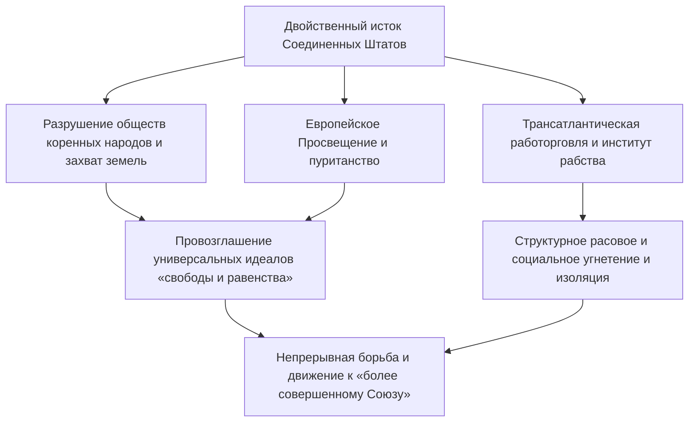
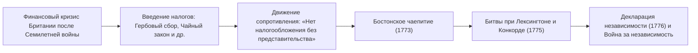
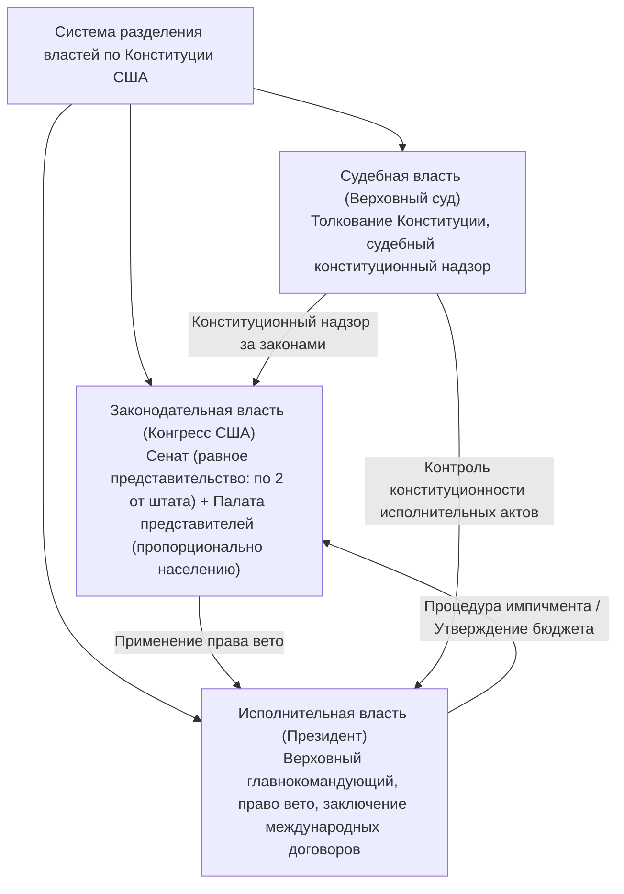
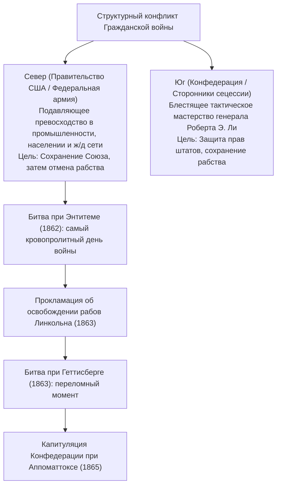
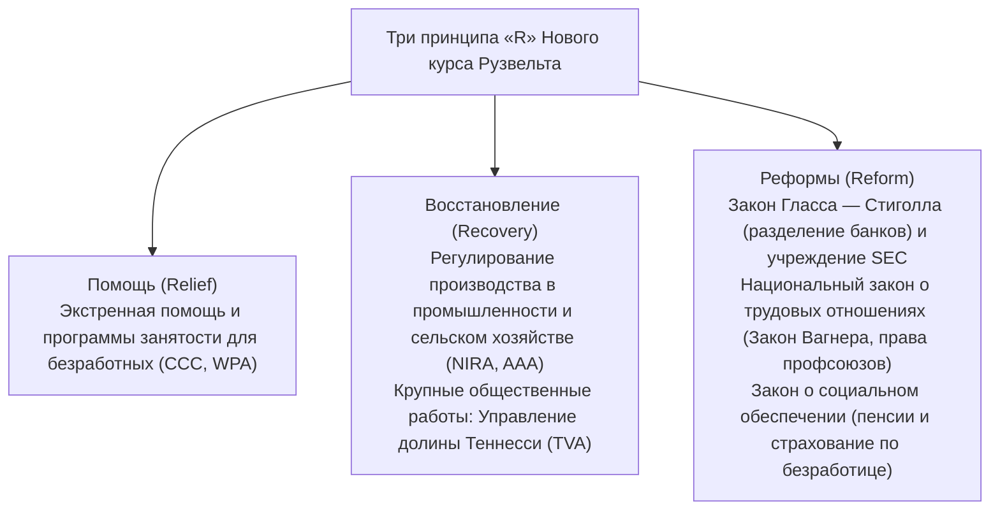
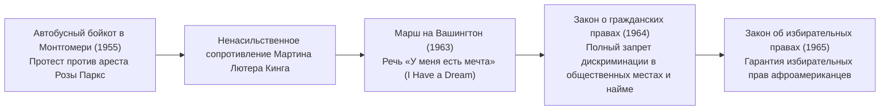
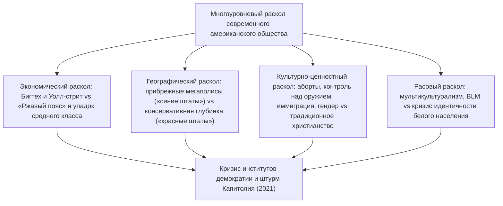

## 1. Введение: Соединенные Штаты Америки как государство-эксперимент

### 1.1 Иллюзия «Нового Света» и реалии цивилизаций коренных народов

В историографии Соединенных Штатов долгое время господствовал мифологический нарратив, согласно которому страна представлялась «землей обетованной, возделанной европейскими белыми переселенцами, искавшими свободы в девственной глуши». Однако достижения антропологии и исторической науки второй половины XX века неопровержимо доказали: задолго до прибытия европейцев на этом континенте на протяжении тысячелетий процветали самобытные и высокоразвитые цивилизации коренных народов (индейцев).

Здесь существовали богатейшие и разнообразные социальные экосистемы: культура строителей курганов, воплощенная в грандиозном мегаполисе Кахокия (Cahokia) в долине Миссисипи; сложнейшие комплексы скальных поселений культуры анасази (пуэбло) на Юго-Западе; Конфедерация ирокезов (Haudenosaunee) на Северо-Востоке, объединившая пять племен и создавшая передовую модель демократического федерализма. Начиная с высадки Колумба в 1492 году, завезенные из Европы эпидемические инфекции — натуральная оспа, корь, грипп (явление, известное как «Колумбов обмен») — в сочетании с жестоким военным завоеванием привели к гибели от 80% до 90% коренного населения. Трезвое историческое признание того факта, что «Новый Свет» возводился на руинах этой трагедии, является обязательной отправной точкой для понимания американской истории.



---

### 1.2 Отцы-пилигримы, Мейфлауэрское соглашение и духовный отпечаток пуританства

Вслед за основанием первого постоянного поселения в Джеймстауне (колония Виргиния, 1607 год) краеугольным камнем американской национальной идентичности стали пуритане-сепаратисты (Отцы-пилигримы), прибывшие на корабле «Мейфлауэр» к берегам Массачусетского залива в 1620 году.

Подписанное на борту судна незадолго до высадки **«Мейфлауэрское соглашение (Mayflower Compact)»** представляло собой поворотный манифест самоуправления в истории человечества. Вместо власти монарха или феодала, насаждаемой сверху, оно провозгласило принцип: **«создать гражданское политическое сообщество на основе добровольного согласия свободных личностей (общественного договора) ради принятия справедливых и равных законов для собственного управления»**.

Идея лидера поселенцев Джона Уинтропа о **«Граде на холме (A City upon a Hill)»** — пламенное убеждение в том, что пуританская община, заключившая завет с Богом, призвана служить сияющим моральным образцом для всего человечества, — заложила фундаментальную генетическую основу концепции **«американской исключительности (American Exceptionalism)»**, определяющей веру США в свою особую всемирно-историческую миссию.

---

## 2. От колониальной эпохи к Американской революции и принятию Конституции США

### 2.1 Развитие тринадцати колоний и конец «благотворного пренебрежения»

Тринадцать британских колоний, сформировавшихся вдоль Атлантического побережья, обладали принципиально различными социально-экономическими укладами:
- Северные колонии (Новая Англия) базировались на морской торговле, рыболовстве, мелком фермерском хозяйстве и строгой пуританской вере.
- Средние колонии представляли собой мультиэтническую и многоконфессиональную мозаику с развитым товарным производством зерна.
- Южные колонии строились на крупном плантационном хозяйстве (табак, рис, индиго), опиравшемся на безжалостную эксплуатацию порабощенных африканцев.

Вплоть до середины XVIII века метрополия придерживалась политики **«благотворного пренебрежения (Salutary Neglect)»**, воздерживаясь от прямого вмешательства во внутренние дела колоний и де-факто признавая их широкое самоуправление. Однако победа Великобритании над Францией в Войне с французами и индейцами (1754–1763) — североамериканском театре Семилетней войны за глобальную гегемонию — обернулась для Лондона колоссальным государственным долгом.

Британский парламент решил переложить военные расходы на плечи американских колонистов посредством жесткой фискальной политики:
- **Закон о сахаре (1764)** и **Акт о гербовом сборе (1765)**: налогом облагалась любая печатная продукция — от газет и юридических актов до брошюр и игральных карт.
- Колонисты решительно отвергли эти меры, выдвинув конституционный лозунг **«Нет налогообложения без представительства (No taxation without representation)»** и развернув массовый бойкот британских товаров.
- После Бостонской бойни 1770 года и Бостонского чаепития 1773 года (когда груз чая Британской Ост-Индской компании был сброшен в океан) Лондон перешел к военным репрессиям («Нестерпимые законы»), что сделало открытый вооруженный конфликт неизбежным.



---

### 2.2 Томас Пейн: «Здравый смысл» и Декларация независимости (1776)

В апреле 1775 года выстрелы в битвах при Лексингтоне и Конкорде возвестили начало Войны за независимость США. В тот момент многие колонисты все еще колебались между верностью британской короне и полным разрывом.

Перелом в общественных настроениях произвел памфлет **«Здравый смысл (Common Sense)»**, анонимно опубликованный Томасом Пейном (Thomas Paine) в январе 1776 года. Ясным, страстным и доступным языком Пейн доказал абсурдность ситуации, при которой остров вечно управляет огромным континентом, и разоблачил наследственную монархию как институт, попирающий естественные права человека. Памфлет разошелся сотнями тысяч экземпляров, охватив колонии революционным воодушевлением.

4 июля 1776 года Второй Континентальный конгресс утвердил **«Декларацию независимости США (Declaration of Independence)»**, проект которой был составлен Томасом Джефферсоном:

> «Мы исходим из той самоочевидной истины, что все люди созданы равными и наделены их Творцом определенными неотчуждаемыми правами, к числу которых относятся жизнь, свобода и стремление к счастью. Для обеспечения этих прав людьми учреждаются правительства, черпающие свои законные полномочия из согласия управляемых. Но если какая-либо форма правительства становится гибельной для этих целей, народ имеет право изменить или упразднить ее и учредить новое правительство...»

Синтезировав концепцию естественного права и теорию общественного договора Джона Локка, этот торжественный документ легитимизировал право народа на сопротивление тирании и восстание, став вехой всемирно-исторического значения в утверждении человеческой свободы.

Континентальная армия под командованием Джорджа Вашингтона, преодолевая хроническую нехватку снабжения и суровые зимы, вела войну на истощение. Переломная победа при Саратоге (1777) позволила заключить военные союзы с Францией, Испанией и Нидерландами. В 1781 году в битве при Йорктауне главные силы британских войск были окружены и капитулировали, а по условиям Парижского мирного договора 1783 года Великобритания безоговорочно признала суверенитет и независимость Соединенных Штатов.

---

### 2.3 Крах Статей Конфедерации и Конституционный конвент в Филадельфии (1787)

Обретя независимость, молодое государство функционировало на базе «Статей Конфедерации (Articles of Confederation)», вступивших в силу в 1781 году, и представляло собой чрезвычайно рыхлый союз тринадцати суверенных государств-штатов:
- Центральное правительство (Конгресс Конфедерации) не обладало ни правом налогообложения, ни регулярной армией, ни полномочиями регулировать внешнюю и межштатную торговлю.
- Когда в 1786 году вспыхнуло восстание фермеров под предводительством Дэниела Шейса («Восстание Шейса»), страдавших от послевоенного экономического кризиса и долговой кабалы, центральная власть оказалась неспособна даже направить войска для наведения порядка. Угроза распада государства стала непосредственной реальностью.

Летом 1787 года в Индепенденс-холле в Филадельфии собрались 55 делегатов — Отцов-основателей (включая Джеймса Мэдисона, Александра Гамильтона и Бенджамина Франклина), которые разработали действующую **«Конституцию Соединенных Штатов Америки»**.



- **Большой компромисс (Коннектикутский компромисс)**: примирил требования малых штатов о равном представительстве (план Нью-Джерси) и крупных штатов о пропорциональном представительстве (Виргинский план), создав двухпалатный парламент — Сенат (по два сенатора от каждого штата) и Палату представителей (распределение мест пропорционально численности населения).
- **Компромисс трех пятых (3/5)**: ради достижения консенсуса с рабовладельческими южными штатами при определении налогообложения и числа мест в Палате представителей было решено учитывать каждого порабощенного человека как «три пятых» свободного гражданина.
- **Система сдержек и противовесов (Checks and Balances)**: вдохновленная идеями Монтескьё трихотомия властей (исполнительной, законодательной и судебной) создала изощренный институциональный барьер против концентрации диктаторских полномочий в руках отдельного лица или ведомства.

---

## 3. Территориальная экспансия, «Явное предначертание» и потрясения Гражданской войны

### 3.1 «Явное предначертание» и континентальная экспансия

В первой половине XIX века Соединенные Штаты стремительно расширяли свои границы на запад:
- **1803 год: Покупка Луизианы**: президент Томас Джефферсон приобрел у Франции Наполеона колоссальную территорию к западу от реки Миссисипи всего за 15 миллионов долларов, в одночасье удвоив площадь государства.
- **1823 год: Доктрина Монро**: президент Джеймс Монро провозгласил принцип невмешательства: европейские державы не должны вмешиваться в дела Американского континента, а США обязуются не участвовать в европейских конфликтах.
- **«Явное предначертание» (Manifest Destiny)**: экспансионистская доктрина, захватившая умы нации, утверждала, что колонизация и освоение Североамериканского континента вплоть до Тихого океана, а также распространение идеалов свободы и демократии — это неоспоримая миссия, возложенная на США самим Провидением.

Оборотной стороной территориального триумфа стало беспощадное вытеснение коренных народов. Принятый в 1830 году по инициативе президента Эндрю Джексона «Закон о переселении индейцев» обрек чероки, криков, чокто, чикасо и семинолов на насильственную депортацию из родовых восточных лесов в засушливые земли Оклахомы (Индейскую территорию). Этот многокилометровый зимний пеший переход, унесший тысячи жизней от голода, холода и болезней, навсегда вошел в историю как **«Дорога слез (Trail of Tears)»**.

Разгром Мексики в Американо-мексиканской войне (1846–1848) принес США Калифорнию, Техас, Неваду, Юту и Нью-Мексико. После последовавшей в 1848 году золотой лихорадки в Калифорнии Соединенные Штаты окончательно утвердились в статусе трансконтинентальной державы от Атлантики до Тихого океана.

---

### 3.2 Кризис рабовладения и углубление национального раскола

Однако с каждым шагом экспансии на запад перед Союзом с новой остротой вставал гибельный вопрос: **«Будет ли разрешено или запрещено рабство на вновь присоединенных территориях?»**

- **Экономика Севера**: динамичная промышленная революция, развитие фабричного производства, коммерции и финансов на базе свободного наемного труда; приверженность протекционистским тарифам для защиты внутреннего рынка.
- **Экономика Юга**: монокультурные хлопковые плантации («Король Хлопок» / King Cotton), опирающиеся на принудительный труд 4 миллионов чернокожих рабов; ориентация на свободную торговлю ради беспрепятственного экспорта хлопка-сырца в Великобританию и страны Европы.

Попытки удержать хрупкий баланс сил в Конгрессе между «свободными» и «рабовладельческими» штатами приводили к половинчатым политическим сделкам: Миссурийскому компромиссу 1820 года (запрет рабства севернее широты 36°30′) и Компромиссу 1850 года (сопровождавшемуся драконовским Законом о беглых рабах).

Однако принятие Закона Канзас-Небраска в 1854 году, передавшего вопрос о статусе рабства на усмотрение местных поселенцев («народный суверенитет»), спровоцировало локальную гражданскую войну, известную как «Истекающий кровью Канзас». Масла в огонь подлило решение Верховного суда по делу **Дреда Скотта (1857)**: суд постановил, что лица африканского происхождения не являются гражданами США и не обладают никакими конституционными правами, а федеральный запрет на владение рабами на территориях является антиконституционным посягательством на частную собственность. Это решение повергло общественность Севера в состояние ярости.

---

### 3.3 Гражданская война (1861–1865): кровавое воссоединение и уничтожение рабства

Победа на президентских выборах 1860 года кандидата от Республиканской партии Авраама Линкольна (Abraham Lincoln), выступавшего против дальнейшего распространения рабства на западные земли, послужила сигналом к мятежу. Южная Каролина и еще шесть южных штатов объявили о выходе из Союза и сформировали «Конфедеративные Штаты Америки (Confederate States of America)».

В апреле 1861 года артиллерийский обстрел южанами федерального форта Самтер положил начало **Гражданской войне в США (American Civil War)**.



Линкольн сумел трансформировать характер вооруженного противостояния из полицейской операции по подавлению мятежа в священную битву за освобождение человечества:
- **1 января 1863 года: Прокламация об освобождении рабов (Emancipation Proclamation)**: объявила всех рабов на мятежных территориях Юга свободными. Этот шаг открыл двери для масштабного вступления афроамериканцев в ряды федеральной армии (около 180 тысяч солдат) и лишил Великобританию и Францию моральной возможности прийти на помощь Конфедерации.
- **Ноябрь 1863 года: Геттисбергская речь**: Линкольн провозгласил великий завет о том, что **«правление народа, народом и для народа (Government of the people, by the people, for the people)»** никогда не исчезнет с лица Земли.

Пройдя через горнило тотальной войны и тактику выжженной земли (знаменитый «Марш к морю» генерала Шермана), в апреле 1865 года командующий армией Конфедерации генерал Ли капитулировал перед генералом Грантом при Аппоматтоксе (Виргиния). Трагедия, стоившая жизни более чем 600 тысячам человек, привела к ратификации 13-й (отмена рабства), 14-й (надлежащая правовая процедура и равенство перед законом) и 15-й (избирательные права независимо от расы) поправок к Конституции. Государство окончательно превратилось из союза полуавтономных штатов в единую и неделимую нацию.

Однако после сворачивания эпохи Реконструкции Юга (Reconstruction) в южных штатах установился репрессивный режим «законов Джима Кроу», ознаменовавший наступление эпохи жесткой расовой сегрегации, бесправия и кровавого террора Ку-клукс-клана (ККК).

---

## 4. «Позолоченный век», промышленная революция и заря американского империализма

### 4.1 Взлет монополистического капитала и «Позолоченный век»

В период между окончанием Гражданской войны и началом XX столетия американская экономика пережила беспрецедентный в истории человечества взрывной рост. Писатель Марк Твен окрестил эту эпоху **«Позолоченным веком (Gilded Age)»**, намекая на то, что за ослепительным внешним блеском богатства скрывается глубокое внутреннее разложение и коррупция.

- Завершение строительства Первой трансконтинентальной железной дороги в 1869 году связало континент в единый гигантский национальный рынок.
- **Эра «баронов-разбойников (Robber Barons)» и промышленных монополий**:
  - Нефтяная империя Джона Рокфеллера «Standard Oil» (контролировавшая свыше 90% всей нефтепереработки в стране).
  - Сталелитейный гигант Эндрю Карнеги («Carnegie Steel»).
  - Финансовый спрут Дж. П. Моргана и рождение сверхтрастов («U.S. Steel»).
- Электрификация Томаса Эдисона, изобретение телефона Александром Беллом и внедрение Генри Фордом непрерывного конвейерного производства (фордизм) стремительно вывели США на первое место в мире по промышленному выпуску, оставив позади Великобританию и Германию.

Вместе с тем чудовищное расслоение общества и бесчеловечные условия труда вылились в ожесточенные классовые бои, такие как Гомстедская и Пуллмановская стачки, в то время как миллионы «новых иммигрантов» из Южной и Восточной Европы (итальянцы, славяне, евреи) заполняли перенаселенные трущобы растущих мегаполисов.

---

### 4.2 Исчезновение «Фронтира» и экспансия на заморские территории

По результатам переписи 1890 года историк Фредерик Джексон Тернер провозгласил «исчезновение Фронтира» — границы продвижения поселенцев на Диком Западе. С закрытием внутренней границы, формировавшей американский демократический дух и предприимчивость, геополитический взор Соединенных Штатов неизбежно обратился к заморским рынкам Тихого океана и Латинской Америки (доктрина морской мощи Альфреда Мэхана).

- **1898 год: Испано-американская война**: воспользовавшись загадочным взрывом броненосца «Мэн» в гавани Гаваны, США вступили в войну с Испанией и за считанные месяцы одержали полную победу. Получив контроль над Филиппинами, Гуамом и Пуэрто-Рико, а также аннексировав Гавайи, Соединенные Штаты заявили о себе как о глобальной океанической империи.
- **Доктрина открытых дверей (1899)**: госсекретарь Джон Хей выдвинул принцип «открытых дверей, равных возможностей и сохранения территориальной целостности Китая», защищая интересы американского капитала в разделе сфер влияния в Азии.

Внутри страны в ответ на засилье трестов и политическую коррупцию развернулось движение **«Прогрессивизма (Progressivism)»**. Президенты Теодор Рузвельт (разрушение картелей, сохранение природных ресурсов) и Вудро Вильсон провели глубокие реформы: применение антитрестовского законодательства Шермана, создание Федеральной резервной системы (ФРС, 1913) и ратификация 19-й поправки, предоставившей избирательные права женщинам (1920).

---

## 5. Две мировые войны, Великая депрессия и становление Pax Americana

### 5.1 Первая мировая война и «Ревущие двадцатые»

После начала Первой мировой войны в 1914 году Соединенные Штаты поначалу сохраняли нейтралитет, сказочно обогащаясь на поставках продовольствия, сырья и вооружений воюющим державам Европы и превращаясь из мирового должника в крупнейшего кредитора. Однако развязывание Германией «неограниченной подводной войны» и перехват секретной «депеши Циммермана» вынудили США вступить в войну в 1917 году.

Президент Вудро Вильсон выдвинул знаменитые **«Четырнадцать пунктов»**, призывая к отказу от тайной дипломатии, утверждению права наций на самоопределение и созданию Лиги Наций. Однако после окончания войны Сенат США, руководствуясь вековыми традициями изоляционизма, отказался ратифицировать Версальский мирный договор и отклонил вступление страны в Лигу Наций.

В 1920-е годы страна погрузилась в эпоху беспрецедентного консьюмеризма, получившую название **«Ревущие двадцатые (Roaring Twenties)»**:
- В обиход миллионов семей вошли радиоприемники, автомобили Ford Model T, немое и звуковое кино, джазовая музыка и электрическая бытовая техника.
- Финансовый рынок захлестнула эйфория биржевых спекуляций, породившая иллюзию «вечного процветания».
- Однако эта блестящая эпоха имела и темную сторону: введение Сухого закона (18-я поправка) породило разгул организованной преступности и мафии (Аль Капоне), а консервативная реакция вылилась в возрождение Ку-клукс-клана и введение жестких иммиграционных квот (1924), направленных против выходцев не из Западной Европы.

---

### 5.2 Великая депрессия и «Новый курс»

24 октября 1929 года вошло в историю как «Черный четверг (Black Thursday)». Грандиозный обвал котировок на Нью-Йоркской фондовой бирже на Уолл-стрит ознаменовал начало разрушительного мирового кризиса — Великой депрессии.
По всей стране разорились тысячи банков, уровень безработицы взлетел до катастрофических 25% (каждый четвертый трудоспособный остался без средств к существованию), а опустошительные пыльные бури («Пыльный котел» / Dust Bowl) в центральных штатах разорили миллионы фермеров. Доктрина невмешательства президента Герберта Гувера потерпела сокрушительное фиаско.

Вступивший в должность президента в марте 1933 года Франклин Делано Рузвельт (ФДР) провозгласил радикальную программу спасения — **«Новый курс (New Deal)»**.



Предвосхитив кейнсианскую теорию, государство пошло на прямое вмешательство в экономические механизмы и заложило основы американского социального государства. «Новый курс» существенно расширил прерогативы исполнительной власти и сформировал мировоззренческий фундамент современного американского либерализма.

---

### 5.3 Вторая мировая война и обретение глобальной гегемонии

7 декабря 1941 года вероломное нападение японской авиации на базу Перл-Харбор на Гавайях втянуло Соединенные Штаты во Вторую мировую войну.

Объявив себя **«Арсеналом демократии (Arsenal of Democracy)»**, США в кратчайшие сроки перевели колоссальный потенциал гражданской индустрии на военные рельсы. Автомобильные заводы круглосуточно выпускали танки и бомбардировщики, а на рабочие места ушедших на фронт мужчин встали миллионы женщин (символом которых стала «Рози-клепальщица»).

- Историческая высадка союзников в Нормандии (1944) и разгром гитлеровского нацизма на Европейском театре военных действий.
- Наступательная стратегия «прыжков по островам (island hopping)» на Тихом океане, сломившая сопротивление Японской империи.
- Осуществление сверхсекретного «Манхэттенского проекта», разработка ядерного оружия и атомные бомбардировки Хиросимы и Нагасаки в августе 1945 года.

К моменту окончания войны Соединенные Штаты контролировали половину мирового промышленного производства, обладали 70% мирового золотого запаса и были единственной ядерной державой на планете.
Бреттон-Вудские соглашения 1944 года закрепили за **долларом США статус главной мировой расчетной и резервной валюты** под эгидой МВФ и Всемирного банка, а в 1945 году в Сан-Франциско был подписан Устав Организации Объединенных Наций. Наступила эпоха безоговорочного глобального доминирования — **«Американский мир (Pax Americana)»**.

---

## 6. Структура холодной войны, движение за гражданские права: триумфы и потрясения Америки

### 6.1 Холодная война между Востоком и Западом и тень ядерного сдерживания

На пепелище Второй мировой войны разгорелось глобальное противостояние двух сверхдержав — Соединенных Штатов, возглавивших капиталистический лагерь, и Советского Союза во главе социалистического блока. Началась **«холодная война (Cold War)»**.

- **1947 год: Доктрина Трумэна**: сформулировала стратегию «сдерживания (Containment Policy)» для предотвращения распространения коммунизма в мире.
- **План Маршалла**: предоставление многомиллиардной экономической помощи для восстановления Западной Европы и нейтрализации левых настроений.
- **1949 год: Создание НАТО**: оформление системы трансатлантической коллективной безопасности под эгидой Вашингтона.
- Корейская война (1950–1953) и охватившая страну антикоммунистическая истерия — «охота на ведьм», вошедшая в историю как маккартизм.

В октябре 1962 года в ходе **Карибского кризиса**, вызванного тайным размещением советских ядерных ракет на Кубе, президент Джон Ф. Кеннеди и советский лидер Никита Хрущев поставили мир на грань ядерного апокалипсиса. Баланс сил стабилизировался лишь на основе зловещей концепции гарантированного взаимного уничтожения (MAD — Mutual Assured Destruction).

---

### 6.2 Движение за гражданские права: борьба за подлинное равенство

В то время как белые американцы среднего класса в 1950-е годы массово переселялись в комфортабельные пригороды (субурбия), покупали телевизоры и автомобили, миллионы афроамериканцев — особенно в южных штатах — продолжали жить в унизительных условиях узаконенного апартеида и сегрегации.

В 1954 году историческое решение Верховного суда США по делу **«Браун против Совета по образованию (Brown v. Board of Education)»** признало расовую сегрегацию в общественных школах неконституционной («раздельное обучение заведомо неравноправно»), дав мощный импульс общенациональному Движению за гражданские права.



Против ненасильственных акций прямого действия под руководством пастора Мартина Лютера Кинга-младшего (сидячие забастовки, «Поездки свободы», марши протеста) полиция южных городов бросала служебных собак и водометы. Шокирующие кадры насилия, транслировавшиеся по телевидению на всю страну, вызвали тектонический сдвиг в общественном сознании. При президенте Линдоне Б. Джонсоне были приняты эпохальные **Закон о гражданских правах 1964 года** и **Закон об избирательных правах 1965 года**, навсегда сокрушившие вековую систему юридической расовой дискриминации.

---

### 6.3 Вьетнамская трясина и взрыв контркультуры

Руководствуясь геополитической «теорией домино» (согласно которой победа коммунистов в одной стране ведет к падению соседних режимов), США втянулись в кровопролитную полномасштабную войну во Вьетнаме (1965–1973).
Тягучая партизанская война в джунглях, массовое применение ядохимикатов («Агент Оранж»), бойня мирных жителей в деревне Сонгми и гибель свыше 58 тысяч молодых американских призывников подорвали доверие граждан к собственному правительству.

Студенческие кампусы охватило мощнейшее антивоенное движение, переросшее в культурный бунт: движение хиппи, рок-революцию (фестиваль в Вудстоке 1969 года), подъем феминизма («Women’s Lib») и экологического сознания — феномен **«контркультуры (Counterculture)»**. В 1974 году Уотергейтский скандал привел к беспрецедентной в истории страны досрочной отставке президента Ричарда Никсона, ввергнув нацию в глубокий морально-психологический и экономический кризис (стагфляция и бессилие администрации Джимми Картера).

---

## 7. От рейганомики к постбиполярному миру, 11 сентября и глубокому расколу современного общества

### 7.1 Рейгановская революция и окончание холодной войны

В 1980 году на волне общенациональной усталости от кризиса и под лозунгом «Возродим былое величие Америки (Make America Great Again)» сокрушительную победу на президентских выборах одержал республиканец Рональд Рейган (Ronald Reagan).

- **Рейганомика (Reaganomics)**: базируясь на теории экономики предложения (supply-side economics), администрация провела радикальное снижение налогов, масштабную дерегуляцию бизнеса, сокращение расходов на социальные программы и ужесточение монетарной политики. Это открыло триумфальное глобальное шествие неолиберализма и концепции «минимального государства».
- **Конфронтация с «империей зла»**: беспрецедентное наращивание военного бюджета, программа Стратегической оборонной инициативы (СОИ, «Звездные войны») и изнурительная гонка вооружений довели советскую командно-административную экономику до истощения.
- Падение Берлинской стены в 1989 году и распад СССР в 1991 году ознаменовали безоговорочную победу США в полувековой холодной войне. Политолог Фрэнсис Фукуяма провозгласил этот момент «Концом истории» — окончательным глобальным торжеством либеральной демократии и свободного рынка.

---

#---

## 7.1.5 Война в Персидском заливе (1991) и военная революция доктрины Пауэлла

В августе 1990 года, сразу после крушения восточного блока, войска иракского диктатора Саддама Хусейна вторглись в соседний Кувейт. Заручившись мандатом Совета Безопасности ООН, президент Джордж Буш-старший сформировал коалицию из 34 государств и в январе 1991 года начал операцию «Буря в пустыне».

### Военная доктрина, преодолевшая вьетнамский синдром
Опираясь на горькие уроки вьетнамского фиаско, председатель Объединенного комитета начальников штабов генерал Колин Пауэлл сформулировал фундаментальные принципы применения силы, известные как **«Доктрина Пауэлла (Powell Doctrine)»**:
1. Наличие прямой, реальной и жизненно важной угрозы национальной безопасности.
2. Война может начинаться только как самое крайнее средство — после исчерпания всех дипломатических и экономических мер.
3. Четкая формулировка конкретных и практически достижимых военных целей.
4. **Применение подавляющей военной мощи (Overwhelming Force)**: немедленное развертывание колоссальных сил, лишающее противника любых шансов на сопротивление, для достижения молниеносной победы.
5. Наличие заранее разработанного четкого плана вывода войск («стратегия выхода» / exit strategy).

Американские вооруженные силы продемонстрировали миру невиданное военно-технологическое превосходство: малозаметные бомбардировщики-«невидимки» F-117, высокоточные управляемые авиабомбы с лазерным и GPS-наведением («умное оружие»), крылатые ракеты «Томагавк» и зенитно-ракетные комплексы «Пэтриот». В прямом эфире телеканала CNN многомиллионная аудитория наблюдала, как иракская армия была полностью разгромлена всего за 100 часов наземной фазы операции.

Буш-старший торжествующе объявил: «Призрак Вьетнама навеки погребен под песками пустыни!», а Вашингтон укрепился в своей роли «единственной сверхдержавы», призванной строить «Новый мировой порядок (New World Order)». Однако историческая ирония заключалась в том, что опьянение столь легкой победой породило опасную геополитическую самоуверенность (гибрис), заставившую архитекторов войны в Ираке 2003 года пренебречь предостережениями доктрины Пауэлла и ввергнуть страну в катастрофическую оккупационную авантюру.

## 7.2 Свет и тени глобализации и цифровая революция

В 1990-е годы в период президентства Билла Клинтона сочетание сокращения военных расходов после распада СССР («дивиденды мира») и бума информационных технологий с эпицентром в Кремниевой долине породило беспрецедентный экономический подъем («Новая экономика»).

Соединенные Штаты стали локомотивом Североамериканского соглашения о свободной торговле (НАФТА / NAFTA) и способствовали вступлению Китая во Всемирную торговую организацию (ВТО), дав колоссальный импульс мировой экономической глобализации. Однако триумф глобализации и финансового капитализма заложил глубокие внутренние противоречия:
- Массовый вывод фабрик и заводов в развивающиеся страны с дешевой рабочей силой (Китай, Мексика) привел к деиндустриализации и обнищанию рабочего класса традиционного промышленного пояса («Ржавый пояс» / Rust Belt).
- Пропасть между процветающей высокотехнологичной и финансовой элитой Восточного и Западного побережий и забытыми жителями внутренних промышленных штатов разрослась до масштабов цивилизационного разлома.

---

### 7.3 Теракты 11 сентября и крах «Глобальной войны с терроризмом»

11 сентября 2001 года террористы «Аль-Каиды» захватили четыре пассажирских авиалайнера, направив их в башни Всемирного торгового центра в Нью-Йорке и здание Пентагона. Беспрецедентная атака на континентальную территорию США вызвала взрыв патриотизма, и президент Джордж Буш-младший объявил о начале бессрочной «Глобальной войны с терроризмом».

- Вторжение в Афганистан и свержение режима талибов.
- 2003 год: вторжение в Ирак под предлогом наличия у режима Саддама Хусейна оружия массового поражения (ОМП).
- Однако никаких запасов ОМП обнаружено не было; ближневосточный регион погрузился в хаос междоусобиц и стал рассадником радикальных террористических движений (ИГИЛ). Кампания унесла жизни тысяч американских солдат, поглотила триллионы долларов и нанесла непоправимый урон моральному престижу США на мировой арене.

---

### 7.4 Крах Lehman Brothers, эпоха Обамы, феномен Трампа и кризис XXI века

В 2008 году лопнувший пузырь на рынке субстандартного ипотечного кредитования и банкротство инвестбанка Lehman Brothers вызвали разрушительный мировой финансово-экономический кризис. На фоне дискредитации неолиберального истеблишмента президентом был избран харизматичный Барак Обама (Barack Obama), шедший под лозунгами «Change» и «Yes We Can» и ставший первым афроамериканцем во главе государства. Несмотря на проведение масштабной реформы здравоохранения («Obamacare»), раскол между демократами и консервативным низовым движением «Движение чаепития (Tea Party)» парализовал работу Конгресса.

А в 2016 году аккумулятором ярости рабочего класса «Ржавого пояса», восстающего против вашингтонского истеблишмента и глобализации, стал эксцентричный миллиардер Дональд Трамп (Donald Trump), одержавший сенсационную победу на президентских выборах.



Беспрецедентный в современной истории штурм Капитолия США 6 января 2021 года наглядно продемонстрировал, что Соединенные Штаты подошли к рубежу глубочайшего со времен Гражданской войны кризиса базового национального консенсуса.

---

---

## 2.4 Идейный раскол Отцов-основателей: спор Гамильтона и Джефферсона

После вступления в силу Конституции США в кабинете первого президента Джорджа Вашингтона разгорелась одна из величайших интеллектуальных дуэлей в мировой политической истории — спор между министром финансов Александром Гамильтоном и государственным секретарем Томасом Джефферсоном о будущей траектории американской цивилизации.

```mermaid
flowchart LR
    subgraph Сторонники Гамильтона (Федералисты: Federalists)
        H1["Сильное федеральное правительство и централизация"]
        H2["Торгово-промышленная и финансовая держава, урбанизация"]
        H3["Создание Банка Соединенных Штатов и консолидация госдолга"]
        H4["Широкое толкование Конституции («подразумеваемые полномочия»)"]
    end
    subgraph Сторонники Джефферсона (Демократы-республиканцы: Republicans)
        J1["Защита прав штатов, децентрализация, ограниченное правительство"]
        J2["Добродетельная аграрная республика фермеров-собственников (Yeoman Farmers)"]
        J3["Глубокое недоверие к банкам и спекулятивному капиталу"]
        J4["Буквальное (строгое) толкование Конституции"]
    end
```

### ① Битва экономических концепций: финансовая империя или аграрная республика
- **Модель Гамильтона**: грезил созданием мощной торгово-промышленной, финансовой и военной империи по британскому образцу. Добился объединения и принятия всех долгов отдельных штатов времен Войны за независимость на баланс федерального правительства (Закон о консолидации долгов), выпустил государственные облигации и учредил «Первый банк Соединенных Штатов (First Bank of the United States)». Выступал за государственную защиту национального производства и создание сильной регулярной армии и профессионального бюрократического аппарата.
- **Модель Джефферсона**: был убежден, что крупные города и фабричный пролетариат несут в себе семена морального разложения, а человек, чье пропитание зависит от воли нанимателя, не способен обладать подлинной гражданской свободой. Истинной опорой добродетели (Virtue) и демократии он считал независимого фермера-собственника («йомена» / yeoman farmer), обрабатывающего собственную землю. По Джефферсону, федеральное правительство должно оставаться предельно ограниченным («малое правительство»), отвечая исключительно за оборону и базовую внешнюю политику.

### ② Конфликт толкования Конституции: «подразумеваемые полномочия» против буквального прочтения
- Вопрос о конституционности учреждения Конгрессом центрального банка стал водоразделом в развитии американского конституционного права.
- **Буквальное толкование Джефферсона (Strict Construction)**: статья I, раздел 8 Конституции содержит четкий перечень исключительных полномочий Конгресса, и слова «учреждение банка» там отсутствуют. Использование властями полномочий, прямо не прописанных в тексте, является узурпацией прав штатов и народа (дух 10-й поправки).
- **Эластичное толкование Гамильтона (Loose Construction)**: сославшись на 18-й пункт того же раздела («оговорку о необходимых и надлежащих мерах» — Necessary and Proper Clause), доказал, что федеральная власть обладает не только прямо выраженными, но и **«подразумеваемыми полномочиями (Implied Powers)»** — правом использовать любые разумные средства, необходимые для эффективного исполнения конституционных обязанностей (сбора налогов, выпуска займов и регулирования торговли). Впоследствии эта доктрина легла в основу прецедентного решения председателя Верховного суда Джона Маршалла по делу «Маккаллох против штата Мэриленд» (McCulloch v. Maryland, 1819), сформировав правовой фундамент современной могущественной федеральной власти.

---

## 3.6 Гражданская война как военно-технологический перелом и драматизм эпохи Реконструкции

Гражданская война в США по праву считается военными историками «Первой современной тотальной войной (First Modern Total War)». Технологические плоды промышленной революции были впервые масштабно брошены на поля сражений, мгновенно обесценив классическую наполеоновскую тактику сомкнутых пехотных каре и атак на открытой местности.

### ① Военно-техническая революция
1. **Нарезное оружие и коническая пуля Минье (Minié Ball)**:
   - Если эффективная прицельная дальность старых гладкоствольных кремнёвых мушкетов составляла всего $50 \sim 100$ ярдов, то нарезные винтовки в сочетании со свинцовой экспансивной пулей Минье увеличили дистанцию поражения до $300 \sim 500$ ярдов.
   - Однако генералы обеих сторон продолжали посылать солдат в лобовые штыковые атаки плотными шеренгами. Это приводило к чудовищной бойне под шквальным ружейным огнем (как во время знаменитой «атаки Пикетта» при Геттисберге). Поле боя неизбежно трансформировалось в позиционную «окопную войну», предвосхитившую сражения Первой мировой.
2. **Железные дороги и электрический телеграф**:
   - Армия Союза виртуозно использовала разветвленную сеть железных дорог, перебрасывая десятки тысяч подкреплений и сотни тонн боеприпасов к линии фронта за считанные дни.
   - Находясь в телеграфном отделе Белого дома, президент Линкольн непрерывно получал депеши и вел оперативные консультации с командующими в режиме реального времени, став пионером современной системы дистанционного боевого управления и связи (C4I).
3. **Битва броненосцев**:
   - В марте 1862 года в морском бою на Хэмптонском рейде сошлись броненосец конфедератов «Вирджиния» (бывший «Мерримак») и башенный броненосец северян «Монитор». Многовековая эпоха деревянного парусного флота канула в лету за один день.

### ② Крушение идеалов Реконструкции (1865–1877) и тьма законов Джима Кроу
Преемник убитого Линкольна Эндрю Джонсон проявил чрезмерную мягкость к вчерашним мятежникам, вследствие чего фракция «Радикальных республиканцев» взяла инициативу в свои руки: южные штаты были разделены на пять военных округов, а миллионы получивших избирательные права бывших рабов впервые избрали афроамериканцев в Конгресс и местные органы власти («Радикальная реконструкция»).

Однако политическая сделка по итогам спорных президентских выборов 1877 года (Компромисс Хейса — Тилдена) привела к полному выводу федеральных оккупационных войск с Юга. Власть в регионе немедленно захватила белая плантаторская олигархия («Искупители» / Redeemers):
- Законодательные собрания южных штатов возвели изощренные правовые барьеры — избирательный налог (Poll Tax), дискриминационные тесты на грамотность (Literacy Test) и «дедушкину оговорку» (освобождавшую от тестов тех, чьи предки имели право голоса до 1867 года), де-факто лишив чернокожих избирательных прав.
- В 1896 году Верховный суд США по делу **«Плесси против Фергюсона (Plessy v. Ferguson)»** утвердил чудовищную доктрину **«Раздельные, но равные (Separate but Equal)»**, признав расовую сегрегацию на транспорте, в школах и общественных местах соответствующей Конституции. Режим законов Джима Кроу сковал американский Юг еще более чем на полвека — вплоть до выступлений 1950-х годов.

---

## 7.5 Судебная политика и битва за прецеденты Верховного суда в XXI веке

Острием современной политической поляризации в США стали ожесточенные «судебные войны (Judicial Wars)» — борьба за партийный контроль над составом Верховного суда и пересмотр фундаментальных конституционных прецедентов.

### ① Право на аборт: от дела «Роу против Уэйда» к его сенсационной отмене
- **1973 год: решение по делу «Роу против Уэйда (Roe v. Wade)»**: Верховный суд постановил, что конституционное право женщины на прерывание беременности защищено фундаментальным «правом на неприкосновенность частной жизни», вытекающим из гарантий надлежащей правовой процедуры 14-й поправки.
- В ответ религиозно-консервативные круги (евангелические христиане и движение «Pro-Life») объединились с Республиканской партией и на протяжении пятидесяти лет вели системную кампанию по продвижению консервативных юристов в высшие судебные инстанции.
- Назначение Дональдом Трампом сразу трех консервативных судей (Горсача, Кавано и Барретт) закрепило перевес консерваторов в соотношении 6 к 3. В итоге в июне **2022 года в решении по делу «Доббс против Организации женского здоровья Джексона (Dobbs v. Jackson)»** суд перечеркнул прецедент полувековой давности. Заявив, что «право на аборт не упомянуто в Конституции и не имеет глубоких корней в истории и традициях нации», суд вернул полномочия по запрету или разрешению абортов легислатурам штатов.
- Это решение привело к юридическому расколу страны: десятки южных и центральных штатов ввели тотальные криминальные запреты на аборты, в то время как либеральные штаты (Калифорния, Нью-Йорк) провозгласили себя «штатами-убежищами».

### ② Право на ношение оружия: оригинальное прочтение Второй поправки
- **Вторая поправка к Конституции США**: «Поскольку надлежащим образом организованное ополчение необходимо для безопасности свободного государства, право народа хранить и носить оружие не должно нарушаться».
- **2008 год: решение по делу «Округ Колумбия против Хеллера (District of Columbia v. Heller)»**: опираясь на доктрину «оригинализма (Originalism)», отстаиваемую судьей Антонином Скалиа (согласно которой текст Конституции должен трактоваться строго в том смысле, который вкладывали в него авторы в момент принятия), Верховный суд впервые постановил, что Вторая поправка закрепляет абсолютное индивидуальное право любого гражданина на владение огнестрельным оружием для самообороны вне зависимости от участия в ополчении. Это решение сделало принятие любых действенных общефедеральных законов о контроле над оружием юридически почти невозможным даже на фоне непрекращающихся трагедий со стрельбой в общественных местах.

---

## 6.5 «Никсоновский шок» (1971) и установление нефтедолларовой системы

Важнейшей геополитической и финансовой трансформацией второй половины XX века стало неожиданное телевизионное обращение президента Ричарда Никсона от 15 августа 1971 года, вошедшее в историю как «Никсоновский шок» («долларовый шок»).

### ① Крах Бреттон-Вудской системы
Созданная союзниками в 1944 году в городке Бреттон-Вудс международная валютная система покоилась на «золотодолларовом стандарте (Gold-Exchange Standard)»: США гарантировали всему миру прямой обмен **«1 тройской унции золота на 35 долларов США»**, а курсы остальных национальных валют были жестко привязаны к доллару.

Однако во второй половине 1960-х годов сочетание социальных расходов по программе «Великое общество (Great Society)» Линдона Джонсона и гигантских военных трат на войну во Вьетнаме привело к астрономическому росту дефицита бюджета и платежного баланса США. Когда Франция и ФРГ начали массово требовать обмена накопленных долларовых авуаров на физическое золото, запасы хранилища Форт-Нокс оказались на грани полного исчерпания.

В прямом телеэфире Никсон в одностороннем порядке объявил о **«немедленном и бессрочном прекращении конвертации долларов США в золото»**. Бреттон-Вудский порядок рухнул, и мировая экономика с 1973 года перешла на систему плавающих валютных курсов (Floating Exchange Rate System), где стоимость денег определяется рыночным спросом и предложением.

### ② Рождение системы нефтедолларов (Petrodollar)
Потеряв золотое обеспечение, американский доллар оказался под угрозой сокрушительной девальвации и гиперинфляции. В этих критических условиях госсекретарь Генри Киссинджер провел блестящую тайную дипломатическую операцию с Саудовской Аравией — лидером ОПЕК и крупнейшим мировым экспортером нефти (1974):
- Соединенные Штаты обязались предоставить саудовской королевской династии абсолютные гарантии военной безопасности и поставки самого современного оружия.
- Взамен Саудовская Аравия согласилась **«вести международную торговлю нефтью исключительно за доллары США»** (вскоре это правило распространилось на весь картель ОПЕК).
- Так была выстроена **нефтедолларовая система (Petrodollar System)**: любому государству планеты, чтобы приобрести критически необходимую для индустриальной цивилизации нефть, стало жизненно необходимо непрерывно накапливать доллары США в качестве валютных резервов. Федеральная резервная система США получила возможность скупать мировые материальные ресурсы с помощью ничем не обеспеченных фиатных денег (Fiat Money) — «непомерную привилегию (Exorbitant Privilege)», обеспечивающую гегемонию Вашингтона вплоть до наших дней.

---

## 7.6 Трансформация страны иммигрантов: Закон об иммиграции 1965 года и демографический тектонический сдвиг

Еще одной бесшумной революцией, переписавшей глубинную этнокультурную ткань американского общества, стал **«Закон об иммиграции и гражданстве 1965 года (Закон Харта — Селлера)»**, подписанный президентом Линдоном Б. Джонсоном.

Прежний Закон об иммиграции 1924 года (Закон Джонсона — Рида) опирался на дискриминационную систему национальных квот на базе переписи населения 1890 года, неприкрыто благоприятствуя белым англосаксонским и североевропейским иммигрантам и сводя к минимуму въезд выходцев из Южной и Восточной Европы и Азии.

Закон 1965 года полностью упразднил расовые квоты, заложив новые приоритеты: «воссоединение разделенных семей» и «привлечение высококвалифицированных специалистов»:
- Архитекторы реформы в Конгрессе не ожидали масштабного сдвига в структуре населения, однако последствия оказались поистине тектоническими.
- Доля европейской иммиграции сошла на нет, в то время как поток переселенцев из стран Латинской Америки (Мексика, Центральная Америка) и Азии (Китай, Филиппины, Индия, Корея, Вьетнам) вырос в геометрической прогрессии.
- По данным переписей населения 2020-х годов, доля белого неиспаноязычного населения США снизилась приблизительно до $58\%$. По прогнозам демографов, уже к 2045 году **белые американцы составят менее половины населения страны, и Соединенные Штаты окончательно трансформируются в «общество большинства меньшинств (majority-minority society)»**.

Именно экзистенциальная тревога и подсознательный страх традиционного белого рабочего класса потерять «свою страну» перед лицом стремительного демографического сдвига стали мощнейшим психологическим топливом идеологии трампизма (риторика «Америка прежде всего», строительство пограничной стены, борьба с нелегальной миграцией).

## 8. Заключение: непрекращающееся стремление к «более совершенному Союзу»

История Соединенных Штатов Америки — это не просто летопись военной мощи, территориальных захватов и экономической гегемонии. Это прежде всего **«великая драма непрерывного крушения возвышенных идеалов под тяжестью исторических противоречий и мужественного возрождения этих идеалов из пепла поражений»**.

Преамбула Конституции США возвещает:
> **«Мы, народ Соединенных Штатов, в целях образования более совершенного Союза (in Order to form a more perfect Union)...»**

Отцы-основатели ни на мгновение не заблуждались относительно того, что создаваемое ими государство идеально с первого дня. Именно поэтому в тексте высечена динамическая сравнительная степень: не «совершенный», а **«более совершенный (more perfect)»** Союз.

Истребление коренного населения, вековой позор рабства, расовая сегрегация, империалистические интервенции — несмотря на череду чудовищных исторических преступлений, американская нация раз за разом находила в себе способность реформировать законы, принимать спасительные конституционные поправки и руками собственных граждан раздвигать границы свободы и равноправия. В этой способности к самокоррекции и заключается подлинная внутренняя сила американского эксперимента.

Смогут ли Соединенные Штаты в XXI веке перед лицом беспрецедентного раскола и недоверия вернуться к своему непреходящему истоку — «Из многих — единое (E Pluribus Unum)» — и вновь стать маяком надежды для человечества? Историческое плавание в поисках ответа на этот вопрос продолжается прямо сейчас.
