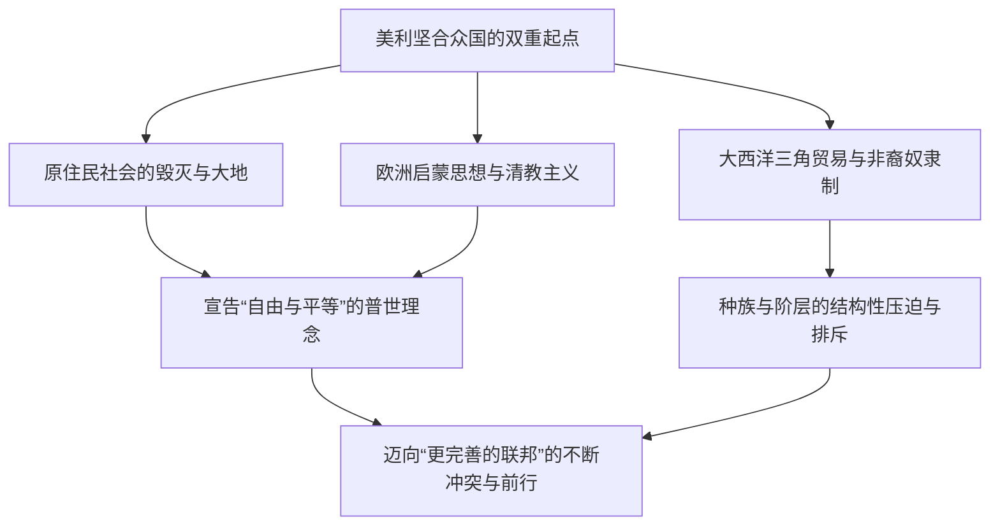
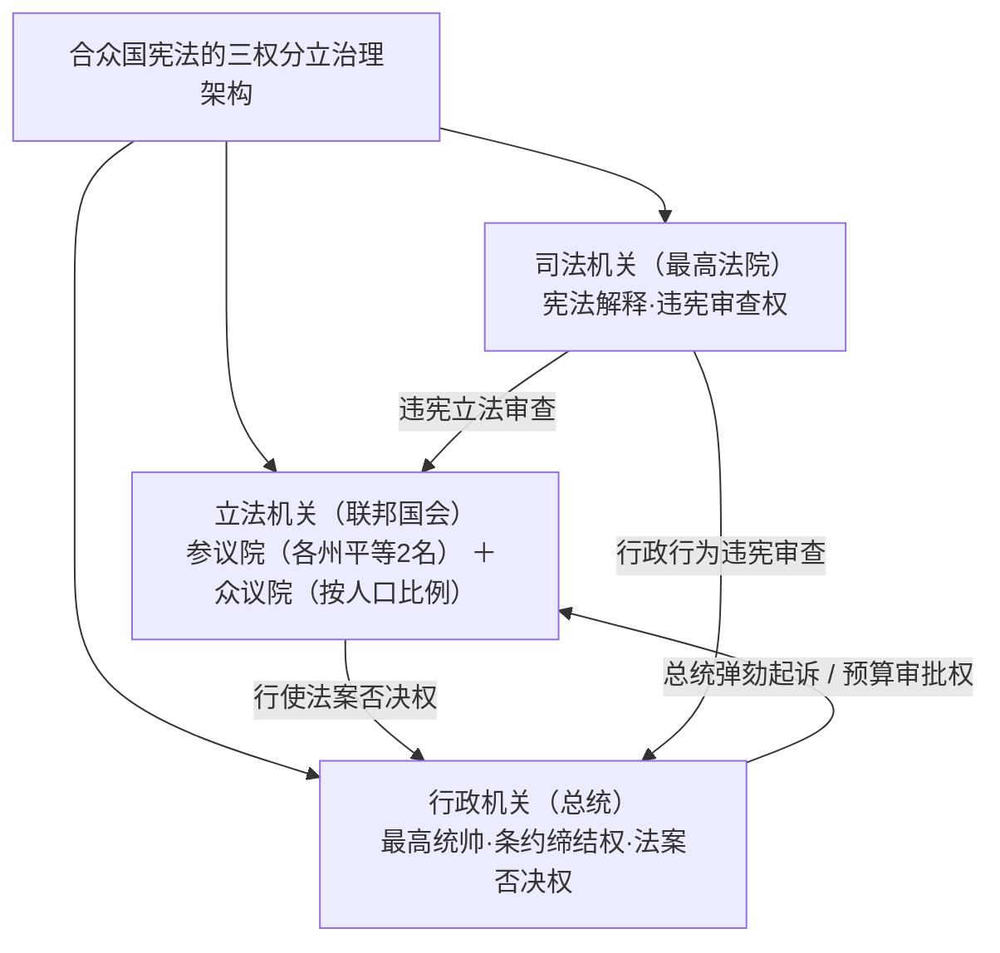
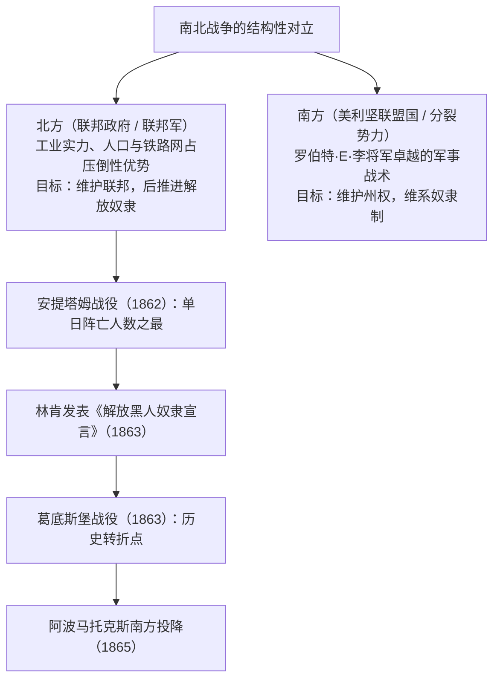
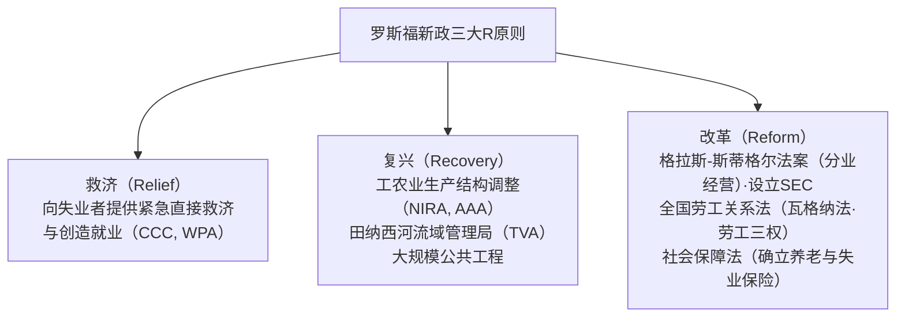
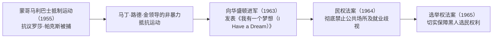
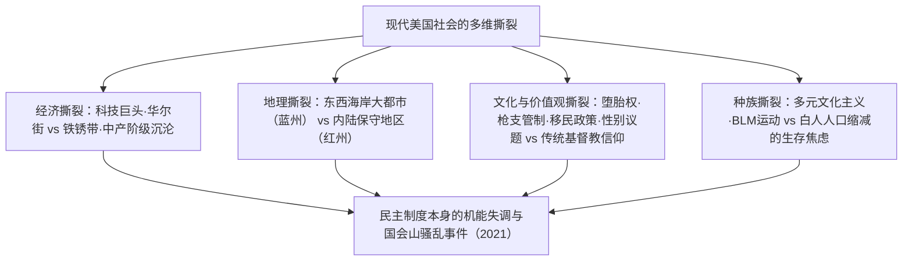
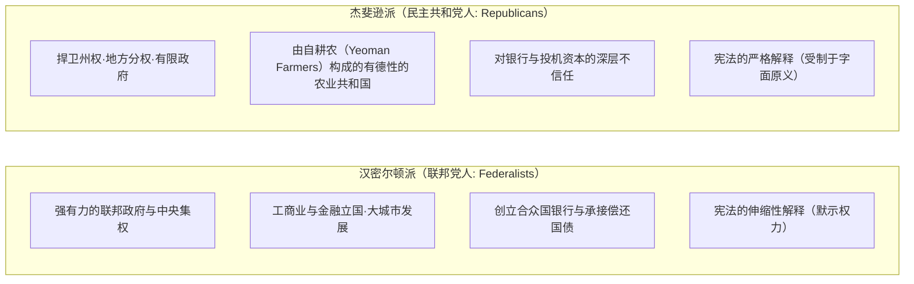

## 1. 导论：作为试验国家的美利坚合众国

### 1.1 “新大陆”幻象与原住民文明的真实图景

在讲述美利坚合众国的国家历史时，长久以来一直占据统治地位的是这样一种神话叙事：“欧洲白人为了追寻自由，在荒无人烟的蛮荒之地开辟了应许之地”。然而，20世纪下半叶以来人类学与历史学的深入发展揭示了一个无可争辩的事实：早在欧洲人涉足之前，这片广袤大陆上就已经繁衍并昌盛了数千年的、高度发达且独具特色的原住民（美洲印第安人）文明。

无论是密西西比河谷以卡霍基亚（Cahokia）庞大城市遗址为代表的筑垒者文明，还是西南部阿纳萨齐（普韦布洛）文化遗留下的精美绝伦的悬崖崖居群，抑或东北部由五个部族结盟构建的高水平民主联邦制——易洛魁联盟（Haudenosaunee），都见证了多样而繁茂的社会生态。自1492年哥伦布踏上美洲大陆以来，欧洲传入的天花、麻疹、流感等烈性传染病（即所谓的“哥伦布大交换”）以及残酷的军事征服，致使原住民人口丧失了80%至90%。正是建立在这场浩劫之上，“新世界”才得以奠基——这一冷峻的历史真相，乃是理解现代美国史不可或缺的逻辑起点。

---

### 1.2 清教徒先辈、《五月花号公约》与清教主义的精神烙印

继1607年詹姆斯敦（弗吉尼亚殖民地）开辟定居点之后，真正奠定美国国民认同精神基石的，是1620年乘坐“五月花号”横渡大西洋并在马萨诸塞湾登陆的分离派清教徒（朝圣先辈 / Pilgrim Fathers）。

在登岸前夕，各方于船舱内联合签署的《**五月花号公约**》（Mayflower Compact），绝非由君主或封建领主自上而下颁布的统治令，而是一份开创性的自治宣言：“**基于自由个体的自愿合意（社会契约），制定公正而平等的法律，从而创立自我管辖的政治社会**”。这在整个人类政治思想史上具有划时代的破冰意义。

领袖约翰·温斯罗普（John Winthrop）所宣示的“山巅之城”（A City upon a Hill）理念——即与上帝立约的清教徒共同体必须化作照亮全世界的楷模——赋予了后世美国一种坚信自身肩负引领世界特殊使命的“美国例外论”（American Exceptionalism）核心基因。

---

## 2. 从殖民地时代到独立革命与合众国宪法的诞生

### 2.1 十三殖民地的演进与“有益的忽视”之终结

大西洋沿岸建立的十三英属殖民地，逐渐分化并孕育了截然不同的经济社会生态：北部新英格兰（商业、渔业、小农经济与虔诚的清教信仰）、中部殖民地（谷物种植业、多元族群与包容的宗教马赛克拼图），以及南部殖民地（种植烟草、水稻、靛蓝的大规模种植园经济与黑人奴隶无偿劳动）。

直至18世纪中叶，英国本土对北美殖民地长期采取不加严格干预、默许实质自治的“**有益的忽视**”（Salutary Neglect）政策。然而，在争夺欧洲与北美霸权的七年战争北美战线——“法印战争（1754–1763年）”中，英国虽最终获胜，本土财政却背负了天文数字般的巨额战债。

英国议会遂以分摊防务开支为借口，急剧转向对殖民地课以重税的高压政策：
- 《**糖税法**》（1764年）、《**印花税法**》（1765年）：征税范围无所不包，连报纸、小册子乃至扑克牌都被强制粘贴印花税票。
- 殖民地居民掀起强烈反弹，高举宪政抗税旗帜——“**无代表不纳税**”（No taxation without representation），并在全境广泛发起抵制英国商品的抵制运动。
- 经历了1770年的波士顿惨案以及1773年的波士顿倾茶事件（将东印度公司的茶叶货箱倾入大海）后，英国政府决意采取武力铁腕镇压（颁布一系列“不可容忍法案”），双方的武装冲突遂滑向不可逆转的深渊。

---

### 2.2 托马斯·潘恩《常识》与《独立宣言》（1776年）

1775年4月，列克星敦和康科德的枪声骤响，拉开了美国独立战争的序幕。彼时，绝大多数殖民地居民依然在效忠英国王室与走向独立决裂之间彷徨摇摆。

彻底打破这种迷惘的思想惊雷，是1776年1月由托马斯·潘恩（Thomas Paine）匿名出版的政论小册子《**常识**》（Common Sense）。潘恩以通俗易懂却激荡人心的笔触透彻论证：“仅仅作为一个岛国的英国，妄图永久统治一整块大陆，本身就是荒谬绝伦的悖论”；“世袭君主制在本质上是对人类天赋人权的亵渎与践踏”。《常识》在全美创下了数十万册的空前销量，彻底点燃了全境拥抱独立的革命狂潮。

紧随其后，在1776年7月4日的第二届大陆会议上，由托马斯·杰斐逊主笔起草的《**独立宣言**》（Declaration of Independence）获得正式通过：

> “我们认为下面这些真理是不言而喻的：人人生而平等，造物主赋予他们若干不可剥夺的权利，其中包括生命权、自由权和追求幸福的权利。为了保障这些权利，人类才在他们之间建立政府，而政府的正当权力，则是经由被统治者的同意而产生的。”

这份融汇了约翰·洛克社会契约论与天赋人权学说的宏伟宣言，从根本上确立了人民反抗专制暴政的抵抗权（革命权），成为人类自由史上巍然屹立的里程碑。

总司令乔治·华盛顿率领大陆军在极其严酷的补给短缺与酷寒严冬中展开旷日持久的消耗战，并以萨拉托加战役（1777年）的辉煌胜利为契机，成功赢得了法国、西班牙、荷兰的军事同盟支持。1781年约克镇战役迫使英军主力合围投降，1783年签署的《巴黎条约》使英国正式承认美利坚合众国的完全独立。

---

### 2.3 《邦联条例》的困局与费城制宪会议（1787年）

赢得独立初期的合众国，仅依据1781年起生效的《邦联条例》（Articles of Confederation），构成了一个由13个独立主权国家结成的极其松散的邦联（Confederation）。
- 中央政府（邦联国会）既无独立的征税权，亦无常备军，更缺乏调控对外商贸往来的法定权力。
- 当战后经济萧条与沉重税负逼迫马萨诸塞州贫苦农民揭竿而起爆发“谢斯起义”（1786年）时，邦联政府甚至连调动联邦军队平叛的能力都不具备，国家解体的危机赫然迫在眉睫。

1787年盛夏，55名各州代表（包括詹姆斯·麦迪逊、亚历山大·汉密尔顿、本杰明·富兰克林等“建国先父”）齐聚费城独立厅，最终铸就了传世至今的现行《**美利坚合众国宪法**》。

- **大妥协（康涅狄格妥协）**：成功弥合了小州所坚持的各州平等代表权（新泽西方案）与大州主张的按人口比例代表制（弗吉尼亚方案），创设出“参议院（每州一律2名）”与“众议院（按人口比例分配）”相配合的两院制结构。
- **奴隶人口折算（五分之三妥协）**：为遏制南部州过大的政治话语权同时达成建国共识，在众议院席位分配及直接税摊派计算中，妥协达成将每名奴隶按自由民的“五分之三”进行折算的历史折中案。
- **制约与平衡（Checks and Balances）**：奠基于孟德斯鸠的三权分立学说，使总统、国会与联邦司法部门互为钳制、彼此平衡，构筑起抵御任何个人或机构篡夺独裁暴权的严密制度防线。

---

## 3. 领土扩张、“昭昭天命”与激荡的南北战争

### 3.1 “昭昭天命”与横跨大陆的领土扩张

19世纪上半叶，合众国以惊人的速度向西挺进并扩张疆土：
- **1803年：路易斯安那购地案**：托马斯·杰斐逊总统仅斥资1500万美元，便从法兰西第一帝国拿破仑手中购入密西西比河以西辽阔的路易斯安那殖民地，合众国国土面积在一夜之间翻倍。
- **1823年：门罗主义**：詹姆斯·门罗总统发表咨文，庄严确立“欧洲列强不得再干涉美洲大陆事务，合众国亦不卷入欧洲纷争”的美洲孤立主义与互不干涉准则。
- **昭昭天命（Manifest Destiny）**：“跨越北美大陆一路挺进至太平洋沿岸，占有、开发这片土地并广布自由与民主，是上苍赋予美利坚合众国的神圣使命”——这一带有强烈扩张主义色彩的意识形态彻底点燃了举国狂热。

然而，在领土急速扩张的阴影下，原住民世代赖以生存的家园遭遇了无情的摧毁与掠夺。在安德鲁·杰克逊总统主导推行的1830年《印第安人迁移法案》高压下，切罗基人等东部五大文明部族被迫离开世代定居的繁茂森林，在严酷冬雪与荒野中被荷枪实弹押解徒步数千公里迁往俄克拉荷马（印第安准州）。数千生灵倒毙于饥寒交迫与疫病肆虐的路途之上，这段沉痛的血泪迁徙史作为“**血泪之路**”（Trail of Tears）被永载历史耻辱柱。

随着美墨战争（1846–1848年）获胜割取加利福尼亚、得克萨斯和新墨西哥，以及1848年加州淘金热的大爆发，合众国终于建成了东起大西洋、西濒太平洋的横跨大陆国家实体。

---

### 3.2 奴隶制的生存危机与国家撕裂的白热化

然而，每一次疆域的向西拓宽，都伴随着一个足以毁灭联邦的致命质问在拷问着国家：“**在新划归的准州土地上，究竟是准许还是严禁奴隶制的存在？**”

- **北方经济形态**：工业革命迅猛铺展，依托自由雇佣劳动力大力发展制造业、商贸流通与金融信贷，积极主张推行保护关税以护卫国内统一大市场。
- **南方经济形态**：以浩瀚无垠的棉花大种植园为经济命脉，严重依赖近400万非裔黑奴的无偿奴役劳动，构筑起傲然自恃的“棉花王国”（King Cotton），极力倡导自由贸易以便向英国等海外市场倾销原棉。

为了维系联邦国会内部“自由州”与“蓄奴州”脆弱的政治均势，朝野相继出台了1820年《密苏里妥协案》（禁止北纬36度30分以北的准州实行奴隶制）和1850年妥协案（强化《逃奴追缉法》）等缝缝补补的缓兵之计。

然而，1854年颁布的《堪萨斯-内布拉斯加法案》（主张由准州选民公投决断奴隶制存废的人民主权论），直接引爆了被称为“流血的堪萨斯”的前哨内战。紧接着，1857年联邦最高法院作出臭名昭著的“**德雷德·斯科特案判决**”，悍然裁定“黑人无论自由与否均非宪法所定义的公民，不享有任何权利”、“联邦国会无权禁止在准州拥有奴隶财产，相关禁令属于违宪”，彻底激怒了整个北方的反奴隶制公意。

---

### 3.3 南北战争（1861–1865）：血与火的再统一与奴隶解放

在1860年总统大选中，将“遏制奴隶制向西蔓延”作为核心纲领的共和党候选人亚伯拉罕·林肯（Abraham Lincoln）胜选登基。南卡罗来纳州随即率先发难宣布脱离联邦，南方共计7个蓄奴州相继退出并宣告另立门庭，结成“美利坚联盟国”（Confederate States of America）。

1861年4月，南方叛军向联邦驻守的萨姆特堡猛烈开火，“**南北战争**”（American Civil War）正式全面爆发。

林肯以高超的政治远见，将这场战争的性质从单纯的“平定内乱、恢复国家统一”升华为“为了人类自由而战的圣洁事业”：
- **1863年1月1日：《解放黑人奴隶宣言》（Emancipation Proclamation）**：庄严宣布南方叛乱诸州辖区内的所有黑人奴隶即刻无条件获得永久人身自由。此举促成了约18万黑人士兵大规模应募加入联邦军队，同时在道德制高点上彻底封死了英法等欧洲列强外交承认并军事介入庇护南方的可能。
- **1863年11月：葛底斯堡演说**：庄严向世界宣告，“**民有、民治、民享的政府（Government of the people, by the people, for the people）**”绝不能从地球上消亡。

在经历了残酷的总体战与焦土扫荡（谢尔曼将军向大海进军）后，1865年4月，南方名将罗伯特·E·李将军率部在弗吉尼亚州阿波马托克斯向北方总司令尤利西斯·S·格兰特将军无条件受降。合众国付出了逾60万官兵阵亡的惨重历史代价，通过相继批准宪法第十三修正案（彻底废除奴隶制）、第十四修正案（正当法律程序与法律面前平等保护）以及第十五修正案（保障公民跨种族选举权），合众国终于从松散的“各州联合”淬炼为一个“不可分割的统一国民国家”。

然而，随着战后重建期（Reconstruction）的草草落幕，南方各州相继炮制出名为“吉姆·克劳法”（Jim Crow Laws）的种族隔离制度，非裔黑人再度坠入了严酷的种族隔离制度与三K党肆虐动用私刑（Lynch）的漫长暗夜。

---

## 4. 镀金时代、工业革命与美帝国主义的拂晓

### 4.1 巨额资本的崛起与“镀金时代”

南北战争结束至20世纪初，美国经济迎来了一场人类文明史上规模空前的大爆发。文豪马克·吐温将这一时代讥讽为“**镀金时代**”（Gilded Age），意指其外表虽如黄金般耀眼夺目，其内在肌理却充斥着赤裸裸的铜臭与腐败。

- 1869年首条横贯大陆铁路的合龙通车，将全美腹地整合成一个统一的大型国内商业市场。
- “**强盗贵族**”（Robber Barons）的行业垄断狂潮：
  - 约翰·D·洛克菲勒创办的标准石油公司（一度掌控全美90%的石油提炼与管道输送）。
  - 安德鲁·卡内基构建的钢铁工业帝国（卡内基钢铁公司）。
  - J·P·摩根所操盘的金融资本大重组与巨无霸托拉斯托底（联合组建美国钢铁公司）。
- 爱迪生发明白炽灯与电网系统，贝尔发明电话，亨利·福特创立流水线大规模量产机制（福特主义），这些革命性创新使得美国的工业制造总产值一骑绝尘，将英国、德国等欧洲老牌强国远远甩在身后，登顶世界第一工业超级大国宝座。

与此同时，社会财富的极度两极分化与一线劳工极其恶劣的生存环境，点燃了诸如霍姆斯特德大罢工、普尔曼车辆厂大罢工等一系列惨烈的流血劳资冲突；来自欧洲（爱尔兰、意大利以及东欧犹太裔）的数千万“新移民”涌入各大工业都会，构成了底层贫民窟的阴暗底层。

---

### 4.2 边疆的消逝与海外属地的鲸吞

在1890年的人口普查公报出台之际，历史学家弗雷德里克·杰克逊·特纳正式抛出了著名的“边疆终结论”。孕育了美利坚民族开拓精神、民主底色与生机活力的西部拓殖边疆一旦终结，合众国的扩张视线便不可避免地移向了太平洋与中南美洲等海外广袤市场（正如海军理论家马汉在《海权论》中所极力倡导的那样）。

- **1898年：美西战争**：借由古巴哈瓦那港“缅因号爆炸事件”为导火索向衰颓的西班牙王国宣战，仅历时数月便以雷霆之势大获全胜。美国一口气吞并了波多黎各、关岛与菲律宾，并顺势吞并夏威夷，跃升为雄踞太平洋两岸的海上帝国。
- **门户开放宣言（1899年）**：面对帝国主义列强在中国划分势力范围的狂潮，美国国务卿约翰·海伊连续发出照会，倡导“门户开放、机会均等与领土完整”，全力为美国资本开拓巨大的亚洲工商业市场。

在内政层面，为了遏制垄断寡头的横行无忌与日益恶化的政治机器腐败，西奥多·罗斯福总统（力主拆分垄断托拉斯、推行国家自然资源保护）与伍德罗·威尔逊总统掀起了声势浩大的“**进步主义运动**”（Progressivism），推动严格执行《谢尔曼反托拉斯法》、创建联邦储备系统（美联储），并最终争取到了保障女性神圣投票权的宪法第十九修正案。

---

## 5. 两次世界大战、大萧条与美利坚和平（Pax Americana）的确立

### 5.1 第一次世界大战与“咆哮的二十年代”

1914年第一次世界大战在欧陆爆发之际，美国最初奉行严守中立政策，凭借源源不断向交战各国大宗输出军工装备与粮食原料，一跃从债务国转变为全球最大的净债权国。然而，随着德意志帝国重启“无限制潜艇战”以及企图拉拢墨西哥对抗美国的“齐默尔曼电报”败露，合众国于1917年毅然宣战参战。

威尔逊总统在战局转折之际庄严提出“**十四点和平原则**”，极力倡导公开外交、民族自决与筹建国际联盟以实现集体安全。然而战后由保守孤立派掌控的美国参议院，基于不愿卷入欧洲地缘纠葛的传统孤立主义立场，坚决拒绝批准《凡尔赛条约》，最终使合众国自绝于自身提议创立的国际联盟之外。

进入1920年代，合众国步入了被称作“**咆哮的二十年代**”（Roaring Twenties）的空前大众消费主义盛世：
- 收音机、福特T型轿车、无声与有声电影、爵士乐以及现代家用电器大规模飞入寻常百姓家。
- 华尔街证券交易市场沉浸在股市单边暴涨的投机幻觉中，“永久繁荣”的神话被信奉为真理。
- 与此同时，宪法第十八修正案所推行的全国“禁酒令”催生了阿尔·卡彭式黑帮犯罪网络的大肆横行，种族与宗教排外暗流（三K党死灰复燃、出台严格的排外移民配额法）给繁华盛世蒙上了沉重阴霾。

---

### 5.2 大萧条与罗斯福新政

1929年10月24日，“黑色星期四”骤然降临。纽约华尔街证券交易所股价呈现自由落体式崩盘，一场席卷全球资本主义世界的世纪大萧条以海啸之势席卷全美。
数以千计的银行接连倒闭清算，全美失业率一路飙升至史无前例的25%（每四名成年劳动力中便有一人失业），席卷大平原农业带的漫天黑风暴（Dust Bowl）更令数十万破产农户流离失所。胡佛总统顽固秉持的自由放任主义与紧缩政策宣告彻底破产。

1933年临危受命入主白宫的富兰克林·D·罗斯福（FDR）总统，果断大刀阔斧推行“**罗斯福新政**”（New Deal）。

新政打破了古典自发秩序神话，先于凯恩斯主义在国家治理实践中全面开启了国家政权对市场经济的深度宏观调控与结构性重塑，奠定了现代福利国家的坚实法制基石，极大地扩张了总统的行政实权，并构成了现代美国自由主义政治传统的源头活水。

---

### 5.3 第二次世界大战与全球霸权的彻底铸就

1941年12月7日，日本帝国海军偷袭珍珠港，彻底粉碎了美国国内残存的孤立主义迷梦，合众国正式全面投身第二次世界大战。

美国迅速将国家机器定位于“**民主兵工厂**”（Arsenal of Democracy），以惊人的组织调度能力将庞大的民用工商业潜能全盘转轨为战时军工生产。各大汽车生产流水线日夜兼程换装转造坦克与战机，数百万妇女（如经典的“铆工罗西”形象）毅然走出家庭步入军工流水线：
- 欧陆战场成功实施诺曼底登陆战役（1944年），协同盟军彻底合围埋葬纳粹德国法西斯政权；
- 太平洋战场通过逐岛争夺的“跳岛战术”，步步紧逼摧毁日本军国主义海军主力与本土防御；
- 绝密级工程“曼哈顿计划”成功研制出人类首批实用型原子弹，并决断向广岛与长崎实施核打击，终结二战。

大战落幕之时，美利坚合众国独自占据了全球工业总产值的半壁江山，储备了全球近70%的官方黄金储备，作为唯一的核武垄断大国傲然睥睨全球。
1944年达成的《布雷顿森林协定》正式确立了**以美元为绝对核心国际储备货币的全球货币金融体系（国际货币基金组织与世界银行）**，1945年在旧金山主导签署了《联合国宪章》。无论在硬实力还是国际制度层面，属于美国的霸权纪元——“**美利坚和平**”（Pax Americana）正式拉开帷幕。

---

## 6. 冷战格局、民权斗争与美国的荣耀与迷惘

### 6.1 东西方冷战与核阴影下的遏制

在第二次世界大战的瓦砾硝烟之上，领衔资本主义自由阵营的美国与统帅社会主义阵营的苏联两大超级大国迎面相撞，展开了长达近半个世纪的“冷战”（Cold War）：
- **1947年：杜鲁门主义**：正式吹响了在全球范围内阻止共产主义势力扩张的“遏制政策”（Containment Policy）号角；
- **马歇尔计划**：投入数百亿美元巨资援助西欧战后经济重建，从根本上筑牢抵御西欧赤化的经济屏障；
- **1949年：组建北大西洋公约组织（NATO）**：建立起跨大西洋两岸坚不可摧的集体防御同盟体系；
- 朝鲜战争（1950–1953年）的惨烈爆发，以及国内掀起的疯狂整肃左翼异见的“麦卡锡主义”（红色恐慌）政治猎巫狂潮。

在1962年的**古巴导弹危机**中，因苏联秘密在古巴部署中程弹道核导弹，肯尼迪总统与赫鲁晓夫第一书记展开了惊心动魄的巅峰对决，全人类文明前所未有地逼近了核浩劫毁灭边缘。基于相互保证毁灭（MAD）的恐怖平衡机制，成为笼罩整个后半叶世界秩序的达摩克利斯之剑。

---

### 6.2 民权运动：追寻真正平等的悲壮抗争

二战后的五六十年代，当数以百万计的白人中产阶层纷纷搬迁进城郊（郊区化）的花园独栋别墅、尽情畅享私家车、电视机与现代化冰箱所代表的“美国梦”之际，生活在南方各州的广大非裔美国人却依旧在惨无人道的种族隔离与政治剥夺中痛苦挣扎。

1954年联邦最高法院对“**布朗诉托皮卡教育局案**”作出划时代判决，裁定公立学校中的种族隔离制度“在本质上是不平等的”，判定其严重违宪，从而在全美范围内引爆了波澜壮阔的黑人民权运动。

面对马丁·路德·金牧师所践行的非暴力不合作直接行动（静坐示威、自由乘车运动、和平进军），白人种族主义警力频频出动警犬撕咬、高压水炮冲射。这些野蛮残酷的画面通过全国电视网络实时转播，在整个美国社会激起了前所未有的道德震荡与公愤海啸。在林登·B·约翰逊总统任内，国会终于相继通过**1964年《民权法案》**与**1965年《选举权法案》**，盘踞长达一个世纪之久的合法种族隔离壁垒终告在法律层面彻底坍塌。

---

### 6.3 越南战争的泥潭与反主流文化的巨浪

然而，深陷东南亚多米诺骨牌理论（即认定一个国家倒向共产主义必将引起周边地缘连锁反应）战略迷思的华盛顿当局，在越南战争（1965–1973年）中越陷越深，最终滑入了一场无法脱身的泥淖深渊。
热带雨林中残酷的游击血战、大面积喷洒橙剂落叶剂的生态暴行、美莱村大屠杀惨案的曝光，以及数以万计被强制征兵入伍的美国青年的阵亡运棺，彻底击碎了美国民众对联邦政府的诚信与道德信念。

全美大学校园爆发了席卷一切的抗议反战风暴，嬉皮士运动、摇滚乐狂欢（伍德斯托克音乐节）、妇女解放运动（女权主义）以及现代环境保护主义等“**反主流文化**”（Counterculture）浪潮激荡全美。1974年，理查德·尼克松总统因在“水门事件”中涉嫌妨碍司法与政治掩盖丑闻，被迫成为合众国历史上首位辞职下台的在任总统。美国社会陷入了漫长而沉痛的经济“滞胀”泥沼与吉米·卡特时期的精神彷徨。

---

## 7. 从里根经济学、后冷战时代、9·11到现代社会的深层撕裂

### 7.1 里根革命与冷战终结

1980年，高擎“让美国再度伟大”（Make America Great Again）保守主义旗帜的罗纳德·里根（Ronald Reagan）以压倒性优势斩获总统宝座。

- **里根经济学（Reaganomics）**：基于供给学派经济学理论，大举推行全面减税、全面放宽政府监管、大砍联邦福利开支并收紧货币供应总量，拉开了“小政府”与全球新自由主义（Neoliberalism）经济范式的时代巨幕。
- **正面迎击“邪恶帝国”**：斥巨资强力推进战略防御倡议（SDI，即“星球大战计划”），通过不对称的高科技太空军备竞赛拖垮了苏联日益僵化脆弱的中央计划体制。
- 随着1989年柏林墙的轰然倒塌以及1991年苏维埃社会主义共和国联盟的解体，长达半个世纪的冷战终以合众国的全面胜出而告终。日裔政治学者弗朗西斯·福山遂将其概括为“历史的终结”（自由民主制与市场资本主义的最终胜利）。

---

#---

## 7.1.5 海湾战争（1991）与鲍威尔主义的军事革命

冷战刚落下帷幕的1990年8月，伊拉克总统萨达姆·侯赛因以迅雷之势闪击并吞并邻国科威特。乔治·H·W·布什总统迅速斡旋促成联合国安理会多项决议，组建了涵盖34国在内的多国联军，并于1991年1月正式发起了震撼世界的“沙漠风暴行动”（海湾战争）。

### 彻底埋葬越战梦魇的军事学说
从越南战争旷日持久的泥潭中痛定思痛，参谋长联席会议主席柯林·鲍威尔将军总结并创立了著名的“**鲍威尔主义**”（Powell Doctrine）：
1. 涉及国家安全的核心利益必须受到重大且无可辩驳的严重威胁；
2. 唯有在穷尽一切外交、经济制裁等和平斡旋手段后，方可将其作为“最后手段”使用；
3. 必须具备清晰、界定分明且切实可达成的作战行动目标；
4. **全盘投入“压倒性优势兵力”（Overwhelming Force）**，彻底剥夺敌军反击能力与心理意志，以最短周期速战速决；
5. 事先必须清晰制定出行动的撤退标准与终局退出战略（Exit Strategy）。

美军首次在世人面前向全球电视直播（CNN模式）全景展示了F-117隐身战机、GPS卫星精密制导武器（智能炸弹）、战斧巡航导弹、爱国者防空拦截系统等高精尖数字化高科技装备的毁伤力，仅仅通过短短100小时的地面推进，便彻底瓦解粉碎了号称中东第一强悍陆军的伊拉克正规防线。

布什总统激动宣称：“越战的亡灵已经被彻底埋葬于沙漠黄沙之下！”合众国作为“全球唯一的超级大国”，主导构建“世界新秩序”（New World Order）的信心空前膨胀。然而历史往往充满讽刺，这场近乎完美的胜利幻觉，反而在日后的2003年伊拉克战争中让华盛顿的新保守主义政客们忘却了鲍威尔主义的如履薄冰，埋下了贸然踏入占领泥淖的傲慢（Hubris）祸根。

## 7.2 全球化的双刃剑与信息技术革命

步入1990年代的比尔·克林顿执政时期，冷战结束带来的国防开支大幅削减（和平红利），与以硅谷为策源地的互联网与信息技术（IT）革命双轮驱动，缔造了美国历史上罕见的长期无通胀高速经济扩张（“新经济”神话）。

美国全力推动落实《北美自由贸易协定》（NAFTA）并力促中国加入世界贸易组织（WTO），全球经济一体化以惊人速率全速狂奔。然而，这一全球化浪潮与金融资本主义的无上狂欢，也在美国本土肌体内悄然撕裂出无法弥合的深层伤口：
- 大量本土传统制造业工厂因人力成本差异纷纷外迁至劳动力低廉的墨西哥或中国，中西部传统工业基地逐步沦为衰落萧条的“铁锈带”（Rust Belt），昔日富足的白人蓝领工薪阶层遭遇整体性断崖式滑坡；
- 聚集在东西两岸大都会区的科技精英、华尔街金融新贵，与广袤内陆腹地被边缘化遗忘的工薪阶层之间，在经济收入分配与文化价值观认同上的断层被拉大到几乎无可挽回的境地。

---

### 7.3 9·11恐怖袭击与“反恐战争”的迷途

2001年9月11日，基地组织策划劫持的4架民航客机先后悍然撞向纽约世界贸易中心双子塔与五角大楼，爆发了举世震惊的“9·11恐怖袭击事件”。本土遭遇史无前例直接袭击的美国民众爆发出空前的同仇敌忾爱国热情，乔治·W·布什总统随即向全球宣告打响“全球反恐战争”。

- 迅速打响阿富汗战争，推翻庇护基地组织的塔利班政权；
- 2003年：以萨达姆政权藏匿“大规模杀伤性武器”为由单方面发起伊拉克战争；
- 然而，美军在伊拉克掘地三尺亦未能发现任何大规模杀伤性武器踪迹，整个中东地缘版图彻底沦为宗派血腥内战与极端恐怖组织（如ISIS伊斯兰国）肆虐滋生的温床。数以千计的美军士兵命丧异乡，耗费了数万亿美元的国家公帑，美国所维系的国际道德威信遭受了毁灭性重创。

---

### 7.4 次贷危机、奥巴马执政、特朗普现象与21世纪的深度迷惘

2008年，因华尔街不受监管的次级抵押贷款证券泡沫轰然破裂，席卷全球的“雷曼危机”（全球金融海啸）全面爆发。在资本主义世界地动山摇的危局中，高呼“变革”（Change）与“是的，我们能做到”（Yes We Can）的贝拉克·奥巴马（Barack Obama）当选，成为合众国历史上首位非裔总统。尽管其任内艰难推动通过了里程碑式的平价医疗法案（奥巴马医改/Obamacare），但与保守派草根“茶党运动”之间的两党党派政治对立迅速陷入了不可调和的瘫痪泥沼。

及至2016年，背负着对华盛顿政治建制派与全球化浪潮满腔怒火的“铁锈带”蓝领选民（铁锈带的大反扑），唐纳德·特朗普（Donald Trump）凭借反建制风暴以黑马之姿逆袭斩获总统大位。

正如2021年1月6日震惊世界的美国国会山骚乱事件所戏剧性展现的那样，当下的美利坚合众国，正迎头撞上建国两个半世纪以来最为严峻的“国民根本政治共识的大溃败”。

---

---

## 2.4 建国先父的思想大决裂：汉密尔顿 vs 杰斐逊之辩

合众国宪法正式批准生效后，在首任总统乔治·华盛顿的内阁之中，围绕着美利坚未来应当成为一个怎样的国家，爆发了一场人类文明史上堪称经典的智识大对决——这便是财政部长亚历山大·汉密尔顿与国务卿托马斯·杰斐逊之间的世纪路线之争。

### ① 经济构想的碰撞：金融工业帝国，还是田园农业共和国？
- **汉密尔顿的宏伟构想**：主张将英国式的强盛现代化工业、金融与军事帝国确立为追赶楷模。他力主由联邦政府全盘接管各州在独立战争时期背负的沉重公债（《债务承担法》），通过发行联邦统一国债设立“美利坚合众国第一银行”（First Bank of the United States），实施保护关税培植本土制造业，倾力打造一个配有精锐常备军与高效中央行政官僚机器的高度中央集权现代国家。
- **杰斐逊的田园构想**：深信大城市与工厂雇佣工人的滋生必然伴随着道德腐化，任何生计依附于他人的群体皆无法享有真正独立的公民政治自由。唯有亲手耕作广袤土地、自给自足且人格独立的自耕农（Yeoman Farmers），才是共和国美德（Virtue）与清澈道德的永恒源泉。他力倡中央政府仅能负责国防与最起码的外交事务，国家应当维系小巧受限的“弱政府”形态。

### ② 宪法解释的深层分歧：默示权力论 vs 严格解释论
- 围绕联邦国会究竟有无宪法权力批准组建中央银行（合众国银行），拉开了美国宪法解释理论的决定性分野。
- **杰斐逊的严格解释（Strict Construction）**：宪法第一条第八款所逐条列举的国会法定职权中，绝无“创设银行”的半个字眼。行使宪法明文未曾赋予的权力，在本质上属于非法剥夺各州与人民保留权利的严重违宪行径（亦违背宪法第十修正案的核心宗旨）。
- **汉密尔顿的伸缩性解释（Loose Construction）**：援引宪法第一条第八款第十八项著名的“必要且适当条款”（Necessary and Proper Clause，又称弹性条款），强有力论证指出：只要联邦政府在履行征税、偿债与举债等宪法明文列举的法定权力时需要必要的附随执行工具，即便宪法未曾逐字逐句明文列载，该权力亦属于不证自明的“默示权力”（Implied Powers），完全具备合宪性。汉密尔顿这一极具穿透力的法理构建，在此后由约翰·马歇尔首席大法官主笔的“麦卡洛克诉马里兰州案判决（1819年）”中被正式确立为最高法院的先例准则，构成了现代强大联邦政府权柄的终极宪制基石。

---

## 3.6 南北战争的军事技术革命与重建期的挫折

在世界军事发展史上，美国内战被公认为“首场真正意义上的现代总体战”（First Modern Total War）。工业革命孕育的尖端科技被全面引入战场搏杀，使得此前盛行于拿破仑时代的华丽密集步兵方阵与野战冲锋战术彻底沦为历史的靶子。

### ① 军工科技的革命性飞跃
1. **线膛步枪与米尼弹（Minié Ball）**：
   - 过去传统滑膛枪（燧发枪）的有杀伤力有效射程仅为 $50 \sim 100$ 码，而枪膛内部刻有螺旋膛线的新式步枪配合底部扩张的软铅质米尼弹，将有效射程一举拉长至 $300 \sim 500$ 码。
   - 然而众多前线指挥官依旧墨守成规指挥步兵列成密集方阵盲目冲锋，在已初具重机枪雏形的密集交叉弹幕前被成批割麦般击倒，最终酿成了如葛底斯堡战役（皮克特冲锋）中尸积如山的惨绝悲剧。战场态势不可逆转地被逼入深沟高垒的“堑壕战”。
2. **铁路网与电报通讯的军事化赋能**：
   - 北方军统帅部充分依托稠密发达的现代化铁路干线网络，能在短短数天之内跨越千里向交战前沿投送数万精锐援军与弹药补给。
   - 坚守在白宫电报室内的林肯总统，借由电报线路日夜不息地与各前线兵团指挥官开展无时差实时战况磋商，在历史上首开国家最高元首现代远程指挥控制（C4I）体系之先河。
3. **铁甲战舰的划时代交锋**：
   - 1862年爆发的汉普顿锚地海战中，南方联盟装甲铁甲舰“弗吉尼亚号（原梅里马克号）”与北方联邦旋转炮塔铁甲舰“莫尼特号”狭路相逢展开贴身对轰，宣告延续千年的木质帆船海战纪元在一夜之间彻底被送入历史博物馆。

### ② 重建期（1865–1877年）的夭折与吉姆·克劳制度的至暗阴影
林肯遇刺身亡后，副总统安德鲁·约翰逊继位执政，因其对南方前叛乱分子采取了过于宽宥妥协的政策，引发了国会激进派共和党人的强烈反弹。激进派随后主导通过立法将前南方各州强行分割为五大军管区实施军事占领戒严，全面赋予黑人选举投票权，从而一举将大批黑人议员送入联邦与各州议会（即所谓的“激进重建”）。

然而，伴随1877年围绕总统选举结果达成肮脏的幕后政治勾兑（海斯-蒂尔登妥协），联邦驻军从南方各州全线撤离，昔日的南方白人种植园主（原奴隶主阶层）卷土重来重新夺取各州政权（被称为“救赎者/拯救者”政权）：
- 南方各州立法机构随即机关算尽，布设了人头税（Poll Tax）、读写能力测试（Literacy Test）、祖父条款（凡1867年之前具备投票权资格的公民及其直系后裔可免除测试）等一系列极具恶意与隐蔽性的严苛法律门槛，在事实上将非裔黑人彻底剥夺排斥在投票站门外。
- 1896年联邦最高法院作出的“**普莱西诉弗格森案判决**”，更以虚伪的“隔离但平等”（Separate but Equal）为托词，在宪法层面上公然为公共交通、学校以及各类公共设施的种族隔离制度大开绿灯。这一暗无天日的吉姆·克劳种族隔离体制，在此后的岁月里整整扼杀了非裔美国人人权半个多世纪，直至20世纪50年代民权运动破土方被终结。

---

## 7.5 司法政治化与21世纪最高法院宪法判例大对决

当代美国政治党派恶斗与社会撕裂的最前沿阵地，正是围绕联邦最高法院大法官席位博弈以及重大宪法先例颠覆展开的“司法战争”（Judicial Wars）。

### ① 堕胎权拉锯战：从“罗诉韦德案”到“多布斯案”的历史大逆转
- **1973年：罗诉韦德案（Roe v. Wade）**：最高法院以宪法第十四修正案正当法律程序条款所隐含的“隐私权”为宪制依托，以判例形式承认妇女享有自愿终止妊娠（堕胎）的宪法基本权利。
- 这一判决引发了以基督教福音派为核心基石的宗教右翼（反堕胎/维护生命阵营）长达半个世纪的顽强反击。他们与共和党紧密结盟，开展了一场长达半个世纪的制度化政治运作：“将坚定的反堕胎保守派法官逐一输送进联邦各级法院及最高法院”。
- 随着特朗普任内成功任命了3位保守派大法官（戈萨奇、卡瓦诺与巴雷特），最高法院彻底形成了“6比3”压倒性保守派铁壁矩阵。最终在2022年“**多布斯诉杰克逊妇女健康组织案**”（Dobbs v. Jackson）中，最高法院决然推翻了屹立长达50年之久的“罗案”判例，宣告“联邦宪法既未明文提及堕胎权，该权利亦未深深根植于国家历史传统之中”，从而将堕胎管辖与规制权力彻底收回并交还给各州立法机构。
- 随着该重大先例的倾覆，南方与中西部保守红州相继火速启动了近乎绝对禁止堕胎的“触发法案”；而加利福尼亚、纽约等民主党蓝州则相继高调宣布设立“堕胎避难所”，国家法治与民意在制度层面遭遇了不可挽回的地理大撕裂。

### ② 持枪权的司法护航：宪法第二修正案的原旨主义破壁
- **宪法第二修正案**：“纪律良好的民兵是保障自由州的安全所必需的，人民持有和携带武器的权利不得受到侵犯。”
- **2008年：哥伦比亚特区诉赫勒案（District of Columbia v. Heller）**：由安东宁·斯卡利亚大法官主导的原旨主义（Originalism，即强调回归宪法起草批准时字面原始含义的宪法司法哲学）大获全胜。最高法院在该案判决中首次白纸黑字明确确立：第二修正案所保护的持枪权是一项“所有心智健全的守法个人为了正当自我防卫而持有枪支的独立绝对权利，而无论其是否从属于某个民兵组织”。即便在如今校园及公共场所大规模恶性枪击惨案频频上演的悲情现实下，任何在联邦层面出台实质性强力控枪法案的努力依然寸步难行，其背后的定海神针正是这一几乎无可动摇的司法判例堡垒。

---

## 6.5 尼克松冲击（1971）与石油美元（Petrodollar）体系的崛起

20世纪后半叶全球国际金融与地缘政治格局中最具颠覆性的风暴，当属1971年8月15日理查德·尼克松总统通过全美电视直播突然宣布的“尼克松冲击”（又称美元冲击）。

### ① 布雷顿森林体系的轰然解体
二战末期1944年在美国新罕布什尔州布雷顿森林小镇确立的全球货币金融格局，乃是建立在合众国向全世界庄严承诺“**1盎司黄金固定兑换35美元**”这一硬性锚定之上，各国主权法定货币与美元保持固定汇率锚定，即所谓的“金汇兑本位制”（Gold-Exchange Standard）。

然而，及至1960年代后半期，林登·约翰逊政府推行的“伟大社会”（Great Society）巨额福利开支，叠加旷日持久、耗资无度的越南战争黑洞，直接导致美国联邦财政赤字与国际收支逆差如雪球般急速膨胀。西德、法国等欧洲富裕国家开始大规模启动手持美元向美联储兑换实物黄金的提兑程序，美国诺克斯堡的联邦黄金储备迅速告急，濒临彻底被掏空的悬崖边缘。

面对兑付挤兑危机，尼克松总统在电视演说中单方面公然宣布：“**即刻无期限彻底关闭黄金与美元之间的兑换窗口**”。此举标志着维系全球数十载的布雷顿森林体系彻底崩溃。自1973年起，全球货币金融体系被迫全面驶入汇率完全由外汇交易市场供求关系决定的“浮动汇率制”（Floating Exchange Rate System）全新纪元。

### ② 石油美元（Petrodollar）全球闭环霸权的创立
失去了黄金作为信用硬锚支撑的美元，瞬时面临着狂暴的恶性通货膨胀与币值雪崩危机。关键时刻，尼克松政府的国务卿亨利·基辛格通过极高超的地缘政治手腕，在1974年与世界最大的原油输出国沙特阿拉伯王国达成了历史性的秘密外交盟约：
- 美利坚合众国向沙特王室提供最先进的顶层安全护航、精锐武器军援与政权维稳战略承诺；
- 作为不可撤销的战略回报，沙特阿拉伯郑重承诺“**其国际原油（石油）出口必须且仅能使用美元作为唯一的计价与结算货币**”（随后这一铁律迅速被全面推广至整个石油输出国组织OPEC）。
- 这一举措宣告了一个天才而隐秘的全球霸权经济结构的成型：全世界任何一个想要维系现代化工业命脉与经济运转的国家，为了采购被誉为现代工业血液的石油能源，都必须在其外汇储备中终身常备海量美元（即“**石油美元体制**”）。美利坚合众国凭借本国中央银行（美联储）在账本上印制的纯信用不兑现法定纸币（Fiat Money），便能毫无阻碍地实质性收购全球最稀缺的能源与实物商品，将其在二战后获得的“过度的特权”（Exorbitant Privilege）牢牢锚定在世界政治经济的心脏地带。

---

## 7.6 移民国家的相貌重塑：1965年移民法与人口结构的沧海桑田

从深层肌理上重塑美利坚文明面貌与国民认同的另一场无声革命，当属1965年由林登·约翰逊总统正式签署颁布的《**移民与国籍法**》（又称哈特-塞勒法案）。

此前实行的1924年《移民法》（约翰逊-里德法案），长期固守以1890年全美人口普查各族裔人口比重为依据的“出身国别配额制”，其在本质上赤裸裸地优待照顾来自英国、爱尔兰、德国等西北欧白人盎格鲁-撒克逊移民，将南欧、东欧以及绝大多数亚洲族裔的移民大门关得密不透风。

1965年通过的划时代新法则彻底废除了这一带有公然种族歧视色彩的国别配额体系，确立了以“家庭团聚（直系亲属移民）”与“吸纳专业高技术人才”为核心基石的全新移民接纳标准。
- 当年无论是国会立法者还是白宫幕僚，均完全未曾料及这一技术性法律修订会对美国的未来人口族群构成产生何等不可逆转的颠覆性冲击。
- 随后半个世纪里，来自欧洲大陆的移民急剧萎缩边缘化；与此相对，来自拉丁美洲（以墨西哥及中美洲各国为主）以及浩瀚亚洲（中国、菲律宾、印度、韩国、越南等国）的新移民如潮水般大规模涌入合众国版图。
- 依据2020年代最新的全美人口普查数据，非西语裔白人在美国总人口中的占比已经断崖式滑落至约 $58\%$；根据人口学严密测算，在2045年前后，“**白人人口将在美国历史上首次跌破总人口的50%大关，合众国将无可挽回地不可逆迈入没有任何单一族群占绝对多数的‘少数族裔多数化社会’（Majority-Minority Society）**”。

面对这股势不可挡的人口结构（Demographics）沧桑巨变，深居内陆腹地的传统白人劳工阶层心底泛起了被“鸠占鹊巢”、“自身国家被外来者生生夺走”的深切存在主义恐慌与群体焦虑。这种群体潜意识中的焦虑与被剥夺感，恰恰构成了源源不断滋养特朗普主义（强推全面反非法移民、修筑美墨边境隔离墙、高呼“美国优先”）的深层精神原动力。

## 8. 结语：未竟之途——迈向“更完善的联邦”的永恒跋涉

纵观美利坚合众国的磅礴通史，它与其说是一部疆土开疆拓土或军事经济确立全球霸权的进军史，毋宁说是一部“**建国先贤许下的崇高理念屡遭严酷现实矛盾的无情粉碎，而国民又屡屡在废墟与瓦砾之中奋力将理念重新洗礼复活的壮烈苦斗史**”。

正如合众国宪法序言在开篇处以宏伟的气魄所庄严宣示的那样：
> “**我们合众国人民，为了建立一个更完善的联邦（in Order to form a more perfect Union）……**”

建国先父们从来未曾狂妄自负地以为，他们亲手缔造的这个新国家在降生之初便已尽善尽美。恰恰相反，他们摒弃了静态傲慢的“完美联邦”（perfect Union），而是极富先见之明地镌刻下了充满生命张力与演进动能的比较级——“**更完善的（more perfect）**”联邦。

对原住民文明的血腥摧折、奴隶制度的罪孽深重、吉姆·克劳体制的公然隔离、对外武装干预的傲慢折戟……合众国在漫长的历史长河中犯下了难以数计的巨大错误。然而，正是在每一次坠入谷底之时，千千万万普通公民挺身而出，通过宪法修正案、法治重塑、街头抗争与公民行动，不断校正偏航的国家舵盘，竭力拓宽自由与平等的制度边界——这种强大的系统性纠错力与自我更新韧性，才是这一人类伟大政治试验田真正的底牌与精髓。

在充满高度撕裂、部落化对立与信任赤字的21世纪今天，美利坚合众国究竟能否重新找回那句深刻于国徽之上的初心箴言——“合众为一”（E Pluribus Unum: 多数合为一体），并继续为迷惘的世界高擎一盏希望的明灯？解答这一历史世纪之问的长空远航，至今仍未抵达终点。
