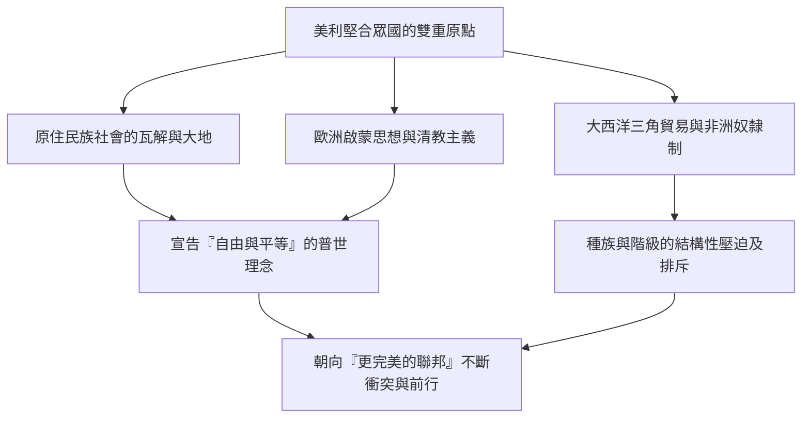
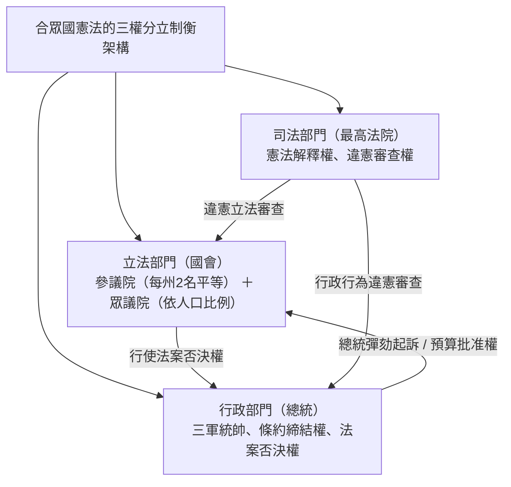
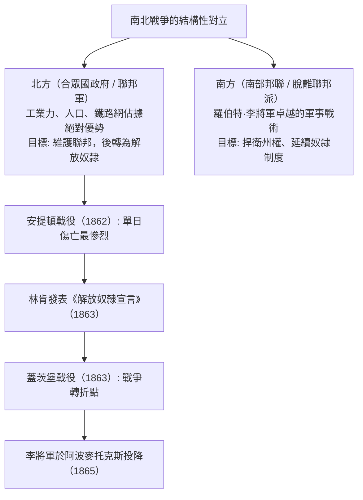
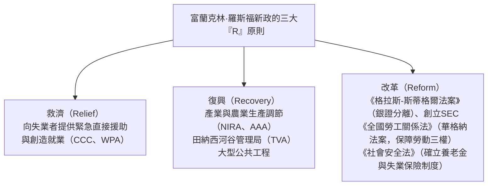
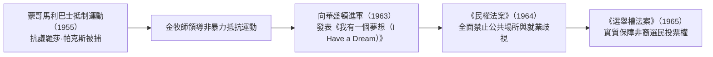
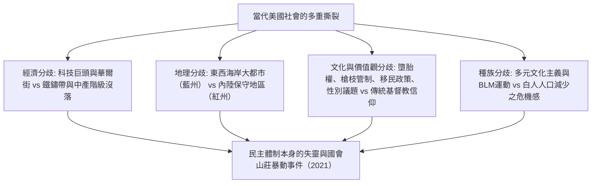
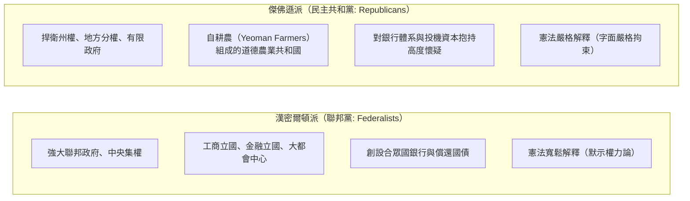

## 1. 導論：作為實驗國家的美利堅合眾國

### 1.1 「新大陸」的幻想與原住民族文明的實貌

在述說美利堅合眾國這個國家的歷史時，長久以來始終由「歐洲白人為了尋求自由而在蠻荒荒野中開闢的應許之地」這一神話敘事佔據主導地位。然而，20世紀後半葉以來人類學與歷史學的長足進展，揭示了一個明確的事實：在歐洲人抵達之前，這片大陸上早已繁榮興盛著綿延數千年、獨特而高度發達的原住民族（美洲印第安人）文明。

從密西西比河流域以卡霍基亞（Cahokia）巨大都市遺址為代表的築丘人文明，西南部阿納薩齊（普韋布洛）文化所構築的精美懸崖懸居群，到東北部由五大部族團結共建、具備高度民主聯邦體制的易洛魁聯盟（Haudenosaunee）等，當時北美大陸存在著多元且豐富的社會生態體系。自1492年哥倫布抵達後，源自歐洲的天花、麻疹、流行性感冒等傳染病（即所謂的「哥倫布大交換」）以及殘酷的征服屠戮，導致原住民族人口銳減了80%至90%。冷靜而客觀地體認到「新世界」乃是建立在對既有古老文明的毀滅之上，正是理解現代美國史不可或缺的起點。

---

### 1.2 清教徒前輩移民、五月花號公約與清教主義的精神烙印

繼1607年詹姆士敦（維吉尼亞殖民地）開埠拓殖之後，成為美國國民認同精神基石的，是1620年搭乘五月花號登上麻薩諸塞灣的分離派清教徒（清教徒前輩移民，Pilgrim Fathers）。

在登陸前夕於船艙內簽署的《**五月花號公約**》（Mayflower Compact），並非服膺於國王或封建領主自上而下的統治，而是「**基於自由個體的自願共識（社會契約），制定公正且平等的法律，創立自我治理的政治社會**」——這在人類文明史上是一份極具開拓意義的自治宣言。

清教領袖約翰·溫斯洛普（John Winthrop）所闡述的「山巔之城（A City upon a Hill）」理念——即與上帝立約的清教徒共同體必須成為光耀全球、供世人垂範的典範——這份強烈的使命感，日後成為深植於合眾國骨髓的根本基因，讓美國人深信自身承擔著引領世界的特殊天命，即「美國例外論（American Exceptionalism）」。

---

## 2. 從殖民地時代到獨立革命與合眾國憲法的誕生

### 2.1 十三殖民地的發展與「有益的疏忽」之終結

建立於大西洋沿岸的十三個英屬殖民地，各自孕育出截然不同的社會經濟結構：北部新英格蘭（以商業、漁業、小農經濟與清教信仰為核心）、中部殖民地（以穀物農業以及多元民族與宗教的馬賽克文化著稱）、南部殖民地（以種植菸草、稻米、藍靛的大型種植園與黑人奴隸勞動為支柱）。

直到18世紀中葉，英國本土對北美殖民地並未實施嚴密干預，而是奉行實質承認其自治地位的「**有益的疏忽（Salutary Neglect）**」政策。然而，在爭奪歐洲及全球霸權的七年戰爭北美戰場——「法印戰爭（1754–1763年）」中，英國雖然獲勝，卻也背負了天文數字般的沉重戰債。

英國議會遂以分擔防務經費為由，政策大轉向，對殖民地實施沉重苛稅：
- 《**食糖法**》（1764年）、《**印花稅法**》（1765年）：舉凡報紙、小冊子乃至撲克牌皆被徵收印花稅。
- 殖民地民眾群情激憤，高舉具有深厚憲政原則的口號：「**無代表不納稅（No taxation without representation）**」，並發起抵制英國貨品的抗爭。
- 歷經1770年的波士頓慘案、1773年的波士頓傾茶事件（將東印度公司的茶葉傾倒入海），隨著英國本土派遣軍隊進行鐵腕鎮壓（頒布《不可容忍法案》），武裝衝突已然進入無可避免的階段。

---

### 2.2 湯瑪斯·潘恩《常識》與獨立宣言（1776年）

1775年4月，列星頓與康科德戰役的槍聲劃破天際，美國獨立戰爭正式拉開序幕。當時，多數殖民地居民仍在效忠英國國王與爭取獨立自主之間徬徨動搖。

徹底打破這種猶豫不決的，是湯瑪斯·潘恩（Thomas Paine）於1776年1月匿名發表的劃時代小冊子《**常識**》（Common Sense）。潘恩以平實而激昂的文字，鏗鏘有力地論證了「由一個小小的島國永世統治一整座大陸是何等荒唐悖理」，並指出「世襲君主制在本質上就是踐踏人類自然權利的邪惡體制」。該書熱銷數十萬冊，在整個北美掀起了追求完全獨立的滔天巨浪。

隨後於1776年7月4日，在費城召開的第二屆大陸會議上，正式通過了由湯瑪斯·傑佛遜（Thomas Jefferson）主要起草的《**美國獨立宣言**》（Declaration of Independence）。

> 「我們認為以下真理是不言而喻的：人人生而平等，造物主賦予他們若干不可剝奪的權利，其中包括生命、自由和追求幸福的權利。為了保障這些權利，人們才在他們之間建立政府，而政府的正當權力，則源自被統治者的同意。」

這篇凝聚了約翰·洛克社會契約論與自然權利學說的崇高宣言，確立了人民反抗專制暴政的抵抗權（革命權），成為人類文明史上追求普世自由的永恆豐碑。

由喬治·華盛頓（George Washington）總司令統率的大陸軍，在物資極度匱乏與酷寒考驗中堅定展開持久戰。藉由薩拉托加戰役（1777年）的輝煌大捷，合眾國成功促成與法國、西班牙、荷蘭的軍事同盟。1781年約克鎮戰役中，聯軍徹底包圍並迫使英軍主力投降；1783年簽署《巴黎條約》，英國正式承認美利堅合眾國的完全獨立。

---

### 2.3 邦聯條例的破產與費城制憲會議（1787年）

獨立之初的合眾國，僅是由1781年生效的《邦聯條例》（Articles of Confederation）所維繫的十三個主權獨立州極為鬆散的國家聯盟（Confederation）。
- 中央政府（邦聯議會）既無徵稅權，也無常備軍，甚至缺乏規範對外貿易的法定權力。
- 當面對因戰後蕭條與重稅壓迫而引發農民武裝起義的「謝斯叛亂（1786年）」時，邦聯政府甚至無力調動軍隊平亂，新興國家面臨分崩離析的嚴重威脅。

1787年盛夏，55位代表（包括詹姆士·麥迪遜、亞歷山大·漢密爾頓、班傑明·富蘭克林等「建國先父」）齊聚費城獨立廳，起草並締造了現行的《**美利堅合眾國憲法**》。

- **大妥協（康乃狄克妥協案）**：融合了小州所主張的各州代表權平等（紐澤西方案）與大州所堅持的按人口比例分配（維吉尼亞方案），創立了由「參議院（每州固定2名）」與「眾議院（按人口比例分配）」組成的兩院制國會。
- **奴隸人口計算（五分之三妥協）**：為了在遏制南方各州過度膨脹政治發言權的同時達成建國共識，會議達成了一項歷史性妥協：在眾議院席次分配與直接稅計算中，將每名奴隸折算為自由民的「五分之三個人」。
- **權力制衡（Checks and Balances）**：奠基於孟德斯鳩的權力分立學說，將總統、國會與聯邦法院三大權力機構相互獨立，構建了一套精巧縝密的制度防火牆，防範任何個人或單一機關攫取專制獨裁權力。

---

## 3. 領土擴張、天命昭彰與動盪的南北戰爭

### 3.1 「天命昭彰」與橫跨大陸的領土擴張

19世紀上半葉，合眾國以驚人的速度向西部拓展領土。
- **1803年：路易斯安那購地案**：湯瑪斯·傑佛遜總統僅以1500萬美元從法國拿破崙手中購得密西西比河以西遼闊的路易斯安那殖民地，使合眾國國土面積瞬間倍增。
- **1823年：門羅宣言**：詹姆士·門羅總統宣示：「歐洲列強不得插手美洲大陸事務，合眾國亦不介入歐洲列強之爭端」，確立了孤立主義與互不干涉原則。
- **天命昭彰（Manifest Destiny，明白天命）**：「開拓並開發整個北美大陸直抵太平洋沿岸，傳播自由與民主體制，是上帝賦予合眾國的昭然天命」——這股兼具浪漫與擴張色彩的意識形態，徹底激發了全體國民的狂熱。

然而，在這場領土狂飆的背後，美洲原住民的生存家園遭到了殘酷無情的踐踏與摧毀。安德魯·傑克遜總統主導簽署的1830年《印第安人遷移法案》，強行將包括柴羅基族在內的東南部五大部族，從世代生息的林地老家，在嚴冬酷寒之中強徙數千公里，押解至貧瘠的奧克拉荷馬（印第安領地）。數千名印第安人因飢寒交迫與瘟疫肆虐慘死途中，這段血淚斑斑的遷徙之路，在歷史上被永遠銘刻為「**眼淚之路（Trail of Tears）**」。

經由美墨戰爭（1846–1848年）的勝利，合眾國奪得加利福尼亞、德克薩斯、新墨西哥等廣袤土地；伴隨1848年的加州淘金熱，合眾國最終完成了從大西洋延伸至太平洋的大陸型帝國版圖。

---

### 3.2 奴隸制的危機與國家分裂的加劇

然而，每當國土向西部延伸一分，一個具毀滅性的致命爭題便撕裂聯邦一次：「**在剛劃入的新準州中，究竟該准許還是禁止奴隸制？**」

- **北方經濟**：工業革命蓬勃發展，建立在自由受薪勞動力基礎上的製造業、商貿與金融業蒸蒸日上；北方強烈要求推行保護關稅以守護國內市場。
- **南方經濟**：建立在廣袤棉花種植園體系之上，徹底仰賴近400萬名非裔黑奴無償勞動的「棉花王國（King Cotton）」；為了將原棉大量銷往英國等海外市場，南方極力倡導自由貿易。

為了在聯邦國會中維持「自由州」與「蓄奴州」的力量平衡，政界接連出台權宜補偏之策，如1820年的《密蘇里妥協》（規定北緯36度30分以北之準州嚴禁奴隸制）以及1850年妥協案（強化《逃亡奴隸法》）。

然而，1854年通過的《堪薩斯-內布拉斯加法案》（主張由各準州居民公投決定是否實行奴隸制的人民主權論），旋即引發了被稱為「血濺堪薩斯」的殘酷內戰狀態。緊接著在1857年，聯邦最高法院作出了臭名昭著的「**史考特訴山福特案（德雷德·史考特判決）**」，裁定「黑人並非憲法意義上的公民，不享有任何憲法權利」，更宣判「聯邦國會無權在準州內禁止奴隸財產所有權，違者違憲」，此舉徹底激怒了北方的反奴隸制民意。

---

### 3.3 南北戰爭（1861–1865）：浴血的重新統一與奴隸解放

在1860年總統大選中，以「堅決遏止奴隸制向西部擴散」為政綱的共和黨候選人亞伯拉罕·林肯（Abraham Lincoln）勝選。隨即，南卡羅來納州等南部七州宣告脫離聯邦，並組建「美利堅聯盟國（南部邦聯，Confederate States of America）」。

1861年4月，隨著南軍砲轟薩姆特堡，「**南北戰爭（美國內戰，American Civil War）**」全面爆發。

林肯將這場戰爭的本質，從單純「平定內亂以維持聯邦統治」昇華為「爭取人類自由的神聖聖戰」：
- **1863年1月1日：《解放奴隸宣言》（Emancipation Proclamation）**：宣佈南部叛亂地區的所有奴隸即刻獲得自由。此舉促成約18萬名非裔黑人士兵大規模加入聯邦軍隊，同時在道德高度上徹底封殺了英、法兩國干涉並援助南方的可能性。
- **1863年11月：蓋茨堡演說**：林肯莊嚴宣告，必須確保「**民有、民治、民享的政府（Government of the people, by the people, for the people）**」永續存於世間。

歷經殘酷的總體戰與焦土政策（雪曼將軍著名的「向大海進軍」），1865年4月，南軍總司令羅伯特·李將軍在維吉尼亞州阿波麥托克斯向北軍統帥格蘭特將軍簽署降書。在付出逾60萬人喪生的合眾國史上最大慘痛代價後，美國接連批准了憲法第十三修正案（廢除奴隸制）、第十四修正案（正當法律程序與法律平等保護權）、第十五修正案（不得基於種族剝奪投票權），合眾國至此完成了從鬆散的「國家聯盟」向「不可分割的統一民族國家」的浴火重生。

然而，當戰後重建時期（Reconstruction）落幕後，南部各州相繼制定了臭名昭著的「吉姆·克勞法（種族隔離法）」，針對黑人的殘酷種族隔離制度與三K黨（KKK）肆虐的私刑黑夜，依舊籠罩了這片土地長達大半個世紀。

---

## 4. 鍍金時代、產業革命與帝國主義的曙光

### 4.1 巨額資本的崛起與「鍍金時代」

南北戰爭結束後至20世紀初，美國經濟呈現出人類歷史上空前絕後的狂暴擴張。大文豪馬克·吐溫（Mark Twain）將這個時代生動地譏諷為「**鍍金時代（Gilded Age）**」——表面金碧輝煌耀眼，內核卻充斥著貪婪、腐敗與道德敗壞。

- 1869年第一條橫貫大陸鐵路全線貫通，將整個全美版圖焊接成為一個前所未見的龐大單一國內市場。
- **強盜男爵（Robber Barons）的托拉斯壟斷**：
  - 約翰·D·洛克菲勒創辦的「標準石油（Standard Oil）」，一度雄霸全美90%的石油煉製產能。
  - 安德魯·卡內基打造的鋼鐵帝國（卡內基鋼鐵）。
  - J·P·摩根推動的金融資本高度集中與巨型托拉斯聯合（締造美國鋼鐵公司）。
- 愛迪生發明電網系統、貝爾發明電話，以及亨利·福特引進流水線裝配作業（福特主義），推動美國工業產值迅速甩開英國與德國，一躍成為高踞世界第一的工業超級巨擘。

與此同時，極端的貧富懸殊與惡劣非人的勞動環境，點燃了諸如霍姆斯特德罷工與普爾曼大罷工等血染的勞資衝突；從歐洲湧入的數千萬「新移民」（包含義大利裔、愛爾蘭裔與東歐猶太裔）紛紛在各大都市聚居，形成了貧困擁擠的貧民窟。

---

### 4.2 邊疆的終結與海外領土的擴張

在1890年的美國人口普查中，歷史學家弗雷德里克·傑克遜·特納正式提出了「邊疆（Frontier）終結」論。當孕育了美國人開拓進取精神與民主活力的西部邊疆宣告完全消失，合眾國的擴張目光不可避免地投向了浩瀚的太平洋與中拉丁美洲海外市場（馬漢的海權論深刻影響了這一時期的國策）。

- **1898年：美西戰爭**：以「緬因號戰艦爆炸事件」為導火線向西班牙宣戰，在短短數月內大獲全勝。合眾國一舉攫取了菲律賓、關島與波多黎各，並吞併夏威夷，瞬間蛻變為跨越兩大洋的海洋帝國。
- **門戶開放照會（1899年）**：面對列強瓜分中國的狂潮，美國國務卿約翰·海伊發表門戶開放宣言，主張「門戶開放、機會均等、領土完整」，藉以強勢打入亞洲市場。

在國內，為了匡正壟斷資本的暴虐專橫與政治腐敗，西奧多·羅斯福總統（鐵腕拆解壟斷托拉斯、開創自然保育事業）與伍德羅·威爾遜總統大舉推進了「**進步主義（Progressivism）**」運動，具體促成了《休曼反托拉斯法》的嚴格執法、聯邦準備制度（Fed）的創設，以及女性參政權的確立（憲法第十九修正案）。

---

## 5. 兩次世界大戰、經濟大蕭條與美利堅和平的確立

### 5.1 第一次世界大戰與「咆哮的二〇年代」

1914年第一次世界大戰爆發時，合眾國最初謹守中立立場，透過向交戰雙方及協約國大量出口軍火與物資，從昔日的債務國一躍成為坐擁巨資的全球最大債權國。然而，隨著德國推行「無限制潛艇戰」以及「齊默曼電報事件」曝光，美國於1917年毅然宣戰參戰。

威爾遜總統提出著名的《**十四點和平原則**》，力倡廢除秘密外交、落實民族自決理念，並構想創立國際聯盟。然而，戰後的美國參議院基於深植的孤立主義傳統，斷然否決批准《凡爾賽條約》，最終選擇不加入國際聯盟。

步入1920年代，合眾國迎來了被稱為「**咆哮的二〇年代（Roaring Twenties）**」的空前大眾消費社會黃金歲月。
- 收音機、平民汽車（福特T型車）、好萊塢電影、爵士樂與各類家用電器迅速普及至千家萬戶。
- 華爾街金融市場沉浸在全民炒股的狂熱浪潮中，「永久繁榮」的狂想深入人心。
- 然而繁華的背後，禁酒令（憲法第十八修正案）的推行催生了黑手黨黑道（如艾爾·卡彭）的猖獗橫行，排外主義與宗教保守主義的陰霾（三K黨死灰復燃、排外性移民配額法案出台）亦同步籠罩社會。

---

### 5.2 世界恐慌與紐約新政政策

1929年10月24日——「黑色星期四（Black Thursday）」。紐約華爾街股市的斷崖式雪崩，拉開了全球經濟大蕭條的序幕。
全美數千家銀行應聲倒閉，失業率高達25%（每4名勞工中就有1人失業）；同時中西部遭遇毀滅性的沙塵暴肆虐（黑色風暴事件），大批破產農民淪為流離失所的難民。胡佛總統墨守成規的自由放任主義應對政策全面崩潰。

1933年臨危受命宣誓就任的富蘭克林·D·羅斯福（FDR）總統，雷厲風行推行了「**新政（New Deal）**」。

新政在凱因斯經濟學成型之前，便大膽以國家力量強力介入市場經濟運作，奠定了美國福利國家的制度根基；它前所未有地擴張了聯邦行政權力與總統權威，成為當代美國現代自由主義（Liberalism）的原點與基石。

---

### 5.3 第二次世界大戰與全球霸權的確立

1941年12月7日，日本偷襲珍珠港，將美國徹底推入了第二次世界大戰的烈焰之中。

合眾國將自身定位為「**民主國家的兵工廠（Arsenal of Democracy）**」，在彈指之間將全美民用工業動員轉化為浩瀚的軍火產能。汽車生產線全面轉產坦克與戰鬥機，大批女性勞工（「鉚工蘿西」）昂首邁入兵工廠。

- 在歐洲戰場，成功發起諾曼第登陸戰役（1944年），合力粉碎了納粹德國法西斯政權。
- 在太平洋戰場，透過跳島戰術步步推進，最終迫使大日本帝國無條件投降。
- 藉由極機密的「曼哈頓計劃」成功研發出原子彈，並於廣島與長崎投下，改變了人類軍事歷史。

大戰落幕之際，美利堅合眾國獨佔了全球一半以上的工業產值，儲備著全世界70%的黃金，作為唯一的核武強權傲視群雄。
1944年的布列敦森林協定奠定了**以美元為全球核心儲備貨幣的國際金融秩序（IMF與世界銀行誕生）**；1945年舊金山會議通過了《聯合國憲章》。名實相符的「**美利堅和平（Pax Americana）**」世紀自此正式開啟。

---

## 6. 冷戰格局、民權運動與美國的榮耀與苦痛

### 6.1 東西冷戰與核威懾的陰影

在二次大戰的廢墟與焦土上，由合眾國引領的資本主義自由陣營，與蘇維埃聯邦領導的社會主義陣營之間，爆發了長達數十年的全球超級大國對抗——「冷戰（Cold War）」。

- **1947年：杜魯門主義**：旨在遏制共產主義對外擴張的「圍堵政策（Containment Policy）」。
- **馬歇爾計劃**：向西歐諸國傾注巨額復興資金，構築抵禦共產擴張的經濟防波堤。
- **1949年：北大西洋公約組織（NATO）成立**：正式構築起集體安全防衛體系。
- 韓戰（1950–1953年）的爆發，以及在美國國內引發極端反共思想審查的「麥卡錫主義（紅色恐慌）」。

在1962年的**古巴飛彈危機**中，圍繞蘇聯在古巴秘密部署核導彈基地，甘迺迪總統與蘇聯領導人赫魯雪夫針鋒相對，人類文明走到了距離核毀滅深淵僅一步之遙的最危急關頭。建立在「相互保證毀滅（MAD）」機制之上的恐怖平衡，自此籠罩了全球地緣政治。

---

### 6.2 民權運動：爭取真正平等的奮鬥

二次大戰之後，美國中產階級白人享受著搬遷至郊區（Suburb）獨棟住宅、坐擁彩色電視與大型冰箱的優渥富足；然而生活在南方的數百萬黑人，卻依舊在殘酷的種族隔離與全方位歧視中苦苦掙扎。

1954年聯邦最高法院在「**布朗訴托皮卡教育局案**」中，判定公立學校內的種族隔離制度「本質上是不平等的」，從而宣告違憲，點燃了全美民權運動的熊熊烈火。

面對馬丁·路德·金恩（Martin Luther King Jr.）牧師領導的非暴力直接行動（靜坐抗議、自由乘車運動、大規模和平遊行），南方白人警察出動警犬撕咬、以高壓水槍野蠻鎮壓，這些殘酷畫面透過電視轉播震撼全美，深刻喚醒了全社會的道德良知。在林登·B·詹森總統任內，《**1964年民權法案**》與《**1965年選舉權法案**》相繼立法通過，橫亙一個世紀之久的種族隔離法律體制終於宣告壽終正寢。

---

### 6.3 越戰泥淖與反文化浪潮

然而，深陷東南亞「骨牌理論」（認定一個國家赤化必將引發周邊鄰國骨牌式倒戈）迷思的合眾國，在越南戰爭（1965–1973年）中泥足深陷，難以自拔。
叢林游擊戰的殘酷消耗、落葉劑橙劑的大規模噴灑、美萊村平民屠殺慘案，以及數萬名應徵入伍的美國青年魂斷異鄉，將民眾對政府的信任徹底擊得粉碎。

以全美大學校園為策源地，浩大的反戰示威浪潮席捲全國，嬉皮運動、搖滾樂（如傳奇的胡士托音樂節）、婦女解放運動（Women's Lib）、環境保護運動等「**反文化浪潮（Counterculture）**」如暴風雨般滌蕩社會。1974年，尼克森總統因掩蓋「水門案」醜聞，在彈劾風暴中成為美國歷史上首位辭職下台的總統；隨後伴隨停滯性通膨與卡特政府的內政外交困境，美國陷入了精神與道德層面的深刻迷茫與低谷。

---

## 7. 從雷根經濟學到後冷戰、九一一與當代社會的深刻裂痕

### 7.1 雷根革命與冷戰終結

1980年，高舉「讓美國再次偉大（Make America Great Again）」旗幟的隆納·雷根（Ronald Reagan）以壓倒性優勢當選總統。

- **雷根經濟學（Reaganomics）**：奠基於供給面經濟學，大舉推動歷史性減稅、大刀闊斧放寬政府管制、削減社會福利支出，並緊縮貨幣供應以抑制通膨。這一套以「小政府」為標竿的新自由主義（Neoliberalism）浪潮迅速席捲全球。
- **正面迎擊「邪惡帝國」**：美國大舉編列國防預算，推進「戰略防禦倡議（SDI，即星戰計劃）」，在軍備競賽中以龐大的經濟與技術優勢徹底拖垮了蘇聯僵化的計畫經濟。
- 隨著1989年柏林圍牆倒塌，以及1991年蘇聯解體，橫跨半個世紀的冷戰最終以合眾國的徹底全勝告終。歷史學者法蘭西斯·福山（Francis Fukuyama）將這段歷史定義為「歷史的終結（自由民主體制與市場資本主義的終極勝利）」。

---

#---

## 7.1.5 波斯灣戰爭（1991）與鮑爾主義的軍事革命

冷戰剛剛宣告終結的1990年8月，伊拉克總統海珊悍然揮軍閃電入侵鄰國科威特。老布希總統迅速爭取到聯合國安理會授權決議，組建由34個國家構成的龐大多國部隊，於1991年1月正式啟動「沙漠風暴行動（波斯灣戰爭）」。

### 擺脫越戰夢魘的軍事教條
鑑於越南戰爭陷入無底泥淖的沉痛歷史教訓，時任參謀長聯席會議主席柯林·鮑爾將軍提出了深具轉折意義的「**鮑爾主義（Powell Doctrine）**」：
1. 國家核心利益面臨重大且明確的直接威脅。
2. 唯有在窮盡一切外交與經濟制裁手段之後，方能動用武力作為「最後手段」。
3. 必須設定清晰、精確且切實可行的軍事戰略目標。
4. 必須一次性投入「**壓倒性軍力（Overwhelming Force）**」，剝奪敵方任何還手餘地，以迅雷不及掩耳之勢速戰速決獲取全勝。
5. 在採取軍事行動之前，必須確立明確的退場機制（Exit Strategy）。

美軍在戰爭中向全球展示了F-117夜鷹匿蹤戰鬥機、GPS精確導引炸彈（智慧炸彈）、戰斧巡弋飛彈與愛國者防空飛彈等劃時代高科技武器的毀滅性打擊力量，並透過CNN等衛星電視向全世界24小時實況轉播，最終在短短100小時的地面戰中便徹底粉碎了伊拉克精銳部隊。

老布希總統豪邁宣布：「越戰的幽靈已然被深深埋葬於波斯灣的黃沙之下」，合眾國以「全球唯一超級強權」之姿，主導建構「世界新秩序（New World Order）」的信心達到巔峰。然而歷史極具諷刺意味的是，正是這場過於懸殊的輝煌大捷，使後續掌權者淡忘了鮑爾主義的審慎自律，為2003年伊拉克戰爭中輕率涉險並陷入災難性佔領泥淖的致命自負（Hubris），埋下了深遠禍根。

## 7.2 全球化的榮景與陰影，以及資訊科技革命

在1990年代比爾·柯林頓執政期間，冷戰落幕帶來的國防開支縮減（和平紅利），與以矽谷為搖籃的網際網路資訊科技（IT）革命相互交織共振，催生了美國歷史上前所未有的經濟黃金繁榮期（新經濟）。

在美國力推《北美自由貿易協定》（NAFTA）以及促成中國加入世界貿易組織（WTO）的帶領下，全球經濟一體化以風馳電掣之勢狂飆推進。然而，這種超全球化與金融資本主義的登峰造極，卻在美國國內撕扯出深重的結構性裂痕：
- 製造業產能大規模外流至勞動力成本低廉的中國與墨西哥，使得中西部與「鐵鏽帶（Rust Belt）」傳統製造業重鎮的白人工人階級迅速沉淪瓦解。
- 東西兩岸的科技新貴、金融菁英，與內陸廣大被時代拋下的藍領工人之間，經濟與文化鴻溝被急劇拉大到了幾近無法彌合的危險地步。

---

### 7.3 九一一恐怖攻擊事件與「反恐戰爭」的挫敗

2001年9月11日，蓋達組織恐怖分子劫持客機，悍然撞擊紐約世界貿易中心雙塔與五角大廈，釀成了駭人聽聞的「九一一恐怖攻擊事件」。自本土遭受突襲的美國社會爆發了空前的愛國主義同仇敵愾情緒，小布希總統隨即向全球宣告啟動「全球反恐戰爭」。

- 出兵阿富汗，迅速擊潰並推翻塔利班政權。
- 2003年：以伊拉克秘密研製「大規模殺傷性武器」為由，發動伊拉克戰爭。
- 然而，聯軍在伊拉克境內始終未能尋獲大規模殺傷性武器，中東地區反倒陷入了曠日持久的教派內戰，並淪為極端恐怖組織（伊斯蘭國，ISIS）滋生擴散的溫床。數千名美軍將士戰死沙場，數兆美元國富化為烏有，美國在國際社會上的道德號召力與戰略信譽蒙受了無法挽回的重創。

---

### 7.4 雷曼兄弟破產風暴、歐巴馬、川普現象與二十一世紀的混局

2008年，因華爾街次級房貸泡沫徹底破裂，引發了被稱為「雷曼兄弟倒閉風暴」的全球金融海嘯。在資本主義體制基石劇烈動搖之際，高喊「Change（改變）」與「Yes We Can」口號的巴拉克·歐巴馬（Barack Obama），創造歷史成為合眾國首位非裔總統。儘管他成功推動了歷史性的平價醫療法案（歐巴馬健保），但與保守派草根勢力「茶黨運動」之間的政黨極化對立，卻將華府政治拖入了全面癱瘓的死胡同。

隨後在2016年，承載著鐵鏽帶失意白人民眾對建制派政治菁英與全球化浪潮怒火（「鐵鏽帶的逆襲」）的政治素人唐納·川普（Donald Trump），爆冷當選美國總統。

正如2021年1月6日發生的國會山莊遭衝擊事件所鮮明昭示的那樣，今日的美利堅合眾國，正深陷建國以來最為嚴峻的「全民共識瓦解」危機之中。

---

---

## 2.4 建國先父的思想決裂：漢密爾頓 vs 傑佛遜大辯論

合眾國憲法正式獲得批准生效之後，在首任總統喬治·華盛頓的內閣之中，圍繞著美利堅這個新興國家未來的發展方向與根本藍圖，爆發了一場在人類政治思想史上堪稱空前絕後的思想交鋒——財政部長亞歷山大·漢密爾頓與國務卿湯瑪斯·傑佛遜之間的路線大決裂。

### ① 經濟構想的激烈交鋒：金融帝國，抑或農業共和國？
- **漢密爾頓的戰略構想**：力圖將美國打造成如大英帝國般強盛的現代工商業、金融與軍事帝國。他主張由聯邦政府全盤承接各州在獨立戰爭期間積欠的戰時債務（《債務承擔法》），藉由發行聯邦國債奠定信用體系，創設「第一合眾國銀行（First Bank of the United States）」；同時以關稅政策扶植本土製造業，致力於建構一個擁有強大常備軍與專業官僚機制的中央集權國家。
- **傑佛遜的理想圖景**：堅信繁華的大都市與工廠勞工極易滋生道德墮落與腐敗，認為在經濟上仰人鼻息者斷不可能擁有真正的公民自主性。唯有腳踏實地在廣袤大地上自食其力的自耕農（Yeoman Farmers），方為純潔道德與公民美德（Virtue）的泉源。因此他極力主張中央政府僅需掌管國防與最低限度的外交權限，堅決捍衛「小政府」理念。

### ② 憲法解釋的重大歧異：默示權力論 vs 嚴格解釋論
- 圍繞著聯邦國會究竟有無權限創立國家中央銀行（合眾國銀行），引爆了憲法解釋學說史上具有決定性意義的分水嶺。
- **傑佛遜的嚴格解釋論（Strict Construction）**：憲法第一條第八款明確列舉的國會權限中，絕無「設立銀行」之字樣。行使憲法未曾明文授予的權力，乃是掠奪各州主權與人民自由的嚴重違憲行為（此即憲法第十修正案的核心精神）。
- **漢密爾頓的寬鬆解釋論（Loose Construction）**：依據憲法第一條第八款第十八項的「必要且適當條款（Necessary and Proper Clause，即彈性條款）」，漢密爾頓有力地論證道：聯邦政府為了切實有效履行徵稅與管理公債等憲法明文列舉職權，其所必須採取的一切必要附隨手段，即便憲法未載明文，亦具備憲法賦予的「默示權力（Implied Powers）」，因而是完全合憲的。漢密爾頓這一卓越的法理構想，日後經由馬歇爾最高法院首席大法官在「麥卡洛克訴馬里蘭州案（1819年）」中確立為牢不可破的司法先例，奠定了近代強大聯邦中央政府的法治磐石。

---

## 3.6 南北戰爭的軍事與科技史轉折點及重建時期的挫敗

南北戰爭在世界軍事史上被公認為「史上第一場現代總體戰（First Modern Total War）」。工業革命所孕育出的最新尖端科技首次全方位投入戰場，使拿破崙時代古典華麗的野戰排隊衝鋒戰術瞬間退化為血腥的自滅之舉。

### ① 軍事科技的革命
1. **線膛步槍與米尼彈（Minié Ball）**：
   - 傳統滑膛槍（Musket）的有效殺傷射程僅有 $50 \sim 100$ 碼；相較之下，槍管內部具備螺旋膛線（Rifling）的線膛步槍搭配軟鉛製成的米尼彈，將步兵有效射程一舉拉長至 $300 \sim 500$ 碼。
   - 然而交戰雙方指揮官依然慣性沿用陳舊的密集隊形發動正面衝鋒，在機關槍誕生前夕的可怕交叉火網下，成批步兵慘遭成片割倒，在蓋茨堡戰役（皮克特衝鋒）等激戰中遺留下橫屍遍野的慘烈景象。戰場由此不可避免地加速滑向殘酷的「塹壕戰」。
2. **鐵路與電報的全面軍事化應用**：
   - 北方聯邦軍善用四通八達的密集成網鐵路系統，能夠在短短數天之內將數以萬計的增援部隊與軍需補給調度投送至千里前線。
   - 林肯總統常駐白宮電報室，透過電報與前線戰場各兵團指揮官展開即時戰略商討，展現了人類歷史上最早的現代遠距指揮與管制（C4I）系統雛形。
3. **鐵甲艦的劃時代對決**：
   - 1862年的漢普頓錨地海戰中，南軍鐵甲艦「維吉尼亞號」（原梅里馬克號）與北軍配備旋轉砲塔的鐵甲艦「莫尼特號」爆發史詩級交鋒，宣告了稱霸千年的木造風帆戰艦時代在一夜之間徹底落幕。

### ② 重建時期（Reconstruction: 1865–1877）的挫折與吉姆·克勞的黑夜
林肯遇刺後接任總統的安德魯·詹森因對南方寬宥無度，引發國會內激進派共和黨人憤而奪取主導權，將南部劃分為五大軍管區，強制南方賦予非裔黑人投票權，從而選出了首批黑人參眾議員（激進重建）。

然而，隨著1877年圍繞總統大選爭端達成的政治幕後交易（海斯-蒂爾登妥協），聯邦軍隊自南部全面撤軍，南方白人農場主種植園階層迅速奪回州政權（成立「救贖者」白人政權）：
- 南部各州隨即制定了縝密惡毒的法律枷鎖：包括徵收人頭稅（Poll Tax）、嚴苛刁難的識字測驗（Literacy Test），以及包藏禍心的祖父條款（僅有在1867年以前具選民資格者的後代方得免試），在事實上剝奪了廣大非裔黑人的投票權。
- 1896年聯邦最高法院在「**普萊西訴弗格森案**」中，竟正式確立了「隔離但平等（Separate but Equal）」的法理原則，公然為大眾交通工具與公立學校等場所實行種族隔離大開綠燈。這套黑暗的吉姆·克勞法種族隔離體系，自此肆虐維持了半個多世紀，直至1950年代民權運動方被撬動動搖。

---

## 7.5 司法政治與二十一世紀最高法院判例攻防戰

當代美國政治社會深刻撕裂的最前沿陣地，莫過於圍繞聯邦最高法院大法官人選結構與重大憲法判例翻轉的「司法大戰（Judicial Wars）」。

### ① 墮胎權的法理角力：從羅訴韋德案到多布斯案的歷史性翻轉
- **1973年：羅訴韋德案（Roe v. Wade）**：最高法院依據憲法第十四修正案正當法律程序條款所涵蓋的「隱私權（Right to Privacy）」，宣告女性終止妊娠的權利屬於受憲法保障的基本自由權利。
- 針對此判決，以基督教福音派為中堅力量的宗教保守派（反墮胎「挺生命」陣營，Pro-Life），在長達半個世紀的歲月中與共和黨緊密結盟，發起了一場持久的組織運動，誓言「將持反墮胎立場的保守派大法官送入最高法院」。
- 川普執政期間成功任命了三位保守派大法官（葛薩奇、卡瓦諾、巴瑞特），使最高法院形成了「保守派6比自由派3」的絕對優勢結構。隨之而來的是，在2022年的「**多布斯訴傑克森婦女健康組織案（Dobbs v. Jackson）**」中，最高法院以震撼全美之勢推翻了維持長達50年的羅訴韋德案判決。判決宣稱「合眾國憲法既未明文保障墮胎權，該權利亦非深深植根於本國歷史與傳統」，從而將規制墮胎的立法權限全數交還給各州議會。
- 這項劃時代的判例翻轉，導致南部與中西部的多個保守紅州迅速出台全面禁止墮胎的嚴刑峻法；而民主黨主政的深藍州（如加利福尼亞與紐約）則大肆宣示成立墮胎「庇護州（Sanctuary）」，將國家在法律體系上的對立推向了無法彌合的撕裂深淵。

### ② 擁槍權利：憲法第二修正案的原意主義詮釋
- **憲法第二修正案**：「紀律良好的民兵為保障自由州之安全所必需，人民持有及攜帶武器之權利不得予以侵犯。」
- **2008年：哥倫比亞特區訴海勒案（District of Columbia v. Heller）**：在大法官安東寧·斯卡利亞引領的原意主義（Originalism，即堅持依照制憲當時公眾對法律文字的原始理解來解釋憲法的學派）詮釋下，最高法院首度在判決中定性：第二修正案所賦予的權利，乃是「無論個人是否隸屬於有組織的民兵體系，全體公民皆享有出於合法自衛目的而持有槍械的絕對個人基本權利」。即便大規模槍擊慘案頻繁上演，聯邦層級卻始終無法通過具有實質約束力的嚴格槍枝管制法案，其背後正是依賴這座難以撼動的司法判例堡壘。

---

## 6.5 尼克森震撼（1971）與石油美元體系的確立

在20世紀後半葉的國際金融與地緣政治版圖中，最富戲劇性的一場地殼震盪，莫過於1971年8月15日理查·尼克森總統閃電向全球發表的「尼克森震撼（美元震撼，Nixon Shock）」。

### ① 布列敦森林體系的崩解
二次大戰尾聲的1944年於合眾國新罕布夏州布列敦森林確立的戰後國際貨幣體系，乃是由合眾國向全球鄭重承諾「**1盎司黃金＝35美元**」的固定官方兌換率，各國貨幣則與美元維持固定匯率的「黃金-美元兌換本位制（Gold-Exchange Standard）」。

然而，步入1960年代後期，林登·詹森政府的「大社會（Great Society）」福利擴張，加之越戰無底洞般的軍費黑洞，導致美國財政赤字與國際收支逆差急劇膨脹。以西德與法國為首的歐洲諸國開始對美元產生動搖，紛紛要求依約將庫存的美元紙幣兌換為實物黃金，導致諾克斯堡聯邦黃金儲備急劇流失，面臨枯竭見底的絕境。

尼克森總統於電視演說中單方面悍然宣佈：「**合眾國即刻且無限期停止美元與黃金的官方兌換**」。布列敦森林體系隨之土崩瓦解，自1973年起，全球經濟全面步入了由市場供需自由決定匯價的「浮動匯率制度（Floating Exchange Rate System）」。

### ② 石油美元（Petrodollar）體系的誕生
失去了黃金兌換錨定的美元，瞬間面臨劇烈通膨與信用暴跌的重大生存危機。此時，尼克森政府的國務卿亨利·季辛吉暗中籌謀策劃，於1974年與全球最大產油國沙烏地阿拉伯展開了一場密室外交交易：
- 美國向沙烏地王室提供最先進的頂級軍事保護傘與防衛承諾。
- 作為交換，沙烏地阿拉伯正式同意「**將全球石油（原油）買賣結算貨幣完全限定為美元**」（並隨後推廣至整個石油輸出國組織OPEC）。
- 由此一來，全世界任何國家若要購買現代工業文明的血液——石油，就必須在外匯儲備中持續持有龐大的美元資金（**石油美元體系**）。合眾國從而確立了一項無與倫比的「過度特權（Exorbitant Privilege）」：僅需憑藉本土聯邦準備系統印刷的不兌現法定紙幣（Fiat Money），即可源源不絕地收購並支配全世界最為核心的能源物資。

---

## 7.6 移民國家的面貌劇變：1965年移民法與人口結構的地緣板塊變遷

自深層重塑當代美國社會基因認同的另一場無聲革命，是由林登·詹森總統於1965年正式簽署生效的《**移民與國籍法**》（哈特-賽勒法案，Hart-Celler Act）。

此前實行的1924年移民法（約翰遜-里德法），嚴格採用以1890年全美人口結構為基準的「國籍配額制」，其核心本質在於赤裸裸地偏袒英德等西北歐白人移民，並將南歐、東歐以及全亞洲移民極盡排斥於國門之外。

1965年法案徹底廢除了這套赤裸的種族配額限制，轉而確立了以「親屬團聚（家庭團聚）」與「高技術專業勞工」為核心導向的全新審批架構。
- 當時國會議員普遍認定此修法不致引發全國人口結構的巨大變遷，但實際後果卻極具顛覆性。
- 歐洲移民急劇銳減，取而代之的是拉丁美洲（墨西哥及中美洲各國）與亞洲各國（包括華人、菲律賓、印度、韓國、越南）的移民呈爆炸式激增。
- 在2020年代的美國聯邦人口普查中，非西語裔白人的人口佔比已降至約 $58\%$；預計在2045年前後，美國將不可逆轉地「**跨越白人人口跌破半數、不再存在單一多數族群的多數-少數社會（Majority-Minority Society）**」門檻。

面對這股急速來襲的人口結構巨變，傳統白人工人階級內心深處滋生出強烈的「被剝奪感」與「國將不國」的存在焦慮，這正是強烈驅動川普主義（反對非法移民、構築美墨邊境圍牆、「美國優先」浪潮）最為深層的集體心理引擎。

---

## 8. 結語：永無止境、邁向「更完美的聯邦」之挑戰

美利堅合眾國的歷史，絕非單純是一部領土吞併與軍事、經濟霸權崛起的編年史，它更是一部「**崇高理念不斷被現實殘酷矛盾擊碎，而後又在瓦礫殘垣中艱難重新淬鍊理想的宏大苦鬥史**」。

合眾國憲法前言在開篇便以莊嚴磅礡的筆觸寫道：
> 「**我們合眾國人民，為建立更完美的聯邦（in Order to form a more perfect Union）……**」

建國先父們從未自認所創設的國家在起點就是十全十美的。正因如此，他們在憲法文本中並未採用靜態的「完美的聯邦（perfect Union）」，而是刻意使用了具有動態追尋意涵的比較級——「**更完美的（more perfect）** 聯邦」。

對原住民族的掠奪殺戮、黑奴制度的原罪、種族隔離的恥辱、對外霸權干預的謬誤——儘管合眾國歷史上屢屢鑄下駭人聽聞的彌天大錯，但每一次歷經陣痛之際，公民始終能以自身的奮起抗爭修正憲法、匡正法紀，將自由與平等的疆界一步步拓寬推展；正是這種強韌的內在自我修復能力，展現出這個實驗國家無可替代的真正底氣。

在撕裂與互信崩解的21世紀當代，美利堅合眾國能否重尋其最初立國的原點——「合眾為一（E Pluribus Unum：多元一體）」，重新向全球高舉希望的明燈？尋求這個答案的偉大航程，至今仍在波濤洶湧中繼續前行。
