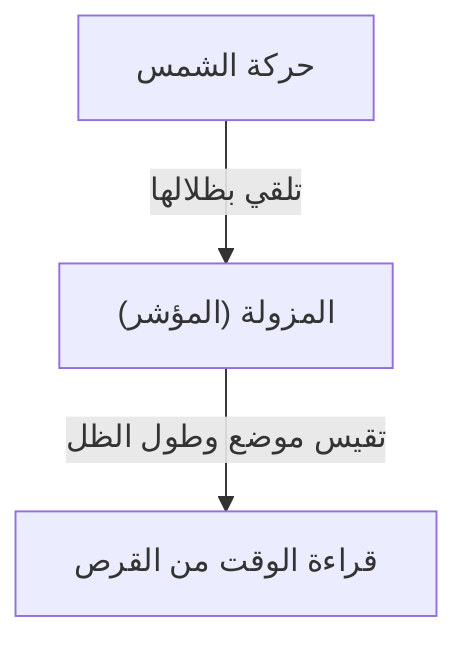
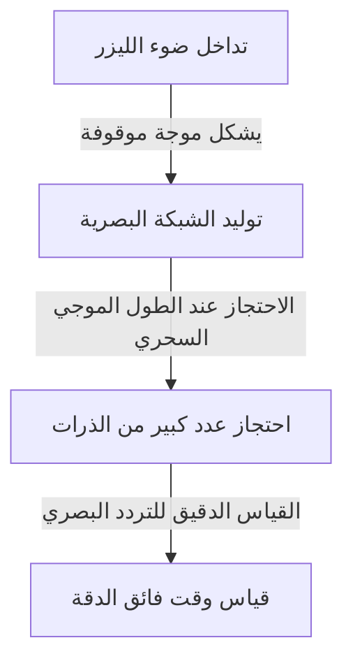

# ما هو الوقت: سعي البشرية اللانهائي والساعات

يُعد "الوقت" أحد أكثر المفاهيم المألوفة وفي نفس الوقت الأكثر غموضًا بالنسبة لنا نحن البشر. على الرغم من أن الوقت غير مرئي ولا يمكن لمسه، إلا أن حياتنا محكومة به تمامًا. كان تاريخ البشرية عبارة عن تحدٍ مستمر لكيفية التقاط هذا "الوقت" وقياسه بدقة. في هذا المقال، سنكشف بالتفصيل عن تاريخ قياس الوقت البشري وتطور الفيزياء الكامنة وراءه، من الساعات الشمسية القديمة إلى أحدث الساعات الشبكية البصرية التي تستخدم تكنولوجيا الكم.

## 1. فجر قياس الوقت: حركات الأجرام السماوية والدورات الطبيعية

كانت المؤشرات الأولى التي استخدمها البشر لقياس الوقت هي حركات الأجرام السماوية مثل الشمس والقمر والنجوم. كانت حركة الشمس من الشروق إلى الغروب، وأطوار القمر، وتغير الفصول معلومات لا غنى عنها للزراعة والصيد والطقوس الدينية.

### ولادة الساعات الشمسية والمائية
في حوالي عام 3500 قبل الميلاد في مصر القديمة وبابل، كانت "الساعات الشمسية (المسلات)" قيد الاستخدام بالفعل. كان هذا نظامًا لتقسيم وقت النهار عن طريق قياس طول واتجاه ظل عمود (المزولة) يقف عموديًا على الأرض.

ومع ذلك، كان للساعات الشمسية عيب قاتل: فهي "لم تكن قابلة للاستخدام في الليل أو في الأيام الملبدة بالغيوم." للتعويض عن ذلك، تم اختراع "الساعات المائية" و"ساعات الاحتراق (ساعات الشموع وساعات البخور)". كانت هذه الأدوات، التي تقيس الوقت من خلال الاستفادة من خاصية تقاطر الماء بمعدل ثابت أو سرعة احتراق الأشياء، اختراعات رائدة لا تتأثر بالطقس.

## 2. ولادة الساعات الميكانيكية و"تساوق البندول"

مع دخول العصور الوسطى في أوروبا، تم اختراع "الساعات الميكانيكية" التي تعمل بالأوزان كمنبهات لأداء الصلوات في أوقات محددة في الأديرة. كانت الساعات الميكانيكية المبكرة تتحكم في دوران التروس باستخدام آلية تسمى ميزان الساعة، لكنها كانت تتأثر بسهولة بالاحتكاك والتغيرات في درجات الحرارة، مما أدى إلى أخطاء تصل إلى عشرات الدقائق في اليوم.

### اكتشاف غاليليو واختراع هايغنز
ما حسّن بشكل كبير من دقة قياس الوقت هو اكتشاف "تساوق البندول" من قبل الفيزيائي غاليليو غاليلي في القرن السادس عشر. هذا القانون، الذي ينص على أن الوقت الذي يستغرقه البندول للتأرجح ذهابًا وإيابًا يتحدد فقط بطول البندول، بغض النظر عن السعة أو الوزن، غيّر تاريخ الساعات بشكل كبير. يتم التعبير عن الفترة $T$ للبندول بالطول $l$ وتسارع الجاذبية $g$ كما يلي:

$$ T = 2\pi \sqrt{\frac{l}{g}} $$

في عام 1656، طبق العالم الهولندي كريستيان هايغنز هذا المبدأ لإنشاء أول "ساعة بندول" في العالم. ونتيجة لذلك، انخفض خطأ الساعة بشكل كبير إلى بضع عشرات من الثواني في اليوم.

## 3. عصر الاستكشاف ومشكلة خطوط الطول: مسار الكرونومتر

خلال عصر الاستكشاف في القرن الثامن عشر، أصبحت معرفة الموقع الدقيق للسفينة (خاصة خط الطول) لمنع الحوادث البحرية قضية وطنية. بينما يمكن قياس خط العرض بسهولة نسبية من ارتفاع الشمس أو النجم القطبي، لمعرفة خط الطول بدقة، من الضروري مقارنة "الوقت الدقيق لنقطة المغادرة" بـ "وقت الموقع الحالي." بعبارة أخرى، كانت هناك حاجة إلى ساعة محمولة دقيقة للغاية يمكنها تحمل تمايل السفينة والتغيرات الشديدة في درجات الحرارة.

كرّس صانع الساعات البريطاني جون هاريسون حياته لحل هذه المشكلة. وقد أكمل الكرونومتر البحري "H4"، الذي استخدم زنبركًا رئيسيًا وعجلة توازن (نابض شعري) بدلاً من البندول. مكّن هذا البشرية من الإبحار بأمان في البحار حول العالم، واتخاذ الخطوة الأولى نحو العولمة.

## 4. ثورة ساعات الكوارتز: من الميكانيكية إلى الإلكترونية

مع دخول القرن العشرين، تحول مصدر الطاقة للساعات من المصادر الميكانيكية مثل الزنبرك الرئيسي إلى الكهرباء والدوائر الإلكترونية. كان العامل الحاسم هو ظهور "ساعة الكوارتز".

يستفيد مذبذب الكوارتز من "التأثير الكهروضغطي"، حيث يؤدي تطبيق الجهد على الكوارتز (البلور الصخري) إلى تشوهه، وبالعكس، فإن تشويهه يولد جهدًا كهربائيًا. يهتز رنان الكوارتز باستقرار شديد عند تردد معين (بشكل عام 32,768 هرتز في الساعات).

$$ f = \frac{1}{2l} \sqrt{\frac{E}{\rho}} $$
($E$ هو معامل يونغ، $\rho$ هي الكثافة)

في عام 1969، أصدرت شركة سيكو اليابانية أول ساعة يد كوارتز متوفرة تجارياً في العالم، وهي "أسترون". أتاح هذا لأي شخص تحمل تكلفة ساعة فائقة الدقة مع خطأ يقل عن ثانية واحدة في اليوم، مما أحدث نقلة نوعية في صناعة الساعات.

## 5. الساعات الذرية والنظرية النسبية: نحو حقيقة الكون

في حين أن ساعات الكوارتز دقيقة للغاية، فإن الأخطاء الدقيقة الناتجة عن الاختلافات الفردية في البلورات والتدهور بمرور الوقت لا مفر منها. لذلك، سعى العلماء إلى إيجاد معيار لا يتغير مطلقًا في أي مكان في الكون. هذا هو "الذرة".

تستخدم الساعات الذرية تردد الموجات الدقيقة التي تمتصها وتنبعث منها ذرات معينة (خاصة السيزيوم-133) كمعيار. في الوقت الحالي، يُعرَّف طول الثانية الواحدة بدقة على أنه "مدة 9,192,631,770 فترة من الإشعاع المطابق للانتقال بين مستويين فائقي الدقة للحالة الأرضية لذرة السيزيوم 133." هذه الدقة مذهلة، حيث تنحرف ثانية واحدة فقط كل عشرات الملايين من السنين.

### التصحيح بواسطة النظرية النسبية
يعتمد نظام تحديد المواقع العالمي (GPS) الضروري للحياة الحديثة على معلومات الوقت الدقيقة للساعات الذرية المثبتة على الأقمار الصناعية الاصطناعية. ومع ذلك، هنا تلعب نظرية النسبية لأينشتاين دورًا مهمًا.

1. **النظرية النسبية الخاصة (تمدد الزمن بسبب السرعة)**: الساعات على الأقمار الصناعية التي تتحرك بسرعة عالية تعمل بشكل أبطأ من الساعات على الأرض.
   $$ \Delta t' = \frac{\Delta t}{\sqrt{1 - \frac{v^2}{c^2}}} $$
2. **النظرية النسبية العامة (تقدم الزمن بسبب الجاذبية)**: الساعات على الأقمار الصناعية في الفضاء، حيث جاذبية الأرض أضعف، تعمل بشكل أسرع من الساعات على الأرض.

إذا لم يتم حساب هذين التأثيرين ولم يتم تصحيح تقدم الساعات باستمرار، فإن خطأ تحديد المواقع لنظام تحديد المواقع العالمي سيصل إلى عدة كيلومترات في يوم واحد. بفضل النظرية النسبية يمكن لهواتفنا الذكية تحديد المواقع بدقة.

## 6. الساعات الشبكية البصرية: الدقة القصوى التي تمهد المستقبل

حاليًا، تتقدم الأبحاث حول "الساعات الشبكية البصرية (Optical Lattice Clocks)"، والتي تتجاوز دقة ساعات السيزيوم الذرية بعدة أوامر من حيث الحجم، في جميع أنحاء العالم. ابتكر هذه الساعة الرائدة في عام 2001 البروفيسور هيديتوشي كاتوري من جامعة طوكيو وزملاؤه.

تتمثل آلية الساعة الشبكية البصرية في احتجاز الذرات مثل السترونشيوم في مساحة مجهرية (شبكة بصرية، إذا جاز التعبير، كرتون بيض من الضوء) تم إنشاؤها عن طريق تداخل ضوء الليزر، وقياس انتقالات عشرات الآلاف من الذرات في وقت واحد.

تصل دقة الساعة الشبكية البصرية إلى "10 أس سالب 18"، وهي الدقة القصوى المتمثلة في عدم الانحراف ولو لثانية واحدة حتى بعد مرور عمر الكون البالغ حوالي 13.8 مليار سنة.
ومن المتوقع أن يتم تطبيق هذه الدقة الفائقة ليس فقط لقياس الوقت ولكن أيضًا كجهاز استشعار لاكتشاف "الاختلافات في الجاذبية بسبب الارتفاع (الاختلافات في تقدم الوقت)." على سبيل المثال، من خلال قياس انحراف الوقت الناجم عن اختلاف في الارتفاع يبلغ بضعة سنتيمترات فقط، أصبحت التقنيات الجيوديسية الجديدة تمامًا (الجيوديسيا النسبية) مثل مراقبة تحركات القشرة الأرضية واستكشاف الموارد الجوفية والتنبؤ بالانفجارات البركانية ممكنة.

## الخلاصة

كان تاريخ قياس الوقت البشري رحلة لاستكشاف "فترة" أكثر استقرارًا، بدءًا من التقسيم التقريبي بالساعات الشمسية إلى البندول والزنبرك الرئيسي والكوارتز والذرات. والآن، مع الابتكار الجديد للساعة الشبكية البصرية، على وشك أن يتطور الوقت من مجرد شيء "يتم دقاته" إلى شيء "يتم استكشافه" يقرأ تشويه الزمكان. وراء "الوقت الحالي" الذي نتحقق منه بشكل عرضي، تختبئ الدراما الرائعة لآلاف السنين من الحكمة البشرية والفيزياء.
