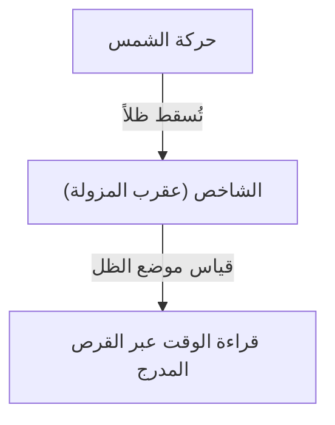
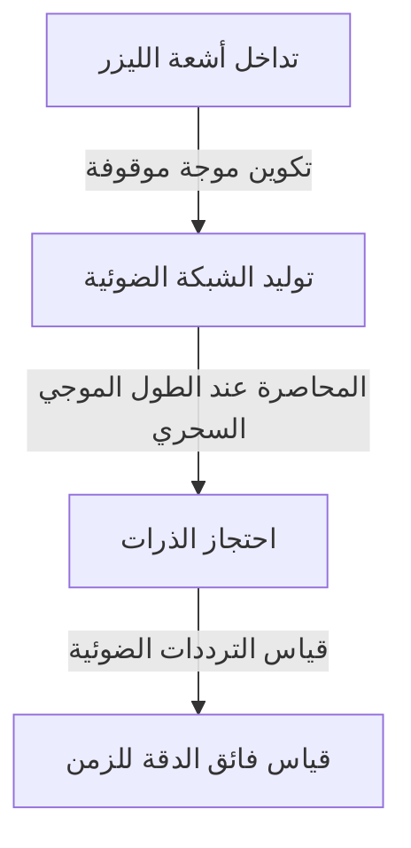

# 1. فجر قياس الزمن: من الأجرام السماوية إلى المزاول والساعات المائية

كانت أول وسيلة بدأت بها البشرية لقياس الوقت هي مراقبة حركة الأجرام السماوية. فكان توسط الشمس في كبد السماء (الزوال)، وأطوار القمر، وحركة النجوم بمثابة ساعات طبيعية لمعرفة الفصول وأوقات اليوم.

## مبدأ المزولة الشمسية
في حوالي عام 3500 قبل الميلاد، بدأ استخدام المزاول الشمسية (المسلات) في مصر القديمة وبابل.
وكان الوقت يُقسَّم عن طريق قياس طول وموضع ظل الشاخص (عقرب المزولة / Gnomon).

# 2. ولادة الساعات الميكانيكية ومتزامنة النواس

في أديرة أوروبا خلال العصور الوسطى، دعت الحاجة إلى أداء الصلوات في مواقيت محددة، فاخترعت ساعات ميكانيكية تعمل بقوة الأثقال المعلقة (الأوزان). ومع ذلك، كان معدل الخطأ فيها يصل إلى عشرات الدقائق يومياً.

## غاليليو وهيغنز
يُروى أن غاليليو غاليلي اكتشف «متزامنة النواس» عندما راقب ثريا تتأرجح في كاتدرائية بيزا. وتتحدد الدورة الزمنية للنواس $T$ بطوله $l$ وتسارع الجاذبية $g$.

$$ T = 2\pi \sqrt{\frac{l}{g}} $$

وفي عام 1656، طبّق كريستيان هيغنز هذا المبدأ وصنع أول ساعة بندولية، مما أدى إلى تقليص هامش الخطأ بشكل حاسم إلى بضع عشرات من الثواني يومياً.

# 3. الكرونومتر البحري وتحديد خطوط الطول

خلال عصر الاستكشاف، كانت هناك حاجة ماسة إلى ساعة بالغة الدقة لتحديد خط طول السفينة في عرض البحر. وقد نجح جون هاريسون في تطوير كرونومتر بحري نابضي يُدعى «H4»، وكان مقاوماً لتغيرات درجات الحرارة واضطراب حركة السفينة، مما أدى إلى حل معضلة خطوط الطول التاريخية.

# 4. ثورة ساعات الكوارتز

مع دخول القرن العشرين، ظهرت مذبذبات الكريستال (الكوارتز) التي تستفيد من التأثير الكهروإجهادي (البيزوكهربائي). فعند تطبيق جهد كهربائي على بلورة الكوارتز، فإنها تهتز بتردد شديد الاستقرار (عادةً 32,768 هرتز).

$$ f = \frac{1}{2l} \sqrt{\frac{E}{\rho}} $$
(حيث $E$ هو معامل يونغ، و $\rho$ هي الكثافة)

# 5. الساعات الذرية والنظرية النسبية

بوصفها ساعات أكثر دقة من ساعات الكوارتز، تم تطوير الساعات الذرية التي تعتمد على انتقال الذرات بين مستويات الطاقة. ويُعرَّف الجزء من الثانية حالياً بأنه مدة 9,192,631,770 دورة من الإشعاع المطابق للانتقال بين مستويي البنية فائقة الدقة في الحالة القاعية لذرة السيزيوم-133.

## نظرية النسبية لأينشتاين وتمدد الزمن
تتطلب الساعات الذرية المثبتة على متن أقمار نظام تحديد المواقع العالمي (GPS) تصحيحات مستمرة وفق النظرية النسبية الخاصة (تباطؤ الزمن بسبب السرعة) والنظرية النسبية العامة (تسارع تدفق الزمن مع ضعف الجاذبية).

تمدد الزمن وفق النظرية النسبية الخاصة:
$$ \Delta t' = \frac{\Delta t}{\sqrt{1 - \frac{v^2}{c^2}}} $$

# 6. ساعات الشبكة الضوئية: معيار الزمن للمستقبل

حالياً، تتسارع وتيرة الأبحاث حول «ساعات الشبكة الضوئية» لتجاوز حدود ساعات السيزيوم الذرية. وتعتمد هذه الساعة، التي ابتكرها البروفيسور هيديتوشي كاتوري وفريقه، على حجز ذرات عناصر مثل السترونشيوم داخل ما يشبه أطباق البيض الضوئية (الشبكة الضوئية) المتكونة بواسطة تداخل الليزر، وقياس الانتقالات لعشرات الآلاف من الذرات في آنٍ واحد.

تصل دقة ساعة الشبكة الضوئية إلى درجة عدم فقدان أو كسب ثانية واحدة حتى عبر عمر الكون بأكمله (حوالي 13.8 مليار سنة). وقد مكّن ذلك من فتح آفاق جديدة في الجيوديسيا النسبية (مثل قياس فروق الارتفاع بدقة تصل إلى سنتيمترات معدودة بناءً على اختلافات الجاذبية الناتجة عن تباين الارتفاع).
