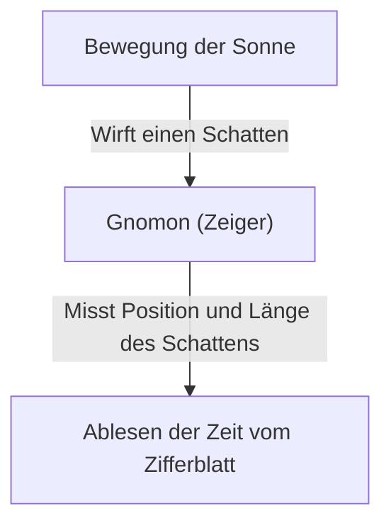
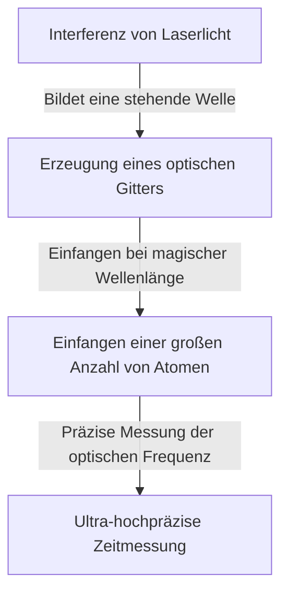

# Was ist Zeit: Die endlose Suche der Menschheit und der Uhren

„Zeit“ ist eines der vertrautesten und doch mysteriösesten Konzepte für uns Menschen. Obwohl die Zeit unsichtbar ist und nicht berührt werden kann, wird unser Leben vollständig von ihr bestimmt. Die Geschichte der Menschheit war eine ständige Herausforderung, wie diese „Zeit“ genau erfasst und gemessen werden kann. In diesem Artikel werden wir die Geschichte der menschlichen Zeitmessung und die Entwicklung der dahinterstehenden Physik, von antiken Sonnenuhren bis zu den neuesten optischen Gitteruhren, die Quantentechnologie nutzen, ausführlich erläutern.

## 1. Die Anfänge der Zeitmessung: Himmelsbewegungen und natürliche Zyklen

Die ersten Indikatoren, die die Menschheit zur Zeitmessung verwendete, waren die Bewegungen von Himmelskörpern wie Sonne, Mond und Sternen. Die Bewegung der Sonne vom Sonnenaufgang bis zum Sonnenuntergang, die Mondphasen und der Wechsel der Jahreszeiten waren unverzichtbare Informationen für Landwirtschaft, Jagd und religiöse Rituale.

### Die Geburt der Sonnen- und Wasseruhren
Um 3500 v. Chr. im alten Ägypten und Babylonien waren bereits „Sonnenuhren (Obelisken)“ im Einsatz. Dies war ein System zur Einteilung der Tageszeit durch Messung von Länge und Richtung des Schattens einer Säule (Gnomon), die senkrecht auf dem Boden stand.

Sonnenuhren hatten jedoch einen fatalen Fehler: Sie „konnten nachts oder an bewölkten Tagen nicht verwendet werden.“ Um dies zu kompensieren, wurden „Wasseruhren (Klepsydra)“ und „Feueruhren (Kerzenuhren und Räucheruhren)“ erfunden. Diese Werkzeuge, die die Zeit maßen, indem sie die Eigenschaft von mit konstanter Geschwindigkeit tropfendem Wasser oder die Geschwindigkeit, mit der Gegenstände brennen, nutzten, waren bahnbrechende Erfindungen, die nicht vom Wetter beeinflusst wurden.

## 2. Die Geburt mechanischer Uhren und die „Isochronie des Pendels“

Zu Beginn des Mittelalters in Europa wurden „mechanische Uhren“, die durch Gewichte angetrieben wurden, als Alarme erfunden, um zu festgelegten Zeiten in Klöstern zu beten. Frühe mechanische Uhren steuerten die Drehung von Zahnrädern mit einem Mechanismus namens Hemmung, waren jedoch leicht von Reibung und Temperaturschwankungen betroffen, was zu Fehlern von mehreren zehn Minuten am Tag führte.

### Galileis Entdeckung und Huygens' Erfindung
Was die Genauigkeit der Zeitmessung dramatisch verbesserte, war die Entdeckung der „Isochronie des Pendels“ durch den Physiker Galileo Galilei im 16. Jahrhundert. Dieses Gesetz, das besagt, dass die Zeit, die ein Pendel für das Hin- und Herschwingen benötigt, unabhängig von der Amplitude oder dem Gewicht ausschließlich durch die Länge des Pendels bestimmt wird, veränderte die Geschichte der Uhren maßgeblich. Die Periode $T$ eines Pendels wird durch die Länge $l$ und die Erdbeschleunigung $g$ wie folgt ausgedrückt:

$$ T = 2\pi \sqrt{\frac{l}{g}} $$

Im Jahr 1656 wandte der niederländische Wissenschaftler Christiaan Huygens dieses Prinzip an, um die weltweit erste „Pendeluhr“ zu bauen. Dadurch wurde der Fehler der Uhr drastisch auf einige zehn Sekunden pro Tag reduziert.

## 3. Das Zeitalter der Entdeckungen und das Längenproblem: Der Weg des Chronometers

Während des Zeitalters der Entdeckungen im 18. Jahrhundert wurde es zu einer nationalen Aufgabe, die genaue Position des eigenen Schiffes (insbesondere die Längengrade) zu kennen, um Seeunfälle zu vermeiden. Während der Breitengrad relativ einfach anhand der Höhe der Sonne oder des Polarsterns gemessen werden kann, muss man, um den Längengrad genau zu kennen, die „genaue Zeit des Abfahrtsortes“ mit der „Zeit des aktuellen Standortes“ vergleichen. Mit anderen Worten, es wurde eine äußerst genaue tragbare Uhr benötigt, die dem Schlingern eines Schiffes und starken Temperaturschwankungen standhalten konnte.

Der britische Uhrmacher John Harrison widmete sein Leben der Lösung dieses Problems. Er vollendete den Marinechronometer „H4“, der anstelle eines Pendels eine Zugfeder und eine Unruh (Spiralfeder) verwendete. Dies ermöglichte es der Menschheit, sicher auf den Weltmeeren zu navigieren und den ersten Schritt zur Globalisierung zu tun.

## 4. Die Quarzuhr-Revolution: Von mechanisch zu elektronisch

Zu Beginn des 20. Jahrhunderts verlagerte sich die Energiequelle von Uhren von mechanischen Dingen wie Zugfedern hin zu Elektrizität und elektronischen Schaltungen. Der entscheidende Faktor dafür war das Aufkommen der „Quarzuhr“.

Ein Quarzoszillator nutzt den „piezoelektrischen Effekt“, bei dem das Anlegen von Spannung an Quarz (Bergkristall) zu einer Verformung führt und umgekehrt eine Verformung Spannung erzeugt. Ein Quarzresonator schwingt äußerst stabil mit einer bestimmten Frequenz (bei Uhren im Allgemeinen 32.768 Hz).

$$ f = \frac{1}{2l} \sqrt{\frac{E}{\rho}} $$
($E$ ist der Elastizitätsmodul, $\rho$ ist die Dichte)

Im Jahr 1969 brachte die japanische Firma Seiko die weltweit erste kommerziell erhältliche Quarzarmbanduhr, die „Astron“, auf den Markt. Dies ermöglichte es jedem, eine ultra-hochpräzise Uhr mit einem Fehler von weniger als einer Sekunde pro Tag günstig zu erwerben, was einen Paradigmenwechsel in der Uhrenindustrie bewirkte.

## 5. Atomuhren und die Relativitätstheorie: Auf dem Weg zur Wahrheit des Universums

Während Quarzuhren sehr genau sind, sind winzige Fehler aufgrund individueller Unterschiede bei Kristallen und altersbedingter Verschlechterung unvermeidlich. Deshalb suchten Wissenschaftler nach einem Standard, der sich absolut nirgendwo im Universum ändert. Das ist das „Atom“.

Atomuhren verwenden die Frequenz von Mikrowellen, die von bestimmten Atomen (hauptsächlich Cäsium-133) absorbiert und emittiert werden, als Standard. Gegenwärtig ist die Länge einer Sekunde streng definiert als „die Dauer von 9.192.631.770 Perioden der Strahlung, die dem Übergang zwischen den beiden Hyperfeinstrukturniveaus des Grundzustands des Cäsium-133-Atoms entspricht“. Diese Genauigkeit ist erstaunlich und weicht nur um eine Sekunde in zig Millionen Jahren ab.

### Korrektur durch die Relativitätstheorie
Das für das moderne Leben unerlässliche GPS (Global Positioning System) beruht auf den genauen Zeitinformationen von Atomuhren, die auf künstlichen Satelliten installiert sind. Hierbei spielt jedoch Einsteins Relativitätstheorie eine wichtige Rolle.

1. **Spezielle Relativitätstheorie (Zeitdilatation durch Geschwindigkeit)**: Die Uhren auf Satelliten, die sich mit hoher Geschwindigkeit bewegen, laufen langsamer als Uhren auf der Erde.
   $$ \Delta t' = \frac{\Delta t}{\sqrt{1 - \frac{v^2}{c^2}}} $$
2. **Allgemeine Relativitätstheorie (Zeitvorsprung durch Schwerkraft)**: Die Uhren auf Satelliten im Weltraum, wo die Schwerkraft der Erde schwächer ist, laufen schneller als Uhren auf der Erde.

Wenn diese beiden Effekte nicht berechnet und der Gang der Uhren nicht ständig korrigiert wird, würde der Positionsfehler des GPS an einem einzigen Tag mehrere Kilometer erreichen. Dass unsere Smartphones genaue Positionen anzeigen können, verdanken wir der Relativitätstheorie.

## 6. Optische Gitteruhren: Höchste Präzision, die die Zukunft weist

Derzeit wird weltweit an „Optischen Gitteruhren (Optical Lattice Clocks)“ geforscht, die die Genauigkeit von Cäsium-Atomuhren um mehrere Größenordnungen übertreffen. Diese bahnbrechende Uhr wurde 2001 von Professor Hidetoshi Katori von der Universität Tokio und seinen Kollegen erdacht.

Der Mechanismus einer optischen Gitteruhr besteht darin, Atome wie Strontium in einem mikroskopischen Raum (optisches Gitter, sozusagen ein Eierkarton aus Licht), der durch interferierendes Laserlicht erzeugt wird, einzufangen und gleichzeitig die Übergänge von Zehntausenden von Atomen zu messen.

Die Genauigkeit der optischen Gitteruhr erreicht „10 hoch minus 18“, was die ultimative Genauigkeit darstellt, selbst nach Ablauf des Alters des Universums, etwa 13,8 Milliarden Jahre, nicht einmal um eine Sekunde abzuweichen.
Es wird erwartet, dass diese Ultra-Hochpräzision nicht nur zur Zeitmessung eingesetzt wird, sondern auch als Sensor, um „Unterschiede in der Schwerkraft aufgrund der Höhe (Unterschiede im Zeitverlauf)“ zu erfassen. Durch die Messung der Zeitabweichung, die durch einen Höhenunterschied von nur wenigen Zentimetern verursacht wird, werden beispielsweise völlig neue geodätische Technologien (relativistische Geodäsie) wie die Überwachung von Krustenbewegungen, die Erforschung unterirdischer Ressourcen und die Vorhersage von Vulkanausbrüchen möglich.

## Fazit

Die Geschichte der menschlichen Zeitmessung war eine Reise auf der Suche nach einer stabileren „Periode“, beginnend mit der groben Einteilung durch Sonnenuhren über Pendel, Zugfedern, Quarz und Atome. Und jetzt, mit der neuen Innovation der optischen Gitteruhr, ist die Zeit im Begriff, sich von etwas, das bloß „getickt wird“, zu etwas zu entwickeln, das „erforscht wird“ und die Verzerrung der Raumzeit liest. Hinter der „aktuellen Zeit“, die wir beiläufig überprüfen, verbirgt sich das großartige Drama von Jahrtausenden menschlicher Weisheit und Physik.
